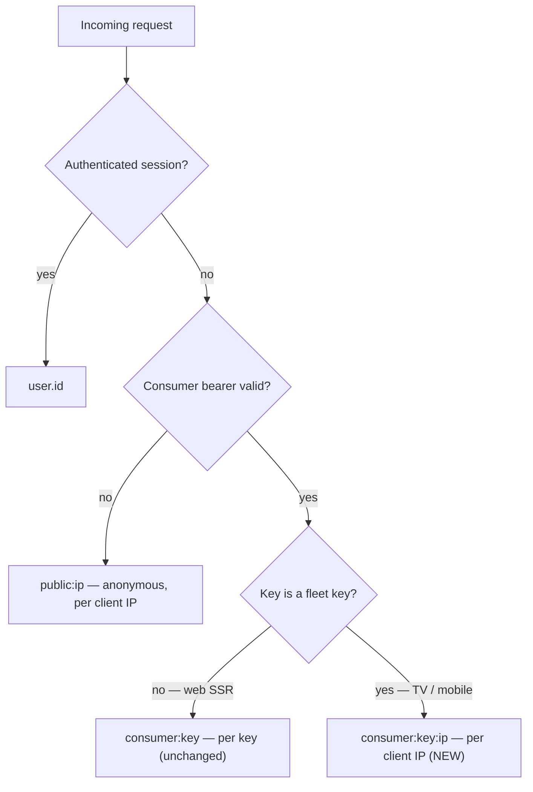
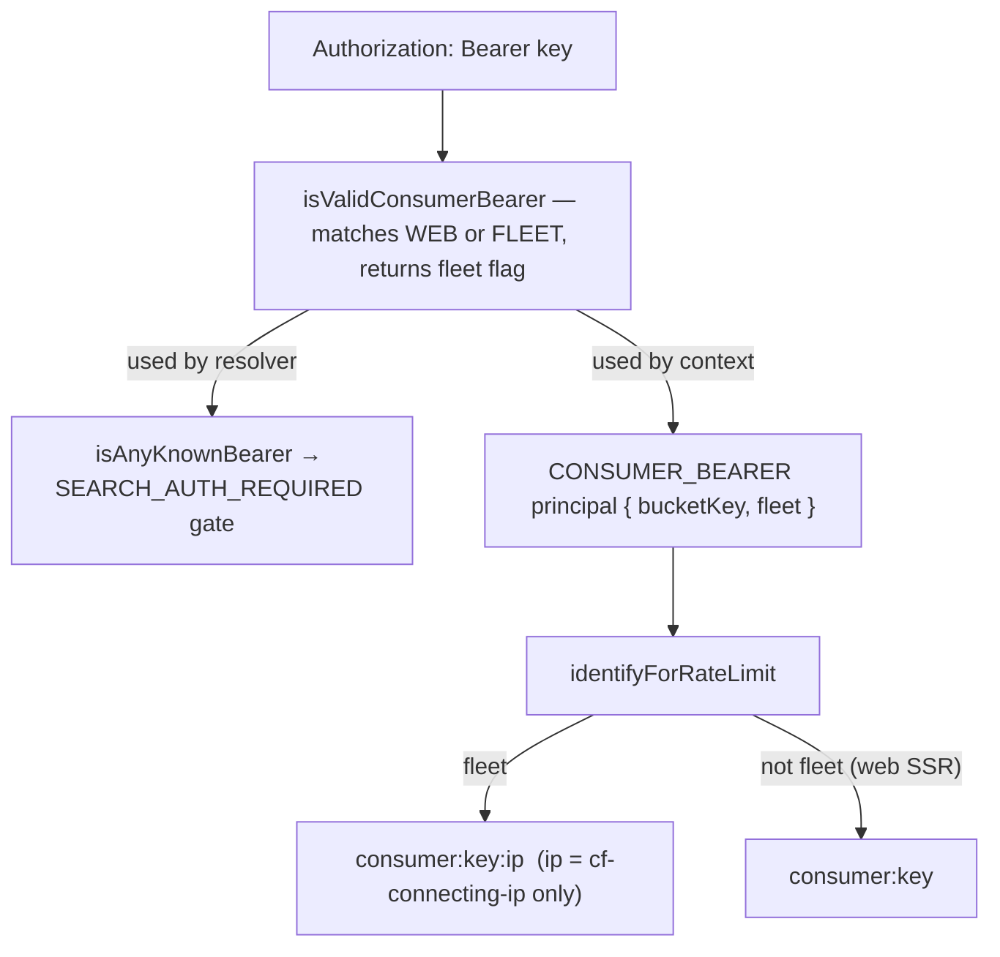

# Fleet-Aware Rate-Limit Bucketing - Plan

## Goal Capsule

- **Objective:** Give opt-in "fleet" consumer keys a per-device rate-limit bucket (`consumer:<key>:<ip>`) in admin's GraphQL limiter, so the TV and mobile search tokens can finally be provisioned without collapsing the whole fleet into one 60/min bucket. This unblocks search on TestFlight and production builds.
- **Product authority:** Urim. Admin permission for this specific work is confirmed by the requester (the standing "don't edit admin" default is waived here).
- **Open blockers:** None block planning. The admin change is self-contained and verifiable in isolation; search returning `200` on real builds is gated on the downstream provisioning + rebuild tail (see F1), not on the code.

---

## Product Contract

### Summary

Add a per-device dimension to the admin GraphQL rate limiter for keys designated as "fleet" keys: a fleet bearer buckets as `consumer:<key>:<ip>` instead of the flat `consumer:<key>`. Web SSR keys are untouched. This removes the self-DoS risk that has kept the TV and mobile search tokens embargoed, so both fleets can be provisioned and their search unblocked.

### Problem Frame

TV and mobile search fail on TestFlight/production with `401 UNAUTHENTICATED`. Admin's `SEARCH_AUTH_REQUIRED` gate is active, and the clients ship no consumer bearer — because provisioning the bearer is deliberately embargoed. Every install carries the _same_ baked-in key, and admin's limiter buckets a consumer bearer as a flat `consumer:<key>` with no device dimension (`apps/admin/src/graphql/plugins/rate-limit.ts:62-74`). Provisioning the token today would funnel every device's search into one 60/min bucket — a fleet-wide self-DoS, trivially weaponizable since the key is extractable from the JS bundle.

That flat bucket is correct for its original consumer, web SSR: multiple Railway instances behind one shared egress IP, where a per-key bucket beats collapsing onto a NAT'd IP (`docs/solutions/architecture-patterns/consumer-bearer-rate-limit-identity-pattern-20260513.md`). A device fleet is the inverse — many device IPs, one shared key — so it needs the per-IP shape that anonymous traffic already gets. The embargo (fleet doc provisioning rule #4) waits on exactly this change, which has no admin ticket yet.

### Key Decisions

- **Opt-in per key, not blanket.** Web SSR must keep `consumer:<key>` (shared egress IP); fleets need per-IP. Fleet-awareness is therefore a per-key designation that keeps web's per-key _contract_ unchanged; the invariant test at `rate-limit.test.ts:91` is extended (not left untouched) with fleet cases alongside the preserved web case. Applying per-IP to all consumer keys is rejected — it changes web's bucket semantics for no benefit.
- **`consumer:<key>:<ip>`, not `public:<ip>`.** Keep fleet search in its own namespace rather than merging it into the anonymous IP bucket. This isolates authed search from a device's anonymous browse traffic on the same IP and leaves room to tune a fleet-specific limit later.
- **Reuse the disjoint-CSV bearer pattern.** The fleet-key list is another entry in admin's existing multi-CSV bearer set (`BEARER_CSV_KEYS` + `assertBearerCsvsDisjoint`, `apps/admin/src/config/env.ts:803-906`), and bucketing reuses the existing raw `getClientIp`. No new config primitive, no new IP handling.
- **One mechanism, both fleets.** Mobile's prod token is embargoed for the identical reason TV's is. A single per-key fleet flag covers TV and mobile now, and any future fleet client, with zero further admin edits.

The new bucket decision:

### Requirements

**Bucketing behavior**

- R1. A consumer bearer designated "fleet" buckets per client IP: its rate-limit identity is `consumer:<key>:<ip>`, where `<ip>` is the trusted client IP defined in R8.
- R2. Non-fleet consumer bearers (web SSR) keep the existing `consumer:<key>` per-key identity, unchanged.
- R3. Fleet keys keep the existing 60/min search limit — the change alters the bucket key, not the ceiling. Each client IP gets its own 60/min search budget (see the carrier-NAT residual under Scope Boundaries).
- R4. A fleet key still authenticates as a `CONSUMER_BEARER` principal and passes `SEARCH_AUTH_REQUIRED`; the fleet designation affects rate-limit identity only, never permissions (which stay empty).

**Config & safety**

- R5. Fleet keys are configured as their own allowlist, disjoint from `WEB_ADMIN_API_KEYS`, enforced by the existing boot-time disjointness invariant. TV and mobile each get a dedicated fleet key.
- R6. Key values are never logged, matching the existing consumer-bearer and rate-limit scrubbing contract; any disjointness-violation error redacts key values.
- R7. When the trusted client IP is absent, a fleet key buckets as `consumer:<key>:unknown` — inside the fleet namespace (per Key Decision #2), never the anonymous `public:unknown` bucket and never a single shared `consumer:<key>`.
- R8. The fleet `<ip>` dimension derives only from the Cloudflare-authoritative `cf-connecting-ip`; it must never fall back to the client-supplied `x-forwarded-for` for the bucket key. When `cf-connecting-ip` is absent, treat the request as no-trusted-IP (R7) rather than trusting `x-forwarded-for` — otherwise an attacker holding the extracted key could spoof `x-forwarded-for` to mint unlimited buckets or pin a victim's bucket.

### Acceptance Examples

- AE1. **Covers R1, R2.** Given a fleet key `F` and a web key `W`. When two requests carry `F` from IPs `1.1.1.1` and `2.2.2.2`, they bucket separately (`consumer:F:1.1.1.1`, `consumer:F:2.2.2.2`). When two requests carry `W` from those same IPs, they share one bucket (`consumer:W`).
- AE2. **Covers R4.** Given `SEARCH_AUTH_REQUIRED` active. When a request carries fleet key `F` on `SemanticSearch`, auth passes (eligible for `200`) and it buckets per device. When it carries no bearer, it still returns `401` — unchanged.
- AE3. **Covers R7.** Given fleet key `F` and no trusted client IP (`cf-connecting-ip` absent). When a request carries `F`, it buckets as `consumer:F:unknown` — inside the fleet namespace, not the anonymous `public:unknown` bucket and not a shared `consumer:F`.
- AE4. **Covers R8.** Given fleet key `F` presented with a spoofed `x-forwarded-for` and no `cf-connecting-ip`. The request cannot create a distinct `consumer:F:<spoofed-ip>` bucket — it buckets as `consumer:F:unknown` (R7), so rotating `x-forwarded-for` cannot mint fresh buckets.

### Key Flows

- F1. Rollout to search-returns-200 (receiver-first)
  - **Trigger:** The admin bucketing change (R1–R8) is merged and ready to deploy.
  - **Preconditions (blocking, before provisioning any token):** (a) confirm Cloudflare AOP is enforced and the raw `*.up.railway.app` admin origin is unreachable/403 — probe and RECORD the result (R8 integrity rests entirely on this); (b) land a real abuse ceiling on the search path (a Cloudflare edge rate-limit keyed on the fleet bearer, or an app-level global per-fleet-key counter) with anomaly alerting, since per-IP alone does not bound an IP-rotating extracted key.
  - **Steps:** (1) Deploy admin with the fleet branch AND the dedicated TV + mobile fleet keys already in admin's fleet allowlist — receiver first. (2) Provision `EXPO_PUBLIC_ADMIN_GRAPHQL_TOKEN` (each surface's own fleet key) in the mobile and TV EAS `production` + `preview` environments. (3) Cut new EAS builds and ship to TestFlight / store. (4) Keep old fleet keys valid in admin's allowlist through a multi-week rotation overlap until install metrics confirm the new binaries reached the fleet.
  - **Rollout gate:** the admin-side `source=fleet` signal confirms fleet traffic is bucketing per-IP, and the `consumer:<key>:unknown` share stays near-zero — a rising `:unknown` share means a `cf-connecting-ip` drop / AOP regression collapsing the fleet, to catch before it reads as an unexplained search outage.
  - **Outcome:** TV and mobile search return results on TestFlight/production, each device bucketed independently (per trusted client IP) at 60/min.

### Scope Boundaries

- **In scope:** the admin GraphQL rate-limiter fleet branch, the fleet-key config list + disjointness registration, the principal fleet designation, and test updates (extend `rate-limit.test.ts`, including the per-key invariant case).
- **Deferred for later:** IPv6 `/64` grouping (raw IP matches all existing admin behavior for v1; `/64` is a hardening follow-up); an independent per-fleet-key limit knob (kept at 60/min for v1).
- **Accepted residual — carrier-NAT collapse:** per-IP means devices behind shared/carrier NAT (common on the mobile cellular fleet) share one `consumer:<key>:<ip>` bucket — a bounded, partial return of the shared throttle, the inverse of the IPv6-rotation case. `rate-limit.test.ts:91` documents the per-key bucket existing for exactly this CGNAT reason. A client-sent per-install device-id would give true per-device isolation but is spoofable (re-opening the R8 bucket-minting attack), so per-IP is the correct v1 primitive. **Adequacy resolved:** the fleet limit is server-side-tunable without a client rebuild, so v1 ships at the existing 60/min and F1 watches CGNAT concurrency via the `source=fleet` / `:unknown` signals; if honest users behind one carrier IP hit 429s, raise the fleet-key limit (a config change) rather than rebuild.
- **Outside this work:** any change to web SSR's bucket; the REST `/api/search` limiter (already per-IP); switching clients to REST search; changing `SEARCH_AUTH_REQUIRED`; the key minting, EAS provisioning, and client builds themselves (sequenced in F1 as dependencies, but not the admin deliverable).

### Dependencies / Assumptions

- **Cloudflare sets `cf-connecting-ip`** in front of admin (live-verified: `server: cloudflare` on `admin.jesusfilm.org`), and admin's existing anonymous bucketing already trusts it. Cloudflare overwrites any client-supplied `cf-connecting-ip`, so it is unspoofable **as long as the origin is unreachable except via Cloudflare** — confirm at planning that Authenticated Origin Pulls is enforced on the admin service and the raw `*.up.railway.app` host isn't exposed (a direct origin hit could forge the header). R8 keeps the fleet bucket off the spoofable `x-forwarded-for` fallback.
- **Client plumbing is already done.** TV and mobile ship the operation-scoped bearer (`authHeadersForOperation` → `SemanticSearch` only; TV `apps/tv/src/lib/apolloClient.ts`, mobile PR #1226). No client code change is needed for bucketing — only token provisioning (F1).
- **Both fleets are embargoed today.** Neither TV nor mobile ships a prod token; verified via `eas env:list` (TV) and `apps/mobile/.env.example` (mobile).

### Success Criteria

- The admin change is verifiable in isolation before any client work: a fleet key buckets per IP (AE1), web keys are provably unchanged (AE1), and no key value appears in logs (R6).
- Honest gate: search returning `200` on real TestFlight/production builds is delivered by F1 completing (token provisioned + new build shipped), not by the merge alone.

### Outstanding Questions

**Resolved during planning** (see Planning Contract)

- Fleet-matcher shape → extend `isValidConsumerBearer` with a `fleet` discriminator (KTD1).
- IPv6 → raw `/128` for v1 (KTD5); `/64` grouping deferred as hardening.

**Deferred**

- A full fleet-observability dashboard / alert on `source=fleet` volume and the `consumer:*:unknown` share. The minimal `source=fleet` marker (U4) and the `:unknown`-share F1 rollout gate ship in this plan; the dashboard is the follow-up.

(AOP enforcement and the abuse-ceiling companion control moved from Deferred to BLOCKING F1 preconditions — see Planning Contract › Assumptions & Dependencies and F1.)

### Sources / Research

- Grounding dossier (verbatim quotes + `file:line`): `/private/tmp/claude-501/-Users-urimchae-Documents-GitHub-forge-apps-tv/066725ca-b5d2-4810-84bb-78d835070918/scratchpad/fleet-bucketing-grounding.md`.
- `apps/admin/src/graphql/plugins/rate-limit.ts:62-74` — `identifyForRateLimit`, the flat `consumer:<key>` branch to extend.
- `apps/admin/src/graphql/context.ts:76-80` + `apps/admin/src/auth/principal.ts:119-129` — where the `CONSUMER_BEARER` principal + `rateLimitBucketKey` are minted.
- `apps/admin/src/config/env.ts:803-906` — `BEARER_CSV_KEYS` + `assertBearerCsvsDisjoint`, the pattern the fleet-key list should follow.
- `apps/admin/src/graphql/plugins/rate-limit.test.ts:91` — the "per-key, not per-IP" invariant test that a fleet branch updates.
- `docs/solutions/architecture-patterns/fleet-client-bearer-must-be-operation-scoped-not-global.md` (rule #4, the embargo) and `docs/solutions/architecture-patterns/consumer-bearer-rate-limit-identity-pattern-20260513.md` (why the per-key bucket exists for web SSR).
- `docs/plans/2026-06-30-001-perf-tv-client-performance-sweep-plan.md` — KTD4/U7 and the Risks entry that names this admin dependency.

---

## Planning Contract

**Product Contract preservation:** unchanged. All requirements (R1–R8), acceptance examples (AE1–AE4), the Key Flow (F1), and Key Decisions carry forward verbatim; this enrichment adds only the Planning Contract, Implementation Units, Verification Contract, and Definition of Done.

### Key Technical Decisions

- KTD1. **One matcher, two surfaces — extend `isValidConsumerBearer`.** The `SEARCH_AUTH_REQUIRED` gate (`isAnyKnownBearer`, `apps/admin/src/auth/search-bearer.ts:96`) delegates its CONSUMER branch to `isValidConsumerBearer`, and the rate-limit principal is minted from the same function (`apps/admin/src/graphql/context.ts:76`). Extending that single matcher to also recognize the fleet CSV — returning a `fleet` discriminator — covers both the auth gate and the per-IP bucketing without a separate fleet validator or a new `isAnyKnownBearer` branch.
- KTD2. **New disjoint `FLEET_ADMIN_API_KEYS` CSV via the `BEARER_CSV_KEYS` pattern.** Add it to the `BEARER_CSV_KEYS` const AND to the `assertBearerCsvsDisjoint({...})` boot call (`apps/admin/src/config/env.ts:803-906`) so a value shared with `WEB_ADMIN_API_KEYS` fails the boot (R5). The `satisfies` guard only auto-aligns the `BearerCsvSnapshot` mapped type — it does NOT force the boot-call argument (its fields are optional), so a missed arg silently no-ops the fleet check; U1 pins the boot-call wiring with a test. No new config primitive.
- KTD3. **`fleet` is a Principal flag, not a new role.** The principal stays `CONSUMER_BEARER` (permissions remain empty — R4); `fleet?: boolean` is a bucketing-only discriminant that `identifyForRateLimit` reads. The permission matrix is untouched.
- KTD4. **`getTrustedClientIp` — `cf-connecting-ip` only, no `x-forwarded-for` (R8).** The fleet `<ip>` dimension uses a new trusted-IP reader returning `cf-connecting-ip` or `"unknown"`, never the spoofable `xff` first-hop. The existing `getClientIp` (with its `xff` fallback) is unchanged and still serves anonymous `public:<ip>` bucketing.
- KTD5. **Raw IPv6 for v1.** The fleet bucket uses the raw IP string, matching every existing admin IP path (no `/64` normalization exists anywhere); `/64` grouping is deferred hardening.

### Alternatives Considered

- **Switch the clients to REST `/api/search` (already per-IP) instead of changing the limiter.** Declined per the product decision to build the admin primitive: it would discard the shipped GraphQL search + scoped-bearer plumbing (the perf-sweep plan's U7 / PR #1226), drop to 30/min, and require client rework with no drop-in response-shape parity — and would still inherit the CGNAT (R3 residual) and per-IP `xff` (R8) concerns since REST is also per-IP. Revisitable if the admin maintenance surface proves not worth it; not built now.
- **Apply per-IP to all consumer keys (drop the fleet flag).** Declined — changes web SSR's `consumer:<key>` bucket semantics (shared egress IP) for no benefit and breaks the preserved per-key invariant test.

### High-Level Technical Design

One matcher feeds both the auth gate and the rate-limit identity; the `fleet` flag rides the principal to the limiter:

### Assumptions & Dependencies

- **Cloudflare AOP enforced** on the admin service (origin unreachable except via Cloudflare) so `cf-connecting-ip` is unspoofable — the whole of R8 rests on this. Elevated to a BLOCKING, probe-verified F1 precondition (not a deploy afterthought): confirm the raw `*.up.railway.app` origin is unreachable/403 AND AOP is on, result recorded, BEFORE any fleet token ships. If AOP regresses, a direct origin hit forges `cf-connecting-ip` and defeats R8.
- **Per-IP is not an abuse ceiling.** Per-IP bucketing fixes fleet self-DoS but does NOT bound an attacker who extracts the baked-in key and rotates IPs (cheap IPv4 proxies, IPv6 `/128` rotation) against the paid-embedding search path. A real ceiling — a Cloudflare edge rate-limit on the search path keyed on the fleet bearer, or an app-level global per-fleet-key counter with anomaly alerting — is a REQUIRED companion control before the fleet token ships (F1 precondition), not part of this bucketing primitive.
- **Fleet keys pass the two public manifest routes** (`watch-route-manifest`, `watch-seo-manifest`, which call `isValidConsumerBearer(...).valid`). Accepted: public data, zero permissions; no per-route rejection added. A future NON-public route gated on `.valid` must branch on the new `fleet` discriminator or it would silently admit fleet keys.
- **Redis bucket cardinality.** The per-IP dimension adds one `consumer:<key>:<ip>` key per active device IP (alongside its `public:<ip>` browse bucket); the envelop `RedisStore` windowed limiter expires idle buckets, so cardinality is bounded by the active-IP population per window. Raw IPv6 (KTD5) lets a v6 device spray buckets via privacy-extension rotation — a further reason `/64` grouping is the deferred hardening.
- **Inert until provisioned.** All units land safely with `FLEET_ADMIN_API_KEYS` unset — no fleet key exists, so the new branch never fires and behavior is identical to today. Provisioning + rebuild is F1 (out of scope).

### Sequencing

Land U1–U5 together in one PR (coherent unit; inert without a provisioned fleet key). U6 (docs) can accompany or follow. F1's provisioning/rollout is downstream and out of scope.

---

## Implementation Units

### U1. Add `FLEET_ADMIN_API_KEYS` env + disjointness registration

- **Goal:** a new optional fleet-key allowlist, provably disjoint from the other bearer CSVs at boot.
- **Requirements:** R5, R6.
- **Files:** `apps/admin/src/config/env.ts`; disjointness test beside the existing bearer-CSV tests (e.g. `apps/admin/src/config/env.test.ts`).
- **Approach:** add `FLEET_ADMIN_API_KEYS: z.string().optional()`; append `"FLEET_ADMIN_API_KEYS"` to `BEARER_CSV_KEYS`; AND add `FLEET_ADMIN_API_KEYS: env.FLEET_ADMIN_API_KEYS` to the `assertBearerCsvsDisjoint({...})` boot call (`env.ts:895-906`). The boot-call arg is the load-bearing step — the `satisfies` guard only aligns the mapped type and the boot-call fields are optional, so a forgotten arg would silently skip the fleet check with no compile error.
- **Patterns to follow:** the 10-entry `BEARER_CSV_KEYS` block + `assertBearerCsvsDisjoint` (`apps/admin/src/config/env.ts:803-906`).
- **Test scenarios:** Covers R5, R6. A value present in BOTH `FLEET_ADMIN_API_KEYS` and `WEB_ADMIN_API_KEYS` → boot throws, error names the CSV pair, value redacted. Disjoint fleet + web keys → no throw. Unset/empty `FLEET_ADMIN_API_KEYS` → no throw. The collision test must exercise the REAL module-load boot call (import `env`), not a hand-built `assertBearerCsvsDisjoint({...})` snapshot — only that proves the boot-call arg was added; extend the existing env module-load wiring assertion so it fails if `FLEET_ADMIN_API_KEYS` is missing from the boot call.
- **Verification:** the env module boots with a disjoint fleet key; the collision case is covered by a test.

### U2. Extend `isValidConsumerBearer` to match the fleet CSV + return `fleet`

- **Goal:** recognize fleet keys and flag which allowlist matched.
- **Requirements:** R4, R5, R6.
- **Dependencies:** U1.
- **Files:** `apps/admin/src/auth/consumer-bearer.ts`; `apps/admin/src/auth/consumer-bearer.test.ts`.
- **Approach:** parse `WEB_ADMIN_API_KEYS` and `FLEET_ADMIN_API_KEYS` into separate allowlists; iterate both timing-safe without short-circuiting; a fleet-list match sets `fleet: true`, a web-list match `fleet: false`. `ConsumerBearerResult`'s valid arm gains `fleet: boolean`. Additive — all four existing callers read `.valid`; only one (`context.ts`) also reads `.bucketKey`.
- **Patterns to follow:** the current non-short-circuit timing-safe loop with the `Buffer` length precheck in `consumer-bearer.ts`.
- **Test scenarios:** Covers R4, R5. web key → `{valid:true, fleet:false}`; fleet key → `{valid:true, fleet:true}`; unknown key → `{valid:false}`; the existing no-raw-header/no-key log-leak assertion still holds; a fleet key matches even though the web list is scanned first.
- **Verification:** fleet and web keys both validate with the correct `fleet` value; unknown rejected; no key logged.

### U3. Thread `fleet` onto the CONSUMER_BEARER principal

- **Goal:** carry the flag from matcher to rate-limit context.
- **Requirements:** R1, R4.
- **Dependencies:** U2.
- **Files:** `apps/admin/src/auth/principal.ts`; `apps/admin/src/graphql/context.ts`; the matching principal/context test.
- **Approach:** `Principal` gains `fleet?: boolean`; `CONSUMER_BEARER_PRINCIPAL` accepts `fleet`; `context.ts` passes `consumer.fleet` when minting. Role stays `CONSUMER_BEARER`; permissions untouched (R4).
- **Test scenarios:** Covers R1, R4. context mints a principal with `fleet:true` for a fleet key and `fleet:false` for a web key; the fleet principal's permission set stays empty (no widening vs `CONSUMER_BEARER_PERMISSIONS`).
- **Verification:** minted principal carries the right `fleet`; consumer-bearer permissions still empty.

### U4. Per-IP fleet branch in `identifyForRateLimit` + `getTrustedClientIp`

- **Goal:** the actual bucket change.
- **Requirements:** R1, R2, R3, R7, R8.
- **Dependencies:** U3.
- **Files:** `apps/admin/src/graphql/plugins/rate-limit.ts`; `apps/admin/src/graphql/plugins/rate-limit.test.ts`.
- **Approach:** add `getTrustedClientIp(request)` = `cf-connecting-ip ?? "unknown"` (no `xff`). In `identifyForRateLimit`, the `CONSUMER_BEARER` branch: if `user.fleet` → `consumer:${bucketKey}:${getTrustedClientIp(request)}`; else `consumer:${bucketKey}` (unchanged). `rateLimitConfigByField` untouched (R3). Emit a plain-string `source=fleet` marker (or a fleet-hit counter) on the fleet branch — never the key value (R6) — so operators can confirm admin-side that fleet traffic is bucketing per-IP in prod; this is the signal F1's rollout gate reads (a fleet key otherwise logs as `source=consumer`, indistinguishable from web SSR).
- **Execution note:** extend the existing per-key invariant test (`rate-limit.test.ts:91`) rather than replacing it — the web-key case stays green; add the fleet cases beside it.
- **Test scenarios:** Covers AE1, AE3, AE4. Fleet key from `1.1.1.1` and `2.2.2.2` → two buckets `consumer:k:1.1.1.1` / `consumer:k:2.2.2.2` (AE1 fleet half). Web key (fleet:false) from two IPs → one `consumer:k` (preserve `:91`, R2). Fleet key with no `cf-connecting-ip` → `consumer:k:unknown` (AE3, R7). Fleet key with a spoofed `x-forwarded-for` and no `cf-connecting-ip` → `consumer:k:unknown`, NOT `consumer:k:<xff>` (AE4, R8). Config still caps `!(watchVideoRouteSnapshotBySlug)` at 60/min (R3). The fleet branch emits `source=fleet` and never the key value (R6).
- **Verification:** fleet buckets per trusted IP; web unchanged; `xff` never appears in a fleet bucket.

### U5. Prove the search-auth gate accepts fleet keys

- **Goal:** confirm `SEARCH_AUTH_REQUIRED` passes for fleet keys — the emergent cross-surface contract from KTD1.
- **Requirements:** R4 (Covers AE2).
- **Dependencies:** U2.
- **Files:** `apps/admin/src/auth/search-bearer.test.ts`.
- **Approach:** no production change — `isAnyKnownBearer`'s consumer branch already delegates to `isValidConsumerBearer`. Add a test asserting a provisioned fleet key returns `{valid:true, source:"consumer"}` and an unknown key returns `{valid:false}`.
- **Test scenarios:** Covers AE2. Fleet key → `isAnyKnownBearer` valid (source `consumer`); anonymous → invalid.
- **Test expectation:** behavioral test only; no production code in this unit — it guards the emergent gate-pass so a future refactor of the consumer branch can't silently 401 the fleet.
- **Verification:** a fleet key passes the passport, so the gate returns 200 not 401.

### U6. Document the fleet env var + deploy ordering

- **Goal:** operator- and agent-discoverable docs for provisioning.
- **Requirements:** supports F1.
- **Dependencies:** U1–U4.
- **Files:** `apps/admin/CLAUDE.md` (a "Fleet-aware rate-limit bucketing" subsection near the rate-limit / search-auth docs); `apps/admin/.env.example` if present.
- **Approach:** document `FLEET_ADMIN_API_KEYS`, the `consumer:<key>:<ip>` bucket shape, `cf-connecting-ip`-only (R8) + the AOP dependency, the disjointness requirement, receiver-first deploy ordering (land fleet keys in admin BEFORE EAS provisioning), the weeks-long rotation overlap for store binaries, and an abuse-incident runbook: CSV rotation + redeploy revokes a compromised fleet key fleet-wide immediately (accepting that fleet search breaks until a new build ships), with a Cloudflare edge block of the abusive pattern as the no-user-impact interim — env-CSV keys have no sub-second per-key revocation like the DB-backed partner store.
- **Test expectation:** none — documentation.
- **Verification:** the env var and its provisioning rules are discoverable in `apps/admin/CLAUDE.md`.

---

## Verification Contract

| Gate       | Command                                | Applies to | Done signal                                                                                                           |
| ---------- | -------------------------------------- | ---------- | --------------------------------------------------------------------------------------------------------------------- |
| Unit tests | `pnpm --filter @forge/admin test`      | U1–U5      | fleet + web bucket cases, disjointness, matcher, and search-gate cases green; the `:91` web per-key case still passes |
| Typecheck  | `pnpm --filter @forge/admin typecheck` | U1–U4      | `BearerCsvSnapshot` satisfies-guard and the `fleet` field compile                                                     |
| Lint       | `pnpm --filter @forge/admin lint`      | all        | clean                                                                                                                 |

No live-DB / integration harness — matches the existing pure-unit posture of `rate-limit.test.ts` and `consumer-bearer.test.ts`.

---

## Definition of Done

- A fleet-flagged consumer key buckets `consumer:<key>:<cf-connecting-ip>`, and a spoofed `x-forwarded-for` cannot create a distinct bucket (AE1 fleet half, AE4, R8).
- A non-fleet consumer key still buckets `consumer:<key>` — the `:91` per-key invariant test passes unchanged (R2).
- A no-`cf-connecting-ip` fleet request buckets `consumer:<key>:unknown`, never the anonymous `public:unknown` or a shared `consumer:<key>` (AE3, R7).
- A provisioned fleet key passes `isAnyKnownBearer` / `SEARCH_AUTH_REQUIRED` (AE2, R4) and carries zero permissions (R4).
- `FLEET_ADMIN_API_KEYS` is disjoint from `WEB_ADMIN_API_KEYS` at boot; key values are never logged (R5, R6).
- With `FLEET_ADMIN_API_KEYS` unset, behavior is identical to today (inert).
- The fleet branch emits an admin-side `source=fleet` marker (never the key value) so F1 can verify per-IP bucketing in prod (R6).
- Typecheck, lint, and `pnpm --filter @forge/admin test` are green.
- `apps/admin/CLAUDE.md` documents the env var, the `cf-connecting-ip` / AOP dependency, disjointness, and receiver-first deploy ordering.
- Out of scope (F1): minting keys, EAS provisioning, client rebuild, rollout — search-returns-200 is delivered by F1, not this plan. F1 carries two BLOCKING preconditions before any token ships: AOP probe-verified (R8) and a real abuse ceiling (edge / global per-key limit) on the search path.
