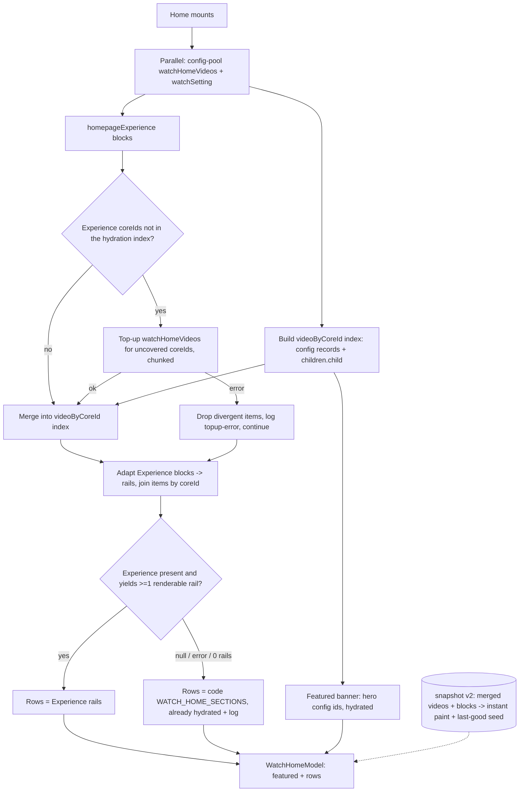

# TV Home Content Parity - Plan

## Goal Capsule

- **Objective:** Point TV Home's rows at the single admin `watch-home` Experience that web and mobile already render, so row curation is editor-controlled from one place — while TV's focus-driven showcase, client-owned featured banner, and precise series routing stay unchanged. Fall back to today's code curation when the Experience is unavailable.
- **Product authority:** Urim (owns TV / mobile / web frontend; has explicit permission to make the admin-side change for this feature).
- **Open blockers:** None remaining. The load-bearing hydration blocker was verified against live prod and resolved by an admin bridge that is now in scope.
- **Execution profile:** Deep. Spans `apps/admin` (one additive public field, reusing the existing batched loader), `packages/admin-graphql` (regenerate introspection + shared fragment), and `apps/tv` (the bulk of the work). Consumer-safe deploy ordering (below). Mirror mobile PR #1486 where the shape matches; diverge where TV hydrates rather than rendering flat items.
- **Stop conditions:** Surface a blocker rather than guess if the live Experience diverges from these assumptions — a `coreId` that will not resolve, a block type with no rail slot, or a coreId set exceeding the `watchHomeVideos` cap that chunking can't absorb.

**Product Contract preservation:** changed. R3 and R4 are corrected — hydration keys on the item's `coreId` (exposed by a new admin bridge, R17), not `videoId`, because live-prod verification proved `videoId` is the Video cuid and does not hydrate through `watchHomeVideos`. R10, R12, and R13 are refined for the two-fetch shape; R17 (admin `coreId`) and AE14 (top-up degrade) are added. The "no admin change" scope boundary is lifted (the user authorized the admin work). The former "config-pool-limited hydration" trade-off is removed — the bridge delivers full editor parity. All other Product Contract IDs (R1–R2, R5–R9, R11, R14–R16, F1–F4, AE1–AE13, A1–A3) are preserved.

---

## Product Contract

### Summary

Point TV Home's rows at the single admin `watch-home` Experience web and mobile already render. An adapter reads the Experience's curated `MediaCollectionBlock`s to decide which items appear in which rows and in what order, then hydrates each item — keyed on a `coreId` the admin now exposes on the item — through TV's existing bulk `watchHomeVideos` fetch, so every card carries a real record (label, child count, duration). This preserves the focus-driven showcase, the client-owned featured banner, series-vs-video routing, and exact episode counts, and works for any editor-curated video, not only ones TV hardcodes. When the Experience is unavailable or yields no renderable rows, TV renders today's code curation.

### Problem Frame

Web and mobile render their Home body from a single admin homepage Experience (`watch-home`), now published in prod. An editor changes it once and both surfaces update.

TV does not. feat-179 shipped TV's focus-driven showcase against a code-curated copy of `WATCH_HOME_SECTIONS` plus a hero pool, and deliberately stopped reading `homepageExperience` — that Experience was empty at the time. Since then web and mobile moved onto the Experience (mobile via PR #1486, 2026-07-08), leaving TV the only platform still hand-mirroring the curation in code. feat-179's own requirements named this consolidation as the deferred follow-up.

Live-prod verification (2026-07-09) surfaced why a naive port fails: the admin item's `videoId` is the Video's internal cuid, not the `coreId` TV's public `watchHomeVideos` accepts, and the item's `videoSlug` is null — so TV cannot look up an arbitrary editor-curated video from the Experience payload alone. Hydration succeeds today only because the Experience mirrors TV's config pool 1:1, which breaks the instant an editor diverges. The fix is a small admin bridge exposing the item's `coreId`.

### Key Decisions

- **Hydrate by the item's `coreId` via an admin bridge; do not render flat.** The admin exposes a public `coreId` on each `MediaCollectionBlock` item (R17). TV maps each Experience item to its `coreId`, hydrates through the existing bulk `watchHomeVideos` fetch, and builds cards from the hydrated record — so the banner keeps descriptions, cards show exact "N episodes"/duration, and series-vs-video routing is precise and direct (no `/watch → /series` redirect). Rendering the flat Experience items (mobile's approach) was rejected for TV: it coarsens the meta chip and, because `videoSlug` is null in prod, cannot even navigate. The `videoId`-as-`coreId` approach the requirements first assumed was verified impossible against live prod.
- **The featured banner stays client-owned; only the rows move to admin.** The featured set that drives the banner stays curated in TV code (`WATCH_HOME_HERO_SOURCE_IDS`) and hydrated for its descriptions — matching web and mobile, whose heroes are also code-owned and whose Experience carries only an inert `WatchHomeHeroBlock` placeholder.
- **Config becomes the fallback, and it must stay hydratable.** When the Experience is null, errors with no last-good body, or yields zero renderable rails, TV renders today's code-curated rows. The same bulk fetch always includes the config pool (R4) so the fallback renders without a second fetch. The banner renders in every case.
- **Adapter, not the SDUI renderer.** Map the Experience's blocks into TV's existing rail/card model so `HomeRail`, `HomeCard`, and the focus-driven showcase render unchanged. The SDUI pipeline stays in use by `/experience/[slug]`.
- **Each Experience item is one card.** A curated collection in a row renders as one series card that routes to the series screen — matching web. Non-`MediaCollection` blocks are skipped; the mission tail stays static.

### Actors

- A1. Content editor — authors and edits the shared `watch-home` Experience in admin; wants row curation changes (including net-new videos) to reach TV without a code change or app build.
- A2. TV viewer — opens the app; sees the same curated rows as web in TV's focus-driven layout, with the banner, series routing, and episode counts intact.
- A3. TV app — fetches the Experience for row structure, hydrates each item by `coreId` through the bulk video fetch, builds the rail model, and falls back to code curation on absence or error.

### Requirements

**Data source and rows**

- R1. TV Home's rows render from `watchSetting.homepageExperience` (locale `en`) — the same Experience web and mobile render.
- R2. Each `MediaCollectionBlock` renders as one horizontal rail, in Experience order, with the block's admin-authored eyebrow and title. Skips are per-block: a block that hydrates to zero renderable cards is skipped while other blocks still render.
- R3. Each block item renders as one card, hydrated from the bulk `watchHomeVideos` fetch keyed on the item's `coreId` (exposed by R17): thumbnail, title, an exact meta chip ("N episodes" for a series, duration for a single video), and its series-vs-single classification. Drops are per-item: an item whose `coreId` does not hydrate is dropped from its rail while the rail's remaining hydrated cards still render.
- R4. Hydration is served by one `watchHomeVideos` fetch of the config pool (`getWatchHomeCoreIds()` — hero ids plus the code `WATCH_HOME_SECTIONS` ids), plus a top-up fetch for any Experience item `coreId` not already covered. "Covered" means present in the built hydration index, which spans both the fetched top-level records AND their `children[].child` — a superset of the fetched id list. This hydrates the hero, the Experience-path cards, and the code fallback rows. The coreId sets are de-duplicated and chunked to stay within the `watchHomeVideos` per-call cap. Fetch composition is KTD3.
- R5. Card selection routes by the hydrated record — a series-shaped record (label `SERIES`/`COLLECTION`, or child count > 0) opens the series screen; a single video opens the watch screen. TV's existing routing rule, driven by hydrated fields, not by the flat Experience item.
- R6. Block types with no rail slot are skipped silently against a known non-rail allowlist (`WatchHomeHeroBlock`, `SectionBlock`, promo/CTA); only a genuinely unrecognized block type emits a dev-mode warning. Mobile's adapter warns on every non-hero, non-collection block, so a verbatim port would spuriously warn on the prod `SectionBlock` — TV widens the silent allowlist, a deliberate divergence.

**Featured banner**

- R7. The featured banner is unchanged. It sources its set from the client config (`WATCH_HOME_HERO_SOURCE_IDS`), hydrated by the same bulk fetch, and shows the active featured video's image, title, and description. It is cycled by the right chevron and D-pad left/right, independent of the Experience. Dropping focus into the rows scrolls the banner off-screen; lower-row card focus does not feed the banner. (The ambient backdrop that reflects the focused row card's artwork survives the source swap because R3 hydrates every card's image.)

**Fallback and resilience**

- R8. TV renders today's code-curated rows in two cases: (a) pre-hydration — `homepageExperience` is null, the `watchSetting` fetch errors with no last-good body (R9), or the Experience carries no `MediaCollectionBlock`; (b) post-hydration — every Experience rail resolves to zero renderable cards. The code rows are already hydrated (R4); the banner renders in both cases.
- R9. On a transient `watchSetting` fetch error over a previously-good Experience body (seeded from the snapshot on cold launch), TV reuses the last-good Experience rows rather than downgrading to the code rows. When there is no last-good body (cold launch, no snapshot), a `watchSetting` error degrades to the code fallback (R8a). The code fallback is reserved for genuine null / no-`MediaCollectionBlock` / zero-rails / error-with-no-last-good cases.
- R10. Failure semantics differ by fetch: the primary config-pool `watchHomeVideos` fetch failing routes to feat-179's error-with-focusable-retry state (nothing hydrates without it, including the fallback rows). The top-up fetch (R4) failing does NOT — the config pool is already hydrated, so TV drops the divergent items (R3), renders the config-pool + overlapping rows, and emits a structured log (R12); it never blanks the home.
- R11. The fallback path (code curation → bulk fetch → rails) stays functional and is exercised by a test so it cannot bitrot; the Experience path is additive, not a replacement.
- R12. Every revert or degrade is observable: TV emits one structured log through `datadogLog` with the reason as a first-class context attribute (`datadogLog.warn('watch_home_fallback', { reason })`, not interpolated into the message), distinguishing `null`, `error`, `empty` (zero-renderable-rails), `error-recovered` (last-good reuse), and `topup-error` (divergent-items dropped).
- R13. TV Home uses only public admin queries (`watchSetting` and the existing `watchHomeVideos`) and never references the editor-gated `experiences` field, and its operations carry no `Authorization` header. Two guards, by layer: a print-based document guard (no `experiences` field) and a transport guard (`authHeadersForOperation` returns `{}` for the home op names).

**Rendering states**

- R14. TV keeps its instant cold-launch paint: it persists the resolved Home body (the merged video set plus the Experience blocks) as a snapshot and repaints it on cold launch, then swaps to the live result within the existing rail scaffold. The snapshot version is bumped because the model's source and shape change.
- R15. Loading, error-with-focusable-retry, and empty states are preserved (feat-179's states); the Experience path never paints a full-empty body over a good snapshot.

**Config maintenance**

- R16. Now that the Experience is the live row source, the "mirror any web curation change" obligation is relaxed for the fallback rows — they are a frozen emergency fallback and may intentionally drift. The hero half (`WATCH_HOME_HERO_SOURCE_IDS`) stays live-mirrored until feat-160 moves it to admin. TV's `config.ts` header comment is corrected so the hero and fallback halves no longer read as interchangeable, following mobile's live-hero / frozen-fallback split.

**Admin hydration bridge**

- R17. The admin `MediaCollectionBlock` item exposes a public `coreId`, resolved from the item's stored video id via the existing batched video loader (one indexed lookup per home-page resolve, never per item). This is the identifier TV keys hydration on (R3). The field is additive and public (no auth) and reaches consumers through the shared `AdminWatchExperience` fragment.

### Data flow



The config FETCH is `getWatchHomeCoreIds()` (~26 ids); hydration COVERAGE is the built index keyset (those records plus their `children[].child`). A top-up fetches only coreIds absent from that index — genuinely editor-added videos, not child episodes already indexed. The renderability check sits after hydration, so "zero renderable rails" is post-hydration. The transient-`watchSetting`-error reuse path (R9) is omitted here for clarity.

### Key Flows

- F1. Experience-driven home render
  - **Trigger:** TV Home mounts.
  - **Steps:** Fetch config-pool `watchHomeVideos` and `watchSetting` in parallel; build the banner from the hero ids and the `videoByCoreId` index from the config records (plus their children); once the Experience resolves, top-up-fetch any item `coreId`s absent from the index, merge, and build rails from the blocks joined to hydrated records by `coreId`.
  - **Outcome:** Editor-curated rows in TV's focus-driven layout, with the client-owned banner.
  - **Covered by:** R1, R2, R3, R4, R5, R6, R7, R14, R17.
- F2. Fallback render
  - **Trigger:** `homepageExperience` null, `watchSetting` error with no last-good, no `MediaCollectionBlock`, or zero renderable rails.
  - **Steps:** Render the code `WATCH_HOME_SECTIONS` rows from the already-hydrated config pool; emit one structured fallback log; the banner is unchanged.
  - **Outcome:** Today's code-curated rows; no empty body.
  - **Covered by:** R4, R8, R11, R12.
- F3. Open a card
  - **Trigger:** Viewer selects a row card.
  - **Outcome:** A series-shaped record opens the series screen; a single video opens the watch screen — decided by the hydrated fields.
  - **Covered by:** R5.
- F4. Cycle the banner
  - **Trigger:** Viewer presses the right chevron or D-pad left/right on the banner.
  - **Outcome:** The banner advances through the client-owned featured set; the Experience drives nothing here.
  - **Covered by:** R7.

### Acceptance Examples

- AE1. **Covers R1, R2, R3, R17.** Given the prod `watch-home` Experience (hero placeholder + 8 `MediaCollection` blocks + a `SectionBlock`), When Home loads, Then 8 rails render in Experience order with hydrated cards, and the `SectionBlock` and hero placeholder are skipped silently.
- AE2. **Covers R5.** Given a row item that hydrates to a collection (child count > 0), When selected, Then the series screen opens directly; a single-video item opens the watch screen — no `/watch → /series` redirect.
- AE3. **Covers R3.** Given a hydrated series card, Then its meta chip reads an exact "N episodes"; given a single video, the chip reads its duration.
- AE4. **Covers R7.** Given focus on the banner, When the viewer presses D-pad right, Then the banner advances through the client-owned featured set showing each one's description; the Experience does not change the banner.
- AE5. **Covers R2, R3 (partial).** Given an Experience where one block's items all fail to hydrate and a different block has one non-hydrating item among several that hydrate, When Home loads, Then the fully-empty block is skipped, the mixed block renders as a rail minus the single dropped card (siblings intact), all other blocks render, and NO fallback is triggered (no code rows, no fallback log).
- AE6. **Covers R6.** Given an Experience containing the known `WatchHomeHeroBlock` placeholder and an unrecognized block type, When Home builds its rails, Then both are skipped, the placeholder emits no warning, and the unrecognized type emits exactly one dev-mode warning.
- AE7. **Covers R4, R8, R12.** Given `homepageExperience` is null or the `watchSetting` fetch errors with no last-good body, When Home loads, Then the code-curated rows render (hydrated via R4), one structured fallback log is emitted, and the banner renders normally.
- AE8. **Covers R8, R12.** Given an Experience whose blocks all skip or whose items none hydrate, When Home loads, Then zero rails map, one structured log carrying the `empty` (zero-renderable-rails) reason is emitted, and the code-curated rows render — not an empty body.
- AE9. **Covers R9, R12.** Given a prior good Experience body (snapshot or a prior fetch) and a transient `watchSetting` fetch error, When Home reconciles, Then the editor-curated rows are retained, an `error-recovered` log is emitted, and the viewer is not swapped to the code rows.
- AE10. **Covers R10.** Given the primary config-pool `watchHomeVideos` fetch errors, When Home loads, Then TV shows feat-179's error-with-focusable-retry state — not the code rows, which cannot hydrate without that fetch.
- AE11. **Covers R14, R15.** Given a cold launch with a v2 snapshot (merged videos + blocks), When Home mounts before the Experience resolves, Then it builds the index from `snapshot.videos`, paints the Experience rows instantly, and swaps to the live result within the existing rail scaffold — the rows may update, but there is no spinner, blank body, full-screen loading state, or layout tear-down.
- AE12. **Covers R13.** Given the home query documents, Then they reference only `watchSetting` and `watchHomeVideos`, never the editor-gated `experiences` field; and `authHeadersForOperation` returns `{}` for the home operation names.
- AE13. **Covers R17.** Given an admin `watch-home` Experience with 8 `MediaCollection` blocks totalling 51 items, When the home-page GraphQL resolves, Then every item carries a non-null `coreId` and the resolver issues a single batched video lookup (not one per item).
- AE14. **Covers R10, R12.** Given a successful primary config-pool fetch and a rejected top-up fetch (transient error or a rejected chunk), When Home loads, Then the config-pool and overlapping Experience rows render, the divergent items are absent, one `topup-error` log is emitted, and no error-with-retry state is shown.

### Scope Boundaries

**Deferred for later**

- Editor-controlled featured set — the banner stays client-owned; making it admin-driven needs an admin model that does not exist.
- Adding `description` / `duration` / `label` to admin `MediaCollection` items — unnecessary; TV hydrates those from the video record. Only `coreId` is added (R17).
- Driving the mission tail from the Experience `SectionBlock` — the mission tail stays static (compact section + QR).
- Retiring the code-curation config — its rows remain the fallback and its hero half remains the featured source.
- "See all" overflow for curated collections (carried from mobile's deferral) — v1 shows the curated items only.

**Accepted trade-offs**

- The fallback intentionally renders today's code-curated shape, in which several rows expand a collection into child episode cards — a visibly different shape from the Experience path's one-card-per-item. This is accepted: the fallback restores the known-good full home.
- A thin-but-valid Experience (one renderable rail) wins over the code rows, matching web and mobile — only the zero-renderable-rails case falls back.
- A curated item that is itself a series but appears only as a `children[].child` of another collection hydrates from the shallow child record (child count 0 → routes `/watch`, duration chip). Not present in today's data (all child-only items are episodes); revisited only if divergent curation introduces it (Outstanding Questions).

**Outside this work**

- Web and mobile SOURCE changes — none; but U2's shared-fragment edit additively changes web's and mobile's emitted home query (they gain `items { coreId }`). Post-U2 verification confirms their home queries still succeed.
- Admin changes beyond the additive `coreId` field — no other admin surface changes.
- Non-`en` locales — TV Home is English-only today.
- The series screen and the `/experience/[slug]` SDUI pipeline — unchanged (feat-178 / feat-179).
- Autoplay hero, Mux inserts, and hero playlist sequencing — feat-179 excluded these as presentation; the banner stays image-based.

### Dependencies / Assumptions

- The `watch-home` Experience is published in prod and mirrors the 8 code sections (verified 2026-07-09: slug `watch-home`, 8 `MediaCollection` blocks + hero placeholder + `SectionBlock`; variants `carousel` for the first block, `grid` for the rest).
- Hydration keying (verified 2026-07-09): item `videoId` is the Video cuid and does NOT hydrate through `watchHomeVideos` (returns `[]`); `videoSlug` is null on all 51 items; there is no public bulk-by-id/slug query. R17's `coreId` bridge is therefore mandatory. `Video.coreId` is `@unique` and non-null, so every valid item resolves a `coreId`.
- `watchHomeVideos` keys strictly on `coreId`, silently drops unmatched ids, and caps at `VIDEOS_BY_CORE_IDS_MAX` (100), throwing over the cap — coreId sets must be de-duped and chunked (KTD3).
- `watchSetting`, `watchHomeVideos`, and the added `coreId` field are all public admin queries/fields (no bearer).
- The shared `AdminWatchExperience` fragment (`@forge/admin-graphql/fragments`) is consumed on the home path by web, mobile, AND TV. Adding `coreId` to it changes the query all three emit, so the consumer-safe deploy ordering (KTD9) governs all three, not TV alone.
- TV Home stays English-only (`locale: "en"`).

### Outstanding Questions

Deferred to implementation:

- **Child-only-series routing depth.** The `watchHomeVideos` children fragment is one level deep, so a curated item that is itself a series but resolves only as a `children[].child` reports `childCount = 0` and routes `/watch`. Accepted for today's data; if it appears, force a top-level top-up for such items (fetch the item's own coreId as a top-level record). Reconciled with KTD3's index-keyset divergence rule and KTD4's top-level-wins precedence.
- **Denormalize vs resolve `coreId`.** R17's default is a read-time batched resolve (KTD1). If admin profiling ever shows the extra work matters, denormalizing `coreId` onto the item at author time is a zero-read-cost alternative — out of scope unless needed.

### Sources / Research

- TV Home (current, to change): `apps/tv/app/index.tsx`, `apps/tv/src/hooks/useWatchHome.ts`, `apps/tv/src/lib/watchHome/config.ts`, `model.ts`, `homeSnapshot.ts`, `homeQueries.ts`; showcase/rails `apps/tv/src/components/home/showcaseState.ts`, `HomeBackdrop.tsx`, `HomeRail.tsx`, `HomeCard.tsx`, `HomeHeroCarousel.tsx`, `MissionSection.tsx`; routing `apps/tv/src/components/home/homeCardRouting.ts`, `apps/tv/src/lib/isSeriesRecord.ts`, `apps/tv/src/lib/watchHome/homeScreenState.ts`; transport `apps/tv/src/lib/authHeaders.ts` + `authHeaders.test.ts`; the `datadogLog` sink `apps/tv/src/lib/datadog.ts`.
- Mobile mirror target (PR #1486): `apps/mobile/src/lib/watchHome/experienceAdapter.ts` (`buildWatchHomeSectionsFromExperience`, `resolveWatchHomeModel`, `mapVariant`), `apps/mobile/src/hooks/useWatchHome.ts` (`Promise.allSettled`, `lastGoodExperienceBlocksRef`, snapshot last-good seed), `apps/mobile/src/lib/watchHome/logWatchHomeFallback.ts`, `heroConfig.ts` + `fallbackConfig.ts`, `apps/mobile/src/lib/withTimeout.ts`, `apps/mobile/src/lib/watchHomePersistence.ts` (snapshot v2), `apps/mobile/src/lib/queries.ts` (`GET_WATCH_SETTING`, op name `GetWatchSetting`).
- Admin bridge surface: `apps/admin/src/graphql/types/blocks.ts` (item type; `videoId: t.exposeString`; the sibling `muxPlaybackId` resolver that guards with `optionalString` before calling a loader), `apps/admin/src/graphql/loaders.ts` (the existing `videoById` batched loader returning the full row incl. `coreId`), `apps/admin/src/graphql/types/video.ts` + `video.service.ts` (`watchHomeVideos` coreId keying + 100 cap), `apps/admin/prisma/schema.prisma` (`Video.id` cuid vs `Video.coreId @unique`); shared fragment `packages/admin-graphql/src/fragments/blocks/media-collection.ts` + `watch-experience.ts` + `index.ts`.
- Web/mobile home consumers (shared fragment): `apps/web/src/lib/watch-home.ts` + `content.ts`, `apps/mobile/src/lib/queries.ts`.
- Institutional learnings: `docs/solutions/conventions/tv-mobile-clients-consume-only-public-admin-queries.md`, `docs/solutions/architecture-patterns/fleet-client-bearer-must-be-operation-scoped-not-global.md`, `docs/solutions/design-patterns/lean-bulk-lazy-per-item-graphql-fetch-20260604.md`, `docs/solutions/design-patterns/asyncstorage-swr-snapshot-slow-admin-resolver.md`, `docs/solutions/architecture-patterns/mobile-admin-data-layer-cutover-pattern-20260525.md`.
- Live-prod verification (2026-07-09): `watchHomeVideos(coreIds:[<5 item videoIds>]) → []`; `watchHomeVideos(coreIds: getWatchHomeCoreIds())` returns records whose `documentId` equals the item videoIds; all 42 unique item videoIds map to a config-pool record's documentId (22 top-level, 20 child-only); `videoSlug` null on 51/51 items.
- Related plans/tickets: `docs/plans/2026-07-08-001-feat-mobile-home-experience-parity-plan.md`, `docs/brainstorms/2026-06-11-tv-home-series-parity-requirements.md`, `docs/roadmap/topic-experiences/feat-179-tv-app-home-watch-parity.md`, `docs/roadmap/platform/feat-235-watch-home-builder-production-rollout.md`.

---

## Planning Contract

### Key Technical Decisions

- KTD1. **Admin `coreId` reuses the existing batched loader, guarded for null.** Expose `coreId` (nullable `String`) on the `MediaCollectionBlock` item type. Resolve it by reusing the existing `ctx.loaders.videoById` batched loader (it already returns the full row including `coreId`, so no new loader is needed), guarding first exactly like the sibling `muxPlaybackId` resolver: `const videoId = optionalString(item.videoId); if (!videoId) return null; const row = await ctx.loaders.videoById.load(videoId); return row?.coreId ?? null`. This gives one batched `findMany` per home resolve (not N+1) and never passes null into a string-keyed loader. Confirm the field's `authScopes` inherits the item type's public scope.
- KTD2. **TV adapter reuses `model.ts`; it does not copy mobile's `itemToCard`.** `buildWatchHomeSectionsFromExperience(blocks, videoByCoreId)` iterates blocks; for each `MediaCollectionBlock` it maps items to `coreId`, looks each up in the merged index, and builds a `WatchHomeCard` from the hydrated record via the existing `normalizeCard` (so `rawLabel`, `childCount`, `durationSeconds`, `metaLabel`, and the locale-scoped title from `locales[0].title` are all correct — `normalizeCard` resolves the title internally; no `pickLocalizedName` on the card path). Block title = block `title` else `categoryLabel`; eyebrow = `categoryLabel`; `mediaCollectionVariant` maps `carousel → rail/horizontal`, `collection → grid/vertical`, `grid`/default → `grid/horizontal`. Per-item drop on no-hydrate; per-section skip on zero cards (`buildSections`' existing `.filter(cards.length > 0)`). `normalizeCard` is currently unexported (`model.ts:203`) — export it as part of this unit.
- KTD3. **Fetch sequencing: parallel config prefetch + index-keyset top-up.** Fire `watchHomeVideos(getWatchHomeCoreIds())` and `watchSetting` (wrapped in a ported `withTimeout`, 8000ms) in parallel via `Promise.allSettled`. Build the banner and the `videoByCoreId` index from the config records immediately. Once `watchSetting` resolves, compute `divergent = Experience item coreIds − the built index keyset` (the index already contains config records AND their `children[].child`, so child episodes are not re-fetched; only genuinely-uncovered coreIds top-up). If divergent is non-empty, issue a top-up `watchHomeVideos` fetch (chunked ≤ 100), and **re-check `requestIdRef.current === thisRequest` immediately after the top-up await** before merging or `setModel` — the single post-`allSettled` guard does not cover the new await. A top-up rejection (or a rejected chunk) degrades: keep the config-pool hydration, drop the divergent items (R3), and log `topup-error` (R10/AE14) — do NOT route to the error-retry state or let it reach the outer catch.
- KTD4. **A dedicated index builder spanning both levels, top-level-wins.** Export a NEW `buildVideoByCoreIdIndex(videos)` that keys BOTH the top-level records AND every `children[].child` by `coreId`, reusing the `resolvedChildren` walk. Do NOT thread out the existing internal map at `model.ts:454` — it is top-level-only and would drop the 20 child-only items. On a coreId collision (a video present both top-level and as another collection's child), the top-level record wins (insert top-level entries so they override child entries) so `normalizeCard` sees `children` and computes a real `childCount`. Have both the config model and the adapter consume this one builder.
- KTD5. **Snapshot v2 persists the merged set.** Bump `WATCH_HOME_SNAPSHOT_VERSION` 1 → 2; extend `WatchHomeSnapshot` with a `blocks` field and `serializeHomeSnapshotFromVideosJson(videosJson, now, blocksJson)`, where `videosJson` is the MERGED video set (config pool ∪ top-up divergent records that back the index) — not just the config fetch — so divergent cards rehydrate on cold launch with no reflow. Persist `blocks` when the Experience was used, else `null`. On cold-launch paint, first build the index from `snapshot.videos` via the KTD4 builder, then call `buildWatchHomeSectionsFromExperience(snapshot.blocks, index)` (the TV adapter is 2-arg, unlike mobile's blocks-only call), assemble via `resolveWatchHomeModel`, and seed `lastGoodExperienceBlocksRef` from `snapshot.blocks` when sections ≥ 1. Old v1 snapshots parse to null (clean migration; one-time network-first paint).
- KTD6. **Resilience state machine (mirror mobile), reasons mapped fully.** Primary videos rejection → error-with-retry (R10). `watchSetting` rejection with a non-null last-good → reuse it, `usedExperience` true, log `error-recovered` (R9). `watchSetting` rejection with no last-good → null blocks → zero sections → config fallback, log `error` (R8a). Resolved with blocks but zero sections → config fallback, log `empty`. Null `homepageExperience` → config fallback, log `null`. Sections ≥ 1 → store last-good. Top-up rejection → drop divergent, log `topup-error` (R10). `resolveWatchHomeModel({ configModel, experienceSections })` spreads `{ ...configModel, sections }` so `featured` stays config-sourced. Port `logWatchHomeFallback` (reasons `null | error | empty | error-recovered | topup-error`) but emit through `datadogLog.warn('watch_home_fallback', { reason })` — reason as a facetable context attribute, not interpolated into the message.
- KTD7. **Block-type allowlist widened vs mobile.** Silent skip for `WatchHomeHeroBlock`, `SectionBlock`, and promo/CTA; dev-warn only on a genuinely unrecognized `__typename` (R6/AE6).
- KTD8. **Two guards, by layer.** A print-based document guard co-located with the new op in `apps/tv/src/lib/watchHome/homeQueries.test.ts` asserts `GET_WATCH_SETTING` references only `watchSetting`/`homepageExperience`, never `experiences`, and selects item `coreId`. A separate transport guard in `apps/tv/src/lib/authHeaders.test.ts` asserts `authHeadersForOperation('GetWatchSetting', 'k')` returns `{}` (mirroring the existing `GetWatchHomeVideos` case) — a printed document cannot observe headers.
- KTD9. **Consumer-safe deploy ordering (all three consumers).** U2's shared-fragment edit makes web, mobile, AND TV emit `items { coreId }`; selecting a field absent from the deployed schema fails the whole home query. So the admin `coreId` field (U1) must be live in prod admin before the fragment edit ships in ANY consumer deploy. Web is a Railway service that auto-redeploys on merge, so a single PR spanning admin + fragment + TV would race web's deploy against admin's. Preferred: land U1 (admin Pothos field + `schema:print` + `admin-graphql generate`, no operation selecting it — CI drift clean, no consumer requests it) FIRST and deploy admin; then U2 (fragment `coreId` selection) + TV consumers in a follow-up. If kept as one PR, gate merge on admin deploying first and note the transient web-home window as a mitigated risk. Post-U2, verify web's and mobile's home queries still succeed (they newly trigger the batched loader — additive, acceptable).
- KTD10. **Injection-safe ids.** Validate Experience-sourced `coreId`s with `/^[a-zA-Z0-9_-]+$/` before building the union; they pass as a `$coreIds: [String!]!` variable (not string-spliced), so risk is low, but validate before use.

### High-Level Technical Design

```mermaid
sequenceDiagram
  participant UI as index.tsx
  participant H as useWatchHome
  participant A as Apollo (public)
  participant Ad as Adapter
  UI->>H: mount
  H->>H: paint snapshot v2 (build index from snapshot.videos) + seed last-good
  par parallel
    H->>A: watchHomeVideos(getWatchHomeCoreIds())
    H->>A: watchSetting(en) [withTimeout 8000]
  end
  A-->>H: config records -> videoByCoreId (top-level + children) + featured + fallback
  A-->>H: homepageExperience.blocks (items carry coreId, R17)
  H->>H: divergent = exp coreIds - index keyset
  opt divergent non-empty
    H->>A: watchHomeVideos(divergent) [chunked <=100]
    A-->>H: ok: merge (re-check requestId) | error: drop divergent + log topup-error
  end
  H->>Ad: buildWatchHomeSectionsFromExperience(blocks, videoByCoreId)
  Ad-->>H: sections (per-item drop, per-section skip, allowlist)
  H->>H: resolveWatchHomeModel -> >=1 rail ? experience : config; log reason via datadogLog({reason})
  H-->>UI: {featured, sections} + persist snapshot v2 (merged videos + blocks)
```

### Assumptions

- The prod Experience keeps its verified shape; items keep a resolvable video reference so `coreId` populates.
- The bulk fragment already selects `children { child { coreId slug label ... } }`, so the child-level index needs no fragment change.
- No `dubs`/`variants` are added to the bulk fetch (the 9.5MB incident; `homeQueries.test.ts` guards it).

### Sequencing

U1 → U2 (admin-first; U2 regenerates introspection). U3, U4 depend on U2. U5 depends on U4 (U4 defines the adapter against the `model.ts` index type + exports `normalizeCard`; U5 builds/populates the index and calls the adapter). U6 depends on U5. U7 depends on U5/U6. U8 is independent (config header). U9 depends on U3–U7. Per KTD9, land + deploy U1 before U2's fragment edit reaches any consumer.

---

## Implementation Units

### U1. Admin: expose `coreId` on the MediaCollection item (batched, guarded)

- **Goal:** A public `coreId` field on the `MediaCollectionBlock` item type, resolved from `videoId` via the existing batched loader.
- **Requirements:** R17.
- **Dependencies:** none.
- **Files:** `apps/admin/src/graphql/types/blocks.ts` (add the field), a colocated resolver test (e.g. the blocks type test or `apps/admin/src/graphql/loaders.test.ts`), `apps/admin/schema.graphql` (regenerated) and `packages/admin-graphql/src/admin-graphql-env.d.ts` (regenerated — the Pothos field changes the schema).
- **Approach:** Add next to the existing `videoId` exposure, mirroring the sibling `muxPlaybackId` resolver's guard:
  ```
  coreId: t.string({
    nullable: true,
    resolve: async (item, _args, ctx) => {
      const videoId = optionalString(item.videoId)
      if (!videoId) return null
      const row = await ctx.loaders.videoById.load(videoId)
      return row?.coreId ?? null
    },
  })
  ```
  Reuse `ctx.loaders.videoById` (already batched, returns the full row incl. `coreId`) — no new loader. Confirm the field is public. Then run `pnpm --filter @forge/admin schema:print` and `pnpm --filter @forge/admin-graphql generate`, committing the regenerated `schema.graphql` + introspection here so U1 is a self-contained, CI-drift-clean, deployable admin PR that no consumer selects yet (KTD9) — the fragment selection lands separately in U2.
- **Patterns to follow:** the `muxPlaybackId` resolver in `apps/admin/src/graphql/types/blocks.ts` (`optionalString` guard then `ctx.loaders...load`); the existing `videoById` loader in `apps/admin/src/graphql/loaders.ts`.
- **Test scenarios:**
  - Covers R17, AE13. A block with N items resolves N `coreId`s via one batched video load (assert a single load/query, not N).
  - An item whose `videoId` is null or references a missing video → `coreId` null.
  - A resolved item's `coreId` equals the referenced `Video.coreId` (not its `id`).
- **Verification:** `pnpm --filter @forge/admin test` green; a local query on `watchSetting.homepageExperience` returns non-null `coreId` on items; `schema:print` + `admin-graphql generate` produce no diff after commit (CI `admin-schema-drift` clean).

### U2. Regenerate schema + admin-graphql + shared fragment

- **Goal:** `coreId` reaches consumers through the shared `AdminMediaCollection` fragment and regenerated introspection.
- **Requirements:** R17.
- **Dependencies:** U1 (and U1 deployed to prod admin before this reaches any consumer — KTD9).
- **Files:** `packages/admin-graphql/src/fragments/blocks/media-collection.ts` (add `coreId` to the item selection).
- **Approach:** Add `coreId` to the item selection in the shared fragment. No schema reprint — U1 already regenerated the schema and introspection; a fragment selection does not change them. Because this changes the query web and mobile also emit, honor KTD9 ordering (U1's field must be live in prod admin first).
- **Patterns to follow:** the GraphQL change flow in the root `CLAUDE.md`; the existing item field list in `media-collection.ts`.
- **Test scenarios:** `Test expectation: none — generated artifacts + fragment selection; covered by CI drift jobs and downstream typecheck; web/mobile home-query success verified in U9.`
- **Verification:** `pnpm --filter @forge/tv typecheck` (and web/mobile) resolve the new `coreId` fragment field against the U1-regenerated introspection; U1's field is live in prod admin (KTD9).

### U3. TV `GET_WATCH_SETTING` operation + guards

- **Goal:** A TV-owned home-setting query consuming the shared fragment (now carrying item `coreId`), guarded at both layers.
- **Requirements:** R1, R13.
- **Dependencies:** U2.
- **Files:** `apps/tv/src/lib/watchHome/homeQueries.ts` (add `GET_WATCH_SETTING`), `apps/tv/src/lib/watchHome/homeQueries.test.ts` (co-located print guard), `apps/tv/src/lib/authHeaders.test.ts` (transport guard).
- **Approach:** Define `GET_WATCH_SETTING($locale: String!)` (op name `GetWatchSetting`) selecting `watchSetting(locale) { documentId homepageExperience { ...AdminWatchExperience } }`, importing `adminWatchExperienceFragment` from `@forge/admin-graphql/fragments`. Attach no bearer (op-scoped bearer stays Search-only).
- **Patterns to follow:** mobile `apps/mobile/src/lib/queries.ts` `GET_WATCH_SETTING`; the print guard in `apps/tv/src/lib/queries.test.ts`; the `GetWatchHomeVideos` case in `apps/tv/src/lib/authHeaders.test.ts`.
- **Test scenarios:**
  - Covers AE12. In `homeQueries.test.ts`: the printed `GET_WATCH_SETTING` references `watchSetting`/`homepageExperience`, `.not.toMatch(/\bexperiences\b/)`, and selects item `coreId`.
  - Covers AE12. In `authHeaders.test.ts`: `authHeadersForOperation('GetWatchSetting', 'k')` returns `{}`.
- **Verification:** `pnpm --filter @forge/tv test -- homeQueries.test.ts authHeaders.test.ts` green; `pnpm --filter @forge/tv typecheck` resolves the fragment types (incl. `coreId`).

### U4. TV Experience→sections adapter (coreId-keyed)

- **Goal:** A pure `buildWatchHomeSectionsFromExperience(blocks, videoByCoreId)` mapping the Experience's `MediaCollectionBlock`s into `WatchHomeSection[]`, hydrated by `coreId`.
- **Requirements:** R2, R3, R5, R6.
- **Dependencies:** U2 (fragment types). Operates on the `model.ts` index type `Map<string, WatchHomeVideoInput>` and reuses `model.ts`'s `normalizeCard` (export it from `model.ts` as part of this unit). The adapter is pure; U5 builds/populates the index and calls it, so U5 depends on U4 (not the reverse).
- **Files:** `apps/tv/src/lib/watchHome/experienceAdapter.ts` (new), `apps/tv/src/lib/watchHome/experienceAdapter.test.ts` (new), `apps/tv/src/lib/watchHome/model.ts` (export `normalizeCard`).
- **Approach:** Iterate blocks (KTD2). `MediaCollectionBlock` → a `WatchHomeSection`; for each item, take `coreId` (validate per KTD10), look up in `videoByCoreId`, build the card via `normalizeCard(video, sectionId, sourceId, languageSlug)` (drop on miss; the extra args feed only `missingData` provenance — the title comes from `locales[0].title`). Skip zero-card sections. `WatchHomeHeroBlock`/`SectionBlock`/promo/CTA → silent skip; unknown `__typename` → one `__DEV__` warn (KTD7). Title comes from `normalizeCard`'s `locales[0].title`; do not add a name-map helper.
- **Patterns to follow:** TV `model.ts` `normalizeCard`/`buildMetaLabel`; mobile `experienceAdapter.ts` for STRUCTURE only (do NOT copy `itemToCard`, which renders flat with `childCount: 0` and no `rawLabel`).
- **Test scenarios:**
  - Covers R2, R3. A `carousel` block with 3 hydrating items → one section, 3 cards carrying hydrated `rawLabel`/`childCount`/`metaLabel`.
  - Covers AE2, R5. A collection item hydrating to `childCount > 0` → series-shaped routing.
  - Covers AE5, R3. All-miss block skipped; one-miss block → rail minus the dropped card.
  - Covers AE6, R6. `SectionBlock` + `WatchHomeHeroBlock` skipped, no warn; unknown `__typename` → one `__DEV__` warn.
  - Covers R3. A child-only item (coreId resolves via `children[].child`) hydrates from the merged index; assert its meta/routing (childCount 0 → duration/`/watch`, the accepted edge).
  - Variant mapping: `carousel`/`grid`/`collection`/unknown → the KTD2 layout/orientation.
- **Verification:** adapter unit tests green; output type-matches `WatchHomeSection[]`.

### U5. Hydration fetch + index builder (parallel + top-up)

- **Goal:** Build and merge all hydration sources into one `videoByCoreId` index, within the cap.
- **Requirements:** R4.
- **Dependencies:** U3, U4.
- **Files:** `apps/tv/src/hooks/useWatchHome.ts`, `apps/tv/src/lib/watchHome/model.ts` (add `buildVideoByCoreIdIndex` spanning top-level + `children[].child`, top-level-wins), `apps/tv/src/lib/withTimeout.ts` (new, ported), `apps/tv/src/hooks/useWatchHome.test.ts`.
- **Approach:** Replace the single fetch with `Promise.allSettled([watchHomeVideos(getWatchHomeCoreIds()), withTimeout(watchSetting(HOME_LOCALE), 8000)])`. Build the index via `buildVideoByCoreIdIndex` (KTD4). Compute `divergent = Experience coreIds − index keyset`; if non-empty, top-up-fetch (chunked ≤ 100), re-check `requestIdRef` after the await, merge. Preserve the existing `requestIdRef`/`networkLandedRef`/`cancelled` guards.
- **Patterns to follow:** mobile `useWatchHome.ts` `Promise.allSettled` + `withTimeout`; the config-ids builder `getWatchHomeCoreIds()`.
- **Test scenarios:**
  - Covers R4. Union de-duped; a >100 set is chunked into ≤100-id calls and merged (no throw).
  - Covers R4. When every Experience item coreId is already in the index keyset (today's prod: 22 top-level + 20 as children of config records), no top-up fires. Add a companion assertion against the real prod 1:1-mirror shape so a synthetic top-level-only fixture can't mask it.
  - Divergent coreIds trigger exactly one (chunked) top-up; results merge.
  - The index resolves both top-level and child-only coreIds; a coreId present both ways resolves to the top-level record (top-level-wins).
- **Verification:** `pnpm --filter @forge/tv test -- useWatchHome.test.ts` green; hero + config rows render identically when no Experience is present (characterization).

### U6. useWatchHome resilience wiring + fallback logging

- **Goal:** The R8/R9/R10 state machine, last-good reuse, top-up degrade, and structured logging.
- **Requirements:** R5, R7, R8, R9, R10, R11, R12.
- **Dependencies:** U5.
- **Files:** `apps/tv/src/hooks/useWatchHome.ts`, `apps/tv/src/lib/watchHome/experienceAdapter.ts` (`resolveWatchHomeModel`), `apps/tv/src/lib/watchHome/logWatchHomeFallback.ts` (new, emits via `datadogLog`), `apps/tv/src/hooks/useWatchHome.test.ts`, `apps/tv/src/lib/watchHome/experienceAdapter.test.ts`.
- **Approach:** Add `lastGoodExperienceBlocksRef`. Reconcile per KTD6, mapping all five reasons (`null | error | empty | error-recovered | topup-error`). `resolveWatchHomeModel` spreads `{ ...configModel, sections }` so `featured` stays config. `logWatchHomeFallback({ reason })` calls `datadogLog.warn('watch_home_fallback', { reason })`.
- **Patterns to follow:** mobile `useWatchHome.ts` reconcile ladder + `logWatchHomeFallback.ts`; TV `datadog.ts` `datadogLog`.
- **Test scenarios:**
  - Covers AE7. Null homepageExperience, or `watchSetting` error with no last-good → config rows, one `null`/`error` log, banner renders.
  - Covers AE8. Present Experience → zero renderable rails → config rows, one `empty` log — not empty body.
  - Covers AE9. Prior good body + transient `watchSetting` error → editor rows retained, one `error-recovered` log, no config swap.
  - Covers AE10. Primary videos fetch error → retry-error state, not config rows.
  - Covers AE14. Successful primary + rejected top-up → config-pool + overlapping rows render, divergent absent, one `topup-error` log, no retry state.
  - Covers R12. `logWatchHomeFallback` passes `{ reason }` as the `datadogLog.warn` context arg (mock and assert the second arg), not only in the message.
  - Covers R5. Hydrated series card → `/series`; single video → `/watch`.
- **Verification:** hook tests green for every branch; in the dev client, forcing each condition produces the specified outcome + log.

### U7. Snapshot v2 (merged videos + blocks + version bump)

- **Goal:** Instant cold-launch paint of the Experience body with clean v1 migration and no reflow.
- **Requirements:** R14, R15.
- **Dependencies:** U5, U6.
- **Files:** `apps/tv/src/lib/watchHome/homeSnapshot.ts`, `apps/tv/src/hooks/useWatchHome.ts`, `apps/tv/src/lib/watchHome/homeSnapshot.test.ts`.
- **Approach:** Bump `WATCH_HOME_SNAPSHOT_VERSION` 1 → 2; add `blocks` to `WatchHomeSnapshot` and a third `blocksJson` arg to `serializeHomeSnapshotFromVideosJson`; persist the MERGED video set (config ∪ top-up records backing the index) as `videos`, and `blocks` when the Experience was used else `null`. On cold-launch paint (KTD5): build the index from `snapshot.videos` via `buildVideoByCoreIdIndex`, call `buildWatchHomeSectionsFromExperience(snapshot.blocks, index)`, assemble via `resolveWatchHomeModel`, seed `lastGoodExperienceBlocksRef`. The parser guards `blocks` is an array (mirroring the existing `Array.isArray(data.videos)` guard) before `snapshot.blocks` reaches the adapter. Keep the never-paint-empty guard at both the parse gate and the fetch handler. Old v1 parses to null.
- **Patterns to follow:** mobile `watchHomePersistence.ts` v2; TV's existing parse/version/TTL/size gates and keep-or-swap.
- **Test scenarios:**
  - Covers AE11. Cold launch with a v2 snapshot (merged videos + blocks) → builds the index from `snapshot.videos`, paints Experience rows instantly (incl. divergent cards), reconciles in place.
  - Migration: a v1 (videos-only) snapshot parses to null at v2 → one-time network-first paint, no crash.
  - Never-paint-empty: an empty live response over a good snapshot keeps the snapshot (retryable).
  - Version test: a v2 snapshot parses to null under a bumped version.
- **Verification:** kill+relaunch the dev client → Home body paints from the last Experience (incl. any divergent cards); airplane-mode relaunch shows the snapshot, not empty.

### U8. Config header correction (live-hero / frozen-fallback)

- **Goal:** The config no longer presents hero and fallback rows as interchangeably-mirrored.
- **Requirements:** R16.
- **Dependencies:** none.
- **Files:** `apps/tv/src/lib/watchHome/config.ts`.
- **Approach:** Replace the "ADAPTED COPY … mirror any web curation change here" header with the live-hero / frozen-fallback split (mirror mobile's `heroConfig.ts`/`fallbackConfig.ts` semantics): `WATCH_HOME_HERO_SOURCE_IDS` (+ featured rail) is LIVE (mirror web hero until feat-160); `WATCH_HOME_SECTIONS` is a FROZEN emergency fallback that may drift. No file split required.
- **Patterns to follow:** mobile `heroConfig.ts`/`fallbackConfig.ts` headers.
- **Test scenarios:** `Test expectation: none — comment/semantics only, no behavior change.`
- **Verification:** `pnpm --filter @forge/tv typecheck` unaffected; header reads unambiguously.

### U9. Tests, guards, device smoke, and consumer verification

- **Goal:** Lock the contract with tests, a real-device smoke, and web/mobile post-fragment verification.
- **Requirements:** R11, R13, and AE coverage.
- **Dependencies:** U3–U7.
- **Files:** the test files above; `apps/tv/src/lib/watchHome/homeQueries.test.ts` (confirm the lean fetch never adds `dubs`); a fallback-render test.
- **Approach:** Ensure a test renders the config-fallback branch (R11) so it cannot bitrot; ensure the two-layer guards (U3) are green; run the tvOS sim smoke via TV Metro on 8082 with a cold relaunch (deep-link a home route), verifying admin-authored rows, direct series routing, banner cycling, snapshot paint, and forced fallback. Confirm web's and mobile's home queries still succeed after the U2 fragment edit is live (KTD9).
- **Patterns to follow:** the sim-verification convention (`tv_sim_verify_deeplink_and_metro`); `homeQueries.test.ts` dubs guard.
- **Test scenarios:**
  - Covers R11. The fallback branch renders code rows — a guard test that fails if the fallback path breaks.
  - Covers AE1, AE3. Against a fixture Experience, 8 rails render with exact meta chips.
  - Day-one parity: re-run the live-prod check (item coreIds hydrate) before merge; confirm web/mobile home queries succeed post-U2.
- **Verification:** `pnpm --filter @forge/tv test` + `typecheck` green; device smoke passes cold-relaunch; web/mobile home load post-U2.

---

## Verification Contract

| Gate            | Command / check                                                                                                                                               | Applies to |
| --------------- | ------------------------------------------------------------------------------------------------------------------------------------------------------------- | ---------- |
| Admin tests     | `pnpm --filter @forge/admin test` — batched `coreId` resolve (one video load for N items)                                                                     | U1         |
| GraphQL drift   | `pnpm --filter @forge/admin schema:print` then `pnpm --filter @forge/admin-graphql generate` produce no diff after commit                                     | U1         |
| Typecheck       | `pnpm --filter @forge/admin typecheck`, `pnpm --filter @forge/admin-graphql typecheck`, `pnpm --filter @forge/tv typecheck`                                   | all        |
| TV unit tests   | `pnpm --filter @forge/tv test` — adapter, index, fetch/merge/top-up, resilience, snapshot, guard suites                                                       | U3–U9      |
| Doc guard       | `homeQueries.test.ts` fails on an `experiences` reference or a missing `coreId` selection; `homeQueries.test.ts` dubs guard fails on a `dubs` selection       | U3, U9     |
| Transport guard | `authHeaders.test.ts` fails if `authHeadersForOperation('GetWatchSetting','k')` returns a non-empty header set                                                | U3         |
| Hydration gate  | live prod: each `watch-home` item `coreId` returns a `watchHomeVideos` record (re-run before merge)                                                           | U1, U5     |
| Consumer safety | after U2 is live, web and mobile home queries still resolve (they now emit `items { coreId }`)                                                                | U2, U9     |
| Device smoke    | tvOS sim via TV Metro 8082, cold relaunch: admin rows render, series card → series screen directly, banner cycles, snapshot paints, forced null → config rows | U6, U7, U9 |

Consumer-safe ordering (KTD9): `coreId` must be live in prod admin (U1) before the U2 fragment edit ships in any web/mobile/TV deploy.

---

## Definition of Done

- R1–R17 satisfied; AE1–AE14 covered by tests, with AE4 (banner cycling, R7) verified by the U9 device smoke since the banner is unchanged feat-179 behavior.
- The admin item exposes a public `coreId` resolved by the existing batched loader (one video load per home resolve); schema + admin-graphql artifacts regenerated and committed; CI drift clean.
- TV Home renders the prod `watch-home` Experience rows, hydrated by `coreId`, with precise series routing and exact episode counts — verified on a real tvOS sim, not just tests.
- The featured banner and focus-driven showcase are unchanged; the ambient backdrop still reflects focused row cards.
- The fallback is hydrated (R4), last-good-preserving (R9), never silent (R12), and exercised by a test (R11); the primary-videos error routes to retry, the top-up error degrades (R10/AE14).
- Snapshot bumped to v2 persisting the merged video set + blocks; old v1 migrates to null with no crash; cold launch builds the index from `snapshot.videos` and paints instantly with no reflow (incl. divergent cards).
- Both guards green (doc + transport); `config.ts` header corrected (R16).
- Consumer-safe deploy ordering honored (KTD9); web and mobile home queries verified post-U2; no web/mobile source changes; English-only.
