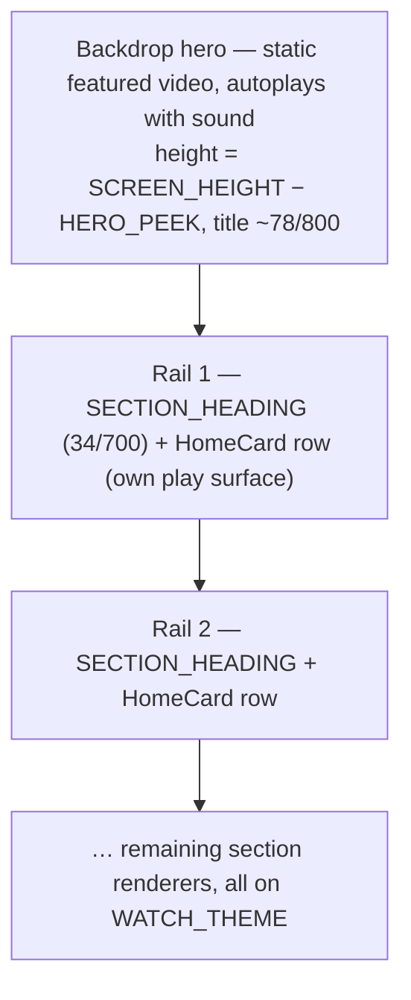
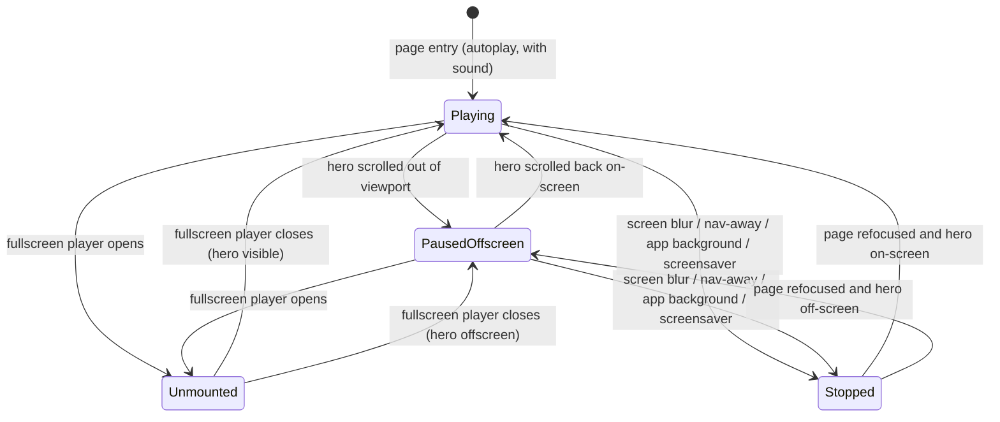
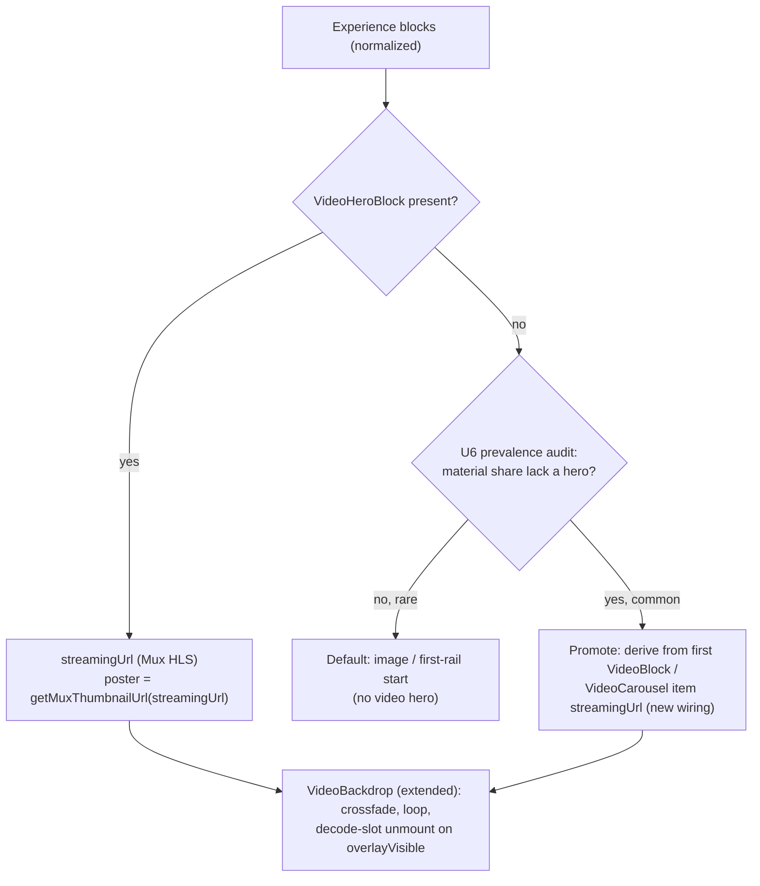

# TV Experience Details Restyle - Plan

## Goal Capsule

- **Objective:** Rebuild the `apps/tv` Experience Details page onto the live `WATCH_THEME` design system so it reads as the same app as the Video Details and Home screens, and give it a static featured-video hero that autoplays with sound.
- **Product authority:** Urim (owns TV). This reverses a documented decision (`apps/tv/CLAUDE.md` states the SDUI experience renderer intentionally stays on Crimson Gallery), which Urim authorized.
- **Execution profile:** Phased so value lands incrementally — Phase A (design-system migration) is independently shippable and verified first; Phase B re-skins the hero (still muted, at sibling parity); Phase C adds the net-new sound + scroll/lifecycle behavior; Phase D updates docs. Verify each phase in the tvOS simulator before advancing (per the TV verification discipline). No admin/GraphQL changes — consumes the existing public schema.
- **Stop conditions:** Surface a blocker rather than guessing if the Phase B prevalence audit (U6) shows most live Experiences lack a `VideoHeroBlock` (the fallback then becomes the primary experience and hero scope changes), or if extending `VideoBackdrop` for sound cannot be done without risking the muted watch/Home/Search heroes.
- **Tail ownership:** Urim. No cross-app deploy ordering — the change is client-only.
- **Open blockers:** None launch-blocking. Outstanding Questions are all deferred (non-blocking).
- **Product Contract preservation:** changed R14 (initial-focus timing clarified — the hero owns the first paint, focus transfers to the first rail card on first D-pad input) and R15 (screensaver coverage scoped best-effort), both to reconcile the non-focusable hero with R9's hero-visible-on-entry; AE4 clarified (overlay-open vs true forward-nav); two deferrals added (hero-video reachability, captions accessibility). These came out of the plan review (recorded in Deferred / Open Questions). Otherwise the Product Contract text and R1–R13 are unchanged; `ce-plan` added the Planning Contract, Implementation Units, Verification Contract, and Definition of Done below.

---

## Product Contract

### Summary

Migrate the Experience Details render path (host shell + all 12 section renderers) off the older Crimson Gallery palette onto the live `WATCH_THEME` tokens and shared components, in a Home-style layout: a backdrop hero over vertically stacked rails, cards remaining their own play surface. The hero becomes a static featured video that autoplays with sound and plays only while on-screen. The result should be visually indistinguishable in system from Video Details and Home.

### Problem Frame

`apps/tv` runs two design systems. The older **Crimson Gallery** (`COLORS` in `src/lib/colors.ts` — warm-stone `#161311`, crimson `#CB333B`) still governs the SDUI experience renderer, series, and legacy surfaces. The newer **WATCH_THEME** (`src/components/watch/watchDetailTheme.ts` — near-black `#08080a`, brighter `#E1241E`, white-fill focus, larger hero geometry) was adopted for Video Details, Home, and Search. The Experience Details page was built before that shift, so it now reads as a different app: warmer canvas, wrong accent, smaller hero, ad-hoc headings, and no shared card/button styling. The `.stitch/DESIGN.md` file that carries the "Claude Design" label documents the _stale_ Crimson Gallery system — the WATCH_THEME divergence lives only in code and never went back to Stitch — so the source of truth for "consistent" is the live sibling screens, not that file.

### Key Decisions

- **Source of truth is the live `WATCH_THEME` code, not `.stitch/DESIGN.md`.** The file named DESIGN.md is the stale Crimson Gallery system; consistency means matching the live Video Details/Home code and the shared components they compose.
- **Home-style page shape (backdrop hero + stacked rails), not a Video-Details Play/action row.** An Experience is a curated collection, so each card stays its own play surface; `DetailsActionRow` (watch-session-bound) does not apply.
- **The hero gains sound + scroll-gated playback — a deliberate Apple-TV-style divergence.** Every hero in the app is currently muted and none pause on scroll; this page intentionally breaks that parity for the featured-video feel Urim wants.
- **Decode-slot correctness is a requirement, not polish.** The rebuilt hero must _unmount_ its video when a fullscreen player is open (mirroring `VideoBackdrop`), not merely pause, or it starves the fullscreen player (black-at-0:00).
- **Only the Experience renderer migrates; series and legacy stay on Crimson Gallery.** The `COLORS` module and `.stitch/DESIGN.md` remain in place for those surfaces.

### Requirements

**Design-system migration**

- R1. Every surface in the Experience render path uses `WATCH_THEME` tokens — no Crimson Gallery `COLORS` and no hardcoded hex. The canvas is `WATCH_THEME.below` (`#08080a`), fixed in both the host shell and the section-wrapper tier map (both currently emit warm-stone).
- R2. Rail and section headings use the shared `SECTION_HEADING` style (34/700 white), replacing the ad-hoc 24/600 headings.
- R3. Former `COLORS.muted` (`#A8A29E`) subtitles, captions, and chevrons map to `WATCH_THEME` white-alpha tiers (`text82`/`text74`/`text66`/`text62`/`text50`), chosen per usage — `WATCH_THEME` has no single muted token.
- R4. The accent is `#E1241E` everywhere it appears (spinner, retry CTA, quiz gradient anchor), replacing `#CB333B`. Off-palette hardcoded gradients (the EasterDates blue/gold/red and the QuizButton orange→crimson) are re-tokenized to the WATCH palette.
- R5. Focus stays the app-wide white ring (the `FocusableCard` default); no crimson focus is introduced. The QuizButton CTA adopts the shared `SecondaryPill`.
- R6. All 12 dispatched section kinds plus the host shell are covered — the 2 already theme-clean stay, the 2 partial renderers are finished, and the rest get the full pass. The inline shadow-copy of `COLORS` in the text renderer is removed in favor of tokens.

**Layout and page shell**

- R7. The page is a Home-style composition: a backdrop hero above vertically stacked rails, with cards remaining their own play surface (no single Play/action row).
- R8. Hero geometry matches Video Details: height is `SCREEN_HEIGHT − HERO_PEEK` (was `0.55 × height`) so the next rail peeks above the fold, and the title is the large WATCH scale (~78/800 white with shadow, was 40/bold).
- R14. The hero is a non-focusable ambient surface — D-pad focus skips it (matching `VideoBackdrop`'s zero-focusables). On entry the hero owns the first paint (visible and playing); focus transfers to the first rail's first card on the first D-pad input, not via a forced on-mount focus that would scroll the hero off-screen. The featured video is watchable fullscreen only via a rail card, not the hero, so it must be reachable there (see the reachability deferral).

**Hero playback**

- R9. The hero is a static featured video that autoplays on page entry with sound.
- R10. The hero plays only while on-screen: when it scrolls out of the viewport, playback and its audio pause.
- R11. The hero video unmounts (releases its decode slot), not merely pauses, whenever a fullscreen player overlay is visible — mirroring the existing `VideoBackdrop` pattern — so it never starves the fullscreen player. This requires threading an overlay-visible signal into the Experience page.
- R12. The featured video source is the Experience's `VideoHeroBlock.streamingUrl` (already fetched and host-validated Mux HLS). The dead code path reading the never-fetched `section.video` field is removed.
- R15. The hero stops playback and audio whenever the page is not the foreground, on-screen surface: on screen blur / Back / true forward-navigation to another route (the screen stays mounted on the stack, so pause on the focus-effect blur, not only on unmount) and on app background/inactive (also release the decode slot). Screensaver coverage is best-effort: tvOS may leave `AppState` `active` under the screensaver, so U9 verifies whether a transition fires and, if none does, records screensaver-audio as a known gap rather than claiming coverage. Rapid re-entry re-initializes cleanly without leaking the prior player.

**Docs and scope**

- R13. `apps/tv/CLAUDE.md` "Design Systems" and the corresponding `app/index.tsx` comment are updated to state the Experience renderer now uses `WATCH_THEME`; the Crimson Gallery module stays documented as governing series and legacy only.

### Page shape (shape B)

### Hero playback lifecycle

`Stopped` halts audio and releases the decode slot (R15). `Unmounted` is the overlay-open decode-slot release (R11).

### Acceptance Examples

- AE1. **Covers R11.** **Given** the hero is autoplaying, **When** the user opens a video full-screen, **Then** the hero video unmounts and releases its decode slot and the fullscreen player starts cleanly (no black-at-0:00).
- AE2. **Covers R9, R10.** **Given** the hero is autoplaying with sound, **When** the user scrolls down so the hero leaves the viewport, **Then** hero playback and its audio pause; scrolling it back on-screen resumes.
- AE3. **Covers R12.** **Given** an Experience has no `VideoHeroBlock`, **When** the page loads, **Then** no video hero plays and the page uses the default image / first-rail start — provisional on the fallback decision in Outstanding Questions being resolved to keep the image / first-rail default.
- AE4. **Covers R11, R15.** **Given** the hero is autoplaying with sound, **When** the user opens a card's fullscreen player (the app-wide overlay), **Then** audio stops via the R11 `overlayVisible` unmount+pause; **and When** the user truly navigates to another route (e.g. a series item) or presses Back, **Then** the `useFocusEffect` blur stops audio. Neither path leaves audio playing behind the next surface.

### Success Criteria

- Placed beside Video Details and Home in the tvOS simulator, the Experience page reads as the same visual system — palette, section headings, cards, and focus ring all match — across the section kinds a real Experience renders. Verified in-sim, not by typecheck alone. (The hero's sound + scroll-pause are an intentional, product-approved behavioral divergence, reviewed against the sibling heroes rather than expected to match them.)
- No decoder-starvation regression: opening a fullscreen player from the Experience page always starts cleanly, on tvOS (primary) and Android TV.
- The Experience render path is grep-clean of Crimson Gallery `COLORS` and hardcoded hex.

### Scope Boundaries

- Series and other legacy surfaces stay on Crimson Gallery — do not migrate them or delete the `COLORS` module.
- No GraphQL or data-model changes beyond consuming the existing hero source; the featured-video field already exists.
- Refreshing the stale `.stitch/DESIGN.md` to the live WATCH palette is a separate Stitch-hygiene task, not this ticket.

### Dependencies / Assumptions

- The shared WATCH components (`SECTION_HEADING`, `HomeCard`/`HomeRail`, `FocusableCard`, `SecondaryPill`, `useFocusAnimation`) are adopt-ready as-is. `VideoBackdrop` is the exception: it is muted and pauses only on overlay, so R9/R10 require extending it with an opt-in unmuted mode and an off-screen pause signal, with defaults preserving today's muted + overlay-only behavior so the shared watch/Home/Search heroes don't regress.
- Admin-served Experiences continue to expose `VideoHeroBlock.streamingUrl` as Mux HLS. `MediaCollectionBlock` items cannot feed a hero (no `streamingUrl`).

### Outstanding Questions

**Deferred to Planning**

- Hero fallback when no `VideoHeroBlock` exists: keep the image / first-rail start (default), or derive a featured video from the first `VideoBlock` / `VideoCarousel` item? The fallback fields exist but are currently unwired. Quantify early what fraction of live Experiences carry a usable `VideoHeroBlock`; if a material share lack one, this fallback governs the common-case appearance and should be promoted from a refinement to a first-class requirement. (Resolved in this plan as U6 — audit-first, keep-default unless the audit says otherwise.)
- Should hero audio duck or stop when focus moves into the rails, or only pause on scroll-off (current spec)?
- Hero sound refinements: loop vs play-once, immediate sound vs a short dwell before unmuting, and whether to offer a mute affordance. (This plan builds loop + immediate sound + no in-hero mute control; sound is bounded by the R10/R15 lifecycle gates.)
- Hero-video reachability: the hero is a non-focusable ambient preview, so its featured video is only openable if the same video also appears as a focusable rail card. Default assumption: curators place featured content in a rail (the hero is preview-only). If that convention isn't reliable, the hero's video must be guaranteed a rail entry — flagged in U5, verify in-sim.
- Captions/accessibility for the sound hero: an always-on autoplay-with-sound hero conveys its point through audio, which excludes deaf/hard-of-hearing viewers, and there is no in-hero mute. Captions/subtitles for the hero are deferred (parallel to the deferred mute affordance) — recorded here so the accessibility decision is conscious, not absent.

### Sources / Research

- `apps/tv/src/components/watch/watchDetailTheme.ts` — `WATCH_THEME` tokens, `HERO_PEEK`, `HERO_BOTTOM_FADE_HEIGHT`.
- `apps/tv/src/components/watch/VideoBackdrop.tsx` — the reusable hero pattern: poster→video crossfade, `videoReady` latch, decode-slot unmount, `replaceAsync` source swap, WATCH scrims. Muted with zero focusables.
- `apps/tv/src/components/ExperienceRenderer.tsx` + `src/components/sections/SectionDispatcher.tsx` — the host shell and the 12-kind dispatch to migrate.
- `apps/tv/src/components/sections/VideoHeroRenderer.tsx` — the current muted hero scaffold and the dead `section.video` read (lines 37–49) to delete.
- `apps/tv/src/components/sections/sectionHeading.ts` — shared `SECTION_HEADING`.
- `apps/tv/src/components/sections/SectionWrapperRenderer.tsx` — the Experience-only tier map (Crimson warm-stone) to re-tokenize.
- `apps/tv/src/lib/queries.ts` — `GET_WATCH_EXPERIENCE`, `VideoHeroFields.streamingUrl`, and the unwired fallback fields (`VideoSectionFields.streamingUrl`, `VideoCarouselFields.items[].streamingUrl`).
- `apps/tv/src/contexts/VideoPlayerContext.tsx` — `useVideoPlayerContext().state.isVisible` overlay signal (provider mounted app-wide in `app/_layout.tsx`).
- `apps/tv/CLAUDE.md` "Design Systems" and the `app/index.tsx` comment — the documented-decision text to update (R13).
- `docs/solutions/ui-bugs/tv-backdrop-videoview-decoder-starvation-overlay-20260611.md`, `docs/solutions/runtime-errors/expo-video-backdrop-seamless-loop-20260609.md`, `docs/solutions/ui-bugs/tv-home-backdrop-crossfade-aba-stall-20260615.md`, `docs/solutions/ui-bugs/tv-video-hero-blank-autoplay-20260413.md`, `docs/solutions/best-practices/tv-focus-white-ring-default-and-light-surface-exception.md`, `docs/solutions/design-patterns/tv-back-nav-focus-restoration-screen-focus-memory.md` — the decode-slot, loop, crossfade, blank-autoplay, focus-ring, and back-nav-focus patterns this plan reuses.

---

## Planning Contract

### Key Technical Decisions

- KTD1. **Reuse `VideoBackdrop`, but make the Experience hero its single play-decision owner.** `VideoBackdrop` already solves decode-slot starvation (unmount on overlay), poster→video crossfade, the `videoReady` latch, and seamless loop — replacing the hand-rolled `VideoHeroRenderer` player with it fixes R11 for free. Extend it minimally with an opt-in `muted` prop (default `true`) and an optional external `shouldPlay` prop that, when provided, _replaces_ its internal `overlayVisible`-driven play/pause (default absent → today's internal behavior, so watch/Home/Search are untouched by construction — `ExperienceRenderer` is Experience-only but `VideoBackdrop` is shared). `VideoHeroRenderer` computes the single `shouldPlay` and owns sound/scroll/lifecycle; the divergence lives in the Experience-only renderer, not smeared across the shared component. Distinguish **stop-audio** (always `player.pause()`) from **release-decode-slot** (pause _and_ unmount) — unmounting the `VideoView` frees the slot but the player keeps decoding audio.
- KTD1b. **Considered alternative — a separate Experience-only hero component vs. extending `VideoBackdrop`.** Extending is chosen because the `muted`/`shouldPlay` props are minimal and default-inert, and `VideoHeroRenderer` already owns the composite decision (so the divergence is isolated to the Experience path anyway). Falsification test that would flip to a standalone wrapper: any muted-sibling regression surfaced in the Phase C in-sim recheck.
- KTD2. **The hero is non-focusable, and initial focus is deferred so the hero owns the first paint.** Set the hero `VideoView` `focusable={false}` + `pointerEvents="none"` (the documented pattern so the focus engine traverses past the native surface). Do NOT force `hasTVPreferredFocus` on the first rail card on mount — the first rail sits below the fold (hero = `SCREEN_HEIGHT − HERO_PEEK`), so forcing focus there triggers a tvOS focus-scroll that pushes the visible+playing hero off-screen on entry (breaking R9 and tripping U8's off-screen pause immediately). Let the hero paint first; transfer focus to the first rail card on the first D-pad input. This satisfies R14 without the on-mount scroll and avoids the dead-node / "cards are the play surface" contradiction.
- KTD3. **Source the hero from block data, not a watch session.** The Experience route does not populate `WatchSessionProvider`, so `DetailsActionRow` and `activeVariant` are unavailable. The hero reads `VideoHeroBlock.streamingUrl` and derives its poster via `getMuxThumbnailUrl(streamingUrl)`. The overlay signal comes from the app-wide `useVideoPlayerContext().state.isVisible`, already in the subtree.
- KTD4. **One derived `shouldPlay` drives play/pause — not three racing effects.** Sound, scroll-gating, and lifecycle teardown are net-new (no existing code path is unmuted, pauses on scroll, or pauses on background). Build them as inputs to a single derived boolean `shouldPlay = onScreen && !overlayVisible && isForeground && isFocused`, feeding one play/pause effect; decode-slot unmount keys on `(overlayVisible || appBackgrounded)`. Independent per-gate `play()`/`pause()` effects would race (last-writer-wins): closing an overlay while the hero is scrolled off would resume audio off-screen, or the scroll-gate would resume playback while the overlay is open → two concurrent decoders (the black-at-0:00 R11 prevents). Ship this last (Phase C) so the muted re-skin verifies at sibling parity first.
- KTD5. **Migrate only the Experience render path; keep Crimson alive.** `SectionWrapperRenderer`'s tier map is Experience-only, so re-tokenizing it can't bleed into series/legacy. Only `SECTION_HEADING` is shared, and it is already the WATCH target. Leave `COLORS`, `hexToRgba`, and `.stitch/DESIGN.md` for series/legacy.
- KTD6. **Loop via manual `playToEnd`→`replay()`, not native `loop`.** Native `loop` re-initializes the HLS source and produces a long black pause; the documented seamless-loop pattern avoids it. `VideoBackdrop` already does this. Note: that pattern was validated for _muted_ playback — with sound, each `replay()` restarts the audio track, so U7 verifies there's no loop-seam audio pop in-sim.
- KTD7. **The hero is an ambient preview; its featured video is opened via a rail card, not the hero.** Because the hero is non-focusable (R14), a `VideoHeroBlock` video that appears in no rail is unopenable. Default: rely on the curator convention that featured content also lives in a rail. U5 surfaces this and verifies it in-sim; if the convention proves unreliable, the hero's video must be guaranteed a rail entry (a follow-up, not silent breakage).

### High-Level Technical Design

Hero source resolution (drives U5/U6 and AE3):

The page-shape and hero-lifecycle diagrams live in the Product Contract; this diagram covers the data-side fork the implementation must handle.

### Assumptions

- `ExperienceRenderer` is consumed only by `/experience/[slug]` (the "used by home and detail" comment in it is stale), so the hero rebuild cannot regress Home/watch/Search directly. The only shared surface is `VideoBackdrop`; its new props default-inert (KTD1) keep the muted siblings safe by construction, re-checked in-sim after Phase C.
- `onScroll` firing usefully during tvOS/Android-TV focus-driven scroll is **unproven** (there is no `onScroll` in the codebase today). U8 opens with a de-risking spike and names a fallback (derive on-screen from the existing `onLayout` section-position map) so the plan's shape survives if `onScroll` doesn't deliver a usable offset.
- On a present `VideoHeroBlock` with a null `streamingUrl`, `VideoBackdrop`'s `fallbackBg` is Crimson `COLORS.surfaceContainer` (out of the grep gate's reach), and the hero fragment fetches no image, so U5 must pass a WATCH background to keep the no-stream hero near-black.
- The prevalence audit (U6) can be answered from admin data without code changes to admin.

### Sequencing

Phase A (U1–U4 WATCH_THEME migration + U6 code-free prevalence audit) → Phase B (U5 hero re-skin, still muted + U6's conditional fallback wiring if the audit warrants it) → Phase C (U7–U9, sound + lifecycle) → Phase D (U10, docs). Phase A is independently shippable and verified first. Within Phase A, U1 (shell + canvas) lands before the renderer units so the near-black canvas frames the rest, and the U6 audit runs early (no code dependency) so its scope-shaping result — whether a video hero is even the common case — resolves before Phase C's net-new investment.

---

## Implementation Units

### Unit Index

| U-ID | Title                                                                               | Files (primary)                                                                              | Depends on     |
| ---- | ----------------------------------------------------------------------------------- | -------------------------------------------------------------------------------------------- | -------------- |
| U1   | Page shell + tier map + canvas → WATCH_THEME                                        | `ExperienceRenderer.tsx`, `SectionWrapperRenderer.tsx`, `TextRenderer.tsx`                   | —              |
| U2   | Rail headings + carousels → SECTION_HEADING + WATCH                                 | `NavigationCarouselRenderer.tsx`, `VideoCarouselRenderer.tsx`, `MediaCollectionRenderer.tsx` | U1             |
| U3   | Finish partial renderers                                                            | `RelatedQuestionsRenderer.tsx`, `BibleQuotesCarouselRenderer.tsx`                            | U1             |
| U4   | Off-palette + accent renderers                                                      | `EasterDatesRenderer.tsx`, `QuizButtonRenderer.tsx`, `VideoCardRenderer.tsx`                 | U1             |
| U5   | Rebuild hero onto VideoBackdrop (muted) + geometry + non-focusable + decode-unmount | `VideoHeroRenderer.tsx`, `ExperienceRenderer.tsx`                                            | U1             |
| U6   | VideoHeroBlock prevalence audit (Phase A) + conditional fallback wiring             | audit is code-free; conditional wiring in `VideoHeroRenderer.tsx` + `queries.ts`             | — (wiring: U5) |
| U7   | Enable hero sound (opt-in unmuted VideoBackdrop)                                    | `VideoBackdrop.tsx`, `VideoHeroRenderer.tsx`                                                 | U5             |
| U8   | Scroll-visibility pause gating                                                      | `ExperienceRenderer.tsx`, `ExperienceProvider.tsx`, `VideoHeroRenderer.tsx`                  | U5, U7         |
| U9   | Lifecycle teardown (blur / AppState) + single shouldPlay                            | `VideoHeroRenderer.tsx`, `VideoBackdrop.tsx`                                                 | U5, U7, U8     |
| U10  | Docs update                                                                         | `apps/tv/CLAUDE.md`, `apps/tv/app/index.tsx`                                                 | U4, U8         |

### Phase A — WATCH_THEME migration

#### U1. Page shell + tier map + canvas → WATCH_THEME

- **Goal:** The Experience canvas, loading/error/empty/retry states, the section-wrapper tier map, and the text renderer's inline color copy all use `WATCH_THEME`, so the whole page reads near-black instead of warm-stone.
- **Requirements:** R1, R4 (accent on spinner/retry), R6 (TextRenderer inline-COLORS removal).
- **Dependencies:** —
- **Files:** `apps/tv/src/components/ExperienceRenderer.tsx`, `apps/tv/src/components/sections/SectionWrapperRenderer.tsx`, `apps/tv/src/components/sections/TextRenderer.tsx`, and their colocated tests (`*.test.tsx` where present).
- **Approach:** In `ExperienceRenderer`, replace `COLORS.surface/text/primary/muted` on the screen background, spinner, error/empty text, and retry button with `WATCH_THEME.below`, `WATCH_THEME.text`/white-alpha tiers, and `WATCH_THEME.accent`. Flatten `SECTION_WRAPPER`'s `SECTION_BACKGROUND_COLORS` map to the single WATCH surface `WATCH_THEME.below` — `WATCH_THEME` exposes no elevation tiers, and Home/Video Details do not alternate section backgrounds, so the old three-tier alternation is intentionally dropped for near-black consistency (do not invent hardcoded tints — that violates R1 and the grep gate). Delete the inline `{ text, muted }` copy in `TextRenderer` (lines 8–11) and use `WATCH_THEME`/`SECTION_HEADING`.
- **Patterns to follow:** `app/watch/[slug].tsx` below-fold `WATCH_THEME.below` canvas; `SECTION_HEADING` for the text renderer's heading.
- **Test scenarios:**
  - Test expectation: mostly visual (token swap). Where a colocated test asserts a background/token value, update it to the WATCH token.
  - Grep assertion (in verification, not a unit test): the three files contain no `COLORS.` references after the change.
- **Verification:** Sim shows a near-black canvas + red spinner/retry on the Experience route; no warm-stone remains behind sections.

#### U2. Rail headings + carousels → SECTION_HEADING + WATCH

- **Goal:** The three ad-hoc-heading carousels render their titles with the shared `SECTION_HEADING` (34/700 white) and their cards/scrims/eyebrows on WATCH tokens with white-ring focus.
- **Requirements:** R2, R3, R4, R5.
- **Dependencies:** U1.
- **Files:** `apps/tv/src/components/sections/NavigationCarouselRenderer.tsx`, `apps/tv/src/components/sections/VideoCarouselRenderer.tsx`, `apps/tv/src/components/sections/MediaCollectionRenderer.tsx`, colocated tests.
- **Approach:** Replace each renderer's local `HEADING_FONT_SIZE`/`fontSize24` heading + `COLORS.text`/`COLORS.muted` with `...SECTION_HEADING`. Map card backgrounds (`#292524`, `COLORS.surfaceContainer*`) and scrims (`hexToRgba("#000000",…)`) to WATCH near-black tiers + `WATCH_THEME.scrim`. Color eyebrows/labels with `WATCH_THEME.accent` to match `HomeRail`. Keep `FocusableCard` at its default white ring (do not pass `focusRing="crimson"`).
- **Patterns to follow:** `HomeRail` title (34/700 white) + accent eyebrow; `FocusableCard` white-ring default.
- **Test scenarios:**
  - Happy path: each renderer renders its heading with the shared `SECTION_HEADING` style (assert the style object is spread, not a local size).
  - Edge case: a section with an empty items array renders no rail (no crash).
- **Verification:** Sim shows white 34/700 rail headings and near-black cards; focusing a card shows the white ring, not crimson.

#### U3. Finish partial renderers

- **Goal:** The two ~80%-migrated renderers reach full WATCH — their remaining `COLORS.muted`/hardcoded surfaces move to WATCH white-alpha tiers and near-black.
- **Requirements:** R1, R3.
- **Dependencies:** U1.
- **Files:** `apps/tv/src/components/sections/RelatedQuestionsRenderer.tsx`, `apps/tv/src/components/sections/BibleQuotesCarouselRenderer.tsx`, colocated tests.
- **Approach:** In `RelatedQuestions`, move the answer/meta/chevron text off `COLORS.text/muted` to `WATCH_THEME.text`/white-alpha tiers (the heading + pill focus are already WATCH). In `BibleQuotesCarousel`, replace the hardcoded card background `#292524` and the CTA pill with WATCH near-black + `SecondaryPill`.
- **Patterns to follow:** the WATCH pill-focus already present in `RelatedQuestions`; `SecondaryPill`.
- **Test scenarios:**
  - Happy path: RelatedQuestions renders answer/meta text in a WATCH white-alpha tier (no `COLORS` import remains).
  - Test expectation for the BibleQuotes bg swap: visual; update any colocated color assertion.
- **Verification:** Sim: both sections match the near-black/white system; no residual gray-on-stone text.

#### U4. Off-palette + accent renderers

- **Goal:** The renderers carrying off-palette gradients and the crimson accent are re-tokenized to the WATCH palette.
- **Requirements:** R4, R5.
- **Dependencies:** U1.
- **Files:** `apps/tv/src/components/sections/EasterDatesRenderer.tsx`, `apps/tv/src/components/sections/QuizButtonRenderer.tsx`, `apps/tv/src/components/sections/VideoCardRenderer.tsx`, colocated tests.
- **Approach:** Replace EasterDates' `["#5b9bd5","#d4a033","#c0392b"]` gradient and QuizButton's `["#E8891C","#CB333B"]` gradient with WATCH-palette equivalents anchored on `WATCH_THEME.accent` (`#E1241E`). For EasterDates, first check whether the three source colors encode distinct categories (date systems) rather than decoration — if categorical, keep three distinguishable WATCH-tinted stops instead of collapsing to a single accent, so no information is lost. Adopt `SecondaryPill` for the QuizButton CTA. Move `VideoCardRenderer`'s `COLORS.surfaceContainer*`/`COLORS.text` + `hexToRgba("#000000",0.5)` badge to WATCH tokens + `WATCH_THEME.scrim`. Replace remaining `#CB333B` with `#E1241E`.
- **Patterns to follow:** `SecondaryPill`; `WATCH_THEME.scrim` for card gradients.
- **Test scenarios:**
  - Happy path: QuizButton renders the CTA via `SecondaryPill`; gradient anchor is the WATCH accent (assert no `#CB333B`/`#E8891C` literals remain).
  - Edge case: EasterDates renders with valid dates and with a missing/empty date (no crash, no off-palette color).
- **Verification:** Sim: no orange/blue/gold or crimson accent remains on the Experience page; the quiz CTA matches sibling pills.

### Phase B — Hero re-skin (muted)

#### U5. Rebuild hero onto VideoBackdrop (muted) + geometry + non-focusable + decode-unmount

- **Goal:** `VideoHeroRenderer` renders through `VideoBackdrop` at Video-Details geometry, as a non-focusable ambient surface, releasing its decode slot when a fullscreen overlay is open — still muted, at sibling parity.
- **Requirements:** R7, R8, R11, R12, R14.
- **Dependencies:** U1.
- **Files:** `apps/tv/src/components/sections/VideoHeroRenderer.tsx`, `apps/tv/src/components/ExperienceRenderer.tsx`, `apps/tv/src/components/sections/VideoHeroRenderer.test.tsx`.
- **Approach:** Replace `VideoHeroRenderer`'s hand-rolled `useVideoPlayer` with `<VideoBackdrop streamingUrl={block.streamingUrl} posterUrl={getMuxThumbnailUrl(block.streamingUrl)} overlayVisible={useVideoPlayerContext().state.isVisible} bottomFadeColor={WATCH_THEME.below} />` inside a hero View sized `SCREEN_HEIGHT − HERO_PEEK` (`justifyContent:"flex-end"`, overflow hidden), title `scale(78)`/800 white + shadow, teaser + kicker badge over `WATCH_THEME.scrim`. Delete the dead `section.video` destructure (lines 37–49). Keep the hero `VideoView` `focusable={false}` + `pointerEvents="none"` so focus skips it. Do NOT set `hasTVPreferredFocus` on mount anywhere (KTD2) — let the hero own the first paint; the first rail card takes focus on the first D-pad input. When `streamingUrl` is null, pass a WATCH background so the no-stream hero reads near-black (`VideoBackdrop`'s `fallbackBg` is Crimson and out of the grep gate's reach). Surface the KTD7 reachability caveat in the unit: the hero is a preview and its video is opened via a rail card.
- **Patterns to follow:** `app/watch/[slug].tsx` hero composition; `docs/solutions/ui-bugs/tv-backdrop-videoview-decoder-starvation-overlay-20260611.md`.
- **Test scenarios:**
  - Covers AE1. Given a mounted hero, when `state.isVisible` becomes true (overlay open), the `VideoBackdrop` receives `overlayVisible={true}` and the `VideoView` unmounts (assert via the prop / rendered tree, mirroring `VideoBackdrop`'s own test).
  - Happy path: given a `VideoHeroBlock` with a valid `streamingUrl`, the hero renders `VideoBackdrop` with that `streamingUrl` and a `getMuxThumbnailUrl` poster.
  - Edge case: `streamingUrl` null/invalid → no video, near-black background (not Crimson), no crash; the removed `section.video` path is gone (assert the fragment has no `video` field reliance).
  - Focus: the hero exposes no focusable node (assert `focusable={false}`), and no card carries `hasTVPreferredFocus` at initial render.
- **Verification:** Sim: full-bleed hero with the next rail peeking and big white title, visible and playing on entry (no on-mount scroll pushing it off-screen); the first D-pad press moves focus to the first rail card, never the hero; opening a card's fullscreen player starts cleanly (no black-at-0:00); a no-`VideoHeroBlock` and a null-`streamingUrl` Experience both read near-black.

#### U6. VideoHeroBlock prevalence audit + fallback decision

- **Goal:** Resolve whether the no-hero fallback is an edge case or the common-case appearance, and wire the chosen fallback.
- **Requirements:** R12; resolves the Outstanding Question on hero fallback and finalizes AE3.
- **Dependencies:** — for the audit (runs early in Phase A, no code dependency, so its scope-shaping result lands before Phase C); U5 for the conditional derive-wiring.
- **Files:** investigation (admin data / query); conditional wiring in `apps/tv/src/components/sections/VideoHeroRenderer.tsx` + `apps/tv/src/lib/queries.ts` only if derive-from-first-video is chosen.
- **Approach:** Query live published Experiences for `VideoHeroBlock` presence with a usable Mux stream. If the vast majority carry one, keep the default (hero only when `VideoHeroBlock` present; else image/first-rail start) and mark AE3 resolved-to-default. If a material share lack one, promote the fallback: derive the hero stream from the first `VideoBlock.streamingUrl` (then first `VideoCarouselBlock.items[].streamingUrl`), poster from the item `imageUrl` when present.
- **Execution note:** Investigate first — do not build the derive path until the audit justifies it. Surface the audit result as a blocker per the Goal Capsule stop condition if it changes hero scope.
- **Test scenarios (only if the derive path is built):**
  - Given no `VideoHeroBlock` but a `VideoBlock` with `streamingUrl`, the hero derives that stream.
  - Given no `VideoHeroBlock` and no video-bearing block, the page uses the image / first-rail start (no crash).
- **Verification:** Documented audit result in the PR; AE3 either confirmed-to-default or superseded by the derive path with its tests green.

### Phase C — Sound + lifecycle (net-new)

#### U7. Enable hero sound (opt-in unmuted VideoBackdrop)

- **Goal:** The Experience hero autoplays with sound, while every other `VideoBackdrop` consumer stays muted.
- **Requirements:** R9.
- **Dependencies:** U5.
- **Files:** `apps/tv/src/components/watch/VideoBackdrop.tsx`, `apps/tv/src/components/sections/VideoHeroRenderer.tsx`, `apps/tv/src/components/watch/VideoBackdrop.test.tsx`.
- **Approach:** Add an opt-in `muted?: boolean` (default `true`) prop to `VideoBackdrop`; the Experience hero passes `muted={false}`. Keep the manual `playToEnd`→`replay()` loop (KTD6). Do not change the default for watch/Home/Search callers.
- **Patterns to follow:** `docs/solutions/runtime-errors/expo-video-backdrop-seamless-loop-20260609.md`.
- **Test scenarios:**
  - Happy path: the Experience hero passes `muted={false}`; a watch/Home caller (or the default) stays muted (assert the player's muted state per source).
  - Regression guard: `VideoBackdrop` with no `muted` prop defaults to muted (protects the siblings).
- **Verification:** Sim: the Experience hero plays with audio on entry; open Video Details / Home and confirm those heroes are still silent; watch a full loop cycle and confirm no audio pop / abrupt restart at the loop seam (the seamless-loop pattern was validated for muted only — KTD6).

#### U8. Scroll-visibility pause gating

- **Goal:** The hero plays only while on-screen — scrolling it out of the viewport pauses playback and audio; scrolling back resumes.
- **Requirements:** R10.
- **Dependencies:** U5, U7.
- **Files:** `apps/tv/src/components/ExperienceRenderer.tsx`, `apps/tv/src/components/ExperienceProvider.tsx`, `apps/tv/src/components/sections/VideoHeroRenderer.tsx`, `apps/tv/src/components/sections/VideoHeroRenderer.test.tsx`.
- **Approach:** De-risk first (see execution note): confirm `onScroll` + `contentOffset` actually fire during focus-driven scroll on tvOS AND Android TV — nothing uses `onScroll` today and TV scroll is focus-engine-driven, so this is unproven. If it doesn't deliver a usable offset, fall back to deriving on-screen from the focused-section index via the existing `onLayout` section-position map in `ExperienceRenderer`. Either way, thread the resulting `onScreen` boolean (and `overlayVisible`) to the hero through `ExperienceProvider` context — `VideoHeroRenderer` is dispatched generically with no scroll prop, so no direct prop path exists. Threshold: pause only when the hero is _substantially_ off-screen, so the small reveal-scroll from focusing the first rail (KTD2) never trips it. `onScreen` feeds the U9 single `shouldPlay`, it does not issue its own `play()`/`pause()` (KTD4). Debounce near the fold.
- **Execution note:** Start with the `onScroll`/focus-scroll spike; commit the `onLayout`-index fallback path if the spike shows `onScroll` doesn't fire usefully on TV.
- **Test scenarios:**
  - Covers AE2. Given the hero on-screen and playing, when the on-screen signal flips false (substantially scrolled away), `shouldPlay` goes false and playback + audio pause; flipping true resumes.
  - Edge case: focusing the first rail card (the small reveal-scroll) does NOT read as off-screen (threshold), and rapid toggling near the fold does not thrash (debounced) — assert a single pause/resume per settled state.
- **Verification:** Sim (both tvOS + Android TV): scroll down until the hero substantially leaves the top — audio stops; scroll back up — resumes; focusing the first rail on entry does not pause the hero.

#### U9. Lifecycle teardown (blur / AppState / screensaver)

- **Goal:** `VideoHeroRenderer` owns one derived `shouldPlay` that every pause source feeds, so hero audio never plays when the page isn't the foreground on-screen surface and the gates never race.
- **Requirements:** R15 (integrating R10/R11).
- **Dependencies:** U5, U7, U8.
- **Files:** `apps/tv/src/components/sections/VideoHeroRenderer.tsx`, `apps/tv/src/components/watch/VideoBackdrop.tsx`, colocated tests.
- **Approach:** Derive `shouldPlay = onScreen (U8) && !overlayVisible && isForeground && isFocused` and pass it to `VideoBackdrop` as the single external play signal (KTD1/KTD4); one play/pause effect consumes it. `isFocused` comes from `useFocusEffect` (pause on blur) — this covers only _true forward navigation to another route_ (e.g. a MediaCollection series item → `router.push`); the overlay-open case is already handled by R11's `overlayVisible` unmount+pause (AE4), so don't double-wire it. `isForeground` comes from an `AppState` listener that flips false on `background`/`inactive` and, on that transition, both pauses (`player.pause()`) AND unmounts the `VideoView` to release the decode slot — unmount alone leaves the player decoding audio. Screensaver: verify whether tvOS emits any `AppState` transition under the screensaver; if it does, treat it as background; if not, record screensaver-audio as a known gap (R15 best-effort). On return from a pushed route, restore focus to the launching rail card (per the screen-focus-memory doc), not the first rail. Guard rapid re-entry so a new mount doesn't leak the prior player.
- **Patterns to follow:** `AppState` listener shape in `src/components/VideoPlayer.tsx`; `useFocusEffect` blur; `docs/solutions/design-patterns/tv-back-nav-focus-restoration-screen-focus-memory.md`.
- **Test scenarios:**
  - Covers AE4. Given the hero playing, when the screen blurs on a real route push (series item / Back), `shouldPlay` goes false and audio stops; a card-overlay open is covered by R11 — assert the two paths independently.
  - Given the hero playing, when `AppState` → `background`, the player pauses AND the `VideoView` unmounts (decode slot released); returning to `active` while on-screen and no overlay resumes.
  - Race guard: with the hero scrolled off (onScreen=false), when an overlay then closes (overlayVisible=false), `shouldPlay` stays false — it does not resume off-screen.
  - Edge case: navigating away and rapidly back leaves a single player (no audio doubling).
- **Verification:** Sim: play the hero → open a fullscreen video → audio stops behind it and reopening starts clean; navigate to a series route → audio stops and Back returns focus to the launching card; background the app → audio stops; close an overlay while scrolled off → hero stays paused.

### Phase D — Docs

#### U10. Docs update

- **Goal:** The repo docs reflect that the Experience renderer now uses `WATCH_THEME`, so a future agent doesn't re-Crimson it.
- **Requirements:** R13.
- **Dependencies:** U4 (migration complete) and U8 (the sound/scroll divergence the docs describe exists). If Phase C is deferred, scope U10's divergence note to what has shipped.
- **Files:** `apps/tv/CLAUDE.md`, `apps/tv/app/index.tsx`.
- **Approach:** Update the `apps/tv/CLAUDE.md` "Design Systems" section — Crimson Gallery now governs series + legacy only; the Experience renderer moved to WATCH_THEME. Update the corresponding `app/index.tsx` comment. Note the hero's intentional sound/scroll behavioral divergence.
- **Test scenarios:** Test expectation: none — docs only.
- **Verification:** The two docs no longer claim the Experience renderer intentionally stays on Crimson Gallery.

---

## Verification Contract

| Gate                          | Command / method                                                                                                                                                                                                                                                                | Applies to     |
| ----------------------------- | ------------------------------------------------------------------------------------------------------------------------------------------------------------------------------------------------------------------------------------------------------------------------------- | -------------- |
| TypeScript clean              | apps/tv typecheck (`pnpm --filter @forge/tv typecheck`, or the repo's tv typecheck script)                                                                                                                                                                                      | all units      |
| Component tests green         | the repo's tv test runner (vitest) over the touched `*.test.tsx`                                                                                                                                                                                                                | U2–U9          |
| No Crimson in Experience path | `grep -rn "COLORS\.\|#CB333B\|#161311\|#A8A29E" apps/tv/src/components/sections apps/tv/src/components/ExperienceRenderer.tsx` returns nothing (COLORS stays only in series/legacy) — expect matches until U5 migrates `VideoHeroRenderer.tsx` (in the grepped `sections/` dir) | U1–U5          |
| tvOS sim visual parity        | EXPO_TV Metro on 8082; deep-link `exp+jesus-film-forge-tv:///experience/<slug>`; screenshot the Experience page beside Video Details / Home across the section kinds a real Experience renders                                                                                  | Phase A, B end |
| Decode-slot safety            | From the Experience page, open a card's fullscreen player → starts cleanly, no black-at-0:00 (tvOS primary + Android TV)                                                                                                                                                        | U5, U9         |
| Sound + lifecycle             | Hero plays with audio on entry; audio stops on scroll-off, fullscreen-open, Back, and app-background; siblings still muted                                                                                                                                                      | U7–U9          |
| Android TV focus visuals      | Focus ring + card scale still render on Android TV (the Pressable focus-bridge patch path)                                                                                                                                                                                      | U2–U5          |

Cold-relaunch the dev client before judging playback — hot reload into player files wedges playback with a false black/0:00 signature (`docs/solutions` TV Fast-Refresh zombie-player note).

---

## Definition of Done

**Global**

- R1–R15 satisfied; the Experience page reads as the same visual system as Video Details / Home in the tvOS sim across the section kinds a real Experience renders.
- No decoder-starvation regression opening fullscreen from the Experience page (tvOS + Android TV); the muted watch/Home/Search heroes are unchanged.
- The Experience render path is grep-clean of Crimson `COLORS`/hardcoded hex; the `COLORS` module remains for series/legacy.
- `apps/tv/CLAUDE.md` + `app/index.tsx` updated (R13).
- Abandoned/experimental code from approaches that didn't pan out is removed (e.g., the old hand-rolled `useVideoPlayer` hero path and the dead `section.video` read).

**Per-unit:** each unit's Verification bullet passes, and every feature-bearing unit's test scenarios are green.

---

## Deferred / Open Questions

### From 2026-07-09 review

- **Sound-on-entry default is unweighed against muted + opt-in unmute** — Key Decisions / R9 / Outstanding Questions (P1, product-lens, adversarial, confidence 100)

  On a 10-foot screen, autoplay-with-sound on entry is startling and compounds across a browsing session, and it diverges from every sibling hero and the cited Apple TV pattern, which autoplay muted with opt-in unmute. R9 commits to always-on sound while its governing sub-decisions (mute affordance, dwell-before-unmute) remain open in Outstanding Questions, so planning could render R9 in a form worth rejecting. The muted-default-with-opt-in-unmute alternative was never weighed. Deferred for a conscious revisit — the autoplay-with-sound divergence was chosen deliberately, so this records the reviewers' challenge rather than reversing the call.

- **Sequence the sound hero as a follow-up to the restyle** — Requirements (R9–R11) / Goal Capsule (P2, product-lens, confidence 75)

  The token migration (R1–R8, R13) is low-risk and well-evidenced, but the sound hero (R9–R11) carries all three deferred product questions, so bundling them schedule-couples the otherwise-shippable restyle to the experimental hero if those questions stall in planning. Consider sequencing autoplay-with-sound as a follow-up to a WATCH_THEME migration plus a muted hero, so the certain consistency win can ship and be verified independently. Decomposition into shippable units is ce-plan's call; recorded here so planning weighs it. (Addressed by this plan's phasing: Phase A/B — migration + muted hero — is independently shippable ahead of Phase C's sound/lifecycle work.)

- **Success criteria test static visuals, not the hero's behavioral divergence** — Goal Capsule / Success Criteria (P2, adversarial, confidence 75)

  The goal is that the page reads as the same app, but SC1 only checks static tokens (palette, headings, cards, focus ring); the hero is deliberately made to behave unlike every sibling (sound + scroll-pause), so every criterion can pass while the page still feels different the moment the hero plays audio or halts on scroll. Consider narrowing SC1 to "reads as the same visual system" and stating the hero's sound/scroll-pause behaviors as an intentional, product-approved divergence to be reviewed against sibling heroes, so "same app" is validated rather than assumed. (Applied to Success Criteria in this plan.)
