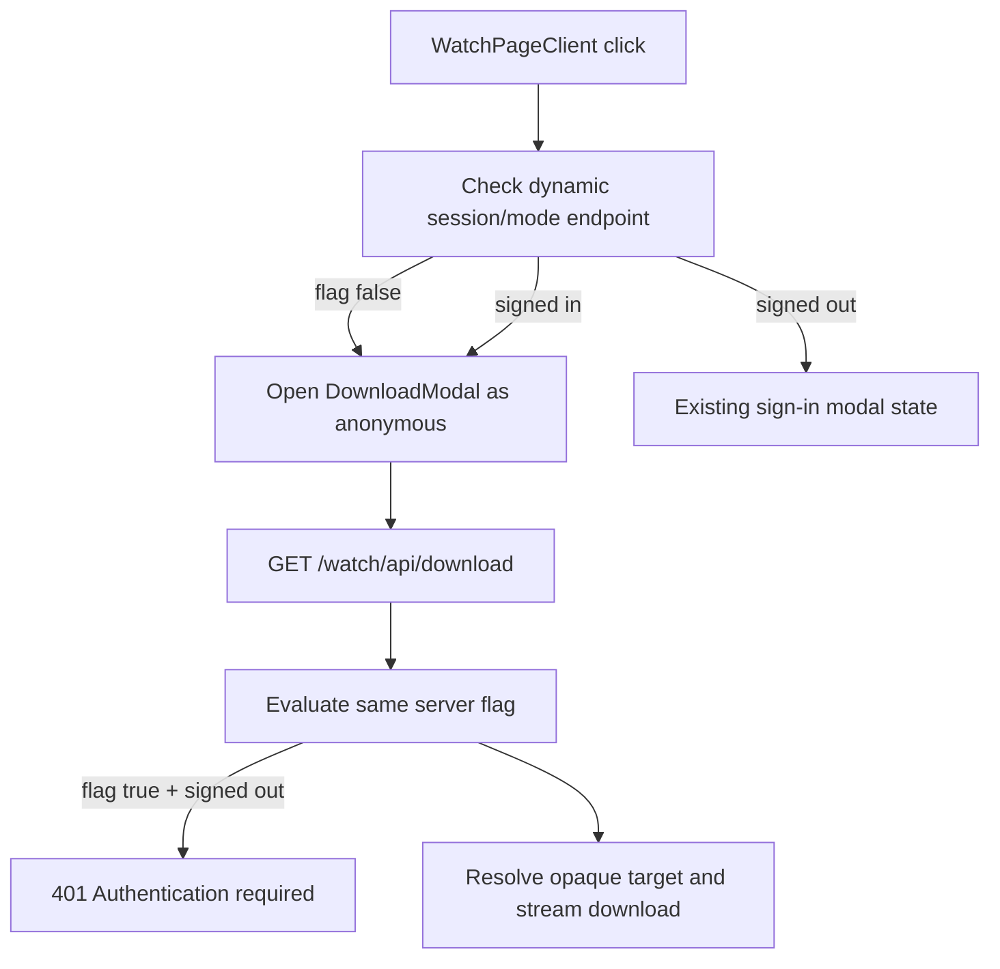

# feat: Restore Anonymous Watch Downloads Behind Account-Gate Flag

## Summary

Restore the pre-account Watch download behavior as the default while preserving
the current account-required download implementation behind a server-side
LaunchDarkly flag. The change keeps opaque download IDs, the same-origin proxy,
and Auth/watch-event plumbing in place, but makes account enforcement opt-in.

---

## Problem Frame

The account-required Watch download flow was introduced in commit `f45c5c37`
via PR #1443, then follow-up work made `GET /watch/api/download` require a Web
session unconditionally. The product direction now reverses the default:
viewers should not need an account to download a video, while teams can still
exercise the current account-required implementation through LaunchDarkly.

The previous no-account behavior already used the same-origin download proxy and
opaque download identifiers, so the implementation should restore the behavioral
default without rolling back the safer proxy and server-side target resolution
work.

---

## Requirements

- R1. Signed-out viewers can open the Watch download modal and download through
  `/watch/api/download` by default.
- R2. A server-side LaunchDarkly flag enables the current account-required
  download flow without exposing server SDK keys or raw media URLs to the
  browser.
- R3. When the flag is enabled, signed-out viewers see the existing sign-in
  download state and direct `GET /watch/api/download` returns `401`.
- R4. `HEAD /watch/api/download` remains unauthenticated in both modes; the
  anonymous modal and signed-in flagged modal may use size probes, while the
  flagged signed-out auth-required state can suppress probes until sign-in.
- R5. Download proxy protections remain intact: opaque target lookup,
  allowlisted origins, DNS pre-flight, redirect refusal, range forwarding,
  sanitized filenames, and streaming responses.
- R6. Signed-in watch download event recording remains best-effort when the
  account-gated path has an access token; anonymous default downloads do not
  depend on event recording.
- R7. Anonymous attachment downloads use opaque download identifiers only; the
  legacy raw `url` parameter remains scoped to inline media or authenticated
  flagged flows.

---

## Key Technical Decisions

- KTD1. Flag the enforcement layer, not the download proxy itself: the proxy
  remains the only download path in both modes, and the flag only decides
  whether session verification blocks the `GET` request.
- KTD2. Resolve client-facing download mode dynamically: Watch pages are
  force-static/ISR, so the account-gate flag must not be captured as a cached
  page prop. Extend the dynamic session check or add an equivalent dynamic mode
  endpoint so `WatchPageClient` sees the current flag value at click time while
  LaunchDarkly remains server-only.
- KTD3. Keep route-level enforcement authoritative: the client can skip session
  preflight in the default mode for UX, but `/watch/api/download` still owns the
  security decision when the flag is enabled. Page and route evaluations should
  use the same service context so normal requests do not drift; if targeting
  changes between page render and click, a direct `401` from the proxy is an
  acceptable safety fallback.
- KTD4. Prefer a simple server-side flag over the removed rollout cookie:
  LaunchDarkly can target environments or cohorts directly, and the default
  fallback must stay `false` so account gating never turns on because local
  configuration is missing.
- KTD5. Treat the flag as a product and rollout gate, not an entitlement
  boundary: restricted-content authorization must not depend on a fail-open
  LaunchDarkly fallback.

---

## High-Level Technical Design

---

## Scope Boundaries

- The work does not remove Web Auth, account control UI, watch history,
  progress, or event APIs.
- The work does not change the Admin GraphQL schema or generated GraphQL
  artifacts.
- The work does not add a new login/signup experience.
- The work does not restore raw `VideoDubDownload.url` serialization to client
  components.
- The work does not add a new per-IP download limiter; anonymous bandwidth
  abuse remains an edge/WAF operations concern for this PR, while route-level
  allowlists, timeouts, range handling, and opaque attachment IDs stay intact.

---

## Implementation Units

### U1. Add the Watch download account-gate flag

**Goal:** Define a LaunchDarkly-backed flag whose fallback keeps account gating
off.

**Requirements:** R2

**Dependencies:** None

**Files:** `packages/feature-flags/src/registry.ts`, `apps/web/src/env.ts`,
`apps/web/.env.example`, `apps/web/src/lib/feature-flags.ts`,
`apps/web/src/lib/feature-flags.test.ts`

**Approach:** Add a registry entry such as
`forge.watch.downloadAccountGate`, thread its local override through the Web
feature flag client, and expose an `isWatchDownloadAccountGateEnabled` helper.
Keep the default and local fallback false.

**Patterns to follow:** Existing Watch flags in `apps/web/src/lib/feature-flags.ts`
and registry entries in `packages/feature-flags/src/registry.ts`.

**Test scenarios:** The new helper returns `false` without LaunchDarkly or an
override; returns `true` when the local fallback env is truthy; and includes the
new flag in the Web flag client's default map.

**Verification:** Tests demonstrate the default-off fallback and local override.

### U2. Restore anonymous proxy downloads by default

**Goal:** Make `GET /watch/api/download` anonymous unless the new flag is on.

**Requirements:** R1, R3, R4, R5, R6, R7

**Dependencies:** U1

**Files:** `apps/web/src/app/api/download/route.ts`,
`apps/web/src/app/api/download/route.test.ts`,
`apps/web/src/app/api/download/route.auth.test.ts`

**Approach:** Replace unconditional `requireDownloadAccount` with a
flag-aware gate. When disabled, anonymous attachment `GET` requests must resolve
through `downloadId`/`variantId`/`videoSlug` rather than the legacy raw `url`
parameter. Keep raw `url` GETs available for inline media and for authenticated
flagged requests only. When enabled, preserve the current signed-out `401`
behavior and signed-in access-token path for best-effort event recording. Leave
`HEAD` unauthenticated.

**Patterns to follow:** Current route streaming and validation code; the
pre-PR #1443 parent implementation for anonymous `GET`; current
`recordWatchEventWithAccessToken` handling for signed-in gated downloads.

**Test scenarios:** Signed-out opaque-ID `GET` succeeds through mocked upstream
fetch when the flag is false; signed-out raw-`url` attachment `GET` is rejected
when the flag is false; signed-out raw-`url` inline `GET` remains available for
media proxying; signed-out `GET` returns `401` when the flag is true; signed-in
flagged `GET` records the download event best-effort; `HEAD` remains available
regardless of flag state; invalid target tests still fail before any upstream
stream is returned.

**Verification:** Route tests cover both flag modes and existing proxy security
regressions.

### U3. Thread dynamic mode into the Watch client download UX

**Goal:** Use the account-required modal only in flagged mode while opening the
download selector directly by default.

**Requirements:** R1, R2, R3

**Dependencies:** U1

**Files:** `apps/web/src/app/api/auth/session/route.ts`,
`apps/web/src/app/api/auth/session/route.test.ts`,
`apps/web/src/components/watch/download-session-client.ts`,
`apps/web/src/components/watch/download-session-access.ts`,
`apps/web/src/components/watch/__tests__/download-session-client.test.ts`,
`apps/web/src/components/watch/WatchPageClient.tsx`,
`apps/web/src/components/watch/__tests__/WatchPageClient.download.test.tsx`

**Approach:** Extend the dynamic session check to return whether the download
account gate is currently enabled. In the client, call that check when opening
the download flow. If the gate is disabled, treat the access result as allowed
even when the viewer is signed out, clear login state, and open the modal. If
the gate is enabled, keep the current authenticated/session-unavailable/login
flow. Do not evaluate this flag in the static Watch page route.

**Patterns to follow:** Current `openDownload` session flow in
`WatchPageClient`; existing `/watch/api/auth/session` shape and tests; Watch
route caching guidance in `apps/web/CLAUDE.md`.

**Test scenarios:** Dynamic session response with gate disabled opens the modal
for signed-out viewers; dynamic session response with gate enabled and signed
out surfaces sign-in state; stale static page assumptions cannot bypass the
dynamic mode check; return-intent reopening continues to open the modal through
the dynamic check.

**Verification:** Session and component tests prove both client modes without
making Watch page routes dynamic.

### U4. Keep DownloadModal behavior mode-aware

**Goal:** Avoid a second session check in anonymous mode while preserving the
current sign-in state in flagged mode.

**Requirements:** R1, R3, R4

**Dependencies:** U3

**Files:** `apps/web/src/components/watch/DownloadModal.tsx`,
`apps/web/src/components/watch/__tests__/DownloadModal.test.tsx`

**Approach:** Keep feature mode separate from auth state. When
`accountGateEnabled=false`, render the selector, probe missing sizes, and
trigger the proxy download without session preflight. When
`accountGateEnabled=true` and `authRequiredLoginUrl` is present, render the
existing sign-in state and suppress size probes until sign-in. When
`accountGateEnabled=true` and `authRequiredLoginUrl` is absent, render the
selector, allow size probes, and keep the signed-in session re-check on confirm.

**Patterns to follow:** Current `authRequiredLoginUrl` branch and prior
pre-account modal behavior from the parent of `f45c5c37`.

**Test scenarios:** Anonymous mode fetches `HEAD` sizes and clicks a proxy
download anchor without calling the session API; flagged signed-out state shows
the sign-in call-to-action without probing sizes; flagged signed-in click still
triggers the proxy anchor and may probe missing sizes.

**Verification:** Modal tests prove default anonymous UX and flagged
account-required UX.

### U5. Update docs and roadmap status

**Goal:** Leave durable breadcrumbs for why the account gate is now opt-in.

**Requirements:** R2

**Dependencies:** U1, U2, U3, U4

**Files:** `docs/roadmap/platform/feat-244-watch-download-account-flag.md`,
`apps/web/CLAUDE.md`

**Approach:** Document the new flag name, default-off posture, and relationship
to the completed account-gate work. Mark the roadmap ticket complete after
implementation and validation.

**Patterns to follow:** Existing Watch feature flag documentation in
`apps/web/CLAUDE.md` and roadmap completion notes in platform tickets.

**Test scenarios:** Test expectation: none -- documentation/status update only.

**Verification:** Roadmap frontmatter is `complete` before PR handoff, Web docs
name the flag and fallback behavior, and signed-out browser smoke opens the
Watch download modal by default with screenshot or equivalent visual proof.

---

## Risks & Dependencies

- Direct route downloads must not skip the flag check on the server. Client-only
  gating would regress the account-required mode.
- The default-off fallback must be verified in tests because missing
  LaunchDarkly configuration is common in local and preview environments.
- Anonymous downloads should not attempt watch-event recording without an Auth
  access token; event loss in default mode is acceptable for this request.
- Restoring anonymous downloads reopens public bandwidth exposure. This plan
  keeps the existing route caps and same-origin proxy controls but does not add
  per-IP rate limiting; production abuse response should use the existing
  Cloudflare edge controls unless a separate abuse-control ticket is created.

---

## Sources & Research

- `docs/roadmap/platform/feat-146-web-user-accounts-download-gate.md` records
  the original account-gate scope and notes that unconditional gating replaced
  the previous LaunchDarkly rollout.
- Commit `f45c5c37` / PR #1443 introduced web auth for Watch downloads and
  events.
- `git show f45c5c37^:apps/web/src/app/api/download/route.ts` shows the
  prior anonymous proxy shape with `evaluateDownloadAccountGate` and the same
  SSRF/download streaming safeguards.
- `apps/web/CLAUDE.md` documents the server-side LaunchDarkly pattern and
  requires new flag keys to be registered in `packages/feature-flags/src/registry.ts`.
