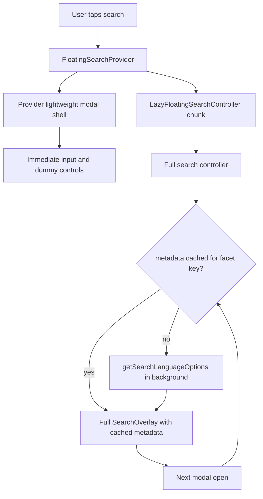

# Fix Search Modal Instant Shell Plan

## Summary

Make the Watch global search modal show its input shell immediately on mobile even when the full search controller chunk or language metadata request is slow. Preserve the staged-loading performance intent, cache language metadata after the first successful fetch, and avoid refetching it on later modal opens unless facets materially change.

---

## Problem Frame

The modal currently depends on `FloatingSearchController` before `SearchOverlay` can portal the input. `FloatingSearchProvider.openSearch()` flips `open` immediately, but the actual overlay input waits for the lazy controller chunk from `b44a2a57d` (`perf(web): stage watch interaction loading`) to load and mount. Once mounted, the controller also calls `getSearchLanguageOptions` on every modal open through the `open` effect in `FloatingSearchController`; the semantic-language readiness work from `fc275e6d0` made that metadata more important for query-language confirmation and manual language controls.

The fix should keep the staged client-loading win but split perceived modal availability from optional metadata. The first tap should render a lightweight overlay/input immediately, then hydrate richer controls and search metadata in the background. Later opens should reuse the already loaded controller and cached language metadata without another server action.

---

## Requirements

**Instant shell**

- R1. Tapping the floating search affordance renders a dialog and search input synchronously from already-loaded provider code, without waiting for the lazy controller chunk.
- R2. The lightweight shell preserves modal basics: background blur/dim, body inert/scroll lock behavior, close control, autofocus, query text, and input clear behavior.
- R3. Once `FloatingSearchController` is available, the full `SearchOverlay` replaces or upgrades the shell without losing query text or focus-worthy input state.

**Background metadata**

- R4. Language metadata loads in the background and must not block the empty modal input or category/search dummy controls from appearing.
- R5. Search can still wait briefly for language metadata only when needed for semantic query-language detection, using the existing bounded fallback semantics.
- R6. After language metadata has loaded once, reopening the modal with the same facet context reuses cached data and does not call `getSearchLanguageOptions` again.
- R7. If an Algolia search later returns a materially different `languageFacets` map, the controller may refresh metadata for that facet context once and cache that result.

**Regression and attribution**

- R8. Tests cover the slow-controller/slow-metadata path: input appears before metadata resolves and the metadata action has not blocked first paint.
- R9. Tests cover second open: the modal appears immediately and no additional language-options server action fires for the previously cached context.
- R10. The implementation preserves the original staged-loading objective from `b44a2a57d` and does not eagerly mount the heavy controller on initial page render.

---

## Key Technical Decisions

- **KTD1. Add a provider-owned lightweight overlay shell:** The provider is already loaded with the header/search affordance, so it is the right place to render a minimal shell while `LazyFloatingSearchController` loads. This avoids undoing the staged-loading split.
- **KTD2. Keep heavy search orchestration in `FloatingSearchController`:** Search results, pagination, Algolia mode, language panels, analytics, and query-language confirmation stay in the controller and full `SearchOverlay`; the shell only covers immediate input availability and close/clear affordances.
- **KTD3. Cache language metadata by facet context in the controller module:** A module-level cache or promise map keyed by normalized facet input lets first open, background refresh, and later opens share the same result without moving server-action data into browser storage.
- **KTD4. Reuse stale metadata while refreshing changed facets:** When cached options exist, the controller should render with them immediately and only refresh in the background for a new facet key. This keeps second-open behavior instant while still allowing Algolia facet-specific language availability to update.

---

## High-Level Technical Design

---

## Implementation Units

### U1. Roadmap Tracking

- **Goal:** Create an active roadmap bug ticket for the search-modal slow-open regression before implementation work.
- **Requirements:** R8, R10.
- **Dependencies:** None.
- **Files:** `docs/roadmap/content-discovery/feat-244-search-modal-instant-shell.md`, `docs/roadmap/README.md`.
- **Approach:** Use the next available `feat-244` ID, link back to `feat-172`, and record the exact blame findings: `b44a2a57d` introduced the lazy controller split; `fc275e6d0` introduced semantic-language metadata readiness behavior.
- **Patterns to follow:** `docs/roadmap/content-discovery/feat-172-forge-algolia-search-modal.md`.
- **Test scenarios:** Test expectation: none -- roadmap-only tracking.
- **Verification:** Roadmap index includes the active ticket and the ticket has enough grep patterns for future agents.

### U2. Lightweight Search Overlay Shell

- **Goal:** Render an immediately available modal shell and input from `FloatingSearchProvider` while the lazy controller is still loading.
- **Requirements:** R1, R2, R3, R10.
- **Dependencies:** U1.
- **Files:** `apps/web/src/components/FloatingSearchProvider.tsx`, `apps/web/src/components/SearchOverlayInstantShell.tsx`, `apps/web/src/components/FloatingSearchField.tsx`, `apps/web/src/components/__tests__/FloatingSearchProvider.test.tsx`.
- **Approach:** Extract or mirror only the top-bar input chrome needed for first paint. Wire it to provider-owned `query`, `setQuery`, close, and clear handlers. Render it only while `open || closing` and before the full controller has mounted.
- **Patterns to follow:** Current `SearchOverlay` top bar, `WatchModalViewportCloseButton`, and `docs/solutions/performance-issues/watch-staged-client-loading-20260611.md`.
- **Test scenarios:** User click opens an input before the lazy controller has flushed; clearing the input updates provider query; closing hides the shell; initial page render still does not mount the full overlay or call language metadata.
- **Verification:** Component tests prove the input exists immediately after click and the original no-initial-mount behavior remains.

### U3. Controller Readiness Handoff

- **Goal:** Let the provider hide the shell as soon as the full controller has mounted and is ready to render `SearchOverlay`.
- **Requirements:** R3.
- **Dependencies:** U2.
- **Files:** `apps/web/src/components/FloatingSearchProvider.tsx`, `apps/web/src/components/FloatingSearchController.tsx`, `apps/web/src/components/__tests__/FloatingSearchProvider.test.tsx`.
- **Approach:** Add an optional readiness callback prop from provider to controller. The controller calls it after client mount/portal readiness; the provider uses that state to stop rendering the shell.
- **Patterns to follow:** Existing `portalReady` state and `searchControllerEnabled` lifecycle.
- **Test scenarios:** Shell is visible before controller readiness, full overlay is visible after readiness, and query text survives the transition.
- **Verification:** Regression test exercises a delayed dynamic import/controller mount path.

### U4. Cached Language Metadata Loader

- **Goal:** Avoid repeated `getSearchLanguageOptions` server actions on later modal opens and make metadata refreshes background work.
- **Requirements:** R4, R5, R6, R7.
- **Dependencies:** U3.
- **Files:** `apps/web/src/components/FloatingSearchController.tsx`, `apps/web/src/components/__tests__/FloatingSearchProvider.test.tsx`.
- **Approach:** Introduce a normalized facet cache key and module-level cached response/promise map. `refreshLanguageOptions` should return cached options immediately when present, dedupe in-flight requests, and update state from the shared promise when needed. The `open` effect should skip refresh when the current facet key is already loaded.
- **Patterns to follow:** `apps/web/src/lib/watch-interaction-loader.ts` cache/promise ownership and existing `withSearchLanguageOptionsFallback` bounded wait.
- **Test scenarios:** First open with delayed metadata still renders input; resolving metadata populates language controls; closing and reopening does not call `getSearchLanguageOptions` again for the same facet key; a changed facet map triggers one new background fetch.
- **Verification:** Component tests assert server-action call counts across open/close cycles and facet refreshes.

### U5. Focused Validation and Browser Proof

- **Goal:** Validate the fixed mobile slow-open path with unit tests and browser smoke evidence.
- **Requirements:** R1 through R10.
- **Dependencies:** U2, U3, U4.
- **Files:** `apps/web/src/components/__tests__/FloatingSearchProvider.test.tsx`.
- **Approach:** Run focused component tests first, then app-level type/lint checks if touched code requires it. Browser smoke should open a Watch page at mobile width, throttle or simulate slow network when available, tap search, and capture that the input is visible before language metadata-dependent controls are required.
- **Patterns to follow:** Memory-backed user preference for browser smoke plus screenshot and `docs/solutions/performance-issues/watch-staged-client-loading-20260611.md` local route proof.
- **Test scenarios:** Browser smoke covers first open and second open in one session.
- **Verification:** Focused Vitest pass, relevant static checks, and at least one screenshot from the browser proof.

---

## Scope Boundaries

- This plan does not remove staged client loading or eagerly bundle the full search state machine into initial page JS.
- This plan does not change Algolia ranking, semantic search ranking, search result card behavior, or query-language detection product behavior.
- This plan does not add a `/watch/search` route; the global modal remains canonical.

---

## Risks and Dependencies

- **Shell/full overlay duplication:** Mirroring too much `SearchOverlay` markup can drift. Mitigation: keep the shell minimal and only cover first-paint input controls.
- **Focus transition:** Two inputs can briefly exist during handoff. Mitigation: hide the shell when the controller reports portal readiness and test query preservation.
- **Facet cache staleness:** Facet-specific language availability can change after searches. Mitigation: key cache by normalized facet map and allow background refresh when that key changes.
- **Test timing brittleness:** Dynamic imports in test environments often resolve faster than real mobile networks. Mitigation: add explicit readiness hooks or mocked delayed controller paths rather than relying on timer luck.

---

## Sources and Research

- Related roadmap: `docs/roadmap/content-discovery/feat-172-forge-algolia-search-modal.md`
- Origin requirements: `docs/brainstorms/2026-06-10-forge-algolia-search-modal-requirements.md`
- Prior plan: `docs/plans/2026-06-10-001-feat-forge-algolia-search-modal-plan.md`
- Staged-loading note: `docs/solutions/performance-issues/watch-staged-client-loading-20260611.md`
- Metadata race note: `docs/solutions/ui-bugs/watch-semantic-search-language-metadata-confirmation-race.md`
- Current shell/controller split: `apps/web/src/components/FloatingSearchProvider.tsx`, `apps/web/src/components/FloatingSearchController.tsx`, `apps/web/src/components/SearchOverlay.tsx`
- Current tests: `apps/web/src/components/__tests__/FloatingSearchProvider.test.tsx`
