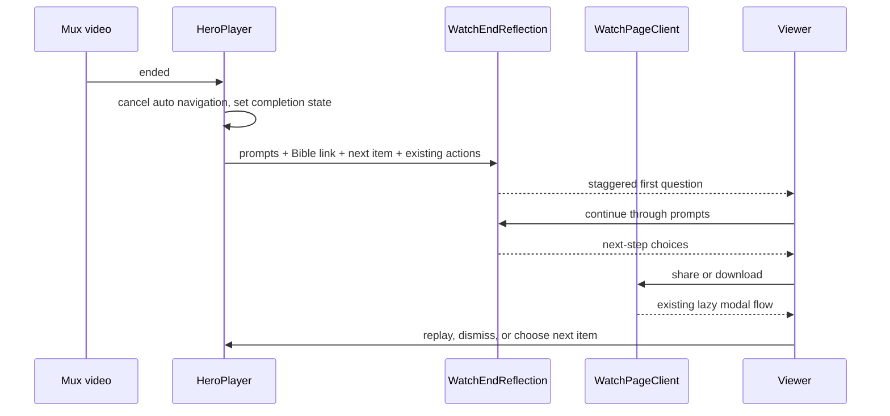

# feat: Watch End Reflection and Next Steps

---

## Overview

Turn a completed Watch video into a deliberate reflection moment instead of an
automatic route change. The player will pause on its last frame, reveal the
video's editorial reflection questions one at a time, and then offer clear
paths to continue: read the linked Bible passage, ask a Bible question, talk
with a person, share or download the video, go deeper with Bible study, or
choose the next playable episode/chapter.

The feature covers the web Watch hero only. It uses the existing Watch
question, Bible citation, Share, Download, and route-navigation contracts;
there is no new backend, CMS field, or user-data persistence in this slice.

## Problem Frame

Watch already provides good content and connection actions below the video,
but natural completion currently auto-advances to the next Watch item when the
five-second countdown is armed. That treats completion as a retention event
rather than the moment a viewer may be ready to think, ask, connect, or study.
The player is the one surface that reliably knows completion occurred, so it
must own the end state while the renderer supplies the existing editorial and
action data.

## Requirements Trace

- R1. A completed, viewer-initiated Watch playback displays a reflection
  overlay without navigating away automatically. The poster-first muted preview
  loop never counts as completion.
- R2. Editorial study questions reveal in sequence; a stable existing fallback
  question appears when the video has none.
- R3. The reflection state offers direct, understandable next steps: read the
  first linked Bible passage when available, ask a Bible question, talk with a
  person, share, download when available, go deeper with Bible study, and
  continue to the next playable Watch item when available.
- R4. The overlay has intentional entrance/progression motion, but remains
  completely usable with `prefers-reduced-motion`.
- R5. Completion, replay, Escape, route changes, modal opening, fullscreen,
  focus, and portaled player chrome leave no stale overlay or auto-navigation.
- R6. The change preserves server-rendered Watch content and initial
  poster-first/staged-interaction loading behavior.
- R7. Every locale keeps a structurally valid message catalog.

## Scope Boundaries

- The feature applies to the web Watch hero on single-video/episode routes;
  native mobile, TV, inline section players, admin previews, and embed players
  are out of scope.
- It does not send questions, create a new person-to-person chat integration,
  track reflection answers, or alter public URLs.
- It does not add a new Bible provider call. The optional read action uses the
  Admin-resolved Bible citation already available on the Watch page.
- It does not change the existing below-player Study Questions, Bible Quotes,
  Share, or Download surfaces.

## Context & Research

### Relevant Code and Patterns

- `apps/web/src/components/watch/HeroPlayer.tsx` owns Mux media events,
  fullscreen-safe overlay rendering, the final-five-second Watch Next state
  machine, and client-side next-route navigation.
- `apps/web/src/components/watch/WatchSectionRenderer.tsx` has the complete
  synthetic Watch block list. It can derive study questions and Bible passage
  metadata once and pass a view model into the hero without changing server
  data loading.
- `apps/web/src/components/watch/WatchStudyQuestions.tsx` supplies the
  editorial-question fallback plus established public Chat and Bible-question
  endpoints.
- `apps/web/src/components/watch/BibleQuotesSection.tsx` owns the current
  Bible.com link construction from an Admin-resolved passage, and its promo
  link is the established deeper-study destination.
- `apps/web/src/components/watch/WatchPageClient.tsx` owns the staged Share
  and Download modals and already passes their callbacks through
  `WatchSectionRenderer`.
- `docs/solutions/ui-bugs/watch-next-countdown-portaled-chrome-cancellation.md`
  requires player interaction behavior to account for both the sticky hero and
  the portaled control bar.
- `docs/solutions/performance-issues/watch-staged-client-loading-20260611.md`
  requires Watch completion UI to avoid new initial data work or eager modal
  loading.

### External Research

No external research is load-bearing. The repo already has direct Watch
patterns for completion, questions, Bible passages, connection links, modals,
route construction, motion, and accessibility.

## Key Technical Decisions

- Replace completion-time auto-advance with a reflection state. The existing
  five-second next affordance can remain a manual invitation before completion,
  but `ended` must reveal reflection rather than call `router.push`.
- Create a focused client component for the end overlay and a small typed view
  model rather than adding another large conditional block to `HeroPlayer`.
  `HeroPlayer` remains the media-event owner and renders the child when it
  enters `ended`; the renderer remains the data/action composition point.
- Reuse editorial `StudyQuestions` in their defined order and use the existing
  `WatchStudyQuestions.placeholderQuestion` fallback. Display one question at
  a time with explicit next/back controls so reflection is paced rather than a
  dense card list.
- Extract/reuse Watch connection and Bible-link utilities rather than copying
  external URLs or Bible.com query construction into the new overlay.
- Thread existing modal callbacks into the overlay. Opening Share or Download
  must preserve the established staged chunk and session-gate behavior rather
  than adding eager imports or a second modal implementation.
- Make all end-state motion CSS-driven and add motion-reduce variants. On
  entry, move focus to the overlay heading/first actionable control; use a
  visible close/replay route and restore focus to a real player control (not
  the non-focusable hero wrapper) on dismissal.
- Introduce a dedicated i18n namespace and mechanically seed matching keys in
  every locale catalog, preserving existing translations and catalog shape.

## Assumptions

- “Single video” means the web Watch video completion experience, including
  episodic routes that use the same `HeroPlayer`; the overlay makes any next
  episode/chapter optional instead of automatic.
- “Read this story in the Bible” is present only when the current video has an
  Admin-resolved citation with a valid Bible.com URL. “Go deeper” uses the
  existing Bible-study destination.
- Existing external Chat and Bible-question URLs are approved connection
  destinations for this feature, because they are already shipped from
  `WatchStudyQuestions`.

## High-Level Technical Design

## Implementation Units

### U1. Define the Completion Reflection View Model and Shared Destinations

- **Goal:** Give the player a compact, UI-ready description of questions and
  next steps without duplicating Watch URLs or pulling new data on the client.
- **Requirements:** R2, R3, R6.
- **Dependencies:** None.
- **Files:** `apps/web/src/components/watch/WatchSectionRenderer.tsx`,
  `apps/web/src/components/watch/WatchStudyQuestions.tsx`,
  `apps/web/src/components/watch/BibleQuotesSection.tsx`, and a new focused
  Watch helper when extraction makes the existing external links/link builder
  reusable without component-to-component imports.
- **Approach:** Derive ordered prompt strings from the existing StudyQuestions
  block, use its established placeholder when empty, derive a first-passage
  Bible URL only through the existing Admin-resolved citation logic, and expose
  the existing chat/Bible-question/deeper-study destinations as shared
  constants or helpers. Pass the model and the existing Share/Download
  callbacks through `WatchSectionRenderer` into `HeroPlayer`.
- **Patterns to follow:** Synthetic Watch block dispatch in
  `WatchSectionRenderer.tsx`; fail-soft link construction in
  `BibleQuotesSection.tsx`; static connection destinations in
  `WatchStudyQuestions.tsx`.
- **Test scenarios:**
  - Editorial questions retain their source ordering.
  - A prompt-less video gets the existing fallback prompt.
  - A valid resolved passage yields a read action; absent/malformed citation
    data omits it without throwing.
  - Share and download use callbacks rather than importing modal components.
- **Verification:** Focused renderer/component tests prove both rich and
  minimal video metadata paths.

### U2. Build the Accessible Animated Reflection Overlay

- **Goal:** Add a premium, calm end-frame component that guides a viewer from
  reflection to practical next steps.
- **Requirements:** R1, R2, R3, R4, R5.
- **Dependencies:** U1.
- **Files:** a new `apps/web/src/components/watch/WatchEndReflection.tsx`, a
  new focused test file beside the existing Watch component tests, and
  `apps/web/src/components/watch/HeroPlayer.tsx`.
- **Approach:** Render the overlay inside the hero's established overlay
  stacking context only once user-initiated, non-looping playback has naturally
  ended. Start with a small completion cue and the first question, advance
  through prompts one at a time with back/next progression, then transition to
  a grouped next-step surface.
  Use actual action buttons/anchors for read, ask, talk, share, download,
  deeper study, optional next item, and replay. Keep the poster/video frame
  visible beneath an accessible darkening scrim. Use semantic headings,
  `aria-live` only for the changing question cue (not the whole dialog),
  visible focus treatment, and motion-reduce class variants.
- **Patterns to follow:** Watch dark-stone/glass surfaces, pill actions,
  `focus-visible` affordances, and existing CSS animation conventions; do not
  introduce a separate design system or animation dependency.
- **Test scenarios:**
  - The overlay is absent before completion, appears only after `ended` from
    revealed playback, and never appears when the poster-first muted loop
    reaches its end.
  - It starts with the first prompt, moves one prompt at a time, and reaches
    the next-step choices after the final prompt.
  - Fallback, optional Bible read, optional download, and optional next-video
    states each render correctly.
  - Chat, Bible question, deeper study, and Bible read links have secure
    external-link attributes; share/download delegate to callbacks.
  - Escape/dismiss and replay remove the overlay and return focus to a real
    player control/playback surface safely.
  - Reduced-motion class variants are present and keyboard controls remain
    reachable in every step.
- **Verification:** Component tests cover the state machine; visual browser
  proof assesses the poster composition, spacing, contrast, and progression.

### U3. Reconcile Completion with Watch Next, Media Lifecycle, and Portals

- **Goal:** Make completion reliable and prevent stale countdown/overlay state
  across all player interactions.
- **Requirements:** R1, R5, R6.
- **Dependencies:** U2.
- **Files:** `apps/web/src/components/watch/HeroPlayer.tsx`,
  `apps/web/src/components/watch/HeroPlayerControls.tsx`,
  `apps/web/src/components/watch/__tests__/HeroPlayer.test.tsx`.
- **Approach:** Keep the current final-window state machine for the optional
  manual next invitation, but remove its `ended` route push. On native `ended`
  from revealed (non-looping) playback, cancel the current auto mode and enter
  reflection. Clear completion state when a different route/video mounts;
  replay seeks to the start, closes the overlay, and resumes subject to the
  browser's normal play policy. Ensure controls and the portaled chrome cannot
  accidentally re-arm or navigate while reflection is active, and hide custom
  chrome/overlay controls that would compete with the end-state action layer.
  Maintain existing modal pause and fullscreen behavior.
- **Patterns to follow:** The per-pass threshold transitions and portal event
  capture documented in the Watch Next solution; lifted media refs and cleanup
  effects in `HeroPlayer`/`HeroPlayerControls`.
- **Test scenarios:**
  - Natural final-window playback no longer calls `router.push` after `ended`.
  - Seeking into the final window still never creates an automatic navigation
    path.
  - User interactions with sticky-video and portaled controls do not navigate
    after completion.
  - Replay/dismiss clears reflection, player-ended state, and countdown state.
  - A new video document id resets reflection so the previous prompt/action
    model cannot flash on the next route.
  - The existing manual Next control remains available before completion when
    a playable next item exists.
- **Verification:** Extend focused HeroPlayer lifecycle tests without removing
  prior threshold/portal regression cases.

### U4. Localize, Validate, and Capture Browser Proof

- **Goal:** Ship the UI without catalog drift or an initial-load regression.
- **Requirements:** R4, R6, R7.
- **Dependencies:** U1-U3.
- **Files:** `apps/web/messages/en.json`, every structurally parallel
  `apps/web/messages/*.json` catalog, relevant Watch tests, and the roadmap
  ticket/plan status documents.
- **Approach:** Add compact action-oriented copy under a dedicated
  `WatchEndReflection` namespace. Propagate the English fallback structure to
  all catalog files using a controlled mechanical patch so existing translated
  values remain untouched. Keep new overlay code in the already-loaded Watch
  client boundary; do not move modal imports or issue new fetches before the
  viewer reaches the end state.
- **Test scenarios:**
  - Catalog parity passes for every message file.
  - Hero/renderer tests pass with the new namespace and no stale hard-coded
    user-facing action copy.
  - A page-load smoke observes no reflection-specific network request or modal
    chunk before video completion.
  - Desktop and narrow-mobile end-state screenshots remain readable, usable,
    and visually consistent with the design thesis.
- **Verification:**
  - `pnpm --filter @forge/web test -- src/components/watch/__tests__/HeroPlayer.test.tsx src/components/watch/__tests__/WatchSectionRenderer.test.tsx`
  - `pnpm --filter @forge/web typecheck`
  - `pnpm --filter @forge/web lint`
  - `pnpm --filter @forge/web check:ui-locales`
  - Browser smoke with an `ended` media event, reflection progression, all
    available calls to action, replay/dismiss, and reduced-motion media query.

## System-Wide Impact

- Viewers retain control after a Watch video completes, while still receiving
  a strong next-video invitation when relevant.
- Existing third-party connection URLs stay centralized, which makes future
  destination changes consistent in both below-player and completion surfaces.
- The Watch player no longer navigates automatically on media `ended`; this is
  an intentional behavioral change covered by lifecycle tests and browser QA.
- No Admin schema, GraphQL generation, database migration, feature flag, or
  deployment configuration change is required.

## Risks and Mitigations

- **Overlay conflicts with player portals/fullscreen:** mount inside the
  established hero overlay context and test both sticky-wrapper and portaled
  chrome interactions.
- **An end event fires from a stale player after route change:** scope state to
  `video.documentId`, clean up listeners, and reset on new media.
- **A long question sequence feels trapping:** always provide a visible exit,
  replay, and an efficient continue action; retain keyboard Escape.
- **Catalog drift across many locales:** apply a mechanical structural update
  and run the existing parity checker.
- **End state grows initial bundle or fetch cost:** use local data already in
  the client and retain existing Share/Download dynamic loading.

## Open Questions

### Resolved During Planning

- Should completion auto-advance to the next episode? No. Next is present as a
  clear viewer-controlled choice after reflection.
- Should reflection answers be stored or sent? No. The first release is a
  lightweight, private reflection experience using existing connection paths.
- Should every video show a Bible-read action? No. Render it only from an
  already-resolved, valid citation link.

### Deferred to Implementation

- Exact question dwell timing and the compact/mobile action ordering should be
  set during the single visual verification pass against a real Watch route.
- Whether the pre-end five-second manual Next invitation should stay visible
  beneath the new product framing can be decided from the finished hierarchy;
  it must never auto-navigate.

## Validation Strategy

Run narrow component/lifecycle tests first, then web typecheck, lint, catalog
parity, and a local browser smoke with a screenshot. Test real completion by
triggering the media `ended` event rather than only rendering the overlay in
isolation. Verify the Watch initial route still loads its poster/content before
any reflection-only work or modal chunk runs.
