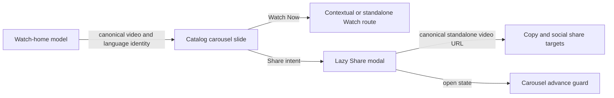

# feat: Add Watch home share action

## Summary

Add a localized secondary Share action beside the Watch Now action in the Watch home hero. It will open the existing lazy Share modal for the active catalog video without changing the public watch or canonical URL contracts.

---

## Problem Frame

The Watch home hero presents a prominent Watch Now CTA but does not let a visitor share the featured video from that decision point. The page already has an established Share modal with copy, social, and embed behavior, so a separate share flow would duplicate behavior and risk URL drift.

---

## Requirements

**Hero action**

- R1. A catalog-video hero slide with a valid Watch target renders a localized Share button next to Watch Now.
- R2. The Share button uses the hero’s existing secondary-pill treatment, remains keyboard accessible, and stacks safely below the primary action on narrow screens.
- R3. Clicking Share opens the existing Share modal with the active slide’s title, description, poster, playback ID, canonical video slug, and public audio-language slug.

**Canonical and runtime behavior**

- R4. Share links remain the standalone canonical video route, even when Watch Now uses a contextual collection/episode route.
- R5. Mux-only promotional inserts and slides without valid catalog share identity do not render the video Share action.
- R6. The Share modal stays out of the initial hero bundle and the active carousel slide cannot advance while its Share modal is open.

---

## Key Technical Decisions

- KTD1. Carry explicit canonical video and language identity from Watch-home normalization into catalog carousel slides. The visible Watch target may retain a contextual episode route, while ShareModal continues to build the standalone canonical video URL through the shared route builder.
- KTD2. Reuse ShareModal and the shared interaction loader behind a user-intent dynamic boundary. The carousel will only mount the modal after Share is requested, matching the existing Watch-page performance posture.
- KTD3. Treat the open Share modal as a carousel interaction lock for its captured catalog slide. Timer-driven, media-ended, Next-control, and rail-selection paths must all remain blocked until the modal closes; an active preview pauses and resumes only when it had been playing before the modal opened.
- KTD4. Reuse the existing translated `BibleQuotes.share` label rather than adding a Watch-home-only catalog key, keeping all supported locale catalogs in parity.

---

## Assumptions

- The requested header action applies to the active catalog-video hero CTA shown in the supplied image, not to external Mux promotional actions.
- Sharing from the home hero has the same copy, social, embed, and close behavior as ShareModal on a Watch video page.
- An unmuted preview should pause behind the Share modal and resume only when it was playing at the open edge.

---

## High-Level Technical Design

---

## Scope Boundaries

- In scope: the active catalog-video action row, existing Share modal integration, and carousel pause behavior.
- Out of scope: new share providers, changes to ShareModal’s visual design or copy behavior, Mux promotional-share actions, and changes to Watch URL or SEO metadata ownership.

---

## Implementation Units

### U1. Carry canonical share identity through Watch-home slide data

- **Goal:** Let the carousel identify a catalog video’s canonical standalone share target without parsing its visible Watch href.
- **Requirements:** R3, R4, R5.
- **Dependencies:** None.
- **Files:** `apps/web/src/lib/watch-home.ts`; `apps/web/src/lib/watch-home-carousel-sequence.ts`; `apps/web/src/lib/__tests__/watch-home.test.ts`.
- **Approach:** Preserve validated video-slug and public language-slug values on WatchHomeCard and propagate them to catalog carousel slides during both hero and playlist construction. Keep contextual href construction unchanged and leave Mux insert types without catalog share identity.
- **Patterns to follow:** `buildHref` and `watchVideoPath`/`watchEpisodePath` in `apps/web/src/lib/watch-home.ts`; the standalone-canonical rule in `docs/roadmap/platform/feat-179-watch-contextual-video-canonical.md`.
- **Test scenarios:** A localized catalog card exposes canonical video and language identity; an episode-context Watch href retains its contextual destination while its share identity remains standalone; malformed or absent route identity cannot produce a shareable carousel slide.
- **Verification:** Home-model tests prove identity propagation without changing the existing Watch href contract.

### U2. Add the lazy secondary Share action to the hero carousel

- **Goal:** Render the requested secondary Share control and open the established modal for the active catalog slide.
- **Requirements:** R1, R2, R3, R5, R6.
- **Dependencies:** U1.
- **Files:** `apps/web/src/components/home/WatchHomeTvCarousel.tsx`; `apps/web/src/components/home/__tests__/WatchHomePage.test.tsx`.
- **Approach:** Extend the existing action-row callback path to carry a shareable catalog slide, reuse its secondary-pill classes and Share2 icon, and source its visible label from the existing translated Share string. Load and mount ShareModal only after the click, warm the shared interaction module on intent, and pass the active slide’s canonical identity plus modal metadata.
- **Patterns to follow:** Share-modal state and dynamic import in `apps/web/src/components/watch/WatchPageClient.tsx`; staged interaction imports in `apps/web/src/lib/watch-interaction-loader.ts`; responsive action-row behavior already present in `WatchHomeTvCarousel`.
- **Test scenarios:** A valid hero renders Watch Now followed by a focusable secondary Share button; a Share click renders the modal with the active title, description, poster, playback ID, and standalone canonical link; closing the modal clears the open state; Mux inserts and slides lacking share identity expose no video Share button.
- **Verification:** The Watch-home component test verifies action order, translated accessible name, secondary styling, complete modal metadata, lifecycle, and canonical URL input.

### U3. Freeze carousel advancement while sharing

- **Goal:** Keep the video and preview state being shared stable until its modal is closed.
- **Requirements:** R6.
- **Dependencies:** U2.
- **Files:** `apps/web/src/components/home/useWatchHomeTvCarousel.ts`; `apps/web/src/components/home/WatchHomeTvCarousel.tsx`; `apps/web/src/components/home/__tests__/WatchHomePage.test.tsx`.
- **Approach:** Extend the carousel’s existing per-slide auto-advance pause into a shared interaction lock. Route timer, media-ended, Next-control, and rail-selection paths through it while the captured share slide is open, snapshotting whether the preview was playing to pause and conditionally resume it. Preserve existing short-film takeover behavior and resume normal advancement after close.
- **Patterns to follow:** The `autoAdvancePausedForSlideId` timer guard in `apps/web/src/components/home/useWatchHomeTvCarousel.ts`; Watch-page modal pause/resume handling in `apps/web/src/components/watch/WatchPageClient.tsx`.
- **Test scenarios:** Advancing time, dispatching a media-ended event, using either Next control, or selecting a rail card while Share is open leaves the active slide and modal metadata unchanged; an unmuted playing preview pauses on open and only resumes after close when it was previously playing; closing Share restores normal advancement and selection; the short-film takeover path remains unaffected.
- **Verification:** Focused Watch-home tests cover timer, media-ended, Next-control, rail-selection, and preview pause/resume paths with an open and then closed Share modal.

---

## Risks and Dependencies

- URL drift is the main correctness risk: the contextual Watch href must never be reused as the Share canonical URL. Preserve the existing route-builder boundary and test both identities.
- The hero is initial-render sensitive. Static importing ShareModal would regress staged client loading, so its dynamic boundary is required.
- Base UI dialogs remain in their closing animation briefly. Browser verification must check `data-open`/`data-closed` state rather than immediate DOM absence.

---

## Sources and Research

- `apps/web/src/components/home/WatchHomeTvCarousel.tsx` owns the current red Watch Now action and its secondary-pill style.
- `apps/web/src/components/watch/ShareModal.tsx` owns the canonical link, social actions, embed behavior, and dialog lifecycle.
- `docs/roadmap/platform/feat-179-watch-contextual-video-canonical.md` establishes standalone URLs as the canonical share identity for contextual episode routes.
- `docs/solutions/performance-issues/watch-staged-client-loading-20260611.md` records ShareModal as a staged dynamic chunk.
- `docs/solutions/best-practices/base-ui-dialog-state-attribute-detection-20260520.md` defines the reliable modal-close assertion for browser smoke tests.
