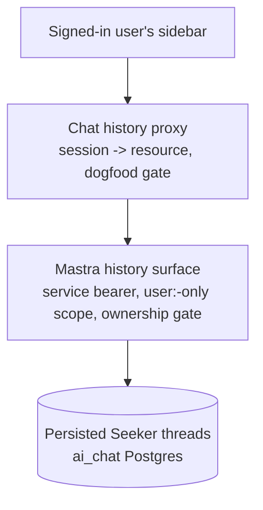

# Chat Server History + Sidebar Hydration - Plan

## Goal Capsule

- **Objective:** Ship feat-241 — the server-side conversation history read path for the chat app: a Mastra listing surface, a replay surface, chat-side proxy routes, and sidebar hydration with resume.
- **Product authority:** `docs/roadmap/ai-chat/feat-241-chat-server-history-sidebar.md`, refined by the decisions in this Product Contract.
- **Open blockers:** none for planning. Deploy-order only: no history surface goes live before feat-240's sign-out force-login marker merges — without it, sign-out on a shared browser silently re-auths and would hand the next user the previous user's history.

---

## Product Contract

### Summary

Signed-in, gate-granted dogfood users get their persisted Seeker conversations back: the sidebar hydrates from a paginated server listing with a Load-more control, threads carry LLM-generated titles, and selecting a thread replays its transcript and lets the user keep chatting in the same server thread. Anonymous and gate-denied users keep exactly today's ephemeral client-only sidebar.

### Problem Frame

Since feat-208, Seeker conversations persist server-side under a per-user resource, but no read path exists — the sidebar lists only in-memory client conversations, so a refresh discards history the server already holds. Anonymous ephemerality, by contrast, is deliberate: the anonymous continuity cookie is a long-lived bearer token that must never become a history-reading credential.

### Key Decisions

- **History is resumable, not read-only.** The client already addresses threads by a client-minted id on every send, and the ownership gate refuses foreign threads — so continuing an old thread is the existing send path pointed at a discovered id. Read-only replay would introduce a novel fork-on-reply behavior instead of removing risk.
- **LLM-generated titles, not a first-message snippet.** Enable Mastra's title generation for sidebar quality. Consequences: one model call per titling turn; generation fires asynchronously on the next send of any thread that still lacks a title — new threads title after their first turn, a resumed pre-existing untitled thread gains a title (derived from the resume message) on that send, and never-resumed threads keep the date-derived fallback label (no bulk backfill).
- **Load-more pagination.** First page, most-recently-active first, plus an explicit Load-more control — complete day-one behavior without infinite-scroll machinery.
- **View/resume only.** No delete or rename; management is stubbed as feat-247 for a future phase.
- **Reuse over net-new.** Every surface extends an established pattern: the bearer-gated `/forge-*` route shape, the seeker proxy conventions, the seeker dogfood gate helper, and the thread-ownership gate.

The read path layers three independent refusals before any message bytes move:

### Requirements

**Server read surface (Mastra)**

- R1. Listing returns only threads scoped to the caller's resolved resource, paginated, most-recently-active first.
- R2. Listing refuses any resource that is not `user:`-prefixed, server-side; the shared dogfood fallback resource is never listable.
- R3. Replay returns the messages of one thread only after the ownership gate passes; any mismatch yields `thread_forbidden`, never silent adoption.
- R4. Both surfaces are bearer-gated `/forge-*` routes; Mastra's built-in `/api/*` surfaces stay unexposed.

**Chat proxy**

- R5. The proxy resolves the caller's resource from the signed session server-side; the client never names a resource.
- R6. An expired or invalid session cookie is refused — a valid signed session is the credential.
- R7. History endpoints deny unless the seeker dogfood gate returns a full grant, re-resolved per request; this layer is phase scaffolding on top of R5 and comes off in feat-236.
- R8. Anonymous sessions receive no history — listing and replay are refused server-side, not merely unrendered.
- R9. The proxy follows the existing seeker proxy conventions: server-held Mastra bearer, https/SSRF guard, bounded timeout, plain-string logs.

**Titles**

- R10. New threads receive an LLM-generated title via Mastra's title generation, produced asynchronously at thread creation.
- R11. The listing returns a displayable title when one exists; untitled threads (pre-existing, generation pending, or generation failed) render a deterministic fallback derived from the thread's last activity date (e.g. "Conversation — Jul 10"), and no bulk backfill runs for existing threads.

**Sidebar hydration and resume**

- R12. For signed-in, gate-granted users the sidebar loads the first page of server history on app load and offers a Load-more control for further pages.
- R13. Selecting a listed thread lazy-loads its transcript.
- R14. The user can continue a hydrated thread: new sends append to the same server thread, and the per-conversation pending/abort behavior keeps working.
- R15. Server history and in-session conversations merge deduplicated by conversation id (the client conversation id and server thread id are the same value).
- R16. The server list has loading, empty, and error states; gate-denied and signed-out users keep exactly today's client-only sidebar, with no sign-in nudge.
- R17. After a refresh, a signed-in user sees the sidebar restored and lands on a fresh chat pane; an anonymous user resets entirely, as today.
- R18. Replay has its own user-visible states: a loading state while a selected thread's transcript fetches, and an explicit failure state when replay fails (network failure or `thread_forbidden`) — never a silent no-op.

**Ticket obligations**

- R19. The implementation PR updates feat-236's removal recipe with every new gate call site it adds — the recipe's greps are its source of truth.

### Key Flows

- F1. Sidebar hydration
  - **Trigger:** App load with a valid signed session and a full gate grant.
  - **Steps:** Sidebar shows its loading state; the proxy resolves resource and gate; the Mastra listing returns the first page; the list renders titles (or fallback labels) most-recently-active first with Load more.
  - **Covers:** R1, R11, R12, R16.
- F2. Resume
  - **Trigger:** User selects a server-history thread and sends a message.
  - **Steps:** The transcript lazy-loads via replay; the send goes through the existing seeker path with the same conversation id; the ownership gate admits the owner; the reply streams into the same thread.
  - **Covers:** R3, R13, R14, R15, R18.

### Acceptance Examples

- AE1. **Covers R1, R2.** Given a signed-in allowlisted user, when the sidebar hydrates, then only threads under their own `user:` resource appear and the dogfood fallback resource never does.
- AE2. **Covers R7, R16.** Given a signed-in but non-allowlisted user, when the app loads, then history is denied server-side and the sidebar behaves exactly as today's client-only sidebar.
- AE3. **Covers R8.** Given an anonymous session, when it requests listing or replay, then the server refuses.
- AE4. **Covers R3.** Given a replay request for another identity's thread, then the response is `thread_forbidden`.
- AE5. **Covers R6.** Given an expired or invalid session cookie, when history is requested, then the request is refused.
- AE6. **Covers R11.** Given a thread with no title — pre-existing, generation pending, or generation failed — when listed, then it renders the date-derived fallback label from its last activity date, so threads with different activity dates stay distinguishable.
- AE7. **Covers R14, R15.** Given a hydrated old thread, when the user sends a message, then the reply lands in the same server thread and the conversation appears exactly once in the sidebar.
- AE8. **Covers R17.** Given a signed-in user refreshes, then the sidebar restores from the server and the main pane is a fresh chat; given an anonymous user refreshes, everything resets.

### Scope Boundaries

- Delete/rename of threads — feat-247 (stub created alongside this plan).
- Anonymous-to-account thread migration — feat-248 (stub; a future consideration, explicitly not a requirement now).
- Per-conversation URLs, deep-link restore, and the explicit "session expired" UX — feat-209.
- The "Sign in to save your conversations" nudge, the day-one rate cap, and gate removal — feat-236.
- Title backfill for pre-existing threads — not planned.
- No changes to `apps/auth`.

### Dependencies / Assumptions

- Deploy order: feat-240 (sign-out force-login marker) merges before any history surface is exposed; planning and implementation of this ticket proceed independently of feat-240's content.
- Verified against the codebase (2026-07-13): the paginated, resource-filtered thread-listing API exists in the installed Mastra version and threads carry an optional title; Mastra title generation is currently off; the ownership gate returns `thread_forbidden` on mismatch and enforces a 200-threads-per-resource ceiling; the sidebar component is presentational-only today; no history surface exists yet in either app.
- Assumption: the dogfood roster is small enough that no rate cap is needed on the history routes; the cap is feat-236's step-0 precondition.

### Outstanding Questions

Deferred to planning:

- Title-generation model and configuration placement (a cheap model is acceptable).
- Page size, and how ordering behaves when a resumed thread becomes the most recently active.
- Whether the replay payload needs message-shape mapping before it renders through the existing message components.
- Replay-state presentation for R18: the loading affordance while a transcript fetches, and the failure treatment (inline error, toast, or fall back to a fresh chat pane), including the `thread_forbidden` case.

### Sources / Research

- `docs/roadmap/ai-chat/feat-241-chat-server-history-sidebar.md` — the ticket; its Entry Points and Grep These sections orient the planner.
- `docs/plans/2026-07-05-001-feat-seeker-postgres-memory-plan.md` §C/§D/§G — ownership gate, resource keying, recorded preconditions; §G's revocation precondition is superseded by feat-240's Decision Record.
- `docs/roadmap/ai-chat/feat-236-chat-remove-seeker-dogfood-gate.md` — the removal recipe this ticket's PR must refresh; owns the deferred nudge and rate cap.
- `docs/roadmap/ai-chat/feat-209-chat-per-conversation-urls.md` — consumes this ticket's replay path; owns deep-link restore.
- Key code: `apps/mastra/src/mastra/ai-chat-thread-ownership.ts`, `apps/mastra/src/mastra/memory.ts` (`buildAiChatMemory`), `apps/mastra/src/mastra/agents/seeker-route.ts`, `apps/chat/src/app/api/seeker/route.ts`, `apps/chat/src/lib/seeker-gate.ts`, `apps/chat/src/auth/anon-id.ts`, `apps/chat/src/lib/use-conversations.ts`, `apps/chat/src/lib/conversations.ts` (`deriveTitle`), `apps/chat/src/components/shell/sidebar-conversation-list.tsx`.
