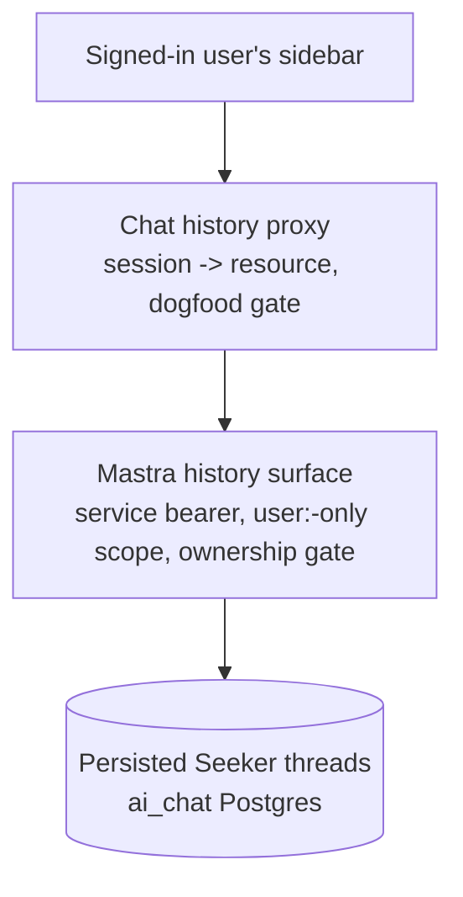
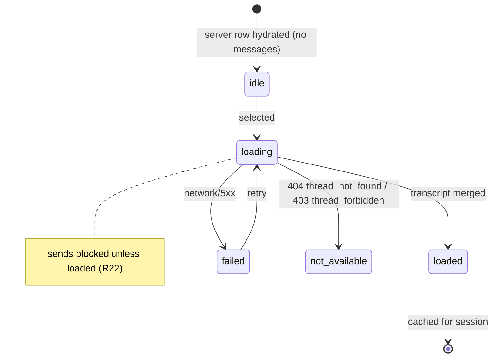

# Chat Server History + Sidebar Hydration - Plan

## Goal Capsule

- **Objective:** Ship feat-241 — the server-side conversation history read path for the chat app: a Mastra listing surface, a replay surface, chat-side proxy routes, sidebar hydration with resume, and LLM thread titles.
- **Product authority:** `docs/roadmap/ai-chat/feat-241-chat-server-history-sidebar.md`, refined by the decisions in this Product Contract. The ticket's Entry Points, Grep These, and Constraints sections are binding.
- **Preconditions:** feat-240 (sign-out force-login marker) merged to `main` on 2026-07-13 via PR #1539 — the ticket's no-history-exposure-before-real-sign-out constraint is satisfied.
- **Stop conditions:**
  - No `apps/auth` changes. No widening of the dogfood gate. No delete/rename surfaces (feat-247).
- **Execution profile:** two packages — `@forge/mastra` (routes + titles) and `@forge/chat` (proxy + client). Verification Contract gates both.

---

## Product Contract

### Summary

Signed-in, gate-granted dogfood users get their persisted Seeker conversations back: the sidebar hydrates from a paginated server listing with a Load-more control, threads carry LLM-generated titles, and selecting a thread replays its transcript and lets the user keep chatting in the same server thread. Anonymous and gate-denied users keep exactly today's ephemeral client-only sidebar.

### Problem Frame

Since feat-208, Seeker conversations persist server-side under a per-user resource, but no read path exists — the sidebar lists only in-memory client conversations, so a refresh discards history the server already holds. Anonymous ephemerality, by contrast, is deliberate: the anonymous continuity cookie is a long-lived bearer token that must never become a history-reading credential.

### Key Decisions

- **History is resumable, not read-only.** The client already addresses threads by a client-minted id on every send, and the ownership gate refuses foreign threads — so continuing an old thread is the existing send path pointed at a discovered id. Read-only replay would introduce a novel fork-on-reply behavior instead of removing risk.
- **LLM-generated titles, not a first-message snippet.** Enable Mastra's title generation for sidebar quality. Consequences: one model call per titling turn; generation fires asynchronously on the next send of any thread that still lacks a title — new threads title after their first turn, a resumed pre-existing untitled thread gains a title (derived from the resume message) on that send, and never-resumed threads keep the date-derived fallback label (no bulk backfill).
- **Load-more pagination.** First page, most-recently-active first, plus an explicit Load-more control — complete day-one behavior without infinite-scroll machinery.
- **View/resume only.** No delete or rename; management is stubbed as feat-247 for a future phase.
- **Reuse over net-new.** Every surface extends an established pattern: the bearer-gated `/forge-*` route shape, the seeker proxy conventions, the seeker dogfood gate helper, and the thread-ownership gate.

The read path layers three independent refusals before any message bytes move:



### Requirements

**Server read surface (Mastra)**

- R1. Listing returns only threads scoped to the caller's resolved resource, paginated, most-recently-active first.
- R2. Listing and replay both refuse any resource that is not `user:`-prefixed, server-side; the shared dogfood fallback resource is never listable or replayable.
- R3. Replay returns the messages of one thread only after the ownership gate passes; any mismatch yields `thread_forbidden`, never silent adoption. A thread that no longer exists yields an explicit not-found outcome, never an empty-transcript success.
- R4. Both surfaces are bearer-gated `/forge-*` routes; Mastra's built-in `/api/*` surfaces stay unexposed.

**Chat proxy**

- R5. The proxy resolves the caller's resource from the signed session server-side; the client never names a resource, and a client-supplied resource field is never forwarded.
- R6. An expired or invalid session cookie is refused — a valid signed session is the credential.
- R7. History endpoints deny unless the seeker dogfood gate returns a full grant, re-resolved per request; this layer is phase scaffolding on top of R5 and comes off in feat-236.
- R8. Anonymous sessions receive no history — listing and replay are refused server-side, not merely unrendered.
- R9. The proxy follows the existing seeker proxy conventions: server-held Mastra bearer, https/SSRF guard, bounded timeout, plain-string logs.

**Titles**

- R10. Signed-in (`user:`-resource) threads receive an LLM-generated title via Mastra's title generation, produced asynchronously after a completed turn of any such thread that still lacks one; anonymous and dogfood-fallback threads never trigger titling; generation never delays or fails the turn it rides on.
- R11. The listing returns a displayable title when one exists; untitled threads (stored title empty or whitespace — pre-existing, generation pending, or generation failed) render a deterministic fallback derived from the thread's last activity date (e.g. "Conversation — Jul 10"), and no bulk backfill runs for existing threads.

**Sidebar hydration and resume**

- R12. For signed-in, gate-granted users the sidebar loads the first page of server history on app load and offers a Load-more control for further pages.
- R13. Selecting a listed thread lazy-loads its transcript.
- R14. The user can continue a hydrated thread: new sends append to the same server thread, and the per-conversation pending/abort behavior keeps working.
- R15. Server history and in-session conversations merge deduplicated by conversation id (the client conversation id and server thread id are the same value). In-session message state is authoritative; a non-empty server title wins over the client-derived snippet.
- R16. The server list has loading, empty, and error states; gate-denied and signed-out users keep exactly today's client-only sidebar, with no sign-in nudge.
- R17. After a refresh, a signed-in user sees the sidebar restored and lands on a fresh chat pane; an anonymous user resets entirely, as today.
- R18. Replay has its own user-visible states: a loading state while a selected thread's transcript fetches, an explicit failure state when replay fails (network failure), and a "conversation no longer available" state for `thread_forbidden` or a vanished thread — never a silent no-op.

**Ticket obligations**

- R19. The implementation PR updates feat-236's removal recipe with every new gate call site it adds — the recipe's greps are its source of truth.

**Resume and replay safety**

- R20. A send that is denied by the gate or session expiry on a server-origin conversation surfaces a visible failure notice on that turn; it never silently degrades to the stub reply. Stub degrade remains only for conversations that were never persisted server-side.
- R21. Replay is a projection: only user and assistant turns as plain text reach the browser — tool-call internals, retrieval payloads, and provider metadata never do. Replayed turns render without grounded/source/engine badges, and very long turns truncate at the projection's per-message text cap (accepted fidelity loss).
- R22. While a selected thread's transcript is loading, failed, or unavailable, sends into that conversation are blocked; resuming is only possible from a loaded transcript.

### Key Flows

- F1. Sidebar hydration
  - **Trigger:** App load with a valid signed session and a full gate grant.
  - **Steps:** Sidebar shows its loading state; the proxy resolves resource and gate; the Mastra listing returns the first page; the list renders titles (or fallback labels) most-recently-active first with Load more.
  - **Covers:** R1, R11, R12, R16.
- F2. Resume
  - **Trigger:** User selects a server-history thread and sends a message.
  - **Steps:** The transcript lazy-loads via replay (sends blocked until it completes); the send goes through the existing seeker path with the same conversation id; the ownership gate admits the owner; the reply streams into the same thread; the thread becomes the most recently active.
  - **Covers:** R3, R13, R14, R15, R18, R22.

### Acceptance Examples

- AE1. **Covers R1, R2.** Given a signed-in allowlisted user, when the sidebar hydrates, then only threads under their own `user:<sub>` resource appear and the dogfood fallback resource never does.
- AE2. **Covers R7, R16.** Given a signed-in but non-allowlisted user, when the app loads, then history is denied server-side and the sidebar behaves exactly as today's client-only sidebar.
- AE3. **Covers R8.** Given an anonymous session, when it requests listing or replay, then the server refuses.
- AE4. **Covers R3.** Given a replay request for another identity's thread, then the response is `thread_forbidden`; given a replay request for a thread id that no longer exists, then the response is an explicit not-found, not an empty transcript.
- AE5. **Covers R6.** Given an expired or invalid session cookie, when history is requested, then the request is refused.
- AE6. **Covers R11.** Given a thread with no title — pre-existing, generation pending, or generation failed — when listed, then it renders the date-derived fallback label from its last activity date, so threads with different activity dates stay distinguishable.
- AE7. **Covers R14, R15.** Given a hydrated old thread, when the user sends a message, then the reply lands in the same server thread and the conversation appears exactly once in the sidebar.
- AE8. **Covers R17.** Given a signed-in user refreshes, then the sidebar restores from the server and the main pane is a fresh chat; given an anonymous user refreshes, everything resets.
- AE9. **Covers R4.** Given a direct request to a Mastra history route with a missing or wrong service bearer, then the response is 401 before any store read; given the route enable flag off, then 404 before the bearer check.
- AE10. **Covers R5.** Given a proxy request whose body names a resource id, then that field is ignored and the upstream call carries only the session-derived resource.
- AE11. **Covers R9.** Given a Mastra base URL that violates the https/host allowlist rules, then the proxy refuses without an upstream call; given an upstream that hangs, then the call fails within the configured timeout budget.
- AE12. **Covers R10.** Given title generation enabled and a completed first turn, then the thread's stored title becomes non-empty without delaying that turn's reply; given a title-model failure, then the turn still succeeds and the stored title stays empty.
- AE13. **Covers R12.** Given a granted user with more threads than one page, then the sidebar shows the first page plus Load more, and activating Load more appends the next page with no duplicate rows.
- AE14. **Covers R13.** Given a hydrated sidebar, then no transcript fetch occurs before a thread is selected, and selecting a thread triggers exactly one transcript fetch (re-selecting it does not refetch).
- AE15. **Covers R19.** Given the implementation PR's diff, then feat-236's removal recipe reflects the new `resolveSeekerGate` call sites, and `grep -rn "resolveSeekerGate" apps/chat/src` matches the recipe's call-site list.
- AE16. **Covers R20.** Given a server-persisted conversation — hydrated from history, or started this session with at least one completed Seeker turn — and a session the gate now denies, when the user sends, then a visible failure notice renders on that turn and no stub reply text appears.
- AE17. **Covers R21.** Given a persisted thread containing tool-call parts, when replayed, then the wire payload contains only user/assistant text fields — no tool, source, or provider-metadata fields.
- AE18. **Covers R22.** Given a selected thread whose transcript is still loading, then sends are blocked; once the transcript loads, sending works.

### Scope Boundaries

- Delete/rename of threads — feat-247 (stub created alongside this plan).
- Migrating `/forge-seeker` onto the ai-chat lane service key — feat-250 (stub created alongside this plan); until it lands, the send path stays on the shared pool.
- Anonymous-to-account thread migration — feat-248 (stub; a future consideration, explicitly not a requirement now). Threads persisted under `anon:*` or the dogfood fallback resource are invisible to signed-in users by design — that is R2 working, not a migration bug.
- Per-conversation URLs, deep-link restore, and the explicit "session expired" UX — feat-209.
- The "Sign in to save your conversations" nudge, the day-one rate cap, and gate removal — feat-236.
- Title backfill for pre-existing threads — not planned.
- In-session title refresh/polling — not planned; LLM titles appear on the next hydration (refresh or Load-more page that re-lists the thread).
- Cross-tab synchronization — not planned; two tabs may interleave sends into one thread and hold stale lists until refresh.
- Message-level pagination in replay — not planned; replay returns the last 200 messages of a thread.
- No changes to `apps/auth`.

### Dependencies / Assumptions

- Deploy order: satisfied — feat-240 (sign-out force-login marker) merged to `main` on 2026-07-13 (PR #1539), ahead of any history exposure.
- Verified against the installed dist (2026-07-13, `@mastra/core` 1.36.0 / `@mastra/memory` 1.18.2 / `@mastra/pg` 1.11.1): `listThreads({ filter: { resourceId }, orderBy, page, perPage })` exists with `updatedAt` ordering support and per-thread `title`; `saveMessages` bumps thread `updatedAt` transactionally on both pg and in-memory backends; `Memory.recall` is the message-read API; `generateTitle` is a top-level Memory option, fire-and-forget after the turn; `createThread` stores `title || ""`; the ownership gate returns `thread_forbidden` on mismatch and enforces a 200-threads-per-resource ceiling; the sidebar component is presentational-only today; no history surface exists yet in either app.
- Assumption: the dogfood roster is small enough that no rate cap is needed on the history routes; the cap is feat-236's step-0 precondition.

### Sources / Research

- `docs/roadmap/ai-chat/feat-241-chat-server-history-sidebar.md` — the ticket; Entry Points, Grep These, and Constraints are binding.
- `docs/plans/2026-07-05-001-feat-seeker-postgres-memory-plan.md` §C/§D/§G — ownership gate, resource keying, recorded preconditions; §G's revocation precondition is superseded by feat-240's Decision Record.
- `docs/roadmap/ai-chat/feat-236-chat-remove-seeker-dogfood-gate.md` — the removal recipe this ticket's PR must refresh (its 2026-07-09 scope-expansion note already anticipates these call sites); owns the deferred nudge and rate cap.
- `docs/roadmap/ai-chat/feat-209-chat-per-conversation-urls.md` — consumes this ticket's replay path; owns deep-link restore.
- Installed-dist verification (version-pinned facts above): `@mastra/memory` `dist/index.d.ts` (`recall`, `listThreads`), `@mastra/core` `dist/storage/types.d.ts` (`StorageListThreadsInput`, `StorageOrderBy`, `PaginationInfo`), `@mastra/core` `dist/memory/types.d.ts` (`generateTitle` on `BaseMemoryConfig`), `@mastra/core` title path (`#executeOnFinish` fire-and-forget), `@mastra/pg` `listThreads` swallow / `getThreadById` throw / `saveMessages` transactional bump.
- Institutional learnings applied: `docs/solutions/architecture-patterns/browser-sse-proxy-to-bearer-gated-internal-sse-20260626.md` (SSRF guard shape, status-before-body, id confidentiality), `docs/solutions/architecture-patterns/hardened-oidc-id-token-verify-jose-jwks-20260702.md` (consequence bound this feature flips), `docs/solutions/integration-issues/mastra-conversational-agent-memory-and-model-router-wiring.md` (recall ownership throw), `docs/solutions/architecture-patterns/mastra-agent-stream-auto-creates-thread-contract-20260626.md` (thread auto-create contract), `docs/solutions/integration-issues/mastra-studio-api-auth-guard.md` (per-route bearer, never `/api/*` middleware), `docs/solutions/conventions/single-service-http-client-result-union-convention.md` (client result unions), `docs/solutions/security-issues/ssrf-defense-streaming-proxy-and-codeql-fp-20260504.md` (CodeQL re-fire triage), `docs/solutions/logic-errors/watch-search-overlay-page-size-mismatch.md` (page-size constant discipline), `docs/solutions/architecture-patterns/parity-bearer-narrow-carveout-pattern-20260513.md` (dedicated lane bearer, KTD2).
- Key code: `apps/mastra/src/mastra/ai-chat-thread-ownership.ts`, `apps/mastra/src/mastra/ai-chat-retention.ts` (narrow-type precedent, `USER_RESOURCE_PREFIX`), `apps/mastra/src/mastra/memory.ts` (`buildAiChatMemory`), `apps/mastra/src/mastra/agents/seeker-route.ts` (gate ladder, `settleWithinBudget`, projection discipline), `apps/mastra/src/mastra/workflows/smart-crop-plan.ts` (JSON route adapter), `apps/mastra/src/server/service-bearer.ts`, `apps/chat/src/app/api/seeker/route.ts`, `apps/chat/src/lib/seeker-gate.ts`, `apps/chat/src/auth/anon-id.ts`, `apps/chat/src/auth/session-cookie.ts`, `apps/chat/src/lib/use-conversations.ts`, `apps/chat/src/lib/conversations.ts`, `apps/chat/src/lib/chat-stub.ts`, `apps/chat/src/components/shell/sidebar-conversation-list.tsx`, `apps/chat/src/components/chat/message-list.tsx`, `apps/chat/src/config/env.ts`.

---

## Planning Contract

**Product Contract preservation note** — changed during enrichment: R2 (extended to replay, restoring the ticket's "never listable **or replayable**" which the requirements draft had narrowed to listing), R3 (vanished thread yields explicit not-found — the ownership gate's missing-thread branch would otherwise admit it as an empty success, violating R18), R10 (timing reworded to match Mastra's actual fire-after-turn behavior; the old "at thread creation" was unimplementable), R15 (merge precedence pinned), R18 (not-available state named). Added: R20–R22 and AE9–AE18 (gaps found in planning-time flow analysis and carried-in review findings). R-IDs R1–R19 kept stable; R20–R22 are new.

### Key Technical Decisions

- KTD1. **Two new Mastra routes, named to dodge the isolation guard.** `POST /forge-ai-chat-history-list` and `POST /forge-ai-chat-history-replay`, registered in `apps/mastra/src/mastra/index.ts` with per-route in-handler bearer validation (never `/api/*` middleware — it breaks Studio). `seeker-route-isolation.test.ts` pins the literal `/forge-seeker` and `seekerAgent` occurrence counts, so the new route paths, code, and comments must not contain either literal — the `ai-chat` naming matches the schema/lane and avoids the substring.
- KTD2. **History routes ride `SEEKER_ROUTE_ENABLED` but carry a dedicated lane bearer.** The flag is reused (history is meaningless with the seeker route off), but the bearer is not the shared `MASTRA_SERVICE_API_KEYS` pool: the two history routes validate only against a new `AI_CHAT_SERVICE_API_KEYS` CSV, held solely by the chat service. Rationale: the pool's other holders (admin, manager — embedding/eval pipelines) never need conversation reads, and putting bulk transcript read behind the pool would silently widen every pool key's blast radius (narrow-carveout precedent: `docs/solutions/architecture-patterns/parity-bearer-narrow-carveout-pattern-20260513.md`; admin's multi-CSV composition). A boot-time disjointness assertion rejects any key value appearing in both CSVs (admin's `assertBearerCsvsDisjoint` precedent); both vars stay `.optional()` — an unset CSV is an empty allowlist, so the routes fail closed (401) until provisioned. Deploy ordering: Mastra's CSV first, then chat's key (receiver-first discipline). Migrating `/forge-seeker` onto the same lane key is deliberately out of scope — feat-250 (stub) owns that dual-accept rotation. Consequence accepted with the flag reuse: flipping `SEEKER_ROUTE_ENABLED` off during a send-path incident also darkens listing/replay — presented as `unavailable`, never as data loss (KTD8) — and a dedicated read flag is deliberately not added; revisit at feat-236 if reads should survive a generation kill. Gate ladder mirrors `handleSeekerRouteRequest`: flag off → 404, bad bearer → 401, invalid body → 400, non-`user:` resource → 403 (prefix check only, never split on `:` — `USER_RESOURCE_PREFIX` precedent). Response shape is the buffered-JSON `{ status, body }` adapter (smart-crop precedent), fixed-vocabulary reasons only.
- KTD3. **A new narrow `AiChatHistoryMemory` type; the ownership gate's type stays untouched.** The repo pattern is one narrow structural type per consumer module (`AiChatRetentionMemory` precedent), all satisfied by the same real `Memory` instance from `getAiChatMemory()`. The history module declares `listThreads` (widened return: `threads[]` with `id`/`title`/`updatedAt`, plus the pagination envelope), `getThreadById`, and `recall`. Replay passes the same instance to `authorizeAiChatThreadAccess`.
- KTD4. **Replay = ownership gate + existence check + capped recall, `resourceId` always passed.** `authorizeAiChatThreadAccess` first (ticket-bound; yields `thread_forbidden`), then an explicit `getThreadById` null check (the gate's missing-thread branch is a write-path concept and would admit it) → `thread_not_found`, then `recall({ threadId, resourceId, perPage: 200 })`. The gate's other refusal, `thread_limit`, is reachable on reads only when the thread does not exist (the ceiling branch runs on the missing-thread path), so the replay route maps it to `thread_not_found` — the write-path reason never reaches the wire. `recall`'s own ownership throw (fires only when `resourceId` is passed) is belt-and-suspenders — omitting `resourceId` is the bypass, so a test pins its presence. Without an explicit `perPage`, recall returns only `lastMessages` (10).
- KTD5. **Replay wire projection: `{ id, role, text, createdAt }`, user/assistant only.** Stored messages are `MastraDBMessage` (`content: { format: 2, parts }`) whose tool-invocation parts embed full RAG payloads; the route extracts only `parts` of `type === "text"`, field-by-field (seeker-route `projectSource` "never spreads" discipline), truncating each message's projected text at 8 kB so the transcript payload is bounded by construction. The client maps these to `Message` objects with `engine` left undefined so replayed turns render as clean plain text — setting `engine: "seeker"` without persisted `grounded`/`sources` would falsely render "Ungrounded"/"No sources cited".
- KTD6. **Listing: explicit `orderBy: { field: "updatedAt", direction: "DESC" }`, server-side clamps.** The dist default is `createdAt DESC`, and there is no store-side `perPage` cap, so the route clamps `perPage` (default 20, max 50) and rejects negative pages. `saveMessages` bumps `updatedAt` transactionally, so a resumed thread bumps to the top on the next listing fetch. The listing returns raw `updatedAt` ISO timestamps — the client's ordering substrate and fallback-label input (derived client-side in the user's timezone).
- KTD7. **Chat proxy: two POST routes with testable cores, one new env var.** `POST /api/history/list` and `POST /api/history/thread` (POST, not GET, so thread ids never appear in URLs and hence in any access/CDN log — extending the id-confidentiality convention). Cores follow `handleSeekerProxyRequest`: `force-dynamic`, session read from the raw cookie header (`readChatSessionCookie` returns null for missing/expired/tampered — anonymous and expired are indistinguishable by design), `resolveSeekerResource` must yield `user:*`, `resolveSeekerGate(identity, { surface: "history" })` (new union member), config from the existing `SEEKER_MASTRA_BASE_URL`/`SEEKER_MASTRA_ALLOWED_HOSTS` plus the new `AI_CHAT_MASTRA_API_KEY` lane bearer (`.optional()`; unset → the history proxies refuse as config-missing without an upstream call, the seeker path untouched — KTD2), the `hostAllowed` https/loopback/`*.railway.internal` guard, `redirect: "error"`, an abort budget of `min(seekerTimeoutMs(), 10_000)` — these are millisecond-class reads and must not inherit the 95s generation ceiling — upstream **status classified before any body parse**, and a **byte-capped** buffered JSON read (streamed counter; 2 MiB on the list route, 4 MiB on the thread route, derived from the replay contract: 200 messages × 8 kB projected text ≈ 1.6 MB plus envelope; over-cap → failure reason, never a throw, never log the caught error).
- KTD8. **Deny wire contract (uniform, non-probing):** 401 `invalid_session` (anonymous, expired, or invalid — one shape), 403 `gate_denied` (dogfood gate) and 403 `thread_forbidden`, 404 `thread_not_found`, 502/504 `unavailable`/`timeout`. The proxy maps an upstream 404 to `thread_not_found` only when the upstream JSON body carries that reason — a reasonless 404 (route flag off, route absent, deploy skew) maps to `unavailable`, so a config outage never presents as "your conversations were deleted". The client maps 401 `invalid_session` and 403 `gate_denied` mid-session to a silent fall-back to the client-only sidebar (R16's quietness); 403 `thread_forbidden` and 404 `thread_not_found` map to the "no longer available" state (R18); only transport/5xx failures render the error state with retry.
- KTD9. **Client hydration is gated on the existing `seekerEnabled` prop; merge precedence is pinned.** `seekerEnabled` already means "full gate grant" (which implies signed-in), so anonymous/denied users never fire a doomed fetch; feat-236's recipe already plans to drop this condition at gate removal. Merge by conversation id: in-session message state is authoritative (a conversation created this session never replays); a non-empty server title wins over the client `deriveTitle` snippet; ordering is activity-descending (client conversations get an in-memory `lastActivityAt` stamped on send; server rows use `updatedAt`) with the fresh empty "New conversation" pinned on top; cross-page dedupe by id, first-seen position wins (offset-page drift accepted until refresh). Server-origin conversations carry an origin marker: they skip the `deriveTitle` retitle branch (an empty replay must not let the next send clobber the server title) and they change denied-send behavior (KTD10).
- KTD10. **Denied sends on server-persisted conversations fail visibly.** `streamReply` currently maps `gate_denied` to a successful stub reply — correct for never-persisted conversations, wrong for persisted ones (a silent stub fork whose user turn is never persisted, violating the no-engine-mixing invariant). Persistence, not hydration origin, is the key: a conversation counts as server-persisted once it was hydrated from history OR a send completed successfully through the Seeker path (an `ok` terminal result with engine `"seeker"`). Mere presence of the engine tag is not enough — the failure branch stamps `engine: "seeker"` even on turns that never reached the server (`ssrf_blocked`, `config_missing`, `network_error`) — so the flag is set only on the success finalize path. The seam gains an input (e.g. `allowStubFallback`) the hook sets false for persisted conversations, turning `gate_denied` into a visible `role="alert"` failure on that turn. The explicit "session expired" UX remains feat-209.
- KTD11. **Replay UX: block sends until the transcript is loaded.** Replay state is per-conversation (`loading`/`loaded`/`failed`/`not_available`), single-flight, cached for the session (re-select does not refetch, select-away does not abort). Sends are blocked unless loaded (R22) — queuing would let a user append to a transcript they cannot see. History fetches get their own abort/loading tracking; they must never touch `controllersRef`, which doubles as the double-send guard and the sidebar "Replying" pulse source.
- KTD12. **Titles: `generateTitle` object form with an explicit cheap model, signed-in threads only.** The option lives on the Memory config — `new Memory({ storage, options: { generateTitle: { model: AI_CHAT_TITLE_MODEL } } })` in both backend branches of `apps/mastra/src/mastra/memory.ts` (the deprecated `threads.generateTitle` nesting throws mid-turn at the first merged-config read). Model: `"openrouter/google/gemma-4-26b-a4b-it:free"` as a plain model-router string — zero SDK imports (a static `@ai-sdk/*` import trips the Mastra CLI bundler); `generateTitle: true` would instead burn the paid gateway model when feat-237 is enabled. Titling rides the same `OPENROUTER_API_KEY` the Gemma fallback chain already requires; an absent key degrades to the benign no-op. **Scope: the seeker route passes a per-call memory-config override disabling title generation for non-`user:` resources** (the dist's merged-config honors per-call overrides) — anonymous and dogfood-fallback threads are permanently unlistable under R2, so titling them would waste a model call per junk POST on the documented open-proxy accepted risk. Trust posture, stated plainly: titles send conversation-derived content to a free-tier third-party model; accepted for the signed-in dogfood roster, revisit (first-party gateway titling) when feat-237's gateway flag is on. Verified fire-and-forget (`void …then` after the turn): it cannot delay or fail the turn, and a title-model failure leaves `""` and retries on the next turn. `""` is the untitled sentinel (`createThread` stores `title || ""`); the first listing after a first turn may legitimately still show the fallback label.
- KTD13. **Log confidentiality extends to every new path.** Plain-string `[ai-chat-history] event=… reason=…` / `[history-proxy] event=… reason=…` lines, enum values only — never thread/conversation ids, titles (LLM-summarized conversation content), transcript text, claim values, or upstream body fragments. This extends the seeker-proxy/seeker-route convention verbatim.
- KTD14. **Deploy order: precondition already satisfied.** feat-240 merged to `main` on 2026-07-13 (PR #1539) before this work lands, so the ticket's no-exposure-before-real-sign-out constraint is met up front; no dark-ship scaffolding is needed and the landing is a single PR (see Sequencing).

### High-Level Technical Design

Request flow for hydration, replay, and resume:

```mermaid
sequenceDiagram
  participant C as Client (useConversations)
  participant P as Chat proxy (/api/history/*)
  participant M as Mastra (/forge-ai-chat-history-*)
  participant S as ai_chat Postgres
  C->>P: POST /api/history/list { page }
  P->>P: session cookie -> identity -> user:<sub> resource; gate grant
  P->>M: POST list { resourceId, page } + service bearer
  M->>S: listThreads(filter resourceId, updatedAt DESC)
  M-->>P: { threads: [{id, title, updatedAt}], hasMore }
  P-->>C: projected page
  C->>P: POST /api/history/thread { conversationId }  (on select)
  P->>M: POST replay { resourceId, threadId }
  M->>M: ownership gate -> existence check
  M->>S: recall(threadId, resourceId, perPage 200)
  M-->>P: { messages: [{id, role, text, createdAt}] }
  P-->>C: transcript (merge by message id)
  C->>P: POST /api/seeker { text, conversationId }  (resume — existing path)
```

Per-conversation replay state (client):



### Assumptions

Un-validated bets made without a scoping confirmation (autonomous run); each is cheap to redirect before or during implementation:

- Denied sends on server-persisted conversations fail visibly instead of stub-degrading (R20/KTD10) — a behavior addition the brainstorm did not discuss; ratified by the owner in the 2026-07-13 review adjudication.
- Replay fidelity loss is accepted: replayed turns render as bare text without grounded/source/engine badges (R21/KTD5).
- Sends are blocked (not queued) while a transcript loads (R22/KTD11).
- Sizing: page size 20 (route clamp 50), replay capped at the last 200 messages with an 8 kB per-message projected-text cap, proxy byte-caps 2 MiB (list) / 4 MiB (thread).
- Chat history routes are POST, not GET, for id confidentiality in URL logs (KTD7).
- The Mastra history routes reuse `SEEKER_ROUTE_ENABLED` rather than a new flag (KTD2) — accepted with the traced incident coupling: a send-path kill also darkens reads.
- Title model pinned to the free Gemma 26b model-router string (KTD12).
- A non-empty server LLM title wins over the client snippet for the same conversation id (KTD9).
- A store outage during listing renders as an empty history (pg `listThreads` fails open); accepted day-one for the dogfood roster — the retention module's `getThreadById` probe pattern is the named fix if outage honesty is later required.
- No in-session title polling; LLM titles appear on the next hydration.

### Risks

- Version-pinned dist facts — `recall` ownership-throw semantics, `listThreads` fail-open and `createdAt DESC` default, the top-level `generateTitle` key and its fire-and-forget path, `title || ""`, the transactional `updatedAt` bump — hold at `@mastra/core` 1.36.0 / `@mastra/memory` 1.18.2 / `@mastra/pg` 1.11.1 and must be re-verified on any `@mastra/*` bump (the existing fail-mode contract-test discipline).
- pg `listThreads` swallows store errors into an empty page, so a store outage renders as "no history" rather than an error. Accepted for the dogfood roster; the retention module's probe pattern is the named fix.
- The free-tier title model errors intermittently — benign by construction (title stays `""`, retried next turn), but expect fallback labels to linger occasionally.
- Offset-page drift (a send between page fetches can skip a row until refresh) and concurrent-tab staleness are accepted day-one.
- The new proxy fetch call-sites will each raise a fresh CodeQL `js/request-forgery` alert on the already-defended pattern — post-merge triage is a Verification Contract gate, not a surprise.
- The read path widens the stolen-session-cookie blast radius from impersonated sends to bulk transcript read of the victim's own threads (8h TTL, no revocation — feat-240's Decision Record); the everyone-at-once incident lever remains rotating `CHAT_SESSION_SECRET`.

### Sequencing and landing

Unit order: U1 → U2 (Mastra module), U3 (titles, independent), then U4 → U5 → U6 → U7 (chat side), U8 (obligations) alongside the final PR. Landing is a single implementation PR — feat-240 is already on `main` (KTD14), so no exposure gating or split landing is needed.

---

## Implementation Units

### U1. Mastra history module — listing surface

- **Goal:** New `ai-chat-history` route module: narrow memory type, listing handler, `/forge-ai-chat-history-list` registration.
- **Requirements:** R1, R2, R4, R11 (title/updatedAt passthrough). Covers AE1, AE9.
- **Dependencies:** none.
- **Files:** `apps/mastra/src/mastra/ai-chat-history-route.ts` (new), `apps/mastra/src/mastra/ai-chat-history-route.test.ts` (new), `apps/mastra/src/mastra/index.ts` (route registration), `apps/mastra/src/mastra/budgets.ts` (`TIME_BUDGET_MS.historyRead`), `apps/mastra/src/config/env.ts` (optional `AI_CHAT_SERVICE_API_KEYS`).
- **Approach:** Gate ladder per KTD2 with injected seams (`getEnabled`, `getMemory`, `budgetMs`) mirroring `seeker-route.ts`; `budgetMs` defaults to a new `TIME_BUDGET_MS.historyRead` (~10s) — these are millisecond-class store reads and must not inherit the 90s `chatTurn` envelope. Hand-rolled body guard for `{ resourceId, page?, perPage? }`; refusal of non-`user:` resources before any store call. Bearer validation checks `AI_CHAT_SERVICE_API_KEYS` only (KTD2), via the same `isValidServiceBearer` helper; a boot-time disjointness assertion against `MASTRA_SERVICE_API_KEYS` throws on any overlapping key value. `listThreads` with explicit `updatedAt DESC` ordering, clamped pagination (KTD6), wrapped in the `settleWithinBudget` pattern (pg honors no per-call timeout). Field-by-field row projection `{ id, title, updatedAt }` plus the pagination envelope (`page`, `perPage`, `total`, `hasMore`). `AiChatHistoryMemory` narrow type local to the module (KTD3). Logging per KTD13. Neither route path nor any comment may contain the literals `/forge-seeker` or `seekerAgent` (KTD1).
- **Patterns to follow:** `agents/seeker-route.ts` (ladder, seams, `settleWithinBudget`, logging), `workflows/smart-crop-plan.ts` (`{ status, body }` JSON adapter), `ai-chat-retention.ts` (narrow type, `USER_RESOURCE_PREFIX` prefix discipline).
- **Test scenarios:**
  - Covers AE9. Flag off → 404 before bearer; missing/wrong bearer → 401, store never called.
  - Carve-out pin: a bearer valid in `MASTRA_SERVICE_API_KEYS` but absent from `AI_CHAT_SERVICE_API_KEYS` → 401 (only the lane list admits); unset/empty lane CSV → every bearer 401 (fail closed); a key value present in both CSVs → the boot-time disjointness assertion throws.
  - Invalid body (missing resourceId, non-string page) → 400 with fixed reason.
  - Covers AE1. `anon:<uuid>`, `seeker-dogfood`, and blank resources → 403 refusal, `listThreads` never invoked.
  - Happy path: `listThreads` called with `filter.resourceId`, `orderBy { field: "updatedAt", direction: "DESC" }`, clamped `page`/`perPage`; rows projected field-by-field; `title: ""` passes through verbatim; `hasMore`/`total` forwarded.
  - Clamping: `perPage: 500` → 50; `perPage` absent → 20; `page: -1` → 400.
  - Store rejection → mapped generic failure status, no exception text on the wire or in logs.
  - Budget: a never-resolving `listThreads` settles within the injected budget with a timeout-mapped failure.
- **Verification:** unit suite green; route reachable in a local `MASTRA_STORAGE_BACKEND=memory` run with a seeded thread; `seeker-route-isolation.test.ts` still green.

### U2. Mastra history module — replay surface

- **Goal:** Replay handler + `/forge-ai-chat-history-replay` registration in the same module.
- **Requirements:** R2, R3, R4, R21. Covers AE4, AE17.
- **Dependencies:** U1.
- **Files:** `apps/mastra/src/mastra/ai-chat-history-route.ts`, `apps/mastra/src/mastra/ai-chat-history-route.test.ts`, `apps/mastra/src/mastra/index.ts`.
- **Approach:** Same ladder; body `{ resourceId, threadId }` with a 200-char thread-id cap (the proxy's `MAX_CONVERSATION_ID_CHARS` mirror). Ownership per KTD4: `authorizeAiChatThreadAccess` → explicit `getThreadById` null check → `recall({ threadId, resourceId, perPage: 200 })`; both store calls budget-bound. Projection per KTD5: roles `user`/`assistant` only, text joined from `parts` of `type === "text"` and truncated at 8 kB per message, output `{ id, role, text, createdAt }`; never spread. Distinct fixed reasons: `thread_forbidden`, `thread_not_found`; a gate `thread_limit` outcome maps to `thread_not_found` per KTD4.
- **Patterns to follow:** as U1; `projectSource` in `seeker-route.ts` for the allowlist projection.
- **Test scenarios:**
  - Covers AE4. Foreign-owner thread → `thread_forbidden`, `recall` never called; missing thread → `thread_not_found` (distinct reason), never an empty-messages success; at-ceiling resource (200-thread fixture) + missing thread → `thread_not_found` on the wire, never `thread_limit`.
  - Covers AE17. Fixture message with a tool-invocation part and provider metadata → wire payload contains only `{ id, role, text, createdAt }` fields; `system`/`signal` roles dropped; an over-8 kB text part truncates to the cap.
  - `recall` argument pin: `resourceId` present (omission is the ownership bypass) and `perPage: 200` explicit (dist default is 10).
  - Thread id over 200 chars → 400.
  - `recall` or `getThreadById` rejection (store outage) after a passing bearer/gate → generic failure (fail closed — never `thread_not_found`), no exception text on wire/logs.
  - Real-memory smoke (extends the seeker-route real-memory harness): send a turn through the smoke agent, then list + replay through the new handlers against the same Memory instance; includes the first-turn-on-a-fresh-thread-id auto-create regression ("must not throw") the auto-create learning prescribes.
- **Verification:** unit + smoke green; manual replay against a local memory-backend run returns the projected transcript.

### U3. Title generation enablement

- **Goal:** LLM titles for ai-chat threads via Mastra's `generateTitle`.
- **Requirements:** R10, R11 (server half). Covers AE12.
- **Dependencies:** none (parallel to U1/U2).
- **Files:** `apps/mastra/src/mastra/memory.ts`, `apps/mastra/src/mastra/agents/seeker-route.ts` (per-call titling override), `apps/mastra/src/mastra/agents/seeker-route.test.ts`, `apps/mastra/src/mastra/memory.test.ts` (new or extended; the real-memory harness in `agents/seeker-route.test.ts` is the alternative home).
- **Approach:** Per KTD12 — `options: { generateTitle: { model: AI_CHAT_TITLE_MODEL } }` in both `buildAiChatMemory` branches, `AI_CHAT_TITLE_MODEL = "openrouter/google/gemma-4-26b-a4b-it:free"` as an exported constant; the seeker route passes a per-call memory-config override disabling `generateTitle` for non-`user:` resources (titling is signed-in-only, KTD12/R10). Module JSDoc documents: fire-and-forget semantics, the `""` untitled sentinel, and the retry-on-next-turn property. Do not use the deprecated `threads.generateTitle` nesting (throws mid-turn, not at construction).
- **Execution note:** verify against the real `Memory` surface, not a mock — the deprecated-key trap and the fire-and-forget path only exist in the dist.
- **Test scenarios:**
  - Covers AE12. A turn through a title-enabled memory (mock title model or injected model) completes without waiting on titling; polling `getThreadById` observes the title become non-empty afterward.
  - Title-model failure → the turn still succeeds; stored title stays `""`.
  - A turn on a thread that already has a non-empty title does not re-title it.
  - A turn on an `anon:` or dogfood-fallback resource attempts no title generation — no title-model call, title stays `""`.
  - The configured memory boots and serves an ordinary turn (pins that the option key is the current top-level one — the deprecated key would throw here).
- **Verification:** `pnpm --filter @forge/mastra test` green; local run shows a thread titled after its first turn.

### U4. Chat history proxy routes

- **Goal:** `POST /api/history/list` and `POST /api/history/thread` — session→resource resolution, gate enforcement, bearer-holding forwarders.
- **Requirements:** R5–R9. Covers AE2, AE3, AE5, AE10, AE11.
- **Dependencies:** U1, U2 (wire contract).
- **Files:** `apps/chat/src/app/api/history/history-proxy.ts` (new; shared testable cores), `apps/chat/src/app/api/history/list/route.ts` (new, thin), `apps/chat/src/app/api/history/thread/route.ts` (new, thin), `apps/chat/src/app/api/history/history-proxy.test.ts` (new), `apps/chat/src/app/api/history/history-proxy.gate-wiring.test.ts` (new, `// @vitest-environment node`), `apps/chat/src/lib/seeker-gate.ts` (`SeekerGateSurface` gains `"history"`), `apps/chat/src/app/api/seeker/route.ts` (export `hostAllowed` for reuse, no behavior change), `apps/chat/src/config/env.ts` (optional `AI_CHAT_MASTRA_API_KEY`), `apps/chat/.env.example` (history reuses `SEEKER_MASTRA_BASE_URL`/`SEEKER_MASTRA_ALLOWED_HOSTS` and adds the `AI_CHAT_MASTRA_API_KEY` lane bearer).
- **Approach:** Per KTD7/KTD8. Cores take injected `{ readJson, config, resolveGate, identity-reading seam, fetchImpl }` like `handleSeekerProxyRequest`. Order: body validation → session (null identity → 401 `invalid_session`) → `user:` resource resolution (client-supplied resource fields ignored) → gate (deny → 403 `gate_denied`) → config present → SSRF/host guard → upstream POST with the `AI_CHAT_MASTRA_API_KEY` lane bearer, `redirect: "error"`, composed abort budget of `min(seekerTimeoutMs(), 10_000)` (KTD7). Upstream handling: classify status before body; byte-capped JSON read (2 MiB list / 4 MiB thread); map upstream reasons to the KTD8 statuses; pass through `thread_forbidden`/`thread_not_found` only when the upstream body carries the reason — a reasonless 404 maps to `unavailable` (KTD8). No anon-cookie minting on these routes. Logging per KTD13.
- **Patterns to follow:** `app/api/seeker/route.ts` (core/wrapper split, guard order, signal composition, log format), `route.gate-wiring.test.ts` (real-cookie deny wiring), the byte-cap law (`docs/solutions/best-practices/buffered-http-response-byte-cap-oom-guard-20260629.md`).
- **Test scenarios:**
  - Covers AE3/AE5. Deny matrix on both routes: no cookie, expired real cookie, tampered cookie → 401; upstream fetch never called.
  - Covers AE2. Signed-in but gate-denied (unlisted email, unverified email, kill switch off) → 403 `gate_denied`; upstream never called; gate re-resolved per request with `{ surface: "history" }`.
  - Covers AE10. Body containing `resourceId`/`resource` → ignored; upstream body carries only the session-derived `user:<sub>` resource.
  - Covers AE11. `http:` non-loopback base URL or non-allowlisted host → refused without upstream call; hanging upstream → timeout-mapped failure within the composed read budget; unset `AI_CHAT_MASTRA_API_KEY` → config-missing refusal without an upstream call.
  - Status-before-body: upstream 401/403/404/503 with JSON bodies classified without treating the body as a success payload; upstream `thread_not_found`/`thread_forbidden` pass through to the KTD8 statuses; a reasonless 404 (body `{error:"Not found"}` — the flag-off shape) → `unavailable`, never the no-longer-available state.
  - Byte-cap: an upstream body exceeding the cap aborts the read and maps to the failure reason; the caught error is never logged.
  - Happy paths: list page forwarded verbatim (projection already server-side); replay transcript forwarded.
  - Log lines: enum-only; a test asserts no thread id or title substring appears in logged output.
- **Verification:** both suites green; `pnpm --filter @forge/chat typecheck` (surface-union change compiles everywhere).

### U5. Client history data layer

- **Goal:** Typed never-throw client for the two proxy routes.
- **Requirements:** substrate for R12, R13, R16.
- **Dependencies:** U4.
- **Files:** `apps/chat/src/lib/history-client.ts` (new), `apps/chat/src/lib/history-client.test.ts` (new).
- **Approach:** Single-service client convention: `fetchHistoryPage({ page, fetchImpl? })` → `{ ok: true, threads: [{ id, title, updatedAt }], hasMore } | { ok: false, reason }` and `fetchHistoryThread({ conversationId, fetchImpl? })` → `{ ok: true, messages: [...] } | { ok: false, reason }`, with a closed reason set distinguishing `access` (401 `invalid_session` / 403 `gate_denied` — silent client-only fallback), `not_available` (404 `thread_not_found` / 403 `thread_forbidden`), and `unavailable` (network/5xx/parse → error state). The client sends only `page` — the page size's single source is the Mastra route's default clamp (20, KTD6); the client consumes the returned `perPage`/`hasMore` envelope instead of holding its own constant.
- **Patterns to follow:** `chat-stub.ts` `streamSeekerReply` (never-throw discriminated results), `docs/solutions/conventions/single-service-http-client-result-union-convention.md`.
- **Test scenarios:** one test per union branch where only that branch can match (401 → `access`; 403 `gate_denied` → `access`; 403 `thread_forbidden` → `not_available`; 404 → `not_available`; 500 → `unavailable`; network reject → `unavailable`; malformed JSON → `unavailable`); happy-path shape validation consuming only used fields; request bodies carry `page`/`conversationId` and never a resource field.
- **Verification:** suite green.

### U6. Hook hydration, merge, replay, resume

- **Goal:** `useConversations` learns server history: hydrate on load, merge by id, lazy replay, resume, blocked/denied-send semantics.
- **Requirements:** R12–R15, R17, R20, R22. Covers AE7, AE8, AE13, AE14, AE16, AE18.
- **Dependencies:** U5.
- **Files:** `apps/chat/src/lib/use-conversations.ts`, `apps/chat/src/lib/conversations.ts` (additive `Conversation` fields: origin, server-persisted marker, `lastActivityAt`, replay state; `fallbackTitle(updatedAt)` helper), `apps/chat/src/lib/conversations.test.ts`, `apps/chat/src/lib/chat-stub.ts` (`allowStubFallback` seam, KTD10), `apps/chat/src/lib/chat-stub.test.ts`, `apps/chat/src/components/shell/app-shell.test.tsx` (behavioral suite; fetch mock becomes URL-dispatching).
- **Approach:** Per KTD9–KTD11. Hydration effect fires once on mount when `seekerEnabled`; results merge into `conversations` (in-session state authoritative; non-empty server title wins; server rows become message-less server-origin conversations). Separate `historyAbort`/loading refs — never `controllersRef`. Ordering: fresh conversation pinned top, then activity desc (`lastActivityAt` stamped on send; server `updatedAt` otherwise). Load more appends with first-seen-wins dedupe. Replay: effect on active server-origin conversation with idle replay state; single-flight, session-cached; merge fetched messages by message id (never replace — an in-flight streamed turn must survive). `send()` additionally no-ops while the active conversation's replay state is not loaded (server-origin only) and passes `allowStubFallback: !persisted`, where the persisted flag is set on hydration from history or on a send's success finalize path (`ok` result with engine `"seeker"` — the failure branch also stamps the engine tag on turns that never reached the server, so tag presence alone must not set it; KTD10) — so `gate_denied` surfaces as a visible turn failure on every server-persisted thread. Server-origin conversations skip the `deriveTitle` retitle branch. Hydration/replay fetches abort on unmount.
- **Execution note:** extend the existing behavioral suite rather than a parallel harness; the reply lands via fake timers — keep `shouldAdvanceTime` and URL-dispatch the global fetch mock (`/api/seeker` vs `/api/history/*`).
- **Test scenarios:**
  - Covers AE13. Hydration renders first page; Load more appends next page; a thread present on both pages renders once (dedupe).
  - No hydration fetch when `seekerEnabled` is false (client half of AE2); anonymous behavior unchanged.
  - Covers AE14. No transcript fetch before select; select fires exactly one; re-select and select-away-and-back do not refetch; double-select during flight stays single-flight.
  - Covers AE18. Sends into a loading/failed/not-available conversation are no-ops; after load, send works.
  - Covers AE7. Resume: send on a hydrated thread posts the same `conversationId` through the seeker path; conversation appears once; ordering bumps it to the top (via `lastActivityAt`).
  - Covers AE16. `gate_denied` on a server-origin conversation → visible failure turn (error field set), no stub text; same for a local conversation with a completed Seeker turn (persisted this session); `gate_denied` on a never-persisted stub-only conversation still stub-degrades; a conversation whose only Seeker turn FAILED before reaching the server (e.g. `config_missing`) also still stub-degrades — the predicate keys on success, not the engine tag.
  - Merge precedence: local conversation with messages keeps them when the same id appears in a listing row; non-empty server title replaces a `deriveTitle` snippet; empty server title does not.
  - Empty replay result → next send does not clobber the title (retitle branch skipped for server-origin).
  - Replay merge preserves an in-flight streaming turn (`onToken` patches still land).
  - Hydration failure → error state exposed, no throw; unmount aborts in-flight history fetches.
  - Covers AE8 (jsdom approximation): a fresh mount with server rows restores the sidebar and lands on a fresh active conversation.
  - `fallbackTitle`: empty and whitespace titles → date-derived label from `updatedAt` in the local timezone; two threads with different activity dates yield distinct labels (AE6 substrate).
- **Verification:** `pnpm --filter @forge/chat test` green including the extended behavioral suite.

### U7. Sidebar and chat-pane states

- **Goal:** Render the server-list states (loading/error/Load-more) and the replay states (loading/failed/not-available), with send blocking surfaced in the composer.
- **Requirements:** R11 (fallback label rendering), R16, R18. Covers AE6.
- **Dependencies:** U6.
- **Files:** `apps/chat/src/components/shell/sidebar-conversation-list.tsx` (+ its test), `apps/chat/src/components/shell/sidebar.tsx`, `apps/chat/src/components/shell/app-shell.tsx` (prop threading), `apps/chat/src/components/chat/chat.tsx`, `apps/chat/src/components/chat/message-list.tsx` or a small transcript-state affordance (+ tests), `apps/chat/src/components/chat/composer.tsx` (disabled state).
- **Approach:** Additive presentational props (`historyLoading`, `historyError` + retry, `hasMore` + `onLoadMore` with its own inline pending/retry per the page-1-stays-rendered rule — inline retry covers transport failures only; a mid-session access denial reverts the whole list to client-only per KTD8). Sidebar hydration loading is announced with the same polite `aria-live` treatment as replay loading. Empty server list = today's look (the fresh conversation row) — no banner, no nudge (R16). Untitled rows render `fallbackTitle(updatedAt)`; a row whose replay resolved not-available renders muted with an sr-only "unavailable" label. Chat pane: the replay loading/failed/not-available states and the starter-questions empty state are mutually exclusive pane bodies — the `isEmpty` gate is suppressed for a server-origin conversation whose transcript is not loaded (otherwise dead starter questions render while sends are blocked). Replay loading carries the streaming-turn `aria-live="polite"` + sr-only "Loading conversation" treatment; failed → `role="alert"` notice with Retry; not-available → "conversation no longer available" plus a "Start new conversation" action wired to the existing new-conversation handler (recovery without a mobile drawer round-trip). `gate_denied` on a persisted conversation renders a distinct access-changed failure string — not the generic "unavailable, try again later" copy, and no sign-in nudge (feat-236 boundary). Composer: the textarea stays editable while a transcript loads (draft preserved); only the send action is blocked, with a per-state hint-row reason ("Loading conversation…" / "This conversation is unavailable") wired via `aria-describedby` — visually distinct from the reply-pending disabled state. Collapsed-rail behavior unchanged (`styles.nav` hides the list).
- **Patterns to follow:** existing `sidebar-*` presentational conventions (no `'use client'` on leaf components), `message-list.tsx` failure-notice pattern, Vigil token utilities.
- **Test scenarios:**
  - Covers AE6. Rows with `title: ""` and whitespace titles render date-derived labels; distinct dates render distinguishable labels.
  - Loading skeleton renders during hydration; error state renders with a working retry; Load-more failure renders inline retry while page-1 rows stay.
  - Replay loading (announced via the `aria-live` sr-only text), failed (retry works), and not-available states render; failure uses `role="alert"`; the not-available notice's "Start new conversation" action creates and activates a fresh conversation.
  - Composer while the active conversation's replay is loading: textarea accepts input and the draft persists, send is blocked with the visible per-state reason; send re-enables after load; unaffected for local conversations.
  - The starter-questions empty state never renders for a server-origin conversation in a loading/failed/not-available replay state.
  - `gate_denied` on a persisted conversation renders the access-changed copy, distinct from the generic unavailable notice.
  - A not-available row renders muted with the sr-only "unavailable" label.
  - `aria-current`, per-row replying pulse, and collapsed hiding unchanged (regression).
- **Verification:** component suites green; browser smoke (Verification Contract) shows each state.

### U8. Ticket obligations — recipe, docs, examples

- **Goal:** Keep feat-236's removal recipe true, annotate the two solution docs this feature flips, and update package docs.
- **Requirements:** R19. Covers AE15.
- **Dependencies:** U4 (final call-site list), U7.
- **Files:** `docs/roadmap/ai-chat/feat-236-chat-remove-seeker-dogfood-gate.md`, `docs/solutions/architecture-patterns/hardened-oidc-id-token-verify-jose-jwks-20260702.md`, `docs/solutions/architecture-patterns/browser-sse-proxy-to-bearer-gated-internal-sse-20260626.md`, `apps/chat/CLAUDE.md`, `apps/mastra/CLAUDE.md`, `apps/chat/.env.example` (if not done in U4).
- **Approach:** Recipe: add the exact new gate call sites (history proxy cores), the `"history"` surface union member, and the client hydration-gate condition to the delete/revert lists; the `resolveSeekerGate|seeker-gate` grep must enumerate cleanly. OIDC doc: the "nothing authorizes on `sub`" consequence bound is now flipped — per-user data is keyed on `sub`; JWKS allowlist derivation/cache items are privilege-relevant. SSE-proxy doc: the history surface now has a real inbound auth gate (session + allowlist), partially superseding the "deliberately unauthenticated" posture note. CLAUDE.mds: history surface sections (routes, states, conventions) plus the new lane-bearer env vars in the Mastra env table, sign-posted to this plan. `CONCEPTS.md` already defines the history read surface — verify, no new entry expected.
- **Test expectation:** none — documentation unit; enforced by the Verification Contract greps.
- **Verification:** AE15 grep matches; feat-236 file diff present in the PR.

---

## Verification Contract

| Gate                     | Command / check                                                                                                                                                                                                                                                                                      |
| ------------------------ | ---------------------------------------------------------------------------------------------------------------------------------------------------------------------------------------------------------------------------------------------------------------------------------------------------- |
| Chat suite               | `pnpm --filter @forge/chat test` and `lint` and `typecheck` — all clean                                                                                                                                                                                                                              |
| Mastra suite             | `pnpm --filter @forge/mastra test` and `lint` and `typecheck` — all clean                                                                                                                                                                                                                            |
| Isolation guard          | `seeker-route-isolation.test.ts` green with the new routes registered (KTD1)                                                                                                                                                                                                                         |
| Recipe truth             | `grep -rn "resolveSeekerGate" apps/chat/src` output matches feat-236's recorded call-site list (AE15)                                                                                                                                                                                                |
| Log confidentiality      | test-asserted: no thread id or title substring in `[history-proxy]` / `[ai-chat-history]` log output (KTD13)                                                                                                                                                                                         |
| Browser smoke            | headless Chromium against local dev (`MASTRA_STORAGE_BACKEND=memory` Mastra + chat with local auth): walk F1 (hydration states, fallback labels, Load more) and F2 (replay, blocked send during load, resume)                                                                                        |
| Page-load performance    | repo convention for frontend changes: evidence that hydration does not degrade load — the history fetch fires post-mount (never blocks server render or first paint), `page.tsx`'s server path gains no new awaits; capture a before/after performance trace or Web Vitals snapshot of the chat page |
| Post-merge (operational) | triage the fresh CodeQL `js/request-forgery` alerts the new proxy call-sites will raise on the already-defended pattern; dismiss per the recorded precedent                                                                                                                                          |

---

## Definition of Done

- All units U1–U8 complete; every Verification Contract gate passes.
- Merge precondition (feat-240 on `main` before any chat-side exposure) — satisfied 2026-07-13 via PR #1539 (KTD14).
- feat-236's recipe, the two solution-doc annotations, and both package CLAUDE.md updates land in the same PR as the code they describe (U8).
- The PR description surfaces the Planning Contract's Assumptions list for owner review, and the PR is assigned to `jianwei1`.
- On merge: flip `docs/roadmap/ai-chat/feat-241-chat-server-history-sidebar.md` to `complete` with a `## Resolution` section, and update the lane README's index/status counts (lane convention).
- No dead or experimental code from abandoned approaches remains in the diff.

---

## Implementation Deviations (2026-07-14)

Recorded after implementation and three independent reviews. In each case the
shipped code is the corrected decision and the plan text above is stale — this
note is the reconciliation, not a re-plan. Details in the PR description.

- **Thread byte-cap (KTD7/Assumptions): 4 MiB → 8 MiB.** The 8,192 per-message
  text cap is UTF-16 code units (≤3 UTF-8 bytes each), so the honest worst
  case is ~4.8 MB — above the planned 4 MiB, which would have aborted a
  legitimate max-size non-Latin transcript. 8 MiB clears it while still
  bounding the read.
- **`TIME_BUDGET_MS.historyRead` (U1/KTD7): ~10s → 8s**, strictly below the
  proxy's read window per the outbound-timeout-shorter-than-caller-budget rule
  this plan itself cites.
- **Proxy read budget clamped to [9s, 10s] (KTD7).** `min(seekerTimeoutMs(),
10s)` alone let the send-path `SEEKER_TIMEOUT_MS` escape hatch drag the
  history budget below Mastra's 8s and invert the timeout ordering; a 9s
  floor now guards it.
- **KTD10 predicate widened.** A FAILED turn with non-empty partial text also
  marks the conversation server-persisted — the stream opened, and Mastra
  creates the thread row before generating, so the success-only predicate
  left a silent-stub-fork window. Relatedly, R20's "server-origin
  conversation" reads as "server-persisted conversation" (KTD10/AE16/U6's
  actual key).
- **Replay `access` outcome → silent client-only revert (KTD8 uniformity).**
  The replay state machine (KTD11) omitted the access outcome; it now routes
  to the same silent fall-back as the listing path, and the "no longer
  available" state stays reserved for `thread_forbidden` / vanished threads
  (R18).
