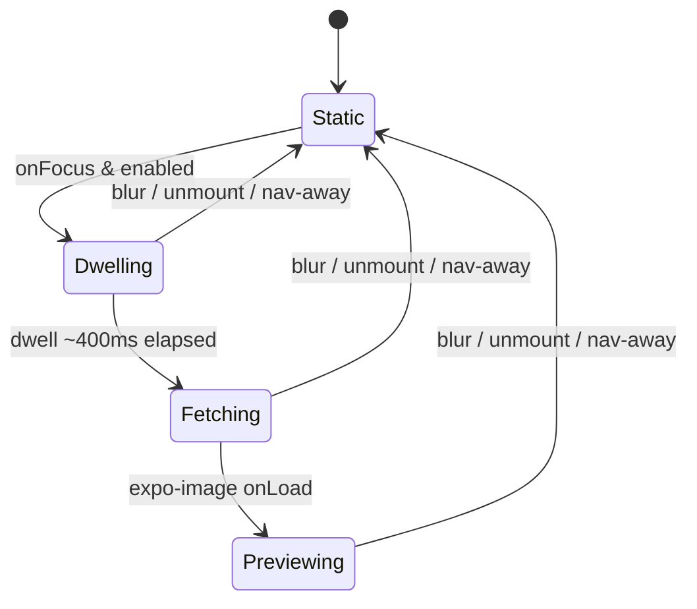
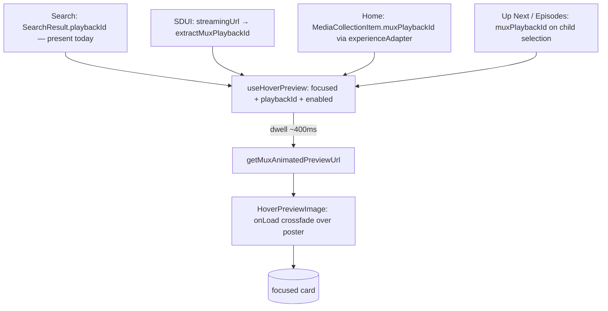

# TV Mux Animated Hover-Previews - Plan

## Goal Capsule

- **Objective:** On the TV app, play a short silent Mux animated preview over a video (not series) thumbnail when its D-pad focus rests, across five card surfaces. Do it as an image swap that consumes no tvOS video decode slot.
- **Authority:** This plan and its origin design doc (`docs/brainstorms/2026-07-13-tv-mux-hover-preview-design.md`). `apps/tv/CLAUDE.md` conventions override on any conflict.
- **Execution profile:** Incremental units on branch `worktree-feat+tv-mux-hover-preview`. The feasibility spike (U1) runs first and gates the rest.
- **Stop conditions:** If U1's fallback ladder exhausts (webp, then gif, then muted `expo-video` all fail on either platform), stop and report a descope decision rather than forcing the feature. Otherwise, run to the Definition of Done.
- **Tail ownership:** The implementer runs the Verification Contract and the on-device sim-verify (U8); both are required before done.

---

## Product Contract

**Product Contract preservation:** carried from the origin design doc unchanged; this plan adds only HOW.

### Summary

When a video thumbnail holds D-pad focus for ~400ms, the card crossfades a looping Mux `animated.webp` over its static poster; on blur the preview tears down and the poster returns instantly. The playback id is already available (or one query field away) on every surface, so no admin change and no per-focus network fetch are needed. An animated image is a texture, not an `AVPlayer`, so the preview never competes for the scarce tvOS decode slots the app already guards.

### Problem Frame

A focused TV thumbnail is static, giving no motion cue about the content. `apps/web` already offers a YouTube-style hover preview; TV has none. The naive port (a muted video per card) collides with the tvOS decode-slot budget the app engineers around (`VideoBackdrop` / KTD4). A Mux animated image sidesteps that budget entirely, which is what makes the feature cheap and safe on TV.

### Requirements

Preview behavior:

- R1. On a video thumbnail, when D-pad focus rests ~400ms, a silent looping animated preview crossfades over the poster.
- R2. On blur, unmount, or navigation away, the preview tears down and the poster shows instantly; at most one preview is mounted at any time.
- R3. Series/collection thumbnails, and cards with no playback id, never preview.
- R4. When the OS reduce-motion setting is on, no preview plays (static poster).

Surfaces and data:

- R5. Previews apply to home rails, the Up Next carousel, series episode cards, search results, and the SDUI Experience video cards.
- R6. The playback id is obtained without a per-focus network fetch — thread the already-available id (Option A). No `apps/admin` changes and no new GraphQL fields.

Platform constraints:

- R7. No new tvOS video decode slot is consumed; the hero `VideoBackdrop` and the fullscreen `VideoPlayer` must not regress.
- R8. The preview-URL builder mirrors web's shape but takes TV-tuned params via an `opts` object, finalized on the spike.
- R9. A gating spike proves `expo-image` animates the asset on tvOS and Android TV and finalizes the params, with a fallback ladder (gif, then muted `expo-video`, then descope).

### Scope Boundaries

- No audio (Mux animated is silent, matching the hover convention).
- No per-card video players (decoder budget).
- No `apps/admin` changes and no new GraphQL fields.
- No previews on series/collection cards, nor on config-fallback home cards that lack a playback id (graceful skip).
- The `/watch` hero keeps its own higher-fidelity muted `VideoBackdrop`; "video details page" is covered by its Up Next rail. The hero is not touched.

**Deferred to Follow-Up Work**

- Mobile parity of the animated-preview helper. `apps/mobile` has no animated helper today; this plan is TV-only. If the builder is later shared, keep the cross-app `SYNC:` comment honest.

---

## Planning Contract

### Key Technical Decisions

- KTD1. Medium is a Mux `animated.webp` rendered by `expo-image`, not a per-card video. Rationale: an image texture uses no decode slot, so it never starves the hero or fullscreen players (R7). Fallback ladder if `expo-image` will not animate it: `animated.gif`, then one mount-gated muted `expo-video`, then descope (R9).
- KTD2. Reuse web's builder shape; TV-tune the params via an `opts` object. Rationale: keeps the two apps legible against each other while letting TV use a larger/smoother asset for a 10-foot card. The header carries a `SYNC:` note recording the deliberate divergence so nobody resyncs it to web's numbers (R8).
- KTD3. TV-native trigger and lifecycle: activate on D-pad `onFocus` after a ~400ms dwell (mirroring `createShowcaseFocusDebouncer`), deactivate on blur/unmount. This inverts web's "latch forever" model. Rationale: D-pad focus sweeps a rail, so an immediate fetch would thrash; teardown-on-blur makes "one preview at a time" true by construction (R1, R2).
- KTD4. Option A data threading: thread the already-available playback id, no per-focus fetch. Rationale: instant previews and bounded Mux request volume; the required admin fields already exist (R6).
- KTD5. Eligibility is layered: each surface passes `enabled = !isSeriesShaped` (the series gate), and `useHoverPreview` composes `active = focused && enabled && !!playbackId && !reduceMotion`. Rationale: enforces video-only, graceful-skip, and reduce-motion structurally (R3, R4), with the null-id and reduce-motion checks living in one place (the hook). Series/COLLECTION parents return a null `muxPlaybackId` from admin anyway, so exclusion is double-safe.
- KTD6. Crossfade is an overlay above a persistent poster, revealed only on the preview's own `onLoad`; the overlay shares the poster's `contentFit`/frame. Rationale: no flash while the asset decodes, and no crop jump between poster and preview (R1).

### High-Level Technical Design

Preview lifecycle (per focused card). Blur cancels from any state, so leaving a card always returns to Static:

Data flow — where each surface's playback id comes from, into the shared hook and overlay:

### Assumptions

- "Proceed" authorizes writing this plan without a further scope-confirmation gate; all scope forks (five surfaces, Option A, TV-tuned params, spike-first) were confirmed in conversation.
- Starting params are `width=640`, `fps=12`, `start=2&end=6`, pending U1 finalization on real hardware.
- `useHoverPreview` lives in `apps/tv/src/components/focus/`; a small `useReduceMotion` helper lives in `apps/tv/src/hooks/`, reusing the `AccessibilityInfo` pattern already in `apps/tv/src/components/VideoPlayer.tsx`.
- `ThumbCard` gains one optional `previewPlaybackId` prop; each parent rail populates it from its existing video/series decision.
- Landing strategy: one feature branch; units are individually landable but expected to land together behind the spike gate. Splitting into stacked PRs is optional and repo conventions win.

### Sequencing

U1 (spike) gates everything. U2 (builder) can start with the starting-default params and adopt U1's finalized values. U3 depends on U2. U4 is presentational and independent. U5 and U6 (data threading) are independent of U2–U4 and of each other. U7 (surface wiring) depends on U2, U3, U4, U5, U6. U8 (on-device) depends on U7.

---

## Implementation Units

### U1. Feasibility spike and param finalization (gating)

- **Goal:** Prove `expo-image` animates a Mux `animated.webp` on a tvOS simulator and an Android TV emulator, and finalize the TV-tuned params. Walk the fallback ladder if it does not animate.
- **Requirements:** R8, R9
- **Dependencies:** none
- **Files:** a throwaway spike surface only (e.g., a temporary route under `apps/tv/app/`), removed before commit. No committed source.
- **Approach:** Mount a single `expo-image` pointed at a known-good playback id's `animated.webp` on a focused card in both simulators; confirm it loops rather than showing a stuck first frame. Sweep `width`/`fps`/clip window up from the starting defaults and pick the largest values that stay smooth on the weaker target (Android TV). If webp will not animate, try `animated.gif`; if that fails, evaluate a single mount-gated muted `expo-video` (reusing `VideoBackdrop`/`videoBackdropGate` discipline); if all fail, record a descope decision.
- **Execution note:** On-device smoke on tvOS sim + Android TV emulator; cold-relaunch before judging (Fast-Refresh can wedge native media). Not unit-tested.
- **Patterns to follow:** `apps/tv/src/components/rails/ThumbCard.tsx` (expo-image usage), `apps/tv/src/components/watch/videoBackdropGate.ts` (mount-gating discipline for the video fallback).
- **Test scenarios:** Test expectation: none — exploratory spike; evidence is a captured looping preview on both platforms plus the recorded final medium and params.
- **Verification:** Recorded final medium and `width`/`fps`/clip values (or a descope decision); a looping preview confirmed on both tvOS and Android TV.

### U2. `getMuxAnimatedPreviewUrl` builder

- **Goal:** A pure builder for the TV-tuned animated-preview URL.
- **Requirements:** R8
- **Dependencies:** U1 (adopts finalized params; may be written first with the starting defaults)
- **Files:** `apps/tv/src/lib/muxUrl.ts`, `apps/tv/src/lib/muxUrl.test.ts`
- **Approach:** Mirror web's `resolveMuxAnimatedPreviewUrl` shape: trim the id, return `null` on empty, else `https://image.mux.com/${encodeURIComponent(id)}/animated.webp?start=…&end=…&width=…&fps=…`. Hold the U1-finalized params as module-level default constants (matching web's single-arg shape); accept an optional `opts` object (`{ width, fps, start, end }`) only as a test/spike seam for sweeping params, so production callers pass just the id. Reuse the existing `MUX_PLAYBACK_ID_RE` charset guard. Add a header `SYNC:` comment naming `apps/web/src/lib/url.ts resolveMuxAnimatedPreviewUrl` and recording the deliberate param divergence.
- **Patterns to follow:** `apps/tv/src/lib/muxUrl.ts` (`muxHlsUrlFromPlaybackId`, `MUX_PLAYBACK_ID_RE`), `apps/tv/src/lib/resolveImageUrl.ts` (`getMuxThumbnailUrl`).
- **Test scenarios:**
  - Happy path: a valid id with default opts returns the exact URL with the finalized params.
  - Opts override: passing `{ width, fps }` changes only those query params.
  - Edge: empty string, whitespace-only, `null`, and `undefined` each return `null`.
  - Edge: an id needing escaping is `encodeURIComponent`-escaped in the path.
  - Edge: an id failing the charset guard returns `null`.
- **Verification:** `apps/tv/src/lib/muxUrl.test.ts` passes; output matches the finalized params.

### U3. `useHoverPreview` dwell/activate/teardown hook

- **Goal:** A focus-dwell gate that returns a preview URL only for an eligible, settled, focused card.
- **Requirements:** R1, R2, R4
- **Dependencies:** U2
- **Files:** `apps/tv/src/components/focus/useHoverPreview.ts`, `apps/tv/src/components/focus/useHoverPreview.test.ts`, `apps/tv/src/hooks/useReduceMotion.ts`, `apps/tv/src/hooks/useReduceMotion.test.ts`
- **Approach:** Input `{ focused, playbackId, enabled }`. Compute `active = focused && enabled && !!playbackId && !reduceMotion`, reading `reduceMotion` from `useReduceMotion`. When `active` turns true, start a trailing ~400ms timer (mirror `createShowcaseFocusDebouncer`); on fire, return `getMuxAnimatedPreviewUrl(playbackId)`. Clear the timer and return `null` whenever `active` turns false or the hook unmounts. `useReduceMotion` wraps `AccessibilityInfo.isReduceMotionEnabled()` plus its change subscription (the pattern already in `VideoPlayer.tsx`).
- **Patterns to follow:** `apps/tv/src/components/home/showcaseState.ts` (`createShowcaseFocusDebouncer`, `SHOWCASE_FOCUS_DEBOUNCE_MS`), `apps/tv/src/components/VideoPlayer.tsx:756-763` (reduce-motion read + subscription).
- **Test scenarios:**
  - Happy path (fake timers): continuous focus for the dwell delay yields the built URL; before the delay it is `null`.
  - Edge: focus then blur inside the dwell window never activates (returns `null` throughout).
  - Edge: `enabled=false`, `playbackId=null`, or reduce-motion on each keep the result `null` regardless of focus.
  - Error/lifecycle: blur after activation returns `null`; unmount clears the pending timer with no post-unmount state update; toggling reduce-motion on during Previewing tears the preview down.
- **Verification:** Both hook test files pass under fake timers.

### U4. `HoverPreviewImage` crossfade overlay

- **Goal:** A presentational overlay that reveals the animated preview over the poster once it loads.
- **Requirements:** R1, R2, R7
- **Dependencies:** none (consumed by U7)
- **Files:** `apps/tv/src/components/watch/HoverPreviewImage.tsx`, `apps/tv/src/components/watch/HoverPreviewImage.test.tsx`
- **Approach:** Render nothing when `previewUrl` is `null`. Otherwise an absolute-fill `expo-image` `<Image source={previewUrl}>` above the poster, opacity animated 0→1 (`Animated`, native driver) only on `onLoad`, using the poster's `contentFit` (`cover`) and frame. Mark it decorative and non-focusable (`pointerEvents="none"`, hidden from accessibility). It is an image, so it holds no decode slot. Stacking (identical on every surface): mount the overlay inside the poster's clip frame, above the poster and the card's focus scrim/play-icon so the preview reads as clean motion, but below the focus ring and any metaLabel chip.
- **Patterns to follow:** `apps/web/src/components/watch/MuxHoverPreview.tsx` (load-gated crossfade idea), `apps/tv/src/components/rails/ThumbCard.tsx` (expo-image poster styling).
- **Test scenarios:**
  - Happy path: with a `previewUrl`, renders one `expo-image` with that source, `cover` contentFit, and a decorative/non-focusable flag.
  - Edge: `previewUrl=null` renders nothing.
  - Behavior: opacity begins at 0 and the `onLoad` handler drives it to 1 (assert the handler wiring / animated target, not pixels).
- **Verification:** `HoverPreviewImage.test.tsx` passes; visual confirmed in U8.

### U5. Thread `muxPlaybackId` onto home cards

- **Goal:** Surface the Experience item's already-fetched playback id on the home card model.
- **Requirements:** R5, R6
- **Dependencies:** none
- **Files:** `apps/tv/src/lib/watchHome/experienceAdapter.ts`, `apps/tv/src/lib/watchHome/model.ts`, `apps/tv/src/lib/watchHome/experienceAdapter.test.ts`
- **Approach:** Extend `ExperienceItem` to include `muxPlaybackId` (already present on the shared `AdminMediaCollection` wire fragment), read it in `itemToCard`, and add `muxPlaybackId?: string | null` to `WatchHomeCard`. Null-safe throughout. The guarded bulk-home fragment is untouched — the id rides the Experience path.
- **Patterns to follow:** `packages/admin-graphql/src/fragments/blocks/media-collection.ts` (the wire field), `docs/solutions/architecture-patterns/tv-home-single-admin-experience-migration-20260712.md`.
- **Test scenarios:**
  - Happy path: an item carrying `muxPlaybackId` produces a card carrying it.
  - Edge: an item without the field → card `muxPlaybackId` is `null`.
  - Edge: a series-shaped item → `null` passthrough.
  - Regression: existing card fields are unchanged.
- **Verification:** `experienceAdapter.test.ts` passes; `pnpm --filter @forge/tv typecheck` clean.

### U6. Thread `muxPlaybackId` onto Up Next + series episodes, and add the `ThumbCard` prop

- **Goal:** Carry the child playback id into the sibling and episode models and give `ThumbCard` a preview input.
- **Requirements:** R5, R6
- **Dependencies:** none
- **Files:** `apps/tv/src/lib/videoQueries.ts`, `apps/tv/src/lib/normalizeVideo.ts`, `apps/tv/src/components/rails/ThumbCard.tsx`, `apps/tv/src/lib/videoQueries.test.ts`, `apps/tv/src/lib/normalizeVideo.test.ts`, `apps/tv/src/components/rails/ThumbCard.test.tsx`
- **Approach:** Add `muxPlaybackId` to the `parents.children` selection (feeds `WatchSibling`) and to the `GET_SERIES_BY_SLUG` children selection (feeds `WatchEpisode`). This uses the purpose-built resolver field — one nullable string per child, not a dubs projection, so no admin change. Add `muxPlaybackId?: string | null` to `WatchSibling` and `WatchEpisode` in `normalizeVideo.ts`. Add an optional `previewPlaybackId?: string | null` prop to `ThumbCard`. This adds the DataLoader-backed `muxPlaybackId` to every child in the `parents.children` chain — a path already flagged for over-fetch (~208 nodes at `videoQueries.ts:128`); it is the cheap best-playable-dub lookup, not a dubs projection, but U8's timing gate must confirm no query-latency regression.
- **Patterns to follow:** existing child selections in `apps/tv/src/lib/videoQueries.ts`, `WatchSibling`/`WatchEpisode` builders in `apps/tv/src/lib/normalizeVideo.ts`.
- **Test scenarios:**
  - Shape: the query documents select `muxPlaybackId` on the sibling and episode child nodes.
  - Happy path: `normalizeVideo` maps `muxPlaybackId` onto `WatchSibling` and `WatchEpisode` when present.
  - Edge: absent/`null` child `muxPlaybackId` maps to `null`.
  - Regression: `ThumbCard` accepts `previewPlaybackId` without altering existing render output.
- **Verification:** query and normalizer tests pass; `typecheck` clean; no `admin-graphql` drift (field already in the committed schema — if the edit is under gql.tada, `pnpm --filter @forge/admin-graphql generate` produces no diff).

### U7. Wire previews into all five surfaces

- **Goal:** Adopt `useHoverPreview` + `HoverPreviewImage` on every video card surface.
- **Requirements:** R1, R2, R3, R5
- **Dependencies:** U2, U3, U4, U5, U6
- **Files:** `apps/tv/src/components/home/HomeCard.tsx`, `apps/tv/src/components/rails/ThumbCard.tsx`, `apps/tv/src/components/search/ResultCard.tsx`, `apps/tv/src/components/sections/VideoCardRenderer.tsx`, `apps/tv/src/components/sections/VideoCarouselRenderer.tsx`, plus colocated tests for the changed cards
- **Approach:** Each surface computes its playback id and `enabled = !isSeriesShaped`, calls `useHoverPreview` with its focused state, and renders `HoverPreviewImage` over the poster. Sources: `HomeCard` → `card.muxPlaybackId` + `isSeriesSearchResult`; `ThumbCard` → `previewPlaybackId` (Up Next and Episodes, populated by their rails from the U6 field); `ResultCard` → `result.playbackId` + `isSeriesSearchResult`; SDUI renderers → `extractMuxPlaybackId(streamingUrl)`. Cards already track focus via `useFocusVisual`/their `Pressable`; pass that focused boolean into the hook. SDUI renderers derive focus from `FocusableCard`'s `onFocus`/`onBlur`. On every surface the overlay stacks per U4 — above the poster and focus scrim/play-icon, below the focus ring and any chip — so the five surfaces layer identically.
- **Patterns to follow:** `apps/tv/src/lib/isSeriesRecord.ts` (`isSeriesLabel`/`isSeriesSearchResult`), `apps/tv/src/components/focus/useFocusVisual.ts` (focused state), `apps/tv/src/components/watch/VideoBackdrop.tsx` (overlay layering over a poster).
- **Test scenarios:**
  - HomeCard: a focused video card dwelled past the delay mounts the overlay; a series-shaped HomeCard never previews. Covers R3.
  - ResultCard: a result with a `playbackId` previews; a series result does not. Covers R3.
  - ThumbCard: with `previewPlaybackId` it previews; without it, it stays static.
  - SDUI: `VideoCardRenderer`/`VideoCarouselRenderer` extract the id from `streamingUrl` and preview.
  - Integration: each surface passes its real focused state through, so blur tears the overlay down (relies on U3 behavior).
- **Verification:** changed-card tests pass; `typecheck`/`lint` clean; visuals confirmed in U8.

### U8. On-device verification, perf/regression, and Android guard

- **Goal:** Prove the feature on both platforms and confirm no player regressions.
- **Requirements:** R1, R2, R7
- **Dependencies:** U7
- **Files:** none (verification); optionally an Android-disable constant if measurement shows jank.
- **Approach:** Run `bash scripts/setup-sim-env.sh tv`, start the `EXPO_TV` Metro on 8082, deep-link `/watch/the-birth-of-jesus`, and rest focus on an Up Next card to confirm the crossfade and loop. Cold-relaunch before judging (avoid the Fast-Refresh zombie-player false signal). Confirm the hero `VideoBackdrop` still plays and the fullscreen `VideoPlayer` is unaffected. Repeat on an Android TV emulator (launched with `-memory 4096`). Capture a GIF and include page-load timing evidence per the frontend page-load-performance rule. If Android shows jank, gate previews off on Android behind a constant.
- **Execution note:** On-device smoke on both platforms; cold-relaunch; capture the GIF and timing evidence.
- **Patterns to follow:** `apps/tv/CLAUDE.md` ("Running on a simulator"), the TV sim-verify memory (Metro 8082 + deep-link), `docs/solutions/conventions/frontend-change-page-load-performance-verification.md`.
- **Test scenarios:** Test expectation: none (on-device verification) — evidence is the captured looping preview on tvOS and Android TV, timing evidence, and a no-regression confirmation of the hero/fullscreen players.
- **Verification:** looping previews confirmed on tvOS and Android TV; hero `VideoBackdrop` and fullscreen `VideoPlayer` unregressed; timing evidence captured.

---

## Verification Contract

| Gate                        | Command                                                                                                  | Applies to             |
| --------------------------- | -------------------------------------------------------------------------------------------------------- | ---------------------- |
| Types                       | `pnpm --filter @forge/tv typecheck`                                                                      | all units              |
| Lint                        | `pnpm --filter @forge/tv lint`                                                                           | all units              |
| Unit tests                  | `pnpm --filter @forge/tv test`                                                                           | U2, U3, U4, U5, U6, U7 |
| GraphQL drift (if gql.tada) | `pnpm --filter @forge/admin-graphql generate` produces no diff                                           | U6                     |
| On-device smoke             | `bash scripts/setup-sim-env.sh tv`, then `EXPO_TV` Metro on 8082 + deep-link `/watch/the-birth-of-jesus` | U1, U8                 |

No `apps/admin` schema change is made, so `admin schema:print` / `admin-schema-drift` are not triggered. The required fields (`Video.muxPlaybackId`, `MediaCollectionItem.muxPlaybackId`, `HybridSearchResult.playbackId`) already exist in the committed schema.

---

## Definition of Done

Global:

- U1 recorded a final medium and params, or a documented descope decision; the throwaway spike surface is removed.
- All units' tests are green; `typecheck` and `lint` are clean.
- On-device previews confirmed on tvOS and Android TV; the hero `VideoBackdrop` and fullscreen `VideoPlayer` did not regress.
- No per-card video player was introduced; series, no-id, and reduce-motion cards never preview.
- Abandoned spike/experimental code is removed from the diff; the scratch `.explainer.html` is deleted before commit.

Per-unit: each unit's Verification is met and its cited requirements are satisfied.

---

## Risks & Dependencies

- `expo-image` may not animate a Mux `animated.webp` on tvOS or Android TV. Mitigation: U1 gates the whole plan and carries the gif → muted-video → descope ladder.
- Poster/preview crop parity: if the overlay's `contentFit`/frame differs from the poster, the crossfade jumps. Mitigation: U4 shares the poster's `cover` fit and frame.
- Android TV focus delivery rides `patches/react-native-tvos@0.81.5-2.patch`; a future RN-tvos bump that regenerates the patch would break the `onFocus` trigger (the same dependency as all existing TV focus visuals).
- Mux bills per animated-image request. Mitigation: the ~400ms dwell gate (U3) means previews load only on settled focus, not for every card the D-pad passes.
