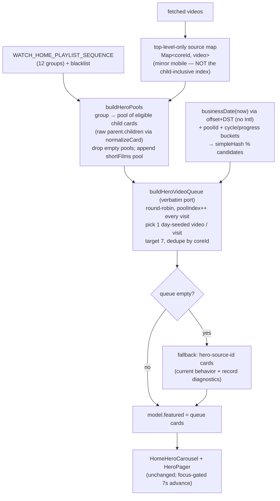

# TV Home Hero Video Parity - Plan

## Goal Capsule

- **Objective:** Make the TV home hero show the same rotating video/series set that web and mobile show, by mirroring their hero playlist config **and composition algorithm** into `apps/tv` and excluding the external web-link slides.
- **Product authority:** Urim (owns TV / mobile / web Experience delivery).
- **Execution profile:** `apps/tv`-only change; pure functions with unit tests plus a Node golden-fixture parity test; device smoke on tvOS + Android TV.
- **Open blockers:** None. feat-160 (move hero curation into the admin Experience) is the eventual successor that retires the config duplication this plan introduces — it does not block this work. Its timeline is unscheduled; see the durability note in Key Decisions.

---

## Product Contract

> **Product Contract preservation note:** Enriched in place from the requirements-only artifact. Scope intent is unchanged — "TV hero shows the same videos as web/mobile, no web-links." Changed by research and document review (see Planning Contract): **R2** rewritten and **AE3** corrected because web/mobile do not render one card per group — they run a deterministic pool round-robin over child episodes; **R8/AE6** added for the empty-queue fallback web already has; **R7/AE5** sharpened to name the daily rotation, now conditioned on admin child-ordering. The parity bar is **algorithmic parity** verified against mobile's golden output, not on-device bit-identity (KTD8). No product scope was widened.

### Summary

Give TV's home hero the same rotating video/series set that web and mobile already show. TV's hero is fed from only 4 hardcoded IDs today; web and mobile compose theirs from a 12-group playlist sequence via a deterministic, day-seeded round-robin that yields ~7 videos. Port that config and algorithm into TV — mirroring mobile's exact data resolution — show only tappable videos and series, and never build the external web-link (Mux insert) slides.

### Problem Frame

The home hero is client-owned config on all three apps, not driven by the admin Experience. The Experience's `WatchHomeHeroBlock` is a slide-less positional placeholder, and the recent U3–U9 work wired only the rails below the hero to the Experience — so a natural assumption that "the hero comes from the Experience" is false everywhere.

Web and mobile build the hero from config pieces that are byte-for-byte identical between them, then compose it identically: one pool per playlist group (a collection expands to its eligible child episodes), a round-robin that picks one day-deterministic video per pool visit up to a 7-video target, and a final step that splices in Mux "insert" slides (two of which link to external web pages). TV carries only the 4-ID `WATCH_HOME_HERO_SOURCE_IDS` — which on web/mobile is merely the _fallback_ used when the pools produce nothing — and has none of the playlist sequence, pool building, or queue algorithm. That is why a viewer sees a different, thinner hero on TV. TV also cannot act on the web-link slides: it has no browser surface, and those slides navigate to external URLs.

### Key Decisions

- **Mirror the config into TV, not a shared package or admin.** A TV-only port delivers parity now with the smallest blast radius, and it is what TV's own config comment already anticipates ("mirror web hero curation here until feat-160 moves it to admin"). A shared client package would touch all three apps for infrastructure feat-160 will later discard; the admin path is feat-160 itself and needs schema/editor work outside this change. **Durability premise:** feat-160 is unscheduled, so this plan explicitly accepts the config+algorithm copy as potentially long-lived, and the three-way drift it implies (TV↔mobile guarded by the golden-fixture test; web guarded only by prose). If that premise is wrong and feat-160 lands soon, the copy is short-lived — either way the decision does not rest on feat-160's timing.
- **Port the composition algorithm, mirroring mobile exactly.** "Same videos as web/mobile" means the same pools plus the same day-seeded selection. TV must replicate mobile's _exact_ data resolution (top-level-only source map, raw child expansion, `coreId`-keyed dedup) rather than reuse TV's Experience-section helpers, which diverge (KTD3/KTD4).
- **Rotate through the full playlist sequence, keep TV's cadence.** The change is the slide set, not the on-screen rotation. TV keeps its focus-gated 7s auto-advance; web/mobile's always-on rotation fights D-pad focus on a 10-foot screen. The hero _set_ rotates once per ET day (as web/mobile do) so the two stay matched.
- **Show only video slides; build no Mux inserts.** The two web-link inserts are what the request excludes, and the branded `welcome-start` promo is also dropped — it is not a catalog video/series, TV has no Mux-playback path for hero cards, and TV already shows that promo's identity as a static rail. TV builds from the pure video queue and never runs the mux-merge step, so the exclusion holds by construction.
- **"Series" needs no new slide type; "experiences" have no referent.** A series is a card with a series-shaped label, which TV already routes to its series screen. No hero slide points to an admin Experience/topic page anywhere today, so the request's "potentially experiences" is a no-op, not dropped scope.
- **Drop un-hydratable IDs silently.** Any sequence ID TV cannot resolve as a top-level record contributes no candidate. TV's hero may therefore be marginally shorter than web/mobile — parity is on the _set and algorithm_, not an exact count guarantee.

### Requirements

**Hero content**

- R1. TV's home hero rotates through the same video/series set web and mobile show, by mirroring their hero playlist config (`WATCH_HOME_PLAYLIST_SEQUENCE`) and composition algorithm into `apps/tv`.
- R2. TV composes the hero by mobile's algorithm: one pool per playlist group (each collection in a group expands to its eligible child videos), plus an appended synthetic `shortFilms` pool last, then a round-robin over the pools that picks one day-deterministic video per pool visit up to a 7-video target, mirroring mobile's initial queue (`startPoolIndex` 0, empty played-state, no stored progress).
- R3. The hero shows only tappable video and series slides — no slide links to an external web page.

**Exclusions honored by construction**

- R4. TV builds the hero from the pure video queue and never runs the Mux-merge step, so no Mux insert slide appears: neither the external web-link slides (`join-us`, `telling-the-story-of-jesus`) nor the branded `welcome-start` promo.

**Navigation and resilience**

- R5. Selecting a hero slide routes via TV's existing `rawLabel`/`childCount` logic — `/watch` for a leaf video (most slides, since pools yield episodes) and `/series` for a collection card that reaches the hero. (Satisfied by unchanged routing; verification-only — see U6 note.)
- R6. Any playlist ID that cannot be hydrated as a top-level record from TV's bulk video fetch is skipped — it contributes no candidate and is never rendered as a broken or empty slide.
- R8. When the pool queue yields zero cards, the hero falls back to the current hero-source-ID featured cards, mirroring web's `sequencedSlides ?? slides` behavior — the hero is never empty when any hero content is fetchable.

**Behavior boundary**

- R7. Hero auto-advance keeps TV's current focus-gated 7s cadence and trigger. The hero _set_ rotates once per ET business date (matching web/mobile) so the two stay in sync; the on-screen carousel's timing and trigger are unchanged. Intra-day stability holds only while admin returns the children relation in a stable order (see R-E). (Satisfied by the ported businessDate rotation plus the untouched carousel; verification-only — see U6 note.)

### Key Flows

- F1. Hero build
  - **Trigger:** TV home screen loads or re-hydrates from its persisted snapshot.
  - **Steps:** resolve pool sources from a top-level-only view of the hydrated videos (mirroring mobile); build one pool per playlist group (collections → raw child cards, blacklist applied, empty pools dropped), then append the `shortFilms` pool; round-robin the pools picking one day-seeded video per visit up to 7, deduping by `coreId`; emit the resulting cards as `model.featured`; fall back to hero-source-ID cards if the queue is empty; feed the existing hero pager and carousel.
  - **Covered by:** R1, R2, R6, R8.
- F2. Hero slide tap
  - **Trigger:** viewer selects the hero "See more" CTA on the focused slide.
  - **Steps:** resolve the slide's route via TV's `rawLabel`/`childCount` routing; push the watch or series screen.
  - **Covered by:** R3, R5.

### Acceptance Examples

- AE1. **Covers R1, R2.** Given a committed golden fixture (a fixed set of input videos and a fixed ET business date), when TV builds the hero, then the ordered list of picked `coreId`s equals the golden list derived from mobile's `buildWatchHomeHeroQueue(...).videos` for the same inputs with `startPoolIndex` 0 and empty played-state.
- AE2. **Covers R3, R4.** Given the Mux inserts config exists on web/mobile, when TV builds the hero, then no Mux/web-link slide appears — TV never runs the mux-merge step.
- AE3. **Covers R5.** Given a hero slide is a leaf video/episode, when the viewer selects it, then TV navigates to the watch screen; given a collection card with children reaches the hero, then TV navigates to the series screen.
- AE4. **Covers R6.** Given a playlist ID absent as a top-level record in the fetched videos, when TV builds pools, then that ID contributes no candidate and the hero still renders the resolvable slides.
- AE5. **Covers R2, R7.** Given two builds on the same ET day with the same inputs (including the same admin child order), then the hero video set and order are identical; given a different ET day, the selection may differ (day-seeded rotation).
- AE6. **Covers R8.** Given all pools are empty, when TV builds the hero, then it renders the hero-source-ID fallback cards rather than an empty hero.

### Scope Boundaries

- The branded "Today's Video Picks" Mux promo slide is out — TV already surfaces that identity as a static rail, and it is not a catalog video/series.
- Web and mobile are untouched — this is a TV-only change.
- The admin Experience / feat-160 is out — moving hero curation into admin so all clients share one source is the eventual successor to this interim mirror, not part of it.
- No shared client config package — the mirror is deliberately a copy, to be retired by feat-160.
- The on-screen rotation cadence, trigger, and focus behavior are unchanged (R7).
- On-device bit-identity with a running mobile app is explicitly NOT a goal (KTD8).

#### Deferred to Follow-Up Work

- Mobile's played-ID / resume-point persistence (`playedIds`, `startPoolIndex`, session memory) is **not** ported — TV builds from the fresh initial-queue state (`startPoolIndex` 0, empty played-set), which is exactly what web renders and what mobile renders on a cold session. Cross-session "don't repeat what you saw" memory is a later enhancement, not parity.

---

## Planning Contract

### Key Technical Decisions

- KTD1. **Faithful algorithmic port, mirroring mobile — not a simplified per-group pick.** Genuine parity requires TV to reproduce the same pools and the same day-seeded selection. Mirror **mobile** (`apps/mobile/src/lib/watchHome/carouselSequence.ts` + `model.ts`), not web: web's candidate eligibility gates on build-time `Boolean(video.src)`, but TV — like mobile — has no `src`/`playbackId` at bulk-fetch time (lean posture), so it gates on `imageUrl && slug` (the TV card's field; mobile's `posterUrl` maps from the same source).
- KTD2. **Reuse `WatchHomeCard` + `normalizeCard`; introduce no parallel slide type.** Pool candidates are `WatchHomeCard`s filtered by `imageUrl && slug`; the queue emits `WatchHomeCard[]` straight into `model.featured`. Routing, the hero pager, and the carousel stay unchanged. **The queue's `seen`/dedup set keys on `coreId`, not the card's `id` (`documentId`)** — mobile's slide `id` is `coreId`, so a `documentId`-keyed dedup would let TV emit a video mobile drops when the same `coreId` appears as both a top-level card and another pool's child.
- KTD3. **Exclude Mux by construction.** Do not port `mergeWatchHomeMuxInserts`, `WATCH_HOME_MUX_INSERTS`, or the `action.url` machinery. Build from the pure video queue only. This is how R3/R4 hold structurally rather than by a filter that could regress.
- KTD4. **Mirror mobile's exact candidate derivation — do NOT reuse TV's Experience-section helpers.** TV's section path uses the child-inclusive `buildVideoByCoreIdIndex` and `resolvedChildren` (which self-filters `child===parent` and dedupes by `documentId`); both diverge from mobile's carousel and would change `candidates.length`, hence the `% candidates.length` pick. The hero path must instead (a) resolve pool sources from a **top-level-only** map (`videos.filter(hasCoreId)` → `Map<coreId, video>`, like mobile's `model.ts:551-553`), and (b) expand each source's children from **raw `parent.children`** (like mobile's `eligibleSlidesForSource`), not `resolvedChildren`. Consequently a sequence ID present only as another record's child is dropped (mirrors mobile), and R-B/R-E cover candidate _cardinality_ and _order_, not just order.
- KTD5. **Keep the hero-source-ID path as the fallback (R8).** `WATCH_HOME_HERO_SOURCE_IDS` stays in config and in `getWatchHomeCoreIds()` (so those collections are still fetched), but `buildFeatured` uses it only when the pool queue is empty — mirroring web's `sequencedSlides ?? slides`. The fallback path retains the current hero-source `record` missing-data diagnostics; the primary path records pool-level misses instead.
- KTD6. **Compute `businessDate` without Hermes ICU timezone data.** TV deliberately avoids Hermes `Intl` timezone support (`apps/tv/src/components/home/clockFormat.ts` states it uses manual formatting "so Hermes' Intl coverage is never a factor"). Mobile's `toLocaleDateString("en-CA", { timeZone: "America/New_York" })` cannot be assumed to work on the react-native-tvos Hermes build — a silently-ignored `timeZone` returns the device-local date and desyncs the rotation. TV computes the ET calendar date via a fixed-offset + US-DST-rule calculation and formats it `YYYY-MM-DD`, and a test pins known instants (including DST-boundary and near-midnight cases) to prove the string equals mobile's output for the same instant.
- KTD7. **Port `buildWatchHomeVideoQueue` verbatim.** Reproduce the `while` + `pools[poolIndex % pools.length]` loop, incrementing `poolIndex` on **every** visit including skips, so the `poolIndex/15` cycle bucket and `totalVideosLoaded/10` progress bucket in the seed match mobile. A for-loop or a pre-skip of empty pools would change `poolIndex` and silently diverge on wrap.
- KTD8. **Parity bar is algorithmic, verified in Node against a committed golden fixture — not on-device bit-identity.** The parity test compares TV's ordered `coreId` list to a golden list committed from mobile's `buildWatchHomeHeroQueue` output for the same fixture (no live cross-package import from `apps/tv` into `apps/mobile`). On real devices, exact per-episode identity with a running mobile app is neither guaranteed nor required: it depends on Hermes Intl (KTD6), admin child ordering (R-E), and the currently-inverted admin parent/child relation — factors that affect web/mobile equally. All three apps run the same algorithm against the same admin data, which is what "same videos" means.

### High-Level Technical Design

The hero pipeline TV must reproduce (mux-merge deliberately absent), mirroring mobile's data resolution:

Prose remains authoritative where it and the diagram differ.

### Assumptions

- Admin `watchHomeVideos` returns `children` (with `coreId`) for collections in TV's bulk fetch — TV's Experience-section hydration already relies on this, so the same data feeds pool building.
- Admin returns a **top-level record** for each playlist-sequence source that should form a pool; a source returned only as another record's child forms no pool on TV (mirrors mobile — KTD4).
- The golden-fixture parity test runs in Node under jest-expo, where full ICU is present; it proves _algorithm_ parity, not device-Hermes date formatting (KTD6/KTD8 cover the device side via smoke).

---

## Implementation Units

### U1. Mirror the playlist sequence into TV config and fetch its IDs

- **Goal:** Add the 12-group playlist sequence to TV config and ensure its IDs are bulk-fetched.
- **Requirements:** R1, R6.
- **Dependencies:** none.
- **Files:**
  - `apps/tv/src/lib/watchHome/config.ts` (add `WatchHomePlaylistGroup` type + `WATCH_HOME_PLAYLIST_SEQUENCE`; extend `getWatchHomeCoreIds()`; update the file-level sync doc that currently says TV "cuts the playlist-sequence")
  - `apps/tv/src/lib/watchHome/config.test.ts` (new — TV has no config test today)
- **Approach:** Copy `WATCH_HOME_PLAYLIST_SEQUENCE` and its `WatchHomePlaylistGroup` type verbatim from `apps/mobile/src/lib/watchHome/heroConfig.ts` (12 groups). Do **not** copy `WATCH_HOME_MUX_INSERTS`. In `getWatchHomeCoreIds()`, union the flattened sequence IDs into the existing hero + section union, keep the `Set` dedupe. Note: the `WATCH_HOME_COLLECTION_BLACKLIST` entry (`7_Origins4Connect`) is a _child_ filtered during pool expansion (U3), not a group-level ID, so it never appears in `getWatchHomeCoreIds()` — do not assert its exclusion here. Update the LIVE/FROZEN sync comment to say the sequence is now mirrored (mux inserts still cut).
- **Patterns to follow:** mobile `heroConfig.ts` sequence literal; the existing union/dedupe shape in `getWatchHomeCoreIds()`.
- **Test scenarios:**
  - `getWatchHomeCoreIds()` includes every playlist-sequence group ID.
  - Result is deduped (a sequence ID also present in a section appears once).
  - `WATCH_HOME_PLAYLIST_SEQUENCE` deep-equals mobile's 12-group literal (drift guard — inline the expected shape).
- **Verification:** `getWatchHomeCoreIds()` returns the expanded id set; typecheck clean.

### U2. Port the deterministic hero-selection helpers

- **Goal:** Provide the pure day-seeded offset primitives the queue needs, with a Hermes-Intl-free `businessDate`.
- **Requirements:** R2, R7.
- **Dependencies:** none.
- **Files:**
  - `apps/tv/src/lib/watchHome/heroQueue.ts` (new — mirrors mobile `carouselSequence.ts` helpers)
  - `apps/tv/src/lib/watchHome/heroQueue.test.ts` (new)
- **Approach:** Port `simpleHash` and `getWatchHomeDeterministicOffset` verbatim from mobile (`simpleHash(businessDate + poolId + cycle-bucket + progress-bucket) % videoCount`). Implement `businessDate(now)` **without** `Intl`/`toLocaleDateString` timezone conversion (KTD6): derive the ET wall-clock date by applying the US Eastern offset with the standard US DST rule (2nd-Sunday-March 02:00 → 1st-Sunday-November 02:00) and format `YYYY-MM-DD` to match mobile's `en-CA` output. Follow `apps/tv/src/components/home/clockFormat.ts` for the Intl-avoidance precedent.
- **Patterns to follow:** `apps/mobile/src/lib/watchHome/carouselSequence.ts` (`simpleHash`, `getWatchHomeDeterministicOffset`); `apps/tv/src/components/home/clockFormat.ts` (manual date/time formatting).
- **Execution note:** Implement test-first against fixed `now` values and known hashes; helpers take an injectable `now` (no fake timers).
- **Test scenarios:**
  - `simpleHash` is stable/deterministic for a given string.
  - `businessDate` returns the ET calendar date for a given UTC instant, including: a UTC time that is a different ET calendar day, an instant inside EDT and one inside EST, and an instant within an hour of ET midnight — each asserted to equal the string mobile's `toLocaleDateString("en-CA", { timeZone: "America/New_York" })` produces for that instant.
  - `getWatchHomeDeterministicOffset` returns a stable index in `[0, videoCount)` for fixed inputs and changes across `businessDate` / cycle / progress thresholds.
- **Verification:** helper unit tests green.

### U3. Build hero pools from the sequence, mirroring mobile

- **Goal:** Turn the playlist sequence + top-level source map into pools of eligible cards, identical to mobile's derivation.
- **Requirements:** R2, R6.
- **Dependencies:** U1, U2.
- **Files:**
  - `apps/tv/src/lib/watchHome/heroQueue.ts`
  - `apps/tv/src/lib/watchHome/heroQueue.test.ts`
- **Approach:** Port `buildCarouselPools` + `eligibleSlidesForSource` from mobile, adapted to TV's `normalizeCard`/`WatchHomeCard`. Resolve pool sources from a **top-level-only** `Map<coreId, video>` built from the fetched videos (KTD4) — NOT `buildVideoByCoreIdIndex`. For each group: filter the `WATCH_HOME_COLLECTION_BLACKLIST`, then `flatMap` each collection ID through a per-source expander that prefers eligible child cards produced by `normalizeCard` over **raw `parent.children`** (passing the parent), falling back to the parent card when there are no eligible children; a card is eligible when `imageUrl && slug`. Pool shape `{ id: \`playlist-${index}-${collectionIds.join("|")}\`, collectionIds, cards }`; drop empty pools. Append the synthetic `shortFilms`pool last, iterating the same top-level source map's values (matching mobile's iteration order) for`SHORT_FILM`-labeled parents/children, deduped by `coreId`.
- **Patterns to follow:** mobile `buildCarouselPools` / `eligibleSlidesForSource` / the appended `shortFilms` pool; TV `normalizeCard` in `apps/tv/src/lib/watchHome/model.ts`. Do NOT use `resolvedChildren` here.
- **Test scenarios:**
  - Each group maps to one pool; a multi-collection group's pool contains eligible cards from every collection in the group.
  - A collection with eligible children yields its child cards (episodes), not the collection card; a source with no eligible children falls back to the parent card.
  - Blacklisted child IDs are dropped during expansion; empty pools are dropped.
  - Pool ID matches the `playlist-${index}-${collectionIds}` format exactly.
  - A source present only as another record's child forms no pool (mirrors mobile's top-level-only map).
  - Raw `parent.children` is used: a self-referencing child and a duplicate child both remain in the candidate list (not filtered/deduped as `resolvedChildren` would).
  - `shortFilms` pool collects `SHORT_FILM` cards deduped by `coreId`, sits last, in the top-level-map iteration order.
  - Covers AE4. An unresolved sequence ID contributes no candidate; the pool still forms from the resolvable IDs.
- **Verification:** pool-building tests green.

### U4. Build the day-seeded round-robin video queue + golden-fixture parity

- **Goal:** Reduce pools to an ordered ≤7 card set matching mobile, proven by a committed golden fixture.
- **Requirements:** R2.
- **Dependencies:** U2, U3.
- **Files:**
  - `apps/tv/src/lib/watchHome/heroQueue.ts`
  - `apps/tv/src/lib/watchHome/heroQueue.test.ts`
  - `apps/tv/src/lib/watchHome/__fixtures__/heroQueueParity.golden.json` (new — committed golden output derived from mobile)
- **Approach:** Port `buildWatchHomeVideoQueue` **verbatim** (KTD7): round-robin `pools[poolIndex % pools.length]` from `startPoolIndex` 0, `poolIndex++` on every visit incl. skips, per visit filter candidates (eligible, not already `seen`), pick one via `getWatchHomeDeterministicOffset(pool.id, candidates.length, { now, poolIndex, totalVideosLoaded })`, push + mark `seen` **by `coreId`**, stop at target 7, wrap to a second pass if under-filled. Accept an injectable `now`. Return `WatchHomeCard[]`. Do NOT port `mergeWatchHomeMuxInserts` (KTD3). For the parity test, commit a golden fixture: a small set of input videos + a fixed `now`, plus the expected ordered `coreId` list produced by mobile's `buildWatchHomeHeroQueue(...).videos` for the same inputs (generate once via a mobile-side script/test and commit the JSON; do not import `apps/mobile` from `apps/tv`).
- **Patterns to follow:** mobile `buildWatchHomeVideoQueue`.
- **Execution note:** Test-first with a fixed `now` and small fixture pools so picked indices are predictable.
- **Test scenarios:**
  - Round-robin visits pools in sequence order; each of the first non-empty pools contributes one card until the 7 target.
  - Covers AE5. Same `now` + inputs → identical ordered set; a different `businessDate` can change the selection.
  - Dedup by `coreId`: a card whose `coreId` is eligible in two pools (or appears as both a top-level card and a child) is emitted once, matching mobile's `seen`-on-`coreId`.
  - Fewer than 7 pools with candidates → wrap picks additional distinct cards; a fixture with fewer than 7 non-empty sequence pools exercises the appended `shortFilms` pool contributing at least one pick.
  - All pools empty → returns an empty array (the fallback is U5's job).
  - Covers AE1. Given the committed golden fixture (including a self-ref child, a duplicate child, and a child-only source), TV's queue projected to ordered `coreId`s equals the golden list.
- **Verification:** queue tests + the golden-fixture parity test green.

### U5. Rewire `buildFeatured` onto the queue with hero-source-ID fallback

- **Goal:** Make `model.featured` come from the pool queue, falling back to the current hero-source-ID cards.
- **Requirements:** R1, R2, R3, R4, R5, R6, R7, R8.
- **Dependencies:** U3, U4.
- **Files:**
  - `apps/tv/src/lib/watchHome/model.ts` (rewrite `buildFeatured`; build the top-level-only source map from the same `videos` it receives)
  - `apps/tv/src/lib/watchHome/model.test.ts` (rewrite featured + metaLabel blocks — both are coupled to the 4-ID list and current indices)
- **Approach:** In `buildFeatured`, build the top-level-only source map, build pools (U3), run the queue (U4), and return its cards; if the queue is empty, fall back to the current per-hero-source-ID card loop (existing drop-and-record-null behavior, `field: "record"`). Keep `normalizeCard`'s `null` gate as the card-level un-hydratable drop (R6). No Mux/web-link cards are ever produced. `buildWatchHomeModelFromVideos` needs no structural change; the snapshot cold-launch path rebuilds `featured` through this same function, so daily rotation and the expanded set flow through automatically. R5 (routing) and R7 (cadence) are delivered by existing behavior + U2's businessDate and require no code here — they are verification-only (device smoke).
- **Patterns to follow:** web `displaySlides = sequencedSlides ?? slides` fallback; the existing `buildFeatured` missing-data recording.
- **Test scenarios:**
  - `model.featured` is drawn from the playlist sequence (not the 4 hero IDs) given a hydrated fixture, and matches the U4 queue for a fixed date.
  - Covers AE6. With no hydrated pool cards, `featured` falls back to the resolvable hero-source-ID cards and still records `field: "record"` diagnostics.
  - Covers AE2. No featured card carries a Mux/web-link shape (cards remain `WatchHomeCard`, no `action`/external URL).
  - Featured cards never carry a stream field (`not.toHaveProperty("playbackId"/"hls")`) — preserve the current assertion.
  - Rewrite the metaLabel block to assert on cards addressed by ID/shape rather than fixed indices.
- **Verification:** model tests green; typecheck clean.

### U6. Docs

- **Goal:** Keep the TV docs truthful about the hero source.
- **Requirements:** R1.
- **Dependencies:** U5.
- **Files:**
  - `apps/tv/src/lib/watchHome/config.ts` (sync doc — folded from U1)
  - `apps/tv/CLAUDE.md` (hero note: the hero is a config-mirrored deterministic pool queue mirroring mobile's exact derivation, not the admin Experience; mux inserts excluded; businessDate is Intl-free; feat-160 successor)
- **Approach:** One or two tight lines; no new patterns.
- **Test scenarios:** Test expectation: none — docs only.
- **Verification:** wording accurate; no code impact.

---

## Verification Contract

| Gate                       | Command / method                                                                                                                                                                                                                                                                                          | Applies to |
| -------------------------- | --------------------------------------------------------------------------------------------------------------------------------------------------------------------------------------------------------------------------------------------------------------------------------------------------------- | ---------- |
| TypeScript clean           | `pnpm --filter @forge/tv typecheck` (or the repo's tv typecheck script)                                                                                                                                                                                                                                   | all units  |
| Unit tests green           | `pnpm --filter @forge/tv test` (**jest / jest-expo**, not vitest) over the touched `*.test.ts`                                                                                                                                                                                                            | U1–U5      |
| Golden-fixture parity      | the jest parity test builds TV's queue from the committed fixture + fixed date and asserts the ordered `coreId` list equals the golden list derived from mobile's `buildWatchHomeHeroQueue`                                                                                                               | U4         |
| Bulk payload + load timing | measure `getWatchHomeCoreIds()` count and `GET_WATCH_HOME_VIDEOS` payload size before/after, and home first-paint timing, per `docs/solutions/conventions/frontend-change-page-load-performance-verification.md` (cards are lean — no dubs/variants — so growth should be bounded; confirm, don't assume) | U1         |
| `businessDate` on device   | run tvOS + Android TV smoke with the device/emulator clock set to a **non-ET** timezone near a date boundary; confirm `businessDate` yields the correct ET date (a silently-ignored timezone would show the device-local date)                                                                            | U2         |
| tvOS + Android TV smoke    | EXPO_TV Metro on 8082; deep-link the home route; confirm the hero rotates through the same day's episodes web/mobile show, no web-link/promo slide appears, an episode slide → `/watch`, a series card → `/series`                                                                                        | U5         |

---

## Definition of Done

- All units' unit tests and the golden-fixture parity test pass under jest; `apps/tv` typecheck is clean.
- TV's hero video set matches mobile's algorithm for the golden fixture (ordered `coreId` equality), and rotates day-to-day.
- No Mux/web-link slide ever appears in the TV hero.
- The empty-queue fallback renders hero-source-ID cards rather than an empty hero.
- Episode slides route to `/watch` and any series card routes to `/series` on device.
- `businessDate` resolves to the correct ET date on tvOS and Android TV with a non-ET device clock.
- Home bulk-fetch payload growth and first-paint timing are within budget (no regression per the perf convention).
- Config sync comment and `apps/tv/CLAUDE.md` reflect the new hero source.

---

## Risks & Dependencies

- **R-A. `businessDate` timezone on tvOS/Android TV Hermes.** `toLocaleDateString` with a `timeZone` option can be _silently ignored_ on Hermes builds lacking ICU tz data — returning the device-local date, not an error — which desyncs the daily rotation from web/mobile. _Mitigation:_ KTD6 removes the Intl dependency (offset+DST math), and the device smoke runs on a non-ET clock so a silent fallback is detectable. This is now a U2 decision, not a deferred smoke.
- **R-B. Candidate cardinality/order parity.** Exact per-episode identity with mobile depends on identical candidate arrays. KTD4 (raw children + top-level-only map + `coreId` dedup) makes TV's arrays match mobile's for the same admin data; remaining divergence comes from admin child ordering (R-E). Algorithmic parity (same pools/algorithm) holds regardless.
- **R-C. Snapshot rotation across midnight.** Cold-launch rebuilds `featured`, so a snapshot persisted before ET midnight repaints with the next day's selection after. This matches the intended daily rotation; called out so it isn't mistaken for a bug.
- **R-D. Test coupling.** `model.test.ts` featured + metaLabel assertions are index-coupled to the 4-ID list and must be rewritten (U5), not merely extended.
- **R-E. Admin child-relation ordering.** The pick is `candidates[offset]`, an index into admin's returned child order; TV's and mobile's fragments select `children` with no `orderBy`. If admin's relation lacks a deterministic order, a same-day re-fetch can reorder children and change the picked episode, so intra-day stability (R7/AE5) is conditioned on admin ordering being stable — a caveat shared by web/mobile, not introduced here. _Mitigation:_ record a verification that admin returns children deterministically; do not client-sort unilaterally (it would diverge from mobile).
- **R-F. Bulk payload growth.** U1 adds ~12 net-new collections-with-children to the load-bearing home fetch. The cards are lean (no dubs/variants — the 9.5MB dub payload incident does not apply), but the payload/timing gate confirms rather than assumes.

---

## Sources & Research

- TV change surface: `apps/tv/src/lib/watchHome/config.ts` (`getWatchHomeCoreIds`, `WATCH_HOME_HERO_SOURCE_IDS`, blacklist), `apps/tv/src/lib/watchHome/model.ts` (`buildFeatured`, `buildWatchHomeModelFromVideos`, `buildVideoByCoreIdIndex`, `resolvedChildren`, `normalizeCard`, `WatchHomeCard`), `apps/tv/src/hooks/useWatchHome.ts` (bulk fetch, index, snapshot save/restore + featured rebuild), `apps/tv/src/lib/watchHome/homeQueries.ts` (payload-size warning; children selection), `apps/tv/src/components/home/homeCardRouting.ts` + `apps/tv/src/lib/isSeriesRecord.ts` (routing), `apps/tv/src/components/home/HomeHeroCarousel.tsx` (focus-gated auto-advance), `apps/tv/src/components/home/clockFormat.ts` (Hermes-Intl-avoidance precedent).
- Reference algorithm to mirror: `apps/mobile/src/lib/watchHome/carouselSequence.ts` (`buildWatchHomeHeroQueue`, `buildWatchHomeVideoQueue`, `getWatchHomeDeterministicOffset`, `simpleHash`, `businessDate`, `mergeWatchHomeMuxInserts` — the last deliberately NOT ported), `apps/mobile/src/lib/watchHome/model.ts` (`buildCarouselPools`, `eligibleSlidesForSource`, `cardToCarouselSlide`, top-level-only `videoByCoreId`, `model.carousel`), `apps/mobile/src/lib/watchHome/heroConfig.ts` (`WATCH_HOME_PLAYLIST_SEQUENCE`, `WATCH_HOME_MUX_INSERTS`), `apps/mobile/src/components/home/HomeScreen.tsx` (hero queue wiring).
- Web cross-check: `apps/web/src/lib/watch-home.ts` (`heroSlides` fallback vs `carousel` pools), `apps/web/src/lib/watch-home-carousel-sequence.ts`, `apps/web/src/components/home/WatchHomeTvCarousel.tsx` + `apps/web/src/components/home/useWatchHomeTvCarousel.ts` (`sequencedSlides ?? slides` fallback).
- Convention: `docs/solutions/conventions/frontend-change-page-load-performance-verification.md`.
- Experience fragment (hero block is a slide-less placeholder): `packages/admin-graphql/src/fragments/blocks/watch-home-hero.ts`.
- Successor ticket: feat-160 (move hero curation into the admin Experience).
