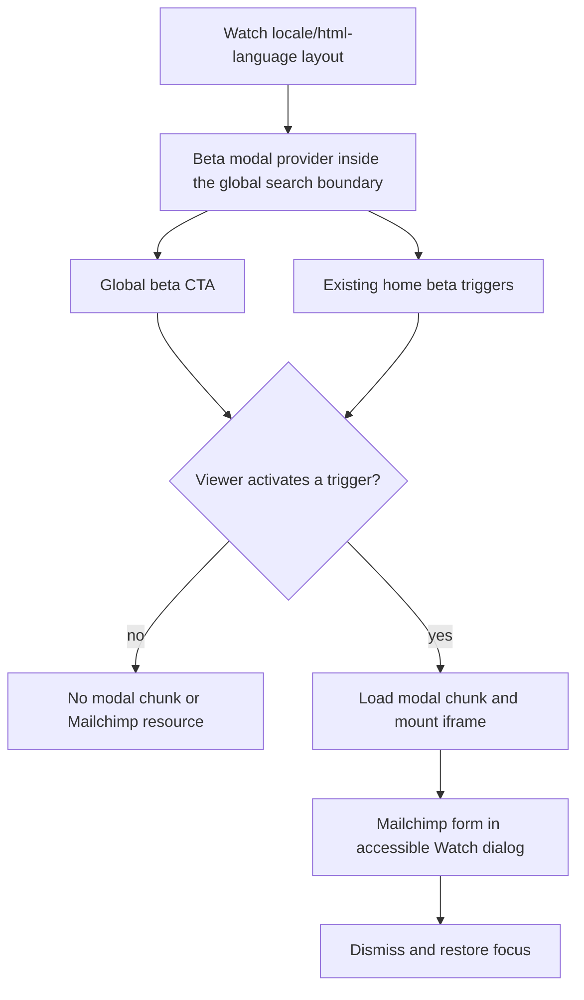

# feat: Add a global Watch beta tester modal

## Summary

Add a compact beta-tester CTA to every Watch route and open the supplied
Mailchimp signup page inside a responsive Watch modal. Existing home beta links
will reuse the same modal, while the third-party iframe and modal chunk remain
absent until the viewer activates a trigger.

---

## Problem Frame

The exact beta invitation already exists in legacy and builder-authored home
content, but it either is absent from the active home composition or navigates
away in a new tab. Routes such as video, series, language inventory, and history
do not expose it at all. The shared locale/html-language layout is the one
stable boundary covering the full public Watch surface.

The supplied Mailchimp page currently returns successfully without
`X-Frame-Options` or a restrictive `frame-ancestors` policy. It loads its form
dynamically from Mailchimp infrastructure, so Forge must treat it as a
cross-origin, independently changing integration and avoid loading it before
user intent.

---

## Requirements

### Global reach and consistency

- R1. Every route rendered under the Watch locale/html-language layout exposes
  a visible CTA labeled `Become a beta tester`.
- R2. Activating the global CTA opens a modal in the current Watch page rather
  than navigating away.
- R3. Existing beta CTAs whose destination is
  `https://mailchi.mp/jesusfilm/beta` open the same shared modal action.

### Modal contract

- R4. The modal embeds the exact supplied Mailchimp URL in a responsive,
  scrollable iframe titled `Jesus Film Beta Testing Group`.
- R5. The modal has a `DialogTitle`, places initial focus on an in-dialog
  control, supports keyboard focus containment, Escape/backdrop/close
  dismissal, focus restoration, mobile safe areas, and an external-link
  fallback if framing stops working.
- R6. The iframe uses the repository's existing cross-origin form sandbox and
  referrer policy; Forge does not inspect, mirror, or proxy Mailchimp fields.

### Loading and coexistence

- R7. No Mailchimp iframe, request, script, cookie, preconnect, or modal chunk
  loads before a viewer activates a beta trigger.
- R8. The global CTA follows Watch player-chrome visibility, does not overlap
  the optional mobile question-panel rail, and is non-interactive while global
  search or the question-panel modal owns the page.
- R9. Opening the beta modal pauses active episode, series-trailer, or home
  carousel playback and an ordinary same-route dismissal restores only media
  that was running before the modal opened.
- R10. Route changes close the modal and remove the iframe so an open form does
  not persist across Watch navigation, restore focus to an unmounted trigger,
  or resume media owned by the route being left.

---

## Key Technical Decisions

- KTD1. **Own the interaction once at the shared Watch layout.** A client
  provider beneath `FloatingSearchProvider` will own modal state and the global
  trigger. This covers every rewritten Watch route and lets search's existing
  inert/blur wrapper suppress the CTA. A shared interaction context reports the
  beta modal, question-panel modal, and route-change close reason so competing
  global surfaces cannot remain actionable at the same time.
- KTD2. **Split trigger shell from modal implementation.** The lightweight CTA
  renders globally, while `next/dynamic` loads the dialog/iframe component only
  after a sticky first-activation gate. The provider must not runtime-import
  dialog, loader, close-button, or iframe code and must not warm the chunk on
  idle, hover, or focus. After first activation the modal chunk may remain
  cached, while the iframe itself unmounts on every close.
- KTD3. **Reuse the shared modal action for matching home links.** A reusable
  client trigger will replace the exact beta URL in `WatchHomePromo` and
  `CTASection`; outside the provider it retains an external-link fallback so
  generic section rendering remains safe.
- KTD4. **Frame the authoritative Mailchimp page.** Reuse the existing iframe
  sandbox (`allow-forms allow-scripts allow-same-origin`) and strict referrer
  policy, provide a bounded full-viewport mobile surface with a desktop cap,
  and include an explicit new-tab fallback because Mailchimp can change its
  framing policy independently.
- KTD5. **Treat one modal as the interaction owner.** Search already makes the
  provider subtree inert. The question panel reports its custom modal state to
  the shared interaction context, and the beta trigger becomes inert while
  either it or search is open. When beta opens, the question panel is suppressed
  and Base UI makes the rest of the page inert. Browser and component proof must
  cover both activation directions rather than relying on incidental z-index.
- KTD6. **Coordinate every autoplay owner explicitly.** Episode
  `WatchPageClient`, series-trailer `HeroPlayer`, and the home TV carousel consume
  the shared beta-open signal. Each records whether its own media was playing,
  pauses once on open, and resumes only after an ordinary same-route dismissal;
  navigation closure clears the resume intent.

---

## Assumptions

_This plan was authored without synchronous user confirmation. The items below
are unvalidated implementation bets carried into review._

- The requested CTA will be persistently visible as a compact floating pill,
  not only appended at the end of each page. This is the headless-pipeline
  decision for making the action genuinely available on every route; it follows
  player-chrome visibility so it does not sit over distraction-free playback.
- On mobile, the pill should sit above the bottom safe area and question-panel
  rail; on larger screens it can sit near the lower-right edge.
- The existing English label and English Mailchimp form are intentional for
  this slice; adding keys to all Watch message catalogs is out of scope.
- No new analytics event is required beyond Mailchimp's own form behavior.

---

## High-Level Technical Design

---

## System-Wide Impact

- **Global route shell:** `apps/web/src/app/[locale]/[htmlLang]/layout.tsx`
  gains an always-present client shell, so its import graph is part of every
  Watch route. Only trigger, context, and state code belongs on that initial
  path.
- **Playback lifecycle:** Episode, series-trailer, and home-carousel media owners
  include beta-open state in their pause/resume edge detector. A playing surface
  pauses once; a previously paused surface remains paused; route-change close
  invalidates resume intent before the old route unmounts.
- **Modal coexistence:** Search owns the provider subtree while open.
  The custom question-panel overlay registers with the shared interaction
  context and suppresses the beta trigger; beta suppresses the question panel
  and prevents access to header and page controls. There is never more than one
  actionable modal surface.
- **Third-party lifecycle:** Mailchimp navigation begins only after explicit
  activation, ends when the iframe unmounts, and cannot be inspected for form
  success or framing failure from the parent. The external fallback therefore
  remains permanently visible and independently usable.
- **Server/client boundaries:** `WatchHomePromo` and `CTASection` remain Server
  Components. Only the exact beta action becomes a small client trigger island,
  avoiding hydration of the surrounding content sections.

---

## Implementation Units

### U1. Add the shared lazy modal owner and global trigger

- **Goal:** Provide one state owner, one global CTA, and one lazy Mailchimp
  modal across every Watch route.
- **Requirements:** R1, R2, R4, R5, R6, R7, R8, R9, R10.
- **Dependencies:** none.
- **Files:**
  - `apps/web/src/app/[locale]/[htmlLang]/layout.tsx`
  - `apps/web/src/components/watch/BetaTesterModalProvider.tsx` (new)
  - `apps/web/src/components/watch/BetaTesterModal.tsx` (new)
  - `apps/web/src/components/watch/__tests__/BetaTesterModalProvider.test.tsx`
    (new)
  - `apps/web/src/components/watch/WatchPageClient.tsx`
  - `apps/web/src/components/watch/__tests__/WatchPageClient.navigation.test.tsx`
  - `apps/web/src/components/watch/WatchQuestionPanel.tsx`
  - `apps/web/src/components/watch/SeriesHero.tsx`
  - `apps/web/src/components/watch/__tests__/SeriesHero.test.tsx`
  - `apps/web/src/components/home/WatchHomeTvCarousel.tsx`
  - `apps/web/src/components/home/__tests__/WatchHomePage.test.tsx`
- **Approach:** Place the provider inside `FloatingSearchProvider` so the
  existing search-open wrapper controls background interaction. Render the
  lightweight pill from the provider, enable the dynamic modal boundary on
  first activation, and mount the iframe only while open. Reuse Base UI Dialog
  and `WatchModalViewportCloseButton`; use a full-height mobile surface, a
  bounded desktop viewport, explicit iframe scrolling, a loading state, and an
  always-visible external-link fallback with `target="_blank"` and
  `rel="noopener noreferrer nofollow"`. Give the dialog an accessible title and
  explicit initial focus inside its focus scope. Expose open state plus a close
  reason/route generation to all three playback owners; close on pathname
  change without resuming route-owned media. Register the custom question-panel
  modal with the shared owner so it and beta are mutually suppressing. Render
  immediate lightweight activation feedback while the dynamic chunk resolves.
- **Patterns to follow:** `apps/web/src/components/watch/WatchPageClient.tsx`
  for intent-gated dynamic modals; `apps/web/src/components/sections/QuizButton.tsx`
  for cross-origin iframe sandboxing; existing Watch modals for overlay and
  close-button styling.
- **Test scenarios:**
  - Initial render exposes the global CTA but contains no iframe and does not
    render the lazy modal implementation.
  - Initial client import coverage proves the provider shell does not pull Base
    UI Dialog, loader, close-button, or iframe implementation into its runtime
    graph.
  - A layout-level structural test proves the provider and global trigger wrap
    route children, rather than inferring route coverage from a single page.
  - Clicking the CTA opens a named dialog whose iframe has the exact URL,
    title, sandbox, referrer policy, and fallback link. The fallback and the
    provider-absent trigger use the exact URL, `_blank`, and
    `noopener noreferrer nofollow`.
  - Escape, backdrop, and explicit close dismiss the dialog and restore focus
    to the activating trigger; Tab/Shift+Tab stay within the named dialog and
    initial focus lands on an in-dialog control, including the portaled close.
  - Component tests prove close removes the iframe and reopen creates one fresh
    iframe element without a second modal owner. Real navigation/request counts
    remain a browser-level assertion because jsdom cannot observe them.
  - Mobile classes keep the CTA above the safe-area/question rail and keep the
    iframe within the viewport; desktop classes apply a bounded modal size.
  - Playing episode, series-trailer, and home-carousel media pause while beta is
    open and resume after an ordinary same-route close; already-paused media
    stays paused.
  - Opening search or the enabled question-panel modal prevents beta activation;
    opening beta prevents access to page/header controls and suppresses the
    question panel rather than relying on visual coverage.
  - Navigating to another Watch path closes the modal and removes the iframe
    without restoring focus to the departed trigger or resuming old-route media.
- **Verification:** Focused component tests pass; inspecting the initial render
  shows no third-party iframe or resource hint.

### U2. Route existing Watch beta links through the shared modal

- **Goal:** Keep home-page beta invitations behaviorally consistent with the
  new global CTA.
- **Requirements:** R3, R5, R7.
- **Dependencies:** U1.
- **Files:**
  - `apps/web/src/components/home/WatchHomePromo.tsx`
  - `apps/web/src/components/sections/CTASection.tsx`
  - `apps/web/src/components/sections/CTASection.test.tsx` (new)
  - `apps/web/src/components/watch/BetaTesterModalProvider.tsx`
- **Approach:** Export a reusable trigger that consumes the provider's open
  action. Replace the legacy hardcoded anchor and special-case only the exact
  Mailchimp beta URL in the generic CTA renderer. Preserve the current button
  classes and content; retain a safe external-link fallback when no provider is
  present.
- **Patterns to follow:** Existing CTA styling in `WatchHomePromo` and
  `CTASection`; exact-URL matching rather than broad Mailchimp host matching.
- **Test scenarios:**
  - The exact beta URL renders a modal trigger and invokes the shared open
    action without browser navigation.
  - A different CTA URL remains an ordinary link with unchanged label/style.
  - A beta trigger rendered outside the provider remains a safe external link.
- **Verification:** Focused CTA tests pass and no duplicate iframe owner is
  mounted on home.

### U3. Validate all routes, performance, and roadmap state

- **Goal:** Prove the global behavior, responsive layout, and initial-load
  contract, then close the tracked work.
- **Requirements:** R1 through R10.
- **Dependencies:** U1, U2.
- **Files:**
  - `docs/roadmap/platform/feat-252-watch-global-beta-tester-modal.md`
  - `docs/roadmap/README.md`
- **Approach:** Run focused tests, typecheck, lint, formatting/diff checks, and
  the web build. Smoke `/watch`, a representative video route, and
  `/watch/videos` at mobile and desktop widths, plus signed-in `/watch/history`
  and a controlled Watch error surface. Explicitly enable the optional question
  panel for collision proof. Capture open-modal screenshots and browser-wide
  request capture before/after activation. Confirm the
  production build contains a distinct modal chunk and a cold page does not
  request or preload it until activation. Compare repeatable before/after cold
  runs on the same route and viewport for initial transferred JavaScript,
  request count, long tasks, and LCP/load timing. The feat-252 roadmap ticket is
  already created and `in-progress`; mark it complete and regenerate the roadmap
  index only after the proof is green.
- **Patterns to follow:**
  `docs/solutions/conventions/frontend-change-page-load-performance-verification.md`
  and the staged Watch loading proof.
- **Test scenarios:**
  - CTA and modal work on home, video/series, and inventory route shapes.
  - At 390px and desktop widths, the CTA, close control, iframe, and fallback
    remain visible without horizontal overflow or question-panel collision.
  - Resource timing shows zero Mailchimp resources before activation and the
    form begins loading only after activation; browser-wide capture covers
    Mailchimp subresource domains that parent resource timing cannot enumerate.
  - The real Mailchimp form renders reachable controls, accepts non-submitted
    test input, and remains in its pre-submission state; automation never
    submits or creates a subscription.
  - With the question panel explicitly enabled, its rail is visible, does not
    overlap the CTA, and its open modal makes the beta trigger unavailable.
  - Production output keeps the modal in a distinct chunk, and a cold browser
    load does not request or preload that chunk before activation.
  - Before/after cold runs report initial transferred JavaScript, request
    count, long tasks, and LCP/load timing on the same route and viewport.
- **Verification:** Automated gates are green, screenshots/resource evidence
  are captured, and feat-252 plus the generated roadmap index are complete.

---

## Scope Boundaries

- Do not rebuild Mailchimp fields in Forge or add a server proxy/submission
  endpoint.
- Do not add LaunchDarkly, environment variables, or a rollout flag for this
  CTA.
- Do not translate the English CTA/form in this slice.
- Do not add a new analytics schema or Watch event.
- Do not alter mobile or TV behavior; their external-browser beta flow remains
  platform-specific.

---

## Risks and Dependencies

- Mailchimp can add framing restrictions later. The visible external-link
  fallback preserves task completion if the iframe stops loading.
- Third-party scripts can be slow or set cookies. Intent-gated mounting keeps
  that work out of the initial page load and makes activation explicit.
- A persistent global CTA can collide with Watch chrome. Mobile placement and
  browser proof must cover the optional bottom question rail and search modal.
- The shared layout adds a client trigger to every route. The bundle/build and
  resource-timing checks must confirm the heavy modal implementation remains a
  separate on-demand chunk.

---

## Sources and Research

- `apps/web/src/app/[locale]/[htmlLang]/layout.tsx` - global Watch ownership
  boundary.
- `apps/web/src/components/sections/QuizButton.tsx` - existing external iframe
  dialog contract.
- `docs/solutions/performance-issues/watch-staged-client-loading-20260611.md` -
  intent-gated modal loading.
- `docs/solutions/conventions/frontend-change-page-load-performance-verification.md`
  - required page-load evidence.
- `https://mailchi.mp/jesusfilm/beta` - authoritative beta form; verified on
  2026-07-13 as embeddable without `X-Frame-Options` or restrictive
  `frame-ancestors` response headers.
