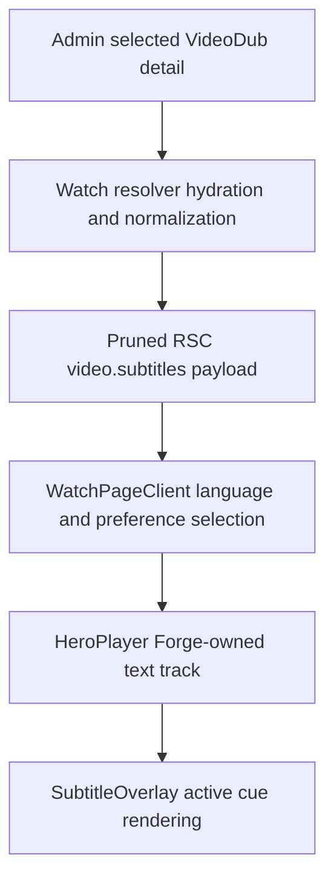

# fix: Restore subtitles on single-video Watch pages

## Summary

Restore admin-backed subtitles on dedicated single-video Watch routes while preserving the existing language-selection, generated-track guard, and selected-dub payload constraints.

---

## Problem Frame

Viewers report that subtitles do not work on a single-video Watch page. The current path spans Admin's selected-dub detail query, server normalization into `WatchVideoRecord.subtitles`, RSC client-payload pruning, preference-driven subtitle selection, and Forge-owned text-track injection. Nearby tests cover each layer in isolation, but they do not prove that a selected subtitle survives this full route-to-player chain.

---

## Requirements

### Playback contract

- R1. A dedicated `/watch/{video}.html/{audio-language}.html` route with a valid Admin VTT subtitle must deliver that subtitle to the player and render its active cues when enabled.
- R2. Automatic subtitle selection must remain limited to tracks matching the selected audio language, while an explicitly chosen translated subtitle may still restore.
- R3. Turning subtitles off, or resolving a selected dub with no valid VTT track, must leave the Forge overlay empty.
- R4. Mux-native generated tracks must remain ineligible for the Forge subtitle overlay.

### Data and performance contract

- R5. The Watch resolver must continue fetching heavy subtitle metadata only for the selected dub and must not restore the full multi-dub subtitle graph to the RSC payload.
- R6. The fix must preserve existing video, episode, and series routing behavior.

### Verification contract

- R7. Regression coverage must prove the failing single-video integration path and the relevant no-subtitle or translated-subtitle edge case.
- R8. Browser proof must confirm visible cues and unchanged language-modal behavior on a representative single-video route.

---

## Assumptions

- The report targets the web Watch single-video route rather than TV, mobile, Manager, or subtitle-generation workflows.
- Admin-backed `VideoEdition.subtitles` remains the product authority; generating or repairing missing subtitle content is outside this fix.
- The exact failing boundary will be selected from runtime and test evidence during implementation rather than assumed from the symptom alone.

---

## High-Level Technical Design

Characterization will identify the first stage where a valid selected-dub VTT track disappears or stops producing cues. The implementation will repair that boundary without introducing a second subtitle authority.

---

## Key Technical Decisions

- **Characterize the route-to-player seam first:** The symptom can originate in data hydration, client pruning, selection state, track injection, or cue observation; a failing regression should identify the actual boundary before production code changes.
- **Keep `video.subtitles` canonical on the client:** The selected dub's `videoEdition` remains pruned from the RSC stream to avoid duplicating subtitle metadata and weakening the selected-dub projection optimization.
- **Preserve Forge-owned track identity:** `FORGE_SUBTITLE_TRACK_LABEL` continues to distinguish user-selected Forge subtitles from Mux-generated tracks.
- **Fail closed when subtitle data is absent or invalid:** Missing or unusable VTT data should render no overlay rather than falling back to another language or a native generated track.

---

## Implementation Units

### U1. Characterize the single-video subtitle chain

- **Goal:** Reproduce the reported failure at the narrowest deterministic boundary and add regression coverage that fails for the current behavior.
- **Requirements:** R1, R2, R3, R5, R7
- **Dependencies:** None
- **Files:** `docs/roadmap/platform/feat-250-watch-single-video-subtitles.md`, `apps/web/src/lib/content.test.ts`, `apps/web/src/components/watch/__tests__/WatchPageClient.download.test.tsx`, `apps/web/src/components/watch/__tests__/HeroPlayer.test.tsx`, `apps/web/src/components/watch/__tests__/SubtitleOverlay.test.tsx`
- **Approach:** Create the required roadmap ticket at `in-progress`, then trace a selected dub containing a valid VTT row through resolver output, client props, selection state, and player track creation. Add coverage at the first boundary that loses the subtitle; avoid duplicating lower-level tests that already pass.
- **Execution note:** Start with a failing regression that models the real single-video route payload and selected audio language.
- **Patterns to follow:** Existing locale-fallback and selected-dub hydration cases in `apps/web/src/lib/content.test.ts`; same-language and explicit translated-preference cases in `apps/web/src/components/watch/__tests__/WatchPageClient.download.test.tsx`; text-track harnesses in `apps/web/src/components/watch/__tests__/HeroPlayer.test.tsx` and `apps/web/src/components/watch/__tests__/SubtitleOverlay.test.tsx`.
- **Test scenarios:**
  - A selected English dub with a valid English VTT row resolves a non-empty top-level subtitle list and supplies the proxied VTT source after subtitles are enabled.
  - A selected dub with no valid matching VTT row remains disabled and supplies no Forge subtitle source.
  - If the failure is player-side, adding or activating the Forge-owned track renders its cue while a generated Mux track remains ignored.
- **Verification:** The roadmap ticket is active, and the regression fails before the fix for the reported reason and identifies one concrete broken contract boundary.

### U2. Repair the identified subtitle boundary

- **Goal:** Make the characterized single-video path retain and render the selected Admin subtitle without widening data fetches or changing unrelated routing.
- **Requirements:** R1, R2, R3, R4, R5, R6, R7
- **Dependencies:** U1
- **Files:** `apps/web/src/lib/content.ts`, `apps/web/src/app/[locale]/[htmlLang]/[...rest]/page.tsx`, `apps/web/src/components/watch/WatchPageClient.tsx`, `apps/web/src/components/watch/HeroPlayer.tsx`, `apps/web/src/components/watch/SubtitleOverlay.tsx`, plus the focused test file selected in U1
- **Approach:** Change only the first broken boundary shown by U1. Preserve selected-dub detail hydration, the top-level `video.subtitles` client contract, same-audio default rules, explicit translated preferences, and Forge track labeling.
- **Patterns to follow:** `docs/solutions/ui-bugs/watch-caption-language-availability-20260615.md`, `docs/solutions/ui-bugs/watch-subtitle-overlay-mux-generated-track-leak.md`, and the selected-dub projection comments around `hydrateAndNarrowSelectedVariant` and `pruneWatchVideoForClient`.
- **Test scenarios:**
  - The failing U1 case passes and produces a usable Forge VTT source or active cue at the repaired boundary.
  - Existing same-audio default and explicit translated-subtitle behavior remains unchanged.
  - Subtitle-off and native generated-track cases remain empty in the Forge overlay.
  - Non-selected variants still exclude downloads, Mux detail, and `videoEdition` data.
- **Verification:** Focused tests pass without adding a second subtitle state source or expanding the initial multi-dub payload.

### U3. Validate the complete viewer flow

- **Goal:** Prove the repaired behavior in the browser and guard page-loading performance and nearby Watch behavior.
- **Requirements:** R1, R3, R4, R5, R6, R8
- **Dependencies:** U2
- **Files:** `apps/web/src/components/watch/__tests__/LanguagePickerModal.test.tsx`, `docs/solutions/ui-bugs/` if the root cause adds a reusable pattern
- **Approach:** Run the focused Watch suite, type and lint checks, then exercise a representative single-video route through subtitle enablement and cue playback. Inspect the modal choices and media text-track list so browser proof distinguishes Admin-backed Forge tracks from Mux-native tracks.
- **Test scenarios:**
  - Opening a single-video page, enabling an available subtitle, and advancing playback displays readable cues.
  - Disabling subtitles removes the cues and the Forge-owned track no longer drives the overlay.
  - A route without a same-audio subtitle keeps the explicit unavailable state while preserving intentional translated choices.
  - Initial page loading does not regain the full language/dub graph or show a material regression attributable to the fix.
- **Verification:** Automated checks pass, browser smoke captures visible subtitle proof, and the route's initial loading behavior remains within its existing selected-dub posture.

---

## Scope Boundaries

### Deferred to Follow-Up Work

- Repairing missing or invalid subtitle records in Admin or source media.
- Changing subtitle-generation, translation, or enrichment workflows.

### Out of Scope

- TV and mobile subtitle implementations.
- Redesigning the Watch language modal or subtitle overlay styling.
- Restoring full per-dub media metadata to the initial Watch page payload.

---

## Risks & Dependencies

- A representative route must contain a valid Admin VTT row; otherwise content absence can resemble a UI regression.
- Browser text-track timing differs between Mux Player and native video paths, so player-side fixes require proof against the currently selected Watch player backend.
- Resolver and route output use layered caching. Browser verification should distinguish stale cached content from the current local result before changing code.

---

## Sources & Research

- `apps/web/src/lib/content.ts` — selected-dub hydration, subtitle normalization, and payload narrowing.
- `apps/web/src/app/[locale]/[htmlLang]/[...rest]/page.tsx` — dedicated single-video rendering and RSC payload pruning.
- `apps/web/src/components/watch/WatchPageClient.tsx` — subtitle preference resolution and canonical VTT selection.
- `apps/web/src/components/watch/HeroPlayer.tsx` and `apps/web/src/components/watch/SubtitleOverlay.tsx` — Forge track injection and cue rendering.
- `docs/solutions/ui-bugs/watch-caption-language-availability-20260615.md` — same-audio default and intentional translated-subtitle contract.
- `docs/solutions/ui-bugs/watch-subtitle-overlay-mux-generated-track-leak.md` — Forge-owned track authority and generated-track guard.
- `docs/solutions/best-practices/watch-selected-dub-projection-20260624.md` — selected-dub payload and performance constraints.
