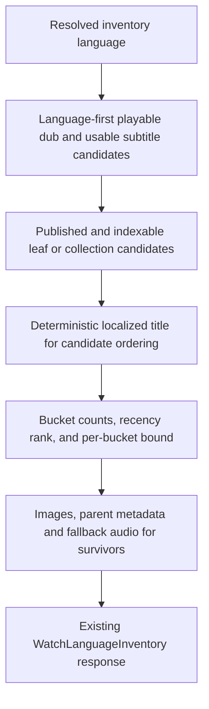

# perf: Make Watch language inventory SQL candidate-first

## Summary

Replace the corpus-wide Watch language inventory query with a candidate-first
pipeline backed by language-leading partial indexes. Preserve the public
GraphQL response while making large-language inventories complete well inside
the existing database timeout.

---

## Problem Frame

Production requests for Spanish and English inventory pages return a plain 500
after about 20 seconds. The direct Admin GraphQL query fails after about 10.2
seconds even with `limit: 1`, matching the query's 10 second PostgreSQL
statement timeout.

The current query resolves published locales and images for the full catalog,
builds all audio collection, audio video, and subtitle-only rows, then applies
the per-bucket limit after window counting and ranking. The limit cannot protect
the expensive work, and the existing playable-dub partial index begins with
`video_id` even though inventory discovery begins with `language_id`.

---

## Requirements

**Performance topology**

- R1. Spanish, English, and other high-volume inventories complete without
  increasing the 10 second SQL timeout or the 15 second Web Admin-client budget.
- R2. The query narrows to language-specific playable audio and subtitle
  candidates before selecting the localized ordering title, then applies the
  per-bucket bound before image, parent, child-count, or fallback-dub hydration.
- R6. Regression coverage proves the candidate narrowing and bucket bound
  precede their respective enrichment stages and that indexes align with the
  language-first predicates.

**Behavior compatibility**

- R3. The response preserves audio collection, audio video, subtitle-only,
  counts, promoted recency, public fallback language, and per-bucket cap
  semantics.
- R4. Unknown language slugs continue to return an empty inventory without
  entering the raw SQL transaction.
- R5. The public GraphQL schema and generated Admin client contract remain
  unchanged.

**End-to-end proof**

- R7. Browser verification confirms the Spanish inventory route renders and
  does not regress Watch page-loading performance.

---

## Key Technical Decisions

- **Lead with language coverage:** Build reusable playable-audio and usable-
  subtitle candidate sets from `language_id` before joining display tables.
  This changes the amount of work without changing content eligibility.
- **Hydrate bounded survivors:** Rank compact candidates and retain total bucket
  counts after selecting one indexed localized title per language-specific
  candidate, because title is part of the existing tie order. Select images,
  parent metadata, child counts, and fallback audio only for bounded survivors.
  This follows the established Admin semantic retrieval pattern while
  preserving observable ordering.
- **Add query-aligned partial indexes:** Add language-leading indexes for
  playable dubs and usable subtitles. Keep the existing video-leading Watch
  indexes because single-video routes depend on that access pattern.
- **Keep one transactional read:** Retain `SET LOCAL statement_timeout` and a
  single raw SQL statement so counts and rows describe one database snapshot.
- **Preserve product behavior over incidental SQL shape:** Maintain eligibility,
  bucket totals, recency ordering, and deterministic tie-breaking. Internal CTE
  names and join order may change to support the performance topology.
- **Do not widen timeouts:** A larger timeout would retain the corpus-wide cost,
  consume more Admin capacity, and still fail as the catalog grows.

---

## High-Level Technical Design

---

## Implementation Units

### U1. Language-first inventory indexes

- **Goal:** Give PostgreSQL selective access paths for inventory discovery by
  language instead of scanning video-leading indexes.
- **Requirements:** R1, R2, R6
- **Dependencies:** None
- **Files:**
  - `apps/admin/prisma/migrations/0041_watch_language_inventory_indexes/migration.sql`
- **Approach:** Add forward-only partial indexes for playable dubs beginning
  with `language_id` and usable subtitles beginning with `language_id`. Include
  the video and edition identifiers needed to form compact candidate sets, and
  align partial predicates with the query's published, non-deleted, and usable-
  media conditions.
- **Patterns to follow:**
  `apps/admin/prisma/migrations/0035_watch_video_query_indexes/migration.sql`
  for idempotent, named partial indexes that complement rather than replace
  Prisma's generic indexes.
- **Test expectation:** No unit test; this is a forward-only index migration.
  Validate migration syntax and confirm its predicates match the SQL invariant
  assertions in U2.
- **Verification:** Admin's Prisma schema validates, the migration is
  idempotent, and no existing Watch index is dropped.

### U2. Candidate-first inventory SQL

- **Goal:** Bound language-specific candidates before card enrichment while
  returning the existing inventory model.
- **Requirements:** R1, R2, R3, R4, R5, R6
- **Dependencies:** U1
- **Files:**
  - `apps/admin/src/services/video.service.ts`
  - `apps/admin/src/services/video.service.test.ts`
- **Approach:** Derive playable audio once and reuse it for leaf videos,
  collection parents, and same-language subtitle exclusion. Derive direct and
  edition-linked subtitle candidates without an `OR EXISTS` against every
  published video. Gate candidate videos through published/indexable
  eligibility, select one deterministic localized ordering title per candidate,
  and compute bucket counts and ranks over compact rows. Hydrate images, parent
  details, child counts, and fallback audio only for bounded survivors through
  indexed lateral lookups.
- **Execution note:** Start by strengthening SQL-shape characterization tests,
  then rewrite the query without changing mapped DTOs.
- **Patterns to follow:**
  `docs/solutions/performance-issues/admin-semantic-db-retrieval-visible-candidate-window.md`
  for survivor hydration and
  `docs/solutions/best-practices/prisma-raw-sql-invariant-assertions-20260423.md`
  for raw-template topology tests.
- **Test scenarios:**
  - A playable Spanish dub produces one audio video and contributes to its
    eligible collection without duplicating either bucket.
  - A usable Spanish subtitle with no Spanish dub produces one subtitle-only
    row and resolves a deterministic playable fallback audio language.
  - A video with both Spanish audio and Spanish subtitles appears only in the
    audio bucket.
  - Direct `video_id` subtitles and edition-linked subtitles both qualify.
  - Parent videos remain excluded from leaf buckets, while collection child
    count and most-recent playable-child ordering remain unchanged.
  - Per-bucket totals describe all eligible candidates while returned rows stop
    at the normalized cap.
  - The SQL text narrows language candidates before localized-title selection,
    and places the bucket bound before image, parent-detail, child-count, and
    fallback-dub hydration.
  - The SQL text uses language-leading predicates aligned with U1's partial
    indexes and contains no corpus-wide `selected_locale` or `selected_image`
    CTE.
  - Unknown language slugs return the existing empty model without SQL.
- **Verification:** Focused service tests, Admin typecheck, and scoped lint pass
  without changing the GraphQL SDL or generated types.

### U3. End-to-end performance proof and operational handoff

- **Goal:** Prove the route contract before merge and record the post-deploy
  production performance boundary.
- **Requirements:** R1, R3, R7
- **Dependencies:** U2
- **Files:**
  - `docs/roadmap/content-discovery/feat-250-watch-language-inventory-query-performance.md`
  - `docs/solutions/performance-issues/watch-language-inventory-candidate-first-sql-20260713.md`
- **Approach:** Run focused Admin validation, browser smoke the Spanish route
  against available implementation data, and capture a screenshot plus
  page-load timing. Document the candidate-first pattern and the separate
  post-deploy production canary procedure. Complete the roadmap ticket after
  code, browser, and review gates pass; the completion note must name any
  production verification that still awaits the normal main deployment.
- **Test scenarios:**
  - The Spanish page renders inventory content or its calm empty state instead
    of a server-render error in the implementation environment.
  - Audio sections remain ahead of subtitle-only content and card links retain
    public Watch language slugs.
  - The browser response completes within the local implementation budget and
    produces no server-render error.
- **Verification:** Browser proof is captured, the solution document records
  the before/after topology and production canary thresholds, and the roadmap
  ticket is marked complete.

---

## Scope Boundaries

- Do not change the language inventory GraphQL schema, public route shape, UI
  design, or Web timeout values.
- Do not add client-side pagination, infinite scroll, or search.
- Do not drop existing video-leading indexes used by single-video Watch routes.
- Do not publish local code directly to production; production verification
  follows the normal PR-to-main deployment flow.

### Deferred to Follow-Up Work

- Reducing the server-rendered card payload below the existing 1,000-row
  per-bucket contract is separate product and pagination work.
- Adding always-on production query latency metrics is separate observability
  work unless existing traces cannot distinguish this resolver after deploy.

---

## System-Wide Impact

Admin remains the owner of language coverage and continues to expose the same
public read model to Web. The migration adds storage and write-maintenance cost
for two partial indexes, but it removes repeated catalog-wide reads from a
public server-render path. Normal Admin-before-Web deployment order remains
valid because there is no schema contract change.

---

## Risks & Dependencies

- A predicate mismatch between SQL and a partial index can silently force a
  sequential scan; SQL invariants must keep the usable-media conditions aligned.
- Selecting localized titles before language-candidate narrowing would recreate
  the catalog-wide cost; keep the title lookup after narrowing but before rank
  so deterministic tie ordering remains intact.
- Subtitle edition relationships can represent rows without a direct
  `video_id`; direct and edition-linked paths need separate regression cases.
- Local fixtures cannot prove production planner choices. Post-deploy direct
  GraphQL canaries and, when available, `EXPLAIN (ANALYZE, BUFFERS)` remain the
  final performance proof.

---

## Success Metrics

- Direct production Admin canaries for Spanish and English return without
  GraphQL errors, below 2 seconds warm and 5 seconds cold.
- Public Spanish and English inventory routes return rendered HTML rather than
  a 500, with no approximately 20-second double failure.
- Bucket counts, grouping, availability, promoted ordering, and fallback links
  remain behaviorally equivalent for focused fixtures.
- The SQL statement timeout stays at 10 seconds and the Web Admin-client timeout
  stays at 15 seconds.

---

## Sources & Research

- `docs/plans/2026-06-16-001-feat-watch-language-inventory-plan.md` defines the
  existing product and read-model contract.
- `docs/solutions/architecture-patterns/watch-localized-index-flat-admin-read-model-20260616.md`
  keeps language coverage inside Admin and card payloads flat.
- `docs/solutions/performance-issues/admin-semantic-db-retrieval-visible-candidate-window.md`
  establishes the candidate-bound-before-display-hydration pattern.
- `docs/solutions/best-practices/prisma-raw-sql-invariant-assertions-20260423.md`
  defines the repository's raw SQL topology test technique.
- `apps/admin/prisma/migrations/0035_watch_video_query_indexes/migration.sql`
  provides the existing Watch partial-index conventions.
