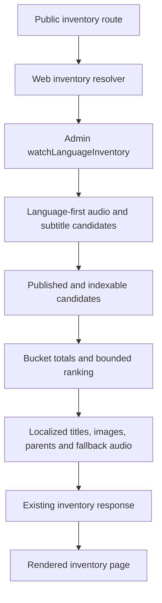

# perf: Restore Watch language inventory routes

## Summary

Integrate and independently verify the candidate-first Admin SQL work from
`perf/watch-language-inventory-sql` on top of the latest `main`. Restore
`/watch/videos` and localized inventory routes without widening the existing
database or Web timeouts or changing the public GraphQL contract.

---

## Problem Frame

Production `/watch/videos` requests correctly rewrite to the localized Next.js
route but return a plain 500 after about 20 seconds. Production Admin logs show
PostgreSQL error `57014` from `watchLanguageInventory`: the corpus-wide query
exceeds its 10 second statement timeout, GraphQL returns an internal error, and
Web fails during server rendering.

The existing `perf/watch-language-inventory-sql` branch contains a candidate
rewrite and migration that report sub-second performance on a 25,000-video
fixture. That work is prior art for this fix, but it must be reconciled with a
fresh `main`, reviewed for response equivalence, and revalidated before it is
shipped.

---

## Requirements

**Production failure resolution**

- R1. English, Spanish, and other large language inventories complete inside
  the existing 10 second PostgreSQL statement timeout and 15 second Web Admin
  client budget.
- R2. Public `/watch/videos` and localized `/{language}.html/videos` routes
  render inventory HTML instead of returning a server-render 500.
- R3. The fix keeps the existing timeouts unchanged so database work remains
  bounded as the catalog grows.

**Contract preservation**

- R4. Audio collections, audio videos, subtitle-only videos, complete bucket
  counts, promoted recency, deterministic ordering, fallback audio links, and
  per-bucket cap behavior remain equivalent.
- R5. Unknown language slugs continue returning an empty inventory without
  entering the raw SQL transaction.
- R6. The public GraphQL schema, generated Admin client artifacts, and public
  Watch route shapes remain unchanged.

**Safe integration**

- R7. The implementation starts from freshly fetched `main` and evaluates the
  `perf/watch-language-inventory-sql` changes against any intervening Admin,
  migration, documentation, or test changes before retaining them.
- R8. Regression coverage and a real PostgreSQL execution prove that candidate
  narrowing and bucket bounds precede expensive display hydration.

---

## Key Technical Decisions

- **Start from current `main`:** Create the shipping branch from the fetched
  remote head, then merge or cherry-pick the performance work so unrelated
  upstream changes are preserved and conflicts are resolved against current
  code.
- **Use candidate-first discovery:** Begin from playable dubs and usable
  subtitles for the requested language, aggregate eligibility once per video,
  and hydrate card metadata only for bounded survivors.
- **Keep language-leading indexes additive:** Retain video-leading indexes used
  by single-video routes while adding partial indexes aligned with inventory's
  `language_id` predicates.
- **Preserve one bounded transactional read:** Keep the 10 second statement
  timeout and one raw SQL transaction so totals and returned rows describe one
  snapshot.
- **Require real database proof:** SQL-template assertions protect stage order,
  but an isolated PostgreSQL fixture and execution timing protect against
  planner behavior that mocks cannot reveal.
- **Avoid a silent Web fallback in this change:** Returning incomplete inventory
  would hide an Admin correctness or capacity failure. The primary resolver
  must become healthy; the existing error remains observable if it regresses.

---

## High-Level Technical Design

---

## Implementation Units

### U1. Reconcile the candidate fix with current main

- **Goal:** Establish a clean shipping branch containing current `main` plus
  the relevant performance branch changes.
- **Requirements:** R7
- **Dependencies:** None
- **Files:**
  - `apps/admin/src/services/video.service.ts`
  - `apps/admin/src/services/video.service.test.ts`
  - `apps/admin/prisma/migrations/0041_watch_language_inventory_indexes/migration.sql`
  - `CONCEPTS.md`
  - `docs/plans/2026-07-13-003-perf-watch-language-inventory-sql-plan.md`
  - `docs/roadmap/content-discovery/feat-250-watch-language-inventory-query-performance.md`
  - `docs/solutions/performance-issues/watch-language-inventory-candidate-first-sql-20260713.md`
- **Approach:** Fetch `origin`, create a feature branch from the latest
  `origin/main`, and integrate commit `53f9d315` or its current remote
  successor. Review every conflict and retained file against current Admin
  conventions; do not overwrite unrelated upstream changes.
- **Patterns to follow:** `docs/solutions/architecture-patterns/watch-localized-index-flat-admin-read-model-20260616.md`
  for Admin ownership and a flat response model.
- **Test expectation:** No standalone behavioral test; U2 owns the behavior
  and performance assertions for the integrated code.
- **Verification:** The branch contains the fetched `origin/main` ancestry,
  the worktree has no unintended files, and the performance changes remain a
  coherent Admin-only contract change plus documentation.

### U2. Prove candidate-first SQL correctness and bounded performance

- **Goal:** Ensure the integrated SQL resolves the production timeout without
  changing inventory semantics.
- **Requirements:** R1, R3, R4, R5, R6, R8
- **Dependencies:** U1
- **Files:**
  - `apps/admin/src/services/video.service.ts`
  - `apps/admin/src/services/video.service.test.ts`
  - `apps/admin/prisma/migrations/0041_watch_language_inventory_indexes/migration.sql`
- **Approach:** Review and refine the language-first candidate CTEs, tie-aware
  per-bucket limiting, survivor hydration, and partial-index predicates. Keep
  the existing DTO mapping and GraphQL surface unchanged. Add or strengthen
  tests wherever branch integration or review exposes a semantic gap.
- **Execution note:** Preserve characterization coverage before changing the
  SQL topology, then confirm the final query against a real PostgreSQL fixture.
- **Patterns to follow:**
  `docs/solutions/performance-issues/admin-semantic-db-retrieval-visible-candidate-window.md`
  for survivor hydration and
  `docs/solutions/best-practices/prisma-raw-sql-invariant-assertions-20260423.md`
  for topology assertions.
- **Test scenarios:**
  - A playable dub produces one audio leaf and contributes to an eligible
    collection without duplicate bucket rows.
  - A usable direct or edition-linked subtitle with no same-language dub
    produces one subtitle-only row with a deterministic playable fallback.
  - A video with both same-language audio and subtitles appears only in the
    audio bucket.
  - Collection child count and recency include eligible playable children while
    parent containers remain excluded from leaf buckets.
  - Bucket totals cover all eligible rows while returned rows stop at the
    normalized cap and preserve deterministic recency/title/id ordering.
  - Unknown language slugs return the empty model without starting a raw SQL
    transaction.
  - SQL topology narrows language candidates before localization and places
    the bucket bound before image, parent, child-count, and fallback hydration.
  - The migration predicates match the query's published, non-deleted,
    non-empty media predicates and do not replace video-leading indexes.
  - A production-scale PostgreSQL fixture completes repeatedly below the 10
    second guard, including a cold execution and an inspected query plan.
- **Verification:** Focused and full Admin tests, lint, typecheck, Prisma
  validation, migration application from an empty database, and real database
  timing pass without schema or generated-type drift.

### U3. Verify the public routes and prepare operational proof

- **Goal:** Confirm the fixed Admin read model restores the user-facing route
  and leaves durable evidence for post-deploy verification.
- **Requirements:** R1, R2, R4, R8
- **Dependencies:** U2
- **Files:**
  - `docs/roadmap/content-discovery/feat-250-watch-language-inventory-query-performance.md`
  - `docs/solutions/performance-issues/watch-language-inventory-candidate-first-sql-20260713.md`
- **Approach:** Start the relevant local Admin/Web services against populated
  implementation data, browser-smoke the default and localized inventory
  routes, capture a screenshot, and inspect console plus response timing. Keep
  production canaries as post-deploy checks through the normal PR-to-main
  deployment flow.
- **Test scenarios:**
  - `/watch/videos` and the Spanish localized inventory route return rendered
    HTML rather than a plain server error.
  - Audio sections remain before subtitle-only content, counts are visible,
    and cards retain public language-slug links.
  - Browser console inspection shows no route-render exception and repeated
    requests stay within the local performance budget.
  - Post-deploy English and Spanish direct Admin canaries return without
    PostgreSQL `57014`, Prisma raw-query errors, GraphQL internal errors, or Web
    500 responses.
- **Verification:** Browser proof and timing are captured, code review has no
  unresolved eligible findings, the roadmap ticket records the completed local
  gates, and production-only canaries are clearly marked as awaiting normal
  deployment.

---

## Scope Boundaries

- Do not increase the PostgreSQL statement timeout or Web request timeout.
- Do not change the GraphQL schema, generated GraphQL types, public URL shapes,
  inventory UI design, or the 1,000-item per-bucket contract.
- Do not add client pagination, search, or a silent partial-data fallback.
- Do not publish worktree code directly to production; deployment remains the
  normal PR-to-main flow.

### Deferred to Follow-Up Work

- A user-facing inventory error boundary may be planned separately if product
  wants degraded partial or empty data instead of an observable server error.
- Always-on resolver latency metrics may follow if existing Admin/Web traces do
  not distinguish post-deploy inventory canaries.

---

## Risks & Dependencies

- A SQL/index predicate mismatch can make PostgreSQL ignore the new partial
  indexes; migration and query predicates must stay aligned.
- Materialized CTE anti-joins can become repeated scans on large candidate
  sets; the real query plan must prove membership checks remain bounded.
- Applying the per-bucket limit before a field used by final ordering can alter
  visible results; retain the full boundary-tie group until deterministic title
  ordering is available.
- Local data cannot prove production distribution or planner selection. Final
  English and Spanish canaries remain required after Admin and Web deploy.

---

## Success Metrics

- Real PostgreSQL stress execution remains below 5 seconds cold and 2 seconds
  warm, with the 10 second statement timeout unchanged.
- Post-deploy direct English and Spanish Admin queries return data without
  `57014` or GraphQL errors.
- Public English and Spanish inventory routes return rendered HTML rather than
  the approximately 20-second 500.
- Focused fixtures preserve bucket membership, totals, promoted ordering,
  fallback language, and per-bucket cap behavior.

---

## Sources & Research

- `docs/plans/2026-06-16-001-feat-watch-language-inventory-plan.md` defines the
  public inventory contract.
- `docs/solutions/architecture-patterns/watch-localized-index-flat-admin-read-model-20260616.md`
  defines Admin ownership and flat inventory cards.
- `perf/watch-language-inventory-sql` commit `53f9d315` provides the candidate
  implementation, migration, stress results, and browser proof to reassess.
- Production Railway logs on 2026-07-13 identify PostgreSQL error `57014` at
  `watchLanguageInventory` and the downstream Web GraphQL render failure.
