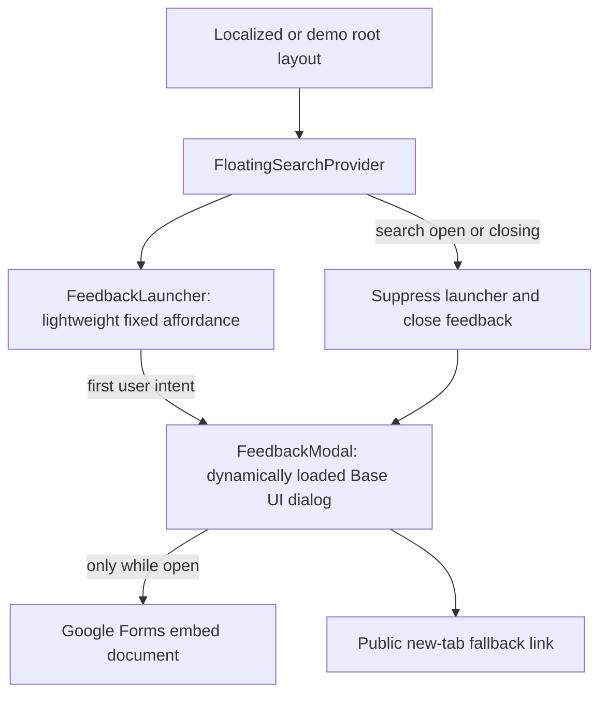

# feat: Add a global feedback modal

## Summary

Add a lightweight feedback affordance to every `apps/web` page. The affordance opens an accessible, responsive modal containing the public Beta Feedback Google Form, while keeping all Google resources and the dialog chunk off the initial page-load path.

---

## Problem Frame

Users currently have no persistent way to submit product feedback from the page they are using. The supplied Google Form already owns collection, so Forge only needs a global entry point and safe embedded presentation rather than a new feedback backend.

---

## Requirements

- R1. Every page rendered by either `apps/web` root layout must expose a visible, keyboard-accessible feedback launcher.
- R2. Activating the launcher must open the public `Beta Feedback` form inside a modal without navigating away from Forge.
- R3. The Google form document and the dialog implementation chunk must not load before the first feedback interaction, and the iframe must unmount whenever the modal is closed.
- R4. The modal must provide an accessible title, visible close control, Escape and backdrop close behavior, focus containment, and focus restoration for ordinary user-initiated closes.
- R5. The iframe must use the fixed validated Google embed URL, a descriptive title, a restrictive referrer policy, the minimum proven sandbox capabilities, and a visible new-tab fallback link.
- R6. Feedback and the global search overlay must be mutually exclusive: search suppresses the launcher and closes any open feedback iframe before its own overlay becomes interactive.
- R7. The launcher and modal must avoid the Watch question-panel region, remain usable at narrow mobile widths, and preserve safe-area spacing.
- R8. Validation must prove the form renders on both route families and that no Google Forms request occurs before user intent.

---

## Key Technical Decisions

- KTD1. **Use a small global client launcher in both root layouts:** `apps/web` has separate localized and demo root layouts, so both will mount the same launcher inside `FloatingSearchProvider`. This gives every route coverage while allowing the launcher to consume the provider's `searchOpen` state.
- KTD2. **Split the lightweight launcher from the intent-loaded modal:** `FeedbackLauncher` owns the fixed affordance, an immediate announced loading state, and the dynamic `FeedbackModal` import after first activation. The iframe remains conditional on the modal's actual `open` state, and `searchOpen` removes the entire feedback modal subtree in the same render so its portal and iframe cannot overlap search ownership.
- KTD3. **Use the resolved embed URL directly:** the form source is `https://docs.google.com/forms/d/e/1FAIpQLScNeD3kPs7bqhV2i_QA6IMRCrs9W638TJuApb6QA4_ezQAEPA/viewform?embedded=true`; the short link is retained only as the visible new-tab fallback. The owner-supplied public form is authoritative for responder permissions and collection; Forge validates the public embed and interaction surface without claiming access to its private destination data.
- KTD4. **Reuse the shared Base UI dialog:** `apps/web/src/components/ui/dialog.tsx` already provides the portal, backdrop, focus trap, Escape handling, and close lifecycle needed for a global overlay. The modal will follow the hardened iframe precedent in `QuizButton` with `sandbox="allow-forms allow-scripts allow-same-origin"` and use `referrerPolicy="no-referrer"` to avoid sending the current Forge page URL to Google.
- KTD5. **Use a right-edge launcher and dedicated overlay layer:** a side-mounted control at the logical right safe-area edge avoids bottom chrome and the fixed Watch question panel. Feedback backdrop and content render above the panel's `z-[57]` layer, while search-open state removes the trigger and feedback portal to keep ownership singular.
- KTD6. **Keep feedback copy aligned with the English-only form:** the launcher and modal use the form's public `Beta Feedback` naming without adding one English fallback key to all 225 message catalogs. Localization of both the form and its entry point is deferred until a localized responder experience exists.

---

## High-Level Technical Design

The normal path preserves the server-rendered page and existing floating header. Only a feedback activation enables the modal code, and only an open modal creates the cross-origin iframe.

---

## Implementation Units

### U1. Track the global feedback surface

- **Goal:** Create the required roadmap record before implementation and keep the generated roadmap index in sync.
- **Requirements:** R1-R8.
- **Dependencies:** None.
- **Files:**
  - `docs/roadmap/platform/feat-250-web-global-feedback-modal.md`
  - `docs/roadmap/README.md`
- **Approach:** Add an agent-optimized `in-progress` platform ticket with exact entry points, constraints, and verification, then regenerate the roadmap index. Mark the ticket complete only after code and browser validation pass.
- **Patterns to follow:** `docs/roadmap/platform/feat-249-web-force-login-marker-consume-on-success.md` and the roadmap format in `CLAUDE.md`.
- **Test expectation:** None -- this unit records and indexes the feature rather than changing runtime behavior.
- **Verification:** The ticket parses in the roadmap generator, appears once in the Platform index, and ends with `status: "complete"` after the feature ships.

### U2. Build the intent-loaded feedback launcher and modal

- **Goal:** Provide the global affordance, accessible dialog, secure Google Forms embed, fallback path, and search-overlay mutual exclusion.
- **Requirements:** R1-R7.
- **Dependencies:** U1.
- **Files:**
  - `apps/web/src/components/FeedbackLauncher.tsx`
  - `apps/web/src/components/FeedbackModal.tsx`
  - `apps/web/src/components/__tests__/FeedbackLauncher.test.tsx`
- **Approach:** Keep the launcher client island minimal and declare a module-scope `next/dynamic` import with an immediate accessible loading fallback. Disable repeated activation while the chunk resolves, latch the loaded component after first intent, pass controlled `open` state, and render the iframe only while open. When `searchOpen` becomes true, omit the modal subtree immediately, suppress focus restoration to the hidden launcher, and clear feedback state before search can close. Use the shared `Dialog`, feedback-specific backdrop/content layers above `z-[57]`, a visible close control, a responsive bounded iframe viewport, and a visible new-tab fallback.
- **Patterns to follow:** `apps/web/src/components/sections/QuizButton.tsx`, `apps/web/src/components/watch/ShareModal.tsx`, `apps/web/src/components/FloatingSearchProvider.tsx`, and `docs/solutions/best-practices/base-ui-dialog-state-attribute-detection-20260520.md`.
- **Test scenarios:**
  1. Rendering the launcher leaves the modal and every Google iframe absent until activation.
  2. Keyboard or pointer activation loads one modal and one iframe using the exact embed URL, `no-referrer`, the approved sandbox tokens, and a descriptive title.
  3. A delayed modal import immediately announces loading, disables duplicate activation, and opens exactly one dialog when the chunk resolves.
  4. The visible close control, Escape, and backdrop close transition the Base UI popup to `data-closed` or unmounted and remove the iframe.
  5. Forward and reverse tab navigation remain contained within the open modal instead of reaching page or search controls.
  6. A normal user close restores focus to the launcher.
  7. When search is already open, the launcher is suppressed and feedback cannot open.
  8. When search opens while feedback is active, the feedback portal and iframe unmount atomically, focus does not return to the hidden launcher, and the launcher stays suppressed through the search close animation.
  9. The fallback link opens the supplied public responder URL in a new tab with safe relationship attributes.
- **Verification:** The focused Vitest suite passes without loading Google, the trigger meets the 44px target, and the modal state remains deterministic through Base UI close animation.

### U3. Mount the surface across all web routes

- **Goal:** Make the shared launcher available in both root layout families without moving either layout to the client.
- **Requirements:** R1, R6, R7.
- **Dependencies:** U2.
- **Files:**
  - `apps/web/src/app/[locale]/[htmlLang]/layout.tsx`
  - `apps/web/src/app/(demo)/layout.tsx`
  - `apps/web/src/components/__tests__/FeedbackLauncher.test.tsx`
- **Approach:** Render `FeedbackLauncher` as a child of each existing `FloatingSearchProvider` alongside page content. Preserve the layouts as Server Components and do not add new preconnect, DNS-prefetch, or eager Google resource hints.
- **Patterns to follow:** The layouts' existing `DatadogRum` and `FloatingSearchProvider` client-island composition.
- **Test scenarios:**
  1. A localized Watch route exposes the launcher and retains the existing floating header/search behavior.
  2. A demo route exposes the same launcher through its independent root layout.
  3. Neither route emits a Google Forms iframe or request before the launcher is activated.
- **Verification:** Type checking confirms the server/client boundary, and browser smoke confirms both route families mount the same control.

### U4. Validate behavior, performance, and responsive presentation

- **Goal:** Prove the real public form works in Forge without degrading initial page load.
- **Requirements:** R2-R8.
- **Dependencies:** U3.
- **Files:**
  - `apps/web/src/components/__tests__/FeedbackLauncher.test.tsx`
- **Approach:** Run focused tests plus web format, lint, typecheck, and build checks. Browser-smoke a normal Watch route and the demo route at desktop and mobile widths, inspect actual Base UI open/closed attributes, verify focus cannot escape the open dialog, and capture a screenshot. Compare resource timing before and after activation to prove the `FeedbackModal` JavaScript chunk and all Google Forms requests are absent before the click and requested only after it; do not submit test feedback.
- **Patterns to follow:** `docs/solutions/conventions/frontend-change-page-load-performance-verification.md` and `docs/solutions/performance-issues/watch-staged-client-loading-20260611.md`.
- **Test scenarios:**
  1. Desktop and narrow mobile viewports show an unobscured launcher, modal title, close control, iframe, and fallback link.
  2. The live public form renders its `Beta Feedback` content and responder controls inside the sandbox without a `forms.gle` redirect; private response collection remains owned by the supplied Google Form.
  3. Resource timing contains neither the `FeedbackModal` chunk nor a Google Forms host before intent and shows both direct resources only after opening.
  4. Closing and reopening produces one active iframe and returns to the same stable launcher state.
  5. With the Watch question panel visible, the feedback backdrop and modal remain visually and interactively above it, and the launcher respects a simulated nonzero right safe-area inset.
- **Verification:** Automated checks are green, screenshots capture desktop and mobile modal presentation, and resource evidence demonstrates intent-only third-party loading.

---

## Scope Boundaries

### In scope

- A global `apps/web` feedback launcher and modal.
- Embedding the supplied Google Form and providing a new-tab fallback.
- Accessibility, responsive layout, search-overlay coexistence, and page-load protection.

### Deferred to Follow-Up Work

- Translating the Google Form and launcher copy across supported locales.
- Prefilling route, user, or session metadata into the form.
- First-party feedback storage, analytics, moderation, or admin reporting.

### Out of scope

- Changes to the Google Form questions, responder permissions, or destination spreadsheet.
- Feedback entry points in `apps/mobile`, `apps/tv`, `apps/admin`, or `apps/manager`.
- Submitting synthetic feedback during automated or browser validation.

---

## Risks and Dependencies

- **Third-party availability:** Google Forms may be blocked or unavailable. The always-visible new-tab fallback preserves an alternate completion path.
- **Cross-origin opacity:** Forge cannot inspect form height, submission state, or detailed load failure. The modal uses a bounded scrollable viewport and validates the real form visually without inventing unreliable load-error handling.
- **Sandbox compatibility:** The local `QuizButton` precedent proves the selected form/script/same-origin capabilities, but the browser smoke must confirm this specific Google Form renders and accepts interaction.
- **Collection ownership:** Forge cannot verify the private response destination without form-owner access. The supplied public form is treated as the collection authority; the feature's acceptance proof covers public responder availability and embedded interaction without inserting synthetic feedback.
- **Portal competition:** Search and feedback both render global overlays. The explicit `searchOpen` close/suppress rule keeps ownership singular.
- **Initial-load cost:** A launcher on every page can affect hydration and JavaScript. The modal chunk and iframe stay behind first intent, and resource timing is a required acceptance gate.

---

## Sources and Research

- `apps/web/src/components/sections/QuizButton.tsx` -- existing hardened iframe-dialog pattern.
- `apps/web/src/components/ui/dialog.tsx` -- shared Base UI portal and lifecycle behavior.
- `docs/solutions/performance-issues/watch-staged-client-loading-20260611.md` -- intent-loaded modal chunk precedent.
- [Next.js lazy loading](https://nextjs.org/docs/app/guides/lazy-loading) -- conditional dynamic modal loading.
- [Base UI Dialog](https://base-ui.com/react/components/dialog) -- modal focus, portal, close, and mount behavior.
- [Google Forms publishing and embedding](https://support.google.com/docs/answer/2839588?hl=en-GB) -- supported embed workflow.
- [W3C iframe title technique](https://www.w3.org/WAI/WCAG21/Techniques/html/H64) -- accessible iframe naming.
