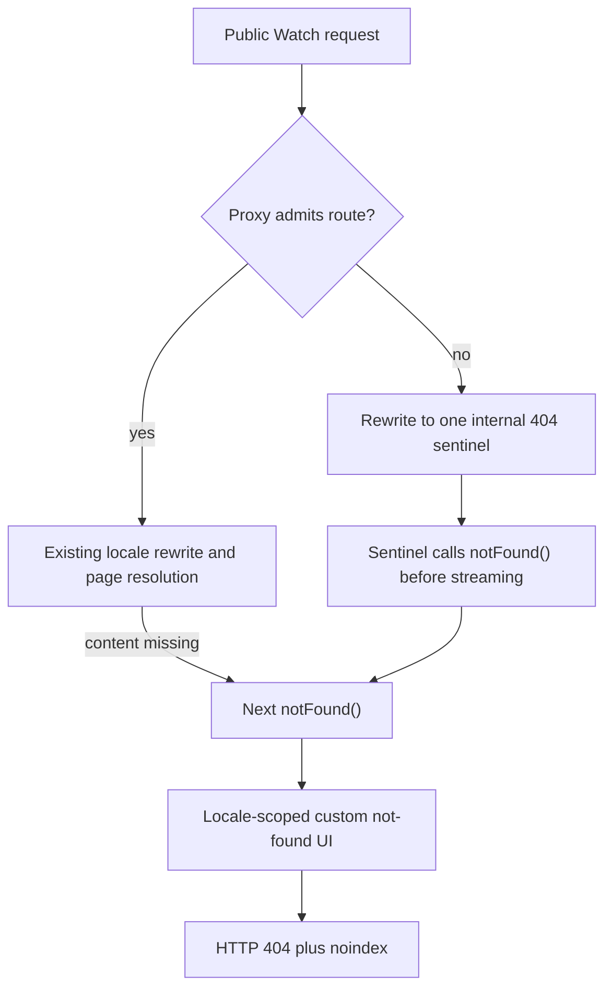

# feat: Add a custom Watch not-found page

## Summary

Replace Watch's empty and default 404 responses with one cinematic, functional
not-found experience while preserving the existing route-admission boundary and
true HTTP 404 semantics.

---

## Problem Frame

Watch currently has two not-found paths. Invalid or manifest-rejected public
URLs are terminated in `apps/web/src/proxy.ts` with an empty response, while
resolver misses call `notFound()` without a segment-level `not-found.tsx` and
therefore use Next.js's default UI. Neither path gives viewers a useful way back
to Watch.

The route manifest intentionally rejects impossible routes before the
force-static catch-all so hostile paths cannot trigger Admin work or mint an
unbounded set of ISR miss entries. The new experience must keep that boundary
rather than allowing each invalid public URL through page resolution.

---

## Requirements

- R1. Every user-facing Watch page miss must render the same custom not-found
  experience, including proxy classification failures, route-manifest
  rejections, and app-level `notFound()` calls.
- R2. The final document response must retain HTTP status 404 and Next.js's
  `noindex` behavior.
- R3. Proxy-rejected paths must converge on one fixed internal sentinel without
  page-resolver or Admin GraphQL work beyond the existing conditional route-
  manifest lookup, and without per-invalid-path ISR keys.
- R4. Valid Watch routes, reserved asset/API paths, canonical redirects, and
  security headers must retain their current behavior.
- R5. The page must match Watch's established visual system and provide working
  paths back to the Watch home and video inventory.
- R6. The layout must remain usable at mobile and desktop widths with semantic
  structure, visible keyboard focus, reduced-motion support, and readable
  contrast.
- R7. The failure path must add no remote data fetch, dependency, or avoidable
  client-side runtime.

---

## Design Direction

- **Visual thesis:** Treat the first viewport as a lost-film poster: real Watch
  artwork recedes into a black cinematic field while oversized 404 typography
  and concise copy provide the anchor.
- **Content plan:** Preserve the global Watch header, then present the 404 code,
  a short missing-scene message, a primary return action, and a secondary browse
  action.
- **Interaction plan:** Use one restrained entrance sequence for the artwork and
  copy, plus existing Watch hover and focus transitions on the two actions;
  disable entrance motion when reduced motion is requested.

The visible copy deck is: eyebrow “Page not found”, H1 “This scene isn't here.”,
body “The page may have moved, but the story continues.”, primary action “Back
to Watch”, and secondary action “Browse videos”. The H1 includes a screen-reader
prefix so its accessible name starts with “Page not found”.

---

## Key Technical Decisions

- **Render inside the locale layout:** Place `not-found.tsx` under
  `apps/web/src/app/[locale]/[htmlLang]` so the page inherits Montserrat, the
  floating JesusFilm logo, global search, account control, and Watch's dark
  theme.
- **Use a fixed internal sentinel:** Rewrite page-level proxy rejections to one
  internal route that immediately calls `notFound()`. This preserves the compact
  route-manifest admission boundary while allowing App Router to render the
  custom UI.
- **Let `notFound()` own the final response:** Do not rely on rewrite status
  alone. Official Next.js guidance assigns not-found rendering and final status
  to the destination route, so production-mode verification must prove a
  non-streamed 404 response.
- **Keep the page deterministic:** Use only existing local Watch artwork and
  route builders. Do not fetch Admin, CMS, or remote media on an error path.
- **Keep presentation server-rendered:** The existing floating header already
  owns functional search, so the custom body needs links rather than a new
  client-side controller.

---

## High-Level Technical Design

The fixed sentinel is a convergence point, not a public route contract. The
browser keeps the original invalid URL while Next.js owns the rendered response.

---

## Assumptions

- The initial body copy will be concise English rather than adding a namespace
  to all 225 UI catalogs. Existing translated global search chrome remains
  available; full not-found localization is deferred.
- `apps/web/public/images/thumbnails/11_Advent0304-vertical.jpg` is the selected
  background artwork. Use it once, anchored center-right on desktop and center on
  mobile, beneath a left-to-right black contrast scrim; do not load a collage.

---

## Implementation Units

### U1. Track the Watch not-found feature

- **Goal:** Create the required roadmap source of truth and mark the work in
  progress before implementation.
- **Requirements:** R1-R7.
- **Dependencies:** None.
- **Files:** `docs/roadmap/platform/feat-250-watch-custom-not-found-page.md`.
- **Approach:** Create the next globally unique roadmap ticket with exact entry
  points, routing constraints, and verification. Mark it complete only after the
  implementation and proof are finished.
- **Patterns to follow:** `CLAUDE.md` roadmap format and nearby platform tickets.
- **Test expectation:** None -- this unit records work rather than changing
  runtime behavior.
- **Verification:** The roadmap ticket has valid frontmatter, agent-optimized
  body content, and status aligned with the implementation state.

### U2. Render the cinematic Watch not-found experience

- **Goal:** Add one reusable, accessible not-found body under the existing Watch
  locale layout.
- **Requirements:** R1, R5, R6, R7.
- **Dependencies:** U1.
- **Files:** `apps/web/src/components/WatchNotFound.tsx`,
  `apps/web/src/components/WatchNotFound.test.tsx`,
  `apps/web/src/app/[locale]/[htmlLang]/not-found.tsx`.
- **Approach:** Compose a full-viewport Server Component from existing local
  poster assets, Watch typography, black/stone surfaces, `brand-red`, shared
  content rails, and route-builder links. Use the selected single lightweight
  poster with the defined crop and scrim, hide it from assistive technology, and
  preserve safe-area-aware spacing beneath the fixed header. The composition
  uses `min-h-svh` but permits vertical scrolling on short viewports.
- **Patterns to follow:** `apps/web/src/components/home/WatchHomePage.tsx`,
  `apps/web/src/components/home/WatchHomeTvCarousel.tsx`,
  `apps/web/src/components/FloatingSearchProvider.tsx`, and
  `apps/web/src/lib/content-width.ts`.
- **Test scenarios:** Render the component and assert one semantic heading, a
  decorative 404 marker, correct Watch-home and video-index hrefs, accessible
  action names, and non-empty image alternatives only where imagery conveys
  content.
- **Verification:** The component renders without data fetching or client hooks,
  belongs visually to Watch, and its actions are keyboard reachable.

### U3. Route all page misses through the custom response

- **Goal:** Replace empty proxy 404s with the shared page while preserving
  bounded route admission and final HTTP semantics.
- **Requirements:** R1-R4, R7.
- **Dependencies:** U2.
- **Files:** `apps/web/src/proxy.ts`, `apps/web/src/proxy.test.ts`,
  `apps/web/src/app/[locale]/[htmlLang]/404/page.tsx`.
- **Approach:** Change the page-level negative path to rewrite to one marked
  internal sentinel, preserving original URL and Watch security headers. The
  sentinel calls `notFound()` immediately so the locale-scoped file renders.
  Keep reserved subtrees and non-page responses outside this flow.
- **Patterns to follow:** `rewriteToInternal()` and
  `WATCH_INTERNAL_REWRITE_HEADER` in `apps/web/src/proxy.ts`, plus the hostile
  route fixtures in `apps/web/src/proxy.test.ts`.
- **Execution note:** Preserve characterization coverage for redirects,
  reserved routes, and manifest admission before changing the negative path.
- **Test scenarios:** Assert malformed shapes, unsafe paths, invalid internal
  prefixes, unknown audio slugs, stale search aliases, unknown content, and
  unknown episode pairs all target the same sentinel while retaining security
  headers. Assert admitted routes keep their existing rewrite targets and
  reserved assets remain pass-through responses.
- **Verification:** Targeted proxy tests pass, and a production-mode request to
  both a proxy-rejected URL and an app-level miss returns the custom body with
  status 404 and `noindex`. Sentinel rendering performs no page resolver, Admin
  GraphQL, or remote fetch beyond the existing conditional route-manifest
  lookup.

### U4. Prove responsive behavior and route performance

- **Goal:** Verify the page visually and ensure valid Watch loading behavior did
  not regress.
- **Requirements:** R2, R4-R7.
- **Dependencies:** U3.
- **Files:** `apps/web/src/components/WatchNotFound.tsx`,
  `apps/web/src/proxy.test.ts`.
- **Approach:** Run focused tests and CI-sensitive checks, then browser-smoke a
  proxy rejection, an app-level miss, and a representative valid Watch route.
  Capture desktop and mobile screenshots and inspect request activity for
  unnecessary data or media work.
- **Patterns to follow:**
  `docs/solutions/conventions/frontend-change-page-load-performance-verification.md`
  and the repository's existing Watch browser-proof workflow.
- **Test scenarios:** At desktop, 390x667 portrait, and 844x390 landscape,
  confirm the fixed header does not cover the heading or escape actions and the
  page scrolls when height is constrained. Tab to both actions and confirm
  visibly distinct focus indicators, then emulate reduced motion and confirm
  entrance animation is disabled while all content remains visible. Confirm
  home and browse links navigate, header search opens, invalid URLs retain
  404/noindex, and a valid route remains 200.
- **Verification:** Component/proxy tests, typecheck, lint, format, and build are
  green; screenshots show no clipping or contrast failure; the invalid page
  performs no additional resolver or remote request and adds no remote critical
  resource. A production-mode before-and-after trace for one valid Watch route
  compares document response timing and the initial request waterfall, reporting
  any changed request count or new critical-path resource.

---

## Scope Boundaries

- Do not weaken or bypass the Watch route manifest.
- Do not change canonical public URL rules, redirects, sitemap behavior, API
  error bodies, or reserved static-asset handling.
- Do not add CMS-managed not-found content, a new dependency, or remote imagery.
- Do not redesign the global floating header, search overlay, account control,
  or standard error boundaries.

### Deferred to Follow-Up Work

- Localized not-found body copy across every UI catalog.
- A root/global not-found experience for non-Watch route groups.

---

## Risks & Dependencies

- **Streaming can mask the status as 200:** The sentinel must call `notFound()`
  before streaming, and the production server smoke must assert the final 404.
- **Proxy recursion or visible internal routes:** The existing internal rewrite
  marker must carry through the sentinel, and direct visible locale-prefix
  requests must retain their canonical rejection behavior.
- **Cache-spray regression:** Every proxy miss must share the same internal
  destination rather than preserving the invalid path as an internal cache key.
- **Failure-page weight:** Reusing multiple local posters can create unnecessary
  image work; keep the composition small and verify the request waterfall.

---

## Sources & Research

- `docs/solutions/performance-issues/watch-static-locale-rewrite-route-manifest-admission-20260529.md`
  explains why invalid paths are rejected before the force-static catch-all.
- `docs/plans/2026-07-11-001-fix-watch-nested-series-card-routing-plan.md`
  records the current empty-404 behavior.
- [Next.js not-found file convention](https://nextjs.org/docs/app/api-reference/file-conventions/not-found)
  defines segment rendering, status behavior, and automatic noindex metadata.
- [Next.js Proxy file convention](https://nextjs.org/docs/app/api-reference/file-conventions/proxy)
  documents rewriting to a Page that produces the final response.
- [NextResponse rewrite](https://nextjs.org/docs/app/api-reference/functions/next-response#rewrite)
  documents preserving the visible URL while routing to an internal destination.

---

## Completion Evidence

- Focused component and proxy coverage passes: 62 tests.
- Web typecheck, lint, formatting, and production build pass.
- Production-mode proxy rejection preserves the requested URL and returns HTTP
  404 with `noindex`, CSP, and referrer policy headers. The error page requests
  only same-origin resources; its single 42.5 KB local artwork is the only media
  resource, and no Mux or image-delivery request is made.
- Desktop (1440x900), portrait (390x667), and landscape (844x390) browser proof
  covers layout, constrained-height scrolling, both links, global search, and
  visible keyboard focus. Reduced-motion emulation reports both page entrance
  animations as `none` while the heading and actions remain visible.
- A detached build of base revision `8496d905` and the feature build both return
  200 for `/watch`. Five warmed document requests measured 5.9-8.2 ms TTFB on
  base and 5.3-7.1 ms on the feature build. Browser waterfalls remained within
  normal responsive-image variance at 79-80 requests, with identical script,
  stylesheet, font, and XHR counts and no new critical-path resource. The
  feature document transfer increased by 1,025 bytes (63,216 to 64,241 bytes).
- Review identified locale-layout remote-media connection hints inherited by
  the 404. Moving those hints safely is tracked separately in `feat-251` so this
  routing change does not risk valid media-route startup performance.
