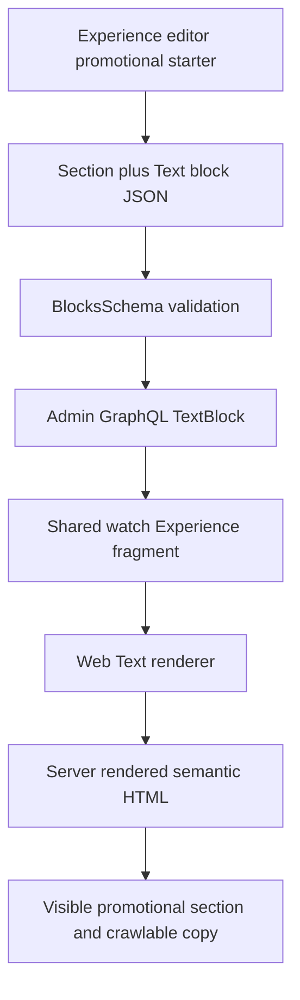

# feat: Add Promotional Markdown to Experience Text Blocks

## Summary

Extend the existing Experience `TextBlock` with an editor-discoverable
promotional Markdown variant. Web will render the authored Markdown as
server-rendered semantic HTML in a cinematic, responsive section that fits the
Watch home visual system and gives search engines substantial crawlable copy.

---

## Problem Frame

The live `/watch` page is visually rich but exposes little descriptive copy
outside its static mission promo. Admin already models a top-level and nested
`TextBlock` with a heading, subtitle, paragraph array, and three presentation
variants, so a new block discriminator is unnecessary. The missing capability
is a discoverable long-form authoring mode and a promotional Web treatment that
can carry headings, paragraphs, lists, emphasis, and links without allowing
arbitrary HTML.

The existing `WatchHomePromo` and the seeded `section` + `text` + `infoBlocks`
composition establish the design reference. The new variant should reuse the
current Experience contract and rendering pipeline rather than preserve another
static Web-owned section.

---

## Requirements

**Authoring and contract**

- R1. Admin exposes a clearly named promotional-story starter that creates an
  ordinary `SectionBlock` composition containing a `TextBlock`; no new
  Experience block discriminator is introduced.
- R2. The promotional variant accepts multiline Markdown through the Experience
  editor while preserving existing `contentParagraphs` data and default, lead,
  and small editing behavior.
- R3. The shared Admin GraphQL contract exposes `promotional` as a valid
  `TextVariant`, with regenerated SDL and gql.tada introspection artifacts.

**Web rendering and safety**

- R4. Web renders promotional Markdown into semantic server-rendered HTML with
  styled headings, paragraphs, lists, blockquotes, emphasis, and links.
- R5. Authored raw HTML is not executed or injected; unsupported HTML remains
  inert text, unsafe link protocols remain non-navigable, and no
  `dangerouslySetInnerHTML` path is added.
- R6. The new section follows the current Watch home typography, spacing,
  dark/mission color treatment, and content width while remaining readable at
  mobile and desktop breakpoints.

**Compatibility and performance**

- R7. Existing Text blocks render unchanged, and consumers that still read
  `contentParagraphs` continue receiving the same field shape.
- R8. The promotional section remains server rendered and does not add a client
  component or initialization work to the Watch home loading path.

---

## Key Technical Decisions

- **Extend `TextBlock`, do not add raw HTML or a new block type:** the existing
  block is already valid at the top level and inside sections. A new
  `promotional` variant keeps authoring, GraphQL, embeddings, and consumer
  dispatch on the established contract.
- **Store Markdown in `contentParagraphs`:** the editor will preserve Markdown
  blocks in the existing string array and Web will join them with blank lines
  before rendering. This avoids a second source of truth and keeps older
  consumers on a non-empty field even when they do not apply Markdown styling.
- **Use `react-markdown` without raw-HTML plugins:** Web already depends on and
  uses this renderer for related-question answers. Its default behavior keeps
  embedded HTML inert while producing semantic React elements for supported
  Markdown.
- **Make the promotional starter a composition of normal blocks:** the block
  picker can advertise a design-rich authoring option without widening the
  runtime union. The starter returns a mission-toned `SectionBlock` containing
  a promotional `TextBlock`, matching the existing Watch mission-promo pattern.
- **Keep the treatment server-only:** `Section.tsx` continues to own the
  background and texture while `Text.tsx` owns the responsive editorial layout
  and typography. Neither branch adds JavaScript animation or hydration cost.

---

## High-Level Technical Design

The `contentParagraphs` array remains the persisted and cross-consumer text
field. Only the `promotional` presentation branch interprets its joined value as
Markdown on Web; the legacy branches retain their current paragraph mapping.

---

## Scope Boundaries

### In Scope

- Admin schema, editor starter, Markdown editing behavior, and focused tests.
- Admin SDL and `packages/admin-graphql` introspection regeneration.
- Web promotional rendering, safe Markdown component mapping, responsive design,
  and focused server-render tests.
- Local `/watch` browser proof at desktop and mobile widths, including a DOM
  assertion that authored prose is present in the initial page HTML.

### Deferred to Follow-Up Work

- Authoring the final search-targeted copy and publishing it into the production
  homepage Experience; the requested section remains editor-owned content.
- Markdown-aware native typography on general mobile and TV Experience pages;
  their Watch home adapters already skip non-rail promotional content.

### Out of Scope

- Arbitrary raw HTML, custom CSS, scripts, embeds, or CMS-authored JavaScript.
- Changes to Watch metadata, structured data, canonical URLs, sitemap behavior,
  or ranking guarantees.
- Replacing or removing the existing static mission promo during this change.

---

## Implementation Units

### U1. Extend the Admin Text Variant Contract

- **Goal:** Make `promotional` a schema-valid Text presentation and keep the
  generated GraphQL contract synchronized.
- **Requirements:** R3, R7.
- **Dependencies:** None.
- **Files:**
  - `apps/admin/src/domain/blocks.ts`
  - `apps/admin/src/domain/blocks.test.ts`
  - `apps/admin/src/graphql/types/blocks.ts`
  - `apps/admin/src/graphql/types/blocks.drift.test.ts`
  - `apps/admin/schema.graphql`
  - `packages/admin-graphql/src/admin-graphql-env.d.ts`
- **Approach:** Add `promotional` to the existing Zod and Pothos variant enums.
  Do not add fields or union members. Regenerate both committed contract
  artifacts through their owning packages.
- **Patterns to follow:** `TextBlockSchema`, `TextVariantEnum`, and the contract
  regeneration guidance in `packages/admin-graphql/CLAUDE.md`.
- **Test scenarios:**
  1. A Text block with `variant: "promotional"` and multiline Markdown strings
     validates successfully.
  2. Unknown Text variants remain rejected.
  3. The printed schema and gql.tada introspection both contain the new enum
     value without changing `ExperienceBlock` union membership.
- **Verification:** The Admin schema tests and generated-artifact drift checks
  pass, and the diff shows no hand edits to generated files.

### U2. Add Promotional Markdown Authoring to the Experience Editor

- **Goal:** Give editors a discoverable starter and a multiline Markdown input
  while keeping existing Text authoring unchanged.
- **Requirements:** R1, R2, R5, R7.
- **Dependencies:** U1.
- **Files:**
  - `apps/admin/src/app/dashboard/experiences/experience-editor/block-helpers.ts`
  - `apps/admin/src/app/dashboard/experiences/experience-editor/block-helpers.test.ts`
  - `apps/admin/src/app/dashboard/experiences/experience-editor.tsx`
  - `apps/admin/src/app/dashboard/experiences/experience-editor.test.tsx`
- **Approach:** Add a `promotionalText` library template that returns a normal
  mission-toned Section containing a Text block with the promotional variant.
  When that variant is selected, show a Markdown-labelled multiline editor and
  preserve blank-line-separated blocks inside `contentParagraphs`; continue
  using the existing one-paragraph-per-line control for legacy variants. Keep
  the starter copy clearly editable and avoid shipping search copy on the
  user's behalf.
- **Patterns to follow:** `BLOCK_LIBRARY`, `createTemplateBlock`,
  `normalizeEditorBlocks`, existing inline textarea helpers, and starter-schema
  tests.
- **Test scenarios:**
  1. The promotional starter is listed under Content and serializes to a
     `BlocksSchema`-valid Section containing a promotional Text block.
  2. Multiline Markdown containing a heading, two paragraphs, and a list
     survives editor serialization with blank-line structure intact.
  3. Switching or editing default, lead, and small Text variants retains their
     existing paragraph-splitting behavior.
  4. Empty optional Markdown input normalizes cleanly and does not introduce
     invalid keys.
- **Verification:** Editor unit tests prove the template and serialization
  contract, and the existing Experience editor suite remains green.

### U3. Render a Safe, Design-Rich Promotional Section on Web

- **Goal:** Turn promotional Text content into crawlable, responsive semantic
  HTML that belongs on the Watch home page.
- **Requirements:** R4, R5, R6, R7, R8.
- **Dependencies:** U1, U2.
- **Files:**
  - `apps/web/src/components/sections/Text.tsx`
  - `apps/web/src/components/sections/Text.test.tsx`
- **Approach:** Add a promotional render branch that joins
  `contentParagraphs`, passes the result to the existing `react-markdown`
  dependency, and maps semantic elements to the Watch design system. Present the
  subtitle and heading first, followed by the Markdown body; use a wide-screen
  editorial split and a single-column mobile stack with strong heading/body
  contrast. Keep the parent Section's mission-toned background and texture, and
  add only focus and hover transitions to links. Do not load raw-HTML support or
  convert the component to a client component.
- **Patterns to follow:** `WatchHomePromo`, `Section.tsx` background treatments,
  `WATCH_PAGE_CONTENT_CLASSES`, and the safe Markdown component mapping in
  `RelatedQuestions.tsx`.
- **Test scenarios:**
  1. Promotional content renders the authored heading, paragraphs, nested
     heading, list, emphasis, blockquote, and link as semantic elements.
  2. An authored HTML tag is not materialized as an executable or injected DOM
     element.
  3. Links with `javascript:` or unsafe data protocols do not receive a
     navigable unsafe URL, while relative and HTTPS links still render.
  4. Default, lead, and small variants preserve their current markup and class
     behavior.
  5. Empty promotional content does not create empty body chrome while a heading
     alone remains valid.
  6. Server-rendered output contains the authored copy without a client-only
     loading boundary.
- **Verification:** Focused Web tests pass. For browser smoke, insert the starter
  into the local homepage Experience through the Admin editor, confirm readable
  desktop/mobile composition, keyboard-visible links, and authored copy in the
  initial DOM, then restore the local Experience to its prior state.

---

## System-Wide Impact

The only shared wire-contract change is an additional enum value. The Text block
typename, fields, and persisted paragraph shape remain stable for Web, mobile,
TV, embeddings, and Experience AI. Web is the only consumer that adds rich
Markdown presentation in this scope; native Watch home adapters continue their
existing behavior of selecting media rails and skipping promotional blocks.

The promotional branch remains a server component. It adds no browser data
fetch, state, effects, or client bundle boundary, so Watch page initialization
and hydration behavior should remain unchanged.

---

## Risks and Mitigations

- **Markdown could become an HTML injection path:** use `react-markdown` without
  `rehype-raw`, retain its safe URL transformation for authored links, never use
  `dangerouslySetInnerHTML`, and test authored HTML plus unsafe protocols.
- **A new style could feel detached from Watch:** inherit Montserrat, content
  width, color vocabulary, overlay texture, and spacing from the existing
  mission promo and Section renderer; verify against the live page visually.
- **Editor serialization could destroy multiline syntax:** apply promotional
  parsing only to the new variant and test round-tripping of lists and blank
  lines.
- **Schema artifacts could drift:** regenerate both Admin SDL and
  `admin-graphql` introspection and include drift-sensitive checks before PR
  handoff.
- **More copy could affect below-fold rendering cost:** keep rendering static and
  server-side, add no media or JavaScript dependency, and compare local page
  loading behavior during browser verification.

---

## Sources and Research

- `apps/admin/src/domain/blocks.ts` already defines `TextBlockSchema` as a
  top-level, section-content, and container-content block.
- `apps/admin/src/app/dashboard/experiences/experience-editor.tsx` already
  exposes Text authoring and variant controls.
- `apps/admin/src/scripts/seed-watch-homepage-experience.ts` composes the current
  mission promo from ordinary Experience blocks.
- `apps/web/src/components/home/WatchHomePromo.tsx` is the requested visual and
  content-density reference.
- `apps/web/src/components/sections/RelatedQuestions.tsx` establishes the local
  safe `react-markdown` rendering pattern.
- `https://watch.jesusfilm.org/watch` confirms the current server-rendered page
  includes the static “The message doesn't change. The way people watch does.”
  section and otherwise emphasizes visual catalogue content.
