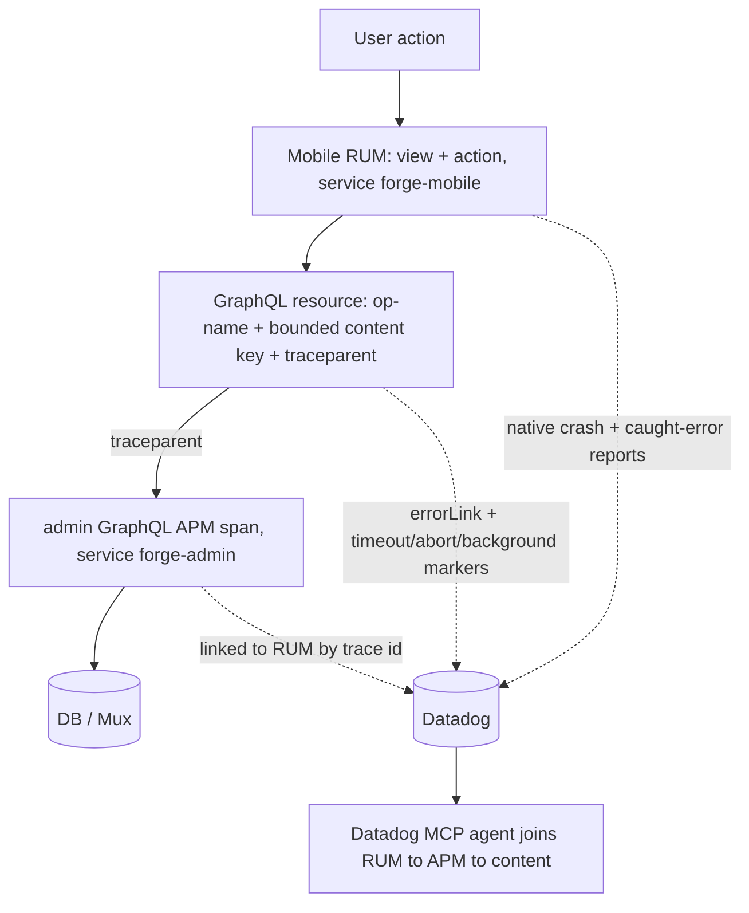
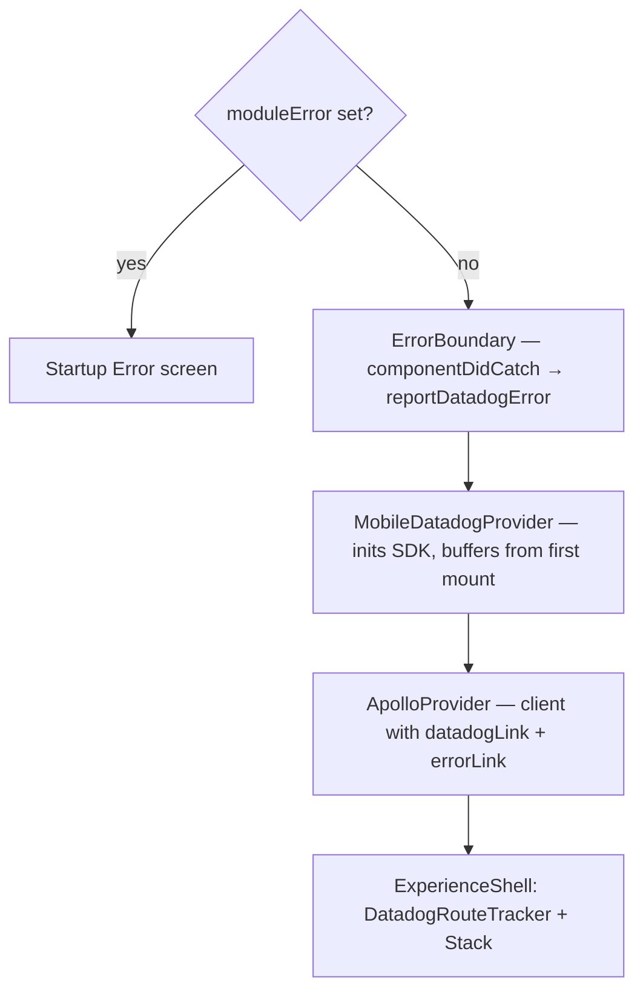

# Mobile Datadog Observability - Plan

## Goal Capsule

- **Objective:** Inject full Datadog observability into `apps/mobile` (iOS + Android) under `service:forge-mobile` so an engineer — and an AI agent via the Datadog MCP — can read the end-to-end trace (mobile RUM → admin GraphQL APM → DB) and diagnose bugs, bottlenecks, and optimization targets.
- **Authority hierarchy:** The Product Contract governs _what_; the Planning Contract governs _how_. On conflict, the Product Contract wins for scope/behavior. The TV app (`apps/tv`) is the reference blueprint — mirror it unless a mobile-specific reason (noted per unit) requires divergence.
- **Product authority:** Urim (owns mobile). Admin is not Urim's to edit — any admin-side finding is a handoff, never in-scope.
- **Product Contract preservation:** unchanged by this enrichment — R1–R43 and AE1–AE8 carry forward verbatim.
- **Execution profile:** parity-mirror first (foundation), then per-surface instrumentation. Pure helpers are unit-tested; catch/QoE seams get behavior tests asserting the emit fires on the degrade path; the native SDK addition needs a real-build smoke on **both** platforms (`newArchEnabled: true`, a divergence from TV's old architecture).
- **Stop conditions:** stop and surface if (a) the native SDK fails to build under the new architecture, (b) a cited instrumentation `file:line` no longer matches (the app moves fast — verify the symbol before editing), or (c) a change would require editing `apps/admin`.
- **Tail ownership:** the operational tail — prod credential provisioning, the `service:forge-mobile` monitor, hardware-session verification, a true reachability sensor, dashboards — is a deferred fast-follow, NOT this plan's Definition of Done.
- **Open blockers:** None. The per-request end-to-end trace works with no admin change (admin APM is already live). Server-side session slicing is deferred (see Scope Boundaries).

---

## Product Contract

### Summary

Lift the TV app's Datadog structure to `service:forge-mobile` — RUM + Logs + native crash, route-named views, GraphQL trace-linking, video QoE — then extend it for what mobile has and TV doesn't: Session Replay, a downloads/offline pipeline, cold-start performance, and a rich content journey. The load-bearing insight from grounding: this app is engineered to degrade gracefully, so it emits almost nothing on its own — the plan's center of gravity is instrumenting the _caught_ failure, and adding the correlation keys and honesty dimensions that make the end-to-end trace actually diagnosable rather than misleading.

### Problem Frame

Mobile has zero telemetry today — no Datadog dependency, and a `logWatchHomeFallback.ts` comment that literally reads _"No mobile telemetry sink yet, so `console.warn` for now."_ When a user reports "downloads disappeared," "the app won't open," "captions are missing," or "playback froze," there is no signal to look at.

Two properties of this specific codebase make naive RUM adoption insufficient. First, it swallows failure by design: GraphQL errors arrive inside HTTP 200 bodies, player and storage errors die in empty `catch` blocks, and timeout budgets abort silently — so RUM's automatic error/crash capture (which assumes exceptions escape) would see a healthy app while users suffer. Second, several obvious signals actively mislead: a single home-ready timing collapses a ~50ms disk-snapshot paint with a multi-second network paint; offline playback pollutes the streaming QoE aggregate; and a client that aborts a request at 15s leaves an orphaned admin span that completed at 18s, so the agent joining RUM→APM cannot tell "admin is slow" from "client gave up." The goal is an agent that reads the _entire_ trace — that only works if the trace is complete, joinable to specific content, and honest about where time actually went.

### Key Decisions

- **Lift TV's blueprint, don't re-architect.** Reuse TV's shape — pure helpers module, provider mounted below the root `ErrorBoundary`, a route tracker, and a header-attribution `ApolloLink` — under `service:forge-mobile`. Skip the tvOS WebView patch (tvOS-only) and add Session Replay (which tvOS can't run).
- **Instrument the catch, not the throw.** The app degrades gracefully at every seam, so automatic capture is nearly blind. Every swallow/degrade point — GraphQL 200-errors, timeout aborts, empty player/storage catches, the caught module-init boot failure — gets an explicit report. This is the difference between "RUM is installed" and "the agent can actually see failures."
- **Correlation keys are first-class.** The "entire trace" goal needs a bounded content key on each request, plus markers distinguishing a client timeout-abort, a client give-up, and a background-crossing request from a true network or server fault. Without these the agent is actively misled by contradictory RUM/APM durations.
- **Metric honesty over convenient numbers.** Signals must not lie: the home timing is dimensioned by paint source, failed/retried loads are recorded (not just fast successes), offline QoE is separated from streaming, and a JS time-to-interactive metric captures the Hermes stall that native app-start reports as "fast."
- **Rich data posture over TV's PII-free stance.** The app is anonymous (no login), so raw search terms and content titles are logged for diagnostic value; correlation keys stay bounded and non-PII. Session Replay masks inputs, but that does not protect the search term — it is logged deliberately.
- **Start rich, dial on data.** 100% session sampling in every environment — mobile is early and bug-hunting, and because crashes and traces ride _inside_ sampled sessions, web's 50% would silently drop half of them; the env-var knob makes 100% safe to trim toward web's 50% once mobile's volume and cost are known. Session Replay 100% on dev/preview and ~20% in production, all rates as per-EAS-environment env vars so production trims without a code change.

### Signal fan-out

Every mobile signal must land in Datadog such that the MCP agent can walk one user action from the tap to the DB row and back:

### Requirements

**Foundation and activation**

- R1. Add `@datadog/mobile-react-native` and enable Mobile RUM + Logs + native crash under `service:forge-mobile`, mirroring TV's structure (pure, unit-testable helpers module plus a provider mounted below the root `ErrorBoundary`).
- R2. Initialization is opt-in and no-ops unless both the client token and application id are present, so an unprovisioned build boots normally.
- R3. Ship on both iOS and Android and confirm a clean native build on each; do not carry over the tvOS WebView patch (it is tvOS-only and not needed here).
- R4. Provision credentials per EAS environment (development, preview, production) with the `env` tag set correctly — a preview release build must not tag sessions as `production`.
- R5. Session sampling is 100% in every environment; Session Replay is 100% on dev/preview and ~20% in production; both rates are per-environment env vars changeable without a code change.
- R6. dSYM and Hermes source-map upload is a secret-gated EAS build hook (mirroring TV), never the `expo-datadog` config plugin.
- R7. Route existing `console.warn`-only telemetry (starting with the watch-home fallback) through the Datadog sink.

**End-to-end trace integrity**

- R8. Set `firstPartyHosts` to the admin GraphQL host with trace-context propagation so mobile RUM resources stitch into admin's live APM spans.
- R9. Attach the GraphQL operation name and type to every request via an `ApolloLink` that spread-merges headers and must not clobber the Search bearer.
- R10. Attach a bounded content correlation key (e.g. slug or coreId) as a mobile-side RUM resource attribute so a slow span joins to the specific content via its trace id — without emitting raw query variables, locale strings, or other high-cardinality/PII values, and without an admin change.
- R11. Verify the per-request RUM↔APM trace linkage end-to-end (a mobile tap's trace id resolves to its `service:forge-admin` span), which `firstPartyHosts` provides with no admin change and no session-id span tag.
- R12. Distinguish client-side outcomes with explicit markers: a resource cut by a timeout budget, a client give-up (a promise-race deadline where the underlying fetch still completes), and a request that crossed a foreground/background transition each carry an attribute separating them from a genuine network failure or a slow server.

**Silent-failure surfacing (instrument the caught path)**

- R13. Surface GraphQL failures returned inside HTTP 200 (unauthenticated, rate-limited, service-unavailable, partial `errors[]`) via an Apollo error link keyed by operation name + error code — for every operation, not just Search.
- R14. Emit an event whenever a client timeout/abort budget fires (which budget, elapsed) across the Apollo fetch, the Experience fetch, download URL re-resolution, subtitle fetch, and the sidecar download.
- R15. Report the caught module-init boot failure (the `require()`-wrapped Startup Error screen) with its message/stack — neither the RUM crash path nor the React `ErrorBoundary` observes it.
- R16. Report swallowed player errors (resume-after-background `play()`, `replaceAsync` fallback) that currently die in empty `catch` blocks.
- R17. Emit a sampled failure event for swallowed AsyncStorage read/write errors, keyed by which store (downloads manifest, home snapshot, preferences) — the "my downloads/settings disappeared" class.
- R18. Emit failure events for silent content-quality losses: subtitle/VTT load-or-parse failure, per-dub language resolution failure or empty-dub result, and expo-image poster/thumbnail load failure (keyed by host).

**Cold-start and lifecycle performance**

- R19. Capture native cold/warm app-start and foreground/background transitions.
- R20. Add a JS time-to-interactive timing spanning first-native-frame to first-interactive paint — the Hermes-thread stall RN has no Long Task API for — so low-end-Android time-to-interactive is visible rather than hidden behind a "fast" native app-start.
- R21. Dimension the home-ready timing by paint source (disk snapshot vs network) so an instant snapshot paint never masks the multi-second admin TTFB users wait on for fresh content.
- R22. Record home-load timing on failure and retry paths, not only successful paints, so slow/retried loads are not excluded from the latency distribution.
- R23. Instrument the flagged Apollo cache-restore gate on the cold-start critical path (hit/miss/timeout + duration) and the home-snapshot hit-rate and corruption-drop rate.

**Downloads and offline**

- R24. Emit download start/progress/complete/fail with a content key and a disambiguated error class.
- R25. Disambiguate the shared cancel code (`-999`) — user cancel vs a wifi-only/config-toggle mass-cancel vs a genuine network drop — and causally group a reachability/config event with the burst of cancels it triggers.
- R26. Persist a per-attempt correlation id so a background or next-launch terminal event links back to the initiating session and its real completion time (not relaunch wall-clock).
- R27. Emit reconciliation action tallies per cold start (drop / requeue / repair / orphan-cleanup) — the diagnostic for "downloads lost, stuck, or duplicated after relaunch."
- R28. Emit download media-URL re-resolution failures — the pre-transfer step whose null result makes a download "stuck queued / never starts."
- R29. Emit insufficient-storage refusals with free-disk context, including when the free-disk API reads 0 and the pre-flight gate self-disables.
- R30. Emit series batch-pump terminal dispositions (episode dropped, swap reverted, failure resurfaced, occupancy-slot release) — the diagnostic for "download-all stopped at N of M."
- R31. Record online↔offline reachability transitions.

**Content journey and search**

- R32. Record a rich content-journey action taxonomy: card/shelf tap (content id + title), language change (including its failure or empty-dub result), deep-link open, and detail-route resolution outcome (not-found / series-redirect / seed-only degraded paint).
- R33. Log each search with the raw query term plus outcome, result count, latency, and request id.
- R34. The search outcome distinguishes a rate-limit or auth rejection from a legitimate zero-result. Mobile searches over GraphQL, so admin surfaces both as an error inside an HTTP-200 body (keyed like R13), not a 429 — these reject before the resolver span, so the search log carries the GraphQL error code.
- R35. Record search prefetch cap saturation and warm-cache hit-rate on navigation (a perceived-latency signal distinct from the search log and detail-fetch timing).

**Video playback health**

- R36. Emit managed-player video QoE mirroring TV — TTFF, a rebuffer/error/watched summary, and sanitized playback errors (content id only) — via `useManagedVideoPlayer`.
- R37. Instrument the home hero player separately (it is a distinct expo-video instance the managed-player QoE excludes) and record hero-slide stream-resolution failures where a curated slide is silently dropped.
- R38. Dimension video QoE by `source=offline|network` so downloaded-file playback never pollutes the streaming aggregate, and "no admin span" is unambiguous between offline-by-design and an instrumentation gap.
- R39. Add a playhead-progress watchdog detecting "state=playing but position not advancing" (black-frame / stuck-at-0:00) — the most-reported playback bug, which reports healthy across QoE, TTFF, and errors, and which Session Replay cannot capture because a native VideoView renders as a masked box.

**Session Replay and data posture**

- R40. Enable Session Replay with masked text inputs, sampled per R5.
- R41. Treat Session Replay as non-substitutable for structured signals — it cannot capture native video, and at 20% production sampling it misses most sessions; the watchdog (R39) and caught-error reports (R13–R18) carry the diagnostic load.
- R42. Adopt the rich data posture: raw search terms and content titles are logged and live in Datadog (input masking does not protect the term, by design); correlation keys stay bounded and non-PII.
- R43. Commit to a defined retention/deletion window for raw-logged search terms and content titles, and an explicit re-identification assessment of that free text against the RUM session/device/IP metadata and Session Replay that accompany it — "anonymous" (no login) does not by itself make the data non-re-identifiable, and search terms in a ministry app can reveal religious interest.

### Acceptance Examples

- AE1. Home snapshot vs network paint. **Covers R21, R22.** **Given** a returning user with a disk snapshot, **when** Home paints the snapshot in ~50ms and the live fetch lands seconds later, **then** the timing distinguishes snapshot-paint from network-paint so the agent sees the real admin TTFB, not a ~50ms p50.
- AE2. Client gives up before the server does. **Covers R12, R22.** **Given** the Experience fetch races an 8s deadline while Apollo completes at 12s, **when** the app degrades to the fallback body, **then** the signals do not report a healthy 12s success — the client give-up is marked and the degraded outcome is recorded.
- AE3. Client ceiling shorter than server latency. **Covers R12.** **Given** the client aborts a GraphQL fetch at 15s and admin completes it at 18s, **when** the agent reads the RUM↔APM duration mismatch, **then** the mobile resource is marked client-timeout-abort, distinct from a network failure, so the orphaned server span is explained.
- AE4. Low-end Android Hermes stall. **Covers R20.** **Given** native first-frame is fast but the JS provider chain + cache restore + snapshot parse stall the thread ~2–3s, **when** the agent inspects time-to-interactive, **then** the JS-TTI timing shows the multi-second stall that native app-start hides.
- AE5. Joining a slow span to its content. **Covers R10, R11.** **Given** `GetVideoBySlug` is slow at p99, **when** the agent inspects the admin span, **then** its trace id resolves to the mobile RUM resource whose bounded content key identifies exactly which slug — no raw variables on the span.
- AE6. Background series download completes while the app is dead. **Covers R26.** **Given** episodes finish or fail via background URLSession after the app is closed, **when** terminal events surface at next launch, **then** each links back to the initiating session and its true completion time, and app-dead failures are not silently undercounted.
- AE7. Healthy-looking playback stall. **Covers R39.** **Given** the player reports `playing:true` but the playhead never advances (black frame / stuck at 0:00), **when** QoE, TTFF, and errors all report healthy, **then** the playhead watchdog fires so the bug is visible.
- AE8. wifi-only toggle mass-cancel. **Covers R25.** **Given** toggling wifi-only tears down the shared URLSession and cancels 8 in-flight downloads as `-999`, **when** the agent inspects the burst, **then** it is causally grouped to the reachability/config event and distinguished from a user cancel or flaky network.

### Success Criteria

- Real iOS and Android sessions appear under `service:forge-mobile` across development, preview, and production, and are queryable by the Datadog MCP.
- A mobile tap's trace resolves through `service:forge-admin` APM to the DB and is joinable to the specific content and mobile session.
- Each Acceptance Example above is diagnosable from Datadog alone, with no signal contradicting another.
- No signal lies: the home timing separates paint source, failed loads are recorded, offline QoE is separable from streaming, and JS-TTI is distinct from native app-start.

### Scope Boundaries

**Deferred for later**

- Direct server-side slicing of admin spans by mobile session (a session-id span tag on `forge-admin`). The RUM↔APM trace-id linkage already connects a session's activity to its server spans, so this is a convenience-query enhancement — and the only piece that would reach into admin, which Urim doesn't own. TV never did it either.
- A full Hermes JS profiler (e.g. `react-native-release-profiler`) for deep client-render root-cause — the JS-TTI timing (R20) is a lightweight marker, not a profiler, and TV deferred the profiler for the same reason.
- Datadog dashboards, monitors, and intake alerts beyond what verifies the signals exist (an operational fast-follow, as on TV).

**Outside this effort**

- Any admin/backend instrumentation change. v1 requires none — admin APM is already complete and reads the existing `traceparent`. Admin consuming a mobile correlation key to tag its own spans is the deferred server-side-slicing enhancement above, not boundary work here; admin is not Urim's to edit regardless (surface as a handoff).
- `setUser` / user-identity PII — mobile is anonymous with no login.

### Dependencies / Assumptions

- **Admin APM is live** (feat-204 complete; `dd-trace` 5.109.0 + `apps/admin/src/observability/datadog.ts`). Mobile→admin trace-linking completes once mobile sets `firstPartyHosts` — no new backend work, and no admin change is required for v1.
- **Mobile already runs a custom dev client** — it depends on native modules (`react-native-background-downloader`) and ships a config plugin (`plugins/withBackgroundDownloaderAppDelegate.js`); `apps/mobile/ios/` and `apps/mobile/android/` are gitignored / prebuild-generated (NOT committed), so adding the Datadog native module means regenerating the prebuild + `pod install` for a local dev-client build (U3). `.prettierignore` already excludes those native dirs.
- **`expo-datadog` config plugin stays excluded** — it hard-fails without `DATADOG_API_KEY` even in Debug and assumes a hoisted (non-pnpm) layout; mirror TV's key-gated EAS hook.
- **Rate-limit bucketing:** admin buckets the scoped Search bearer per install via `x-viewer-id` (`consumer:<key>:v:<viewer_id>`, falling back to per-IP), so a rate-limit burst is a per-device rate/config signal — hence R34 surfaces the GraphQL error code.

### Outstanding Questions

All product decisions are resolved; the following are settled during planning.

**Resolve before U4 starts**

- Whether `@datadog/mobile-react-native@3.5.2` exposes a RUM `resourceEventMapper` (or requires manual `DdRum.startResource`) that can attach the bounded content key to the GraphQL RUM resource, and how the per-request key reaches it — a constant-URL GraphQL POST can't be keyed by URL alone, so a short-lived op-name→key side-channel is the likely path. This is the mechanism for R10's resource attribute; an Apollo header does not reach the RUM resource.

**Deferred to planning**

- The exact bounded content-key shape (slug vs coreId) and how to cap its cardinality.
- Whether raw search terms need any scrub/allowlist — the rich raw-term posture is accepted, and hashing is rejected because it would break "result_count=0 for query X."
- The playhead-watchdog stall threshold and how it is sampled.
- The JS time-to-interactive measurement mechanism given RN/Hermes has no Long Task API.
- The mechanism that causally groups a reachability/config event with the resulting `-999` cancel burst (R25).

### Sources / Research

- **TV blueprint:** `apps/tv/src/lib/datadog.ts`, `apps/tv/src/components/DatadogRum.tsx`, `apps/tv/src/components/DatadogRouteTracker.tsx`, `apps/tv/src/lib/apolloClient.ts`; `apps/tv/CLAUDE.md` (Observability); `docs/observability/datadog.md`.
- **Web reference:** `apps/web/src/components/DatadogRum.tsx` (50% / 10%-replay / masked, in production), `apps/web/src/observability/datadog.ts`.
- **Admin APM:** `apps/admin/src/observability/datadog.ts`; `docs/roadmap/platform/feat-204-admin-datadog-graphql-tracing.md` (complete).
- **TV Datadog learnings (read before the matching unit):** `docs/solutions/integration-issues/datadog-mobile-rum-tvos-integration.md` (native/pnpm/prebuild, expo-datadog exclusion), `docs/solutions/integration-issues/datadog-rn-source-map-upload-eas-hook.md` (`DD_SITE` domain-vs-enum, nounset-slice EAS-build killer, `release-version`=SDK-version, verify-at-source), `docs/solutions/best-practices/datadog-tvos-observability-pipeline-qoe-and-guardrails.md` (QoE token-guard, hook containment, search namespacing, MCP denylist), `docs/solutions/best-practices/datadog-rum-deep-instrumentation-semantics.md` (view identity, addTiming latch, `dd-action-name` privacy, preview-env mistag, plaintext EAS visibility).
- **Mobile surfaces to instrument:** `apps/mobile/src/lib/apolloClient.ts`, `apps/mobile/src/lib/authHeaders.ts`, `apps/mobile/src/contexts/DownloadsProvider.tsx`, `apps/mobile/src/lib/downloadLifecycle.ts`, `apps/mobile/src/lib/downloadReconciliation.ts`, `apps/mobile/src/hooks/useWatchHome.ts`, `apps/mobile/src/hooks/useManagedVideoPlayer.ts`, `apps/mobile/src/components/home/HomeHeroPager.tsx`, `apps/mobile/src/hooks/useHeroStream.ts`, `apps/mobile/src/components/watch/SubtitleOverlay.tsx`, `apps/mobile/src/lib/orientation.ts`, `apps/mobile/app/_layout.tsx`, `apps/mobile/app/watch/[slug].tsx`, `apps/mobile/src/lib/watchHome/logWatchHomeFallback.ts`.
- **Roadmap siblings:** TV Datadog feat-225/226/227/228; web feat-182/215.

---

## Planning Contract

### Key Technical Decisions

- KTD1. **Lift TV's structure file-for-file.** Port `apps/tv/src/lib/datadog.ts`, `src/components/DatadogRum.tsx`, `src/components/DatadogRouteTracker.tsx`, and `src/lib/videoQoe.ts` into the parallel `apps/mobile` paths, changing only `DATADOG_SERVICE` to `forge-mobile`; modify `apps/mobile/src/lib/apolloClient.ts`, `src/env.ts`, `app/_layout.tsx`, and `package.json`. The TV helpers are framework-free and expo-router segments are identical, so `resolveViewName` and the pure accumulators port verbatim. The root `patchedDependencies` entry for `@datadog/mobile-react-native@3.5.2` applies to mobile automatically (pnpm keys patches by package@version workspace-wide) and its tvOS-only WebView guards are inert on iOS/Android — so R3's "do not carry over" means the patch simply isn't needed, not that mobile must opt out; there is nothing to add or exclude. (R1, R3)
- KTD2. **Opt-in, no-op when unprovisioned, via `.optional()` env vars.** All seven `EXPO_PUBLIC_DATADOG_*` vars are `z.string().optional()` in **both** `client{}` and `runtimeEnvStrict{}` in `src/env.ts` — the five TV creds/config vars plus `EXPO_PUBLIC_DATADOG_SESSION_SAMPLE_RATE` and `EXPO_PUBLIC_DATADOG_REPLAY_SAMPLE_RATE` (R5's per-environment tunability: TV hardcodes `sessionSampleRate: 100` and has no replay var, so `getDatadogRumConfig` diverges to read the rate from env) — with module-scope `_inlined` reads (Metro reliably inlines `EXPO_PUBLIC_*` only at module scope). The `datadog.ts` null-gate skips all telemetry when creds are absent, so an unprovisioned build boots normally — this honors the repo's opt-in-scaffolding law (required env vars with no default brick EAS/Railway deploys). (R2, R5)
- KTD3. **A NEW `forge-mobile` Datadog RUM application.** Do not reuse `forge-tv`'s `applicationId`. The client token is public and ships in the bundle; `DATADOG_API_KEY` is a build-time EAS **secret** — never `EXPO_PUBLIC_*`, or it inlines into the JS bundle. (R4, R6)
- KTD4. **Instrument the caught path; never the unmount noise.** Emit at degrade/swallow points (a new Apollo `onError` link, timeout-budget aborts, storage/subtitle/dub catches, the module-init `moduleError`). In `useManagedVideoPlayer`, emit the `replaceAsync`→`replace` swap failures (`:64-74`) AND the resume-after-background `play()` failures (`:56-59`, `:97-100`, guarded to fire only on a genuine resume failure — R16's named site); do NOT emit in the unmount pause catches (`:106-110`, `:118-122`), which fire on every unmount and would flood the signal. (R13–R18, R36)
- KTD5. **Trace correlation is mobile-side only, via a RUM resource attribute — not an Apollo header.** An `ApolloLink` header does not reach the RUM resource: the SDK maps only its own recognized GraphQL op-name/type headers, and admin ignores unknown ones. So the bounded content key attaches through a RUM `resourceEventMapper` in the provider config (U2), fed a short-lived op-name→key map — `slug` for `videoBySlug`, `coreIds` for `watchHomeVideos`, and the bounded `search_request_id` (from U9, never the raw `q` term) for search. The `datadogLink` (U4) still stamps the op-name/type headers TV relies on, and `firstPartyHosts` (from `getGraphQLUrl()`) carries the W3C `traceparent` so admin's live `dd-trace` continues the trace. No admin change. Distinct markers separate the `fetchWithTimeout` timeout-abort, a client give-up (a promise-race deadline where the fetch still completes, in `useWatchHome`), and a background-crossing request from a true network or server fault. (R8–R12)
- KTD6. **Reachability derived from download classification, not a new sensor.** Mobile has no `netinfo` dependency. R31/R25 reuse `downloadOutcome.classifyInterruption`'s connectivity/backgrounded→paused mapping as the connectivity proxy, and instrument the raw native `errorCode` at `downloadErrors.mapNativeError:24` plus the `hasBegun/paused` disambiguation at `downloadLifecycle` onInterruption (`:410-416`) so a URLSession-teardown `-999` storm is separable from a user cancel. This proxy only observes connectivity during an active download, so v1 R31 covers download-interruption-derived transitions; a general idle online↔offline signal awaits the deferred `@react-native-community/netinfo` sensor.
- KTD7. **Session Replay is net-new (no TV precedent).** Add `@datadog/mobile-react-native-session-replay@3.5.2` (pinned to the core SDK); enable in the provider config with `MASK`/`MASK_USER_INPUT`; mask the search `TextInput` (`watch.tsx:388`, the only free-text surface) and set a privacy override on the `VideoView` decoder surface. Sampled per R5. (R40–R43)
- KTD8. **Source-map upload via the key-gated EAS hook, not `expo-datadog`.** Port `eas-build-on-success.sh` + `eas-build-pre-install.sh` (change `--service` to `forge-mobile`); the hook `exit 0`s without `DATADOG_API_KEY`. **Implement the Android** mapping + Hermes source-map upload branch (TV stubs it) since mobile ships Android first-class. Never enable the `expo-datadog` config plugin (hard-fails without the key; assumes hoisted node_modules — broken under pnpm). (R6)
- KTD9. **Playhead-stall watchdog is a net-new sensor.** No stall detector exists (the `statusChange` listener was deliberately dropped, `VideoPlayer.tsx:90-91`). Add a `currentTime`-progress poll in `useManagedVideoPlayer` that emits `video_playback.stall` when the position does not advance while `isPlaying` **and the player is not buffering** — gate on the expo-video status / `bufferedPosition` so a legitimate rebuffer (which also freezes `currentTime` with `playing:true`) does not trip a false stall. This is the only way to catch the black-frame/stuck-at-0:00 bug that reports healthy across QoE, TTFF, and errors. (R39)
- KTD10. **`trackInteractions: true` needs an action-name privacy + de-dup pass (TV's P0 lesson).** The ported config auto-fires a tap action on every press and names it from the element's `accessibilityLabel` — so the search `TextInput`, keyboard keys, and content-title labels would leak raw/typed text into RUM action names (uncontrolled, unlike the deliberately-logged search term). Keep `trackInteractions: true` but add stable low-cardinality `dd-action-name` overrides (`home-card`, `hero-card`, `search-result`, `keyboard-key`, `recent-search`) threaded as an **explicit typed prop** through wrapper Pressables like `HomeCard` — a naive `{...{'dd-action-name':…}}` spread on a wrapper silently no-ops (two TV reviewers flagged this at P0). And do NOT add a manual `addAction` for a tap `trackInteractions` already captures (it double-counts); keep only supplemental actions carrying join context the auto tap can't, e.g. `watch_search.result_clicked` with `search_request_id`. (R32, R42, R43)

### Provider mount topology

The mount order is load-bearing: `ErrorBoundary` is outermost so its `componentDidCatch` can call `reportDatadogError` (the SDK is already up, inited by the provider beneath it); a provider-config-construction throw is caught by that same boundary. This mirrors TV's "provider below the root ErrorBoundary." All of it sits below the `moduleError` early-return guard so a module-init throw still renders the Startup Error screen.

### Assumptions

- The cited instrumentation `file:line` anchors are current as of 2026-07-14; the mobile app moves fast, so each unit's implementer verifies the named symbol still exists before editing (a stop condition, not a silent guess).
- Admin APM retains the linked span for each RUM resource (no aggressive upstream trace-sampling) at current volume — fine now; re-verify when mobile production traffic scales (review residual).
- Mobile session volume for cost sizing is unknown; 100% production session sampling is safe because every rate is an env var tunable toward web's 50% without a rebuild (R5).
- `newArchEnabled: true` on mobile (TV runs the old architecture) is the one config divergence that could break the native SDK build — proven by the U3 smoke, not assumed.

### Sequencing

Foundation (U1–U3) lands first; every other unit depends on the provider + `datadog.ts` + a build that includes the SDK. After foundation, units are independent **except where they share a source file** — those must land sequentially to avoid merge churn: U5 follows U4 (both edit `apolloClient.ts`); U6 is the shared-file hub (it edits `useWatchHome.ts`, `DownloadsProvider.tsx`, `useManagedVideoPlayer.ts`, `WatchSessionProvider.tsx`, `cachePersistence.ts`, `app/_layout.tsx`), so it lands before U7/U8/U9/U10; and U9 and U10 land before U11 (which re-edits `watch.tsx` and `VideoPlayer.tsx`). The source-map hook (U3) can land anytime after the SDK dependency. Session Replay (U11) is last because it is the least-precedented and its masking decisions want the surfaces already instrumented.

---

## Implementation Units

| U-ID | Unit                                                      | Key files                                                                                                                                                                                                                                                                                                                   | Depends on |
| ---- | --------------------------------------------------------- | --------------------------------------------------------------------------------------------------------------------------------------------------------------------------------------------------------------------------------------------------------------------------------------------------------------------------- | ---------- |
| U1   | Datadog SDK + pure helpers + env schema                   | `src/lib/datadog.ts`, `src/env.ts`, `package.json`, `src/lib/videoQoe.ts`                                                                                                                                                                                                                                                   | —          |
| U2   | Provider, route tracker, mount, fallback-log sink         | `src/components/DatadogRum.tsx`, `src/components/DatadogRouteTracker.tsx`, `app/_layout.tsx`, `src/lib/watchHome/logWatchHomeFallback.ts`                                                                                                                                                                                   | U1         |
| U3   | Native build + EAS env + source-map hooks (iOS + Android) | `scripts/eas-build-on-success.sh`, `scripts/eas-build-pre-install.sh`, `app.json`, `package.json`                                                                                                                                                                                                                           | U1         |
| U4   | Apollo trace-integrity link                               | `src/lib/apolloClient.ts`                                                                                                                                                                                                                                                                                                   | U1         |
| U5   | Apollo errorLink for HTTP-200 GraphQL failures            | `src/lib/apolloClient.ts`                                                                                                                                                                                                                                                                                                   | U1, U4     |
| U6   | Caught-path surfacing                                     | `src/hooks/useWatchHome.ts`, `src/contexts/DownloadsProvider.tsx`, `src/components/watch/SubtitleOverlay.tsx`, `src/lib/offlineFileSystem.ts`, `app/_layout.tsx`, `src/hooks/useManagedVideoPlayer.ts`, `src/contexts/WatchPreferencesProvider.tsx`, `src/contexts/WatchSessionProvider.tsx`, `src/lib/cachePersistence.ts` | U1         |
| U7   | Cold-start & lifecycle timings                            | `app/_layout.tsx`, `src/hooks/useWatchHome.ts`, `src/lib/cachePersistence.ts`                                                                                                                                                                                                                                               | U1         |
| U8   | Downloads & offline telemetry                             | `src/lib/downloadLifecycle.ts`, `src/lib/downloadEngine.ts`, `src/lib/downloadErrors.ts`, `src/lib/downloadOutcome.ts`, `src/contexts/DownloadsProvider.tsx`                                                                                                                                                                | U1         |
| U9   | Content journey & search                                  | `app/(tabs)/watch.tsx`, `src/components/home/HomeCard.tsx`, `src/components/home/HomeScreen.tsx`, `src/contexts/WatchSessionProvider.tsx`, `app/watch/[slug].tsx`, `src/lib/watchSearchLog.ts`                                                                                                                              | U1         |
| U10  | Video QoE + hero + playhead watchdog                      | `src/hooks/useManagedVideoPlayer.ts`, `src/components/watch/VideoPlayer.tsx`, `src/components/home/HomeHeroPager.tsx`, `src/hooks/useHeroStream.ts`                                                                                                                                                                         | U1         |
| U11  | Session Replay + data governance                          | `package.json`, `src/lib/datadog.ts`, `src/components/DatadogRum.tsx`, `app/(tabs)/watch.tsx`, `src/components/watch/VideoPlayer.tsx`                                                                                                                                                                                       | U1, U2     |

> `Depends on` lists **code** dependencies. Units sharing a source file also serialize by file (see Sequencing): U5←U4; U6 before U7/U8/U9/U10; U9/U10 before U11.

### U1. Datadog SDK, pure helpers, and env schema

- **Goal:** Land the base SDK dependency and the framework-free helper layer so every other unit can call `reportDatadogError` / `datadogLog` / `startDatadogView` and the init is gated on provisioning.
- **Requirements:** R1, R2, R4.
- **Dependencies:** none.
- **Files:** `apps/mobile/src/lib/datadog.ts` (create), `apps/mobile/src/lib/datadog.test.ts` (create), `apps/mobile/src/lib/videoQoe.ts` (create), `apps/mobile/src/lib/videoQoe.test.ts` (create), `apps/mobile/src/env.ts` (modify), `apps/mobile/package.json` (modify).
- **Approach:** Port `apps/tv/src/lib/datadog.ts` wholesale; set `DATADOG_SERVICE = "forge-mobile"`; keep `getDatadogCredentials` (null unless both client token + applicationId), `getDatadogRumConfig` (site default `US1`, env default by `__DEV__`), `isDatadogProvisioned`, `safeDatadogCall`, `datadogGraphqlHeaders`, `startDatadogView`, `addDatadogTiming`, `createDatadogInitWatchdog`, `reportDatadogError`, `reportDatadogAction`, `datadogLog`. `firstPartyHosts` resolves via `getGraphQLUrl()` (mobile's `config.ts` abstracts the `EXPO_PUBLIC_ADMIN_GRAPHQL_URL` difference — no change). Rename or drop the TV `SERIES_FIRST_RAIL_READY_TIMING` constant. Port `videoQoe.ts` verbatim (pure accumulator). In `src/env.ts` add the seven `EXPO_PUBLIC_DATADOG_*` vars (five creds/config + `_SESSION_SAMPLE_RATE` + `_REPLAY_SAMPLE_RATE`) as `.optional()` in both `client{}` and `runtimeEnvStrict{}` plus module-scope `_inlined` reads, and wire `getDatadogRumConfig` to read `sessionSampleRate` from `EXPO_PUBLIC_DATADOG_SESSION_SAMPLE_RATE` (default 100) rather than TV's hardcoded 100. In `package.json` add `"@datadog/mobile-react-native": "3.5.2"` and add `@datadog` to the jest `transformIgnorePatterns` allowlist.
- **Patterns to follow:** `apps/tv/src/lib/datadog.ts`, `apps/tv/src/lib/videoQoe.ts`, `apps/tv/src/env.ts` (optional-var shape), `apps/tv/package.json` (jest allowlist ends with `|@datadog`).
- **Test scenarios:** `getDatadogCredentials` returns null when either var is absent, non-null when both present; `getDatadogRumConfig` defaults site to `US1` and env by `__DEV__`, and reads `sessionSampleRate` from `EXPO_PUBLIC_DATADOG_SESSION_SAMPLE_RATE` (default 100 when unset); `firstPartyHosts` contains the admin GraphQL host; `datadogGraphqlHeaders` produces the operation-name/type headers; `videoQoe` accumulator counts rebuffers (guarded by `shouldCountRebuffer`), records ttff, and `sanitizeVideoErrorMessage` strips the URL query and caps length; env validation still passes with all Datadog vars unset (boot-safety).
- **Verification:** `pnpm --filter @forge/mobile test` green including the new suites; `typecheck` clean; datadog-importing test transforms (allowlist works).

### U2. Provider, route tracker, mount, and fallback-log sink

- **Goal:** Mount the RUM provider so sessions, route-named views, native crash, and Logs flow, and route the existing `console.warn` telemetry gap through the sink.
- **Requirements:** R1, R7. (Route-named views ship here via `DatadogRouteTracker`; R19's native app-start / fg-bg substance is U7's.)
- **Dependencies:** U1.
- **Files:** `apps/mobile/src/components/DatadogRum.tsx` (create), `apps/mobile/src/components/DatadogRouteTracker.tsx` (create), `apps/mobile/app/_layout.tsx` (modify), `apps/mobile/src/lib/watchHome/logWatchHomeFallback.ts` (modify), `apps/mobile/src/components/DatadogRouteTracker.test.tsx` (create).
- **Approach:** Port `DatadogRum.tsx` (rename export to `MobileDatadogProvider`; keep the `DatadogProviderConfiguration` with an explicit **`logsConfiguration: {}`** — SDK v3 silently no-ops `DdLogs` without it, and the entire caught-path strategy (U5/U6/U8/U9) emits via `datadogLog` — plus `trackInteractions: true` (its action-name privacy is handled in U9 per KTD10), `nativeCrashReportEnabled`, `resourceTraceSampleRate: 100`, `firstPartyHosts`, `sessionSampleRate` from env, and the `__DEV__` init watchdog). Port `DatadogRouteTracker.tsx` verbatim. In `app/_layout.tsx`, add lazy `require()` bindings for the provider + tracker inside the existing try block (mirroring `apps/tv/app/_layout.tsx:22-38`); mount `<MobileDatadogProvider>` just inside the root `<ErrorBoundary>` and around `<ApolloProvider>` (see Provider mount topology — ErrorBoundary stays outermost so its `componentDidCatch` reports via `reportDatadogError`); place `<DatadogRouteTracker />` inside `ExperienceShell` just before `<Stack>`. Replace `logWatchHomeFallback.ts`'s `console.warn` (`:16-18`) with a `datadogLog.warn('watch_home_fallback', { reason })`.
- **Patterns to follow:** `apps/tv/src/components/DatadogRum.tsx`, `apps/tv/app/_layout.tsx:176,188` (mount + tracker placement), TV's `reportDatadogError` error-boundary call.
- **Test scenarios:** `DatadogRouteTracker` calls `startDatadogView` with `key=pathname`, `name=route-pattern` on path change and not on identical repaint; the tracker no-ops when `isDatadogProvisioned` is false; `logWatchHomeFallback` emits the Datadog log with the correct `reason` for null/error/empty. Behavior smoke: provider mount does not throw when unprovisioned (renders children).
- **Verification:** In the dev client with dev creds, a `service:forge-mobile` session appears with a route view named by pattern, AND a `datadogLog` emit lands in Datadog dev **Logs** (not only the RUM session — confirms `logsConfiguration` is set); unprovisioned build boots with the `[datadog] RUM disabled` warning and no crash.

### U3. Native build, EAS env provisioning, and source-map hooks

- **Goal:** Prove the native SDK compiles on both platforms under the new architecture and wire secret-gated symbol upload for iOS and Android.
- **Requirements:** R3, R4, R5, R6.
- **Dependencies:** U1.
- **Files:** `apps/mobile/scripts/eas-build-on-success.sh` (create), `apps/mobile/scripts/eas-build-pre-install.sh` (create), `apps/mobile/package.json` (modify — add the two `eas-build-*` scripts), `apps/mobile/app.json` (verify only), `apps/mobile/eas.json` (optional — pin `EXPO_PUBLIC_DATADOG_ENV=preview` on the preview profile).
- **Approach:** Adding the SDK regenerates the native projects — run `expo prebuild` (or `pod install` in `ios/`) before the local dev-client build, and clear DerivedData if a stale-Pods path error recurs. Port both build scripts; change `--service` to `forge-mobile`; keep the `no DATADOG_API_KEY → exit 0` gate, `set -uo pipefail` (never `-e`/`-x`, and default a var before slicing — a bare `${VAR:0:7}` under nounset prints "unbound variable" and fails the whole EAS build on the bash-5 worker, silently passing on macOS bash-3.2), key redaction, and `DD_SITE` default `datadoghq.com` (intake domain, not the `US1` enum). Implement the Android branch (Hermes bundle + mapping upload) rather than leaving TV's stub, passing `--release-version` equal to the value `getDatadogRumConfig` reports as the RUM `version` (the short git SHA from `EAS_BUILD_GIT_COMMIT_HASH`) — a mismatch uploads the map but never symbolicates (no Metro debug_id; Datadog matches by service+version+bundle+platform). Provision `EXPO_PUBLIC_DATADOG_CLIENT_TOKEN` + `EXPO_PUBLIC_DATADOG_APPLICATION_ID` (a NEW `forge-mobile` RUM app) as EAS Environment vars per profile with **plaintext** visibility (the `secret` tier is never inlined into the bundle); `DATADOG_API_KEY` is the only build **secret**. Do not add the `expo-datadog` config plugin. Verify the SDK autolinks and builds under `newArchEnabled: true`.
- **Execution note:** This is mostly packaging/config — prefer a real dev-client build + boot smoke over unit coverage.
- **Patterns to follow:** `apps/tv/scripts/eas-build-on-success.sh`, `apps/tv/scripts/eas-build-pre-install.sh`; `docs/solutions/integration-issues/datadog-mobile-rum-tvos-integration.md` and the RN source-map EAS-hook solution doc.
- **Test scenarios:** `Test expectation: none — packaging/config; proven by the build smoke.`
- **Verification:** iOS **and** Android dev-client builds succeed under `newArchEnabled: true` with no red-box; the on-success hook exits 0 when `DATADOG_API_KEY` is unset and uploads symbols (both platforms) when it is; symbolication is confirmed in Datadog's **RUM Debug Symbols** view (filter by service + version), NOT the hook's own log — `datadog-ci` can exit 0 on a partial upload failure; a real device/sim session lands in Datadog dev.

### U4. Apollo trace-integrity link

- **Goal:** Make every GraphQL request stitch into admin's APM trace and carry a content key, with client-abort/give-up/background markers so RUM↔APM duration mismatches are attributable.
- **Requirements:** R8, R9, R10, R11, R12.
- **Dependencies:** U1.
- **Files:** `apps/mobile/src/lib/apolloClient.ts` (modify), `apps/mobile/src/components/DatadogRum.tsx` (modify — register the `resourceEventMapper`), `apps/mobile/src/hooks/useWatchHome.ts` (modify — give-up + background-crossing markers), `apps/mobile/src/lib/apolloClient.test.ts` (modify/create).
- **Approach:** Extract a `createRequestChain()` that appends a `datadogLink` after the existing `authLink`, gated `isDatadogProvisioned() ? authLink.concat(datadogLink) : authLink`; the `datadogLink` stamps operation-name/type headers via `getMainDefinition` and populates a short-lived op-name→content-key map. The bounded content key lands on the RUM **resource** via a `resourceEventMapper` in the provider config (U2), NOT via a header (custom headers never reach the RUM resource): `slug` for `videoBySlug`, `coreIds` for `watchHomeVideos`, and the bounded `search_request_id` (from U9) for search — never the raw `q` term or locale strings. Refactor the inline `setContext` merge into a `mergeContextHeaders` helper so both links compose without clobbering the Search bearer. In `fetchWithTimeout`, emit a client-timeout-abort marker in the `setTimeout(() => controller.abort())` callback (`:18`), distinct from an upstream `init.signal` abort (`:21`), plus a settle/elapsed marker in `.finally` (`:26`). The give-up marker (a promise-race deadline where the fetch still completes) and the background-crossing marker attach in `useWatchHome`'s 8s `withTimeout` (`:113`, `EXPERIENCE_FETCH_DEADLINE_MS`) — the give-up does not originate in `apolloClient`. `firstPartyHosts` from U1's config carries the `traceparent`.
- **Patterns to follow:** `apps/tv/src/lib/apolloClient.ts:40,63-78` (spread-merge + `datadogLink` before `HttpLink`); mobile's existing `authHeadersForOperation` bearer scoping (`authHeaders.ts`). **Resolve first:** confirm `@datadog/mobile-react-native@3.5.2` exposes a `resourceEventMapper` (or requires manual `DdRum.startResource`) and how the per-request key reaches it — a constant-URL GraphQL POST can't be keyed by URL alone (see Outstanding Questions).
- **Test scenarios:** the Search bearer survives when the `datadogLink` is concatenated (headers spread-merge, not overwrite); the `resourceEventMapper` attaches `slug` for `videoBySlug` and `coreIds` for `watchHomeVideos` to the RUM resource, and search carries `search_request_id` (never the raw `q`); no content-key attribute leaks raw locale strings; the timeout-abort marker fires on the 15s deadline path but not on a normal settle; the give-up marker fires when `useWatchHome`'s 8s deadline trips while the fetch is still in flight; the link chain is `authLink` only when unprovisioned. Covers AE2, AE5.
- **Verification:** In Datadog dev, a mobile tap's GraphQL resource trace-links to a `service:forge-admin` span and carries the op name; confirm the content key appears as a **resource attribute** (a header-only approach would not produce it); a forced slow request shows the client-timeout-abort marker, and an 8s Experience give-up shows the give-up marker.

### U5. Apollo errorLink for HTTP-200 GraphQL failures

- **Goal:** Surface the GraphQL failures that arrive inside HTTP-200 bodies (the single biggest blind spot) for every operation, and thread the error code into the search outcome.
- **Requirements:** R13, R34.
- **Dependencies:** U1, U4.
- **Files:** `apps/mobile/src/lib/apolloClient.ts` (modify), `apps/mobile/src/lib/apolloClient.test.ts` (modify).
- **Approach:** Add an `@apollo/client` `onError` link to the chain; emit `reportDatadogError` (or `datadogLog`) keyed by `operationName` + error code when `graphQLErrors` is populated on a 200, and on `networkError`. Admin surfaces rate-limit / auth rejection / service-unavailable as GraphQL errors in a 200 body (via `@envelop/rate-limiter`), **not** a 429 — so the search outcome (R34, wired in U9) reads the GraphQL error code, not an HTTP status.
- **Patterns to follow:** `@apollo/client` `onError` API; `parseSearchError` in `watch.tsx:41` already discriminates `RATE_LIMITED`/`SERVICE_UNAVAILABLE`/`UNAUTHENTICATED`.
- **Test scenarios:** a 200 response with `errors[]` emits an error keyed by op name + code; a `networkError` emits; a clean 200 emits nothing; a partial-data response (`data` + `errors`) still emits. Covers AE-style: `videoBySlug` UNAUTHENTICATED in a 200 surfaces.
- **Verification:** Forcing an admin `UNAUTHENTICATED`/rate-limit in dev produces a `service:forge-mobile` error with the operation name and code.

### U6. Caught-path surfacing (instrument the swallow points)

- **Goal:** Emit at the timeout budgets, the module-init boot failure, the player swap failures, and the swallowed storage/subtitle/dub/preference catches that the app currently degrades through silently.
- **Requirements:** R14, R15, R16, R17, R18.
- **Dependencies:** U1.
- **Files:** `apps/mobile/src/hooks/useWatchHome.ts` (modify), `apps/mobile/src/contexts/DownloadsProvider.tsx` (modify), `apps/mobile/src/components/watch/SubtitleOverlay.tsx` (modify), `apps/mobile/src/lib/offlineFileSystem.ts` (modify), `apps/mobile/app/_layout.tsx` (modify), `apps/mobile/src/hooks/useManagedVideoPlayer.ts` (modify), `apps/mobile/src/contexts/WatchPreferencesProvider.tsx` (modify), `apps/mobile/src/contexts/WatchSessionProvider.tsx` (modify), `apps/mobile/src/lib/cachePersistence.ts` (modify), the poster-rendering components carrying the expo-image `onError` for R18 — `HomeCard.tsx`, `HomeHeroPager.tsx`, `UpNextCarousel.tsx`, `MyDownloadsSection.tsx`, `MiniPlayerBar.tsx` (grep `expo-image` for the full set; note `HomeCard`/`HomeHeroPager` are also edited by U9/U10 — see Sequencing) — plus colocated tests.
- **Approach:** Emit named events at: the Apollo/experience/reresolve/subtitle/sidecar timeout budgets (`useWatchHome` `withTimeout` `:113-120`, `DownloadsProvider.reresolveMediaUrl:145,166`, `SubtitleOverlay:155-171`, `offlineFileSystem.downloadToFile:75-80`); the module-init `moduleError` (`_layout.tsx:53-56`) — **guarded** so a Datadog-require failure never re-throws into the catch-less root; the player `replaceAsync`→`replace` swap failures (`useManagedVideoPlayer.ts:64-74`) AND the resume-after-background `play()` failures (`:56-59`, `:97-100`, guarded to fire only on a real resume failure — R16's named site), but NOT the unmount pause catches (`:106-110`, `:118-122`); AsyncStorage failures (`DownloadsProvider.writeRecord/removeRecord:298-316`, `manifest hydrate:247-274`, `persistHomeSnapshot/snapshot-corrupt:61-63,264-268`, `WatchPreferencesProvider:62-85`, `cachePersistence:99-105`); content-quality losses (subtitle failure above, `WatchSessionProvider.ensureActiveVariantMedia onError:207` for dub, expo-image `onError` keyed by host on the poster components above). Keyed by which store / which budget.
- **Patterns to follow:** KTD4 (do-not-flood rule); `reportDatadogError` / `datadogLog` from U1.
- **Test scenarios:** each timeout budget emits with its budget name + elapsed on the abort path; the module-init emit fires when `moduleError` is set and does not throw when the SDK is down; the swap-failure emit fires on `replaceAsync` reject and on sync `replace` throw, and a resume-after-background `play()` failure emits, but neither fires on a normal unmount; a swallowed `writeRecord` emits `manifest.persist_failed`; a corrupt snapshot emits `home_snapshot.corrupt`; a dub `onError` emits `dub.media_fetch_failed`; an expo-image load error emits keyed by host.
- **Verification:** In-sim, force a hung admin (home deadline), a corrupt AsyncStorage write, and a missing dub — each lands a distinct `service:forge-mobile` event; a module-level env throw renders the Startup Error screen AND reports (when the SDK is up).

### U7. Cold-start and lifecycle timings

- **Goal:** Make time-to-interactive and home-load latency honest — separate the JS-thread stall from native app-start, dimension home-ready by paint source, and record failed loads.
- **Requirements:** R19, R20, R21, R22, R23.
- **Dependencies:** U1 (native app-start + fg/bg come free with the provider).
- **Files:** `apps/mobile/app/_layout.tsx` (modify), `apps/mobile/src/hooks/useWatchHome.ts` (modify), `apps/mobile/src/lib/cachePersistence.ts` (modify), plus colocated tests.
- **Approach:** Native app-start + foreground/background are automatic from the provider (verify `nativeCrashReportEnabled` + background-event parity — no JS site). Emit `DdRum.addTiming('js_tti')` at the `!hydrated` blank-View → real-tree transition (`_layout.tsx:197→201`). Emit `home_feed_ready` with `source=snapshot` at the snapshot paint (`useWatchHome.ts:263`, guarded by `!networkLandedRef`) and `source=network` at the first network `setModel` (`:200`). Emit on failure/retry too (`videosOutcome rejected:126-129`), not only successful paints. Emit `cache_restore` hit/miss/timeout around `restoreApolloCache().finally` (`_layout.tsx:187`, `cachePersistence.ts:47-60`) and the home-snapshot hit-rate/corrupt-drop.
- **Patterns to follow:** `addDatadogTiming` from U1; TV's `series_first_rail_ready` view-timing as the shape (a per-instance latch).
- **Test scenarios:** `home_feed_ready` carries `source=snapshot` when the snapshot wins the race and `source=network` on the first network model; a rejected videos fetch emits a failure timing rather than silence; `cache_restore` emits `hit`/`miss`/`timeout` distinctly; `js_tti` fires once at the hydration transition. Covers AE1, AE4.
- **Verification:** In Datadog dev, a returning-user launch shows a `~tens-of-ms` `source=snapshot` timing distinct from a multi-second `source=network`; a low-end path shows a multi-second `js_tti`.

### U8. Downloads and offline telemetry

- **Goal:** Instrument the download lifecycle so "stuck / lost / stopped at N of M / disappeared after relaunch" become diagnosable, with the `-999` ambiguity resolved.
- **Requirements:** R24, R25, R26, R27, R28, R29, R30, R31.
- **Dependencies:** U1.
- **Files:** `apps/mobile/src/lib/downloadLifecycle.ts` (modify), `apps/mobile/src/lib/downloadEngine.ts` (modify), `apps/mobile/src/lib/downloadErrors.ts` (modify), `apps/mobile/src/lib/downloadOutcome.ts` (modify), `apps/mobile/src/contexts/DownloadsProvider.tsx` (modify), plus colocated tests.
- **Approach:** Emit at the lifecycle handlers, not the engine pass-throughs: `download_begin/done/interrupted` (`downloadLifecycle.ts:381,392,401`) with disposition; `download_request{op,result.reason}` at start/swap/restart (`:509,620,447`) with reasons exists/insufficient-storage/error/canceled; `downloads.storage_blocked{freeBytes,sizeBytes}` at `isStorageBlocked` (`:525,641`, plus the free=0 unreadable-allow branch); reconciliation tallies after the `reconcile()` loop (`DownloadsProvider.tsx:417-475` — drop/requeue/repair/rebind/keepPaused/cleanupOrphanPending counts); `batch.pump{disposition}` at each `pumpBatchQueue` branch (`:506-560`, especially the failed-resurface at `:554`); `downloads.reresolve_failed` at the reresolution abort/catch. For `-999`: emit the raw `errorCode` at `downloadErrors.mapNativeError:24` BEFORE classification collapses it, and the `hasBegun/paused` disambiguation at `downloadLifecycle` onInterruption (`:410-416`). Persist a per-attempt correlation id so a next-launch terminal event links back to its initiating session (R26). Reachability (R31): derive from `downloadOutcome.classifyInterruption` connectivity mapping (KTD6) — no NetInfo sensor.
- **Patterns to follow:** existing `classifyInterruption`, `downloadReconciliation.reconcile` (pure); `docs/solutions` download-lifecycle notes.
- **Test scenarios:** a start refused for space emits `storage_blocked` with the byte context and does not become a failed download; a batch episode that fails-resurfaces emits `batch.pump{disposition:failed-resurface}`; the reconcile loop emits its action tallies on cold start; a raw `-999` is emitted before classification and the `hasBegun/paused` branch distinguishes a user cancel from a teardown storm; a reresolution timeout emits `downloads.reresolve_failed`; a background-completed download's terminal event carries the initiating-session correlation id. Covers AE6, AE8.
- **Verification:** In the dev client (real downloads require the dev client), queuing a series then killing network mid-download produces a distinguishable `-999` burst and a reconcile tally on relaunch.

### U9. Content journey and search

- **Goal:** Record what users actually do — which card, which language, which detail-route outcome, which search term — with the search outcome distinguishing rate-limit/auth from a real zero-result.
- **Requirements:** R32, R33, R34, R35.
- **Dependencies:** U1.
- **Files:** `apps/mobile/app/(tabs)/watch.tsx` (modify), `apps/mobile/src/components/home/HomeCard.tsx` (modify), `apps/mobile/src/components/home/HomeScreen.tsx` (modify), `apps/mobile/src/contexts/WatchSessionProvider.tsx` (modify), `apps/mobile/app/watch/[slug].tsx` (modify), `apps/mobile/src/lib/watchSearchLog.ts` (create), plus colocated tests.
- **Approach:** Create `watchSearchLog.ts` (`generateSearchRequestId` + `resolveWatchSearchOutcome`, ported shape from TV). Do NOT add a manual `content.card_tap` — `trackInteractions` already auto-captures card/hero taps; instead give `HomeCard` (`handlePress:105`) and the hero card (`HomeScreen.handleSelectSlide:290`) stable low-cardinality `dd-action-name` overrides (`home-card` / `hero-card`) threaded as an explicit typed prop through the wrapper Pressable, so no `accessibilityLabel`/title text leaks and the tap isn't double-counted (KTD10); `content.language_change`/`content.subtitle_change` at `WatchSessionProvider.setActiveVariantIndex:123`/`setActiveSubtitleSlug:146` (user-intent seams only); `content.resolution{outcome}` at `watch/[slug].tsx` for series-redirect/cold-skeleton/not-found/seed-only/offline-source (`:159,310,326,204`); `watch_search{outcome,result_count,latency_ms,request_type,search_request_id}` at the terminal search branches (`watch.tsx:275` success, `:295` catch) threading `parseSearchError`'s code into `outcome`, plus `request_type:page` at `loadMore:339`; `search.prefetch_capped` at the prefetch cap (`:93`). Thread `search_request_id` into `watch_search.result_clicked` (`handleSelectResult:111-135`). Emit `content.deep_link_open{content_id}` at the `watch/[slug]` cold-launch arrival (an external `forgemobile://` entry — router-handled, no explicit listener), distinguished from in-app navigation, so all four R32 taxonomy elements have a site. Raw search term is logged deliberately (R33) — masked only in replay (U11), not in the log.
- **Patterns to follow:** `apps/tv/src/lib/search.ts:40-46`, `apps/tv/.../SearchResultsGrid.tsx:69` (result-click action).
- **Test scenarios:** a card/hero tap carries a stable low-cardinality `dd-action-name` (no `accessibilityLabel`/typed text in the action name) and is NOT double-emitted by a manual `addAction`; the search field and keyboard do not surface typed text as a RUM action name; a language change emits only on the user-intent setter, not the reconciler default; a not-found detail route emits `content.resolution{outcome:not-found}`; a search emits `watch_search` with the raw term + latency + result count, and a rate-limited search emits `outcome=rate_limited` (from the GraphQL code, not a 429) distinct from `outcome=no_result`; a result click carries the originating `search_request_id`.
- **Verification:** In Datadog dev, a search → click journey is reconstructable (term, outcome, clicked slug joined by request id).

### U10. Video QoE, hero player, and playhead watchdog

- **Goal:** Emit managed-player QoE (parity with TV), cover the separate hero player, dimension QoE by offline vs network, and add the net-new stall watchdog.
- **Requirements:** R36, R37, R38, R39.
- **Dependencies:** U1.
- **Files:** `apps/mobile/src/hooks/useManagedVideoPlayer.ts` (modify), `apps/mobile/src/components/watch/VideoPlayer.tsx` (modify), `apps/mobile/src/components/home/HomeHeroPager.tsx` (modify), `apps/mobile/src/hooks/useHeroStream.ts` (modify), plus colocated tests.
- **Approach:** Wire `createVideoQoeSession` into `useManagedVideoPlayer` (the sole adapter): `video_playback.ttff` on first `playingChange→true` (`:77`) measured from creation (`:22`), `video_playback.summary` on unmount pause (`:117`), errors via the player error listener (sanitized, `content_id` = Mux playback id). Dimension every QoE emit with `source=offline|network` (R38 — an offline `file://` source vs a network stream). Instrument the hero player separately (`HomeHeroPager.tsx:184` `status==='error'`, one of the two allowlisted raw `useVideoPlayer` sites) → `video_playback.error{surface:hero}`, and `hero_stream.failed{slug}` at `useHeroStream.ts:55,59` (no playable variant / query failed). Add the playhead watchdog (KTD9): poll `currentTime` while `isPlaying`; emit `video_playback.stall` only when it does not advance over the threshold AND the player is not buffering (read the expo-video status / `bufferedPosition`), so a legitimate rebuffer does not fire a false stall.
- **Patterns to follow:** `apps/tv/src/components/VideoPlayer.tsx` QoE wiring; `videoQoe.ts` from U1; the raw-`useVideoPlayer` two-file allowlist (do not add new raw sites).
- **Test scenarios:** ttff emitted once on first play; summary emitted on unmount with rebuffer/error/watched; QoE carries `source=offline` for a `file://` source and `source=network` for a stream; a hero `status==='error'` emits `{surface:hero}`; a no-playable-variant hero slide emits `hero_stream.failed`; the watchdog emits `video_playback.stall` when position is frozen while `isPlaying` and does NOT emit during normal playback or legitimate buffering. Covers AE7.
- **Verification:** On `birth-of-jesus` in the dev client, a normal watch emits ttff + summary; a forced stuck-player (hot-reload zombie) trips the watchdog.

### U11. Session Replay and data governance

- **Goal:** Enable masked, sampled Session Replay and record the data-governance commitments the review required.
- **Requirements:** R40, R41, R42, R43.
- **Dependencies:** U1, U2.
- **Files:** `apps/mobile/package.json` (modify), `apps/mobile/src/lib/datadog.ts` (modify), `apps/mobile/src/components/DatadogRum.tsx` (modify), `apps/mobile/app/(tabs)/watch.tsx` (modify), `apps/mobile/src/components/watch/VideoPlayer.tsx` (modify), plus colocated tests.
- **Approach:** Add `@datadog/mobile-react-native-session-replay@3.5.2` (net-new — no TV precedent). Enable Session Replay in the provider config with `MASK`/`MASK_USER_INPUT` and the replay sample rate from an env var (100% dev/preview, ~20% prod). Set a privacy override masking the search `TextInput` (`watch.tsx:388`) and the `VideoView` decoder surface (`VideoPlayer.tsx:239` — replay cannot capture the native texture anyway; avoid attempting it). Produce the R43 deliverable: name a concrete retention/deletion window for raw-logged search terms and titles (a Datadog org-config value or a documented policy) AND a written re-identification assessment of that free text against the RUM session/device/IP metadata + Session Replay that accompany it. The raw-term posture (R42) is accepted and stays out of any scrub. Per the Definition of Done, production credential provisioning is gated on that assessment being complete.
- **Patterns to follow:** web's `defaultPrivacyLevel: "mask-user-input"` (`apps/web/src/components/DatadogRum.tsx:44`); the Datadog RN session-replay docs (no in-repo precedent).
- **Test scenarios:** the provider enables replay only when provisioned; the replay sample rate reads from the env var; `Test expectation: masking is a native-config assertion — verify via a real replay session in Datadog dev, not a unit test.`
- **Execution note:** Verify masking on a real recorded session (the search field and video surface must render masked/blank) — a config-only assertion is not enough.
- **Verification:** A Datadog dev Session Replay shows the search input masked and the video surface not leaking frames; replay is absent on an unprovisioned build.

---

## Verification Contract

| Gate                 | Command / action                                                                                                                                                                                                                             | Applies to         |
| -------------------- | -------------------------------------------------------------------------------------------------------------------------------------------------------------------------------------------------------------------------------------------- | ------------------ |
| Unit + guard tests   | `pnpm --filter @forge/mobile test` (jest) — new suites for `datadog.ts`, `videoQoe.ts`, `DatadogRouteTracker`, `apolloClient`, `watchSearchLog`; existing guards (raw-`useVideoPlayer` allowlist, no `dubs` in the bulk fragment) stay green | U1, U2, U4, U5, U9 |
| Typecheck            | `pnpm --filter @forge/mobile typecheck`                                                                                                                                                                                                      | all units          |
| jest transform       | datadog-importing tests transform (the `@datadog` `transformIgnorePatterns` allowlist landed in U1)                                                                                                                                          | U1                 |
| Native build smoke   | iOS **and** Android dev-client build under `newArchEnabled: true`; boot with no red-box                                                                                                                                                      | U3                 |
| End-to-end trace     | a `service:forge-mobile` RUM resource trace-links to a `service:forge-admin` APM span, carrying op name + content key                                                                                                                        | U4                 |
| Caught-path behavior | in-sim, force a GraphQL 200-error, a hung home fetch, a corrupt storage write, and a network-killed download — each lands a distinct Datadog event                                                                                           | U5, U6, U8         |
| QoE + watchdog       | `birth-of-jesus` normal watch emits ttff + summary; a forced stuck player trips `video_playback.stall`                                                                                                                                       | U10                |
| Replay masking       | a Datadog dev Session Replay shows the search input masked and the video surface not leaking frames                                                                                                                                          | U11                |

Real downloads and the video player require the **dev client** (not Expo Go); verify per the repo's `washi-gospel` / `birth-of-jesus` conventions. Seed `.env.local` (`scripts/setup-sim-env.sh mobile`) before launching a sim.

---

## Definition of Done

**Global:**

- All 11 units' test scenarios pass; `test` + `typecheck` green.
- iOS and Android dev-client builds succeed under `newArchEnabled: true` with no red-box.
- A real `service:forge-mobile` RUM session in Datadog dev shows: a pattern-named route view, a GraphQL resource trace-linked to `service:forge-admin`, a video QoE log, and at least one caught-path error.
- No raw `useVideoPlayer(` outside the two-file allowlist; no new admin-side change; no `expo-datadog` config plugin.
- U11's R43 deliverable — a named retention/deletion window and a written re-identification assessment — exists; production credential provisioning (a deferred tail item) must not proceed until it does.
- Abandoned/experimental code from approaches that did not pan out is removed from the diff.

**Per-unit:** each unit's Verification row above is met.

**Explicitly NOT required for DoD (deferred fast-follow, per Tail ownership):** production credential provisioning, the `service:forge-mobile` intake monitor, real-hardware session verification, a true `@react-native-community/netinfo` reachability sensor, and Datadog dashboards/alerts.
