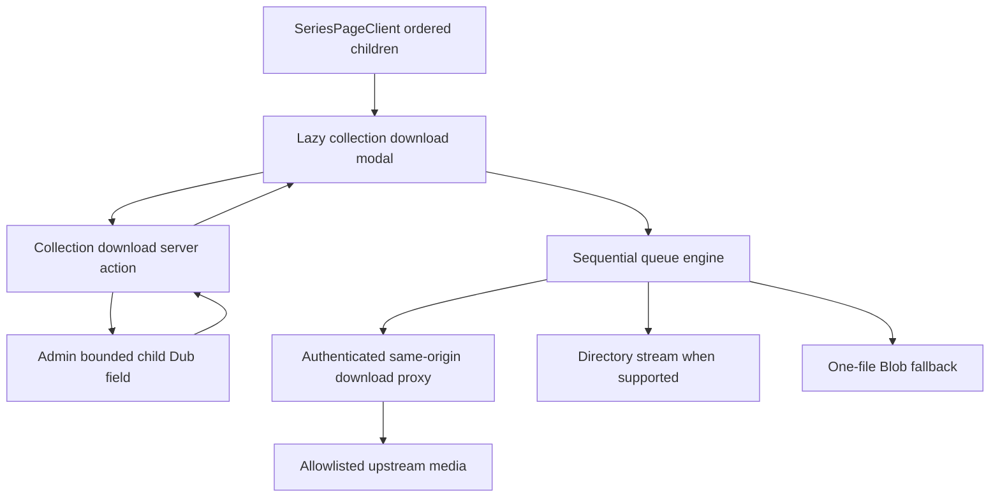
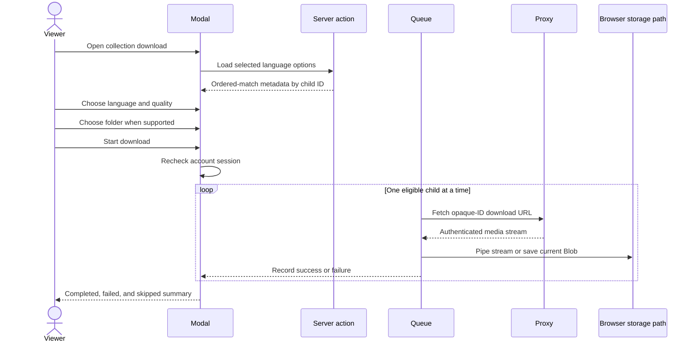

# feat: Add sequential Watch collection downloads

## Summary

Add a collection-level download flow to Watch series pages so a viewer selects one audio language and quality tier, then downloads the collection's available videos in editorial order through a visible, cancellable queue. Keep collection download data off the initial route payload and preserve the existing authenticated same-origin proxy and filename contracts.

---

## Problem Frame

Collection pages such as `https://watch.jesusfilm.org/watch/lumo-the-gospel-of-luke.html/english.html` list an ordered set of episodes but expose downloads only after a viewer opens each episode. The referenced live page currently contains 26 episodes, so repeating the language, quality, and download steps for every video is slow and error-prone.

The current single-video path already provides the required security boundary: the client receives opaque video, Dub, and download IDs while `/watch/api/download` resolves and streams the raw media URL after authentication. Collection download discovery must stay bounded by children and one requested language; projecting every Dub for every child would recreate the documented 45 MB collection payload failure.

---

## Requirements

### Collection selection and queue

- R1. A Watch series page with direct children offers a collection download control without adding download discovery to initial page load; the modal handles the no-download result after intent.
- R2. The collection modal lets the viewer choose one audio language and one relative quality tier for the batch.
- R3. The queue includes each direct child that has a downloadable Dub in the chosen language and preserves the collection's displayed order.
- R4. The UI states how many displayed children are available before starting and identifies skipped children that lack a matching downloadable rendition.
- R5. The browser transfers one video at a time and exposes current item, completed, failed, skipped, and total counts.
- R6. The viewer can cancel an active batch, retain completed files, and retry failed items without repeating successful downloads.

### Existing download contracts

- R7. Collection downloads require the same account-session check as the existing single-video download flow before the batch starts.
- R8. Every file uses the existing compatible filename builder and the authenticated `/watch/api/download` opaque-ID contract; raw CDN or Mux URLs never enter client markup or action results.
- R9. Per-video proxy failures do not discard completed files or prevent later eligible videos from being attempted.
- R10. The implementation does not alter public Watch route shapes, single-video downloads, range support, SSRF defenses, or download analytics.

### Compatibility and performance

- R11. Supporting browsers can stream each response directly into a viewer-selected directory; other browsers fall back to one in-memory file at a time and native browser downloads.
- R12. The collection modal, Admin lookup, and media requests load only after download intent, with no new initial media or collection-download request on page load.
- R13. All new collection-download copy participates in the repository's locale parity checks and the flow remains keyboard-accessible.

---

## Assumptions

- “Whole collection” means the ordered direct children displayed on the current series page. Nested collection rows and children without a downloadable Dub are reported as skipped rather than recursively expanded.
- Quality uses the existing relative tiers (`Highest`, `High`, `Low`). A tier is offered only when every downloadable queue item has that tier, so the chosen quality has consistent semantics across the batch.
- One collection-level session check gates the batch; the proxy still revalidates the authenticated session on every file request.
- A failed file does not stop the queue. The final state offers a retry containing only failed items.
- Directory streaming is a progressive enhancement because `showDirectoryPicker()` is unavailable in some major browsers. The fallback buffers only the current video, never the collection.

---

## Key Technical Decisions

- KTD1. **Add a bounded Admin collection-download field:** expose one downloadable Dub per direct child for one language, deduped by child video ID. This avoids the unbounded `children × dubs` graph while giving Web opaque IDs and rendition metadata in one request.
- KTD2. **Load queue metadata through a server action after intent:** the client sends collection and language slugs, while the action calls Admin with the server-only bearer and returns no raw media URLs.
- KTD3. **Merge Admin results onto the existing ordered child list:** Admin returns matching Dubs keyed by `videoId`; Web owns the displayed child order and localized titles already rendered by `SeriesPageClient`.
- KTD4. **Use an explicit sequential queue engine:** each proxy response must finish before the next begins. The engine owns cancellation, per-item outcomes, retry selection, and the two storage strategies independently of modal rendering.
- KTD5. **Prefer streaming to a selected directory:** when `showDirectoryPicker()` exists, expose a separate user-driven folder-selection step before Start so the picker retains required transient activation. Pipe each later authenticated response into one `FileSystemWritableFileStream`; use a per-file Blob and temporary download anchor only as a compatibility fallback.
- KTD6. **Keep the feature off the critical path:** dynamically import the collection modal and defer both its server action and Admin query until the user opens it.

---

## High-Level Technical Design

### Component and data boundaries

The Admin contract returns child video IDs, matching Dub IDs, language identity, and download rendition metadata only. The client combines that safe result with the series page's existing child slugs and localized titles, selects one rendition per child, and constructs proxy URLs with existing helpers.

### Batch lifecycle

Cancellation aborts the current request and prevents later queue items from starting. Retry creates a new queue from failed items only.

---

## Implementation Units

### U1. Add the bounded Admin child-download contract

- **Goal:** Return at most one downloadable Dub per visible direct child for a requested language without loading every child Dub.
- **Requirements:** R3, R4, R8, R10, R12.
- **Dependencies:** None.
- **Files:**
  - `docs/roadmap/topic-experiences/feat-251-watch-collection-sequential-downloads.md`
  - `apps/admin/src/services/video.service.ts`
  - `apps/admin/src/services/video.service.test.ts`
  - `apps/admin/src/graphql/types/video.ts`
  - `apps/admin/src/graphql/types/video.test.ts`
  - `apps/admin/schema.graphql`
  - `packages/admin-graphql/src/admin-graphql-env.d.ts`
- **Approach:** Add a public `Video` field that accepts an exact language slug and returns downloadable, published, non-deleted Dubs for visible direct children. Apply the same child visibility policy as `childDubLanguages`, require usable download rows, dedupe multiple eligible Dubs by child video ID with deterministic preference, and project the normal `VideoDub` type so Web can select only safe fields.
- **Patterns to follow:** `Video.childDubLanguages`, `Video.preferredPlayableDub`, `VideoService.getChildDubLanguages`, and the Admin schema/codegen flow in `CLAUDE.md`.
- **Test scenarios:**
  1. A collection with several visible children and matching downloadable Dubs returns one Dub per child.
  2. Duplicate eligible Dubs for one child resolve deterministically to one result.
  3. Unpublished, non-downloadable, soft-deleted, wrong-language, URL-less, and hidden-child rows are excluded.
  4. Viewer and editor callers retain the existing published-locale visibility difference.
  5. A leaf video or language with no eligible child Dub returns an empty list.
  6. The printed schema and generated Web client types contain the new field and argument.
- **Verification:** The service query is bounded by direct child and exact language filters, focused Admin tests pass, and generated schema artifacts are clean.

### U2. Build the lazy Web collection-download model

- **Goal:** Resolve safe batch metadata after user intent and merge it into the series page's ordered children.
- **Requirements:** R1, R2, R3, R4, R8, R12.
- **Dependencies:** U1.
- **Files:**
  - `apps/web/src/lib/fragments/watch-video.ts`
  - `apps/web/src/lib/watch-collection-download-actions.ts`
  - `apps/web/src/lib/watch-collection-download-actions.test.ts`
  - `apps/web/src/components/watch/collection-download-options.ts`
  - `apps/web/src/components/watch/collection-download-options.test.ts`
- **Approach:** Add a server action that validates collection and language slugs, queries the bounded Admin field without `url`, normalizes byte sizes, and returns Dubs keyed by child video ID. A pure option builder merges those results with the existing ordered child metadata, calculates skipped children, derives the common quality-tier choices, and builds compatible filenames and opaque proxy URLs.
- **Patterns to follow:** `watch-language-actions.ts`, `download-options.ts`, `download-link.ts`, `resolveWatchLanguagePickerVariants`, and `tryAsContentSlug` / `tryAsLocaleSlug` validation.
- **Test scenarios:**
  1. Valid collection and language input returns safe metadata without any raw URL field.
  2. Invalid slugs fail closed before an Admin request.
  3. Admin errors become a stable retryable action error rather than leaking Apollo details.
  4. Dubs returned out of order are reordered to match displayed children.
  5. Children without a matching Dub or download are listed as skipped.
  6. Common tier derivation always offers `Highest` and offers `High` or `Low` only when present for every eligible item.
  7. Queue items use the selected tier, existing language-aware filenames, and same-origin opaque proxy URLs.
- **Verification:** Focused action and option tests prove ordering, tier semantics, validation, and the no-raw-URL boundary.

### U3. Implement the sequential download queue engine

- **Goal:** Transfer exactly one collection video at a time with cancellation, per-item outcomes, and retry support.
- **Requirements:** R5, R6, R8, R9, R11.
- **Dependencies:** U2.
- **Files:**
  - `apps/web/src/components/watch/collection-download-queue.ts`
  - `apps/web/src/components/watch/collection-download-queue.test.ts`
- **Approach:** Implement a UI-agnostic async queue over selected items. Fetch one authenticated proxy URL at a time, write it to a directory handle when supported, otherwise materialize only that response as a Blob and invoke a temporary download anchor. Record success or failure before advancing, treat cancellation separately from failure, and expose a failed-only retry list.
- **Patterns to follow:** `DownloadModal.handleDownload`, `download-session-access.ts`, `/watch/api/download` streaming behavior, and browser `AbortController` use already present in Watch components.
- **Test scenarios:**
  1. Three successful items call fetch and storage in strict sequence with concurrency never exceeding one.
  2. A failed middle response is recorded and the third item still runs.
  3. An authentication response stops safely and reports that the session must be refreshed.
  4. Cancellation aborts the current fetch and never starts remaining items.
  5. Directory-capable browsers stream responses to distinct compatible filenames without creating Blobs.
  6. Unsupported browsers create and revoke one Blob URL per completed item.
  7. Retry input contains failed items only and preserves their original order.
- **Verification:** Deterministic unit tests prove maximum concurrency of one, both storage strategies, cancellation, failure continuation, and retry selection.

### U4. Integrate the collection modal into the series experience

- **Goal:** Give viewers an accessible collection-level language, quality, and queue UI on series pages.
- **Requirements:** R1-R13.
- **Dependencies:** U2, U3.
- **Files:**
  - `apps/web/src/components/watch/CollectionDownloadModal.tsx`
  - `apps/web/src/components/watch/__tests__/CollectionDownloadModal.test.tsx`
  - `apps/web/src/components/watch/SeriesPageClient.tsx`
  - `apps/web/src/components/watch/__tests__/SeriesPageClient.test.tsx`
  - `apps/web/messages/*.json`
  - `apps/web/src/i18n/__tests__/messages-parity.test.ts`
- **Approach:** Add a download pill beside Share when the series has children and lazily mount the modal. Default language to the current route language, load options on open and language changes, show availability before start, lock selection while running, expose cancel and failed-only retry, and keep progress visible until the viewer closes the completed state. Reuse the existing auth redirect intent so login returns to a reopened download flow.
- **Patterns to follow:** `DownloadModal`, `SeriesPageClient` modal state, `LanguageCombobox`, `WatchModalViewportCloseButton`, and Base UI dialog state verification guidance.
- **Test scenarios:**
  1. A non-empty series renders the collection download control; an empty series does not.
  2. Opening checks session state and displays either the authenticated selection flow, sign-in state, or retryable session error.
  3. Current route language is selected by default and changing language reloads queue metadata.
  4. Start stays disabled until options are ready, a quality is selected, and at least one item is eligible.
  5. Running progress shows the active title and counts; close is guarded while a transfer is active and cancel returns a durable summary.
  6. Partial failure renders completed, failed, and skipped results and retry starts only failed items.
  7. Keyboard focus, Escape behavior, labels, and live progress announcements remain accessible.
  8. Existing Share and language modals and single-video download tests remain unchanged.
  9. Every message catalog contains the new namespace and keys.
  10. Returning from sign-in with the existing download intent reopens the collection modal on a series route.
- **Verification:** Focused component tests pass, the live-shaped LUMO route completes a browser smoke with visual proof, and page-load inspection shows no collection-download request or eager modal chunk before user intent.

---

## Scope Boundaries

### Included

- Direct-child collection downloads from `SeriesPageClient` pages.
- Language and relative quality selection once per batch.
- Account, compatible filename, proxy, analytics, and SSRF parity with single-video downloads.
- Progressive directory streaming plus a one-file Blob fallback.

### Deferred to Follow-Up Work

- Durable queue restoration across navigation, refresh, browser restart, or device sleep.
- Recursive expansion of nested collection children.
- Background downloads through a service worker or installed PWA.
- ZIP packaging, server-side archive jobs, or a native download-manager integration.

### Out of Scope

- Changes to single-video download selection or proxy security.
- Downloading subtitles or bundling subtitle tracks into media files.
- Mobile or TV offline-download behavior.

---

## System-Wide Impact

- **Admin GraphQL:** Adds one bounded public field and generated consumer types; no database migration is required.
- **Authentication:** Collection metadata remains public Watch metadata, while every media response continues through the existing authenticated proxy.
- **Performance:** No initial route field expands. User intent adds one bounded Admin request followed by one media request at a time.
- **Browser resources:** Directory streaming avoids JS buffering on supported Chromium browsers. Compatibility fallback holds one video Blob at a time and must be tested on a representative lower-memory browser.
- **Analytics:** Existing proxy-level per-video download events continue to fire once for each successful batch item.

---

## Risks & Dependencies

- `showDirectoryPicker()` requires HTTPS and transient user activation and is not available in every major browser. A separate folder button calls it directly from the click handler; feature detection selects the one-file Blob fallback elsewhere.
- Browser policies may prompt users to allow multiple automatic downloads in fallback mode. The modal warns before Start, records proxy completion rather than claiming the browser saved a file, and leaves retry available for observed request failures.
- A tab close or navigation interrupts the in-page queue. The running state warns that the tab must remain open and guards modal dismissal until the viewer cancels or the queue settles.
- Collection languages are a union across children, so partial language coverage is expected. Availability and skipped titles are shown before Start and preserved in the final summary.
- Proxy requests can approach the route's ten-minute ceiling for very large files. A timeout becomes a retryable per-item failure while later items continue sequentially.

---

## Acceptance Examples

- AE1. Given the 26-episode LUMO Luke collection in English, when the viewer chooses `Highest` and starts the batch, then eligible episodes download in displayed order with only one active media request.
- AE2. Given a selected language available for only 20 of 26 children, when options load, then the modal shows 20 downloadable and 6 skipped before Start is enabled.
- AE3. Given the third file fails while the first two succeed, when the queue finishes, then later files were still attempted and Retry contains the third file only.
- AE4. Given the viewer cancels during the fourth file, when cancellation settles, then the first three completed files remain and no fifth request starts.
- AE5. Given a browser with directory access, when the viewer selects a folder, then each response streams into its compatible filename without a collection-sized or file-sized Blob.
- AE6. Given a browser without directory access, when the viewer starts the batch, then only the current response is buffered and each completed Blob is handed to the browser download manager before the next fetch begins.
- AE7. Given a signed-out viewer, when collection download opens, then the sign-in state uses the existing return intent and no media request begins.

---

## Documentation / Operational Notes

- Create `feat-251` as in-progress before implementation and mark it complete with the PR URL after validation.
- Preserve the normal PR-to-main Railway deployment path; no direct production publish is part of this work.
- Browser proof should include the live-shaped LUMO route, selection state, running/completed state, a screenshot, and a resource-timing check that no collection-download work starts during initial load.
- Compound the bounded child-Dub query and sequential browser-write pattern into `docs/solutions/` if implementation validates them as reusable.

---

## Sources & Research

- Existing download security and filename contracts: `apps/web/src/app/api/download/route.ts`, `apps/web/src/lib/download-target.ts`, `apps/web/src/components/watch/DownloadModal.tsx`, and `apps/web/src/components/watch/download-link.ts`.
- Existing bounded collection-language pattern: `apps/admin/src/services/video.service.ts` (`getChildDubLanguages`) and `apps/admin/src/graphql/types/video.ts` (`childDubLanguages`).
- Existing series route and child ordering: `apps/web/src/components/watch/SeriesPageClient.tsx` and `apps/web/src/lib/content.ts`.
- Prior payload constraint: `Video.childDubLanguages` schema documentation and `docs/roadmap/platform/feat-219-watch-page-client-payload-pruning.md`.
- Browser directory access and writable streams: `https://developer.mozilla.org/en-US/docs/Web/API/Window/showDirectoryPicker` and `https://developer.mozilla.org/en-US/docs/Web/API/File_System_API`.
- Direct response-to-file streaming and progressive enhancement guidance: `https://developer.chrome.com/docs/capabilities/web-apis/file-system-access`.
