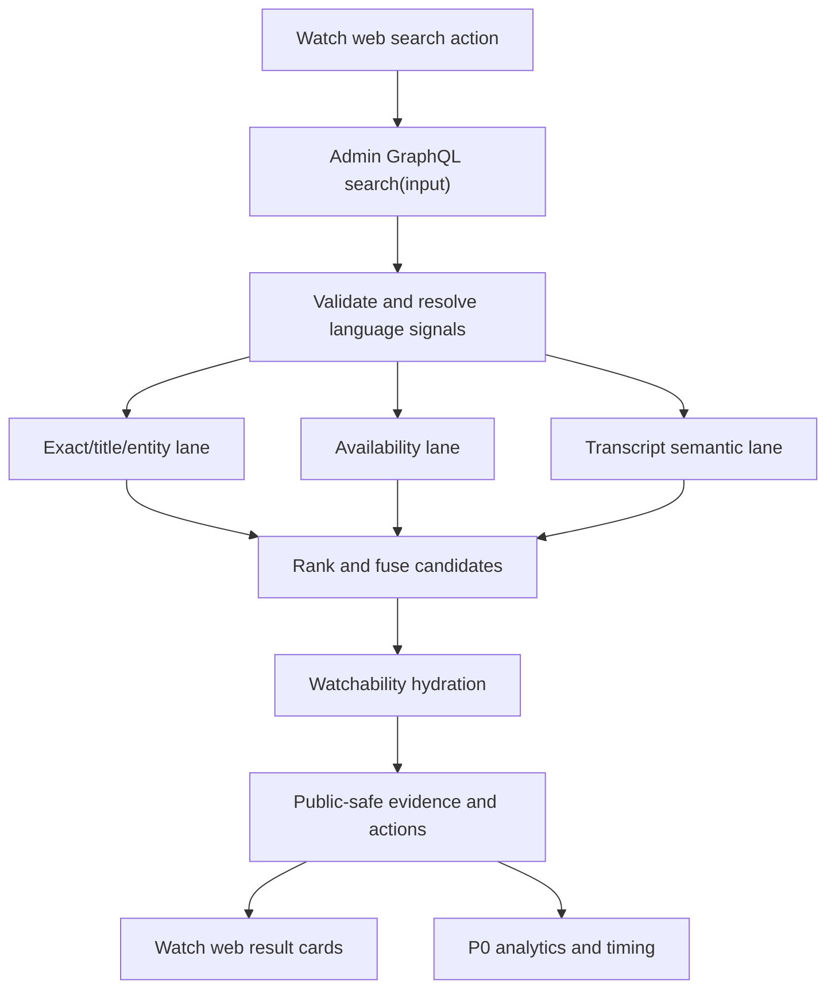

# Watch Universal Multilingual Search

## Overview

Replace Watch viewer search with a Forge-native multilingual search contract
that separates query language, target watch language, display language,
evidence language, and availability language. P0 ships on Watch web first and
uses three lanes: exact/title/entity, language availability, and existing
transcript semantic evidence. Curated metadata/topic lanes, deeper impression
analytics, and mobile/TV presentation work remain later phases.

The work is cross-cutting: Admin owns the public GraphQL search contract,
retrieval, watchability hydration, privacy boundaries, timing, and trace
capture; Web owns the floating search action, result card presentation, query
language signals, click analytics, and route/watch context signals.

## Problem Frame

The current search path is shaped around `query + locale`, which makes a
single value carry too many meanings: UI display language, target watch
language, transcript evidence language, localized metadata language, and route
locale. That blocks the product from serving users who predominantly speak
English but want a particular film in another language, and users who search in
their own language for watchable content. Search v2 must improve exact lookup
and title-plus-language lookup without damaging baseline felt-need discovery
(see origin: `docs/brainstorms/2026-07-14-universal-multilingual-watch-search-requirements.md`).

## Requirements Trace

- R1. One user-facing Watch search entry point supports exact lookup,
  language availability lookup, and baseline felt-need/topic discovery.
- R2. Exact title/entity matches outrank semantic similarity.
- R3. Title-plus-language queries prioritize the matching title/entity and
  target-language watchability.
- R4. P0 felt-need/topic discovery uses existing transcript semantic evidence;
  curated metadata/topic ranking is P1.
- R5-R11. Search models query, named, target watch, display, evidence, and
  availability languages separately, with explicit dropdown/filter language
  winning conflicts.
- R12. The existing viewer search contract may be replaced directly; generated
  Admin GraphQL artifacts and active Watch web consumers must update in the
  same rollout.
- R13-R18. Existing transcript embeddings remain the semantic evidence source,
  with bounded evidence-language fanout and edition/dub/subtitle watchability.
- R18c/R28. Public search must not leak unpublished/internal content, raw
  vectors, debug payloads, bearer data, raw query text outside approved sinks,
  or sensitive account data.
- R19-R22. Watch web receives structured result data for availability,
  evidence, fallback, action, and result-card truth.
- R23-R28. P0 analytics record privacy-minimized request, click, no-result,
  lane, ranker version, and latency data.
- R29-R33. P0 targets p50 under 800ms, p95 under 2000ms, and hard
  timeout/degraded response by 2500ms.

## Scope Boundaries

- P0 targets Watch web only. Mobile and TV adoption are separate tasks unless
  schema compilation forces call-site cleanup in this change.
- P0 does not require curated metadata/topic ranking, richer typo fallback,
  automatic personalization, or auto-reranking from clicks.
- P0 does not discard or regenerate the transcript embedding corpus.
- P0 does not preserve old `search(q, locale, ...)` semantics as a product
  contract. Existing call sites that still compile in the monorepo must be
  updated, removed, or deliberately shimmed for build health, not for product
  compatibility.
- REST `/api/search` parity is not a P0 product requirement unless another
  active production caller is identified during implementation.

### Deferred to Separate Tasks

- Mobile and TV result presentation and client-specific focus/truncation work.
- Curated metadata/topic lane and any supporting backfill/index work.
- Full ordered impression/refinement analytics and click-trained ranking.
- Experience-specific result shapes if experiences do not fit the video/series
  contract without special handling.

## Context & Research

### Relevant Code and Patterns

- `apps/admin/src/graphql/queries/hybrid-search.ts` previously exposed public
  `search(q, locale, type, limit, offset, mode, debug)`. Unit 0 removed that
  legacy GraphQL surface so the replacement starts from a clean query module.
- `apps/admin/src/services/hybrid-search.service.ts` orchestrates embedding,
  retrieval, RRF fusion, dedupe, hydration, debug payloads, and timing logs.
- `apps/admin/src/services/hybrid-search-retrievers.ts` currently filters
  semantic transcript evidence and display locale to the single `locale`.
- `apps/admin/src/services/hybrid-search-keyword-first-retrievers.ts` provides
  the exact/title and keyword-first lexical stack that should be reused for the
  exact/entity lane.
- `apps/admin/prisma/schema.prisma` has the required data sources:
  `VideoDub`, `VideoSubtitle`, `VideoTranscript`, `VideoTranscriptChunk`,
  `VideoLocale`, and `SearchTrace`.
- `apps/web/src/lib/search.ts` defines the current typed Admin operation and
  Web result shape.
- `apps/web/src/lib/search-actions.ts` owns the server action, language
  resolution, Algolia fork, analytics scheduling, and Watch context inputs.
- `apps/web/src/lib/search-language.ts` and
  `apps/web/src/lib/search-language-actions.ts` already model explicit
  language selection, route language, and `Accept-Language`.
- `apps/web/src/components/search/VideoCard.tsx` renders result cards and link
  language slugs.
- `packages/admin-graphql/CLAUDE.md` requires SDL-only consumption and
  regeneration after Admin schema changes.

### Institutional Learnings

- `docs/solutions/platform/admin-hybrid-search-r4-pattern.md`: keep public
  search in Admin services, enforce public visibility in SQL/services, preserve
  degradation semantics, and avoid exposing vectors.
- `docs/solutions/architecture-patterns/admin-semantic-video-transcript-evidence-pattern.md`:
  transcript chunks are now the runtime video semantic evidence source; do not
  reintroduce scene retrieval as an implicit fallback.
- `docs/solutions/platform/admin-search-trace-retention-pattern.md`: raw
  search traces stay Admin-owned, short-lived, privacy-labeled, and query-free
  in aggregate form.
- `docs/solutions/performance-issues/pgvector-hnsw-index-bypass-with-where-filter-20260415.md`
  and related pgvector notes: filter columns need to cooperate with HNSW query
  shape; validate multilingual candidate plans with production-like data.
- `docs/solutions/architecture-patterns/canonical-server-search-analytics-supplemental-rum-pattern.md`:
  server-side search analytics should be canonical; client RUM can supplement
  click/interaction context.
- `docs/solutions/best-practices/operation-specific-admin-graphql-timeout.md`:
  use operation-specific Admin client timeouts rather than widening every
  GraphQL call.

### External References

External research was not run. This plan is dominated by repo-local Pothos,
Prisma, pgvector, generated-client, search-trace, and Watch web conventions.

## Key Technical Decisions

- **Replace the active Watch web product contract directly:** The plan does not
  preserve old `query + locale` semantics as the Watch web product contract.
  Implementation must still audit non-web/internal consumers and use a
  mechanical shim or temporary sibling field when needed for repo/runtime
  health. That shim is migration plumbing, not the target product contract.
- **Admin resolves final search semantics:** Web may send signals, but Admin
  owns target watch language resolution, evidence-language selection,
  watchability hydration, public visibility, ranking, and debug gating.
- **Explicit language filter wins:** When a submitted filter conflicts with a
  query-named language, the filter remains the target watch language and the
  query-named language is returned as a secondary interpretation.
- **Target-language audio is primary watchability:** Target subtitles are a
  labeled fallback; other-language availability is a separate fallback state.
- **P0 evidence-language fanout is bounded:** Search at most target language,
  query language, and one fallback evidence language until production-scale
  measurements prove broader fanout is safe.
- **Timeouts are service semantics:** Embedding, retrieval, and hydration each
  get explicit budgets, cancellation/statement-timeout behavior, and
  partial-response semantics; a 45-second client timeout is not acceptable for
  this path.
- **Raw debug is staff-only and server-derived:** Public responses include safe
  evidence labels. Source ids, lane contributions, and scores require a
  verified staff/admin session or internal bearer capability; public client
  input must not enable debug.

## Open Questions

### Resolved During Planning

- **Should the old search contract be preserved?** No for Watch web product
  behavior. Yes only as a mechanical shim if a consumer audit shows non-P0
  callers still need it for build/runtime health during this rollout.
- **What latency target should guide design?** p50 under 800ms, p95 under
  2000ms, degraded/hard-timeout response by 2500ms.
- **What wins language conflicts?** Explicit dropdown/filter language wins.

### Deferred to Implementation

- **Exact GraphQL names:** The plan assumes a replacement Watch web search
  input/output shape. Implementation may choose an in-place `search(input:)`
  replacement, a temporary sibling field, or a shimmed old field if the
  consumer audit shows that is safer. The target Watch web contract is the new
  shape.
- **Cross-language embedding quality:** Implementation must measure whether
  existing embeddings satisfy P0 mixed-language discovery or whether query
  translation is needed as a follow-up.
- **Final SQL shape:** Retriever SQL should be optimized against real query
  plans after implementation starts; the plan defines lane semantics and
  budgets, not final SQL text.
- **Analytics storage:** P0 can extend existing trace/event paths or add a
  small Admin-owned event table, but the final storage shape should follow the
  simplest path that satisfies privacy and reporting needs.

## High-Level Technical Design

> This illustrates the intended approach and is directional guidance for
> review, not implementation specification.

## Implementation Units

- [x] **Unit 0: Legacy Search Consumer Compile Shim**

**Goal:** Remove current app-level direct dependencies on Admin's legacy
`Query.search(q, locale...)` operation before replacing the Watch web contract,
so CI builds are not blocked by the P0 schema migration.

**Requirements:** R12; scope boundary for mobile/TV.

**Dependencies:** Roadmap `feat-254`; consumer audit.

**Files:**

- Modify: `apps/mobile/src/lib/queries.ts`
- Modify: `apps/mobile/src/hooks/useCategoryThumbnails.ts`
- Modify: `apps/web/src/lib/search.ts`
- Modify: `apps/web/src/lib/search.test.ts`
- Modify: `apps/web/scripts/verify-categories.ts`
- Modify: `apps/admin/src/graphql/schema.ts`
- Modify: `apps/admin/src/graphql/schema.test.ts`
- Delete: `apps/admin/src/graphql/queries/hybrid-search.ts`
- Delete: `apps/admin/src/graphql/queries/hybrid-search.test.ts`
- Delete: `apps/admin/src/graphql/types/hybrid-search-debug.ts`
- Delete: `apps/admin/src/app/watch/demo-keyword-search/*`
- Modify: `apps/tv/src/lib/queries.ts`
- Modify: `apps/tv/src/lib/search.ts`
- Modify: `apps/tv/src/components/search/useCategoryThumbnails.ts`
- Modify: `apps/tv/src/lib/queries.test.ts`

**Approach:**

- Remove mobile, TV, and Watch web gql.tada documents that compile against the legacy
  Admin `search` field.
- Preserve local `SearchResult`/`SearchResponse` shapes for card, routing, and
  telemetry code that still compiles in those apps.
- Temporarily make category-thumbnail/category-verification fetches no-op and
  have TV/Watch web search functions return empty result sets while retaining
  caller-facing state, response, and telemetry contracts.
- Remove the legacy Admin GraphQL `Query.search` registration so new search
  work starts from a clean schema surface.
- Keep comments tied to `feat-254` so mobile/TV adoption can replace the shim
  deliberately instead of treating it as a product contract.

**Verification:**

- No mobile/TV/web source references `SEARCH`, `SEMANTIC_SEARCH`, or
  `semanticSearch` as legacy Admin search operations.
- Mobile, TV, and Web typechecks should pass once workspace dependencies are
  installed.

- [x] **Unit 1: Replacement Admin GraphQL Contract**

**Goal:** Add the replacement Watch web search GraphQL shape with a minimal
input/output contract that can express language signals, watchability,
evidence, fallback, degraded status, and P0 analytics dimensions.

**Requirements:** R1-R3, R5-R12, R16-R22, R28.

**Dependencies:** Roadmap `feat-254`; origin requirements.

**Files:**

- Create: `apps/admin/src/graphql/queries/watch-search.ts`
- Modify: `apps/admin/src/app/api/search/route.ts`
- Modify: `apps/admin/src/app/api/internal/search-eval/search/route.ts`
- Modify: `apps/admin/src/services/experience-ai/agent-tools.service.ts`
- Modify: `apps/admin/src/graphql/schema.test.ts`
- Modify: `apps/admin/schema.graphql`
- Modify: `packages/admin-graphql/src/admin-graphql-env.d.ts`
- Test: `apps/admin/src/graphql/queries/watch-search.test.ts`
- Test: `apps/admin/src/graphql/schema.test.ts`

**Approach:**

- Start with a consumer audit for all current `search(q, locale...)` call sites:
  Watch web, mobile, TV, REST `/api/search`, internal search eval, scripts, and
  agent tools. Decide which call sites move to the new shape, which receive a
  temporary shim, and which are removed.
- Replace the Watch web boundary args with a structured input that includes the
  minimal P0 fields: query, explicit target language, query-named language,
  route/display defaults, current watch language when present, accept-language
  defaults, result types, limit, and offset. Query-language detection and
  rank/debug internals are nullable or staff/internal-only.
- Replace the result object with fields for primary/fallback title,
  watchability, availability languages, safe evidence label/language, primary
  action, fallback state, degraded lane status, request id, and language
  interpretation.
- Keep public shape free of vectors, raw transcript chunks, raw score internals,
  raw debug payloads, unpublished/internal ids, and bearer-derived data.
- Public GraphQL input must not enable debug. Debug authorization is derived
  server-side from a verified staff/admin session or dedicated internal bearer
  capability.
- Default P0 for non-web consumers is a narrow compatibility shim when needed
  for build/runtime health. Only update mobile/TV behavior if the change is
  mechanical and covered by compile tests.
- Regenerate Admin SDL and `@forge/admin-graphql` introspection in the same
  implementation slice.

**Patterns to follow:**

- Public query wraps a service, not direct Prisma access. Use the old
  `HybridSearchService` orchestration patterns where useful, but do not
  restore the legacy `Query.search(q, locale...)` field.
- SDL generation flow from `apps/admin/CLAUDE.md` and
  `packages/admin-graphql/CLAUDE.md`.

**Test scenarios:**

- Happy path: `search(input)` accepts explicit target language and returns
  result fields for watchability, evidence, language interpretation, and
  fallback state.
- Edge case: query longer than the boundary cap is rejected or truncated
  according to the chosen boundary rule.
- Error path: non-authorized debug request returns no debug internals.
- Error path: invalid result type, excessive limit, or excessive language list
  fails before service invocation.
- Integration: generated schema exposes no vector/embedding/similarity/raw
  debug fields on public result types.

**Verification:**

- Admin schema tests pass and generated SDL/introspection reflect the new
  contract.
- Admin schema and any temporary shims cover all audited compiled consumers.

- [x] **Unit 2: Language Signal Resolution**

**Goal:** Add server-owned language resolution that preserves source signals,
applies explicit-filter precedence, and returns the selected target watch
language plus secondary interpretations.

**Requirements:** R5-R11b, R17, R18, R22.

**Dependencies:** Unit 1 input shape.

**Files:**

- Create: `apps/admin/src/services/search-language-resolution.ts`
- Test: `apps/admin/src/services/search-language-resolution.test.ts`
- Modify: `apps/admin/src/services/hybrid-search.service.ts`
- Modify: `apps/web/src/lib/search-actions.ts`
- Modify: `apps/web/src/lib/search-language.ts`
- Test: `apps/web/src/lib/search-actions.test.ts`
- Test: `apps/web/src/lib/search-language.test.ts`

**Approach:**

- Normalize the known signal sources: explicit filter, query-named language,
  optional detected query language when already available, current watch/audio
  language, route/display language, and `Accept-Language`.
- Classify each signal as hard constraint, preference, or default.
- Apply product rule: submitted filter wins; query-named language becomes a
  secondary interpretation when it conflicts with the filter.
- Return an interpretation payload that Web can use for chips/copy without
  re-deriving precedence locally.
- Treat query-language detection as optional in P0. Do not add a detector or
  translation dependency unless implementation evidence proves it is needed.
- Keep Web's existing language option metadata and `Accept-Language` capture,
  but stop using Web's resolved locale as the whole search context.

**Patterns to follow:**

- Existing Web language helpers in `apps/web/src/lib/search-language.ts`.
- Admin service-owned boundary decisions in `apps/admin/src/services`.

**Test scenarios:**

- Happy path: explicit Spanish filter plus query `JESUS film Russian` resolves
  target watch language to Spanish and secondary named language to Russian.
- Happy path: no filter plus query `JESUS film Russian` resolves target watch
  language to Russian with an inferred/removable marker.
- Edge case: no strong language signal falls back to route/display or
  `Accept-Language` default without marking it as explicit.
- Edge case: unknown language names do not become target watch languages.
- Integration: Web passes explicit/route/watch/accept-language signals and
  preserves the Admin interpretation in the action result.
- Privacy: analytics persists normalized supported-language classes or slugs,
  not the raw `Accept-Language` header.

**Verification:**

- Language conflict behavior is deterministic and visible in the returned
  response shape.

- [x] **Unit 3: Watchability Hydration**

**Goal:** Resolve whether each candidate is watchable in the target language,
with target-language audio primary, target-language subtitles as labeled
fallback, and other-language fallback separated from target availability.

**Requirements:** R3, R18-R18c, R20-R22c.

**Dependencies:** Unit 1 result shape; Unit 2 target watch language.

**Files:**

- Create: `apps/admin/src/services/search-watchability.ts`
- Test: `apps/admin/src/services/search-watchability.test.ts`
- Modify: `apps/admin/src/services/hybrid-search.service.ts`
- Modify: `apps/admin/src/services/hybrid-search-retrievers.ts`
- Modify: `apps/admin/prisma/schema.prisma`
- Create: `apps/admin/prisma/migrations/<timestamp>_search_watchability_indexes/migration.sql`
- Test: `apps/admin/src/services/hybrid-search.service.test.ts`

**Approach:**

- Hydrate watchability after candidate retrieval using `VideoDub`,
  `VideoSubtitle`, `VideoEdition`, `Language`, and `MuxVideo`.
- Normalize candidate identity before hydration: `videoId`, optional
  `editionId`, target `languageId`, selected dub/subtitle ids, and public-safe
  action metadata.
- Add or verify composite indexes needed for fast watchability lookups, such
  as subtitle `(video_edition_id, language_id, deleted_at)` and dub
  `(video_id, language_id, published, deleted_at)` or equivalent.
- Define deterministic edition selection for keyword-only candidates that have
  no transcript-derived edition id.
- Only published, non-deleted, viewer-public dubs can produce playable audio
  actions.
- Subtitle fallback requires a non-deleted subtitle row for the candidate
  edition/video and target language; it must not be labeled as audio
  availability.
- Other-language fallback can expose safe availability labels and actions only
  when the underlying content is public.
- Keep watchability distinct from transcript evidence availability; a transcript
  in Russian is not proof that Russian audio exists.

**Patterns to follow:**

- Public visibility gates in `docs/solutions/platform/admin-hybrid-search-r4-pattern.md`.
- VideoDub and VideoSubtitle schema in `apps/admin/prisma/schema.prisma`.

**Test scenarios:**

- Happy path: target-language published dub returns `audio` watchability and a
  primary watch action.
- Happy path: target subtitle but no target audio returns `subtitle` fallback
  with different label/action semantics.
- Edge case: transcript exists in target language but no dub/subtitle exists;
  watchability remains unavailable/fallback, not target-available.
- Error path: unpublished/deleted dub, internal collection, or admin-only
  metadata never appears in actions or fallback labels.
- Integration: result card data distinguishes availability language from
  evidence language.
- Performance: hydration uses the normalized candidate window rather than
  joining against the whole catalog.

**Verification:**

- Result payloads can truthfully render `Available in Russian audio`,
  `Russian subtitles`, or `Available in another language`.

- [ ] **Unit 4: Bounded Retrieval and Ranking**

**Goal:** Rework retrieval around P0 lanes while preserving exactness, bounded
multilingual semantic retrieval, timeout behavior, and public-safe evidence.

**Requirements:** R1-R4, R13-R18b, R29-R33.

**Dependencies:** Units 1-3.

**Files:**

- Modify: `apps/admin/src/services/hybrid-search.service.ts`
- Modify: `apps/admin/src/services/hybrid-search-retrievers.ts`
- Modify: `apps/admin/src/services/hybrid-search-keyword-first-retrievers.ts`
- Modify: `apps/admin/src/services/hybrid-search-timing.ts`
- Test: `apps/admin/src/services/hybrid-search.service.test.ts`
- Test: `apps/admin/src/services/hybrid-search.keyword-first.test.ts`
- Test: `apps/admin/src/services/hybrid-search-retrievers.test.ts`
- Test: `apps/admin/src/services/transcript-embedding-ingest.contract.test.ts`

**Approach:**

- Keep exact/title/entity evidence as the highest-authority lane. Reuse the
  existing keyword-first exact-title and lexical stack where possible.
- Add an availability lane or ranking feature that boosts candidates watchable
  in the target language without letting weak availability-only matches outrank
  strong exact entity matches.
- Change transcript semantic retrieval to accept an evidence-language list
  rather than one locale. P0 fanout should be target language, query language,
  and at most one fallback language.
- Preserve pgvector index eligibility by using separate per-language queries or
  `UNION ALL` branches rather than a broad `language IN (...)` filter.
- Preserve one semantic-video candidate per video after collapsing chunk
  evidence; do not add a fifth RRF list just because multiple transcript
  languages were searched.
- Require viewer-public filters inside exact/entity, availability, and
  transcript semantic retrievers before ranking, not only during final
  hydration.
- Add real cancellation semantics: embedding `AbortSignal`, per-lane database
  `SET LOCAL statement_timeout`, hydration timeout, and `timed_out/degraded`
  timing status. Avoid `Promise.race` alone because it returns early while DB
  work keeps running.
- Validate candidate windows and HNSW usage with production-like query plans
  before widening language fanout. Include EXPLAIN coverage for a language with
  a partial HNSW index and one without.

**Patterns to follow:**

- RRF and retriever labeling in `docs/solutions/platform/admin-hybrid-search-r4-pattern.md`.
- Transcript-backed semantic evidence pattern in
  `docs/solutions/architecture-patterns/admin-semantic-video-transcript-evidence-pattern.md`.
- Existing timing recorder in `apps/admin/src/services/hybrid-search-timing.ts`.

**Test scenarios:**

- Happy path: exact title result remains above semantically similar but
  non-exact results.
- Happy path: title-plus-language query ranks target-language audio match above
  same-title non-target fallback when both are public.
- Happy path: semantic transcript evidence in query language can contribute
  while target watch language remains separate.
- Edge case: duplicate evidence across multiple transcript languages collapses
  to one candidate per video.
- Error path: embedding provider timeout returns lexical/availability partial
  results and marks semantic lane degraded.
- Error path: one retriever timeout does not fail the whole response.
- Error path: unpublished title/transcript/edition rows never appear as
  candidates, evidence, counts, fallback labels, or actions.
- Performance: retriever timing includes lane labels, timeout/degraded status,
  hydration time, and total response time.

**Verification:**

- P0 search has deterministic lane status and partial-response behavior, and
  can be measured against the 800ms/2000ms/2500ms target.

- [ ] **Unit 5: Watch Web Integration and Result Experience**

**Goal:** Update Watch web to call the replacement contract and render truthful
language, availability, evidence, fallback, and action states.

**Requirements:** R1-R5, R11a-R11b, R19-R22d.

**Dependencies:** Units 1-4 and regenerated `@forge/admin-graphql`.

**Files:**

- Modify: `apps/web/src/lib/search.ts`
- Modify: `apps/web/src/lib/search-actions.ts`
- Modify: `apps/web/src/components/search/VideoCard.tsx`
- Modify: `apps/web/src/components/FloatingSearchController.tsx`
- Modify: `apps/web/src/components/FloatingSearchProvider.tsx`
- Modify: `apps/web/src/components/SearchOverlayInstantShell.tsx`
- Test: `apps/web/src/lib/search.test.ts`
- Test: `apps/web/src/lib/search-actions.test.ts`
- Test: `apps/web/src/components/search/VideoCard.test.tsx`
- Test: `apps/web/src/components/__tests__/FloatingSearchProvider.test.tsx`

**Approach:**

- Replace Web's current `search(q, locale, mode: keyword-first)` operation with
  the new structured search input. This unit owns Watch web compilation against
  the regenerated Admin contract.
- Integrate the new path behind a controlled rollout switch or dark-launch path
  if needed for production measurement. Passing Units 6-7 is the gate for broad
  production traffic, even if the old product behavior is not sacred.
- Remove Algolia as the active Watch web search branch after the launch gate
  passes unless implementation discovers a still-required temporary flag path;
  if retained temporarily, it must not define P0 behavior.
- Render availability badges before evidence badges: audio/subtitles/fallback
  first, then matched title/transcript/topic labels.
- Add language-conflict and inferred-language UI states in the modal: explicit
  filter wins; query-named language can be offered as a refinement.
- Add fallback presentations for no result, exact title unavailable in target
  audio, subtitle-only, and semantic evidence in another language.
- Keep public Watch links using language slugs from the result action or
  watchability payload; do not synthesize `en`/`es` message locale URLs.

**Patterns to follow:**

- Server action boundary in `apps/web/src/lib/search-actions.ts`.
- Route builders in `apps/web/src/lib/routes.ts`.
- Result-card tests in `apps/web/src/components/search/VideoCard.test.tsx`.

**Test scenarios:**

- Happy path: Watch web sends explicit language filter, route language,
  watch-context language, and accept-language signals to Admin.
- Happy path: target-language audio result renders an audio availability badge
  and links to the correct public language slug.
- Happy path: subtitle-only fallback renders a subtitle label distinct from
  audio availability.
- Edge case: explicit filter conflicts with query-named language; UI preserves
  selected filter and exposes the alternate refinement.
- Edge case: semantic evidence language differs from target watch language;
  card does not show a misleading localized snippet.
- Error path: degraded lane response renders useful results plus non-blocking
  degraded messaging.
- Integration: Watch web operation compiles against the regenerated contract.

**Verification:**

- Watch web search works through the server action, renders result cards from
  Admin-provided truth, and records click context without client-side language
  invention.

- [ ] **Unit 6: P0 Analytics, Timing, and Benchmarking**

**Goal:** Capture privacy-minimized P0 events and production-like timing so the
team can decide whether search is ready to replace the current path.

**Implementation note:** Admin-owned Watch request tracing is implemented via
`SearchTrace` using `routeSource=graphql`, `searchMode=watch-search`, a
public-safe `requestId`, and bounded JSON metadata for language interpretation,
lane statuses, result ids/types, availability/evidence/action classes, counts,
and latency. Client interaction analytics are implemented via
`recordWatchSearchEvent` and `WatchSearchEvent` for web/mobile/TV-compatible
events such as result clicks, keyed by the same request id. Raw query handling
remains under existing SearchTrace retention and privacy classification;
aggregates remain query-free. Remaining Unit 6 work is benchmark/eval output
and production summary reporting.

**Requirements:** R23-R33.

**Dependencies:** Units 1-5.

**Files:**

- Modify: `apps/admin/prisma/schema.prisma`
- Modify: `apps/admin/src/services/search-trace.service.ts`
- Modify: `apps/admin/src/services/search-trace-privacy.ts`
- Modify: `apps/admin/src/services/hybrid-search-timing.ts`
- Modify: `apps/admin/src/graphql/queries/watch-search.ts`
- Modify: `apps/web/src/lib/watch-search-analytics.ts`
- Modify: `apps/web/src/lib/watch-search-analytics-contract.ts`
- Modify: existing Admin search-eval tooling, or create
  `apps/admin/src/scripts/search-v2-benchmark.ts` only if existing tooling
  cannot run the P0 corpus.
- Test: `apps/admin/src/services/search-trace.service.test.ts`
- Test: `apps/admin/src/services/search-trace-privacy.test.ts`
- Test: `apps/admin/src/services/hybrid-search-timing.test.ts`
- Test: `apps/web/src/lib/watch-search-analytics.test.ts`

**Approach:**

- Keep Admin as canonical owner of request-level search analytics and timing.
- Define the Admin-owned P0 event contract before wiring clients: GraphQL
  returns a per-search request id; Admin stores privacy-safe request
  dimensions; Web click events can join by that short-lived request id without
  raw query text or stable user/device identifiers.
- Record P0 dimensions: request id, language signal classes, query
  length/classification, ranker version, lanes used, result count, no-result
  state, lane degradation, and latency. Defer click enrichment beyond existing
  click position/result context unless needed for the launch gate.
- Do not store snippets, transcript chunks, embeddings, vector distances, raw
  hydrated payloads, bearer data, IPs, cookies, stable device ids, or stable
  cross-session anonymous ids.
- Raw query text is disabled by default and remains conditional behind existing
  trace retention rules. Raw rows keep the existing sub-30-day retention
  posture; aggregate datasets must remain query-free.
- Reuse or extend the existing Admin search-eval suite where possible. The
  benchmark runner should accept a later P0 corpus and emit top-k relevance and
  latency summaries.
- Persist only normalized supported-language buckets/classes, not raw
  `Accept-Language` values.

**Patterns to follow:**

- Search trace retention in
  `docs/solutions/platform/admin-search-trace-retention-pattern.md`.
- Datadog/Web analytics sanitizer in `apps/web/src/lib/watch-search-analytics.ts`.
- Admin timing log format in `apps/admin/src/services/hybrid-search-timing.ts`.

**Test scenarios:**

- Happy path: completed request records safe P0 dimensions and no raw payloads.
- Happy path: click event includes request id, clicked result id/type, position,
  source/lane labels, and no sensitive identifiers.
- Edge case: raw query text disabled means no query text leaves the request
  path.
- Error path: trace write failure or analytics send failure does not affect the
  search response.
- Performance: benchmark/eval output includes p50/p95/timeout counts and lane
  degradation counts.

**Verification:**

- Analytics can answer whether known-title and title-plus-language search meet
  the baseline without violating privacy boundaries.

- [ ] **Unit 7: Relevance Benchmark and Launch Gate**

**Goal:** Define and run the P0 relevance/performance gate before replacing the
current Watch search path broadly.

**Requirements:** Success criteria, R29-R33.

**Dependencies:** Units 1-6.

**Files:**

- Create: `docs/search-eval-reports/2026-07-watch-search-p0.md`
- Create: `docs/search-eval-queries/watch-search-p0.json`
- Modify: `docs/operations/web-production-readiness.md`
- Test expectation: none -- this unit creates evaluation inputs and an
  operational report, not runtime code.

**Approach:**

- Build a small representative query set before implementation is considered
  launch-ready: exact title, title-plus-language, mixed-language title, native
  topical query, English topical query with target language, and no-result or
  unavailable-in-target-language cases.
- Run the corpus through existing search-eval tooling where possible; use the
  Unit 6 benchmark runner only as a thin adapter if the existing suite cannot
  express language/watchability assertions.
- Compare known-title and title-plus-language behavior against the current
  baseline where available.
- Require top-k expectations for exact/title and title-plus-language queries;
  treat felt-need discovery as a baseline transcript-semantic quality signal in
  P0, not a mature curated-topic gate.
- Record latency distribution and degraded lane rates against production-like
  corpus size.
- Switch broad Watch web production traffic only after this launch gate passes.

**Patterns to follow:**

- Search eval ownership in `apps/admin/CLAUDE.md`.
- Production readiness style in `docs/operations/web-production-readiness.md`.

**Test scenarios:**

- Test expectation: none -- evaluation rows and reports are reviewed artifacts.

**Verification:**

- Launch decision has a concrete report showing relevance, fallback behavior,
  privacy-safe analytics shape, and latency target evidence.

## System-Wide Impact

- **Interaction graph:** Watch web server action calls Admin GraphQL; Admin
  resolves language, retrieval, watchability, ranking, trace/timing, and safe
  result payloads; Web renders and sends click analytics.
- **Error propagation:** Admin returns partial/degraded search responses for
  optional lane failures. Boundary validation errors stay explicit. Total
  orchestration failure remains an error.
- **State lifecycle risks:** Search should not write user-linked state. Trace
  rows remain short-lived; aggregate analytics survive without raw queries.
- **API surface parity:** Web is P0. Mobile/TV queries may need compile-time
  cleanup if the Admin schema no longer supports their old operations.
- **Integration coverage:** Contract tests must cover Admin schema, generated
  package, Web operation, server action, and result-card rendering.
- **Unchanged invariants:** Embedding vectors never appear in GraphQL; Admin
  owns live query embeddings and production traces; Mastra remains background
  embedding workflow owner.

## Risks & Dependencies

| Risk                                                  | Mitigation                                                                                                                                   |
| ----------------------------------------------------- | -------------------------------------------------------------------------------------------------------------------------------------------- |
| Cross-language embedding quality is weaker than hoped | Keep P0 fanout small, measure query set, and defer query translation decision until evidence exists.                                         |
| New watchability joins exceed latency target          | Hydrate after candidate pruning, cap candidates, index/join on `videoId`, `videoEditionId`, and `languageId`, and enforce hydration timeout. |
| Removing old contract breaks non-P0 clients           | Update or shim still-compiled call sites in the same PR; do not preserve old behavior as a product requirement.                              |
| Transcript fanout bypasses pgvector indexes           | Validate query plans with production-like data before launch and keep fanout to target/query/fallback languages.                             |
| Debug/evidence leaks internal content                 | Make debug server-authorized, filter all candidates/evidence/actions through viewer-public rules, and keep public evidence labels safe.      |
| Analytics becomes too sensitive                       | Use per-search ids, no stable user stitching, raw-query retention limits, and aggregate dashboards by default.                               |
| Relevance launch gate stays subjective                | Commit a query corpus and top-k expectations before broad replacement.                                                                       |

## Documentation / Operational Notes

- Update `docs/roadmap/platform/feat-254-watch-universal-multilingual-search.md`
  as implementation progresses.
- Update `docs/operations/web-production-readiness.md` with search launch
  evidence requirements.
- Add a durable search eval report under `docs/search-eval-reports/` before
  broad replacement.
- After implementation, compound new learnings into `docs/solutions/`,
  especially around multilingual pgvector query plans and watchability
  hydration.

## Sources & References

- Origin document:
  `docs/brainstorms/2026-07-14-universal-multilingual-watch-search-requirements.md`
- Roadmap ticket:
  `docs/roadmap/platform/feat-254-watch-universal-multilingual-search.md`
- Admin guide: `apps/admin/AGENTS.md`, `apps/admin/CLAUDE.md`
- Web guide: `apps/web/AGENTS.md`, `apps/web/CLAUDE.md`
- Admin GraphQL package guide: `packages/admin-graphql/CLAUDE.md`
- Replacement Admin search target: `apps/admin/src/graphql/queries/watch-search.ts`
- Search orchestrator: `apps/admin/src/services/hybrid-search.service.ts`
- Search retrievers: `apps/admin/src/services/hybrid-search-retrievers.ts`
- Web search action: `apps/web/src/lib/search-actions.ts`
- Web search client: `apps/web/src/lib/search.ts`
- Web result card: `apps/web/src/components/search/VideoCard.tsx`
- Prior pattern:
  `docs/solutions/platform/admin-hybrid-search-r4-pattern.md`
- Prior pattern:
  `docs/solutions/architecture-patterns/admin-semantic-video-transcript-evidence-pattern.md`
- Prior pattern:
  `docs/solutions/platform/admin-search-trace-retention-pattern.md`
