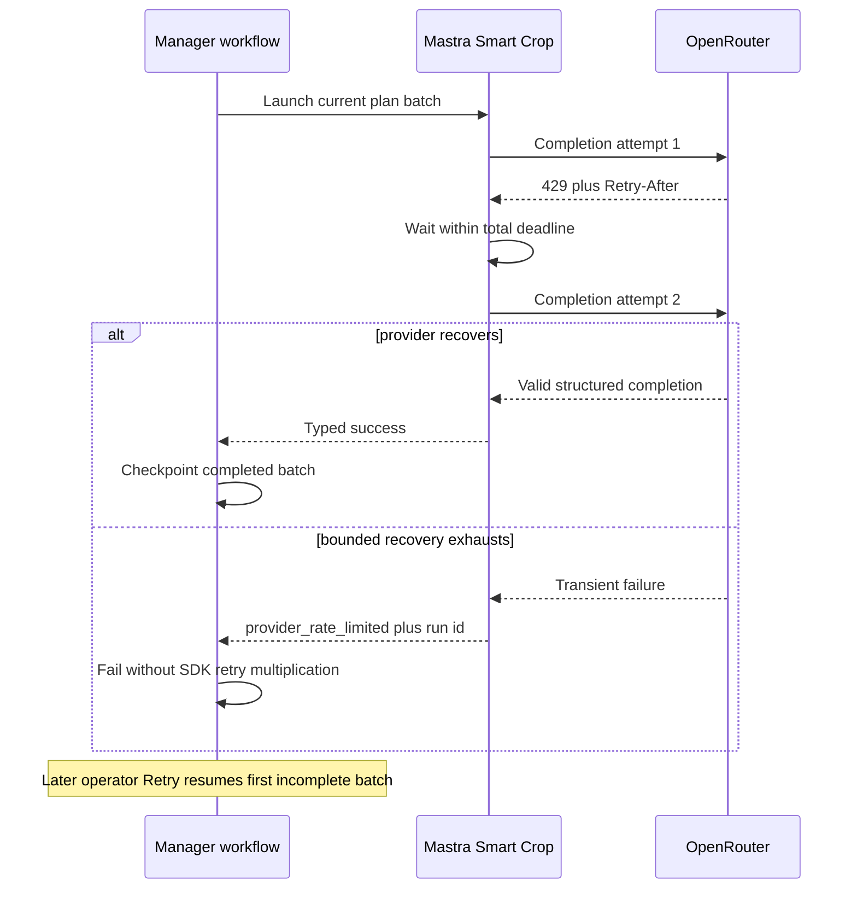

# fix: Add Robust Smart Crop Provider Recovery

## Summary

Make Smart Crop recover from short OpenRouter throttling and provider outages
inside Mastra, use the configured paid-key preference, and preserve the exact
sanitized terminal cause when recovery is exhausted. Manager will keep its
existing durable batch checkpoints and later operator retry path without
immediately multiplying an already-exhausted provider retry loop.

## Problem Frame

Production job `cmrkurmzc007wmy019s6wkbuf` failed during its first Smart Crop
plan batch. Four Mastra runs each made one OpenRouter request and received HTTP
429, while Manager's workflow SDK retried the whole step three times. Mastra
then lost the nested typed failure when reading the failed workflow result, so
Manager persisted only `smart crop plan workflow run did not succeed` rather
than the rate-limit cause or Mastra run id.

The current provider client discards `Retry-After`, does not retry at the
provider boundary, and treats every 429/5xx as a generic retryable provider
failure. Plan, QA, and repair also read `OPENROUTER_API_KEY` directly even
though Forge's shared credential contract prefers `OPENROUTER_API_PAID_KEY`.

## Requirements

### Credential selection

- R1. Smart Crop plan, QA, and repair must use the existing OpenRouter
  credential preference: an explicit call override first, then
  `OPENROUTER_API_PAID_KEY`, then `OPENROUTER_API_KEY`.

### Provider recovery

- R2. The shared Smart Crop OpenRouter client must recover automatically from
  bounded transient failures that explicitly confirm a safe retry, including
  HTTP 429, HTTP 503, and equivalent embedded OpenRouter errors in an HTTP 200
  completion. Ambiguous transport failures must terminate without an automatic
  provider retry because Chat Completions has no documented idempotency key.
- R3. Provider retries must honor a valid `Retry-After`, use bounded
  exponential backoff with jitter when it is absent, and remain inside one
  total deadline strictly below Manager's 120-second Mastra timeout. A valid
  `Retry-After` is a minimum delay; if it exceeds the per-delay ceiling or the
  remaining deadline, recovery must stop rather than retry early.
- R4. Exactly one layer must own automatic provider recovery. After the local
  attempt/deadline budget is exhausted, Manager must not immediately replay
  another complete provider retry loop.

### Failure propagation

- R5. Exhausted rate limiting must cross the Mastra-to-Manager contract as a
  distinct `provider_rate_limited` reason with a sanitized message, attempt
  count, and Mastra run id. It must map to service-unavailable HTTP semantics
  even though it is terminal for automatic workflow retries.
- R6. Mastra workflow launchers must recover typed failures from the real
  failed `WorkflowResult`, including failed-step errors, rather than replacing
  them with a generic fallback.
- R7. Manager's existing Last error and step error surfaces must include the
  typed reason, sanitized provider context, and Mastra run id without exposing
  API keys, raw prompts, frame URLs, or arbitrary provider bodies.

### Operator recovery

- R8. A later operator Retry must remain available for failed jobs and must
  resume the first incomplete plan batch from the existing fingerprint-bound
  checkpoint instead of paying again for completed batches.

### Non-retryable failures

- R9. Authentication failures, invalid requests, payment/credit failures, and
  invalid model output must not enter the transient retry loop.

## Key Technical Decisions

- KTD1. Put retry ownership in the shared `postChatCompletion` provider client
  used by plan, QA, and repair. Mastra's fixed workflow retry settings cannot
  honor response-specific `Retry-After`, and Manager-level retries replay more
  of the pipeline than necessary.
- KTD2. Use three total provider attempts under one overall provider-operation
  deadline. Each fetch receives only the remaining budget; waits are capped by
  the per-delay ceiling and deadline only when using fallback backoff. A valid
  provider delay is never shortened: recovery stops if the full delay cannot
  fit. Inject sleep, clock, and jitter hooks so timing coverage remains
  deterministic.
- KTD3. Parse OpenRouter error metadata into an allowlisted internal category,
  including errors embedded in successful HTTP responses. Emit structured
  retry, recovered, and exhausted events containing only status, category,
  attempts, and retry timing; never forward or log raw bodies.
- KTD4. Add `provider_rate_limited` to the strict cross-app failure union.
  Exhaustion is `retryable: false` in this contract because that flag means
  immediate workflow-SDK retryability, not whether a human may retry the failed
  job later.
- KTD5. Preserve Manager's existing plan-progress artifact and Retry route.
  The current checkpoint already records only completed batches with
  fingerprint provenance, so recovery needs regression coverage rather than a
  new persistence design.
- KTD6. Traverse only the known Mastra failed-result surfaces with bounded,
  cycle-safe inspection. This keeps failure extraction robust without turning
  arbitrary runtime objects into unbounded recursive parsing.

## Terminal Failure Classification

| Provider outcome                                                                      | Local recovery                                     | Mastra reason                                 | `retryable` | Mastra route status      | Manager behavior                             |
| ------------------------------------------------------------------------------------- | -------------------------------------------------- | --------------------------------------------- | ----------- | ------------------------ | -------------------------------------------- |
| HTTP 429 or embedded `rate_limit_exceeded` exhausts three attempts/deadline           | Stop                                               | `provider_rate_limited`                       | `false`     | 503                      | `FatalError`; operator may retry later       |
| HTTP 503 or embedded provider unavailable/overloaded exhausts three attempts/deadline | Stop                                               | `provider_failed`                             | `false`     | 502                      | `FatalError`; operator may retry later       |
| Provider transport fails without a response                                           | Do not automatically retry the non-idempotent POST | `provider_failed`                             | `false`     | 502                      | `FatalError`; operator may retry later       |
| Manager cannot reach Mastra                                                           | No provider request is known to have started       | `network_error`                               | `true`      | n/a                      | Existing Manager workflow retry remains      |
| Invalid request, auth/credit rejection, or invalid output                             | Do not retry                                       | Existing specific reason or `provider_failed` | `false`     | Existing 4xx/5xx mapping | `FatalError` or existing QA-unavailable rule |

The `retryable` field describes immediate workflow-SDK retryability. Failed-job
operator Retry eligibility remains based on job status, so every terminal row
above can still be retried later without changing this table.

## Assumptions

- OpenRouter's configured paid key is the intended operational credential, but
  rate-limit recovery does not rotate between keys or models because keys may
  share account limits and model changes can alter crop semantics.
- Provider-local recovery covers transient 429, documented provider-unavailable
  responses, and their typed embedded equivalents. Ambiguous transport failures
  terminate because a retry can duplicate a paid non-idempotent completion.
- The existing failed-job Retry button is the operator-controlled delayed retry
  mechanism; this change does not add automatic scheduling or a new queue.
- The production attempt cap remains three. The provider deadline, fallback
  delay ceiling, and backoff values may be reduced during implementation if
  focused budget tests show insufficient margin inside Manager's 120-second
  client timeout.

## High-Level Technical Design

## Scope Boundaries

In scope:

- Shared OpenRouter retry/deadline/error parsing for Smart Crop plan, QA, and
  repair.
- Preferred credential selection across the three Smart Crop vision workflows.
- Strict failure-contract and failed-workflow-result extraction changes in
  Mastra and Manager.
- Manager terminal error correlation and checkpoint/manual-retry regression
  coverage.
- Focused operator-facing browser proof using the existing Last error surface.

Out of scope:

- Alternate-provider, alternate-model, or key-rotation failover.
- New database tables, queues, scheduled retries, or artifact formats.
- Changes to crop planning semantics, QA verdict policy, alignment, rendering,
  or crop-worker ownership.
- Production configuration mutation, job retriggering, or deployment from this
  worktree.

### Deferred to Follow-Up Work

- Proactive key-limit monitoring through OpenRouter's key-usage endpoint.
- Fleet-wide retry coordination or a circuit breaker if concurrent Smart Crop
  volume grows beyond the current job-level recovery model.
- A dedicated structured diagnostics panel if operators outgrow the existing
  error and step-detail surfaces.

## Implementation Units

### U1. Add provider-owned bounded recovery and preferred credentials

**Goal:** Make all Smart Crop vision calls use the intended credential and
recover from short-lived provider failures inside one bounded operation.

**Requirements:** R1, R2, R3, R4, R9.

**Dependencies:** None.

**Files:**

- Modify `apps/mastra/src/services/smart-crop/openrouter-vision.ts`.
- Create `apps/mastra/src/services/smart-crop/openrouter-vision.test.ts`.
- Modify `apps/mastra/src/mastra/workflows/smart-crop-plan.ts`.
- Modify `apps/mastra/src/mastra/workflows/smart-crop-qa.ts`.
- Modify `apps/mastra/src/mastra/workflows/smart-crop-repair.ts`.
- Modify `apps/mastra/src/mastra/workflows/smart-crop-plan.test.ts`.
- Modify `apps/mastra/src/mastra/workflows/smart-crop-qa.test.ts`.
- Modify `apps/mastra/src/mastra/workflows/smart-crop-repair.test.ts`.

**Approach:** Rework the single-fetch completion helper into a shared retry
loop for explicit 429/503 outcomes with a total deadline, three-attempt cap,
injectable timing hooks, standard `Retry-After` parsing, capped exponential
fallback with jitter, and a fresh per-attempt abort budget. Treat a valid
`Retry-After` as a minimum and terminate recovery when it cannot fit; never
clamp it into an early request. Parse provider error envelopes before extracting
completion content so HTTP-200 embedded errors follow the same classification.
Treat ambiguous transport failures as terminal. Use `getOpenRouterApiKey()` at
each workflow boundary while retaining explicit test/caller overrides.

**Execution note:** Start with focused provider-client tests for one 429 followed
by success and for repeated 429 exhaustion before changing workflow wiring.

**Patterns to follow:** `apps/mastra/src/services/offline-search-eval/judge.ts`,
`apps/mastra/src/services/firecrawl-client.ts`, and
`apps/mastra/src/services/admin-search-eval-client.ts` for injected sleep,
attempt caps, `Retry-After`, and typed exhaustion.

**Test scenarios:**

- HTTP 429 with delta-seconds `Retry-After`, then a valid completion, makes two
  provider calls and sleeps for at least the provider delay.
- HTTP 429 with an HTTP-date `Retry-After` uses the future date; malformed or
  past values use the capped jittered fallback.
- A retry delay beyond the remaining deadline stops without sleeping past the
  budget or starting another attempt.
- A valid `Retry-After` beyond the per-delay ceiling also stops recovery rather
  than being shortened into an early retry.
- HTTP 503 and its HTTP-200 embedded-error equivalent recover when a later
  attempt succeeds.
- A transport failure without a provider response makes exactly one call and
  returns a sanitized terminal provider failure.
- Persistent 429 performs exactly the configured attempt count and returns a
  sanitized rate-limit exhaustion error.
- Persistent 503 performs exactly the configured attempt count, returns a
  terminal `provider_failed` error, and cannot trigger a second Manager-owned
  provider loop.
- HTTP 400/401/402/403 and invalid JSON/schema output make one call only.
- Retry attempts preserve the same model and request body and never rotate API
  keys or models.
- Provider content containing a fake credential, prompt fragment, or frame URL
  never appears in thrown messages or structured logs.
- Structured logs distinguish retry, recovered, and exhausted operations with
  attempt counts and timing but no request/response content.
- When both key env vars exist, paid is used; when only the legacy key exists,
  it is used; an explicit option override wins over both.

**Verification:** Focused provider and workflow tests demonstrate bounded timing,
classification, credential precedence, and no secret/raw-body propagation.

### U2. Preserve exact typed failures across Mastra workflow results

**Goal:** Keep the original provider failure and run id when a Mastra workflow
records a failed step.

**Requirements:** R5, R6, R7.

**Dependencies:** U1.

**Files:**

- Modify `apps/mastra/src/services/smart-crop/workflow-failure.ts`.
- Create `apps/mastra/src/services/smart-crop/workflow-failure.test.ts`.
- Modify `apps/mastra/src/mastra/workflows/smart-crop-plan.ts`.
- Modify `apps/mastra/src/mastra/workflows/smart-crop-plan.test.ts`.
- Modify `apps/mastra/src/mastra/workflows/smart-crop-qa.test.ts`.
- Modify `apps/mastra/src/mastra/workflows/smart-crop-repair.test.ts`.

**Approach:** Add `provider_rate_limited` to the shared Zod failure union and
route it as HTTP 503. Extend failed-result extraction across top-level errors
and known failed-step/snapshot fields using bounded, cycle-safe traversal. Keep
the existing prefixed typed error as the serialization boundary and ensure plan,
QA, and repair all return the same terminal envelope after provider exhaustion.

**Patterns to follow:** Existing `SmartCropWorkflowFailureError`,
`smartCropFailureFromUnknown`, and Mastra's documented failed
`WorkflowResult.error` and `WorkflowResult.steps` surfaces.

**Test scenarios:**

- A realistic failed workflow result with the prefixed error nested on a failed
  step returns the exact typed reason, message, retryability, and run id.
- Top-level error extraction remains unchanged.
- Cyclic, excessively deep, and unrelated result objects return no failure
  without throwing.
- An exhausted 429 becomes `provider_rate_limited`, `retryable: false`, and HTTP
  503; it does not become the generic `workflow run did not succeed` fallback.
- An exhausted 503 or a terminal transport failure becomes `provider_failed`,
  `retryable: false`, and cannot trigger Manager SDK provider retries.
- Plan, QA, and repair preserve rate-limit exhaustion and do not silently turn
  it into an unavailable QA verdict.

**Verification:** Tests use the actual Mastra failed-result shape and prove exact
typed propagation rather than only direct-run or synthetic wrapper behavior.

### U3. Stop Manager retry amplification and preserve operator recovery

**Goal:** Make exhausted provider recovery terminal for the current workflow
attempt while keeping exact diagnostics and checkpointed manual recovery.

**Requirements:** R4, R5, R7, R8.

**Dependencies:** U2.

**Files:**

- Modify `apps/manager/src/services/mastra-smart-crop.ts`.
- Modify `apps/manager/src/services/mastra-smart-crop.test.ts`.
- Modify `apps/manager/src/workflows/smartCrop.ts`.
- Modify `apps/manager/src/workflows/smartCrop.test.ts`.
- Modify `apps/manager/src/features/smart-crop/smart-crop-presenter.test.ts`
  only if presenter formatting changes.

**Approach:** Extend Manager's duck-typed failure union with
`provider_rate_limited`, preserve typed non-2xx envelopes, and include the
Mastra run id in the step error text. Treat provider-local exhaustion as
terminal for SDK auto-retry via the existing `FatalError` path. Leave
Manager-to-Mastra transport failures retryable because that is a separate
boundary. Do not alter Retry route eligibility, `force:false` behavior, or the
plan-progress artifact.

**Patterns to follow:** `throwStepFailure`, the existing cross-realm
`errorMessage` handling, plan-progress checkpoint resume, and the current
verbatim Last error rendering in the Smart Crop job detail.

**Test scenarios:**

- A typed exhausted rate limit is parsed before HTTP fallback and retains its
  message and Mastra run id.
- The plan step throws terminal-for-SDK `FatalError` for
  `provider_rate_limited`, so Manager does not make another Mastra launch.
- Other provider-local terminal failures also throw `FatalError` according to
  the terminal classification table.
- Manager-to-Mastra `network_error` remains a retryable `SmartCropStepError`.
- If earlier plan batches are checkpointed and the next batch exhausts rate
  recovery, a later bodyless operator Retry launches only the first incomplete
  batch and keeps earlier segments/token usage.
- The persisted Last error contains `provider_rate_limited`, HTTP 429/attempt
  context, and the Mastra run id while excluding raw provider data.

**Verification:** Manager client and workflow tests prove one automatic retry
owner, exact correlation, unchanged manual Retry availability, and no completed
batch replay.

### U4. Document and prove the operational recovery contract

**Goal:** Make the retry owner, deadline nesting, credential preference, and
operator recovery path durable and visually verifiable.

**Requirements:** R1, R3, R4, R7, R8.

**Dependencies:** U1, U2, U3.

**Files:**

- Modify `apps/mastra/CLAUDE.md`.
- Modify `apps/manager/CLAUDE.md`.
- Modify `docs/roadmap/media-generation/feat-173-smart-crop-video-reframing.md`.
- Modify `docs/plans/2026-07-14-002-fix-smart-crop-provider-recovery-plan.md`.
- Create or update a focused entry under `docs/solutions/` during the compound
  phase if implementation yields a reusable retry-ownership lesson.

**Approach:** Record that Smart Crop's provider client is the only automatic
provider retry owner, the provider operation must finish below Manager's client
timeout, paid-key preference applies to all vision workflows, and exhausted
provider recovery remains manually retryable through checkpoint resume. Use a
local failed-job fixture or equivalent seeded state to verify the existing job
detail surface shows the exact sanitized cause and run id. Document the
structured `provider_retry`, `provider_recovered`, and `provider_exhausted`
events so the normal post-deploy observability review can compare recovery
benefit against added request volume and latency without adding a new metrics
service in this PR.

**Patterns to follow:** Existing feat-173 operational contract notes and
`docs/solutions/best-practices/external-client-retry-parity-in-runner-fanout-20260512.md`.

**Test scenarios:**

- Browser smoke opens a failed Smart Crop job detail and shows the typed rate
  limit cause plus Mastra run id in Last error.
- The Retry action remains visible for the failed job.
- No visual regression is introduced in the summary or step table.
- Structured retry logs make attempts, recovered operations, exhausted
  operations, and operation latency queryable after the normal deployment.

**Verification:** Package guides and roadmap describe the implemented contract,
targeted tests pass, and browser proof confirms the operator sees the actionable
failure without a UI redesign.

## System-Wide Impact

- **Operators:** Failed Smart Crop jobs self-recover from short throttling and
  expose a correlated terminal reason when they cannot recover.
- **Manager:** Durable orchestration and checkpoint ownership remain unchanged;
  only failure classification/correlation changes.
- **Mastra:** The shared Smart Crop provider client becomes the bounded retry
  owner for plan, QA, and repair.
- **OpenRouter:** Request bursts become paced by server guidance and one attempt
  budget instead of repeated workflow launches.
- **Security/privacy:** Diagnostics are an allowlist of operational fields; raw
  provider bodies and request content remain excluded.

## Risks & Mitigations

| Risk                                                                                          | Mitigation                                                                                                                                            |
| --------------------------------------------------------------------------------------------- | ----------------------------------------------------------------------------------------------------------------------------------------------------- |
| Provider waits consume Manager's outer timeout and collapse into a generic transport failure. | Enforce one total provider deadline below 120 seconds; give fetches only the remaining budget and stop when a full provider-directed wait cannot fit. |
| Retrying a non-idempotent completion duplicates cost after an ambiguous transport failure.    | Retry only explicit 429/503 or typed embedded equivalents; treat no-response transport failures as terminal.                                          |
| Inner retries combine with Manager retries and create another burst.                          | Mark provider-local exhaustion terminal for SDK retry and test the Mastra launch count.                                                               |
| A strict wire-union update breaks Manager parsing.                                            | Change Mastra schema, route status, Manager parser, and contract tests in the same unit.                                                              |
| Nested failure traversal walks arbitrary/cyclic runtime objects.                              | Limit traversal to known fields with a depth/node bound and visited-object set.                                                                       |
| Provider errors leak prompts, image URLs, or credentials to logs/UI.                          | Derive messages only from allowlisted status/type/attempt fields and test with hostile fake provider content.                                         |
| Paid-key preference is mistaken for rate-limit evasion.                                       | Never rotate keys on failure; document that the preference is configuration consistency, not additional quota.                                        |

## Acceptance Examples

- AE1. Given OpenRouter returns 429 with `Retry-After` and the next attempt
  succeeds, when Smart Crop plans a batch, then one Mastra run waits as directed,
  returns the valid plan, and Manager checkpoints the batch.
- AE2. Given OpenRouter remains rate-limited through the local attempt/deadline
  budget, when the plan run ends, then Manager receives
  `provider_rate_limited` with HTTP 429/attempt context and the Mastra run id,
  performs no immediate SDK retry, and shows the cause in Last error.
- AE3. Given two plan batches are already checkpointed and the third exhausts
  provider recovery, when an operator later retries the failed job without
  force, then Manager launches only the third batch and retains the earlier
  segments and usage.
- AE4. Given paid and legacy OpenRouter keys are both configured, when plan, QA,
  or repair calls the provider, then the paid key is used and a 429 never causes
  key or model rotation.
- AE5. Given Mastra returns a failed `WorkflowResult` whose typed error is on a
  failed step, when the route launcher reads it, then the exact reason, message,
  retryability, and run id survive instead of the generic fallback.
- AE6. Given an auth, payment, invalid-request, or invalid-output failure, when
  Smart Crop handles the response, then it makes no transient retry and exposes
  a sanitized terminal failure.
- AE7. Given a transport failure with no provider response or an exhausted 503,
  when Smart Crop handles the failure, then it terminates the current provider
  operation without a second Manager-owned provider loop and remains available
  for later operator Retry.

## Verification

- `pnpm --filter @forge/mastra test -- src/services/smart-crop/openrouter-vision.test.ts src/services/smart-crop/workflow-failure.test.ts src/mastra/workflows/smart-crop-plan.test.ts src/mastra/workflows/smart-crop-qa.test.ts src/mastra/workflows/smart-crop-repair.test.ts`
- `pnpm --filter @forge/mastra typecheck`
- `pnpm --filter @forge/mastra lint`
- `pnpm --filter @forge/manager test -- src/services/mastra-smart-crop.test.ts src/workflows/smartCrop.test.ts src/features/smart-crop/smart-crop-presenter.test.ts`
- `pnpm --filter @forge/manager typecheck`
- `pnpm --filter @forge/manager lint`
- `git diff --check`
- Browser smoke against a local failed Smart Crop job detail showing the typed
  provider cause, Mastra run id, and Retry action.

## Sources / Research

- `docs/plans/2026-06-09-002-feat-smart-crop-plan.md` defines the current
  Manager/Mastra/crop-worker ownership, typed failure envelope, and per-batch
  checkpoint contract.
- `docs/solutions/architecture-patterns/smart-crop-three-app-decomposition-20260610.md`
  preserves Manager durability, Mastra synchronous AI decisions, and
  crop-worker byte ownership.
- `docs/solutions/best-practices/external-client-retry-parity-in-runner-fanout-20260512.md`
  establishes provider-client retry ownership and `Retry-After` parity.
- [OpenRouter errors and debugging](https://openrouter.ai/docs/api/reference/errors-and-debugging)
  documents 429/503, error metadata, embedded completion errors, and safe
  debugging constraints.
- [OpenRouter rate limits](https://openrouter.ai/docs/api/reference/limits)
  documents account/key rate-limit behavior.
- [Mastra workflow error handling](https://mastra.ai/docs/workflows/error-handling)
  and [workflow start results](https://mastra.ai/reference/workflows/run-methods/start)
  document failed `WorkflowResult` and failed-step error surfaces.
- [RFC 9110 Retry-After](https://www.rfc-editor.org/rfc/rfc9110.html#section-10.2.3)
  defines both delta-seconds and HTTP-date parsing.
- [AWS timeouts, retries, and jitter](https://aws.amazon.com/builders-library/timeouts-retries-and-backoff-with-jitter/)
  explains retry amplification and bounded jittered backoff.
