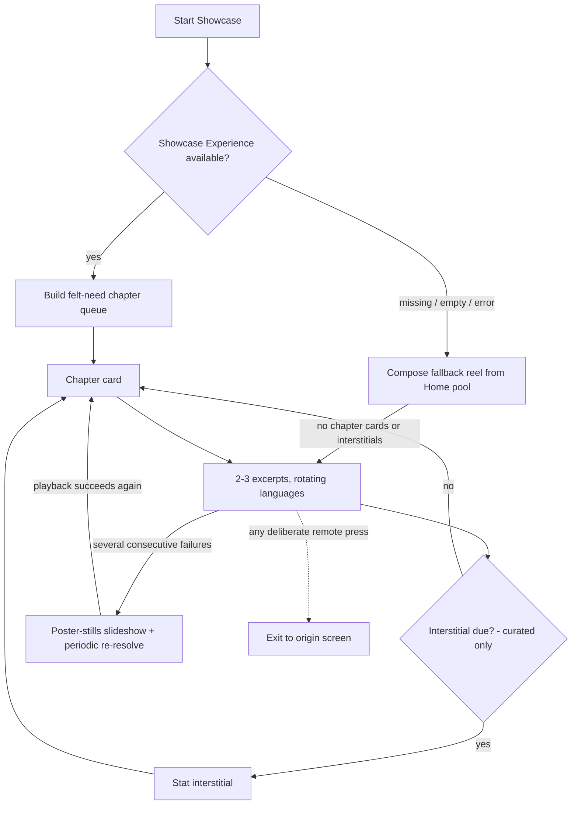
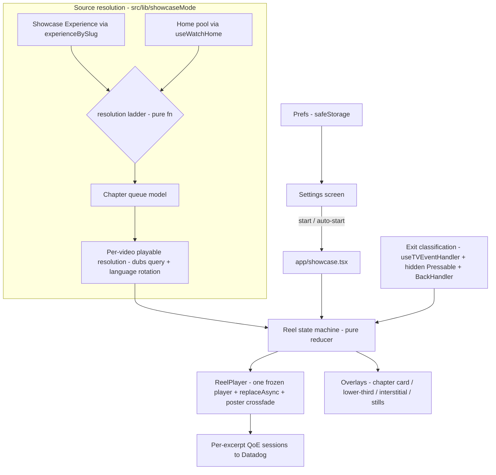
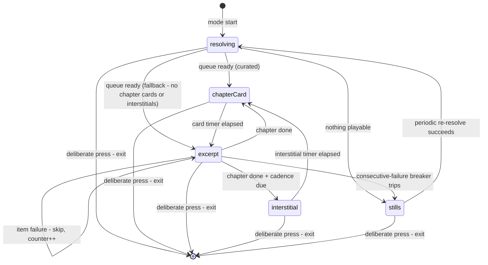

# TV Showcase Mode - Plan

## Goal Capsule

- **Objective:** Ship a public Showcase Mode in `apps/tv`: a Settings tab on Home whose only v1 content, Showcase Mode (a start action plus an auto-start toggle), starts a self-running reel of short catalog excerpts, organized as felt-need chapters across many languages, so office visitors and end users see the volume, variety, and breadth of Jesus Film content.
- **Product authority:** This Product Contract. Open product questions route to urim (owner); the feature was requested by the project's product leader.
- **Execution profile:** All work in `apps/tv` (plus one dependency addition to `apps/tv/package.json`). No admin, web, or mobile changes. Conventional commits (`feat:`), squash-merge PR to `main`.
- **Stop conditions:** Surface (do not guess through) any contradiction with the Product Contract, any evidence during soak of decoder contention or unbounded memory growth, or any need for an admin schema change.
- **Open blockers:** None. The curated reel needs a CMS-authored Showcase Experience before office launch; the fallback reel covers the interim, so this is an operational launch dependency, not an implementation blocker.
- **Product Contract preservation:** changed R5, R9, R12; added R16-R18 and AE7-AE8. All are platform-honesty amendments (terminal degraded state, deliberate-press exit classification, stat sourcing, prefetch/keep-awake mechanics) confirmed with the owner in planning dialogue on 2026-07-15.

---

## Product Contract

### Summary

Add a Settings tab to TV Home and a Showcase Mode behind it: a continuously looping reel of short excerpts from the live catalog, structured as felt-need chapters (chapter card, then two to three excerpts each in a different language) with periodic full-screen stat interstitials that state the breadth claim in real numbers. The reel plays from a CMS-authored Showcase Experience and falls back to a client-composed reel from the existing Home pool; when nothing is playable at all it degrades to a poster-stills slideshow, never an error screen.

### Problem Frame

Office TVs at the ministry sit dark or idle on the app's Home screen when stakeholders and clients visit, and nothing today communicates what the ministry's library actually contains: videos addressing roughly 50-60 felt-need categories, dubbed into hundreds of languages, with AI pipelines growing both counts continuously. A hand-cut sizzle reel would stale immediately against that growth, and it would not demonstrate the actual product. The value lives in the real app playing real catalog data, so the breadth on screen is verifiably live.

### Key Decisions

- **Name: Showcase Mode.** Chosen over the originally proposed "Display Mode" and "Kiosk Mode": kiosk is operator jargon, and display reads like a hardware setting to consumers. (Code modules use a `showcaseMode` prefix — see KTD-7 — because `apps/tv` already uses the bare word "showcase" for Home's focus-driven hero.)
- **Public consumer feature, not office-gated.** The mode ships visible to all users as an ambient/showcase feature. Consequence: consumer-safe defaults everywhere — deliberate-press exit, no auto-start unless enabled, no way to get trapped.
- **Curation: admin-curated Showcase Experience with a client fallback.** A CMS-authored Experience is the source of truth, fetched through the existing public by-slug Experience query, so no admin code changes. When it is missing, empty, or unfetchable, the client composes a fallback reel from the Home pool. Updating the reel is a CMS edit, not an app release.
- **Excerpts are existing catalog videos, not clip machinery.** Nothing in the schema marks in/out timecodes, and the catalog already contains short-form items (`SEGMENT`, `TRAILER`, `SHORT_FILM` labels). The reel prefers those whole items; longer items play one bounded window.
- **Felt-need labels come from Experience authoring.** No felt-need taxonomy is queryable from TV's GraphQL surface, so chapter names and groupings are supplied by the curated Experience's sections. The fallback reel, lacking those labels, plays a simpler variety sequence without felt-need chapter cards or stat interstitials.
- **Exit model: any deliberate press exits, including play/pause.** Uniform v1 semantics; touchpad rests and swipes are ignored (the Siri remote fires events from a resting finger). A pause control is deferred.
- **Stat numbers: curator-authored globals plus live per-video counts.** The public API has no aggregate counts, so global figures (total languages, felt needs, catalog volume) are authored into the Showcase Experience; per-video dub counts are computed live from the video's dub list.
- **Screen shape: chapter journey with minimal chrome plus stat interstitials.** The felt-need structure carries the variety story, per-excerpt language rotation carries the language story, interstitials carry the volume story, and the video itself stays nearly chrome-free.

### Actors

- A1. Office operator: ministry staff who starts the mode before a visit or enables auto-start on an office TV.
- A2. Visiting stakeholder or client: passive viewer and the mode's primary audience.
- A3. End consumer: any TV app user who discovers the setting; must be able to exit instantly and never be trapped.
- A4. Content curator: whoever holds CMS access and authors or refreshes the Showcase Experience.

### Requirements

**Settings surface**

- R1. Home's floating top tab bar gains a Settings tab alongside Search and Home, opening a new D-pad-navigable Settings screen.
- R2. The Settings screen's only v1 content is Showcase Mode: a start action plus an "Auto-start when the app opens" toggle, default off.
- R3. Showcase settings persist on-device across app restarts.

**Reel sourcing**

- R4. At mode start, the reel loads a CMS-authored Showcase Experience by slug via the existing public Experience query; its sections define the felt-need chapters and each chapter's ordered videos.
- R5. When the Showcase Experience is missing, empty, or unfetchable, the mode composes a fallback reel from the Home pool.
- R6. An excerpt is a bounded portion (target 20-40 seconds) of an existing catalog video; short-form items play from the start, longer items play one bounded window. No excerpt plays into the video's final five seconds, where end credits sit; an item too short to clear that tail and still meet the 20-second floor plays out in full instead.
- R7. Consecutive excerpts within a chapter play different languages (Dubs) where available, chosen from each video's dub list; a full loop should surface many distinct languages.
- R16. Failures degrade down a ladder, never to an error screen: an unplayable item is skipped within a few seconds; a chapter with no playable items is skipped whole (its chapter card never shows alone); after several consecutive failures the reel stops fast-skipping and enters a poster-stills slideshow that re-attempts resolution periodically and rejoins the reel when playback succeeds.
- R17. The first excerpt's video is visible within about five seconds of mode start on office network conditions, and the next excerpt's data (stream choice, poster) is prefetched while the current one plays.

**Presentation**

- R8. Each chapter renders as: a full-screen chapter card naming the felt need (about 5 seconds), then its excerpts with minimal chrome (a brief lower-third at excerpt start with title, felt need, and language, decaying to a small persistent language tag).
- R9. Every few chapters, a full-screen stat interstitial presents the breadth claim with real numbers: global figures authored in the Showcase Experience by the curator, per-video dub counts computed live. Interstitials render only when authored stats exist; the fallback reel skips the interstitial branch entirely (matching its lack of chapter cards) rather than presenting a single video's dub count as the breadth claim.
- R10. Audio is on: each excerpt plays its selected Dub's audio at system volume.
- R11. Transitions between reel items are seamless (no black flashes) without ever running two video decoders concurrently; crossfades use posters or stills, honoring the documented single-decoder rule.

**Mode behavior**

- R12. Any deliberate remote press — D-pad direction, select, play/pause, menu/back — exits the mode immediately and returns to the screen it was started from; touchpad rests, pans, swipes, and synthetic focus events are ignored.
- R13. With auto-start enabled, the app enters Showcase Mode automatically after launch, so an office TV that power-cycles recovers without human intervention.
- R14. The mode runs unattended for hours: the screen stays awake (no system screensaver, including across poster-gap transitions), and memory stays stable across long sessions.
- R15. The mode reports as a distinct RUM view with playback QoE signals, consistent with the app's existing Datadog conventions.
- R18. Navigating away from the showcase (deep link, route change, app background) stops the reel and releases the decoder and keep-awake claims.

### Key Flows

- F1. Operator starts the showcase
  - **Trigger:** A1 opens the new Settings tab before a stakeholder visit.
  - **Steps:** Home, Settings tab, Start Showcase; optionally enables auto-start for that TV.
  - **Outcome:** The first excerpt is playing within about five seconds; the TV can be left unattended. **Covers R1, R2, R13, R17.**
- F2. The reel loop
  - **Trigger:** Mode start (manual or auto-start).
  - **Steps:** Load the Showcase Experience (or fall back), build the chapter queue, prefetch the first items, then cycle: chapter card, excerpts with language rotation, interstitial on cadence; failed items degrade down the R16 ladder; on queue exhaustion, reload and loop, picking up any CMS edits.
  - **Outcome:** An indefinitely running, current reel. **Covers R4-R9, R11, R14, R16, R17.**
- F3. A viewer exits
  - **Trigger:** Any deliberate remote press by A2 or A3 during any reel state (chapter card, excerpt, interstitial, stills).
  - **Steps:** Playback stops immediately; navigation returns to the origin screen with focus restored.
  - **Outcome:** No trapped users; the auto-start setting is unchanged. **Covers R12.**

### Acceptance Examples

- AE1. **Covers R5.** Given no Showcase Experience is published, when the mode starts, then the fallback reel plays real catalog content and no blank or error state appears.
- AE2. **Covers R2, R12.** Given a consumer starts the mode and presses any deliberate remote button, then the reel stops at once, they return to where they were, and auto-start remains off.
- AE3. **Covers R13.** Given auto-start is enabled and the TV power-cycles overnight, when the app relaunches, then the showcase resumes without anyone touching a remote.
- AE4. **Covers R7.** Given a chapter video has only one Dub, then language rotation skips it without error and no false language claim appears on screen.
- AE5. **Covers R16.** Given a stream fails mid-excerpt, then the reel advances to the next item within a few seconds instead of stalling.
- AE6. **Covers R14.** Given the mode runs for four or more hours, then no system screensaver appears and playback is still advancing.
- AE7. **Covers R16.** Given the network drops entirely mid-reel, then the mode shows the poster-stills slideshow (no error screen, no fast-skip strobe) and rejoins the reel when the network returns.
- AE8. **Covers R12.** Given a finger rests on or swipes the Siri remote touchpad, the reel keeps playing; given select or play/pause is pressed, the mode exits.

### Success Criteria

- Five-minute glance test: any five-minute slice of the reel shows at least two felt-need chapters, at least three distinct languages, and one stat interstitial.
- A multi-hour unattended soak passes on both office platforms (Apple TV and Android TV hardware).
- A CMS edit to the Showcase Experience appears in the reel on its next loop or mode restart, with no app release.
- The product leader signs off that the reel reads as intriguing, engaging, diverse, and attractive to a walk-past viewer.

### Scope Boundaries

**Deferred for later**

- AI-assembled reel: tracked as `docs/roadmap/topic-experiences/feat-255-ai-assembled-showcase-reel.md`; the Showcase Experience contract is the seam it slots into.
- Idle auto-start (screensaver-style trigger after inactivity on any screen). V1 auto-start is launch-only — one exit ends the demo until relaunch; note this in the operator-facing description on the Settings screen.
- A pause control (play/pause exits in v1).
- Web and mobile ambient reuse of the showcase.
- Any additional settings on the Settings screen.

**Not in scope**

- Admin code or schema changes; the curated source is CMS content authoring only.
- Clip-marker or chaptering machinery for in-video timecodes.
- Offline or downloaded reel playback.

### Dependencies / Assumptions

- A curator (A4) authors the Showcase Experience (authoring contract: KTD-10) before office launch; until then office TVs run the fallback reel, which has no felt-need chapter labels and no stat interstitials. Authoring is scheduled alongside U2-U4 and routed to urim as owner until a curator is named; it is tracked in feat-254 alongside the hardware soak.
- One new native dependency: `expo-keep-awake` (officially supports tvOS and Android TV in SDK 54). Requires a prebuild; no config plugin.
- Assumption (content-side, unverified): the catalog holds enough short-form items per felt need to fill chapters; if thin, chapters shrink to what exists.
- Verified against source: TV already uses the public by-slug Experience query (`apps/tv/src/lib/queries.ts`); dubs expose `hls`, `duration`, and language names (`apps/tv/src/lib/videoQueries.ts`); `SEGMENT` and `TRAILER` labels exist (`apps/tv/src/lib/watchHome/model.ts`); no felt-need taxonomy exists in the schema; the single-decoder constraint is documented in `docs/solutions/ui-bugs/tv-backdrop-videoview-decoder-starvation-overlay-20260611.md`.
- The Home pool (`apps/tv/src/hooks/useWatchHome.ts`) carries no stream URLs or dub lists by design (the 9.5MB payload rule) — both reel paths resolve playable sources through the per-video query (KTD-4).

---

## Planning Contract

### Key Technical Decisions

- KTD-1. **Showcase is a dedicated Expo Router route (`app/showcase.tsx`) that claims decoder exclusivity through a new `decoderClaimed` flag.** A route gets the RUM view, back-stack return-to-origin, and screen lifecycle for free. While active it must be the app's only decoder consumer. The existing `VideoPlayerContext.isVisible` cannot be reused — its setter also mounts the fullscreen player overlay — so U4 adds a `decoderClaimed` boolean to `VideoPlayerContext` (claimed on showcase mount, released on unmount) and OR-merges it into the two existing `overlayVisible` consumers (`apps/tv/app/watch/[slug].tsx`, `apps/tv/src/components/sections/VideoHeroRenderer.tsx`), which release their decode slot by unmounting their `VideoView` — unmount, not pause; a paused mounted view still holds a tvOS decode slot. Home renders no `VideoView`, so no Home-side change is needed.
- KTD-2. **One long-lived player, sources swapped with `replaceAsync`, advance driven manually.** The player is created once with a frozen source ref; every excerpt boundary is a `replaceAsync` swap behind a poster-hold crossfade; advance fires from a `playToEnd` listener (short items) or a `timeUpdate` window check (bounded windows), with `loop = false` always. Rationale: `replaceAsync` never reassigns the underlying native player, avoiding the AVPlayerViewController leak (expo/expo#46453, fix unreleased for SDK 54's expo-video 3.0.x) that the two-player ping-pong preload pattern triggers; manual advance avoids native loop's HLS re-init stall (`docs/solutions/runtime-errors/expo-video-backdrop-seamless-loop-20260609.md`). The video-ready latch resets only on genuine `error`, never on the transient `idle` blip at a swap boundary.
- KTD-3. **No second player instance; prefetch is data-only.** A second buffering player is the leak-trigger pattern above, so prefetch is limited to resolving the next excerpt's stream choice and warming its poster image while the current excerpt plays. The poster-hold crossfade absorbs the HLS load at each boundary — the same trick `VideoBackdrop` uses. Android's previous-frame flash on source swap (fixed only post-SDK54) is why the poster layer must fully cover the `VideoView` during every swap.

> **Superseded (2026-07-21, branch `fix/tv-showcase-seamless-hop`):** KTD-2/KTD-3's single-player rule is partially superseded for the showcase reel only. `ReelPlayer` now runs TWO long-lived players so language hops flip between preloaded dubs on live frames. The leak mechanism these KTDs guard against is player/view CHURN (recreating players, rebinding views), which the new design still forbids: both players are created once, each `VideoView` stays bound to its own player, and sources still move via `replaceAsync`. Ordinary excerpt boundaries keep the poster-masked single-swap behavior described here.

- KTD-4. **Both reel paths share one source-resolution pipeline.** Curated: parse the Showcase Experience's MediaCollection sections into chapters, hydrate each item's `coreId` to slug/title/image through the existing bulk video fetch (top-level-and-children index, top-level wins). Fallback: select from the already-fetched Home pool. Both then resolve playable sources per video through a lean showcase-specific operation modeled on `watchVideoFragment`'s dub selection (`variants: dubs { hls duration language { slug name } }`) but without its parents/children chain — the watch query's chain costs ~1.6s per video of data the reel never uses — and a pure language-rotation policy picks a distinct language slug per consecutive excerpt (identity by `language.slug`, never bcp47). The Experience-vs-fallback ladder is a pure function, mirroring `reconcileWatchHome`.
- KTD-5. **Remote input: an exit-classification module fed by three sources.** `useTVEventHandler` for D-pad/menu/play-pause (denylist `focus`/`blur`/`pan*`/`swipe*` as non-deliberate, mirroring `VideoPlayer.tsx`'s synthetic-event filter); a full-screen transparent focused Pressable for select — tvOS never delivers select through the global handler (react-native-tvos#904), while Android TV delivers it globally, so the exit handler must be idempotent (Android double-fires); `BackHandler` + `TVEventControl.enableTVMenuKey()` on mount / `disableTVMenuKey()` on unmount so a Menu press exits the mode instead of suspending the app to the tvOS home screen (the default Menu behavior bypasses JS entirely).
- KTD-6. **Screen keep-awake: `activateKeepAwakeAsync('showcase-mode')` for the whole session, deactivated on exit.** expo-video's `keepScreenOnWhilePlaying` (default on) only covers moments of active playback — chapter cards, interstitials, stills, and swap gaps are unprotected without it. expo-keep-awake is tag-scoped and officially TV-supported in SDK 54.
- KTD-7. **Module naming: `showcaseMode` prefix** (`src/lib/showcaseMode/`, `src/components/showcaseMode/`). The bare word "showcase" is taken: `src/components/home/showcaseState.ts` is Home's focus-driven hero canvas, an unrelated feature.
- KTD-8. **All decision logic lives in pure `.ts` modules with colocated `.test.ts`.** `apps/tv` has no component render-test harness by convention; the reel reducer, source resolution, degradation ladder, exit classification, and prefs logic are React-free modules (the `videoBackdropGate.ts` pattern). Native-dependent components are verified by simulator smoke and hardware soak.
- KTD-9. **Observability extends the existing QoE pipeline, one session per excerpt.** Each excerpt swap finalizes the previous `createVideoQoeSession` ("ended" on natural advance, "abandoned" on exit/unmount — idempotent finalize) and mints a new one keyed on the Mux playback id. The source-swap guard token prevents language-rotation swaps being counted as rebuffers. TTFF is a numeric `ttff_ms` log field, never a view timing. A once-per-mount `showcase_first_frame` view timing latch mirrors the series screen's first-rail-ready pattern. The `/showcase` route view comes free from `DatadogRouteTracker`.
- KTD-10. **Showcase Experience authoring contract** (the curator's interface and feat-255's seam), slug `tv-showcase`:
  - One MediaCollection section per felt-need chapter, in reel order: `title` = felt-need name, `subtitle` = optional one-line human framing, items ordered with `coreId` required (items without a resolvable `coreId` are dropped, matching the Home adapter's rule).
  - One MediaCollection section whose `title` is the reserved exact-match value `showcase-stats`, with `description` carrying the authored global stat lines (one claim per line); it renders as interstitial content, never as a chapter. The discriminator is the title because the admin editor exposes the title input but auto-generates MediaCollection `sectionKey`s with no UI to set them; U2's parser excludes the reserved-title section from chapters.
  - Interstitial cadence, excerpt windows, and language rotation are client-owned; the curator only orders content and writes labels/stats.

### High-Level Technical Design

Component and data flow:

Reel state machine (the pure reducer in `reelState.ts`; timers and player events are inputs, render is a projection of state):

Sequencing: U1 and U2 are independent starting points; U3 needs U2; U4 and U5 build on U3; U6 needs U3 (and U1 for auto-start); U7 threads through U4. A natural landing order is U1 → U2 → U3 → U4 → U5 → U6 → U7, one commit each.

---

## Implementation Units

### U1. Settings tab and Settings screen with persisted preferences

- **Goal:** The Home top bar gains a Settings tab; the Settings screen offers Start Showcase and the auto-start toggle, both persisted.
- **Requirements:** R1, R2, R3; A1/A3; AE2 (auto-start untouched by exit).
- **Dependencies:** none.
- **Files:** `apps/tv/src/components/home/HomeTopBar.tsx` (new `TopBarTab`), `apps/tv/app/index.tsx` (wire `onSettingsPress` → `router.push("/settings")`), `apps/tv/app/settings.tsx` (new), `apps/tv/src/components/settings/SettingsScreen.tsx` (new), `apps/tv/src/lib/showcaseMode/prefs.ts` + `apps/tv/src/lib/showcaseMode/prefs.test.ts` (new).
- **Approach:** Mirror the Search tab exactly (icon tab, focus wiring props, `onFocusNode` reporting). Prefs follow the `searchHistory.ts` hook shape: versioned key (`tv.showcaseMode.v1`), hydrate-on-mount with race-merge guard, best-effort persist over `safeStorage`, `_resetStorageForTests` seam. Settings rows use the existing focus roles (`useFocusVisual("option")`), WATCH_THEME styling, and a short operator-facing description noting auto-start is launch-only. On a fresh (non-return) mount, the Start Showcase row takes `hasTVPreferredFocus`, matching the app's primary-action-first convention; on return from the showcase, the Settings screen re-claims focus (`createFocusMemory` pattern) so D-pad is never stranded.
- **Patterns to follow:** `HomeTopBar.tsx` Search tab + `TopBarTab`; `apps/tv/src/lib/searchHistory.ts`; `apps/tv/src/components/home/focusMemory.ts`.
- **Test scenarios:** prefs hydrate returns defaults on empty storage; toggle persists and re-hydrates; a write before hydration resolves merges instead of clobbering; corrupted stored JSON falls back to defaults; version-key mismatch discards old data. Covers AE2 — exit paths never write prefs.
- **Verification:** unit tests green; sim smoke — D-pad reaches the new tab from Home and hero, screen renders, toggle survives an app restart.

### U2. Source resolution pipeline (curated + fallback + playable streams)

- **Goal:** One pipeline turns either the Showcase Experience or the Home pool into a chapter queue whose items carry playable, language-rotated stream choices.
- **Requirements:** R4, R5, R6, R7, R16 (ladder inputs); AE1, AE4.
- **Dependencies:** none (parallel with U1).
- **Files:** `apps/tv/src/lib/showcaseMode/sourceResolution.ts` + `.test.ts` (new: Experience parsing, fallback composition, resolution ladder), `apps/tv/src/lib/showcaseMode/languageRotation.ts` + `.test.ts` (new), `apps/tv/src/lib/showcaseMode/types.ts` (new: chapter/excerpt models), `apps/tv/src/lib/showcaseMode/showcaseVideoQuery.ts` (new: a lean per-video operation — slug, label, images, title, `variants: dubs { hls duration published language { slug name } muxVideo { playbackId } }`, no parents chain; client-side only, no admin/schema change); reuses `GET_WATCH_EXPERIENCE` from `apps/tv/src/lib/queries.ts`.
- **Approach:** Parse MediaCollection sections per KTD-10 into `ShowcaseChapter[]` (drop item on unresolvable `coreId`; drop chapter when empty; split out the `showcase-stats` section into authored stat lines). Hydrate coreIds through the existing bulk-fetch index (top-level and children, top-level wins). Fallback composes chapters from `WatchHomeModel` cards preferring short-form labels, reusing the day-seeded deterministic selection idea from `heroQueue.ts`, without felt-need chapter cards or interstitials. Playable resolution fetches each selected video's dubs and picks `hls` + `language.name` per the rotation policy (round-robin distinct `language.slug`s across consecutive excerpts; single-dub videos claim no rotation). Excerpt windows: short-form plays from 0; long-form plays one deterministic window (offset ~15% in, 20-40s), the seek hidden by the poster hold.
- **Execution note:** These are pure modules — write them test-first.
- **Patterns to follow:** `apps/tv/src/lib/watchHome/experienceAdapter.ts` (drop rules, hydration), `apps/tv/src/lib/watchHome/heroQueue.ts` (deterministic pools), `apps/tv/src/hooks/useWatchHome.ts` (parallel fetch), `apps/tv/src/lib/dubMediaFetch.ts` (timeout-raced fetch).
- **Test scenarios:** Covers AE1 — Experience missing, empty, and error each produce the fallback queue, never an empty result while pool data exists. Covers AE4 — single-dub video yields one language with no rotation claim. Chapter with zero resolvable items is dropped whole; stats section is excluded from chapters; rotation across a 3-excerpt chapter yields 3 distinct language slugs when available; long-form item gets a bounded window, short-form starts at 0; ladder returns stills-state input when both sources yield nothing; hydration index prefers top-level over child on collision.
- **Verification:** unit tests green; a dev run against prod admin resolves a real queue (log inspection) with no schema changes needed.

### U3. Showcase route and reel state machine

- **Goal:** The `/showcase` route drives the full reel lifecycle — resolving, chapter cards, excerpts, interstitials, degradation ladder, stills terminal state — from a pure reducer.
- **Requirements:** R8 (cadence/structure), R16, R17 (prefetch orchestration); AE5, AE7.
- **Dependencies:** U2.
- **Files:** `apps/tv/app/showcase.tsx` (new), `apps/tv/src/lib/showcaseMode/reelState.ts` + `.test.ts` (new: reducer, events, timer policy, failure breaker), `apps/tv/src/components/showcaseMode/ShowcaseScreen.tsx` (new shell).
- **Approach:** The reducer owns all sequencing state (current chapter/excerpt, card and interstitial timers as declarative durations, consecutive-failure counter and breaker threshold, interstitial cadence of every ~3 chapters, loop-boundary refresh flag); the screen maps state to components and feeds back events (timer elapsed, playToEnd, window end, item failed, re-resolve outcome). Keep native-callback reads ref-mirrored (the async-native-event pattern) so stale closures can't corrupt the machine. Exit input (U6) wires up at mount, before the loading render, so a deliberate press exits even during the resolving window. Fallback reels skip the chapterCard and interstitial states entirely (no felt-need labels, no authored stats); their excerpts advance directly. Pre-reel loading uses `ScreenStateView(kind:"loading")`; the reducer's stills state renders U5's stills component. The loop-boundary refresh is prefetched during the final chapter (mirroring R17's next-excerpt prefetch) so the refreshed queue is ready before the last excerpt ends; keep the last-good queue when the refresh fails, and fall through to the visible loading state only if the background refresh hasn't completed in time.
- **Execution note:** Reducer test-first; the screen shell is thin and smoke-verified.
- **Patterns to follow:** `apps/tv/src/components/watch/videoBackdropGate.ts` (pure-gate convention), `apps/tv/src/components/home/showcaseState.ts` (reducer shape — new modules named per KTD-7), `docs/solutions/design-patterns/rntvos-video-overlay-async-native-event-patterns-2026-04-23.md`.
- **Test scenarios:** Covers AE5 — item-failure event advances within one transition and increments the breaker counter. Covers AE7 — breaker at threshold moves to stills; re-resolve success returns to chapter card; re-resolve failure stays in stills without fast-skip looping. Chapter completion routes to interstitial only on cadence; card-timer elapse enters the first excerpt; loop boundary triggers refresh and preserves the last-good queue on failure; a successful excerpt resets the failure counter; the exit event from every state yields the terminal exit.
- **Verification:** unit tests green; sim smoke via deep link `exp+jesus-film-forge-tv:///showcase` — full cycle chapter card → excerpts → interstitial observed.

### U4. Reel playback surface

- **Goal:** A single-decoder, gapless playback component: one frozen player, `replaceAsync` swaps behind a poster-hold crossfade, keep-awake for the session, decoder-exclusivity signal raised.
- **Requirements:** R10, R11, R14, R18; AE6.
- **Dependencies:** U3.
- **Files:** `apps/tv/src/components/showcaseMode/ReelPlayer.tsx` (new), `apps/tv/src/components/showcaseMode/reelPlayerGate.ts` + `.test.ts` (new pure gate: mount/play/poster decisions), `apps/tv/package.json` (add `expo-keep-awake`), `apps/tv/app/showcase.tsx` (signal wiring), `apps/tv/src/contexts/VideoPlayerContext.tsx` (add `decoderClaimed`), `apps/tv/app/watch/[slug].tsx` + `apps/tv/src/components/sections/VideoHeroRenderer.tsx` (OR-merge the claim into their `overlayVisible` gates).
- **Approach:** Fork the `VideoBackdrop` pattern rather than reusing it (sound on, no scrim coupling, reel-driven source swaps): frozen creation source, `loop = false`, `muted = false`, `timeUpdateEventInterval = 1`, `statusChange`/`playToEnd`/`timeUpdate` listeners feeding U3's reducer, video-ready latch reset only on genuine error. The poster layer (expo-image) sits above the `VideoView` and fully covers every swap and seek (Android previous-frame flash). `focusable={false}` directly on the `VideoView` — never a `pointerEvents="none"` wrapper (blacks out the AVPlayerLayer on fullscreen surfaces). AppState handling branches on `"background"` only (`"inactive"` is a foreground blip); background stops the reel per R18. The failure-detection window reuses the same poster-hold layer as normal swaps — hold the last-good poster until the next item is confirmed playable, never a blank frame or spinner. `activateKeepAwakeAsync('showcase-mode')` on mount, deactivate + release the decoder claim on unmount. Claim `decoderClaimed` (KTD-1) so the `/watch` backdrop and `VideoHeroRenderer` unmount their views if the showcase ever runs above them.
- **Execution note:** Mostly native-behavior work — verify smoke-first in the simulator; unit-test only the pure gate.
- **Patterns to follow:** `apps/tv/src/components/watch/VideoBackdrop.tsx` + `videoBackdropGate.ts`; `docs/solutions/runtime-errors/expo-video-backdrop-seamless-loop-20260609.md`; `docs/solutions/ui-bugs/tv-videoview-steals-dpad-focus-20260413.md` (and its fullscreen exception); `docs/solutions/ui-bugs/tvos-appstate-inactive-vs-background-video-teardown.md`.
- **Test scenarios:** pure gate — poster shown while a swap is in flight; video mounts only when the route is active and the app foreground; `"inactive"` AppState does not unmount, `"background"` does; keep-awake active exactly while the screen is mounted. `Test expectation: none — native playback component; simulator/hardware smoke proves it (repo convention)`.
- **Verification:** sim smoke on tvOS and Android TV: transitions without black flashes, audio plays, and exiting into `/watch` plays without starvation (no black/0:00 — the decoder-claim release check; Home renders no VideoView, so there is nothing to verify unmounted there); cold-relaunch before judging playback after any hot edit (fast-refresh zombie-player caveat).

### U5. Reel overlays: chapter card, excerpt chrome, interstitial, stills

- **Goal:** The WATCH_THEME-styled presentation layer for every reel state.
- **Requirements:** R8, R9 (+ the stills surface for R16).
- **Dependencies:** U3.
- **Files:** `apps/tv/src/components/showcaseMode/ChapterCard.tsx`, `ExcerptChrome.tsx`, `StatInterstitial.tsx`, `StillsSlideshow.tsx` (all new), `apps/tv/src/lib/showcaseMode/statLines.ts` + `.test.ts` (new: authored-lines parsing + live dub-count merge).
- **Approach:** Chapter card: near-black full screen, felt-need name large, optional subtitle line, chapter progress dots. Excerpt chrome: lower-third (title · felt need · language) fades in for ~4s at excerpt start, decays to a small persistent language tag; text comes from resolved models only, never raw CMS fields. Interstitial: authored stat lines plus one live line computed from the current video's dub count. Stills: rotating poster art from the resolved queue with a subtle brand mark — no spinner, no error copy. Animations are native-driver opacity/transform only (Fabric loop gotcha: looped single timing + interpolation); `Math.round` all scaled font sizes (Android blur).
- **Patterns to follow:** `apps/tv/src/components/watch/watchDetailTheme.ts` (WATCH_THEME tokens), `apps/tv/src/components/ScreenStateView.tsx`, `apps/tv/src/lib/cardImage.ts` (poster/card intent precedence), `hexToRgba` for gradient stops.
- **Test scenarios:** `statLines.ts` — authored description lines parse one claim per line, blank lines dropped, live dub-count line formats singular/plural, missing stats section yields a skip-interstitials signal (never a live-only interstitial). Components: `Test expectation: none — presentation-only; no render harness by repo convention` (verified visually in sim).
- **Verification:** sim screenshots of all four states match the confirmed creative direction (chapter journey, minimal chrome, stat interstitials).

### U6. Exit handling, remote-input classification, and auto-start

- **Goal:** Deliberate presses exit from every reel state; touchpad noise never does; auto-start enters the showcase after launch when enabled.
- **Requirements:** R12, R13, R18; AE2, AE3, AE8.
- **Dependencies:** U3 (exit event), U1 (prefs), U4 (navigation-away teardown rides ReelPlayer's cleanup).
- **Files:** `apps/tv/src/lib/showcaseMode/exitClassification.ts` + `.test.ts` (new), `apps/tv/src/components/showcaseMode/ShowcaseInput.tsx` (new: event wiring + hidden focused Pressable), `apps/tv/app/showcase.tsx` (TVEventControl lifecycle), `apps/tv/app/index.tsx` (auto-start after Home mount).
- **Approach:** The pure classifier maps `HWEvent.eventType` → exit or ignore (exit: D-pad directions, `select`/`longSelect`, `playPause`, `menu`, Android back; ignore: `focus`/`blur`/`pan*`/`swipe*` and long-directional variants). `ShowcaseInput` wires `useTVEventHandler` through the classifier, mounts a full-screen transparent `Pressable` with `hasTVPreferredFocus` for tvOS select, and registers a `BackHandler` handler returning true. `TVEventControl.enableTVMenuKey()` on mount / `disableTVMenuKey()` on unmount. Exit is idempotent (Android delivers select both globally and via the Pressable). Auto-start: on Home mount, after prefs hydrate, if enabled and no deep-link route is pending, push the showcase route once per cold launch — a brief Home flash is acceptable and keeps the launch path untouched. Navigation-away (R18) is inherent: the route unmounts, tearing down player, keep-awake, and signals via U4's cleanup.
- **Patterns to follow:** `apps/tv/src/components/VideoPlayer.tsx` (synthetic-event denylist, TVEventControl + BackHandler lifecycle), `docs/solutions/design-patterns/rntvos-inplace-dpad-paging-press-vs-arrival-move.md` (tvOS/Android event order + double-fire).
- **Test scenarios:** Covers AE8 — classifier ignores `pan`, `panBegin`, `swipeLeft`, `focus`; exits on `select`, `playPause`, `menu`, `right`. Covers AE2 — the exit path performs no prefs write. Covers AE3 — the auto-start gate fires exactly once per launch, only when enabled, and not when a deep-link route is pending. Double-fire: two select events inside the same exit window produce one exit.
- **Verification:** sim smoke on both platforms — Menu exits to Settings (the app does not background), select exits on tvOS via the hidden Pressable, auto-start lands in the reel after relaunch; resting-finger pan is checked on real Siri-remote hardware.

### U7. Observability

- **Goal:** Showcase reports a RUM view, a first-frame timing, per-excerpt QoE, and start/exit actions per the app's Datadog conventions.
- **Requirements:** R15.
- **Dependencies:** U4, U6 (the press exit reason comes from U6's exit classification).
- **Files:** `apps/tv/src/lib/showcaseMode/showcaseTelemetry.ts` + `.test.ts` (new: first-frame latch, exit-reason mapping), `apps/tv/src/components/showcaseMode/ReelPlayer.tsx` (QoE session wiring).
- **Approach:** The route view is free via `DatadogRouteTracker`. A once-per-mount `showcase_first_frame` view timing latch mirrors the series first-rail-ready pattern. One `createVideoQoeSession` per excerpt keyed on the Mux playback id; finalize the outgoing session on every advance ("ended") and on exit/unmount ("abandoned") behind an idempotent guard; the swap-guard token keeps rotation swaps out of rebuffer counts; TTFF is a `ttff_ms` log field. `reportDatadogAction` for `showcase_start` (source: manual/auto-start; path: curated/fallback) and `showcase_exit` (reason: press/background/navigation) — no CMS titles in action names (action-name privacy rule).
- **Patterns to follow:** `apps/tv/src/lib/videoQoe.ts`, the series screen's timing latch (`apps/tv/src/components/series/seriesScreenState.ts`), `docs/solutions/best-practices/datadog-tvos-observability-pipeline-qoe-and-guardrails.md`.
- **Test scenarios:** latch fires once per mount instance and re-arms on remount; exit-reason mapping covers press/background/navigation; finalize called twice yields one summary; a swap mid-buffer does not increment the rebuffer count (via the existing videoQoe seams).
- **Verification:** a dev session in Datadog shows the showcase view, one `video_playback.summary` per excerpt, and start/exit actions with expected attributes.

---

## Verification Contract

| Gate                                | Command / procedure                                                                                                                                                                                                                                              | Applies to                |
| ----------------------------------- | ---------------------------------------------------------------------------------------------------------------------------------------------------------------------------------------------------------------------------------------------------------------- | ------------------------- |
| Types                               | `pnpm --filter @forge/tv typecheck`                                                                                                                                                                                                                              | all units                 |
| Lint                                | `pnpm --filter @forge/tv lint`                                                                                                                                                                                                                                   | all units                 |
| Unit tests                          | `pnpm --filter @forge/tv test`                                                                                                                                                                                                                                   | U1-U3, U5-U7 pure modules |
| Simulator smoke (tvOS + Android TV) | Metro via `pnpm --filter @forge/tv start`; deep-link `exp+jesus-film-forge-tv:///showcase`; walk AE1-AE8 (AE1 by pointing at a slug with no published Experience; AE7 by cutting the network mid-reel); cold-relaunch after any hot edit before judging playback | U3-U7                     |
| Decoder exclusivity                 | Exit the showcase into `/watch` and confirm both the backdrop and fullscreen playback are not starved (no black/0:00) — the `decoderClaimed` release check; Home renders no VideoView, so nothing to verify unmounted there                                      | U4                        |
| Hardware soak (office-launch gate)  | 4+ hours on Apple TV and Android TV: no screensaver, reel advancing, memory flat (Xcode Instruments / `adb shell dumpsys meminfo` samples), one background/foreground interval (stale-HLS resume), one network pull                                              | U4; proves R14/AE6        |
| Performance evidence                | `showcase_first_frame` ≤ ~5s on office network; per-excerpt `ttff_ms` sampled from the dev Datadog session — satisfies the repo's frontend page-load-performance verification convention                                                                         | U3, U4, U7                |

Android TV emulator note: launch with `-memory 4096` (default RAM OOM-kills the dev build); Android D-pad focus visuals depend on the committed react-native-tvos Pressable patch — do not debug "nothing focusable" as new breakage.

## Definition of Done

- All seven units landed with their tests; typecheck, lint, and the jest suite green.
- AE1-AE8 verified in simulator on both platforms; the decoder-exclusivity check passes.
- The hardware soak has passed or is explicitly scheduled as the office-launch gate with this plan's procedure linked (the soak gates office deployment, not merge).
- `docs/roadmap/topic-experiences/feat-254-tv-showcase-mode.md` status reflects reality at completion.
- No abandoned experimental code in the diff; new modules all carry the `showcaseMode` prefix.
- The Showcase Experience authoring contract (KTD-10) is visible to the curator, and the authoring task has a named owner tracked in feat-254 (authoring gates office launch, not merge; this plan suffices as the contract — no separate doc required).

---

## Appendix: Sources / Research

- `apps/tv/src/components/home/HomeTopBar.tsx` — tab extension point (a TODO comment reserves it); `apps/tv/app/index.tsx` — navigation wiring.
- `apps/tv/src/contexts/VideoPlayerContext.tsx`, `apps/tv/src/components/VideoPlayer.tsx` — the fullscreen player's remote-event, Menu-key, and QoE reference implementations (not reused directly; the showcase reel is its own surface).
- `apps/tv/src/components/watch/VideoBackdrop.tsx` + `videoBackdropGate.ts` — poster-hold, frozen source, manual-advance, unmount-not-pause patterns the ReelPlayer forks.
- `apps/tv/src/lib/queries.ts` (`experienceBySlug`, MediaCollection fragments), `apps/tv/src/lib/videoQueries.ts` (per-dub `hls`/`duration`/`language`), `apps/tv/src/lib/watchHome/*` (pool, hydration, deterministic queue).
- `docs/solutions/ui-bugs/tv-backdrop-videoview-decoder-starvation-overlay-20260611.md`; `docs/solutions/runtime-errors/expo-video-backdrop-seamless-loop-20260609.md`; `docs/solutions/ui-bugs/tvos-appstate-inactive-vs-background-video-teardown.md`; `docs/solutions/best-practices/playlist-video-player-sdui-mobile-20260409.md`; `docs/solutions/best-practices/datadog-tvos-observability-pipeline-qoe-and-guardrails.md`; `docs/solutions/ui-bugs/tv-videoview-steals-dpad-focus-20260413.md`; `docs/solutions/design-patterns/rntvos-inplace-dpad-paging-press-vs-arrival-move.md`.
- External, verified against pinned versions: expo-keep-awake SDK 54 supports tvOS/Android TV; expo-video `keepScreenOnWhilePlaying` is default-on but playback-gated (Android additionally requires an attached playing view); the AVPlayerViewController player-rebinding leak (expo/expo#46453) is merged but unreleased for expo-video 3.0.x — single-player `replaceAsync` avoids it; Android's previous-frame flash on source swap is fixed only in expo-video 56.x; tvOS never delivers select to `useTVEventHandler` (react-native-tvos#904, unchanged at v0.81.5-2) while Android delivers it globally; the Menu key bypasses JS entirely unless `TVEventControl.enableTVMenuKey()` is active.
- `docs/roadmap/topic-experiences/feat-254-tv-showcase-mode.md` (this feature), `docs/roadmap/topic-experiences/feat-255-ai-assembled-showcase-reel.md` (the AI-assembly follow-up served by KTD-10's seam).
