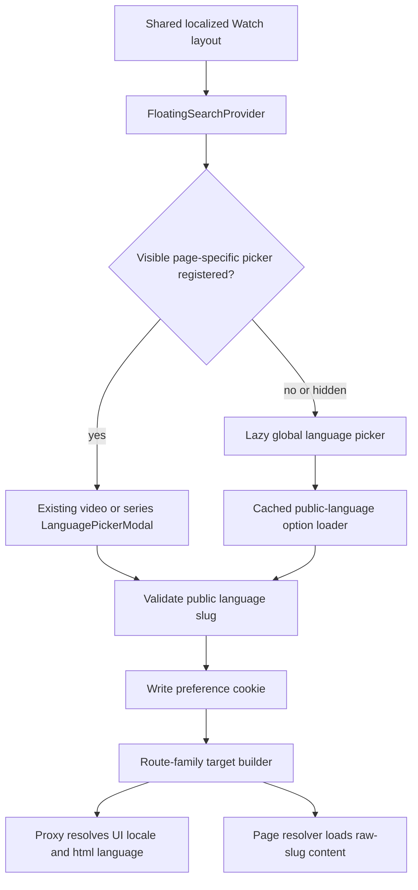

# Global Watch Language Switcher - Plan

## Goal Capsule

- **Objective:** Put a working language switcher in the shared Watch header on every public Watch page while preserving the single-video contract that one public language slug selects content/audio, next-intl chrome, and `<html lang>`.
- **Authority:** The public language-slug URL and existing video/series picker behavior outrank inferred convenience behavior; `apps/web/AGENTS.md`, `apps/web/CLAUDE.md`, and `docs/roadmap/platform/feat-260-watch-global-language-switcher.md` constrain implementation.
- **Execution profile:** Extend the shared header with a lazy global fallback, retain content-specific overrides where they can switch playable media, route unavailable or non-localizable contexts to the selected localized home, and fix localized-home content resolution before broad route verification.
- **Stop conditions:** Stop if the implementation needs an internal UI locale key in a public URL, eagerly loads the global catalog/modal on initial render, or cannot preserve unrelated working-tree edits in the same files.
- **Tail ownership:** Complete focused tests, web typecheck/lint/format checks, route-family browser smoke, page-load evidence, code review, and PR CI.

---

## Product Contract

### Summary

Add a shared-header language fallback on every public Watch page while keeping video, episode, and series pages on their existing playable-language picker whenever that picker has a valid alternative. Every successful selection validates and persists a public language slug before navigating to a truthful destination whose proxy rewrite changes content language and resolves the available UI catalog; when the current content cannot switch, the global fallback navigates to the selected localized home instead of implying unavailable playback.

### Problem Frame

`FloatingSearchProvider` already renders on every public Watch route, but its language control appears only after `HeroPlayer` or `SeriesPageClient` publishes a page-specific event. Home, authored one-segment experiences, language catalogs, history, and not-found surfaces therefore have no header language switcher.

Localized homepage rendering also drops the raw public language slug after proxy resolution. `apps/web/src/app/[locale]/[htmlLang]/[...rest]/page.tsx` calls `resolveWatchHome(locale)` even though `resolveWatchHome` accepts a language-slug override, so a regional or untranslated language can resolve UI chrome correctly or fall back intentionally while home cards still use the locale-derived default rather than the selected content language.

### Requirements

#### Shared availability and ownership

- R1. The floating Watch header displays a working language control on every public route family rendered by `apps/web/src/app/[locale]/[htmlLang]/layout.tsx`, including content pages whose playable-language corpus has no alternative.
- R2. Video, episode, and series pages retain their existing content-specific option corpus, subtitle integration, playback-time rules, pending state, and route builders when a page-specific picker is available.
- R3. A provider-owned global picker acts as the fallback whenever no visible page-specific picker is registered. A content page with playable alternatives registers the visible content picker; a content page with no playable alternative yields to the global picker, whose selection navigates to the selected localized home rather than claiming the current media is available there.
- R4. Client navigation and React StrictMode remounts cannot leave a stale callback, stale language code, duplicate fixed control, or last-writer ownership race, and an old owner's cleanup cannot clear a newer owner.

#### Language identity and route outcomes

- R5. A selection validates the exact public language slug before writing `forge_watch_lang`, then navigates only through typed Watch route builders.
- R6. The selected slug drives content/audio resolution directly and drives next-intl plus `<html lang>` through the existing `resolveWatchLocaleIdentity` fallback contract; internal catalog keys never appear in public URLs.
- R7. Global switching preserves the current route family when that family has a supported language-bearing shape: home to localized home and language inventory to the selected inventory. Because authored one-segment content has no supported localized public shape, switching there intentionally navigates to the selected localized home.
- R8. The all-languages index and history preserve their route family through explicit public localized utility routes; not-found/unknown routes land on the selected localized home rather than preserving an invalid path.
- R9. Localized home resolution passes the raw public language slug to home-content loading so selected content does not collapse to a UI-locale-derived default.

#### Loading, resilience, and accessibility

- R10. The global modal implementation and full language option corpus load only after user intent or the established post-load idle warmup; initial server HTML, hydration, and route data requests remain unchanged.
- R11. Loading, empty, failure, retry, cancel, unchanged-selection, duplicate-submit, and navigation-pending states remain usable and truthful. Global options come from Watch language metadata with a defined destination outcome; home and inventory routes use the raw selected slug and must show a truthful empty state rather than silently substituting unrelated-language content, while utility and history routes preserve their own data with the resolved UI catalog fallback.
- R12. The header control and modal remain keyboard accessible, expose localized accessible names, preserve visible focus treatment, and maintain existing mobile/desktop spacing beside search and account controls.

### Acceptance Examples

- AE1. Given `/watch`, when a user selects `spanish-castilian`, then the preference cookie is written, navigation targets `/watch/spanish-castilian.html`, Spanish UI messages render when available, `<html lang>` reflects the resolved tag, and homepage content is requested with `spanish-castilian` rather than a locale-derived substitute.
- AE2. Given an individual video with multiple playable dubs, when the header globe opens, then the existing video picker appears and switching preserves the playback timestamp/autoplay behavior.
- AE3. Given `/watch/english.html/videos`, when the global picker selects Russian, then navigation targets `/watch/russian.html/videos` and the inventory plus UI locale resolve from `russian`.
- AE4. Given `/watch/languages`, when French is selected, then navigation targets `/watch/french.html/languages`, the all-languages index remains visible, and French UI messages render when available.
- AE5. Given authenticated `/watch/history`, when French is selected, then navigation targets `/watch/french.html/history`; given a controlled not-found page, the same selection lands on `/watch/french.html`.
- AE6. Given a language without a generated UI catalog on a content-specific page, when it is selected, then content uses the raw slug and UI chrome follows the existing English fallback rather than exposing an internal locale key or claiming an unavailable translation.
- AE7. Given initial page load without language interaction, then no global language modal chunk or catalog request starts before the established post-load warmup boundary.
- AE8. Given a one-segment authored page or a content page with no playable alternative, when another language is selected from the header, then the global picker remains available and navigation lands on that language's localized home without claiming the current content can switch.

### Scope Boundaries

- Public Watch pages means the route families under `apps/web/src/app/[locale]/[htmlLang]/layout.tsx`; API, asset, auth callback, and demo route groups are excluded.
- New localized public shapes are limited to `/{language}.html/languages` and `/{language}.html/history`; no localized not-found shape is introduced.
- No Admin GraphQL schema or generated GraphQL/locale artifact is hand-edited.
- Adding new UI message catalogs is outside scope; unsupported content languages keep the existing UI fallback behavior.
- Existing inline language selectors may remain on inventory/series surfaces; the requirement is one shared fixed-header owner, not removal of contextual controls.
- Unrelated in-progress edits for the logo destination, language-modal catalog links, footer links, and workspace configuration must remain intact and outside this feature's commits where separable.

---

## Planning Contract

### Key Technical Decisions

- KTD1. Model the shared header control as a provider-owned global fallback plus owner-keyed page registration with absent, hidden, and visible states. A visible current owner replaces the fallback; absent or intentionally hidden page-specific state leaves the global fallback visible, and stale cleanup cannot clear a newer visible owner.
- KTD2. Build a separate lazy global picker using `LanguageCombobox` and shared display helpers. Do not fake playable video variants or widen `LanguagePickerModal`'s player/subtitle-specific API for unrelated route families.
- KTD3. Load the global option corpus from the existing cached search/language metadata path, projecting only valid public slugs and display fields. Keep the request and modal module behind the interaction loader rather than sending the corpus through the root layout.
- KTD4. Centralize global target selection in a pure route-policy helper keyed by `parseWatchPath`; add localized history/languages builders and proxy classifications, distinguish one-segment authored content from localized home using public-language validation, and map authored or unavailable content contexts to the selected localized home.
- KTD5. Preserve validate-before-cookie-write and pending-before-router-push ordering from `LanguagePickerModal`, including best-effort selective prefetch and duplicate-submit protection.
- KTD6. Pass the raw language slug through localized-home server resolution. UI catalog fallback and content-language identity remain separate on purpose.

### High-Level Technical Design

### Assumptions

- The all-languages index and history should preserve their family through `/{language}.html/languages` and `/{language}.html/history`; the unlocalized forms remain English-compatible entry points.
- The controlled not-found surface should transition to the chosen localized home because preserving an invalid path only recreates the error.
- A one-segment authored collection has no admitted language-bearing public route; global switching from that surface intentionally navigates to the selected localized home rather than adding a new route shape or misclassifying the request as a video.
- The current cached search-language metadata source is acceptable for global options. If its projection cannot be imported without pulling server-only code into the client graph, add a narrow server action and client loader instead of changing the data source.
- Page-specific pickers may intentionally expose content languages without generated UI catalogs; the existing English chrome fallback is part of the current single-page behavior.

### Implementation Constraints

- Keep Server Components as the default and do not introduce `headers()` or `cookies()` into static Watch routes.
- Keep language option metadata, admin bearer access, and any GraphQL call server-only behind a server action.
- Preserve current query behavior: video/episode switching owns timestamp/autoplay; global switching does not copy unrelated query parameters.
- Preserve the current fixed header layout, search behavior, account control, player-chrome visibility behavior, and `WATCH_HEADER_LANGUAGE_SWITCHER_EVENT` compatibility.

---

## Implementation Units

### U1. Define global language route and option contracts

- **Goal:** Provide pure, client-safe language option projection and route-family target selection without changing existing video/episode builders.
- **Requirements:** R5-R9; AE1, AE3-AE6; KTD3, KTD4, KTD6.
- **Dependencies:** None.
- **Files:** `apps/web/src/lib/routes.ts`, `apps/web/src/lib/routes.test.ts`, `apps/web/src/lib/url-canonicalize.ts`, `apps/web/src/lib/url-canonicalize.test.ts`, `apps/web/src/proxy.ts`, `apps/web/src/proxy.test.ts`, `apps/web/src/lib/locale.ts`, `apps/web/src/lib/search-language.ts`, `apps/web/src/lib/search-language.test.ts`, and a focused new helper/test under `apps/web/src/lib/` if separation improves client/server boundaries.
- **Approach:** Add localized utility builders/parser kinds and proxy rewrites, define the global target matrix, project valid public language options from the established metadata source, and keep raw slugs distinct from UI locale keys.
- **Patterns to follow:** `localizedHomePath`, `languageVideosIndexPath`, `watchVideoPath`, `tryAsLocaleSlug`, `resolveWatchLocaleIdentity`, and `getSearchLanguageOptions`.
- **Test scenarios:**
  1. Map root and localized home to the selected localized home.
  2. Map language inventory to the selected inventory and all-languages to the selected localized all-languages route.
  3. Map history to selected localized history and unknown/not-found to selected localized home.
  4. Map one-segment authored content and unavailable content-page contexts to the selected localized home.
  5. Reject malformed/internal locale values before returning a target.
  6. Preserve exact public slugs across BCP-47 collisions and regional variants.
- **Verification:** Pure helper tests demonstrate every public route family and no route emits an internal message-catalog key.

### U2. Add the lazy global picker

- **Goal:** Provide a resilient global language-selection modal without overloading the content-specific picker.
- **Requirements:** R3, R5-R8, R10-R12; AE1, AE3-AE7; KTD2, KTD3, KTD5.
- **Dependencies:** U1.
- **Files:** `apps/web/src/components/watch/GlobalLanguagePickerModal.tsx`, `apps/web/src/components/watch/__tests__/GlobalLanguagePickerModal.test.tsx`, `apps/web/src/lib/watch-interaction-loader.ts`, `apps/web/src/lib/watch-interaction-loader.test.ts`, `apps/web/src/lib/watch-language-actions.ts` or a narrow sibling server-action file, and `apps/web/messages/*.json` only for new user-visible strings.
- **Approach:** Dynamically load a `LanguageCombobox`-based modal, mark the trigger busy immediately while the module loads, dedupe/cache its compact option request, validate selection before mutation, commit pending UI before navigation, and expose retry/cancel behavior with focus restoration and polite status announcements.
- **Execution note:** Start with focused interaction tests that characterize the existing picker ordering and pending semantics, then implement the global variant against those expectations.
- **Patterns to follow:** `LanguagePickerModal`, `LanguageCollectionSwitcher`, `watch-interaction-loader`, `MODAL_FOCUS_RING_CLASS`, and Base UI dialog state attributes.
- **Test scenarios:**
  1. Mark the trigger busy immediately, block duplicate activation while the modal module loads, transfer focus into the dialog when ready, and recover the trigger if module loading fails.
  2. Render deduped valid public languages and retain the current selection.
  3. Ignore unchanged or invalid selection without cookie write/navigation.
  4. Write the preference before one router push and block duplicates while pending.
  5. Prefetch only the changed valid target and swallow prefetch failure.
  6. Show retry after option-load failure and recover on success.
  7. Close via button, overlay, and Escape without navigation, restoring focus to the header trigger after every close path.
  8. Maintain initial dialog focus, tab containment, visible focus, localized accessible names, and polite announcements for loading, empty, error, retry, and navigation-pending states.
- **Verification:** Focused modal and loader tests prove behavior without importing server-only data into the client bundle.

### U3. Install provider fallback and preserve page-specific overrides

- **Goal:** Make the shared header language control available on every public page without regressing video/series ownership.
- **Requirements:** R1-R4, R10-R12; AE1-AE7; KTD1, KTD5.
- **Dependencies:** U1, U2.
- **Files:** `apps/web/src/components/FloatingSearchProvider.tsx`, `apps/web/src/components/__tests__/FloatingSearchProvider.test.tsx`, `apps/web/src/lib/watch-player-chrome-events.ts`, `apps/web/src/components/watch/HeroPlayer.tsx`, `apps/web/src/components/watch/SeriesPageClient.tsx`, and their existing focused tests only if an ownership token/source field is required.
- **Approach:** Derive a lightweight fallback language code and route target from pathname, mount the global modal only on intent, let only the current owner's visible page-specific registration replace the fallback, keep the fallback active for absent or hidden state, clear stale overrides on pathname/unmount, and ignore cleanup that does not match the current owner.
- **Execution note:** Add StrictMode and client-navigation regression coverage before changing event ownership so cleanup/setup races remain visible.
- **Patterns to follow:** Existing floating-header event listeners, dynamic search controller loading, `HeroPlayer` header publication, and `SeriesPageClient` publication.
- **Test scenarios:**
  1. Render one header language control on home, localized home, authored content, languages, inventory, history, and unknown paths.
  2. Open the global picker when no page override exists.
  3. Let video/series callbacks override the fallback and never open both modals.
  4. Restore the fallback after matching override cleanup and pathname change.
  5. Keep the global fallback visible for a content page with no valid alternative, route its selection to localized home, and ignore stale cleanup from a prior owner after a new owner registers.
  6. Preserve search modal, player-chrome opacity, account spacing, and keyboard activation.
- **Verification:** Provider and page-owner suites prove deterministic ownership under StrictMode and route changes.

### U4. Preserve raw-slug homepage content and verify route parity

- **Goal:** Ensure localized home and all public route families switch content and UI together with no page-load regression.
- **Requirements:** R1, R6-R12; AE1-AE7; KTD4, KTD6.
- **Dependencies:** U1-U3.
- **Files:** `apps/web/src/app/[locale]/[htmlLang]/[...rest]/page.tsx`, `apps/web/src/app/[locale]/[htmlLang]/[...rest]/page-routing.test.tsx`, `apps/web/src/app/[locale]/[htmlLang]/page.test.tsx`, `apps/web/src/proxy.test.ts`, and representative page tests for languages, inventory, and history where coverage is missing.
- **Approach:** Pass the raw localized-home slug into `resolveWatchHome`, keep the root default locale-derived, and add integration-style route tests that assert the public slug reaches content resolution while internal locale/html segments remain derived.
- **Test scenarios:**
  1. Root home retains default behavior.
  2. Localized home passes exact regional and untranslated slugs to home content.
  3. UI locale and `<html lang>` use the resolved catalog/tag while content keeps the raw slug.
  4. Proxy admission and canonicalization preserve existing URLs and admit localized languages/history variants without confusing them with video routes.
  5. Browser switching succeeds on representative home, video, series, all-languages, inventory, history, and not-found pages.
  6. Resource timing shows no new global modal chunk or option request before load; post-load warmup or user intent starts the work.
- **Verification:** Route tests, browser state inspection, and before/after resource timing jointly prove correctness and loading posture.

---

## Verification Contract

| Gate                               | Applies to | Command or evidence                                                                                                                                                                                                                                                                                                                                                                                                                                              | Done signal                                                                                                                 |
| ---------------------------------- | ---------- | ---------------------------------------------------------------------------------------------------------------------------------------------------------------------------------------------------------------------------------------------------------------------------------------------------------------------------------------------------------------------------------------------------------------------------------------------------------------- | --------------------------------------------------------------------------------------------------------------------------- |
| Focused behavior                   | U1-U4      | `pnpm --filter @forge/web test -- src/lib/routes.test.ts src/lib/search-language.test.ts src/lib/watch-interaction-loader.test.ts src/components/__tests__/FloatingSearchProvider.test.tsx src/components/watch/__tests__/GlobalLanguagePickerModal.test.tsx src/components/watch/__tests__/LanguagePickerModal.test.tsx src/components/watch/__tests__/SeriesPageClient.test.tsx src/app/[locale]/[htmlLang]/[...rest]/page-routing.test.tsx src/proxy.test.ts` | Route matrix, modal behavior, ownership, and raw-slug content cases pass.                                                   |
| Existing content picker regression | U3         | `pnpm --filter @forge/web test -- src/components/watch/__tests__/HeroPlayer.test.tsx src/components/watch/__tests__/WatchPageClient.navigation.test.tsx`                                                                                                                                                                                                                                                                                                         | Video/episode picker publication and navigation semantics remain green.                                                     |
| Type and locale parity             | U1-U4      | `pnpm --filter @forge/web typecheck`                                                                                                                                                                                                                                                                                                                                                                                                                             | TypeScript and generated UI-locale parity succeed without hand-edited outputs.                                              |
| Lint                               | U1-U4      | `pnpm --filter @forge/web lint`                                                                                                                                                                                                                                                                                                                                                                                                                                  | ESLint and locale drift checks pass.                                                                                        |
| Formatting                         | U1-U4      | `pnpm format:check`                                                                                                                                                                                                                                                                                                                                                                                                                                              | Touched files conform to repository formatting.                                                                             |
| Browser behavior                   | U3-U4      | Run representative public routes in a real browser and inspect header count, modal state attributes, URL, translated UI, content language, `<html lang>`, cookie, focus, and mobile/desktop spacing.                                                                                                                                                                                                                                                             | Every route family exposes a working header switcher; page-specific overrides remain singular.                              |
| Page-load performance              | U2-U4      | Capture before/after resource timing or a network waterfall for home plus representative video, series, index, and inventory routes.                                                                                                                                                                                                                                                                                                                             | No new render-blocking request or initial language-catalog/modal load; new work begins only after load/idle or user intent. |
| Diff integrity                     | U1-U4      | `git diff --check` plus scoped diff review against the pre-existing worktree snapshot.                                                                                                                                                                                                                                                                                                                                                                           | No whitespace errors, generated-artifact edits, or accidental inclusion/removal of unrelated changes.                       |

---

## Definition of Done

- The shared header exposes a language control across every public Watch page family.
- Content-specific video/episode/series behavior remains intact and wins while registered.
- Global route targets follow the documented matrix and use public language slugs only.
- Localized homepage content receives the raw selected language slug; next-intl and `<html lang>` follow the existing resolver contract.
- Global options and modal code remain staged off the initial critical path, with measured evidence.
- Loading, retry, cancel, pending, duplicate-submit, focus, and responsive header behavior are covered.
- Focused tests, existing regressions, typecheck, lint, formatting, browser smoke, performance proof, and PR CI pass.
- `docs/roadmap/platform/feat-260-watch-global-language-switcher.md` is updated to `status: "complete"` after verification.
- Dead-end experiments and abandoned code are removed, and unrelated pre-existing working-tree edits are preserved without being swept into this feature.

---

## Sources and Research

- `apps/web/src/components/FloatingSearchProvider.tsx`, `apps/web/src/components/watch/HeroPlayer.tsx`, and `apps/web/src/components/watch/SeriesPageClient.tsx` establish shared-header publication and page-specific ownership.
- `apps/web/src/components/watch/LanguagePickerModal.tsx` establishes validate-before-write, pending navigation, option availability, and video/episode route behavior.
- `apps/web/src/lib/routes.ts`, `apps/web/src/proxy.ts`, and `apps/web/src/lib/locale.ts` define public route shapes and the slug-to-UI/html identity rewrite.
- `docs/solutions/best-practices/language-identity-on-slug-not-bcp47-20260605.md` requires language identity comparisons and persistence to use the slug rather than BCP-47.
- `docs/solutions/ui-bugs/series-page-locale-normalized-to-default-on-slug-form-urls-2026-05-14.md` documents the failure caused by treating public slugs as internal locale keys.
- `docs/solutions/design-patterns/watch-language-player-chrome-layout-20260609.md` keeps the shared floating header as the sole fixed-control owner.
- `docs/solutions/performance-issues/watch-staged-client-loading-20260611.md` and `docs/solutions/conventions/frontend-change-page-load-performance-verification.md` require intent/post-load staging and measured page-load evidence.
