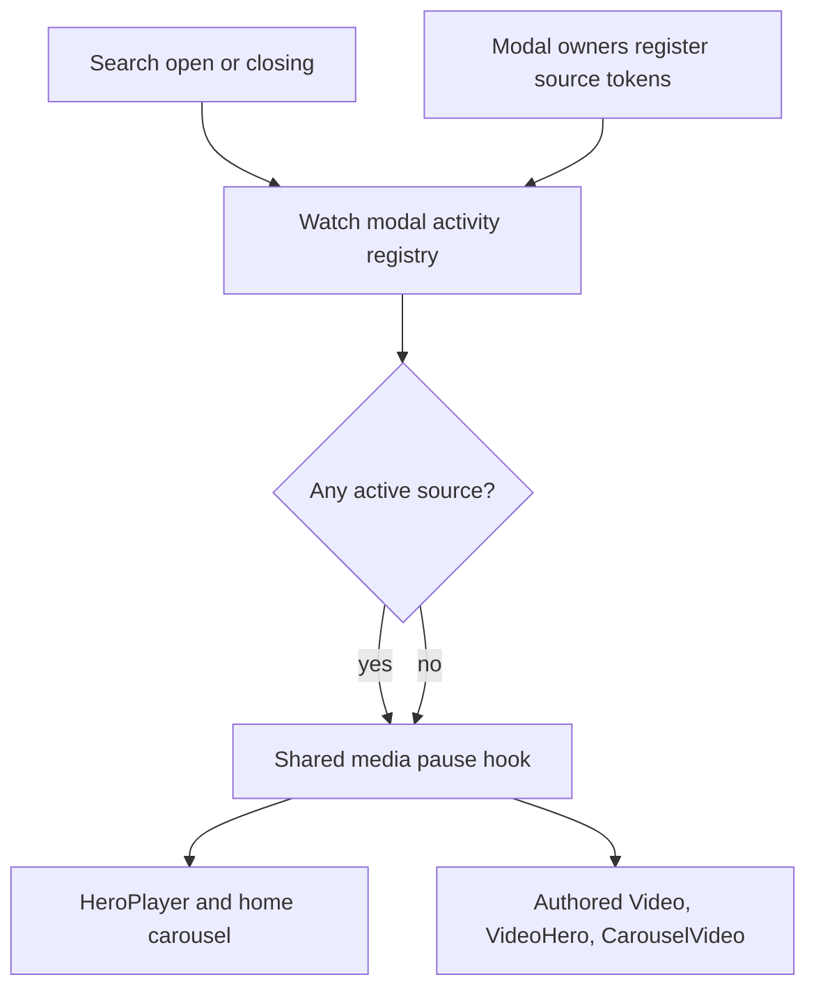

# fix: Pause Watch playback for every modal

## Summary

Replace Watch's two independent modal-pause implementations with one layout-scoped modal activity registry and one player pause/resume hook. Every current Watch modal source will register activity so hero, carousel, and authored inline playback pauses while interaction belongs to an overlay.

---

## Problem Frame

`WatchPageClient` currently coordinates only search, language, download, and share modals. The beta-tester branch added a second pause hook directly to `HeroPlayer` and `WatchHomeTvCarousel`, while newer question, feedback, and experience dialogs remain invisible to both coordinators. This lets video continue underneath some overlays and creates competing resume decisions when modal sources overlap.

---

## Requirements

### Playback behavior

- R1. Opening search, language, download, share, question, feedback, beta-tester, or experience quiz UI pauses every playing media surface inside the Watch layout.
- R2. Closing an overlay resumes media only when that same media was playing before the first active overlay opened and no other overlay remains active.
- R3. Media that was already paused before an overlay opened stays paused after every overlay closes.
- R4. Media that attaches while an overlay is already open pauses immediately and does not gain an invented resume entitlement.
- R5. Replaced or unmounted media is never resumed by stale modal state.

### Integration boundaries

- R6. Modal activity is aggregated at Watch layout scope with per-owner instance tokens so overlapping lifecycle states and nested overlays cannot resume playback early.
- R7. Search closing animation, lazy modal loading, existing focus return, body scroll lock, and modal mutual-exclusion behavior remain unchanged.
- R8. One shared player hook owns pause/resume provenance for `HeroPlayer`, `WatchHomeTvCarousel`, `Video`, `VideoHero`, and `CarouselVideo`; modal-specific player hooks are removed.
- R9. Autoplay, source-change, and scroll-resume paths cannot restart media while modal activity remains open.
- R10. Modal activity remains active through each overlay's visible close transition so playback cannot resume under a fading dialog.

---

## Assumptions

- This work continues open PR #1555 and first incorporates the current `origin/main`, which contains the global feedback modal absent from the beta branch's last merge.
- "Any modal" means every modal-capable surface currently rendered inside the Watch layout. New custom overlays must register with the shared activity hook when introduced.
- Resume-on-close remains part of the established Watch contract; this change preserves it with stricter provenance instead of leaving playback permanently paused.

---

## Key Technical Decisions

- KTD1. **Use a tokenized activity registry, not DOM observation:** every mounted owner uses a unique instance token in context, which prevents collisions when authored pages render multiple instances of the same modal type.
- KTD2. **Wrap floating search at Watch layout scope:** the Watch layout owns `WatchModalActivityProvider`, while `FloatingSearchProvider` registers its open/closing state as one source. This keeps demo layouts unaffected and exposes one registry to route and global overlay owners.
- KTD3. **Pause at each player seam:** every Watch media owner exposes its reactive element identity to one shared hook, which handles late attachment and prevents stale-media resume without lifting refs into modal owners.
- KTD4. **Register intent at modal owners:** async/lazy owners register as soon as open state changes, before a dynamically imported dialog finishes loading.
- KTD5. **Keep focus ownership separate from playback activity:** the registry coordinates media only. Existing search, feedback, question, and beta mutual-exclusion rules remain responsible for preventing multiple visible focus owners.

---

## High-Level Technical Design

The registry answers only whether interaction is owned by one or more overlays. The media hook snapshots the playing media on the first closed-to-open edge, pauses every current media attachment while open, and resumes only the matching snapshot after the final token clears.

---

## Prerequisite

Synchronize current `origin/main` into PR #1555 before implementation. Resolve the Watch layout conflict by preserving both `FeedbackLauncher` and `BetaTesterModalProvider` under a Watch-scoped activity provider that wraps `FloatingSearchProvider`. Resolve `docs/roadmap/README.md` from current main while retaining the beta ticket and adding feat-264, then run the affected beta, feedback, layout, and Watch baseline tests before replacing pause logic.

---

## Implementation Units

### U1. Shared modal activity and media pause contract

- **Goal:** Introduce the layout-scoped registry and prove its token and pause/resume state machine independently.
- **Requirements:** R2-R6, R8-R10.
- **Dependencies:** None.
- **Files:** `apps/web/src/components/watch/WatchModalActivityProvider.tsx`, `apps/web/src/components/watch/WatchModalActivityProvider.test.tsx`, `apps/web/src/app/[locale]/[htmlLang]/layout.tsx`, `apps/web/src/components/FloatingSearchProvider.tsx`.
- **Approach:** Wrap `FloatingSearchProvider` in the Watch layout, expose unique-instance registration with delayed release through the visible close transition, and generalize the beta branch's media-identity and late-attachment safeguards into `usePauseForWatchModal`.
- **Patterns to follow:** Open-edge provenance in `WatchPageClient`; media identity and rejected-play handling in `BetaTesterModalProvider`.
- **Test scenarios:**
  - A playing media element pauses on the first registered source and resumes only after the final overlapping source unregisters.
  - A pre-paused media element neither receives `pause()` nor `play()`.
  - Media attached after activity begins pauses but does not resume on close.
  - Replacing the media identity while open does not resume the stale element.
  - Autoplay, source-change, or scroll logic that calls `play()` while activity is open is immediately re-paused and gains no resume entitlement.
  - A rejected `play()` promise is swallowed after registry state still closes cleanly.
  - Search remains active through its closing animation and keeps playback paused until that animation finishes.
  - Two mounted owners with the same source label receive independent tokens and cannot unregister each other.
  - A closing owner retains activity for the shared close interval before the final token clears.
- **Verification:** Focused provider tests prove the state machine independent of individual modal presentation.

### U4. Migrate canonical hero and home playback atomically

- **Goal:** Move the primary Watch players to the shared hook without leaving beta or page modals temporarily uncovered.
- **Requirements:** R1-R10.
- **Dependencies:** U1.
- **Files:** `apps/web/src/components/watch/HeroPlayer.tsx`, `apps/web/src/components/watch/__tests__/HeroPlayer.test.tsx`, `apps/web/src/components/home/WatchHomeTvCarousel.tsx`, `apps/web/src/components/home/__tests__/WatchHomePage.test.tsx`, `apps/web/src/components/watch/WatchPageClient.tsx`, `apps/web/src/components/watch/__tests__/WatchPageClient.navigation.test.tsx`, `apps/web/src/components/watch/BetaTesterModalProvider.tsx`, `apps/web/src/components/watch/BetaTesterModalProvider.test.tsx`.
- **Approach:** Register page-owned modal state and beta intent in the same change that moves hero/home media to `usePauseForWatchModal`. Remove both the page-local and beta-specific pause effects only after the new registrations are active, and guard media `play` events while modal activity remains open.
- **Patterns to follow:** The beta branch's media identity checks and the original page coordinator's open-edge provenance.
- **Test scenarios:**
  - Search, language, download, share, and beta each pause the primary player and restore only prior-playing media.
  - A modal handoff never produces an intermediate `play()` call.
  - Hero idle preview and home-carousel playback attempts remain paused while activity is open.
- **Verification:** Existing player and page integration suites pass with no duplicate pause or resume calls.

### U5. Migrate authored inline playback

- **Goal:** Apply the same modal contract to every playable authored section that can sit beneath an experience dialog.
- **Requirements:** R1-R5, R8-R10.
- **Dependencies:** U1.
- **Files:** `apps/web/src/components/sections/Video.tsx`, `apps/web/src/components/sections/__tests__/Video.test.tsx`, `apps/web/src/components/sections/VideoHero.tsx`, `apps/web/src/components/sections/__tests__/VideoHero.test.tsx`, `apps/web/src/components/sections/CarouselVideo.tsx`, `apps/web/src/components/sections/__tests__/CarouselVideo.test.tsx`.
- **Approach:** Make each underlying media attachment reactive, apply `usePauseForWatchModal`, and ensure viewport, source-change, and scroll `play()` paths cannot restart playback while an overlay owns interaction.
- **Patterns to follow:** The reactive media state already owned by `HeroPlayer`; retain each authored player's existing user-pause and autoplay semantics outside modal activity.
- **Test scenarios:**
  - Each authored player pauses on activity and resumes only when it was the matching prior-playing element.
  - Viewport, source-change, and scroll autoplay attempts are re-paused while activity remains open.
  - Unmounting or replacing an authored media element invalidates resume provenance.
- **Verification:** Focused section suites prove modal gating without changing normal viewport/source behavior.

### U2. Register every current Watch modal owner

- **Goal:** Connect all current overlay sources to the shared registry at their earliest authoritative open state.
- **Requirements:** R1, R6, R7.
- **Dependencies:** U1, U4.
- **Files:** `apps/web/src/components/watch/WatchPageClient.tsx`, `apps/web/src/components/watch/__tests__/WatchPageClient.navigation.test.tsx`, `apps/web/src/components/watch/SeriesPageClient.tsx`, `apps/web/src/components/watch/__tests__/SeriesPageClient.test.tsx`, `apps/web/src/components/watch/WatchQuestionPanel.tsx`, `apps/web/src/components/watch/WatchQuestionPanel.test.tsx`, `apps/web/src/components/FeedbackLauncher.tsx`, `apps/web/src/components/FeedbackLauncher.test.tsx`, `apps/web/src/components/sections/QuizButton.tsx`, `apps/web/src/components/sections/QuizButton.test.tsx`, `apps/web/src/components/watch/BetaTesterModalProvider.tsx`.
- **Approach:** Register series-modal state, question state, feedback intent, and quiz dialog state with unique instance tokens. Preserve existing question-to-beta and search-to-feedback exclusion/focus logic; the registry supplements those rules only for playback activity.
- **Patterns to follow:** Controlled modal state owners and existing lazy interaction boundaries; Base UI dialog state assertions use `data-open` and `data-closed` where visual lifecycle matters.
- **Test scenarios:**
  - Search, language, download, share, question, feedback, beta, and quiz opening each expose active modal activity.
  - A lazy feedback or beta chunk pauses playback during its loading fallback, before dialog content mounts.
  - Closing one source while another is active does not clear aggregate activity.
  - Existing search-versus-feedback and search/question/beta mutual-exclusion rules still prevent conflicting focus owners.
  - Series language/share dialogs register even though their language picker has no media ref.
  - Closing affected overlays restores focus to the existing target and preserves body scroll lock through the visible close transition.
  - Nested and transition-overlap activity delays playback resume without authorizing two visible focus owners.
- **Verification:** Component integration tests cover every owner without duplicating the core pause state-machine assertions.

### U3. Roadmap, browser proof, and durable learning

- **Goal:** Record ownership and prove the behavior on real Watch surfaces before updating the existing pull request.
- **Requirements:** R1-R10.
- **Dependencies:** U1, U2, U4, U5.
- **Files:** `docs/roadmap/platform/feat-264-watch-modal-playback-coordination.md`, `docs/plans/2026-07-16-001-fix-watch-modal-playback-coordination-plan.md`, `docs/solutions/ui-bugs/watch-modal-playback-coordination.md`.
- **Approach:** Track the regression as a new platform ticket rather than reopening completed staged-loading work. Browser-smoke an actively playing single-video route, the Watch home carousel, and an authored inline video near a quiz, covering representative built-in, global, manual, and lazy overlays.
- **Patterns to follow:** `docs/solutions/performance-issues/watch-staged-client-loading-20260611.md` and local Watch proof conventions.
- **Test scenarios:** Test expectation: none -- this unit records runtime evidence and durable documentation after automated coverage passes.
- **Verification:** Browser inspection confirms hero, home-carousel, and authored inline media pause while sampled overlays are open, resume only when previously playing, and stay paused when manually paused before opening. Keyboard opening and Escape closing preserve focus containment and final focus return; body scroll stays locked through visible close and modal handoff. At least one screenshot records the visible overlay state. Navigation and resource timing records `DOMContentLoaded`, `load`, and the first media request so the proof can confirm this coordination adds no render-blocking request, starts no player work earlier, and introduces no new network request.

---

## Scope Boundaries

- The change does not redesign modal visuals, search behavior, feedback content, beta signup content, or player Chrome.
- The change does not merge unrelated modal branches; it updates PR #1555's beta branch after synchronizing current main.
- Non-Watch application routes remain unaffected because the activity provider exists only inside the Watch layout.

---

## Risks and Dependencies

- **Competing resume effects:** The old `WatchPageClient` and beta-specific effects must be removed in the same unit that installs the shared hook.
- **Lazy owners:** Registering only inside dialog content would leave playback running during chunk loading, so ownership must stay at the launcher/page state.
- **Route changes:** Provider and media cleanup must clear resume provenance without playing an element from the previous route.
- **Branch drift:** PR #1555 must incorporate current `origin/main` before feedback integration and browser proof.
- **External media controls:** The modal contract preserves the pre-open playback snapshot. User intent expressed through operating-system media controls while page interaction is inert is outside this change unless runtime proof exposes a reliable signal that can revoke resume entitlement.

---

## Acceptance Examples

- AE1. Given the hero is playing, when one modal closes as another gains ownership during a transition handoff, playback pauses once and resumes only after both lifecycle tokens are inactive without exposing two visible focus owners.
- AE2. Given the hero was manually paused, when any modal opens and closes, no automatic play occurs.
- AE3. Given the beta or feedback chunk is still loading, when its launcher has entered open state, the video is already paused.
- AE4. Given a modal is open before its route media attaches, when the media ref becomes available, it pauses and remains paused after close unless it owned the original playing snapshot.
- AE5. Given an authored inline player attempts viewport, source-change, or scroll autoplay while a modal is open, playback is re-paused and does not resume early.

---

## Sources and Research

- `apps/web/src/components/watch/WatchPageClient.tsx` contains the original four-modal pause/resume coordinator from PR #1022.
- `apps/web/src/components/watch/BetaTesterModalProvider.tsx` contains the newer beta-specific late-attachment and media-identity safeguards to generalize.
- `docs/plans/2026-06-11-002-perf-watch-staged-client-loading-plan.md` preserves modal pause/resume as an established Watch contract but lacks full owner coverage.
- `docs/solutions/best-practices/base-ui-dialog-state-attribute-detection-20260520.md` defines the correct browser/test visibility signals for Base UI dialogs.
