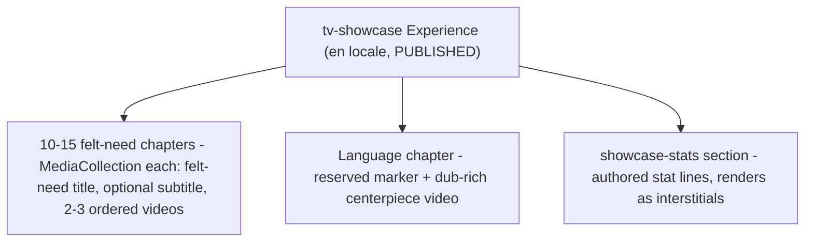
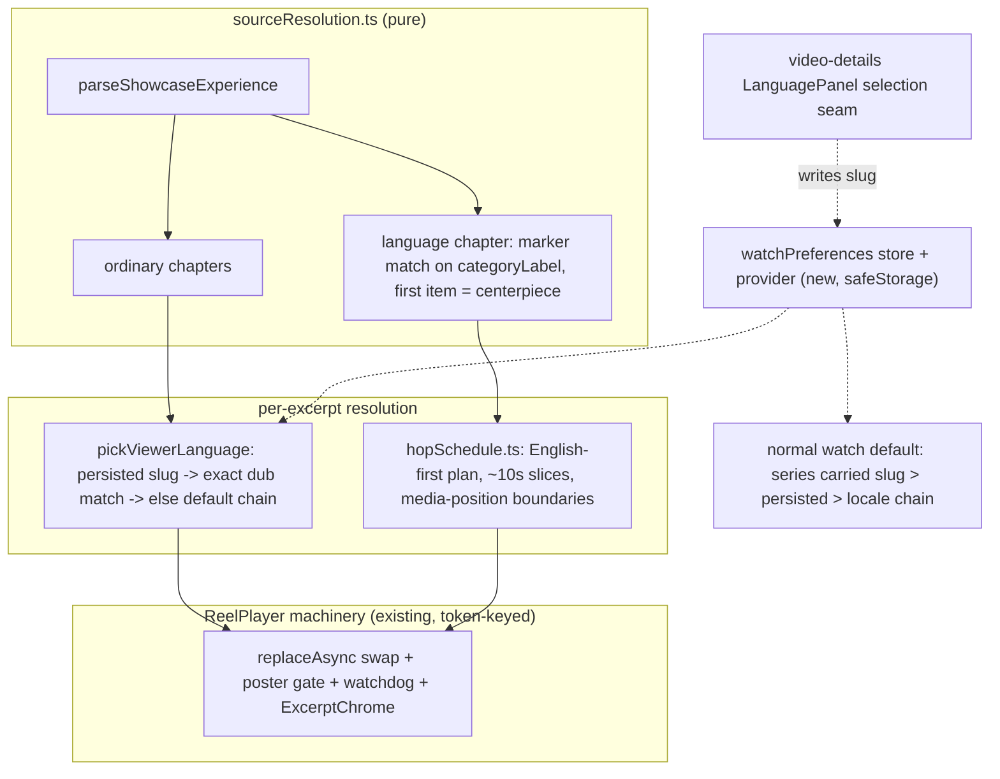

# TV Showcase Curated Experience - Plan

## Goal Capsule

- **Objective:** Author the curated `tv-showcase` Experience that feat-262's Showcase Mode was built to play — marquee felt-need chapters, an authored stats section, and a dub-rich language centerpiece — and amend the TV showcase client so ordinary excerpts follow the viewer's audio language while the language chapter plays an extended multi-dub switching excerpt.
- **Product authority:** This Product Contract. It amends `docs/plans/2026-07-15-001-feat-tv-showcase-mode-plan.md`: it supersedes that contract's R7 (per-excerpt language rotation) and adds a language-chapter exception to its R6 excerpt band. Everything else in the shipped contract stands. Open product questions route to urim (owner).
- **Execution profile:** Code changes confined to `apps/tv`; the curation shortlist is a committed docs artifact produced by a throwaway read-only query (nothing committed to `apps/admin`); the Experience itself is CMS content authored through the admin editor. Conventional commits (`feat:`), squash-merge PR to `main`.
- **Stop conditions:** Surface (do not guess through) any contradiction with this Product Contract, any need for an admin code or schema change, any evidence of decoder contention or memory growth during centerpiece soak, or a centerpiece candidate that cannot satisfy R4 from the live catalog.
- **Product Contract preservation:** changed R4 (added runtime criterion), R7 (app-wide persistence confirmed — the preference also becomes the normal watch screen's default; write seam covers both watch-screen surfaces, sheet and in-player menu), R8 (single centerpiece per reel clarified); added AE6-AE8; Success Criteria loop band recomputed to 20-35 minutes from R1's arithmetic. All confirmed with the owner in planning dialogue and document review on 2026-07-17.
- **Open blockers:** None.

---

## Product Contract

### Summary

Author the curated `tv-showcase` Experience — 10-15 marquee felt-need chapters of 2-3 short excerpts each, a `showcase-stats` section carrying real collection/language/subtitle numbers, and one language chapter with a dub-rich centerpiece video — and amend the TV showcase client so every ordinary excerpt plays the viewer's chosen audio language while the language chapter's centerpiece switches dubs mid-play through 6-9 languages. Client work extends the existing showcase module plus one new app-wide watch-preferences store modeled on mobile's; picks come from an editorial skeleton backed by a one-off shortlist built from admin's internal felt-need extractions and per-video dub counts.

### Problem Frame

Showcase Mode shipped with the curated Experience named as its operational launch dependency, and the office TVs are still playing the interim fallback: one unlabeled chapter composed from the Home pool, with no felt-need chapter cards, no stat interstitials, and picks biased to whatever Home happens to surface. Nothing on screen tells a visiting stakeholder what the catalog actually spans.

The shipped language behavior also works against the demo it was built for. Rotating languages across every excerpt means no excerpt plays in the viewer's own language, and the breadth claim is diffused into background noise — a visitor cannot tell that the reel is cycling languages, only that the audio keeps changing. The office launch needs the curated object, and the language story needs a deliberate, legible moment instead of ambient rotation.

### Key Decisions

- **Marquee subset first, not full felt-need coverage.** 10-15 chapters covering the strongest felt needs with the richest short-form content. The stat cards carry the full "50-60 felt needs" claim numerically, growth to more chapters is a CMS edit, and feat-263's automation is the long-term answer to full coverage.
- **Language breadth concentrates into one centerpiece; everything else follows the viewer.** Ordinary excerpts play the viewer's chosen audio language — a deliberate reversal of the shipped rotate-every-excerpt behavior — and the language chapter delivers the breadth claim as one continuous scene hopping through 6-9 dubs. More visceral for visitors, more respectful for consumers.
- **The centerpiece always opens in English.** A deterministic anchor for the office demo before the hops land; subsequent hops are randomly ordered unique dubs.
- **Hybrid signal-assisted curation.** An editorial chapter skeleton comes first, then a one-off read-only shortlist from admin's internal felt-need extractions joined with dub counts fills depth, verifies coverage, and finds the dub-richest centerpiece. The shortlist artifact doubles as groundwork for feat-263.
- **Structure reuses the shipped KTD-10 authoring contract unchanged.** One MediaCollection section per chapter plus the reserved `showcase-stats` section. The language chapter is marked with a reserved machine-readable value in an existing author-editable non-display field (the editor exposes `title`, `subtitle`, `description`, and `categoryLabel` on MediaCollection blocks — verified), so no admin code or schema changes are needed.

### Requirements

**Curated Experience content**

- R1. The `tv-showcase` Experience carries 10-15 felt-need chapters in reel order, each a MediaCollection section per the shipped KTD-10 authoring contract: felt-need `title`, optional one-line `subtitle`, and 2-3 ordered video items.
- R2. Chapter picks prefer short-form catalog items whose excerpt window lands on visually strong material for the chapter's felt need.
- R3. Exactly one chapter — the language chapter — states the language-count claim on its card and carries a reserved machine-readable marker the client detects.
- R4. The language chapter holds one centerpiece video chosen for maximal dub coverage: at least 9 published, playable dubs including English, with enough runtime to fill the extended window clear of the credits tail.
- R5. The `showcase-stats` section carries authored stat lines with real, sourced numbers spanning at least catalog size, language count, subtitle count, and felt-need category count.

**TV client amendments**

- R6. Every excerpt outside the language chapter plays the viewer's chosen audio language when that dub is playable, else the app's default language resolution; this supersedes the shipped contract's R7 rotation in both curated and fallback reels.
- R7. The viewer's chosen audio language is their most recent explicit dub selection on the watch screen — the video-details language sheet or the in-player audio menu, which drive the same selection seam — persisted app-wide: it survives navigation and app restarts, and it also becomes the default dub for ordinary (non-showcase) watch playback; absent any selection, the app's default resolution applies.
- R8. The language chapter's centerpiece excerpt switches dubs mid-play: the first segment is always English, then randomly-ordered unique dubs, roughly 10 seconds per segment, 6-9 languages total.
- R9. The language chapter's excerpt window extends to roughly 60-90 seconds to fit the hops — the only exception to the shipped 20-40 second excerpt band.
- R10. Each dub hop names its language on-screen, continues from the same playback position, and never shows loading UI at the seam.
- R11. Outside R6-R10, shipped reel mechanics are unchanged: chapter cards, interstitial cadence, excerpt windows, and the failure ladder all keep their shipped behavior.

**Curation process and authoring**

- R12. Picks come from the hybrid process: an editorial chapter skeleton, then a one-off read-only shortlist from admin's internal felt-need extractions joined with per-video dub counts and labels, with a human making final picks; the centerpiece video is not double-booked into an ordinary chapter.
- R13. The shortlist artifact — ranked candidates per felt need — is preserved as groundwork for feat-263.
- R14. The Experience is authored as the `en` ExperienceLocale with slug `tv-showcase` and published; TV queries locale `en` and the public resolver returns only PUBLISHED locales.

### Key Flows

- F1. Language centerpiece
  - **Trigger:** The reel reaches the language chapter.
  - **Steps:** The chapter card states the language-count claim; the centerpiece excerpt opens in English; roughly every 10 seconds the player hops to a random unused dub, naming it on-screen with playback position continuous; after 6-9 languages the chapter ends and viewer-language behavior resumes.
  - **Covers:** R3, R4, R8, R9, R10.
- F2. Viewer-language resolution
  - **Trigger:** The reel starts any ordinary excerpt.
  - **Steps:** The client reads the viewer's chosen audio language; it plays that dub when playable, else falls back to default resolution; the lower-third makes no language-breadth claim when the language did not rotate (shipped semantics).
  - **Covers:** R6, R7.

### Acceptance Examples

- AE1. **Covers R6, R7.** Given the viewer picked Russian in a video-details language sheet earlier in the session, when an ordinary excerpt with a playable Russian dub plays, then its audio is Russian.
- AE2. **Covers R6.** Given an ordinary excerpt whose video has no playable dub in the viewer's language, when it plays, then it uses the app's default resolution and never errors or stalls.
- AE3. **Covers R8, R9, R10.** Given the language chapter's centerpiece, when it plays, then the first segment is English and each subsequent hop is a unique randomly-chosen dub named on-screen, 6-9 languages within roughly 60-90 seconds, with no visible loading at any seam.
- AE4. **Covers R8.** Given the centerpiece's dub list yields fewer than 6 playable unique dubs at runtime, when it plays, then it hops through what exists without repeats and ends the excerpt normally.
- AE5. **Covers R3, R6, R11.** Given a curated Experience in which no chapter carries the language marker, when the reel plays, then no dub-switching occurs anywhere and every excerpt follows viewer-language behavior.
- AE6. **Covers R8, R11.** Given a hop's dub fails to load or stalls mid-centerpiece, when the failure is detected, then the reel skips to the next planned hop without counting a reel-failure strike, and the excerpt aborts through the normal failure path only when no playable hop remains.
- AE7. **Covers R3.** Given a curator marks two chapters with the reserved value, when the Experience is parsed, then the first marked chapter is the language chapter and later marked chapters play as ordinary chapters.
- AE8. **Covers R7.** Given the viewer picked Urdu in the video-details language sheet and then restarts the app, when they open any video outside Showcase Mode, then Urdu is the default dub where playable — and showcase ordinary excerpts also play Urdu.

### Success Criteria

- A full loop lands the breadth story unaided: a visitor can retell the felt-need range, the language count, and at least one real number from the interstitials.
- The loop runs roughly 20-35 minutes so repeat exposure in an office sitting is low (the band follows from R1's own arithmetic: 10-15 chapters × 2-3 excerpts × 20-40s plus cards, interstitials, and the centerpiece).

### Scope Boundaries

- **Deferred for later:** feat-263's automated assembly (the shortlist artifact seeds it); growth beyond the marquee subset toward full felt-need coverage; any second language chapter; persisting the series-screen language picker (it stays session-scoped — only the watch screen's selection seam writes the preference).
- **Out of scope:** admin code or schema changes; rendering subtitles in the reel (subtitle counts appear only as stat lines); a language centerpiece in the fallback reel (the fallback has no markers and never dub-switches); changes to interstitial cadence or the failure ladder; subtitle-language preference (the store carries audio language only for now).

### Dependencies / Assumptions

- The admin editor exposes `title`, `subtitle`, `description`, and `categoryLabel` inputs on MediaCollection blocks (verified in `apps/admin/src/app/dashboard/experiences/experience-editor.tsx`), so stats and the language marker are authorable with zero admin changes; `sectionKey` remains non-authorable.
- A centerpiece video satisfying R4 exists in the catalog — assumed; the dub-count shortlist verifies before picks are final, and a shortfall is a stop condition.
- Admin's internal felt-need extractions are usable for shortlisting — assumed; they were extracted for search, so sample their quality before trusting them.
- Stat-line numbers must come from authoritative ministry or operations sources; sourcing is a curator task, and the shipped contract already requires interstitials to render only when authored stats exist.
- Chapter cards need no component change for R3: the language-count claim rides the authored `subtitle` free text.

---

## Planning Contract

### Key Technical Decisions

- KTD-1. **App-wide watch preference, keyed on `languageSlug`.** New `apps/tv/src/lib/watchPreferences.ts` (versioned key `tv.watchPreferences.v1`, shape `{ audioLanguageSlug }`) plus a root-mounted `WatchPreferencesProvider`, mirroring mobile's `apps/mobile/src/lib/watchPreferences.ts` but going through TV's `safeStorage` wrapper. Identity is the unique language slug with exact-equality matching; bcp47 appears only in the existing fuzzy fallback chain. This is the third-recurrence bug class documented in `docs/solutions/best-practices/language-identity-on-slug-not-bcp47-20260605.md` — do not key on bcp47.
- KTD-2. **One write seam; series selection outranks the global for its own episodes.** The preference is written at the explicit-selection seam (`WatchSessionProvider.setActiveVariantIndex`, where `userChoseVariantRef` is set), which both watch-screen surfaces drive — the video-details `LanguagePanel` and the in-player audio menu — matching mobile's persist-at-the-seam precedent. The series-screen picker keeps its session-scoped store. Default-dub precedence: series carried slug → persisted `audioLanguageSlug` → device locale → video primary → English → first (thread the persisted slug into `resolveDefaultVariantIndex`'s existing `preferredAudioSlug` path, which `resolveDefaultLanguage.ts` already anticipates).
- KTD-3. **Ordinary excerpts pick the viewer's language; rotation retires.** `resolveExcerptStream` swaps `rotateLanguage` for a new `pickViewerLanguage` (exact-slug playable match, else the default chain). `claimsLanguage` stays false for these excerpts — the lower-third makes no breadth claim when nothing rotated. Applies identically to curated and fallback reels.
- KTD-4. **The centerpiece is a client-expanded hop sequence riding the existing excerpt machinery.** Hop expansion happens at excerpt-resolution time — after the centerpiece's dub fetch, since the queue is built at parse time before any dub list exists — entering the reducer as a dedicated event whose handling owns hop indices and per-hop `excerptToken` bumps; queue chapters keep plain excerpt entries. Each hop carries its own dub, ~10s window slice, and its own `excerptToken`, so a token bump per hop reuses three proven mechanisms at once: the swap gate masks the seam, the watchdog re-arms per hop (arm-on-intent with paired refs sharing a lifetime, per `docs/solutions/logic-errors/liveness-watchdog-armed-on-success-and-unpaired-latch-heartbeat.md`), and `ExcerptChrome`'s token-keyed animation restarts to name each hop's language (`claimsLanguage` true on every hop). Hop seams get their own shorter mask constants plus the existing `audioFade` ramp — a brief styled dip that never shows the video's static poster: the seam holds the outgoing dub's last decoded frame under the audio dip, visually continuous because every hop is the same footage. The dip deliberately masks the 1-3s `replaceAsync` start window (R10 bans visible loading UI, not a masked seam). A second player is off the table (documented tvOS decoder leak; the reel is deliberately single-player with `replaceAsync`).

> **Superseded (2026-07-21, branch `fix/tv-showcase-seamless-hop`):** the hop-seam dip and the "second player is off the table" constraint above no longer describe the shipped mechanism. `replaceAsync` blanks the surface on tvOS (the dip dimmed a blank frame — the cut-to-black testers saw), so hops now flip between TWO long-lived players: the standby preloads the next dub, the outgoing rolls past its window end as the motion cover, and the views crossfade only on confirmed playback; a preload miss degrades to the poster-masked swap. The leak the old rule guarded against is player/view churn, which remains forbidden (fixed instances, permanently bound views). See `apps/tv/src/components/showcaseMode/ReelPlayer.tsx` + `apps/tv/src/lib/showcaseMode/hopHandoff.ts`.

- KTD-5. **Hop schedule is a pure module with injected randomness.** English first (exact slug; if English is unplayable, the schedule starts with the default-resolved dub), then unique randomly-ordered playable dubs, capped at 9 hops and a ~90s total window clear of the credits tail, degrading gracefully below 6. Hop boundaries are driven off media position with a ≥2 `timeUpdate`-interval arming margin — Android TV's interval clock drifts strictly >1s per sample (`docs/solutions/integration-issues/expo-video-timeupdate-clock-drift-audio-fade-hardcut.md`), so wall-clock or single-interval windows hard-cut on Android.
- KTD-6. **Mid-hop failure skips the hop, not the excerpt.** A failed hop advances to the next planned hop without incrementing the reel's 3-strike failure breaker; the excerpt falls through to the normal `excerptFailed` path only when no playable hop remains. The reducer becomes hop-aware for this one case; everything else in the failure ladder is untouched.
- KTD-7. **Marker: reserved case-folded `categoryLabel` value `showcase-languages`.** Sibling of the shipped `showcase-stats` title discriminator, with the same slip-guard posture: first marked chapter wins, its first item is the centerpiece, extra items in that chapter play as ordinary excerpts, and later marked chapters degrade to ordinary chapters (surfaced through the existing parse-drops accounting). `categoryLabel` is chosen over `description` so `description` stays free for curator notes; both fields are editor-authorable and already fetched by the fragment.
- KTD-8. **Curation pull is throwaway read-only SQL; the shortlist is the committed artifact.** Query admin's Postgres via `DATABASE_URL` (felt-need values on transcript chunks joined to videos, per-video playable-dub counts, labels, durations) using an uncommitted local script or psql — never the local admin UI, and nothing lands in `apps/admin`. The committed output is `docs/plans/2026-07-17-001-feat-tv-showcase-curated-experience-shortlist.md`.
- KTD-9. **Tests are Jest, pure-logic-first.** `apps/tv` runs jest-expo (not vitest) with a no-render-harness convention: every decision-bearing piece lands in a React-free `.ts` module with a colocated `*.test.ts` (fixture-builder style matching the existing showcase suites); `.tsx` shells stay thin and untested. StrictMode remount safety is enforced by the setup-restores-what-cleanup-mutates discipline.

### High-Level Technical Design

Each hop is a resolution-time stream sharing the centerpiece's video but carrying its own dub, window slice, and `excerptToken` — expanded after the dub fetch and fed to the reducer as a dedicated event, so the shipped swap gate, watchdog arming, and chrome animation all fire per hop with no parallel state machine. Directional guidance, not implementation specification.

### Sequencing

U1 → U2 (preference store before write-site threading); U3 → U5 → U6 (marker types before hop schedule before player integration); U4 needs U1's read surface; U7 is independent and can run any time; U8 lands last, after the client units ship and U7's picks exist.

---

## Implementation Units

### U1. Persisted watch-preferences store and provider

- **Goal:** TV gains an app-wide persisted audio-language preference with hydration-safe reads.
- **Requirements:** R7 (KTD-1).
- **Dependencies:** None.
- **Files:** `apps/tv/src/lib/watchPreferences.ts` (new), `apps/tv/src/lib/watchPreferences.test.ts` (new), `apps/tv/src/contexts/WatchPreferencesProvider.tsx` (new), `apps/tv/app/_layout.tsx` (mount above `WatchSessionProvider`).
- **Approach:** Mirror mobile's store shape reduced to `{ audioLanguageSlug: string | null }`; versioned key `tv.watchPreferences.v1`; go through `apps/tv/src/lib/safeStorage.ts`; adopt `showcaseMode/prefs.ts`'s never-throw parse, pending-merge hydration race handling, and mounted-ref StrictMode discipline; log read/write failures (mobile logs these; TV's showcase prefs currently swallow them silently — don't copy that gap).
- **Patterns to follow:** `apps/tv/src/lib/showcaseMode/prefs.ts` + `useShowcasePrefs.ts`; `apps/mobile/src/lib/watchPreferences.ts`.
- **Test scenarios:** parse defaults on malformed/unknown payloads; a write landing before hydration merges rather than clobbers; slug round-trips exactly (fixture includes the `ko` / `ko-kmr` collision pair to prove bcp47 is not the key); null-clear behavior.
- **Verification:** Jest suite green; provider mounts without affecting existing screens.

### U2. Preference write site and normal-watch default threading

- **Goal:** An explicit dub pick on the watch screen persists, and default-dub resolution honors it app-wide.
- **Requirements:** R7, AE8 (KTD-2).
- **Dependencies:** U1.
- **Files:** `apps/tv/src/contexts/WatchSessionProvider.tsx`, `apps/tv/src/contexts/watchSessionState.ts`, `apps/tv/src/contexts/watchSessionState.test.ts`.
- **Approach:** At the explicit-selection seam (`setActiveVariantIndex`, where `userChoseVariantRef` flips), resolve the selected variant's `languageSlug` and write it through the U1 provider. Thread the persisted slug into `resolveDefaultVariantIndex` as `preferredAudioSlug` with the series carried slug taking precedence. The series panel's `setSelection` path must not write the preference.
- **Test scenarios:** Covers AE8. precedence chain: carried > persisted > device locale > primary > English > first; explicit sheet pick persists the slug; an in-player audio-menu pick persists identically (same seam); series-panel selection leaves the store untouched; persisted slug with no matching dub on a video falls through the chain without error.
- **Verification:** Jest green; on-sim, pick a dub on one video, open another video, the pick is the default; restart survives.

### U3. Language-chapter marker parsing

- **Goal:** The parser recognizes the marked chapter and designates its centerpiece, with slip-guards.
- **Requirements:** R3, AE5, AE7 (KTD-7).
- **Dependencies:** None.
- **Files:** `apps/tv/src/lib/showcaseMode/sourceResolution.ts`, `apps/tv/src/lib/showcaseMode/sourceResolution.test.ts`, `apps/tv/src/lib/showcaseMode/types.ts`.
- **Approach:** Case-folded exact match on `categoryLabel` against a reserved constant (`showcase-languages`), sibling to `SHOWCASE_STATS_SECTION_TITLE`; extend `ShowcaseChapter` with the language-chapter designation and centerpiece reference; first marked chapter wins, first item is the centerpiece, extra items stay ordinary excerpts, later marked chapters degrade to ordinary with parse-drops accounting.
- **Patterns to follow:** `isStatsSection` (`sourceResolution.ts`) and its "curator's slip must not leak" posture.
- **Test scenarios:** Covers AE5, AE7. marker detected case-insensitively; zero markers → no language chapter anywhere; two marked chapters → first wins, second ordinary; marked chapter with 1 vs 3 items; stats section and marker coexist; fallback chapters never carry the designation.
- **Verification:** Jest green; parse-drop counters surface the degraded cases.

### U4. Viewer-language excerpt resolution

- **Goal:** Ordinary excerpts (curated and fallback) play the viewer's language instead of rotating.
- **Requirements:** R6, AE1, AE2 (KTD-3).
- **Dependencies:** U1 (read surface).
- **Files:** `apps/tv/src/lib/showcaseMode/languageRotation.ts`, `apps/tv/src/lib/showcaseMode/languageRotation.test.ts`, `apps/tv/src/lib/showcaseMode/sourceResolution.ts`, `apps/tv/src/lib/showcaseMode/showcaseVideoQuery.ts` (fragment gains `bcp47` on the dubs' language selection — without it the default chain's device-locale/primary/English rungs have no inputs and silently degrade to first-dub), `apps/tv/src/components/showcaseMode/ShowcaseScreen.tsx` (thread the preference value into resolution).
- **Approach:** Add `pickViewerLanguage(dubs, viewerSlug)` beside the existing playability helpers: exact-slug playable match, else the `resolveDefaultSlug` chain; `claimsLanguage` false. `resolveExcerptStream` calls it for every non-centerpiece excerpt; rotation state and its chapter-reset plumbing retire from the ordinary path. Preference is read at excerpt-resolution time, so a mid-reel change applies from the next excerpt.
- **Test scenarios:** Covers AE1, AE2. viewer slug playable → picked; unplayable → default chain, no claim; no preference set → default chain; a bcp47-bearing fixture proves the device-locale and English rungs actually match (the fragment change delivers their inputs); exact-equality proof with the `ko`/`ko-kmr` pair; fallback-reel excerpts behave identically.
- **Verification:** Jest green; on-sim, ordinary excerpts audibly follow the picked language.

### U5. Hop schedule module

- **Goal:** A pure module turns a centerpiece's dub list into the hop plan the player executes.
- **Requirements:** R8, R9, AE3, AE4 (KTD-5).
- **Dependencies:** U3 (types).
- **Files:** `apps/tv/src/lib/showcaseMode/hopSchedule.ts` (new), `apps/tv/src/lib/showcaseMode/hopSchedule.test.ts` (new).
- **Approach:** English-first (exact slug; unplayable English → schedule opens with the default-resolved dub), then unique random playable dubs via injected randomness; ~10s slices advancing a continuous media position; cap 9 hops / ~90s total, always clear of the credits tail; short source durations shrink the plan. Emit per-hop windows the player enforces.
- **Test scenarios:** Covers AE3, AE4. 9+ dubs → 6-9 hops English-first, all unique; 4 playable dubs → 4 hops, ends normally; English missing; source too short for full plan → truncated slices still position-continuous; credits tail respected; deterministic under injected seed.
- **Verification:** Jest green; property: no schedule ever emits overlapping or repeating-language hops.

### U6. Player, reducer, and chrome hop integration

- **Goal:** The reel executes hop plans through the existing token-keyed machinery with masked seams, per-hop watchdog arming, and per-hop language naming.
- **Requirements:** R8, R9, R10, R11, AE3, AE6 (KTD-4, KTD-6).
- **Dependencies:** U3, U4, U5.
- **Files:** `apps/tv/src/lib/showcaseMode/reelState.ts` + `reelState.test.ts`, `apps/tv/src/components/showcaseMode/ReelPlayer.tsx`, `apps/tv/src/components/showcaseMode/reelPlayerGate.ts` + a test, `apps/tv/src/components/showcaseMode/ExcerptChrome.tsx`, `apps/tv/src/components/showcaseMode/ShowcaseScreen.tsx`.
- **Approach:** Expand the centerpiece into hop streams at excerpt-resolution time (after its dub fetch), entering the reducer as a dedicated event that owns hop indices and per-hop `excerptToken` bumps, so swap gate, watchdog, and chrome fire per hop unchanged; add hop-tuned mask constants (shorter than the 500ms/500ms chapter-boundary hold) composed with the existing `audioFade` ramp, with the seam holding the outgoing dub's last decoded frame — never the static poster; seek each hop to its window start after `replaceAsync`; make `excerptFailed` hop-aware per KTD-6 (skip to next hop, no breaker strike, normal failure path when the plan is exhausted); window enforcement stays at the existing `timeUpdate` choke point using per-hop endpoints.
- **Execution note:** The watchdog interaction needs adversarial re-reading, not just green tests — arm on intent, and every ref paired with `excerptToken` must share its lifetime (the feat-262 postmortem class). Hop-boundary detection must be phase-swept over fractional Android drift periods (1.01/1.05/1.2s), never tested on an integer time grid; the tvOS simulator shows 0% failure for this bug class.
- **Test scenarios:** Covers AE3, AE6. reducer: hop advance, hop failure skips without strike, exhausted plan falls through to `excerptFailed`, interstitial cadence unaffected by hop count; gate: same-hop swap masks with hop constants, chapter boundaries keep shipped constants; watchdog: re-arms on each hop token, stalled hop classified within deadlines; drift phase-sweep on hop-boundary detection.
- **Verification:** Jest green; on-device (both platforms): full centerpiece with named hops and no spinner/black gap; a forced-404 hop skips forward; memory stable across three consecutive loops.

### U7. Curation shortlist and picks

- **Goal:** A committed shortlist ranks candidates per felt need and the final picks satisfy every curation criterion.
- **Requirements:** R2, R4, R12, R13 (KTD-8).
- **Dependencies:** None (can run in parallel with client units).
- **Files:** `docs/plans/2026-07-17-001-feat-tv-showcase-curated-experience-shortlist.md` (new; the only committed artifact).
- **Approach:** Throwaway read-only SQL against admin's Postgres (`DATABASE_URL`): distinct felt-need values on transcript chunks joined to their videos, per-video playable-dub counts (`published` and non-empty `hls`), labels, and durations. Editorial pass picks 10-15 felt needs, 2-3 videos each, and the centerpiece (≥9 playable dubs including English, runtime clearing a ~90s window plus credits tail, not double-booked in an ordinary chapter). Sample extraction quality before trusting it; record rankings and rationale in the shortlist doc. Landing in the loop band's upper half requires curating toward 15 chapters × 3 excerpts.
- **Test expectation:** none — data/content artifact; verification below.
- **Verification:** Shortlist committed; every pick's dub counts and durations re-verified against the live catalog (public GraphQL or the same read-only query); centerpiece criteria confirmed.

### U8. CMS authoring and end-to-end verification

- **Goal:** The curated Experience is live in production and Showcase Mode plays it as the curated source.
- **Requirements:** R1, R3, R5, R14, AE1-AE8 (end-to-end).
- **Dependencies:** U1-U6 shipped; U7 picks final.
- **Files:** none (CMS content).
- **Approach:** Author the `en` ExperienceLocale at slug `tv-showcase`: chapters in reel order from U7's picks; the language chapter carrying `categoryLabel: showcase-languages` and a subtitle stating the language-count claim; the `showcase-stats` section's description carrying sourced stat lines. Publish, then verify by querying the public `experienceBySlug` (prod content must be confirmed by query, not by CI state — the feat-179 lesson) before judging on-device behavior.
- **Test expectation:** none — content and runbook; verification below.
- **Verification:** Public query returns the published structure; on-device on tvOS and Android TV: reel resolves as curated (not fallback), chapter cards show felt-need titles, interstitials show authored numbers, the centerpiece plays 6-9 named hops, and a full loop lands in the 20-35 minute band.

---

## Verification Contract

| Gate                          | Command / procedure                                                                                                                            | Applies to     |
| ----------------------------- | ---------------------------------------------------------------------------------------------------------------------------------------------- | -------------- |
| Types                         | `pnpm --filter @forge/tv typecheck`                                                                                                            | U1-U6          |
| Unit tests (Jest, not vitest) | `pnpm --filter @forge/tv test`                                                                                                                 | U1-U6          |
| Sim env prerequisite          | `bash scripts/setup-sim-env.sh tv` before any simulator session (search 401s otherwise)                                                        | U2, U4, U6, U8 |
| tvOS smoke                    | TV Metro on port 8082, deep-link straight to the route; cold-relaunch after touching player files (Fast-Refresh wedges the AVPlayer)           | U2, U4, U6, U8 |
| Android TV smoke              | `Television_1080p_API_36` emulator with `-memory 4096`; never reuse a stale APK                                                                | U6, U8         |
| Centerpiece soak              | Three consecutive full loops on hardware or sim: no decoder starvation, no unbounded memory growth, hop seams clean at Android's drift cadence | U6, U8         |
| Prod content check            | Query public `experienceBySlug(slug: "tv-showcase", locale: "en")` and confirm the published structure before on-device judgment               | U8             |

Performance posture: the reel's start latency and per-swap behavior must not regress — compare excerpt-start feel against the shipped fallback reel during the smoke, and treat any new spinner, black gap, unmasked loading, or hop seam exceeding ~3s (the codebase's documented HLS start budget) as a failure of R10, not a tuning note.

---

## Definition of Done

- All of U1-U6 merged with green typecheck and Jest suites; no abandoned experimental code from discarded approaches remains in the diff.
- AE1-AE8 each demonstrated: AE1/AE2/AE8 on-sim, AE3-AE7 via unit suites plus the on-device centerpiece runs on both platforms.
- U7's shortlist doc committed and U8's Experience published and verified by public query and on-device curated playback.
- The series-screen picker demonstrably does not write the preference (covered in U2's suite).
- Roadmap: feat-262 stays `in-progress` until the office-launch tail completes; this plan closes its curated-content dependency.

---

## Sources / Research

- `docs/plans/2026-07-15-001-feat-tv-showcase-mode-plan.md` — the shipped Product Contract this one amends; KTD-10 is the authoring contract R1/R3/R5 build on.
- `docs/roadmap/topic-experiences/feat-262-tv-showcase-mode.md` and `docs/roadmap/topic-experiences/feat-263-ai-assembled-showcase-reel.md` — the live tickets (the shipped plan's `feat-254`/`feat-255` references are stale IDs).
- `apps/tv/src/lib/showcaseMode/sourceResolution.ts` — chapter parsing, the `showcase-stats` discriminator and slip-guard, excerpt bands, fallback composition, `resolveExcerptStream`.
- `apps/tv/src/components/showcaseMode/ReelPlayer.tsx`, `reelPlayerGate.ts`, `reelWatchdog.ts` — single-player `replaceAsync` swap keyed on stream identity, poster gate keyed on token equality, watchdog arming; the seams U6 extends.
- `apps/tv/src/lib/showcaseMode/audioFade.ts` — the existing volume-ramp mechanism hop masking composes with.
- `apps/tv/src/contexts/WatchSessionProvider.tsx`, `apps/tv/src/contexts/watchSessionState.ts`, `apps/tv/src/lib/resolveDefaultLanguage.ts` — the explicit-selection seam and the pre-wired `preferredLanguageSlug` path U1/U2 complete.
- `apps/mobile/src/lib/watchPreferences.ts` — the app-wide preference pattern (shape, hydration, slug identity) TV mirrors.
- `apps/admin/src/services/experience.service.ts` — the public resolver's PUBLISHED-only filter behind R14.
- `docs/solutions/logic-errors/liveness-watchdog-armed-on-success-and-unpaired-latch-heartbeat.md` — watchdog arming law for the new per-hop re-arm path.
- `docs/solutions/integration-issues/expo-video-timeupdate-clock-drift-audio-fade-hardcut.md` — Android interval drift; single-player rationale; phase-sweep test requirement.
- `docs/solutions/best-practices/language-identity-on-slug-not-bcp47-20260605.md` — slug-not-bcp47 identity for the persisted preference.
- `docs/solutions/architecture-patterns/tv-home-single-admin-experience-migration-20260712.md` — CMS-consumption discipline: silent degradation for unrecognized shapes, prod-verify by query.
- `docs/solutions/developer-experience/local-admin-dev-auth-flow-impractical-20260514.md` — why the curation pull uses `DATABASE_URL`-gated reads, never the local admin UI.
