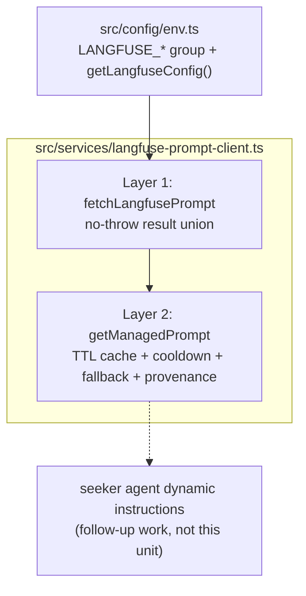
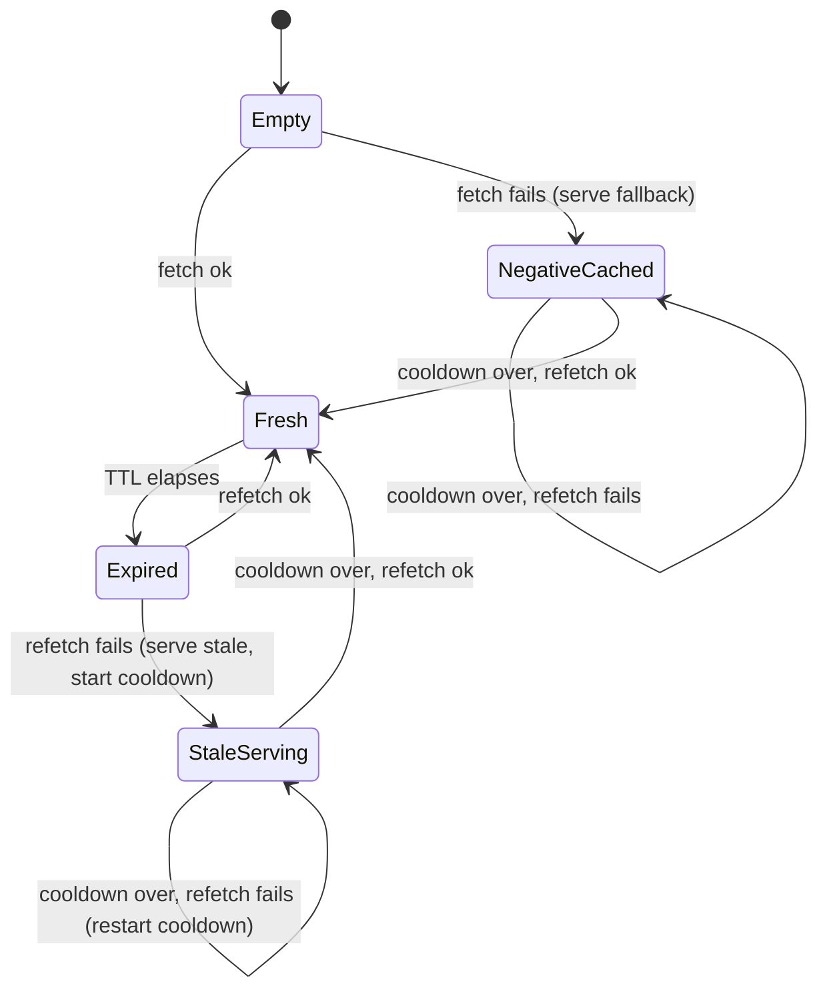

# Langfuse Prompt Management Helper - Plan

## Goal Capsule

- **Objective:** a standalone Langfuse prompt-retrieval helper in `apps/mastra` — fetch a versioned, label-resolved system prompt by name with a caller-supplied fallback — proven by tests that simulate the seeker chat agent retrieving its system prompt. Nothing wires into a live agent.
- **Authority:** this plan's Product Contract (user-confirmed scope) > `apps/mastra/CLAUDE.md` and the repo's client convention doc > implementer judgment on details the plan leaves open.
- **Execution profile:** code. `pnpm --filter @forge/mastra test | typecheck | lint`. Vitest, colocated tests, no vitest.config (defaults).
- **Stop conditions:** do not wire the helper into `seekerAgent`, any agent, workflow, or `/forge-*` route; do not add any required-at-boot env var; do not add the `langfuse`/`@langfuse/*` npm packages; if implementation contradicts a Key Technical Decision, surface it rather than silently diverging.
- **Tail ownership:** implementer runs the Verification Contract and creates the follow-up integration ticket (U5); actual integration is separate future work.

---

## Product Contract

### Summary

Build a retrieval-only Langfuse prompt-management helper inside `apps/mastra`, following the repo's single-service HTTP client convention: a no-throw result-union client over Langfuse's public prompts API, plus a cached, fallback-resolving `getManagedPrompt` layer that returns prompt text with provenance. Proof is a per-branch mocked test suite, a seeker-agent-scenario simulation, and an opt-in real-credential smoke test.

### Problem Frame

The seeker chat agent's system prompt is an inline placeholder string in `apps/mastra/src/mastra/agents/seeker-agent.ts` — acceptable today, but this repository is public-facing. Once the team starts tuning and optimizing these prompts, the tuned text must not live in the public repo. Langfuse provides prompt versioning, labeled rollout/rollback without deploys, and access-controlled storage. Before any agent depends on it, the team needs the retrieval mechanism to exist standalone and be proven trustworthy: never a boot dependency, never a hard failure on the chat path, never a secrets or prompt-body leak.

### Requirements

**Retrieval mechanism**

- R1. The helper fetches a named prompt from Langfuse's public prompts API and returns its text with provenance: resolved label, served version, and whether the managed prompt or the fallback was served.
- R2. Retrieval is label-following: explicit label parameter, else an env-configured default label, else `production`. No implicit `latest`.
- R3. Every caller supplies a fallback prompt; every failure mode resolves to that fallback with a machine-readable reason. The retrieval path never throws.
- R4. Retrieval is retrieval-only: no prompt creation, update, or label mutation. Authoring and versioning stay in the Langfuse UI.

**Resilience and guardrails**

- R5. An in-process TTL cache bounds fetch frequency; a shorter failure cooldown prevents hammering Langfuse from a fallback-serving process; a previously fetched prompt is served stale (and marked stale) in preference to the fallback during an outage.
- R6. The client carries the house invariants of the single-service client convention: no-throw discriminated result union, `AbortSignal.timeout` classified by error name, `redirect: "error"`, byte-capped body reads on success and error paths, leak-controlled upstream text.
- R7. A 200 response that is not a usable text prompt (chat-type array, empty or whitespace-only body) degrades to fallback with a distinguishing detail — it is never served as agent instructions.
- R8. All `LANGFUSE_*` env vars are optional with runtime fallbacks; an unconfigured environment short-circuits to `config_missing` before any fetch and never affects boot. Zero new required env vars.
- R9. When a base URL is configured in production, a fail-closed guard requires https and a host allowlist match, mirroring the existing RAG-client guard; unset config passes the guard silently.

**Observability and secrecy**

- R10. Fetch failures emit a plain-string `event=` log carrying name, label, status/reason — bounded per failure transition (not per fallback serve), with `config_missing` logged once per process. Prompt bodies and key material never appear in logs, results' error text, or thrown errors.

**Proof**

- R11. Every result-union branch and cache-state transition has a mocked test that only that branch can satisfy, including a seeker-agent-scenario test that simulates the chat agent resolving its system prompt with the current inline instructions as fallback.
- R12. An opt-in smoke test, gated on an explicit env flag and skipped by default, proves the real Langfuse API contract (auth, response shape, label resolution) against a pre-seeded prompt in a dev project.

### Acceptance Examples

- AE1. **Managed fetch.** Given configured env and Langfuse serving prompt `seeker-system` version 7 under label `production`, when the helper resolves it, then the returned text is version 7's body with `source: langfuse`, `version: 7`, resolved label `production`.
- AE2. **Unconfigured environment.** Given no `LANGFUSE_*` vars set, when the helper resolves any prompt, then the fallback is returned with reason `config_missing`, no network call is made, and app boot is unaffected.
- AE3. **Outage with warm cache.** Given a previously fetched prompt whose TTL has expired and Langfuse now unreachable, when the helper resolves it, then the stale cached text is served and marked stale, one failure event is logged, and the cooldown suppresses further fetch attempts until it lapses.
- AE4. **Unusable managed prompt.** Given Langfuse returns a chat-type prompt (or an empty body) for the requested name, when the helper resolves it, then the fallback is served with a detail distinguishing `chat_type_unsupported` (or `empty_prompt`) from a transport failure.

### Scope Boundaries

**Deferred to Follow-Up Work** (captured in the U5 roadmap ticket; not in this diff)

- Wiring the seeker agent (or any agent) to consume the helper — including the composition decision of keeping the SAFETY line and the tool-coupled citation wording code-owned while Langfuse owns the tunable persona portion.
- Stale-while-revalidate background refresh (this unit uses a blocking single-attempt refetch; see KTD4).
- Explicit `version` pinning parameter (additive later; provenance already records the served version).
- Sustained-fallback alerting/metrics and prompt-version stamping into Mastra observability spans.
- Langfuse workspace access control review (who may move the `production` label) folded into the ai-chat lane's guardrail release gate.

**Outside this unit's identity**

- Prompt authoring/upload APIs or seed scripts that write to Langfuse.
- Any `/forge-*` service route exposing prompt fetch (no external caller needs it).
- Persisting prompts in Mastra storage or Postgres.
- Langfuse tracing/observability SDK adoption (separate concern; see KTD1).

---

## Planning Contract

### Key Technical Decisions

- KTD1. **Hand-rolled HTTP client, not the Langfuse SDK.** The current SDK generation is `@langfuse/client` v5.9.x (the legacy `langfuse` monolith is documentation-orphaned — never adopt it), and its built-in cache/fallback are good semantics — but it cannot carry the house invariants: production host allowlist on credentialed egress, byte-capped reads, `redirect: "error"`, no-throw unions, leak control. Langfuse keys have full project access (no read-only prompt scope exists — langfuse discussions #1692), which raises the value of the fail-closed egress guard, and the SDK has known open-handle/abort-listener behaviors hostile to long-lived processes and test runners (langfuse-js #858). We adopt the SDK's _semantics_ (60s TTL, fallback-with-provenance, label-following) in a client following `docs/solutions/conventions/single-service-http-client-result-union-convention.md` with `apps/mastra/src/services/jesusfilm-rag-client.ts` as the literal template. Revisit only if Langfuse tracing is ever adopted — a separate decision.
- KTD2. **Two-layer API in one module.** Layer 1: a standard result-union fetch (`ok: true` with text/version/labels, or `ok: false` with reason `config_missing | auth_failed | timeout | network_error | rate_limited | rejected | parse_error`, `retryable`, optional `detail`). Layer 2: `getManagedPrompt({ name, label?, fallback })` collapses every failure to the fallback and returns provenance `{ text, source: "langfuse" | "fallback", version?, resolvedLabel, stale?, reason? }` — provenance is part of the return type, not a log side-effect, so the future integration can stamp/alert without reworking the helper. The helper is async-only: verified against the installed `@mastra/core` 1.36.0 that `DynamicArgument<string>` accepts `Promise<string>`, so it can later serve directly as the seeker's dynamic-instructions function. Mirrors how `retrieve-answer.ts` collapses its client union above the client layer.
- KTD3. **Label resolution before cache keying.** Precedence: call parameter > `LANGFUSE_PROMPT_DEFAULT_LABEL` env (optional) > `"production"`, resolved first, then the cache keys on `name + resolvedLabel`. An omitted label and an explicit `production` share one cache entry; genuinely different labels are independent entries. The env default is the mechanism that lets a staging deployment track staging-labeled prompts with zero consumer code change.
- KTD4. **Cache: blocking refetch, serve-stale, failure cooldown, single-flight; no background work.** Fresh within TTL (default 60s) serves from cache with no fetch. On expiry, a blocking single-attempt refetch runs with a small timeout (default 3s, schema cap 10s — strictly inside any future chat-turn budget per the outbound-timeout law); on failure the stale entry is served and marked, and a failure cooldown (default 10s, cap 5min) suppresses refetches — the config getter clamps the effective cooldown to the effective TTL (the smaller value wins), so the cooldown-below-TTL invariant holds under any env configuration. A cold-start failure negative-caches the reason for the cooldown window. Concurrent callers racing one expired/cold entry share a single in-flight fetch promise; the reserve/release of that slot wraps the entire refetch body in try/finally, so any unexpected wrapper throw clears the slot and resolves to the fallback rather than propagating (the client never rejects, but the slot-leak guard applies regardless, per `docs/solutions/best-practices/in-memory-slot-reservation-fire-and-forget-20260506.md`). No `setInterval`/background refresh: nothing to leak, nothing keeping the test runner alive. SWR deferred.
- KTD5. **Env group all-optional, no base-URL default.** `LANGFUSE_BASE_URL` (`.url().optional()`, no default — Langfuse cloud keys are region-bound, so a hardcoded region default yields confusing 401s; unset simply means unconfigured, the RAG posture), `LANGFUSE_PUBLIC_KEY` / `LANGFUSE_SECRET_KEY` (`.min(1).optional()`; Basic auth `base64(public:secret)` — a documented divergence from the Bearer siblings), `LANGFUSE_ALLOWED_HOSTS` (optional CSV, no default), `LANGFUSE_TIMEOUT_MS` (default 3000, `.max(10000)`), `LANGFUSE_MAX_RESPONSE_BYTES` (default 262144, `.max()`-capped — prompt payloads are small; an uncapped knob fails open), `LANGFUSE_USER_AGENT` (default `forge-mastra-langfuse/1.0`), `LANGFUSE_PROMPT_DEFAULT_LABEL` (optional), `LANGFUSE_PROMPT_CACHE_TTL_MS` (default 60000, capped), `LANGFUSE_PROMPT_FAILURE_COOLDOWN_MS` (default 10000, capped), `LANGFUSE_PROMPT_SMOKE_TEST` (`z.enum(["1"]).optional()`). All through `emptyToUndefined`; none enter `assertMastraRuntimeEnv`'s `missing` list; `config_missing` detail is three-way (`base_url_missing | public_key_missing | secret_key_missing`).
- KTD6. **Content validation at the client.** The Zod response schema (`.passthrough()`, only consumed fields) requires `type: "text"` and a string prompt body; a chat-type prompt fails with detail `chat_type_unsupported`, a whitespace-only body with `empty_prompt`. Prompt names are `encodeURIComponent`-ed in the URL path (Langfuse names may contain `/`). Fetched text is returned verbatim — no `{{variable}}` compilation in this unit.
- KTD7. **Test strategy.** Injected `config`, `fetchImpl`, and `now: () => number` (the `ai-chat-retention.ts` clock precedent — no fake timers), plus an injectable/resettable cache so vitest files stay isolated. Per the mocked-shape-vs-real-contract discipline, every reason/detail branch and every cache state-machine edge gets a test only it can satisfy; the byte-cap test asserts the abort mechanism (a real `ReadableStream` whose `cancel()` sets a flag), not just the result shape. The smoke test is `describe.skipIf` gated on `LANGFUSE_PROMPT_SMOKE_TEST === "1"` (the admin `video-mapper-catalog.db.test.ts` precedent) against a manually pre-seeded prompt in the dev Langfuse project; it fails loudly if credentials are present but the seeded prompt is missing, and never self-seeds.
- KTD8. **Environment separation is separate Langfuse projects per environment** (dev/staging/prod key pairs in Railway), not labels-within-one-project: a leaked dev key must not read tuned prod prompt text, matching the org's per-environment key-separation posture. Within each project, `production` should be a protected label (admin-only mutation). This is operational guidance for whoever provisions Langfuse — the helper itself only ever sees one project's keys.

  > **[SUPERSEDED 2026-07-28 — the project-topology half only.]** KTD8's per-environment-projects mandate was reversed before provisioning began; the live instruction is **ONE Langfuse project (`forge-mastra`) with labels distinguishing environments**, recorded in `docs/roadmap/ai-chat/feat-296-langfuse-configuration.md`. Three premises did not hold for this project: (1) `apps/mastra` has exactly **one** deployed environment — there is no staging or preview Mastra service, and Railway PR environments inherit from stage, which has no Mastra service, so "dev/staging/prod" describes nothing here; (2) the leaked-dev-key threat requires the dev-key holder set to differ from the prod-key holder set, and it does not — and for local work against Langfuse to be representative the dev project would have to carry the tuned text anyway; (3) the org's only production Langfuse deployment (Journeys, in `JesusFilm/core`, in the same Langfuse organisation this project now lives in) is single-project-with-labels, so the "matches org posture" justification pointed the wrong way. The decisive cost KTD8 never weighed: prompt versions and labels are project-scoped and Langfuse has no cross-project copy, so per-environment projects make promotion a manual re-authoring with forked version numbering — precisely where certainty about what is live matters most. **KTD8's governance half survives at full strength** and matters more under one project, since the label move becomes the entire release mechanism: keep `production` protected/admin-only and keep the label-move access-control review in feat-272.

### High-Level Technical Design

Component layering — everything new lives in two files; the dashed consumer is future work:

Cache-entry state machine — each edge is a U3 test scenario:

### Risks and Dependencies

- **Langfuse provisioning is an unowned external dependency.** No Langfuse account, project, or keys exist anywhere in this repo or its deploy config today. U1–U3 and the entire mocked suite need none of it; the U4 smoke and any real-world proof do. Mitigation: the smoke is opt-in and skipped by default, unconfigured is a first-class helper state, and the provisioning decision is tracked in Open Questions rather than assumed.
- **Mocked fixtures can drift from the real API contract.** Mitigation: fixtures are transcribed from the documented v2 response with provenance comments and capture date (U2 execution note), and the opt-in smoke is the real-contract gate per the mocked-shape-vs-real-contract discipline — run it when Langfuse is first provisioned and after any suspected API change.
- **Langfuse keys carry full project access.** No read-only prompt scope exists, so a leaked key reads all project data and can write traces. Mitigation: per-environment projects with separate key pairs (KTD8), the fail-closed production https+allowlist guard (R9), and keys living only in Railway service variables.

  > **[SUPERSEDED 2026-07-28 — the mitigation clause only; the risk itself still stands.]** The per-environment-projects mitigation was reversed with KTD8 (see the note there). The live mitigations are: **two key pairs inside the one `forge-mastra` project** — one for Railway, one for local dev — so a leaked local key is revoked in a single action without rotating the production credential; the fail-closed production https+allowlist guard (R9), unchanged; and `production` kept as a protected/admin-only label. Note the risk's sharper edge, which the original phrasing understates: because the credential is coarse, a leaked key can **write** — push a new version and repoint `production` at attacker-controlled text that becomes the agent's instructions. That is true of the production key under any project topology, so custody, not topology, is the control. Trace exposure is deliberately out of scope here because nothing sends traces to Langfuse; see `docs/roadmap/ai-chat/feat-321-langfuse-tracing.md`.

- **Silent divergence: production serving the fallback while operators assume the tuned prompt is live.** In this unit the blast radius is zero (nothing consumes the helper), but the failure mode is designed in from day one: provenance in the return type (KTD2) and transition-bounded failure logging (R10) are the hooks; sustained-fallback alerting is a named deferred item.
- **Prompt governance shifts once anything consumes the helper.** A Langfuse label move becomes an unreviewed production behavior change, bypassing PR review and CI. Out of this unit's blast radius, but the follow-up ticket (U5) must carry it into the ai-chat lane's guardrail release gate alongside the protected-label posture (KTD8).

### Open Questions

- **Deferred (operational, non-blocking for this unit):** Langfuse hosting posture and ownership — Langfuse Cloud (which region: EU vs US, since keys and base URLs are region-bound) vs self-hosted, and who provisions the per-environment projects, key pairs, and the seeded smoke prompt.

  > **[ANSWERED 2026-07-28.]** Langfuse Cloud, in the same organisation as `JesusFilm/core`'s Journeys project (which therefore fixes the region — read it off that organisation). **One** project, `forge-mastra`, with labels distinguishing environments; two key pairs inside it, Railway and local dev. See the KTD8 supersession note above and `docs/roadmap/ai-chat/feat-296-langfuse-configuration.md`, which is now the authoritative provisioning instruction. Does not block U1–U5 or the mocked proof; must be answered before the U4 smoke can ever run and before the follow-up integration starts. The helper is deliberately posture-agnostic (`LANGFUSE_BASE_URL` has no default) so either answer plugs in without code change.

### Sources and Research

- `docs/solutions/conventions/single-service-http-client-result-union-convention.md` — the client contract this plan follows; names the RAG client as template and mandates `redirect: "error"` for credentialed clients.
- `apps/mastra/src/services/jesusfilm-rag-client.ts` + `.test.ts` — literal template: `config_missing` detail, `failureForStatus`, `endpoint()`, `safeReason`, `readJsonBodyCapped` (copy with provenance comment — no shared helpers module exists yet), and the gold-standard test suite shape.
- `docs/solutions/runtime-errors/required-env-var-without-default-broke-railway-deploy-20260511.md`, `docs/solutions/best-practices/outbound-timeout-shorter-than-caller-budget-20260506.md`, `docs/solutions/best-practices/buffered-http-response-byte-cap-oom-guard-20260629.md`, `docs/solutions/best-practices/mocked-shape-vs-real-contract-discipline-20260506.md` — the four learnings that shaped R5–R9 and KTD5/KTD7.
- `docs/solutions/runtime-errors/silent-semantic-search-degradation-missing-openrouter-key-20260415.md` — why graceful-by-design degradation still logs (R10).
- Langfuse docs: prompt-management get-started, caching (60s TTL default, stale-while-revalidate), guaranteed availability (fallback), version control (labels, protected labels), environments FAQ (projects vs native environments) — langfuse.com/docs/prompt-management.
- SDK status (research 2026-07): current is `@langfuse/client` 5.9.x; legacy `langfuse` 3.x is documentation-orphaned; no read-only key scope (discussion #1692); abort-listener leak langfuse-js #858. Basis of KTD1.
- Verified locally: `@mastra/core` 1.36.0 `dist/types/dynamic-argument.d.ts` — `DynamicArgument<T>` accepts `Promise<T> | T`, so the async helper can back a dynamic-instructions function (KTD2).
- `apps/admin/src/services/video-mapper-catalog.db.test.ts` — the repo's env-gated `describe.skipIf` smoke precedent (KTD7).

---

## Implementation Units

### U1. Langfuse env config group

- **Goal:** the `LANGFUSE_*` group in the env schema with getter, runtime defaults, and the conditional production guard — provably optional end to end.
- **Requirements:** R8, R9; KTD5.
- **Dependencies:** none.
- **Files:** `apps/mastra/src/config/env.ts`, `apps/mastra/src/config/env.test.ts`.
- **Approach:** clone the `JESUSFILM_RAG_*` block shape: schema entries + explicit `envSchema.parse({...})` mapping additions + `LangfuseConfig` type + `getLangfuseConfig()` projecting runtime fallbacks + `assertLangfuseBaseUrlAllowedForProduction()` registered in `assertMastraRuntimeEnv` (fires only when the base URL is set; never adds to `missing`).
- **Patterns to follow:** env.ts `emptyToUndefined` idiom; `z.coerce.number().int().positive().max(n)` knobs; `stubProductionBaseline()` + dynamic-import test structure in env.test.ts.
- **Test scenarios:**
  - Module imports cleanly with every `LANGFUSE_*` var unset (the Railway-brick regression gate).
  - Empty-string values behave as unset.
  - `getLangfuseConfig()` projects the full group including runtime defaults (timeout 3000, TTL 60000, cooldown 10000, byte cap 262144, user agent, label undefined).
  - Over-cap `LANGFUSE_TIMEOUT_MS` / TTL / cooldown / byte-cap values reject at parse.
  - A configured cooldown larger than the configured TTL is clamped to the TTL in the projected config (the smaller value wins).
  - Production guard matrix: unset base URL passes; http base URL in production throws; https base URL with host absent from `LANGFUSE_ALLOWED_HOSTS` throws; https + allowlisted passes; guard silent outside production.
  - `LANGFUSE_PROMPT_SMOKE_TEST` accepts only `"1"`.
- **Verification:** `pnpm --filter @forge/mastra test` green; the all-unset import test proves zero new required vars.

### U2. Result-union prompt fetch client

- **Goal:** layer 1 — a single-attempt, no-throw fetch of one prompt by name + label from `GET /api/public/v2/prompts/{name}` with the full house invariant set.
- **Requirements:** R1, R2 (label passed through), R4, R6, R7; KTD1, KTD6.
- **Dependencies:** U1.
- **Files:** `apps/mastra/src/services/langfuse-prompt-client.ts`, `apps/mastra/src/services/langfuse-prompt-client.test.ts`.
- **Approach:** entry function takes `{ name, label, config = getLangfuseConfig(), fetchImpl = fetch }`. Three-way `config_missing` short-circuit before any fetch. Basic auth from the key pair, lowercase headers, per-service user agent, `redirect: "error"`, `AbortSignal.timeout` classified by error name, `failureForStatus` (401/403 auth_failed, 429 rate_limited, other 4xx rejected with status carried, 5xx network_error), byte-capped body read on success and error paths, `safeReason` on upstream text, Zod `.passthrough()` parse of only consumed fields (`prompt`, `version`, `labels`, `type`), `encodeURIComponent` on the name segment. Chat-type and empty-body responses fail with their KTD6 details.
- **Execution note:** transcribe test fixtures field-for-field from Langfuse's documented v2 response with a provenance comment and capture date, mirroring the RAG client test's fixture discipline.
- **Patterns to follow:** `jesusfilm-rag-client.ts` end to end, including its header comments explaining each invariant; note the Basic-auth divergence from Bearer siblings in the header comment.
- **Test scenarios:**
  - Happy path with exact-request assertion: encoded URL (fixture name containing `/`), `label` query param, `authorization: Basic <expected-base64>`, user-agent, `redirect: "error"`; result carries text, version, labels.
  - Three `config_missing` details (base URL / public key / secret key absent), each with zero fetch calls.
  - Status classification: 401 and 403 → `auth_failed`; 429 → `rate_limited`; 404 → `rejected` with `status: 404`; 500 → `network_error`.
  - Thrown `TimeoutError` and `AbortError` (real typed shapes via `Object.assign(new Error(...), { name })`) → `timeout`; classification is by name, never message.
  - Malformed JSON → `parse_error`; leak-control assertion that a secret marker string in the body never appears in the serialized result.
  - Chat-type prompt body → failure with detail `chat_type_unsupported`; whitespace-only text → `empty_prompt`.
  - Additive unknown response fields tolerated; trailing-slash and path-prefixed base URLs both join correctly.
  - Byte-cap: over-cap body aborts via a real `ReadableStream` whose `cancel()` sets an observable flag, degrading to `parse_error`.
- **Verification:** every `reason`/`detail` value has at least one test only it satisfies; suite green.

### U3. Cached managed-prompt helper with fallback provenance

- **Goal:** layer 2 — `getManagedPrompt({ name, label?, fallback })` with TTL cache, failure cooldown, serve-stale, single-flight, provenance result, and bounded failure logging.
- **Requirements:** R2, R3, R5, R10; KTD2, KTD3, KTD4.
- **Dependencies:** U2.
- **Files:** `apps/mastra/src/services/langfuse-prompt-client.ts`, `apps/mastra/src/services/langfuse-prompt-client.test.ts`.
- **Approach:** resolve the label (param > env default > `production`) before keying the cache on name + resolved label. Cache entries hold value, fetch time, failure state, and the in-flight promise for single-flight. Failure logging uses the repo's plain-string format (`[langfuse] event=prompt_fetch_failed name=... label=... reason=... status=...`) on fetch-failure transitions only; `config_missing` logs once per process; fallback serves within a cooldown do not re-log. The state machine in the High-Level Technical Design is the behavioral contract — put it (or a reference to it) in the module header comment.
- **Execution note:** derive the test list directly from the state-machine edges — every arrow is one scenario; write them against an injected clock, not fake timers.
- **Patterns to follow:** `retrieve-answer.ts` for union-collapsing and its `[seeker] event=` log line shape; `ai-chat-retention.ts` for the injected `now` parameter.
- **Test scenarios:**
  - Cold success → `source: "langfuse"` with version and resolved label; entry cached.
  - Fresh hit within TTL → no second fetch (fetch mock call count pinned).
  - Expired + refetch success → new text served and cached.
  - Expired + refetch failure with stale present → stale text served with `stale: true`, exactly one failure log, cooldown active.
  - Within cooldown → no fetch attempt (stale or fallback served from state).
  - Cold failure → fallback with reason; repeated calls within cooldown neither refetch nor re-log.
  - Cooldown lapse + refetch success → failure state cleared, fresh entry.
  - Cooldown lapse + refetch fails again (stale present) → stale served again, cooldown restarts, and a new failure event is logged — repeated failures log once per attempt (bounded to one per cooldown window), never once per serve.
  - Cooldown lapse + refetch fails again (no stale) → fallback served again, cooldown restarts, and a new failure event is logged.
  - Two concurrent cold callers → exactly one underlying fetch (single-flight).
  - A synchronous throw injected inside the refetch wrapper (e.g., a failing log sink) clears the in-flight slot and resolves that call and subsequent calls to the fallback — it never propagates and never wedges the cache entry.
  - Omitted label and explicit `production` share one cache entry; a different label is an independent entry.
  - `config_missing` logs once per process across repeated calls.
  - Leak assertion: captured log lines contain name/label/reason but never fallback or fetched prompt text.
  - Cache reset hook (or injected cache) isolates state between test files.
- **Verification:** every state-machine edge has a matching test; suite green.

### U4. Seeker-scenario test and opt-in real-credential smoke

- **Goal:** prove the mechanism in the shape the chat agent will use it, and prove the real Langfuse contract end to end without any CI cost.
- **Requirements:** R11, R12; KTD7.
- **Dependencies:** U3 (and U1 for the smoke flag).
- **Files:** `apps/mastra/src/services/langfuse-prompt-client.test.ts` (scenario block), `apps/mastra/src/services/langfuse-prompt-client.smoke.test.ts` (new).
- **Approach:** the scenario test uses a duplicated copy of the seeker agent's current inline instruction text as its fallback fixture — a local constant in the test file with a source comment; never an import, so `apps/mastra/src/mastra/agents/seeker-agent.ts` stays untouched — and a "tuned" variant as the mocked managed prompt — asserting the managed text is served verbatim when available and the exact inline text is served verbatim on failure. This encodes the expectation the follow-up wiring inherits: the fallback is the full working prompt, never a stub, and the helper does no composition or guarding of safety lines (that decision is explicitly deferred). The smoke file is `describe.skipIf(env.LANGFUSE_PROMPT_SMOKE_TEST !== "1")`; its header documents the seeding convention: a dedicated prompt (suggested name `forge-mastra-smoke/text-prompt`, label `production`, known sentinel body) created manually once in the dev Langfuse project. The slashed name doubles as a live proof of URL encoding.
- **Test scenarios:**
  - Covers AE1 / AE2. Seeker scenario: managed prompt available → tuned text returned with `source: "langfuse"`, usable as an agent `instructions` string; Langfuse unavailable → byte-identical inline fallback text with `source: "fallback"`.
  - Smoke (opt-in): seeded prompt resolves `ok` with non-empty text, numeric version, and the requested label among its labels; a deliberately nonexistent prompt name returns the `rejected` union branch (no throw) and `getManagedPrompt` returns the fallback for it.
  - Smoke fails loudly (not skips) when credentials are present but the seeded prompt is missing.
- **Verification:** default `pnpm --filter @forge/mastra test` runs with the smoke suite reported as skipped; setting the flag plus dev keys runs it green against the seeded prompt.

### U5. Documentation and follow-up ticket

- **Goal:** the repo's operator/agent-facing docs know the new surface, and the integration work is a tracked ticket rather than folklore.
- **Requirements:** R4 (documents the retrieval-only boundary), Scope Boundaries.
- **Dependencies:** U1–U4.
- **Files:** `apps/mastra/CLAUDE.md`, `apps/mastra/AGENTS.md`, `CONCEPTS.md`, new ticket under `docs/roadmap/ai-chat/`.
- **Approach:** add the `LANGFUSE_*` rows to the CLAUDE.md env table and a short "Langfuse prompt management" section stating the two-layer shape, the retrieval-only boundary, the KTD8 project-per-environment posture, and where the smoke seeding convention lives; mirror the ownership bullet in AGENTS.md. Add a concise CONCEPTS.md entry for the managed-prompt mechanism under the AI chat section. Create the follow-up integration ticket in the ai-chat lane covering the deferred items in Scope Boundaries — read `docs/roadmap/ai-chat/CLAUDE.md` first for that lane's ID allocation and README conventions.
- **Test expectation:** none — documentation and ticket-creation unit.
- **Verification:** env table rows match the shipped schema names/defaults exactly; the ai-chat lane README/ticket follow the lane's conventions; no lane ticket ID collision.

---

## Verification Contract

| Gate                                 | Command                                                      | Applies to | Done signal                                                   |
| ------------------------------------ | ------------------------------------------------------------ | ---------- | ------------------------------------------------------------- |
| Unit tests                           | `pnpm --filter @forge/mastra test`                           | U1–U4      | Green; smoke suite reported skipped by default                |
| Types                                | `pnpm --filter @forge/mastra typecheck`                      | all        | Clean                                                         |
| Lint                                 | `pnpm --filter @forge/mastra lint`                           | all        | Clean                                                         |
| Zero-required-env proof              | env.test.ts all-unset import case                            | U1         | Passes with no `LANGFUSE_*` set                               |
| No-wiring guard                      | `grep -r "langfuse" apps/mastra/src/mastra/`                 | U2–U4      | No hits — agents, workflows, tools, and routes stay untouched |
| Real-contract smoke (manual, opt-in) | `LANGFUSE_PROMPT_SMOKE_TEST=1` + dev keys, same test command | U4         | Smoke green against the seeded dev-project prompt             |

The smoke gate requires one-time manual setup: dev Langfuse project keys and the seeded smoke prompt (U4's header documents name/label/body). It never runs in CI.

---

## Definition of Done

- U1–U5 landed; all Verification Contract gates pass.
- Every client `reason`/`detail` branch and every cache state-machine edge has an isolating test (spot-checkable against the HTD diagram).
- No new required env vars (all-unset import test), no agent/workflow/route wiring (grep gate), no `langfuse`/`@langfuse/*` dependency in any manifest.
- Prompt bodies and key material absent from logs and serialized results (leak-control tests pass).
- `apps/mastra/CLAUDE.md` env table and AGENTS.md updated to match the shipped schema; CONCEPTS.md entry added; follow-up integration ticket exists in the ai-chat lane.
- No dead or experimental code from abandoned approaches remains in the diff.
