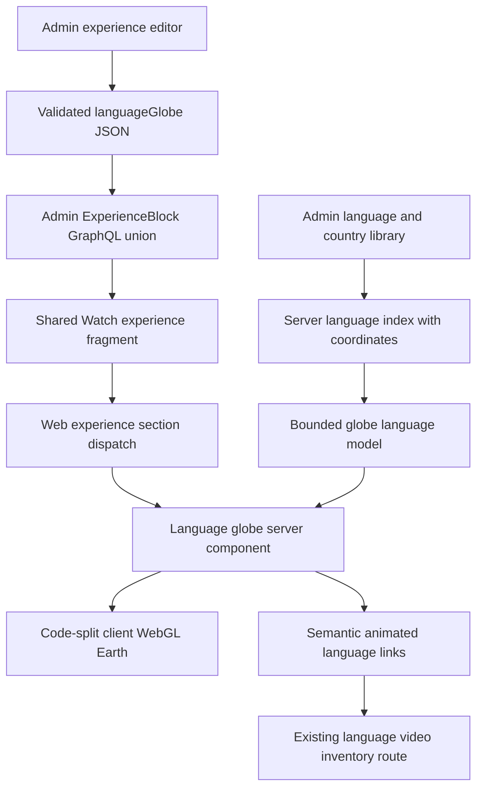

# Language Globe Experience Block - Plan

## Goal Capsule

- **Objective:** Add an authorable experience block that renders a responsive spinning Earth, places animated language links from Admin-backed geographic data, and opens each language's Watch video inventory.
- **Authority:** The user request and `docs/roadmap/topic-experiences/feat-275-language-globe-experience-block.md` define behavior; existing Admin block, GraphQL, Web language-index, and public-route conventions define implementation shape.
- **Execution profile:** Standard cross-contract frontend feature with proof-first schema, editor, data, and renderer tests.
- **Stop conditions:** Stop if a real-catalog preflight finds fewer than 12 eligible languages across four continents without a new external data source, if the block would require a production deploy outside the PR flow, or if generated GraphQL contracts cannot be regenerated from Admin.
- **Tail ownership:** `ce-work` owns implementation, verification, review, roadmap completion, and durable learnings; no production deploy is in scope.

---

## Product Contract

### Summary

Add a CMS-authored language globe to experience pages. The block uses the existing Watch language library to render native-first labels around a rotating Earth and links each label to that language's video page.

### Problem Frame

The experience system can present text, video, and navigation blocks but has no geographic language-discovery surface. The language index already owns names, country relationships, public slugs, and inventory routes; the missing capability is a visually engaging block that reuses those contracts inside an experience.

### Requirements

**Experience authoring and contracts**

- R1. Experience authors can add a top-level language globe block and configure its heading, description, background color, and label count from 4 through 24, defaulting to 12.
- R2. Admin validates, stores, and exposes the block through the typed ExperienceBlock GraphQL union.

**Viewer experience**

- R3. The block renders a realistic textured Earth that rotates continuously when motion is allowed and the block is visible.
- R4. Language boxes animate around the globe using geographic coordinates derived from the existing language-country library.
- R5. Every language box displays the native name first and the English name on a secondary line.
- R6. Activating a language box opens the canonical Watch video inventory for that public language slug.
- R7. The block remains usable with keyboard navigation, a visible pause/resume control, reduced motion, no WebGL, and responsive mobile layouts.
- R8. Every selected language remains available exactly once in a fixed semantic link list; orbiting labels are visual duplicates hidden from assistive technology and never become invisible keyboard targets.
- R9. On viewports up to 640px, no more than six labels orbit at once, remaining selected languages stay in the fixed list, and interactive targets are at least 44 by 44 CSS pixels.

**Performance and ownership**

- R10. The globe code and local texture do not enter the initial route bundle until the block is rendered, and animation pauses when offscreen or the document is hidden.
- R11. Language identity and links reuse the Admin-backed language index and route builders rather than creating a parallel catalog.
- R12. A language-metadata query failure is contained to this block: authored copy and a static fallback remain, sibling experience blocks still render, and no Admin credential or raw upstream error reaches the browser.

### Acceptance Examples

- AE1. Given a Spanish library row with native label `Español`, English label `Spanish`, coordinates, and public slug `spanish-latin-american`, when the block renders, its link shows `Español` above `Spanish` and points to `/spanish-latin-american.html/videos`.
- AE2. Given more library languages than the configured limit, when the block renders, it selects no more than the configured count by descending total speaker count and then English label; selected entries without usable coordinates remain in the fixed list but do not create orbit labels.
- AE3. Given `prefers-reduced-motion: reduce`, when the block mounts, the globe and labels remain readable and interactive without continuous rotation.
- AE4. Given WebGL initialization or texture loading fails, when the block renders, the language links remain visible and operable over a static fallback.
- AE5. Given projected label boxes overlap, when the block renders, the higher-ranked front-facing label remains visible and lower-ranked colliding labels hide until they no longer intersect; the fixed link list still exposes every language.
- AE6. Given no library language has usable coordinates, when the block renders, it shows the authored copy and a fixed language list without mounting an empty globe.
- AE7. Given the Admin language-metadata query rejects, when an experience renders, the globe block shows authored copy and a static unavailable state while the page's sibling blocks continue rendering.

### Scope Boundaries

- No new language records, translated UI catalogs, video-inventory query, or destination route are introduced.
- No drag-to-rotate, zoom, search, clustering, or country detail modal is included in this block.
- No mobile or TV renderer is added in this scope; their consumers may safely ignore the new GraphQL union member until parity work is scheduled.
- No production deployment or CMS content publication is performed.

---

## Planning Contract

### Key Technical Decisions

- **KTD1. Extend the existing block contract end to end.** Add one Zod discriminator, one Pothos object and union member, one shared fragment, one editor template, and one Web dispatch case so stored JSON, GraphQL, authoring, and rendering stay aligned.
- **KTD2. Source placement from country coordinates already synchronized into Admin.** Extend the language-index metadata query to include country latitude and longitude, rank each language's eligible country associations by suggested, primary, speaker count, and editorial order, then greedily choose assignments that preserve at least 12 degrees of separation and continental spread before accepting coordinate collisions.
- **KTD3. Use a code-split raw WebGL renderer with separate visual and semantic links.** A small shader renders the textured sphere, orbiting DOM labels are presentation-only, and one fixed `next/link` list provides stable keyboard, screen-reader, and touch navigation; this avoids a large 3D dependency and keeps accessibility outside the canvas. Prove the shader and projection path before full UI work and keep its client chunk at or below 15 KB gzip and the local texture at or below 250 KB; if either limit is missed, compare the smallest maintained renderer against the same limits before proceeding.
- **KTD4. Render language data on the server and animate only presentation on the client.** The server component reads the cached language index and passes a bounded serializable list into the client renderer; it catches metadata failures at the block boundary so siblings still render, and no Admin bearer, browser-side GraphQL request, or raw upstream error is introduced.
- **KTD5. Treat performance and motion as product behavior.** Intersection visibility, document visibility, reduced-motion preference, device-pixel-ratio caps, and a static fallback are part of the renderer contract rather than optional polish.

### High-Level Technical Design

### Assumptions

- Country latitude and longitude values are expected to support at least 12 eligible public languages across four continents; U3 measures this against the reachable Admin catalog before contract work proceeds. Languages without usable coordinates are omitted from orbit labels rather than assigned invented locations.
- The block-level label limit defaults to 12 and is constrained from 4 through 24; desktop may orbit up to 12 selected labels while mobile orbits six and exposes the rest in the fixed list.
- A locally generated equirectangular Earth texture is acceptable as a visual asset when it contains no labels, borders, logos, or claims of cartographic precision.
- Web is the requested rendering target because it owns the current experience-page renderer and language video routes.

### Sequencing

U3 starts with the real-catalog eligibility probe so the load-bearing coordinate assumption fails before contract work. After that gate, the persistence and GraphQL contract lands, followed immediately by the shared fragment and generated client contract; editor authoring and the remainder of coordinate projection then precede the renderer.

---

## Implementation Units

### U1. Add the persisted and typed block contract

- **Goal:** Make `languageGlobe` valid stored experience data and a typed Admin GraphQL union member.
- **Requirements:** R1, R2.
- **Dependencies:** None.
- **Files:** Modify `apps/admin/src/domain/blocks.ts`, `apps/admin/src/domain/blocks.test.ts`, `apps/admin/src/graphql/types/blocks.ts`, `apps/admin/src/graphql/types/blocks.test.ts`, and `apps/admin/src/graphql/types/blocks.drift.test.ts`; regenerate `apps/admin/schema.graphql`.
- **Approach:** Add bounded authoring fields, wire resolver dispatch and object fields, and include the object only in the top-level ExperienceBlock union.
- **Execution note:** Add the minimum-valid Zod and GraphQL dispatch fixtures first and capture their expected failures before production changes.
- **Patterns to follow:** `VideoRecommendationsBlockSchema`, `WatchHomeHeroBlockRef`, `resolveBlockType`, and the union drift tests.
- **Test scenarios:** A valid default/minimum block parses; an out-of-range language limit fails; unknown fields remain rejected; GraphQL resolves `t: languageGlobe` to `LanguageGlobeBlock`; drift coverage proves Zod and Pothos union membership agree.
- **Verification:** Focused Admin domain and GraphQL block tests pass, and schema print includes the new type and ExperienceBlock member.

### U2. Add Admin experience-editor authoring

- **Goal:** Let an operator insert, identify, configure, save, and reopen the block.
- **Requirements:** R1, R2.
- **Dependencies:** U1.
- **Files:** Modify `apps/admin/src/app/dashboard/experiences/experience-editor/block-helpers.ts`, `apps/admin/src/app/dashboard/experiences/experience-editor/block-helpers.test.ts`, `apps/admin/src/app/dashboard/experiences/experience-editor.tsx`, and the closest existing editor component test.
- **Approach:** Add a Globe library entry, stable defaults, a concise canvas summary, and first-class heading/description/background/count controls while preserving raw JSON fallback behavior.
- **Execution note:** Strengthen helper/editor tests before changing templates so insertion and serialization fail for the missing discriminator.
- **Patterns to follow:** `BLOCK_LIBRARY`, `createTemplateBlock`, `summarizeBlock`, and the simple text/block inspector controls.
- **Test scenarios:** Inserting creates a valid `languageGlobe` block with defaults; the canvas summary identifies the block and configured count; editing fields serializes normalized JSON; reopening preserves values; invalid count input is clamped to the schema range.
- **Verification:** Focused helper/editor tests, Admin lint, and Admin typecheck pass.

### U3. Carry coordinates through the Web language index

- **Goal:** Produce a canonical server-side list of language labels, routes, ranking, and globe coordinates from existing Admin data.
- **Requirements:** R4, R5, R6, R11; AE1, AE2.
- **Dependencies:** None.
- **Files:** Modify `apps/web/src/lib/language-index.ts` and `apps/web/src/lib/language-index.test.ts`; create `apps/web/scripts/probe-language-globe-coverage.ts`.
- **Approach:** Probe the reachable Admin catalog for public slug, native label, valid coordinates, continent coverage, and coordinate concentration. Rank candidate countries per language, then assign placements jointly to favor 12-degree separation and continental spread before collisions; expose nullable globe coordinates without changing canonical href logic.
- **Execution note:** Run the catalog probe before U1 and stop when it cannot establish 12 eligible languages across four continents. Then add coordinate-selection, deconfliction, and canonical-link expectations first and observe the missing-field failure.
- **Patterns to follow:** `bestFlagPngSrc`, `countryLanguageSpeakerCount`, `languageIndexEntryFromMetadata`, and `languageVideosIndexPath`.
- **Test scenarios:** The probe reports eligibility, continent coverage, and duplicate-coordinate concentration; suggested country coordinates win when separation permits; primary wins when none is suggested; higher speaker count and editorial order break remaining ties; a lower-ranked candidate wins when it prevents a coordinate collision; missing/invalid coordinates return null; native and English names remain stable; public href uses the language slug and not BCP-47.
- **Verification:** The coverage probe clears the 12-language/four-continent threshold and focused language-index tests pass with unchanged behavior for existing regions and countries.

### U4. Build and dispatch the interactive globe renderer

- **Goal:** Render the responsive, animated, accessible globe and language links on experience pages.
- **Requirements:** R3-R12; AE1-AE7.
- **Dependencies:** U1, U3, U5.
- **Files:** Create `apps/web/src/components/sections/LanguageGlobe.tsx`, `apps/web/src/components/sections/LanguageGlobeClient.tsx`, `apps/web/src/components/sections/language-globe-projection.ts`, `apps/web/src/components/sections/LanguageGlobe.test.tsx`, and `apps/web/public/watch/images/experiences/language-globe-earth.webp`; modify `apps/web/src/components/sections/index.tsx`.
- **Approach:** Type the server component directly from `AdminFragmentOf<typeof adminLanguageGlobeFragment>` in `@forge/admin-graphql`, without importing Admin application source. Resolve and rank languages in the server component; catch metadata-query failures at this block boundary; dynamically load a client canvas that uses a local texture and raw WebGL sphere shader; project the same rotation into presentation-only DOM labels; suppress lower-ranked box collisions; render every selected language once in a fixed semantic link list; keep that list usable above a static fallback when WebGL is unavailable, metadata fails, or no coordinates exist. Render authored copy and links on invariant dark translucent surfaces with white text so author-selected backgrounds preserve at least 4.5:1 normal-text contrast.
- **Execution note:** Begin with projection math, label order/link, limit, fallback, metadata-rejection, and sibling-render tests. Build the minimal shader/projection proof and measure its generated client chunk and texture before completing visual UI. Browser-only GPU rendering is verified with a smoke rather than mocked shader assertions.
- **Patterns to follow:** Dynamic section imports in `apps/web/src/components/sections/index.tsx`, `WatchLanguageIndexBrowser`, Watch section visual styles, and public route builders.
- **Test scenarios:** Native name precedes English; canonical link targets the language inventory; configured 4-24 limit is respected; descending speaker count and English label determine selection; entries without coordinates do not create globe labels; front-facing projection controls presentation opacity; collisions retain the higher-ranked label; Tab reaches each selected language exactly once through the fixed list; the pause button exposes and changes state; reduced motion fixes rotation; mobile orbits at most six labels with 44-pixel targets; WebGL/texture/no-coordinate failure leaves working links; metadata rejection leaves the authored fallback and sibling sections intact; light and dark authored backgrounds preserve contrast surfaces; resize caps canvas pixel density.
- **Verification:** Focused component and projection tests pass; desktop/mobile browser smoke shows no overlap, focus loss, horizontal overflow, or unreadable rear labels.

### U5. Regenerate the shared client contract and integrate the fragment

- **Goal:** Make Web receive the new block from Admin through generated gql.tada types and the shared Watch experience fragment.
- **Requirements:** R2, R10.
- **Dependencies:** U1.
- **Files:** Create `packages/admin-graphql/src/fragments/blocks/language-globe.ts`; modify `packages/admin-graphql/src/fragments/watch-experience.ts`, `packages/admin-graphql/src/fragments/index.ts`, and fragment tests; regenerate `packages/admin-graphql/src/admin-graphql-env.d.ts`.
- **Approach:** Add a flat block fragment, spread it from the root experience union, export it through the fragment barrel, and regenerate from committed Admin SDL.
- **Execution note:** Add fragment-source expectations before wiring the new spread.
- **Patterns to follow:** `adminNavigationCarouselFragment`, `adminWatchHomeHeroFragment`, and Watch experience fragment tests.
- **Test scenarios:** The root fragment spreads `LanguageGlobeBlock`; all authored fields are selected; gql.tada generation recognizes the type; existing block fragments remain present.
- **Verification:** Admin GraphQL generation is clean, package tests/typecheck pass, and Web typecheck consumes the generated union without handwritten casts beyond the existing renderer boundary.

### U6. Run integrated quality and loading checks

- **Goal:** Prove cross-layer behavior, accessibility, and page-loading posture before handoff.
- **Requirements:** R3-R12; AE1-AE7.
- **Dependencies:** U1-U5.
- **Files:** Modify the closest Web experience renderer test if integration coverage needs a fixture; update `docs/roadmap/topic-experiences/feat-275-language-globe-experience-block.md` after all gates pass.
- **Approach:** Run focused and package checks, inspect the production bundle/build result, and smoke the block at desktop and mobile widths with motion and fallback states.
- **Test scenarios:** A GraphQL-shaped LanguageGlobeBlock reaches the correct renderer; the initial route without this block does not load globe client code or texture; a route with the block renders links before/without GPU success; a metadata failure does not reject the page render; keyboard focus and reduced motion remain functional.
- **Verification:** Verification Contract passes, review findings are resolved or explicitly routed, the roadmap ticket is complete, and abandoned code/assets are absent.

---

## Verification Contract

| Gate                                           | Applies to | Done signal                                                                                                                                                   |
| ---------------------------------------------- | ---------- | ------------------------------------------------------------------------------------------------------------------------------------------------------------- |
| Focused Admin block and editor tests           | U1, U2     | New discriminator, union, editor defaults, editing, and serialization pass                                                                                    |
| Admin lint and typecheck                       | U1, U2     | No lint or TypeScript errors in Admin                                                                                                                         |
| Admin schema print and drift check             | U1, U5     | `apps/admin/schema.graphql` is regenerated and clean                                                                                                          |
| Admin GraphQL generation and package checks    | U5         | gql.tada introspection and fragments include LanguageGlobeBlock without drift                                                                                 |
| Focused Web language-index and component tests | U3, U4     | Coordinate ranking, labels, links, limits, projection, reduced motion, and fallback pass                                                                      |
| Web lint, typecheck, and production build      | U4-U6      | No static/build failures; code splitting remains intact                                                                                                       |
| Desktop and mobile browser smoke               | U4, U6     | Globe renders and spins, labels do not overlap materially, links work, keyboard focus is visible, reduced motion is static, and no horizontal overflow occurs |
| Loading inspection                             | U6         | Pages without the block do not fetch its client chunk or Earth texture; animation stops offscreen/hidden                                                      |

---

## Definition of Done

- The authoring, persistence, GraphQL, generated-client, and Web-renderer contracts all recognize `languageGlobe`.
- Language labels come from the existing Admin-backed library, show native then English, and link through the canonical language video route builder.
- The Earth texture is bundled locally, the renderer is code-split, and continuous work pauses when hidden or reduced motion is requested.
- The experience stays navigable when WebGL or texture loading fails and at mobile widths.
- All focused tests and package quality gates pass, generated artifacts are current, and browser evidence covers desktop, mobile, keyboard, reduced motion, and fallback behavior.
- The roadmap ticket is marked complete, durable learnings are captured, and no dead-end implementation or unused asset remains in the diff.
