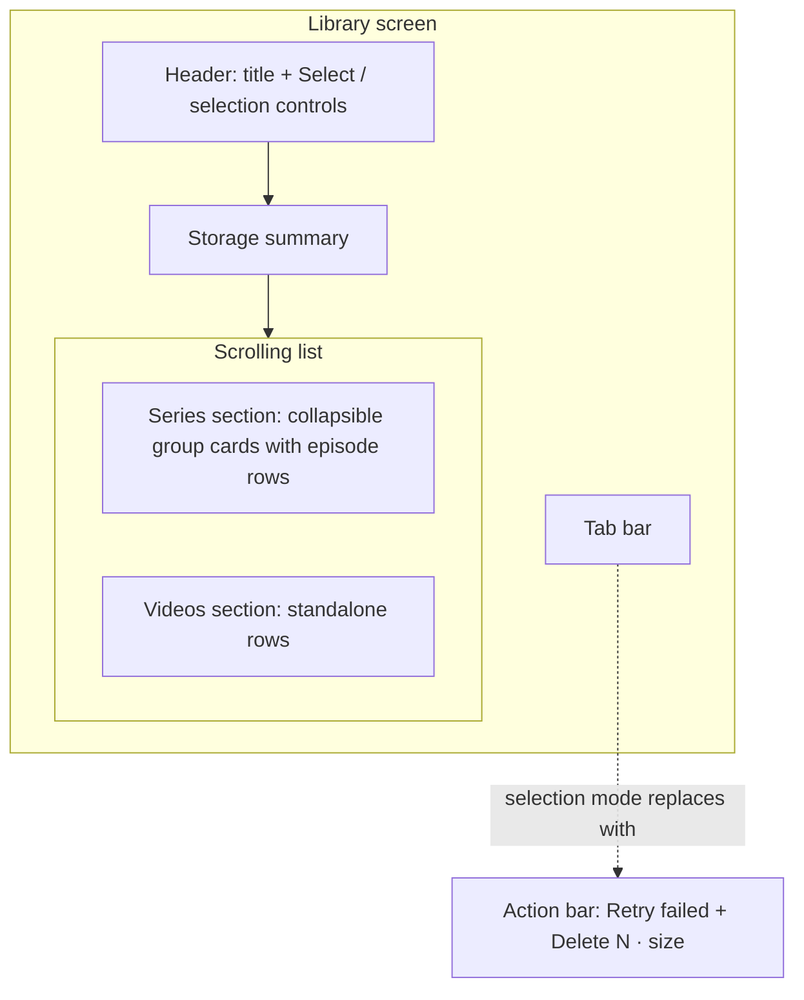
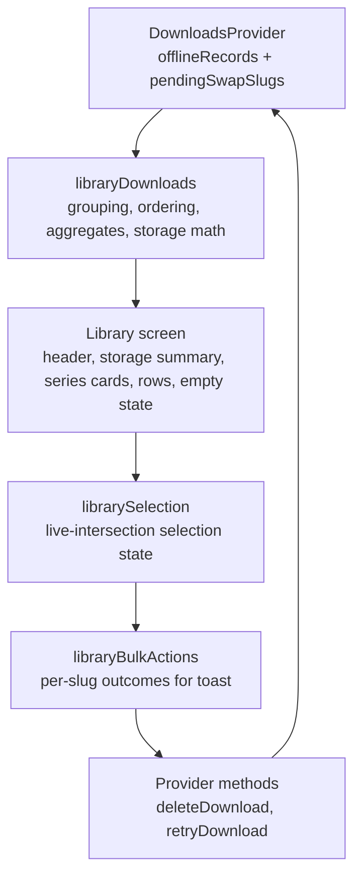
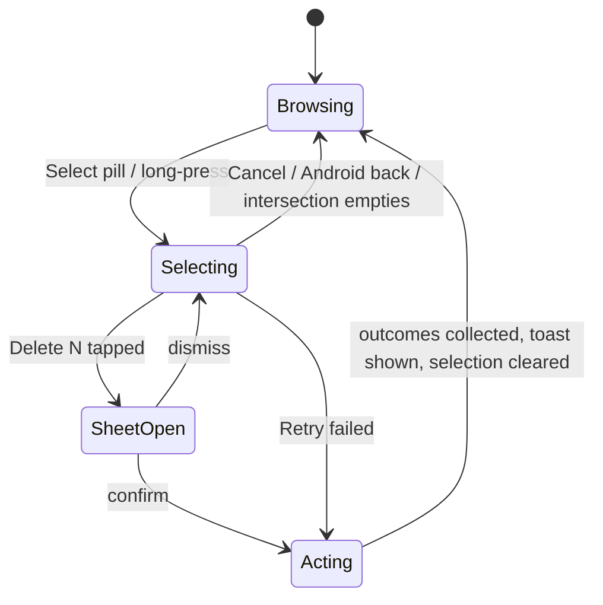

# Mobile Library Downloads Manager - Plan

## Goal Capsule

- **Objective:** Rebuild the mobile app's Library tab as the downloads manager defined by the Claude Design mockup, rendered in the app's existing color tokens, with the additive record metadata that makes series grouping possible offline.
- **Product authority:** The imported mockup (`apps/mobile/design-mockups/library/Forge Mobile Library.html` + `library.jsx`, untracked local copies; canonical source is the claude.ai/design project `d27a9ac5-a583-4d18-88ae-43bfc139f789`, file `Forge Mobile Library.html`) governs structure and behavior. The Key Decisions and Requirements below override it on palette, undo, and the engine states it omits.
- **Execution profile:** Five dependency-ordered units; pure-logic jest coverage plus simulator verification (apps/mobile has no component render harness — that is the repo's established pattern, not a gap to fix here).
- **Stop conditions:** Surface as a blocker any need to bump the offline manifest version (it drops user downloads), any admin GraphQL schema change (none is expected — `durationSeconds` already exists on the schema), or any change to download engine semantics beyond the two additive seams named in the Planning Contract.
- **Tail ownership:** Implementer owns simulator verification on iOS (plus an Android emulator smoke), the design-conformance check against the mockup, and the roadmap ticket update per `AGENTS.md`.

---

## Product Contract

Product Contract preservation: amended R2, R3, R4, R5, R6, R14, R17 with flow-analysis clarifications and added R19–R22 and AE7–AE8; R1, R7–R13, R15, R16, R18, the Key Decisions, flows, and scope boundaries are unchanged in substance.

### Summary

The Library tab becomes a full downloads manager matching the mockup: a storage summary under the title, downloads grouped into collapsible series cards with per-episode status rows, multi-select with bulk delete and retry-failed, and a designed empty state.
The mockup contributes layout, type scale, and behavior; colors map onto the app's existing warm-stone tokens.

### Problem Frame

The current Library tab is a thin utility list: flat download rows with per-row icon buttons, `Alert`-dialog confirmations, no series structure, no bulk management, and no storage visibility.
As series batch downloads (Download All) became a primary flow, a library holding dozens of episodes outgrew this list.
The design mockup defines the intended experience; the tab has never been designed, only assembled.

### Key Decisions

- **App tokens, not the mockup palette.** The mockup's near-black `#0a0a0b`/`#161618`/`#E1241E` scheme is not adopted; the screen renders in the existing tokens (`BG_COLOR`, `SURFACE_COLOR`, `ACCENT`, text tokens) so the Library stays consistent with the other tabs. Chosen from a side-by-side palette probe.
- **Confirmation sheet without Undo.** The mockup's 5-second Undo toast requires deferring real file deletion; v1 ships the sheet as the accident guard and deletes immediately. Re-downloading is the recovery path.
- **Experiences section dropped.** The tab becomes downloads-only; `/experience/[slug]` remains reachable outside this tab.
- **Series metadata is persisted additively at enqueue.** Offline records today carry no series linkage (derived at read time from network data, which an offline-first library cannot do). New fields are optional additions; the manifest schema version is not bumped because a version bump drops every existing record on read.
- **The mockup's state language is extended, not truncated.** The mockup renders only downloaded/downloading/failed; the engine also has queued and paused. Paused rows get an inline resume button styled like the failed row's retry; queued rows get a "Queued" subtitle. Pause/resume capability is preserved.
- **Series groups start collapsed.** The mockup's expanded default demos a single series; a real library with several 10+ episode series scans better collapsed. Cheap to flip later.

### Requirements

**Header and storage**

- R1. The header shows the "Library" title with a Select pill; in selection mode the header row becomes Select All/Deselect All, an "N selected" count, and Cancel.
- R2. A storage summary sits under the title whenever any offline record exists: download count and combined size on the left, combined size against device capacity on the right, and a thin usage bar. Combined size sums downloaded records' total bytes plus in-flight records' written bytes. When device capacity is unreadable, the capacity text and bar are omitted; count and combined size remain.
- R3. A transient hint ("touch and hold a video to select") shows on the populated screen and auto-dismisses after a few seconds. It stops appearing once the user has ever entered selection mode (persisted flag), and never shows during selection or on the empty state.

**Downloads list**

- R4. Downloads carrying series metadata render under a "Series" section as collapsible cards: series art, title, episode count, combined size, a failed-count badge when any episode failed, and a chevron; tapping the header toggles expansion. The section header renders only when at least one group exists.
- R5. Episode rows and standalone rows under a "Videos" section share one row language: poster thumbnail with a duration badge when duration is known, title, status subtitle, and a right-side status affordance. The Videos header renders only when standalone rows exist.
- R6. Status rendering covers every engine state: downloaded shows size · "Downloaded" with a green check; downloading shows a mini progress bar, percent, and a progress ring; queued shows a "Queued" subtitle; paused shows a "Paused" subtitle with an inline resume button; failed shows "Download failed" with an inline retry button. Rows pending a re-download swap render as downloaded — the old copy is the playable truth. The canceled state never surfaces because the screen consumes the provider's filtered record list.
- R7. Downloads without series metadata — including all pre-existing downloads — render as standalone rows under "Videos".
- R8. Tapping a row outside selection mode opens the video's watch page, preserving current behavior.
- R9. Series groups default to collapsed.

**Selection and bulk actions**

- R10. Selection mode enters via the Select pill or a long-press on any row; the long-pressed item (or the whole series, from a group header) becomes selected.
- R11. In selection mode every row shows a circular checkbox; a series header checkbox reflects all/some/none of its episodes (mixed state renders a dash) and toggles the whole series.
- R12. A bottom action bar replaces the tab bar during selection: "Retry failed" appears only when the selection contains failed items, and "Delete N · size" is disabled at zero selection.
- R13. Delete shows a confirmation sheet naming the count and storage to be freed; confirming deletes immediately and shows an "N videos deleted · X freed" toast with no Undo.
- R14. Deleting a selected in-flight download stops the transfer and removes the record and files. A mid-swap re-download is fully removed as well, including its old playable copy — Delete means complete removal.
- R15. Cancel or completing a bulk action exits selection mode and clears the selection.

**Download metadata**

- R16. Enqueue paths persist series membership (series slug and display title), series episode position when known, video duration, and an enqueue timestamp on the offline record as additive optional fields; existing records remain readable with no manifest version bump.
- R19. The persisted metadata survives every record rewrite path — relaunch reattach, batch failed-resurface, retry/restart, and quality/language swaps — so an episode never falls out of its series card after process death.

**Selection integrity and ordering**

- R20. The selection is a live set continuously intersected with the provider's records: rows that vanish or change state drop out and the derived labels recompute, and selection mode auto-exits when the intersection (or the whole list) empties. Dismissing the confirmation sheet returns to selection; Android hardware back exits selection before navigating.
- R21. A retry that cannot start (offline, failed re-resolution) leaves the row in the failed state; a failed row is never silently removed.
- R22. Episodes inside a series card order by series position when known, else by enqueue time; series cards and standalone rows order by most recent enqueue, newest first.

**Empty state**

- R17. With no offline records — and only after the persisted manifest has hydrated — the screen shows the mockup's empty state: download glyph, "No downloads yet" heading, explanatory copy, and a "Browse videos" button routing to the Discover tab.

**Visual language**

- R18. Structure, spacing, type scale, and component shapes follow the mockup; colors map to existing tokens, with `ACCENT_ON_DARK` used wherever accent-colored text must meet WCAG contrast.

The screen's regions and the selection-mode swap:

### Key Flows

- F1. Bulk delete
  - **Trigger:** Long-press a row (or tap Select) → selection mode.
  - **Steps:** Check rows or a series header → tap Delete N · size → confirmation sheet → confirm.
  - **Outcome:** Items and files removed, toast reports count and storage freed, selection mode exits.
  - **Covers:** R10–R15, R20.
- F2. Recover a failed download
  - **Trigger:** A row shows "Download failed".
  - **Steps:** Tap the inline retry button, or select multiple failed rows and tap Retry failed.
  - **Outcome:** Rows return to the downloading state with live progress; a retry that cannot start leaves the row failed.
  - **Covers:** R6, R12, R21.
- F3. Browse into a series
  - **Trigger:** A collapsed series card on the populated screen.
  - **Steps:** Tap the header to expand → tap an episode row.
  - **Outcome:** The episode's watch page opens.
  - **Covers:** R4, R8, R9.

### Acceptance Examples

- AE1. **Covers R10.** Given the populated screen, when the user long-presses an episode row, then selection mode activates with exactly that episode checked.
- AE2. **Covers R11.** Given 3 of a series' 10 episodes selected, then the series checkbox shows the mixed state; tapping it selects all 10; tapping again deselects all 10.
- AE3. **Covers R12.** Given a selection of two failed and one downloaded item, then both action buttons show; Retry failed re-enqueues only the two failed items and exits selection.
- AE4. **Covers R7, R16.** Given a download created before this feature (no series or duration fields), then it renders as a standalone row under "Videos" with no duration badge, and the manifest read does not drop it.
- AE5. **Covers R13, R14.** Given a selection including one actively downloading episode, when the user confirms deletion, then the transfer is stopped, the record and files are removed, and the toast counts it.
- AE6. **Covers R6.** Given a paused row, then the subtitle reads "Paused" with an inline resume button, and tapping resume continues the download without entering selection mode.
- AE7. **Covers R16, R19.** Given a series batch enqueued, when the app is killed and relaunched mid-batch and an episode later fails and is retried, then that episode still renders under its series card.
- AE8. **Covers R21.** Given a failed row and no connectivity, when the user taps retry, then the row remains failed — not removed — and a later retry with connectivity starts downloading.

### Scope Boundaries

- No Undo after delete — follow-up candidate if sheet-only proves insufficient.
- The Experiences section is removed from this tab.
- No palette change outside the Library; other tabs and the app-wide tokens are untouched.
- No backfill of series metadata onto existing download records; they stay standalone until re-downloaded.
- No series-level pause-all/resume-all controls in the Library (they exist on the series detail page).
- No component render harness (`@testing-library/react-native`) is introduced; view logic is tested as pure libs per the repo's established pattern.

  > **Superseded, 2026-08-18 (feat-367).** `apps/mobile` now HAS a component-render harness — jest-expo's transitive `react-test-renderer` via a `react` re-point, still with no `@testing-library/react-native` and no new dependency. See `apps/mobile/CLAUDE.md`, section "Component render tests". The scope decisions above stand as the record of this plan; do not carry the "no harness exists" premise into new work. The same correction applies to the two other statements of it in this file (the Execution profile bullet and U-level test scenarios).

- The mockup's device chrome (status bar, dynamic island, home indicator) is presentation framing, not product surface.

### Dependencies / Assumptions

- `expo-file-system` v19.0.22 exposes `getTotalDiskCapacityAsync` on its legacy API (verified in the installed type declarations); the app's existing `freeDiskBytes()` wrapper already treats 0 as unreadable, and the new capacity wrapper follows the same convention.
- Series context is available at both enqueue surfaces: the series batch route has the series record in scope, and the watch route's query already fetches the video's parents — only the normalizer drops them today.
- Series card art derives from the first episode's stored poster; no separate series image is persisted.

### Sources

- Design source: claude.ai/design project `d27a9ac5-a583-4d18-88ae-43bfc139f789` (`Forge Mobile Library.html`, `mobile/library.jsx`); local untracked copies at `apps/mobile/design-mockups/library/`.
- `apps/mobile/app/(tabs)/library.tsx` — current tab: header, `MyDownloadsSection`, Experiences card.
- `apps/mobile/src/components/watch/MyDownloadsSection.tsx` — current flat rows with per-row controls and `Alert` confirmations; retired by this plan.
- `apps/mobile/src/contexts/DownloadsProvider.tsx` — `useDownloads()` exposes records, per-slug delete/pause/resume/cancel, and the batch queue; retry is the one new provider capability (exposing the engine's existing restart).
- `apps/mobile/src/lib/offlineManifest.ts` — record shape; records from a different manifest version are dropped on read; `parseOfflineRecord` copies fields explicitly, so unlisted fields are dropped at every hydrate.
- `apps/mobile/src/lib/downloadLifecycle.ts` — `StartDownloadRequest`, `buildRequestRecord` (the single record-shape seam), `restart` (the retry mechanism), `deleteDownload` (stops live tasks).
- `apps/mobile/src/lib/seriesDownloadAggregate.ts` — KTD5: series state is derived at read time from caller-supplied episode lists; nothing persisted.
- `apps/mobile/src/lib/color.ts` — token names and the `ACCENT_ON_DARK` contrast rationale behind R18.
- Institutional learnings: `docs/solutions/architecture-patterns/strict-sequential-batch-queue-over-persisted-state-pattern.md` (bulk actions on the queue seam), `docs/solutions/logic-errors/series-download-completion-toast-terminal-state-ambiguity.md` (action-scoped toast results), `docs/solutions/best-practices/bottom-sheet-migration-expo-sdk54-pitfalls-20260527.md` (formSheet era, gorhom retired), `docs/solutions/runtime-errors/series-download-setconfig-cancels-inflight-20260624.md` (idempotent engine config under fan-out), `docs/solutions/best-practices/flashlist-v2-maintainvisiblecontentposition-default-20260605.md`.

---

## Planning Contract

### Key Technical Decisions

- **KTD1 — Metadata rides the existing record seam; the parser is the risk point.** The five optional fields (`seriesSlug`, `seriesTitle`, `seriesEpisodeIndex`, `durationSeconds`, `enqueuedAt`) are added to `StartDownloadRequest` and `buildRequestRecord` (the one function all three record writers share), copied record→request in the relaunch-reattach requeue builder, and added to `parseOfflineRecord` — which builds records field-by-field, so any field it doesn't copy is silently dropped on the next hydrate. No manifest version bump.
- **KTD2 — Retry is the engine's existing `restart`, newly exposed.** The provider gains `retryDownload(slug)` delegating to `lifecycle.restart` (guarded to failed records); `controlsForState` grows a `retry` control for `failed`. Never synthesize a fresh `StartDownloadRequest` for retry — the record has no URL, and the naive re-enqueue path deletes the record when resolution fails, violating R21. `restart` already leaves the record failed on a null re-resolve.
- **KTD3 — Bulk delete calls `deleteDownload` uniformly.** It already stops live transfers, and `cancelDownload` ignores failed records, so a single primitive covers every selected state — including mid-swap rows, where full removal (old copy included) matches the user's Delete verb (R14).
- **KTD4 — Toast counts come from the action's own results.** Bulk operations return per-slug outcomes; the toast reports those counts and freed bytes. Never derive bulk-action success from aggregate download state — the terminal-state-ambiguity learning shows a revert and a genuine completion are indistinguishable there.
- **KTD5 — View logic lives in pure libs with injected deps.** Grouping/ordering/storage math, selection operations, and bulk-action orchestration are `src/lib/` modules with colocated jest suites; the screen components stay thin and are simulator-verified. This mirrors the documented pattern from the series download sheet.
- **KTD6 — Plain ScrollView list.** Download counts are bounded and the current tab already uses ScrollView; FlashList's wholesale-data-swap scroll-jump gotcha never enters the picture.
- **KTD7 — The delete confirmation is an in-screen animated modal styled per the mockup.** Selection state stays local to the screen (a formSheet route would need cross-route selection transfer), and `Alert.alert` — the current confirmation pattern — cannot match the mockup.
- **KTD8 — Tab bar hides via the screen's navigation options during selection**, restored on exit/blur/unmount; the action bar renders absolutely at the bottom. Android hardware back exits selection first via a focused BackHandler.
- **KTD9 — Storage numbers go through `offlineFileSystem` wrappers.** A `totalDiskBytes()` sibling of the existing `freeDiskBytes()` wraps the legacy `getTotalDiskCapacityAsync`, keeping the 0-means-unreadable convention; the summary omits capacity text and bar when either reads 0.
- **KTD10 — Status colors become tokens.** The done/failed hexes (`#34d399`, `#fb7185`) are hardcoded in two files today; they move into `src/lib/color.ts` and both existing call sites plus the new screen consume the tokens.
- **KTD11 — The long-press hint's seen flag persists in WatchPreferences**, following its tolerant parse + per-field setter pattern.

### High-Level Technical Design

Data flow — records to screen to actions:

Selection-mode lifecycle:

Row rendering per record state (the single source for R6):

| Record state              | Subtitle                             | Right-side affordance |
| ------------------------- | ------------------------------------ | --------------------- |
| downloaded                | size · "Downloaded"                  | green check           |
| downloaded + pending swap | size · "Downloaded"                  | green check           |
| downloading               | mini bar + percent · size            | progress ring         |
| queued                    | "Queued"                             | none                  |
| paused                    | "Paused"                             | resume button         |
| failed                    | "Download failed"                    | retry button          |
| canceled                  | never rendered — provider filters it | —                     |

---

## Implementation Units

### U1. Persist series and ordering metadata on offline records

- **Goal:** Offline records carry `seriesSlug`, `seriesTitle`, `seriesEpisodeIndex`, `durationSeconds`, and `enqueuedAt` as optional fields that survive every rewrite path.
- **Requirements:** R16, R19; AE4, AE7.
- **Dependencies:** none.
- **Files:** `apps/mobile/src/lib/offlineManifest.ts`, `apps/mobile/src/lib/downloadLifecycle.ts`, `apps/mobile/src/contexts/DownloadsProvider.tsx`, `apps/mobile/src/lib/seriesDownloadEnqueue.ts`, `apps/mobile/src/lib/seriesDownloadResolver.ts`, `apps/mobile/src/lib/normalizeVideo.ts`, `apps/mobile/src/lib/queries.ts`, `apps/mobile/app/watch/download.tsx`, `apps/mobile/app/series/download.tsx`; tests in `apps/mobile/src/lib/__tests__/offlineManifest.test.ts`, `apps/mobile/src/lib/__tests__/downloadLifecycle.test.ts`, `apps/mobile/src/lib/__tests__/createDownloadLifecycle.test.ts`, `apps/mobile/src/lib/__tests__/seriesDownloadResolver.test.ts`.
- **Approach:** Add the fields to `StartDownloadRequest` and `buildRequestRecord` (KTD1's single seam — batch pre-persist, start, and pump failed-resurface all flow through it), to `parseOfflineRecord` with tolerant `asString` reads plus a new optional-number reader that yields undefined when absent (`asFiniteNumber`'s 0 fallback would conflate unknown with a real 0 for `seriesEpisodeIndex`/`durationSeconds`/`enqueuedAt`), and to the reattach requeue's record→request copy. `swap()` spreads the existing record, so swaps preserve fields — pin with a regression test rather than new code. Series batch: thread series slug/title/episode index through `BuildRequestContext`, and episode duration by adding `durationSeconds` to the series query's children selection (the field already exists on the schema — the watch-home fragment selects it) through the episode normalizer and resolver. Watch route: keep the already-fetched parent slug/title in the normalized video (the query fetches `parents`; the normalizer currently drops them) and pass `video.duration`. Stamp `enqueuedAt` where the request is built. Do not touch any `dubs` selection — jest guards enforce the lean-fragment rule.
- **Test scenarios:**
  - Parse round-trip: a record with all five fields hydrates with them intact; serialization preserves them.
  - Covers AE4: a legacy record without the fields parses successfully with them undefined.
  - `buildRequestRecord` carries the fields in queued, downloading, and failed-resurface writes.
  - The reattach requeue rebuilds a request that carries the record's metadata (kill/relaunch path).
  - Covers AE7: failed-resurface after a relaunch keeps `seriesSlug` (episode stays groupable).
  - Swap and restart rewrites preserve the fields.
  - Series batch enqueue attaches slug/title/index/duration per episode; watch-route request attaches parent slug/title and duration when the video has a parent, and omits them when it does not.
- **Verification:** Suite green; no manifest version change in the diff; a device series download shows the fields in the persisted record (spot-check via existing debug logging or a temporary log).

### U2. Expose retry on the downloads provider

- **Goal:** Failed downloads are retryable from the UI through the engine's existing restart, with failure semantics that never delete the row.
- **Requirements:** R6 (retry affordance), R21; AE8; F2.
- **Dependencies:** none (U1 only for the metadata-preservation scenario).
- **Files:** `apps/mobile/src/contexts/DownloadsProvider.tsx`, `apps/mobile/src/lib/downloadControls.ts`, `apps/mobile/src/lib/downloadLifecycle.ts` (export surface only if needed); tests in `apps/mobile/src/lib/__tests__/downloadControls.test.ts`, `apps/mobile/src/lib/__tests__/createDownloadLifecycle.test.ts`.
- **Approach:** Add `retryDownload(videoSlug)` to `DownloadsContextValue`, delegating to `lifecycle.restart` and guarded to records in `failed` (KTD2). Extend `controlsForState` so `failed` maps to retry + delete, and audit its consumers (the series batch bar and any glyph mapping) for exhaustive handling of the new control. Bulk retry must not touch engine configuration — config is idempotent and mount-scoped; restarting N records is N `restart` calls.
- **Test scenarios:**
  - `controlsForState("failed")` yields retry + delete; all other states unchanged.
  - Retry on a failed record transitions it to downloading with a fresh attempt.
  - Covers AE8: retry whose re-resolution returns null leaves the record failed and files untouched.
  - Retry on a non-failed record is a no-op.
  - Restart preserves U1's metadata fields.
- **Verification:** Suite green; on device, a failed row retries to completion and an airplane-mode retry leaves it failed.

### U3. Library view-model and selection logic as pure libs

- **Goal:** All grouping, ordering, aggregate, storage, and selection math exists as tested pure functions before any UI consumes it.
- **Requirements:** R2, R4, R5, R7, R9, R11, R20, R22; AE2.
- **Dependencies:** U1 (field names).
- **Files (new):** `apps/mobile/src/lib/libraryDownloads.ts`, `apps/mobile/src/lib/librarySelection.ts` with colocated `__tests__/` suites; **modified:** `apps/mobile/src/lib/offlineFileSystem.ts` (`totalDiskBytes()`), `apps/mobile/src/lib/color.ts` (status tokens, KTD10) plus the two existing hex call sites.
- **Approach:** `libraryDownloads` builds sections from `offlineRecords` + `pendingSwapSlugs`: group by `seriesSlug`, aggregate count/bytes/failed-count per group, order per R22, expose the row-state mapping from the HTD table, byte/duration formatters, and the storage summary calculation with the combined-size definition and 0-means-unreadable capacity rule (R2, KTD9). `librarySelection` is a pure state module: enter/toggle/toggle-series/select-all, mixed-state derivation, live intersection against the current records with an auto-exit signal, and derived labels (count, bytes, has-failed) per R20.
- **Test scenarios:**
  - Records with series metadata group; legacy records land in standalone; a group with all episodes removed disappears.
  - Ordering: episode index wins, enqueue time breaks ties and covers index-less records; groups and standalone rows order newest-enqueue first.
  - Covers AE2: mixed-state math for partial series selection; series toggle selects/deselects all episodes.
  - Selection pruning: removing a selected record externally drops it from the set and recomputes labels; emptying the intersection raises auto-exit.
  - Storage: combined size = downloaded total bytes + in-flight written bytes; capacity 0 omits capacity/bar but keeps count and size; summary hidden with zero records.
  - Section emptiness: no groups → no Series header; no standalone → no Videos header.
  - Formatter edges: sub-MB sizes, GB rollover, missing duration.
- **Verification:** Suites green; functions are pure (no React imports).

### U4. Rebuild the Library screen rendering

- **Goal:** The Library tab renders the mockup's structure — storage header, collapsible series cards, per-state rows, empty state — in app tokens, replacing the current list and Experiences card.
- **Requirements:** R1 (title + Select rendering), R3–R9, R17, R18; AE6 surface.
- **Dependencies:** U1, U2 (retry/resume affordances), U3.
- **Files:** `apps/mobile/app/(tabs)/library.tsx` (rebuild); **new:** `apps/mobile/src/components/library/StorageSummary.tsx`, `SeriesGroupCard.tsx`, `DownloadRow.tsx`, `LibraryEmptyState.tsx`; **deleted:** `apps/mobile/src/components/watch/MyDownloadsSection.tsx`; **modified:** `apps/mobile/src/contexts/WatchPreferencesProvider.tsx`, `apps/mobile/src/lib/watchPreferences.ts` (hint seen flag, KTD11) + its existing test suite.
- **Approach:** ScrollView body (KTD6) gated on the provider's `isReady` before rendering either state (R17). Rows render from U3's row-state mapping; retry/resume buttons call U2's `retryDownload` / existing `resumeDownload`; row tap navigates to the watch page; group expansion is local state with `LayoutAnimation`. Posters via expo-image with `recyclingKey`; duration badges from the formatter; hint per R3 via the persisted flag. Empty state routes to the Discover tab. Styling maps the mockup's structure onto `useTypography`, `src/styles/shared.ts`, and color tokens with `ACCENT_ON_DARK` for accent text; `Math.round` scaled font sizes. Accessibility labels follow the patterns the retired section used (state in the label, buttons named with verbs).
- **Test scenarios:** WatchPreferences parse/default/setter coverage for the new flag in the existing suite. Otherwise `Test expectation: none — rendering-only unit`: all branching logic lives in U3's tested libs, and apps/mobile has no component render harness by convention; behavior is verified per the Verification Contract's simulator walkthrough.
- **Verification:** Simulator shows populated and empty states matching the mockup's structure in app tokens; legacy records render standalone (AE4 visual); paused/queued/failed/downloading rows show the R6 affordances; no references to `MyDownloadsSection` remain.

### U5. Selection mode, bulk actions, and feedback

- **Goal:** Multi-select with bulk delete (confirmation + toast) and retry-failed works end to end, with the tab bar swapped for the action bar during selection.
- **Requirements:** R1 (selection header), R10–R15, R20; AE1, AE3, AE5.
- **Dependencies:** U2, U3, U4.
- **Files:** `apps/mobile/app/(tabs)/library.tsx`; **new:** `apps/mobile/src/components/library/SelectionActionBar.tsx`, `DeleteConfirmSheet.tsx`, `apps/mobile/src/lib/libraryBulkActions.ts` + `apps/mobile/src/lib/__tests__/libraryBulkActions.test.ts`.
- **Approach:** Long-press via `Pressable` `onLongPress` (no gesture-handler) and the Select pill enter selection; header transforms per R1; checkboxes and series mixed state from U3. Tab bar hides via the screen's navigation options while selecting, restored on exit/blur/unmount, with a focused Android BackHandler exiting selection first (KTD8). The confirmation sheet is the in-screen modal of KTD7 (scrim + card, honoring reduced motion). `libraryBulkActions` orchestrates with injected deps: re-intersect the selection at confirm time, run `deleteDownload` (KTD3) or `retryDownload` per slug sequentially, collect per-slug outcomes, and return counts + freed bytes for the toast (KTD4) — a per-slug failure is recorded and the loop continues. Toast via the existing `Snackbar`. Log `library.bulk_delete` and `library.retry_failed` with count/bytes context via `datadogLog.info`, matching the `domain.event_name` convention.
- **Test scenarios:**
  - Covers AE5: bulk delete spanning downloaded + downloading + queued rows calls delete for each; outcomes count actual removals; freed bytes summed from results.
  - Deleting a queued batch episode leaves the queue able to pump subsequent episodes (occupancy released — the batch-queue hazard).
  - Confirm after external mutation acts on the live intersection; vanished slugs are skipped and not counted.
  - Covers AE3: retry-failed targets only failed slugs from the selection and exits selection.
  - A per-slug delete rejection doesn't abort the remaining slugs; the toast reflects actual outcomes.
  - Selection clears and mode exits after any completed bulk action.
- **Verification:** Simulator: AE1/AE2/AE3/AE5 walkthrough on the washi-gospel demo series; tab bar hides during selection and returns after; Android back exits selection; toast counts match reality when one item was externally removed mid-selection.

---

## Verification Contract

| Gate                  | Command / method                                                                                                                                                                                                 | Applies to                                       |
| --------------------- | ---------------------------------------------------------------------------------------------------------------------------------------------------------------------------------------------------------------- | ------------------------------------------------ |
| Unit tests            | `pnpm --filter @forge/mobile test`                                                                                                                                                                               | U1, U2, U3, U5 (and the U4 preferences scenario) |
| Types                 | `pnpm --filter @forge/mobile typecheck` (repo turbo task)                                                                                                                                                        | all units                                        |
| Lint/format           | `pnpm --filter @forge/mobile lint`; repo prettier check before push                                                                                                                                              | all units                                        |
| Simulator walkthrough | Seed env (`bash scripts/setup-sim-env.sh mobile`), run the worktree's own Metro, use the dev client (downloads are native — Expo Go cannot exercise them); washi-gospel (5-episode demo series) for batch states | U4, U5, AE1–AE8                                  |
| Android smoke         | Android emulator (4 GB RAM per repo recipe): back-button behavior, VideoView-free screen renders, tab-bar hide/restore                                                                                           | U4, U5                                           |
| Legacy-record check   | A download created on a pre-branch build renders standalone with no duration badge after upgrading the JS bundle                                                                                                 | AE4                                              |
| Design conformance    | Side-by-side against `apps/mobile/design-mockups/library/` rendering (structure/spacing/type, not palette)                                                                                                       | U4, U5                                           |
| Load impact           | Confirm the tab does no new network work on focus and grouping is memoized (offline-local rendering; note in PR per the frontend perf convention)                                                                | U4                                               |

## Definition of Done

- All five units complete with their test scenarios implemented and green; typecheck and lint clean.
- Acceptance examples AE1–AE8 each demonstrably pass — via unit test where the scenario is pure, via the simulator walkthrough where it is UI.
- The manifest version is unchanged and pre-existing downloads survive an upgrade (AE4 verified on device or simulator).
- `MyDownloadsSection` and the Experiences card are gone with no dangling imports; no abandoned-approach code remains in the diff.
- Simulator verification completed on iOS with the Android emulator smoke for platform-specific behaviors.
- Roadmap ticket created/updated per `AGENTS.md` (no `feat-NNN` exists for this work yet; use the lane of prior mobile app tickets).
