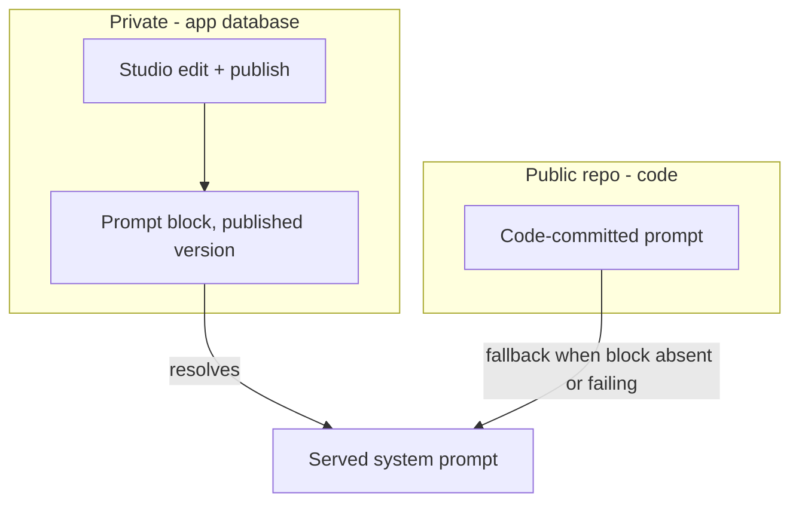
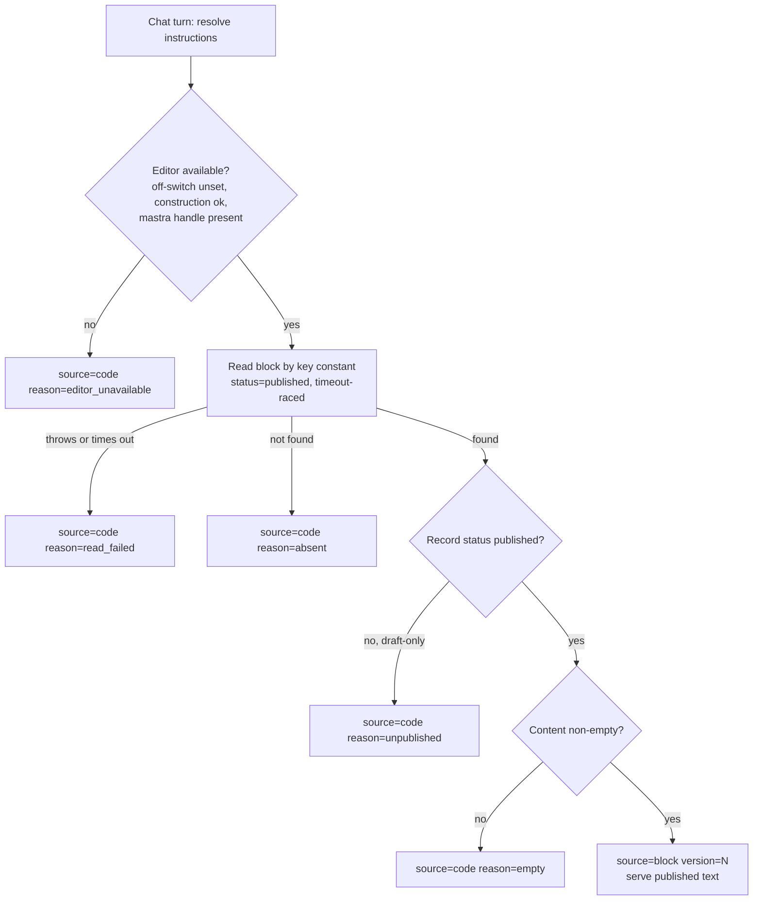
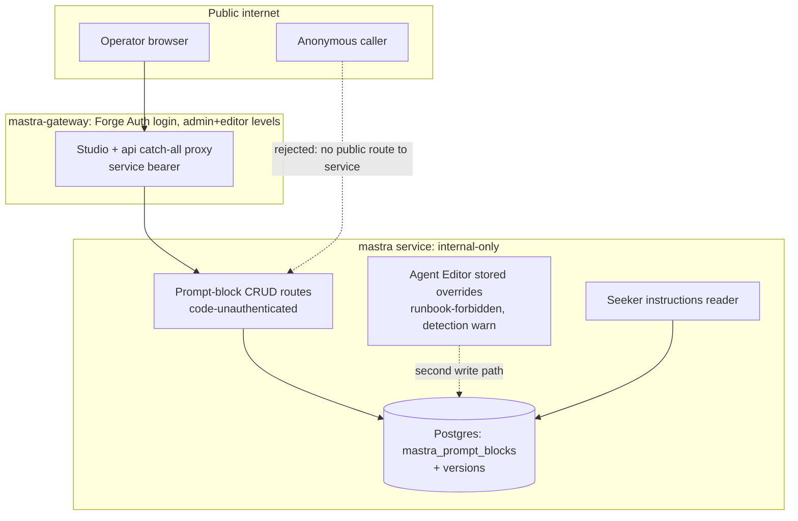

# Seeker Prompt Studio Block - Plan

## Goal Capsule

- **Objective:** Serve the seeker agent's system prompt from a Mastra Editor prompt block stored in the app's own database, editable through the existing authenticated Studio, with the code-committed prompt as automatic fallback.
- **Product authority:** Jaco.
- **Open blockers:** None. Editor-version compatibility is an assumption the work itself validates (see Planning Contract Assumptions).
- **Stop conditions:** Surface (don't guess) if `@mastra/editor` proves hard-incompatible with `@mastra/core` 1.36.0 at build or runtime — per the Product Contract, that outcome converts this effort into comparison findings, not a shipped feature. Surface if any change would touch the Langfuse arc's files (R10).

---

## Product Contract

### Summary

Move the seeker agent's full system prompt out of the public repo into a single Mastra prompt block, stored in the app's Postgres and edited through Studio behind the existing gateway login — enabled locally and on the deployed service. Code keeps today's prompt as a byte-identical fallback, so a missing or failing block can never break the agent. Ships as a feature PR with a new ai-chat roadmap ticket; the Langfuse alternative (PR #1621, feat-272) stays untouched for a side-by-side comparison.

### Problem Frame

The seeker agent's system prompt is an inline string in this public repository — every tuning improvement would be published to the internet on merge. The team wants prompt text private and editable without code deploys, and prefers first-party Mastra mechanisms over adding a vendor. A Langfuse retrieval helper was built (PR #1621) but nothing consumes it, and Mastra's Agent Editor now offers prompt blocks: versioned, database-stored prompt content with draft/publish and native fallback to the code-defined agent. The product is pre-production, so this is the window to trial the first-party mechanism against the vendor path before committing to either.

### Key Decisions

- **Mastra Editor prompt block, evaluated side by side with Langfuse — not a supersession.** PR #1621, feat-272, and the Managed Prompt docs remain untouched; a comparison decision follows once this feature is observable in practice.
- **The whole prompt moves into one block**, including the SAFETY line and the tool-coupled citation wording — over the persona-only split feat-272 planned for Langfuse. Maximum tunability; the coupling risk is accepted below.
- **No drift guard.** A Studio publish can change any line, including machine-coupled ones, with the gateway's access levels as the only control. Accepted for pre-production; the block's Studio description documents the lines editors must preserve (R6).
- **Manual first-time creation in Studio.** No seed script, no boot-time seeding. A runbook covers creating the block per environment; absence is safe because fallback is native.
- **Enabled everywhere (local + deployed).** Mirroring the admin app's local-only editor gate would leave the deployed agent on the public code prompt and never achieve the goal. Includes verifying the editor's endpoints sit behind the existing containment (R8).

### Requirements

**Prompt serving**

- R1. The seeker agent's live system prompt is the published version of a single Studio prompt block holding the entire instructions text.
- R2. The current full prompt remains in code as the fallback; when the block is absent, unpublished, or fails to resolve, the agent serves the code prompt unchanged and the served source is observable in logs.
- R3. Publishing a new block version changes the served prompt on subsequent turns without a code change or deploy.

**Key mapping and existence**

- R4. The block's key is a single compile-time constant in code, with a documented mapping of key to code fallback, so the block's existence and purpose are discoverable from the repo.
- R5. A runbook documents manual block creation: the key, the initial text source (the code prompt), and the publish step — repeatable per environment.
- R6. The block's description in Studio names the machine-coupled lines (the SAFETY line and the retrieveAnswer status wording) that editors must preserve.

**Enablement and access**

- R7. The Mastra Editor is enabled for the mastra service in all environments, so the deployed Studio (behind the gateway) can edit and publish the block.
- R8. The feature PR records verification that editor endpoints are reachable only through the existing containment: the internal-only service boundary and the gateway's authenticated proxy.

**Delivery process**

- R9. The work ships as a feature PR to main with a new ai-chat lane roadmap ticket (next free feat-NNN).
- R10. Nothing from the Langfuse arc is modified, closed, or retired: PR #1621, feat-272, and the Managed Prompt docs stay as-is for the comparison.

### Acceptance Examples

- AE1. **Covers R1, R3.** Given the block exists with published text A, when an operator publishes text B in Studio and a user sends the next message, then the agent's system prompt for that turn is text B, with no deploy in between.
- AE2. **Covers R2.** Given the block does not exist (fresh environment, or deleted), when a user sends a message, then the agent behaves byte-identically to today's code prompt and the log shows the fallback was served.
- AE3. **Covers R8.** Given the deployed service, when an unauthenticated request targets an editor endpoint from outside, then it is rejected — no anonymous read or write path to prompt content.

### Scope Boundaries

- The ten content-authoring prompts stay as code constants; only the seeker prompt moves.
- No automated seeding (script or boot-time) — manual runbook only.
- No drift guard or invariant validation on published text.
- No fine-grained publish-vs-draft roles inside Studio (a Mastra Enterprise feature); the gateway's admin/editor access levels are the control.
- No sustained-fallback alerting or prompt-version span stamping — candidates for a later hardening ticket.
- No Langfuse retirement, closure, or doc rewrites — the comparison decision is separate follow-up work.

### Dependencies / Assumptions

- Assumption: Mastra Editor prompt blocks work under the mastra app's current framework versions, as the editor already does in the admin app. The work validates this; a hard incompatibility turns the effort into findings for the comparison instead of a shipped feature.
- Assumption (unverified): prompt blocks need persistent storage locally; the memory-backend dev shortcut may not hold blocks across restarts. Settle during planning.
- The current prompt wording is permanently public in git history; this feature protects tuning from now on, not the existing text.
- The seeker agent remains a non-production prototype behind existing containment (gateway login, internal-only service); this feature adds no new public surface.

### Outstanding Questions

- **Deferred past this feature:** the comparison criteria and decision point between the Studio-block path and the Langfuse path (editing experience, governance, reliability, operational cost, programmatic read/write accessibility for future eval loops).

### Sources / Research

- `apps/mastra/src/mastra/agents/seeker-agent.ts` — the inline instructions array (~lines 192–212), SAFETY line, retrieveAnswer wording coupling, guardrail attach-point comment (line 175).
- `apps/admin/src/mastra/index.ts` + `apps/admin/package.json` — existing `@mastra/editor` 0.8.1 dependency and its non-production construction precedent.
- `apps/mastra/src/mastra/index.ts` — composite storage (Postgres default, memory backend for local dev).
- `apps/mastra/package.json` + `apps/mastra/railway.toml` — the deployed service builds and serves Studio (`mastra build --studio`).
- `apps/mastra-gateway/CLAUDE.md` — Forge Auth login, admin/editor access levels, service-bearer proxy to the internal mastra service.
- `docs/roadmap/ai-chat/feat-272-seeker-langfuse-managed-prompt-integration.md` and `docs/plans/2026-07-20-001-feat-langfuse-prompt-helper-plan.md` — the Langfuse comparison arm; the composition and fallback contracts that informed decisions here.
- Mastra docs: [Editor prompt blocks](https://mastra.ai/docs/editor/prompts), [Editor overview](https://mastra.ai/docs/editor/overview), [Studio Auth](https://mastra.ai/docs/studio/auth), [Agent Editor announcement](https://mastra.ai/blog/introducing-agent-editor).

---

## Planning Contract

Product Contract preservation: changed only the Outstanding Questions section — the three "deferred to planning" questions are now resolved as KTD1, KTD4, and KTD9 below, and the storage assumption's "settle during planning" is settled by KTD9. No requirement, decision, or scope text changed.

### Key Technical Decisions

- KTD1. **Consume the block via a direct programmatic read inside a dynamic `instructions` function — never the stored-agent-override path.** The code-defined agent's `instructions` becomes an async function receiving `{ mastra }`; a dedicated reader calls the editor's prompt namespace `getById(key, { status: "published" })` and falls back to the code constant. The alternative — Studio's Agent Editor storing an agent override resolved via `getAgentById(id, { status: "published" })` — is rejected: it moves prompt authority into a stored agent snapshot, its block-ref resolution silently serves an empty prompt for draft refs (open upstream issue mastra-ai/mastra#17881), and it would let Studio override tools and model too. Direct block read keeps the code agent authoritative and never composes block refs, sidestepping that bug class entirely.
- KTD2. **Published-status guard after every read.** A `{ status: "published" }` resolution falls back to the latest draft version when the block has never been published (verified in `@mastra/core` 1.36.0's versioned-storage resolution). The reader therefore trusts the result only when the returned record's status is published (equivalently: an active version is set); a draft-only block maps to fallback with `reason=unpublished`. This is what makes R2's "unpublished → fallback" true.
- KTD3. **Fresh per-turn Postgres read, no reader cache.** Status-qualified reads bypass the editor's in-process cache by design, and Mastra's own runtime resolution path reads the DB per request — so a per-turn point-read against the app's own Postgres is the framework-native posture and is what makes AE1 ("next message serves the new text") strictly true. The read is raced against a small timeout (~1.5s, well inside the seeker route's 90s turn budget, per the outbound-timeout law) behind a never-throw boundary; empty/whitespace content and an undefined `mastra`/editor handle are failures that map to fallback. Deliberate divergence from the Langfuse helper's TTL-cache + cooldown design — recorded as a comparison data point, and a reader-side cache is the named fallback position if dogfood latency ever demands it (at the cost of loosening AE1).
- KTD4. **Editor enabled by construction, with one optional off-switch.** Add `@mastra/editor` (current release, at minimum past 0.13.1's prompt-block persistence fix; never 0.10.x, which had a Studio data-loss bug — mastra-ai/mastra#18007) plus its `@mastra/mcp` peer to the mastra app, and construct `editor: new MastraEditor()` on the Mastra instance unless a new optional string-boolean env var (repo convention: `=== "true"`, `.optional()`, no boot requirement) disables it. Skipping construction disables both Studio's editor panels and the managed read in one lever — the reader's fallback doubles as the no-deploy rollback. Note the switch does NOT close the block CRUD HTTP routes: `@mastra/server` mounts stored-resource routes unconditionally and they hit storage directly, so CRUD containment is the network boundary + gateway (R8), not the switch. This deliberately reverses the admin app's dev-only editor gate; the recorded mitigations are versioned block storage, the gateway login, provenance logging, and KTD7's detection guard.
- KTD5. **Block identity: compile-time key constant, creation via explicit-id API call.** The reader looks up by id only (the prompt namespace has no get-by-name). Studio's create dialog derives the id by slugifying the typed name, so the runbook's first-time creation step is a gateway-proxied `POST` to the stored prompt-blocks route with the explicit id equal to the code constant, followed by a mandatory verification `GET` by that id asserting published status. Studio is the edit/publish surface thereafter; later renames never re-key the block.
- KTD6. **Byte-identity anchored on one exported constant.** Today's instructions are an array joined with `"\n"` at agent construction. Extract that joined string into a single exported constant that becomes (a) the agent's fallback instructions, (b) the reader's fallback text, (c) the runbook's copy-paste source (a documented print command), and (d) the reference for the byte-identity test. The existing verbatim SAFETY-line and substring pins in the agent tests continue to pass against the fallback branch.
- KTD7. **Stored-agent-override channel: detect, don't ignore.** With the editor registered, Studio's Agent Editor becomes a second write path: a published stored agent override keyed to the seeker agent would silently replace instructions (and tools) on Mastra's built-in `/api/agents/*` surface — which Studio's own agent chat uses — while the chat route resolves the code agent without overrides, creating split-brain that bypasses R2's fallback contract. Guard: the runbook forbids editing the seeker through the Agent Editor (Prompts panel only), and the code emits a once-per-process warning log when a stored override for the seeker agent exists. Detection over prevention: cheap, and prevention isn't offered upstream (the field-level editor lock shipped in editor 0.11.0 is not honored by Studio's UI — open issue mastra-ai/mastra#18058).
- KTD8. **Rollback recipes replace the nonexistent "unpublish" operation.** The block API offers no unpublish: the PATCH surface accepts neither status nor active-version changes. Operator recipes, in the runbook: bad publish → activate a previous version (first-class, immediate); full return to the code prompt → delete the block (destroys version history — warned) or flip the off-switch env var (Railway restart). R2's "unpublished" trigger means the never-published/draft-only state, which KTD2's guard maps to fallback.
- KTD9. **Local dev is fallback-dominant on the memory backend; durable local editing uses local Postgres.** Prompt blocks are a first-class storage domain (`mastra_prompt_blocks` + versions tables, auto-created by the store — no Prisma migration) riding the composite store's default: deployed Postgres persists them; the documented local memory backend holds them per-process, so every dev-server restart wipes the block and the next turn falls back. The runbook states this as expected behavior and documents the local-Postgres arrangement (storage backend set to postgres + a local database) for anyone who needs durable local block editing. No filesystem-domain work.
- KTD10. **Provenance in the return type, transitions in the log.** The reader returns `{ text, source, reason?, version? }` (mirroring the Langfuse helper's result shape for the eventual comparison). It logs one plain-string line — `[seeker-prompt] event=prompt_source_changed source=<block|code> reason=<enum> version=<n>` — only when the (source, version) pair changes, never per turn, never with prompt bodies (Railway logsV2 silences JSON-stringified payloads; traces already redact prompt text via the existing span processor). The version field is what makes AE1 verifiable from logs alone. The instructions function also runs on Studio's agent list/detail renders (Studio displays the resolved text); transition-bounding must tolerate those extra invocations.
- KTD11. **New roadmap ticket is feat-275.** _[Superseded 2026-07-22: by execution time main's frontier had moved and feat-275 was claimed by the ai-chat docs audit (PR #1638); the ticket shipped as **feat-279** (`docs/roadmap/ai-chat/feat-279-seeker-prompt-studio-block.md`). Read every feat-275 reference in this plan (here, U6, Definition of Done) as feat-279 — on resume, update feat-279 rather than creating any feat-275 file.]_ Main's highest claimed id is feat-274 (claimed three times across lanes) and the unmerged PR #1621 claims ai-chat feat-272 — so the lane convention's global grep must run against `origin/main`, not a stale working tree. The ticket positions this work explicitly as the side-by-side alternative to feat-272 and records programmatic read/write accessibility as a comparison criterion.

### Assumptions

- The mastra Railway service runs a single replica (its `railway.toml` sets no replica count). The hot serving path is cache-free either way; this only bounds Studio-side cache staleness.
- The current `@mastra/editor` release works against `@mastra/core` 1.36.0 (its peer floor is ≥1.34.0). Validated by the build smoke and local Studio exercise in U2; a hard incompatibility triggers the Goal Capsule stop condition.
- PR #1621 and this PR overlap in shared files (`apps/mastra/src/config/env.ts`, `apps/mastra/CLAUDE.md`, `CONCEPTS.md`, `docs/roadmap/ai-chat/README.md`). Whichever merges second rebases; the overlap is textual, not behavioral.

### High-Level Technical Design

Serve-time resolution — the reader's decision ladder (every branch lands on a served prompt; nothing throws into the seeker's SSE stream):

Write surfaces and containment — one sanctioned write path, one detected, none public:

---

## Implementation Units

### U1. Canonical prompt constant

- **Goal:** One exported constant holding the exact string the agent serves today — the byte-identity anchor for fallback, tests, and the runbook's initial paste.
- **Requirements:** R2, R4 (the key-to-fallback mapping's fallback half), AE2.
- **Dependencies:** None.
- **Files:** `apps/mastra/src/mastra/agents/seeker-agent.ts` (extract the joined array into an exported constant; the Agent keeps receiving the identical string), `apps/mastra/src/mastra/agents/seeker-agent.test.ts`.
- **Approach:** Mechanical extraction — the constant is the existing 14-line array joined with `"\n"`, unchanged to the byte. Keep the machine-coupling comments (retrieveAnswer mirror, SAFETY pin) attached to the constant. Do not reword any prompt line in this PR (byte-identity is the contract; the known-stale "exercised only in Mastra Studio" claim in the SAFETY line is deliberately left for a separate prompt-content change).
- **Test scenarios:**
  - Covers AE2 (fallback half). `await seekerAgent.getInstructions()` on the fallback path equals the exported constant exactly (byte equality, not substring).
  - Existing pins unchanged and green: the verbatim SAFETY-sentence pin and the citation-wording substrings.
- **Verification:** `pnpm --filter @forge/mastra test` green with no existing assertion edited.

### U2. Editor dependency, construction, and off-switch

- **Goal:** The mastra service constructs the Mastra Editor in all environments unless the optional off-switch is set, making Studio's Prompts panel functional against the app's storage.
- **Requirements:** R7, and the enablement half of R2's revert story.
- **Dependencies:** None (parallel with U1/U3).
- **Files:** `apps/mastra/package.json` (add `@mastra/editor` at the current release ≥0.13.1 plus `@mastra/mcp` peer), `pnpm-lock.yaml`, `apps/mastra/src/mastra/index.ts` (conditional `editor:` on the Mastra config), `apps/mastra/src/config/env.ts` + `apps/mastra/src/config/env.test.ts` (new optional off-switch var).
- **Approach:** Follow the admin app's zero-config construction (`new MastraEditor()` binds to the instance's storage) but gate on the new env var instead of `NODE_ENV` — default is enabled everywhere. Env var per house convention: `.optional()`, disabled only when exactly `"true"`, never in the production-required list. Storage needs no change: prompt blocks ride the composite store's default (Postgres deployed, in-memory locally).
- **Execution note:** After wiring, run the build (`mastra build --studio` bundles the instance via Rollup) and boot Studio locally once — this is the assumption-validation moment for editor-vs-core compatibility; a hard failure stops the feature per the Goal Capsule.
- **Test scenarios:**
  - Off-switch unset → editor constructed; set to `"true"` → not constructed; any other value → constructed (exact-literal convention).
  - Env schema: new var absent → parse succeeds (no new boot requirement); `assertMastraRuntimeEnv` behavior unchanged.
- **Verification:** `pnpm --filter @forge/mastra build` succeeds; local `mastra dev` shows the Prompts panel creating a block; unit tests green.

### U3. Prompt-block reader

- **Goal:** A never-throw reader that resolves the published block text with provenance, or falls back to the code constant — the single place implementing KTD2/KTD3/KTD10.
- **Requirements:** R1, R2, R3, AE1, AE2.
- **Dependencies:** U1 (fallback constant).
- **Files:** `apps/mastra/src/services/seeker-prompt-block.ts` (new; sibling of `langfuse-prompt-client.ts`, which must not be modified), `apps/mastra/src/services/seeker-prompt-block.test.ts` (new).
- **Approach:** Exported async function taking the editor handle (or the `mastra` instance) plus injectable seams for timeout budget and log sink, mirroring the Langfuse helper's injection style (no fake timers). Read by the compile-time key constant with `{ status: "published" }`, raced against a ~1.5s timeout; guard order per the HTD ladder: editor missing → absent → thrown/timeout → draft-only → empty/whitespace → serve. Return `{ text, source: "block" | "code", reason?, version? }`. Module-level last-(source, version) state drives transition-only logging in the plain-string `event=` format; prompt bodies never appear in logs or errors.
- **Test scenarios:**
  - Happy path: published block → `source=block`, text is the block content, version populated.
  - Covers AE1. Version bump between two calls → second call returns the new text (no cache), and a transition log fires exactly once.
  - Covers AE2. Block absent → `source=code`, text byte-equals the constant, `reason=absent`.
  - Draft-only block (record resolves but status is not published) → fallback with `reason=unpublished` — the only test that can distinguish KTD2's guard from a naive read.
  - Empty and whitespace-only content → fallback with `reason=empty`.
  - Read rejects → fallback `reason=read_failed`; read that never settles → timeout → fallback (small real budget, no fake timers).
  - Editor handle undefined → fallback `reason=editor_unavailable`.
  - Sync-throw inside the read path (getter that throws) → still returns fallback, never throws (the never-throw boundary is structural).
  - Logging discipline: repeated same-source calls emit no further lines; a source flip emits one; log line contains only enum/numeric fields, never block text.
- **Verification:** Unit suite green; a deliberate review pass that deleting any single guard branch fails at least one test.

### U4. Agent wiring and override detection

- **Goal:** The seeker agent's instructions become the reader-backed dynamic function; the stored-agent-override channel gets its detection warning.
- **Requirements:** R1, R2, R3; KTD1, KTD7.
- **Dependencies:** U1, U2, U3.
- **Files:** `apps/mastra/src/mastra/agents/seeker-agent.ts`, `apps/mastra/src/mastra/agents/seeker-agent.test.ts`.
- **Approach:** `instructions: async ({ mastra }) => …` delegating to the U3 reader (`mastra` may be undefined per the type — reader handles it). The detection check piggybacks on the same path: when the editor is available, a once-per-process lookup for a stored agent override keyed to the seeker agent logs `event=stored_agent_override_detected` (warn) if present — it does not alter serving. Existing model-fallback, memory, and step-cap wiring untouched.
- **Test scenarios:**
  - Fallback branch: with no editor, `getInstructions()` byte-equals the constant; SAFETY and citation pins pass unchanged.
  - Managed branch: with an injected/mocked editor returning a published block whose text differs from the constant, `getInstructions()` returns the block text — the assertion only the managed branch can satisfy (mocked-shape-vs-real-contract discipline).
  - Override detection: stored override present → exactly one warn across repeated calls; absent → none.
  - Env-mocking follows the existing partial-mock pattern (`vi.hoisted` + spread of `importOriginal`) — full-module env mocks crash the memory module.
- **Verification:** `pnpm --filter @forge/mastra test` green; local `mastra dev` + Studio agent detail renders the resolved text (Studio invokes the function), and the gated local chat smoke (`/forge-seeker` via the documented local recipe) serves normally with no block present.

### U5. Runbook, docs, and block description

- **Goal:** An operator can create, publish, verify, roll back, and reason about the block in any environment without reading source.
- **Requirements:** R4 (documented key mapping), R5, R6, R8 (posture documentation), AE3's operator half.
- **Dependencies:** U1–U4 (documents their reality).
- **Files:** `apps/mastra/CLAUDE.md` (new runbook section + env var row + containment note), `apps/mastra/AGENTS.md` (pointer if its structure carries one), `CONCEPTS.md` (add the Prompt Block term beside Managed Prompt).
- **Approach:** Numbered per-environment runbook in the app's CLAUDE.md (house pattern for operator steps): (1) create via the gateway-proxied stored prompt-blocks `POST` with the explicit id constant and the printed initial text; (2) paste source — the documented one-liner printing the U1 constant; (3) set the Studio description verbatim (text provided in the runbook: names the SAFETY line and retrieveAnswer wording as must-preserve, warns against `{{ }}` template syntax and against editing the agent's Instructions panel, notes deletion destroys history); (4) publish in Studio; (5) verify — `GET` by id asserting published status, then a chat turn and the `event=prompt_source_changed source=block` log line; (6) rollback recipes per KTD8; (7) local-dev expectations per KTD9 (memory backend = block per-process, fallback-dominant is normal; local-Postgres variant for durable editing). Every verification half is log/CLI-based, not "look at Studio". Containment note records the R8 posture: block CRUD is code-unauthenticated behind the internal boundary; gateway login is the human gate; both access levels can edit and delete.
- **Test scenarios:** Test expectation: none — documentation unit; its claims are exercised by the Verification Contract's deployed checks.
- **Verification:** Runbook steps executed once against a real environment during rollout (deployed or local-Postgres) and corrected where reality disagrees.

### U6. Roadmap ticket and delivery record

- **Goal:** The feature is traceable in the roadmap and the PR records the R8 verification.
- **Requirements:** R9, R8 (record), R10 (verified untouched).
- **Dependencies:** U1–U5.
- **Files:** `docs/roadmap/ai-chat/feat-275-seeker-prompt-studio-block.md` (new), `docs/roadmap/ai-chat/README.md` (index row, counts, date — lane convention).
- **Approach:** Ticket follows the feat-272 exemplar's body shape (Problem / Entry Points / Grep These / What To Build / Constraints / Verification), `owner: "jaco"`, ai-chat lane conventions (docs-only lane, no viewer registration, cross-lane deps recorded on the ai-chat side only). Since ticket and code ship in one PR, it lands `status: "complete"` with a Resolution section. It names feat-272 as the side-by-side alternative (neither blocks the other) and lists the comparison criteria including programmatic accessibility. The PR body records the AE3 verification steps and results, and confirms `git diff` touches no Langfuse-arc file (`apps/mastra/src/services/langfuse-prompt-client*`, `docs/roadmap/ai-chat/feat-272-*`, Langfuse sections of docs).
- **Test scenarios:** Test expectation: none — docs/process unit.
- **Verification:** Roadmap README counts and index consistent; ticket frontmatter valid against the roadmap format.

---

## Verification Contract

| Gate                     | Command / check                                                                                                                                                                                         | Proves                                                                                                    |
| ------------------------ | ------------------------------------------------------------------------------------------------------------------------------------------------------------------------------------------------------- | --------------------------------------------------------------------------------------------------------- |
| Unit + integration tests | `pnpm --filter @forge/mastra test`                                                                                                                                                                      | U1–U4 scenarios incl. byte-identity, every fallback reason branch, transition logging, override detection |
| Build smoke              | `pnpm --filter @forge/mastra build`                                                                                                                                                                     | Editor bundles under `mastra build --studio` (assumption validation, KTD4)                                |
| Local Studio exercise    | `mastra dev` → Prompts panel create/edit; agent detail renders resolved text                                                                                                                            | R7 locally; U2/U4 wiring                                                                                  |
| Pre-commit hooks         | normal commit (never `--no-verify`)                                                                                                                                                                     | Lint/type gates                                                                                           |
| Langfuse-arc untouched   | `git diff --name-only origin/main` contains no `langfuse-prompt-client*`, no `feat-272-*`                                                                                                               | R10                                                                                                       |
| Deployed AE1             | Runbook step: publish new text → next chat turn → log shows `source=block` with bumped `version=`; Studio agent detail shows the new resolved text                                                      | R1, R3, AE1                                                                                               |
| Deployed AE2             | Fresh env (or pre-runbook): chat turn behaves normally, log shows `source=code reason=absent`                                                                                                           | R2, AE2                                                                                                   |
| Deployed AE3             | Unauthenticated external request to the gateway's Studio/API paths → login redirect/reject; direct service hostname not publicly resolvable/reachable; gateway-authenticated `GET` by block id succeeds | R8, AE3                                                                                                   |

The three deployed checks are operator steps executed at rollout and recorded in the PR body (R8) — they cannot run in CI because block creation is manual by design.

---

## Definition of Done

- All six units landed on one feature branch off `origin/main`; conventional-commit history; PR to main.
- `pnpm --filter @forge/mastra test` and `pnpm --filter @forge/mastra build` green locally and in CI.
- Byte-identity holds: the fallback path serves exactly the pre-change prompt string (test-enforced), and no prompt line was reworded.
- The runbook exists and has been executed once for real (deployed env at rollout, or the local-Postgres variant), with corrections folded back in.
- PR body records the AE3 containment verification and the Langfuse-arc-untouched check.
- feat-275 ticket and ai-chat README consistent with lane conventions.
- No dead-end code from abandoned approaches remains in the diff.
- Follow-up candidates (not this PR): sustained-fallback alerting, prompt-version span stamping, the Langfuse-vs-Studio comparison decision.
