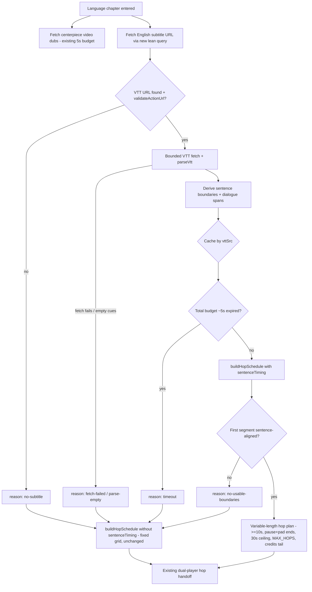

# TV Showcase Sentence-Aware Language Hops - Plan

## Goal Capsule

- **Objective:** Language hops in the TV showcase reel cut at completed-sentence pauses instead of the fixed 10-second grid, so every language is actually heard speaking and no switch lands mid-sentence.
- **Product authority:** The Product Contract below, confirmed in dialogue with Urim on 2026-07-21; plan-time scoping decisions confirmed the same day.
- **Stop conditions:** Surface (don't guess) if simulator smoke shows the dual-player handoff misbehaving on variable-length segments.
- **Sequencing:** Both upstream PRs — #1632 (hop handoff) and #1636 (multi-marker parser) — merged to main on 2026-07-21, and branch `feat/tv-showcase-sentence-aware-hops` is rebased onto them; implementation starts from the final hop-seam shape.
- **Product Contract preservation:** unchanged except — added AE5–AE7 (plan-time hardening confirmed by Urim), and removed the Outstanding Questions section because every deferred item is now resolved in the Planning Contract.

---

## Product Contract

### Summary

The language chapter's hop planner becomes sentence-aware: it reads the centerpiece's English subtitle track (VTT), places the chapter's window over the densest dialogue stretch, and ends each language segment at the pause following a completed sentence. Videos with no usable subtitle data keep today's fixed 10-second grid unchanged.

### Problem Frame

The hop plan cuts between dubs on a fixed 10-second grid with no awareness of dialogue. Two failures show up on the production reel: segments in which not a single word is spoken, so the viewer never hears the language — the entire point of the chapter — and switches that land mid-sentence, which feels jarring. The data confirms both are structural, not bad luck: the Birth of Jesus English track has a 12.7-second silence at 00:32–00:45, and today's plan starts that video's hops at ~33s, so the first language segment can play entirely inside silence.

### Key Decisions

- **Sentence completeness beats rhythm.** Segments stretch freely past 10s to finish their sentence — 15–20s is acceptable. There is no rhythm cap; a ~30s ceiling exists only as a pathology guard.
- **One reference track approximates all dubs.** Boundaries are computed once from the English track and applied to every dub with a ~1s pad, because dubs are performed to the same picture and drift only ~1–2s. Per-dub exactness is a later refinement, not this work.
- **Footage stays strictly continuous.** No jump cuts past silence; instead the whole hop window is seeded over the densest dialogue stretch to minimize silent openings.
- **Fallback is today's behavior.** Missing VTT, failed fetch, or data failing sanity checks degrades that video's chapter to the current fixed grid — per video, never per segment, never an error.
- **Reuse the existing VTT parser.** `apps/tv/src/lib/parseVtt.ts` (ported from mobile for watch subtitles) already parses cues; no new parsing dependency.

### Requirements

**Segment timing**

- R1. Every language segment plays at least 10 seconds.
- R2. Every language segment ends at a pause following a completed sentence in the reference track, with the boundary padded (~1s) so drifted dubs finish speaking.
- R3. A segment runs as long as its sentence needs; a ~30s ceiling cuts at the nearest cue boundary only when timing data is pathological.
- R4. Segments stay contiguous — each begins where the previous ended; footage never skips.

**Window placement**

- R5. The chapter's hop window sits over the densest dialogue stretch of the video, within the existing credits-tail exclusion.

**Data and fallback**

- R6. Sentence boundaries derive from the video's English subtitle track, fetched at plan-build time via the public `videoBySlug → dubs → videoEdition → subtitles` path.
- R7. When no usable English track exists (absent, fetch failed, or sanity checks failed), the chapter plays today's fixed 10s plan unchanged — never an error or a stall.
- R8. The 9-language ceiling per chapter stands; fewer languages may fit when segments run long or the video is short.

**Observability**

- R9. Fixed-grid fallback and its reason class are observable in telemetry, following the existing showcase degrade-logging conventions.

### Key Flows

- F1. Sentence-aware plan
  - **Trigger:** The reel enters a language chapter whose centerpiece has an English VTT.
  - **Steps:** Fetch the VTT (bounded); derive sentence-end pauses; seed the window over the densest dialogue; build variable-length hops; play through the existing dual-player handoff.
  - **Covers:** R1–R6, R8.
- F2. Fallback
  - **Trigger:** VTT absent, fetch fails, or data fails sanity checks.
  - **Steps:** Build today's fixed-grid plan for that video; log the reason class.
  - **Covers:** R7, R9.

### Acceptance Examples

- AE1. **Covers R2, R5.** Given Birth of Jesus with its 00:32–00:45 silence, no language segment plays entirely inside silence, and every segment contains at least one completed sentence.
- AE2. **Covers R1–R2.** Given a sentence that completes 13.4s into a segment, the switch fires at ~14.4s (pause + pad), not at 10s.
- AE3. **Covers R7.** Given Magdalena (no subtitles on its English dub's edition), the chapter behaves exactly as today's fixed grid.
- AE4. **Covers R3.** Given a track with no qualifying pause within ~30s of a segment start, the segment cuts at the nearest cue boundary at or under the ceiling and the plan continues.
- AE5. **Covers R7.** Given a VTT fetch still unresolved when the total plan-build budget (~5s) expires, the chapter plays the fixed grid — the reel never waits longer or stalls on the chapter card.
- AE6. **Covers R3, R7.** Given a track whose very first segment would already ceiling-cut (no detectable sentence structure anywhere in the seeded window), the whole chapter falls back to the fixed grid rather than playing ceiling-cut segments.
- AE7. **Covers R6.** Given the reel loops back to a language chapter it already played, the same boundaries replay — derived timings are cached for the app's lifetime, so a later fetch blip cannot flip a chapter back to the fixed grid mid-session.

### Success Criteria

- On the language-only manual test reel (tvOS simulator), every VTT-covered segment audibly contains a complete sentence, no switch lands mid-sentence, and no segment opens into extended dead air.

### Scope Boundaries

- Per-dub exact alignment using each language's own subtitle track (~50 languages have them on JESUS-film segments) — later refinement.
- Admin-side precomputed boundary field — deferred; belongs to the admin owner as a roadmap ticket. It is the long-term home and could cover subtitle-less films via admin's internal Whisper transcripts.
- Swapping the three uncovered centerpieces (My Last Day, Magdalena, How to Know Jesus Personally) — they stay on the fixed grid; "has an English VTT" becomes a curation criterion for future centerpiece picks.
- Mobile/web showcase parity, and ordinary (non-language) excerpt windows — unchanged.
- Interstitial cadence stays chapter-counted: longer language chapters stretch the wall-clock gap between stat interstitials. Accepted consequence of variable segment lengths; revisit only if soak tests show it dragging.
- A curator placing the centerpiece video in another chapter as an ordinary excerpt is not deduplicated — curation concern, not code.

### Dependencies / Assumptions

- **Dependency (resolved 2026-07-21):** PR #1632 (hop handoff seams) and PR #1636 (every marked section hops) are both merged to main and included in this branch's base, so repeated-language-chapter verification and the flip seam are at their final shape.
- **Assumption (accepted risk):** dub audio drifts no more than ~1–2s from the English reference; the ~1s pad absorbs typical drift, and occasional near-miss cuts on heavily drifted dubs are acceptable.
- **Verified 2026-07-21 against production:** JESUS-film segment centerpieces carry segment-relative English VTTs with clean sentence cues (50 subtitle languages each); My Last Day, Magdalena, and How to Know Jesus Personally have no subtitles on their English dub's edition.
- **Unverified:** whether admin's internal Whisper transcripts cover the three subtitle-less centerpieces — relevant only to the deferred admin approach.

### Sources / Research

- `apps/tv/src/lib/showcaseMode/hopSchedule.ts` — the fixed-grid planner this extends (`HOP_SEGMENT_SECONDS = 10`, `MAX_HOPS = 9`, min-known-dub-duration planning, 5s credits tail).
- `apps/tv/src/lib/parseVtt.ts` — existing VTT cue parser to reuse (strips tags, drops malformed cues, SMPTE-offset normalization, `VttCue { start, end, text }`).
- `apps/tv/src/lib/videoQueries.ts:253-287` — `watchDubMediaFragment` / `GET_VIDEO_DUB`: the existing edition-subtitles selection shape to mirror.
- `apps/tv/src/components/watch/SubtitleOverlay.tsx:112-150` — the house VTT fetch pattern: `validateActionUrl` guard, `AbortController` timeout, `r.ok` check.
- `apps/admin/schema.graphql` — public chain `Video.preferredPlayableDub(languageSlug)` / `VideoDub.videoEdition` / `VideoEdition.subtitles` / `VideoSubtitle.vttSrc` (claim-verified with line evidence; `preferredPlayableDub` has no TV/mobile call site yet but was probe-verified against production 2026-07-21).
- Production probe (2026-07-21): `birth-of-jesus` English VTT is segment-relative with terminal-punctuated cues and real silences (e.g. 00:32.280 → 00:44.980); `the-last-supper` and `jesus-feeds-5000` equivalent.
- `docs/solutions/ui-bugs/tv-showcase-dual-player-crossfade-dub-hop-blanking.md` — **read in full before touching hop machinery**: the confirm-gated crossfade contract variable windows must not violate.
- `docs/solutions/integration-issues/expo-video-timeupdate-clock-drift-audio-fade-hardcut.md` — the drift-margin law: never size a timing window to one `timeUpdate` interval; test with phase-swept fractional clocks.
- `docs/solutions/integration-issues/expo-video-replaceasync-seek-silently-dropped-tvos.md` — dropped-seek trap: non-grid `startSeconds` values need simulator exercise; unit tests cannot prove tvOS honors them.
- `docs/solutions/best-practices/mocked-shape-vs-real-contract-discipline-20260506.md` — real-fixture discipline for the parser/boundary tests.

---

## Planning Contract

### Key Technical Decisions

- **KTD-1: Sentence timing is an optional input to `buildHopSchedule`; absent means byte-identical fixed grid.** The existing plan path is regression-locked: no `sentenceTiming` argument → today's `planTiming` output, unchanged. This makes the fallback (R7) structural rather than branched-in, and keeps every existing hopSchedule test green untouched.
- **KTD-2: Reference-track acquisition is a new lean, self-contained query in `showcaseVideoQuery.ts`** — `videoBySlug(slug) { preferredPlayableDub(languageSlug: "english") { videoEdition { subtitles { vttSrc, primary, aiGenerated, language { slug } } } } }`, mirroring `watchDubMediaFragment`'s selection. Rejected alternatives: widening the bulk `dubs` selection with ids (adds ~2,250 fields per showcase video fetch — the dub-payload lesson) and reusing `GET_VIDEO_DUB(id)` (needs a dub id the lean showcase fragment deliberately omits). No schema change, so no codegen step. Client-side subtitle pick: `language.slug === "english"`, prefer `primary`, then human over `aiGenerated`, then first.
- **KTD-3: Sentence boundary = a cue whose text ends with Latin terminal punctuation (`.` `!` `?` `…`, allowing trailing quotes/brackets) followed by an inter-cue gap at or above a minimum pause threshold, or track end.** Boundary time biases late: cue end + ~1s pad, capped at the next cue's start when the gap is smaller than the pad. Overlapping or touching cues (gap ≤ 0) are never pauses. Latin-only is deliberate v1 scope — the reference track is English; re-examine only when the curation criterion generalizes.
- **KTD-4: Dialogue-density window seeding.** Candidate window starts are sentence-start cues; score each candidate by spoken seconds within a nominal span (planned hop count × nominal segment length); highest coverage wins, ties to earliest; clamp so the plan fits the credits-free span of the minimum known dub duration (existing law preserved). Segments then walk contiguously from the seeded start (R4).
- **KTD-5: A hard total plan-build budget (~5s) enforces R7's "never a stall".** The reel's stall watchdog arms only once a stream exists, so the fetch-and-derive phase is invisible to it. The sentence-timing acquisition (query + VTT fetch + derive) races a ceiling budget; unresolved at expiry → fixed grid with reason `timeout`. Budget constants follow the `SCREAMING_SNAKE_CASE_MS`-with-justification convention, each under the caller's own deadline per the outbound-timeout law.
- **KTD-6: Track-level sanity gate.** If the first segment from the seeded window has no qualifying boundary before the ceiling, the whole chapter falls back (reason `no-usable-boundaries`) — pathology is a property of the track, and nine ceiling-cut segments would be worse than the fixed grid. This also covers single-cue and punctuation-less tracks.
- **KTD-7: Process-lifetime derived-timing cache keyed by `vttSrc`** (small bounded Map, ~8 entries). Loop-arounds replay identical boundaries and never refetch; a transient CDN blip on a later loop cannot flip a chapter's behavior mid-session (AE7). The cache holds derived timing objects, never raw VTT text or player resources (KTD-2 leak law untouched).
- **KTD-8: The promoted player's buffer cap resets at hop flips.** The standby preloads under a ~15s forward-buffer cap sized for 10s segments (set in `useHopHandoff.ts`); a flip promotes it to live where segments may now run to ~30s. On every flip the promoted player restores default buffer options, mirroring the `defaultBufferOptionsRef` restore the poster-masked swap path in `ReelPlayer.tsx` already performs — the flip branch is the path missing it.
- **KTD-9: Telemetry mirrors the house shape.** One new warn event `showcase_sentence_plan_fallback` with a closed reason union (`no-subtitle | fetch-failed | parse-empty | no-usable-boundaries | timeout`) as a first-class facetable field — counts and enums, never subtitle text (action-name privacy rule). The sentence-aware happy path stays silent.
- **KTD-10: Boundaries obey the drift-margin law.** Segment ends feed the existing window-end swap gate unchanged; no new arm window may be sized to a single `timeUpdate` interval, and timing tests sweep fractional/phase-shifted clocks rather than stepping `t += 1`.

### High-Level Technical Design

Plan-build decision ladder and data flow (prose is authoritative; the sketch orients):

The boundary module and the plan builder stay pure (inputs in, plan out; rng injected at the screen, per the existing composition-root rule). All I/O — the lean query, the VTT fetch, the cache — lives in one acquisition seam mirroring `createShowcaseVideoFetcher`.

---

## Implementation Units

### U1. Sentence-timing derivation module

- **Goal:** A pure module that turns parsed VTT cues into sentence-end boundary candidates and dialogue spans.
- **Requirements:** R2, R3 (boundary shape), R5 (dialogue spans); KTD-3.
- **Dependencies:** none.
- **Files:** `apps/tv/src/lib/showcaseMode/sentenceTiming.ts` (new), `apps/tv/src/lib/showcaseMode/sentenceTiming.test.ts` (new).
- **Approach:** Input `VttCue[]` (already tag-stripped and SMPTE-normalized by `parseVtt`); sort by start; emit `{ boundaries: SentenceBoundary[], dialogueSpans: Span[] }` where a boundary carries the cue-end time, the padded switch time, and the gap length. Terminal-punctuation and minimum-gap rules per KTD-3. Export the thresholds as named constants.
- **Patterns to follow:** `hopSchedule.ts`'s pure-module + exported-constants style; `parseVtt.test.ts`'s inline string-array fixture idiom.
- **Test scenarios:**
  - Covers AE1 (data half). Real Birth of Jesus cue fixture (first ~15 cues, inline): boundaries land after "…about everything." (11.63s gap) and "…the virgin's name was Mary." (12.7s gap); no boundary inside the 00:56–01:01 rapid exchange where gaps are under the threshold.
  - Sentence cue followed by a gap exactly at the threshold → boundary; one hair under → no boundary.
  - Pad capping: gap of 0.7s with 1s pad → switch time capped at next cue start.
  - Overlapping cues (negative gap) and touching cues (zero gap) → never boundaries.
  - Cue ending mid-sentence (no terminal punctuation) before a long gap → not a boundary; cue ending with `."` or `?"` → boundary (trailing-quote tolerance).
  - Empty cue list, single-cue list → empty/end-only boundaries, no throw.
  - Unpunctuated track (all-caps captions, no terminals) → zero sentence boundaries.
- **Verification:** New suite green; module has no imports beyond types (purity check by inspection).

### U2. Sentence-aware plan path in the hop scheduler

- **Goal:** `buildHopSchedule` accepts optional sentence timing and produces variable-length, sentence-aligned, contiguous hop windows; absent timing keeps today's output byte-identical.
- **Requirements:** R1–R5, R8; AE2, AE4, AE6; KTD-1, KTD-4, KTD-6, KTD-10.
- **Dependencies:** U1.
- **Files:** `apps/tv/src/lib/showcaseMode/hopSchedule.ts`, `apps/tv/src/lib/showcaseMode/hopSchedule.test.ts`.
- **Approach:** New optional `sentenceTiming` argument. When present: seed window start per KTD-4; build segments walking boundaries — each end is the first padded boundary ≥ start + 10s, ceiling-cut at ~30s at the nearest cue boundary; stop at credits-free end or `MAX_HOPS`; sanity gate per KTD-6 returns a discriminated "unusable" result so the caller logs the reason and reuses the plain path. When absent: existing `planTiming` path untouched.
- **Execution note:** Start by pinning the regression — a describe block asserting the no-timing path is unchanged across the existing suite's fixtures — before adding the sentence path.
- **Patterns to follow:** existing factory-function fixtures + `mulberry32` seeded rng + requirement-tagged describes in `hopSchedule.test.ts`.
- **Test scenarios:**
  - Regression: with `sentenceTiming` undefined, output deep-equals the pre-change plan for the existing fixture sweep.
  - Covers AE2. Boundary at 13.4s after segment start → segment ends ~14.4s, not 10s.
  - Covers AE4. No qualifying boundary within the ceiling after segment 2 starts → that segment ceiling-cuts at the nearest cue boundary; later segments continue.
  - Covers AE6. First segment has no qualifying boundary → unusable result (whole-chapter fallback), not a ceiling-cut plan.
  - Contiguity invariant sweep (seeded rng, many runs): every segment start equals the previous end; all segments ≥ 10s except a ceiling cut; all ends clear the credits tail of the minimum dub duration.
  - Window seeding: fixture with a dense cluster late in the video → window starts at the cluster, clamped so the plan still fits before the credits tail.
  - Short video where fewer than 9 languages fit → hop count shrinks (R8); fewer than 2 sentence-aligned segments possible → unusable result.
  - Phase-swept clock check per KTD-10: boundary times at fractional offsets (x.3, x.7) survive the plan's rounding without collapsing a segment under 10s.
- **Verification:** Full `hopSchedule.test.ts` green including untouched pre-existing describes.

### U3. Reference-track acquisition seam

- **Goal:** One injectable seam that resolves a centerpiece slug to derived sentence timing — lean query, guarded bounded VTT fetch, parse, derive, cache — with a closed failure-reason union.
- **Requirements:** R6, R7; AE5 (budget half), AE7; KTD-2, KTD-5, KTD-7, KTD-9 (reason shapes).
- **Dependencies:** U1.
- **Files:** `apps/tv/src/lib/showcaseMode/sentenceTimingSource.ts` (new), `apps/tv/src/lib/showcaseMode/sentenceTimingSource.test.ts` (new), `apps/tv/src/lib/showcaseMode/showcaseVideoQuery.ts` (add the lean subtitle query).
- **Approach:** Query per KTD-2 with `withTimeout` under its own `SHOWCASE_VTT_*_MS` budgets; `validateActionUrl` before fetch; `AbortController` + response-size guard (reject bodies over ~1.5MB after `text()` — device-side pragmatic cap, noted as a deviation from the server streaming byte-cap law); `parseVtt` + U1 derivation; module-level bounded Map cache keyed by `vttSrc` (KTD-7). Result: `{ ok: true, timing } | { ok: false, reason }` with the KTD-9 union. No new refs or latches — the seam is stateless per call apart from the cache (the watchdog ref-lifetime trap from the liveness-watchdog learning).
- **Patterns to follow:** `createShowcaseVideoFetcher` (injectable seam bound to the Apollo client, cache-first); `SubtitleOverlay.tsx` fetch guard sequence.
- **Test scenarios:**
  - Happy path with mocked fetch returning the real fixture text → derived timing matches U1's output; second call for the same `vttSrc` hits the cache (fetch called once).
  - No English subtitle row / no `preferredPlayableDub` → `no-subtitle`.
  - Fetch rejects, non-OK status, or aborts → `fetch-failed`; abort mechanism test: the injected fetch captures the signal and the test asserts abort fires at the budget (tiny real timers, not fake — fake timers can't intercept the abort path).
  - VTT that parses to zero cues → `parse-empty`.
  - Oversize body → `fetch-failed` (or a dedicated reason if cheap), never a throw.
  - `validateActionUrl` rejection (http URL in prod mode, javascript:) → `no-subtitle` path, fetch never called.
  - Cache bound: inserting more than the cap evicts oldest without unbounded growth.
- **Verification:** Suite green; no live network in tests (all fetch injected).

### U4. Screen wiring, telemetry, and flip buffer reset

- **Goal:** The centerpiece plan-build effect acquires sentence timing under the total budget and passes it to the planner; fallbacks log the new event; hop flips reset the promoted player's buffer cap.
- **Requirements:** R7, R9; AE3, AE5; KTD-5, KTD-8, KTD-9.
- **Dependencies:** U2, U3.
- **Files:** `apps/tv/src/components/showcaseMode/ShowcaseScreen.tsx`, `apps/tv/src/lib/showcaseMode/logShowcaseFallback.ts` (existing — add a `logSentencePlanFallback` export alongside the current `logShowcaseFallback`/`logShowcaseParseDrops` exports; do not create a new file), `apps/tv/src/lib/showcaseMode/logShowcaseFallback.test.ts`, `apps/tv/src/components/showcaseMode/ReelPlayer.tsx` (flip-branch buffer reset per KTD-8), `CONCEPTS.md` (Language Centerpiece entry: replace "roughly every ten seconds" with the sentence-aware behavior).
- **Approach:** In the existing centerpiece effect: launch the U3 acquisition in parallel with the video fetch, race both against the total budget (KTD-5); every await follows the effect's `cancelled || !mountedRef.current` guard; failure or timeout → `buildHopSchedule` without timing + `logSentencePlanFallback(reason)`; the `hopPlanResolved` token contract is untouched. Flip path: restore default buffer options on the promoted player (KTD-8). No new refs/latches in the effect.
- **Execution note:** Read `docs/solutions/ui-bugs/tv-showcase-dual-player-crossfade-dub-hop-blanking.md` in full before touching the flip path.
- **Patterns to follow:** the effect's existing try/catch-degrade-to-null shape around the centerpiece probe; `logShowcaseFallback`'s reason-as-first-class-field logger shape.
- **Test scenarios:**
  - New logger unit tests mirror `logShowcaseFallback.test.ts`: one warn per reason value; payload is exactly `{ reason }`.
  - Covers AE5 (wiring half): with the acquisition seam stubbed to never resolve, the plan builds fixed-grid within the budget (extract the race into a small pure/testable helper if the effect shape resists direct testing).
  - Buffer reset: where the post-#1632 seam allows, a pure predicate/action test that a flip emits the reset; otherwise verified in U5's simulator smoke with explicit log markers.
  - `Test expectation: none — CONCEPTS.md wording change` for the docs edit.
- **Verification:** Full `apps/tv` jest suite, `tsc --noEmit`, eslint all green; no regression in `reelState.test.ts` / `reelPlayerGate.test.ts`.

### U5. Simulator verification pass

- **Goal:** Prove on the tvOS simulator what unit tests cannot: tvOS honors non-grid seek targets, sentence-aligned hops feel right, and fallbacks degrade cleanly.
- **Requirements:** Success Criteria; AE1–AE7; the dropped-seek and drift-margin learnings.
- **Dependencies:** U1–U4.
- **Files:** none committed (temporary language-only reel filter in `ShowcaseScreen.tsx` as an uncommitted scaffold, per the existing manual-test recipe).
- **Approach:** Worktree Metro + dev client + `/showcase` deep link; cold relaunch before judging playback. Watch Metro logs for plan-build markers and the fallback event; screenshot/listen through at least two full language chapters.
- **Test scenarios:**
  - Covers AE1: Birth of Jesus chapter — every segment contains audible speech; no segment sits in the 00:32–00:45 silence.
  - Covers AE2: at least one observed segment runs visibly past 10s to a sentence end.
  - Covers AE3: Magdalena chapter plays the fixed 10s grid with a single `no-subtitle` fallback log.
  - Non-grid seeks: observed segment starts match planned boundaries (no 0:00 starts — the dropped-seek self-heal converges).
  - Buffer behavior: a stretched (15s+) segment plays through without rebuffering after its flip.
  - Loop-around: second pass of the same chapter replays identical boundaries (cache hit, no refetch log).
- **Verification:** All observations logged against the AE list; any deviation becomes a finding before the PR opens.

---

## Verification Contract

| Gate            | Command / procedure                                                 | Proves                                                                         |
| --------------- | ------------------------------------------------------------------- | ------------------------------------------------------------------------------ |
| Unit suites     | `cd apps/tv && npx jest src/lib/showcaseMode`                       | U1–U3 logic, fixed-grid regression lock, phase-swept timing                    |
| Full TV suite   | `cd apps/tv && npx jest`                                            | No collateral regression (reel state, player gate, handoff)                    |
| Types           | `cd apps/tv && npx tsc --noEmit`                                    | Strict-mode clean, no `any`                                                    |
| Lint            | `cd apps/tv && npx eslint src --max-warnings=0`                     | House style                                                                    |
| Simulator smoke | U5 procedure (worktree Metro, `/showcase` deep link, cold relaunch) | tvOS seek honoring, handoff on variable segments, fallback behavior, telemetry |

The fixed-grid regression describe in `hopSchedule.test.ts` is the load-bearing gate: it must pass unmodified from before the change.

## Definition of Done

- All five units complete in dependency order; every gate in the Verification Contract green.
- Simulator smoke observed and recorded against AE1–AE7 (sentence-aligned hops on Birth of Jesus; fixed-grid fallback with logged reason on Magdalena; loop-around boundary stability).
- `CONCEPTS.md`'s Language Centerpiece entry no longer describes the fixed 10-second grid.
- No temporary test scaffolds (language-only reel filter) in the committed diff; no dead experimental code from abandoned approaches.
- Flip buffer reset verified on the merged hop-handoff shape; PR opened against `main` referencing this plan.
