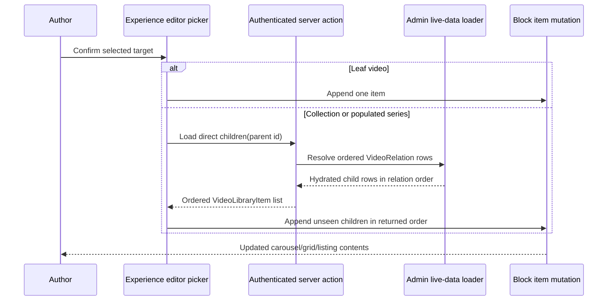

# feat: Expand collection selections into block items

## Summary

Make collection selection in the Admin Experience editor populate Video
Carousel and Media Collection blocks with the collection's immediate children.
The editor will fetch children only when a collection is confirmed, preserve
their relation order, and leave ordinary video selection unchanged.

---

## Problem Frame

The picker already identifies `COLLECTION` and populated `SERIES` records and
shows a three-child preview. Its append paths still treat the selected parent
as one block item. This produces a collection card instead of the ordered
videos the author intended and makes a common authoring operation manual.

For this plan, the user's “carousel, grid, listing” surfaces map to the Video
Carousel block and the Media Collection block's `carousel`, `grid`, and
`collection` variants.

---

## Requirements

### Expansion behavior

- R1. Confirming a collection in a Video Carousel appends the collection's immediate children and does not append the collection parent.
- R2. Confirming a collection in any Media Collection variant (`carousel`, `grid`, or `collection`) applies the same direct-child expansion.
- R3. Children retain canonical `VideoRelation.order`; relations without an order follow ordered relations and use stable creation order as the tie-breaker.
- R4. Existing block items retain their order, and new children append in collection order.
- R5. A child already present in the block is skipped without disturbing the remaining child order.
- R6. Expansion is one level only; a child that is itself a collection remains a child item and is not recursively expanded.

### Picker and failure behavior

- R7. Ordinary leaf-video selection continues to append exactly one item with its current metadata and playable stream behavior.
- R8. Child rows are loaded on confirmation rather than preloading every visible collection's full contents.
- R9. While child rows load, the confirmation action exposes a pending state and cannot be submitted twice.
- R10. When loading fails, the picker remains open, an error is surfaced, and the block payload remains unchanged.
- R11. An empty collection keeps the picker open, adds no item, and reports that there were no videos to add.

---

## Key Technical Decisions

- KTD1. **Resolve children through an authenticated editor server action:** this keeps database access and principal checks on the server while allowing on-demand hydration from both preloaded and search-returned collection rows.
- KTD2. **Return fully hydrated `VideoLibraryItem` children in relation order:** both append modes can reuse the same metadata and dub-selection rules as an ordinary video without duplicating persistence or playback logic.
- KTD3. **Centralize relation ordering in the live-data layer:** the existing three-item preview and the full expansion path must not disagree about child order.
- KTD4. **Expand at the append boundary:** the picker keeps one selected target, while the block mutation receives either one leaf or an ordered child list and applies consistent deduplication against current items.
- KTD5. **Do not change stored block schemas:** expanded children remain normal `VideoCarouselItem` or `MediaCollectionItem` entries, so GraphQL and Watch consumers require no contract changes.

---

## High-Level Technical Design

The picker has three confirmation outcomes: leaf success closes with one new
item, collection success closes after zero or more direct children are
processed, and collection failure keeps the picker open with no block mutation.

---

## Implementation Units

### U1. Add ordered on-demand collection child hydration

**Goal:** Provide an authenticated, reusable path that returns a collection's immediate child video rows in canonical relation order.

**Requirements:** R3, R6, R8

**Dependencies:** None

**Files:**

- `apps/admin/src/app/dashboard/live-data.ts`
- `apps/admin/src/app/dashboard/live-data.test.ts`
- `apps/admin/src/app/dashboard/experiences/[id]/page.tsx`

**Approach:** Extract or reuse one relation comparator for both the current collection preview and full expansion. Add a live-data loader that reads only direct `VideoRelation` rows for the selected parent, hydrates their videos through the existing `loadVideoRows` path, then projects results back into relation order. Wire it through a session-gated server action on the Experience editor page.

**Patterns to follow:** `loadVideosByIdsAction`, `loadVideoRows`, and the current `childPreviewIdsByVideo` ordering logic.

**Test scenarios:**

- A parent with input relations out of order returns children by numeric relation order.
- Ordered relations precede null-order relations, with creation time providing stable tie-breaking.
- Only direct children are returned when one returned child also has children.
- Deleted or unresolvable child videos are omitted without reordering the remaining results.
- A parent with no relations returns an empty array.

**Verification:** Focused live-data tests prove ordered, one-level hydration without changing the initial editor library payload.

### U2. Thread collection hydration into editor orchestration

**Goal:** Make the on-demand child loader available to the picker while merging returned rows into the editor's shared video library.

**Requirements:** R7, R8, R10

**Dependencies:** U1

**Files:**

- `apps/admin/src/app/dashboard/experiences/experience-editor-with-chat.tsx`
- `apps/admin/src/app/dashboard/experiences/experience-editor.tsx`
- `apps/admin/src/app/dashboard/experiences/experience-editor.test.tsx`

**Approach:** Pass a named collection-child loader through the editor wrapper. Merge successful results into shared library state so the canvas can immediately render child titles and artwork. Keep the loader separate from search because selection is an exact parent-child relation lookup rather than a ranked query.

**Patterns to follow:** The wrapper's existing `loadVideosByIdsAction` hydration and `mergeVideoLibraryItems` behavior.

**Test scenarios:**

- Loading a collection makes returned children available to subsequent block rendering.
- Loading a leaf video does not call the collection-child action.
- A rejected collection-child action does not mutate the shared library or block payload.

**Verification:** Editor integration tests prove the server callback reaches the picker and returned children are rendered without a page reload.

### U3. Expand collection targets across all requested block variants

**Goal:** Apply one-level expansion, order preservation, deduplication, and pending/error behavior to Video Carousel and Media Collection append flows.

**Requirements:** R1, R2, R4, R5, R6, R7, R9, R10, R11

**Dependencies:** U2

**Files:**

- `apps/admin/src/app/dashboard/experiences/experience-editor.tsx`
- `apps/admin/src/app/dashboard/experiences/experience-editor.test.tsx`

**Approach:** Make picker confirmation await collection hydration only for collection targets. Feed the returned ordered rows through shared append semantics while retaining each block type's item shape. Disable repeat submission during the request, keep the dialog open on failure, and use outcome-specific feedback for added, duplicate-only, empty, and failed selections.

**Execution note:** Start with failing interaction tests for the collection confirmation contract before changing the append functions.

**Patterns to follow:** `appendVideoCarouselItem`, `appendMediaCollectionVideoItem`, `applyVideoPickerSelection`, and the existing picker search pending/error treatment.

**Test scenarios:**

- A Video Carousel receiving a collection adds all direct children in relation order and excludes the parent.
- Media Collection variants `carousel`, `grid`, and `collection` each add the same ordered children.
- Existing items remain first; duplicate children are skipped and unseen children preserve their relative order.
- A direct child that is itself a collection is appended once and not expanded further.
- Selecting a normal video still adds one Video Carousel item with the selected dub stream and one Media Collection item with its artwork.
- A pending collection request disables confirmation and communicates loading state.
- A failed request keeps the dialog open and leaves the serialized block input byte-for-byte unchanged.
- An empty collection keeps the picker open, adds no parent or child item, and clearly reports the empty result.

**Verification:** Focused Experience editor tests cover both block families and all three Media Collection variants, followed by a browser smoke that confirms visible ordered items after choosing a collection.

### U4. Close the roadmap item with proof

**Goal:** Record the completed behavior and validation evidence for future editor work.

**Requirements:** R1-R11

**Dependencies:** U1, U2, U3

**Files:**

- `docs/roadmap/platform/feat-277-admin-editor-collection-child-expansion.md`

**Approach:** Set the roadmap status to complete and summarize the ordering, one-level expansion, failure behavior, focused tests, and browser proof.

**Test scenarios:** Test expectation: none — this unit records already-validated implementation outcomes.

**Verification:** The roadmap entry describes the shipped contract and references the validation performed.

---

## Scope Boundaries

### In scope

- Video Carousel blocks.
- Media Collection `carousel`, `grid`, and `collection` variants.
- Collection and populated-series picker targets already recognized by the editor.
- Immediate child expansion, ordering, deduplication, loading, and error feedback.

### Out of scope

- Recursive descendant expansion.
- Persisting a dynamic “follow this collection” source mode; the result remains an authored snapshot.
- Changes to route-derived `itemsSource: routeVideoChildren` blocks.
- Admin GraphQL schema or public Watch renderer changes.
- Bulk replace or synchronization when a collection changes after authoring.

---

## System-Wide Impact

The change is confined to Admin authoring and stored block JSON. It adds an
on-demand relation read but avoids expanding the editor's initial catalogue
payload. Consumers continue receiving the same block item contracts and see no
new hydration or page-loading work.

---

## Risks & Dependencies

- Large collections can make one confirmation request heavier than a leaf append; exact-ID hydration must remain batched and ordered rather than issuing per-child reads.
- Search-returned collection targets may not exist in the initial library state; the loader must key by canonical Admin video id and merge returned children safely.
- Duplicate filtering can accidentally scramble order if implemented through unordered set projection; sets should gate inclusion while iteration follows existing items then relation order.
- The Experience editor is a large component with intertwined picker state, so tests must cover dialog lifecycle and serialized block output rather than only helper functions.

---

## Completion

Completed on 2026-07-21. The Admin editor now resolves collection selections
through an authenticated on-demand action, appends immediate children in
canonical relation order across Video Carousel and all Media Collection
variants, and preserves leaf-video behavior, deduplication, pending state, and
failure rollback. Focused tests, Admin typecheck/lint, and an isolated browser
smoke against a restored catalogue passed. The browser smoke matched the five
serialized LUMO child ids to the database relation order and captured
`output/playwright/collection-children-populated.png`.
