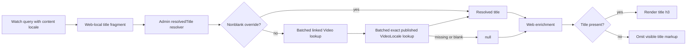

# fix: Resolve Watch media collection linked titles

## Summary

Expose a published, locale-aware resolved title for each linked Admin
`MediaCollectionItem`, consume it through a Web-specific Watch Experience
extension, and omit the visible card heading when neither a nonblank authored
override nor a nonblank published title in the exact requested locale is
available.

## Problem Frame

Admin stores Experience media collection items as flat authored JSON. Its
GraphQL read boundary already hydrates linked Video identifiers, slugs, images,
and playback metadata through request-scoped loaders, but it does not expose the
linked localized title. Web therefore receives `titleOverride: null` for the NUA
cards on `/watch`, normalizes that to an empty string, and renders an empty `<h3>`
over a fully usable thumbnail.

Client-only fallback logic would repeat the title contract across Web, Mobile,
and TV or require another bulk request on every Experience render. The durable
boundary is the additive Admin GraphQL projection, where the existing Video and
VideoLocale loaders can resolve all cards in batches.

Production preflight on 2026-07-21 confirmed that every affected item can use
this boundary: all ten `NUA: Fresh Perspective` items and all four `The Acts of
the Apostles` items have nonblank published English VideoLocale titles, and all
ten NUA items also have nonblank published Spanish titles. The existing
`resolveWatchHome` video query does not request those editorial item core IDs;
reusing it would require new homepage-only sequencing and model plumbing while
leaving the same flat-item defect on other Experience routes.

## Requirements

### Shared content contract

- R1. `MediaCollectionItem` exposes a nullable resolved title without changing the persisted Experience block JSON shape.
- R2. A nonblank authored `titleOverride` wins over linked Video copy.
- R3. A blank or whitespace-only override falls through to the linked Video's exact requested-locale title when that title is published and nonblank.
- R4. Missing links, deleted Videos, missing or unpublished locale rows, other-locale rows, and blank localized titles resolve to null without falling back to a slug, label, another locale, or `Untitled`.
- R5. Public and authenticated callers receive the same published-only resolved-title projection.
- R6. Resolution uses request-scoped loaders so a collection does not create per-card database queries.

### Web rendering

- R7. Web homepage, top-level Experience, nested Section, and nested Container media collections request the resolved title using the Watch content locale already carried by their operation without adding the field to Mobile or TV operations.
- R8. Web renders the resolved title over the thumbnail and preserves image, playback, link, layout, and authored label behavior.
- R9. Web omits the card `<h3>` when the resolved title is absent or blank and never renders a title placeholder.
- R10. A titleless interactive card retains a distinct localized accessible name, using its public video slug only as non-visible identifying context and never promoting it into visible title copy.

### Delivery and proof

- R11. The committed Admin SDL and admin-graphql gql.tada introspection match the new schema.
- R12. Browser proof demonstrates localized linked titles without adding a second browser/server data request or degrading page-load behavior; focused DOM tests prove the titleless state.

## Assumptions

- The query's `$locale` is the authoritative Watch content locale for title selection; the public audio-language slug continues to control navigation and playback independently.
- Exact-locale lookup is intentional. A missing localized title remains empty rather than silently showing English or another locale.
- The existing 60-second Experience data-cache ceiling is acceptable for a newly published VideoLocale title; this fix does not broaden cache invalidation.
- Existing image, hover-preview, CTA, and background-resolution behavior remains outside this title-only change.

## Key Technical Decisions

- **Resolve precedence at the Admin GraphQL read boundary:** a computed `resolvedTitle(locale:)` field centralizes override and linked-title semantics while leaving stored block JSON unchanged.
- **Enforce published-only lookup for every principal:** the public-ready computed field must not behave differently in editor preview and production or expose draft VideoLocale copy.
- **Use exact locale plus nonblank normalization:** empty strings and whitespace are absence signals, and no cross-locale or slug fallback is introduced.
- **Keep selection Web-specific:** a local fragment extension selects the additive field through direct, Section, and Container block paths without making Mobile and TV pay for resolver work they do not consume.
- **Conditionally render semantic title markup:** titleless cards keep their thumbnail and link but emit no empty heading; their localized accessible name may use the link's video slug only as non-visible identifying context.
- **Preserve route-child behavior:** route-video children bypass `MediaCollectionItem` and keep their existing title/slug policy; changing that separate source is not required to fix the observed flat-item defect.

## Scope Boundaries

### In Scope

- Admin's computed `MediaCollectionItem` GraphQL output.
- Generated admin-graphql contract artifacts and a Web-local fragment extension.
- Web media item enrichment and title overlay/accessibility behavior.
- Focused resolver, data-shape, component, browser, and page-load verification.

### Out of Scope

- Stored block-schema or database migrations.
- Native Mobile/TV queries and renderer changes; the additive schema field is available for a future migration, but this fix neither selects nor consumes it there.
- Image fallback/rewrite behavior and collection layout redesign.
- New locale fallback policy or cache-tag topology.
- Production deployment outside the normal PR-to-main flow.

## High-Level Technical Design

## Implementation Units

### U1. Add the published linked-title GraphQL projection

**Goal:** Resolve one public-ready title for each flat collection item at the Admin read boundary.

**Requirements:** R1-R6, R11.

**Dependencies:** None.

**Files:**

- `apps/admin/src/graphql/types/blocks.ts`
- `apps/admin/src/graphql/types/blocks.test.ts`
- `apps/admin/schema.graphql`
- `packages/admin-graphql/src/admin-graphql-env.d.ts`

**Approach:** Add nullable `resolvedTitle` with a locale argument. Treat blank/whitespace override values as absent. When no override exists, reject missing or soft-deleted linked Videos, then load exact-locale VideoLocale rows through `videoLocalesByVideoIdAndFilter` with `visibleOnly: true` regardless of caller. Return the first nonblank title in the loader's established deterministic order or null. Reuse existing request-scoped `videoById` and VideoLocale loaders rather than accessing Prisma in the item resolver. Regenerate and commit SDL plus gql.tada introspection in receiver PR A; never edit generated artifacts manually.

**Test scenarios:**

1. A nonblank override wins without loading VideoLocale rows.
2. Empty and whitespace-only overrides resolve the requested published localized title.
3. Another locale, unpublished locale, blank locale title, absent link, missing Video, and deleted Video return null.
4. The locale loader key always requests `visibleOnly: true`.
5. Multiple sibling resolver calls use the existing DataLoader contract rather than direct Prisma calls.

**Verification:** Run the focused Admin block GraphQL tests, `pnpm --filter @forge/admin schema:print`, `pnpm --filter @forge/admin-graphql generate`, and a clean second generation. After PR A deploys from main, probe the live public schema and one production-confirmed NUA item before allowing PR B to merge.

### U2. Carry the resolved title through a Web-local fragment extension

**Goal:** Make every Web Watch Experience media collection receive the locale-aware field through one Web-local fragment extension.

**Requirements:** R7.

**Dependencies:** U1.

**Files:**

- `apps/web/src/lib/fragments/watch-media-collection-titles.ts`
- `apps/web/src/lib/fragments/watch-experience.ts`

**Approach:** Keep the shared `AdminMediaCollection` fragment unchanged so
Mobile and TV operations do not select or execute the new field. Add a small
Web-local Experience fragment that selects `resolvedTitle(locale: $locale)` for
direct MediaCollection blocks and the existing Section/Container nesting paths,
then compose that extension with `AdminWatchExperience` under Web's local
`watchExperienceFragment`. This is consumer PR B and remains stacked on PR A
until the live Admin probe succeeds.

**Test scenarios:**

1. gql.tada accepts the fragment variable in Web homepage and Experience operations.
2. Mobile and TV operation text does not contain `resolvedTitle`.
3. Direct, Section, and Container selection paths each include the Web-local field.

**Verification:** Run Web and admin-graphql typechecks plus operation-text assertions after the live PR A schema probe passes.

### U3. Render linked titles and omit absent titles on Web

**Goal:** Use the resolved contract for every media collection card without synthesizing title text.

**Requirements:** R8-R10.

**Dependencies:** U2.

**Files:**

- `apps/web/src/lib/enrichment.ts`
- `apps/web/src/lib/enrichment.test.ts`
- `apps/web/src/components/sections/MediaCollection.tsx`
- `apps/web/src/components/sections/MediaCollection.test.tsx`

**Approach:** Extend the flat item input with `resolvedTitle`, normalize it to
empty only at the renderer-model boundary, and remove the stale
deferred-hydration comment. Render the card heading only for a nonblank title.
Keep image alt empty for titleless decorative thumbnails and build a localized
non-visible accessible name from the title, existing label, or public video slug
in that order. Leave `enrichRouteRelatedVideo` unchanged because route children
do not use the flat Admin item contract.

**Test scenarios:**

1. An authored override and linked localized title produce the resolver-selected authored title.
2. A linked localized title renders in the overlay when no override exists.
3. Null, empty, and whitespace-only resolved titles produce no `<h3>` and no `Untitled` or slug text.
4. Multiple titleless links remain distinguishable to assistive technology through their non-visible video slugs while image alt stays empty.
5. Route-video child title behavior remains unchanged.
6. Label, image, href, Mux preview, and layout behavior remain unchanged.

**Verification:** Run focused Web enrichment and MediaCollection component tests.

### U4. Validate the production-shaped Watch flow

**Goal:** Prove the fix across the real rendering path and confirm the additive resolver does not add a separate request or loading regression.

**Requirements:** R7-R12.

**Dependencies:** U1-U3.

**Files:**

- `docs/roadmap/platform/feat-280-watch-media-collection-linked-titles.md`
- `docs/solutions/architecture-patterns/tv-sdui-mediacollection-card-image-title-resolution.md`

**Approach:** Run Admin/Web format, lint, typecheck, focused tests, and
generated-contract drift checks. Use the production-confirmed NUA item IDs in a
restored local catalogue to inspect English and Spanish linked titles through
the repo-native Admin/Web workflow and capture a screenshot. The focused
component test owns the synthetic titleless DOM case, avoiding an untracked
browser fixture. Measure five sequential warm local renders before and after the
consumer change on the same machine and database; require no new browser HTTP
request and a post-change median TTFB no more than 20% above baseline. Update the
existing solution note with the new Admin field and Web-only no-placeholder
behavior while retaining its current TV/Mobile fallback guidance. Mark the
roadmap item complete after proof passes.

**Test scenarios:**

1. Top-level and nested collection cards receive the exact locale title.
2. Focused DOM coverage proves a card with neither title source has no heading or visible placeholder and remains navigable.
3. The GraphQL operation has no errors and the page does not add a second title-hydration request.
4. Five sequential warm local renders add no browser request and keep median TTFB within 20% of the same-environment baseline.

**Verification:** Save browser/DOM evidence and compare request count/timing with the pre-fix production observation.

## System-Wide Impact

The schema change is additive and does not mutate Experience JSON. The resolver
adds two request-scoped batched lookup families at most: linked Videos and exact
published VideoLocales. Existing item resolvers already use the Video loader,
so repeated IDs are deduplicated within the GraphQL request. Web receives the
field inside its existing Experience operation; there is no new browser request
or client hydration boundary. Mobile and TV keep their current operation text
and pay no new resolver or payload cost.

Delivery uses two stacked PRs. PR A contains U1, generated SDL/introspection,
and Admin tests but no consumer selection. After PR A merges, deploys through the
normal main flow, and a live public GraphQL probe returns `resolvedTitle`, PR B
lands the Web-local fragment, rendering changes, browser proof, roadmap
completion, and solution note. This receiver boundary prevents Web from sending
an operation that an older Admin schema rejects during GraphQL validation.

## Risks and Mitigations

- **GraphQL fragment variables could fail in nested composition:** compile Web after adding `$locale`, and exercise root, Section, and Container paths while asserting Mobile/TV operation text is unchanged.
- **Draft locale copy could leak through authenticated preview:** hard-code published-only loader filtering for the computed public field and assert the loader key in tests.
- **Whitespace could suppress a valid linked title:** normalize both override and localized title before applying precedence.
- **Titleless links could become unnamed:** retain a localized non-visible accessible name while keeping visible copy absent.
- **Cross-service deployment could race:** enforce receiver-first ordering with stacked PR A (Admin) and PR B (Web), with a live schema probe between merge/deploy steps.
- **Resolver work could become N+1:** use only request-scoped DataLoaders and verify query/request behavior in focused and browser tests.

## Verification Strategy

Run focused tests first, regenerate the schema artifacts, then run Admin,
admin-graphql, and Web typechecks plus lint/format checks for the touched scope.
Assert Mobile and TV operation text remains unchanged. Finally use the
repo-native local Admin/Web workflow for a two-locale browser smoke, capture a
screenshot, inspect DOM headings/accessibility labels, and compare five
sequential warm local renders against the same-environment baseline. PR A must
merge, deploy, and pass a live `resolvedTitle` schema probe before PR B becomes
mergeable.

## Acceptance Examples

- AE1. Given `titleOverride: "Fresh Perspective"` and linked title `NUA Episode 1`, the card visibly renders `Fresh Perspective`.
- AE2. Given an empty override and linked published `en` title `NUA: Origins`, an English Watch request visibly renders `NUA: Origins`.
- AE3. Given an empty override, an English title, and a Spanish Watch request with no Spanish VideoLocale title, the card renders no visible title instead of English, a slug, or `Untitled`.
- AE4. Given neither title source, the card thumbnail and link remain present, the DOM contains no card `<h3>`, and the link still has a distinct localized accessible name using its slug only in non-visible context.

## Acceptance Criteria

- Admin exposes the exact-locale published resolved title with authored override precedence.
- Blank/missing title sources resolve and render as empty without placeholder text.
- Homepage and nested Experience collections consume the same Web-local field selection.
- Route-child title behavior remains unchanged and outside the flat-item fix.
- Generated GraphQL artifacts are current and a second generation is clean.
- Focused tests, typechecks, lint/format checks, and browser/page-load proof pass.
- PR A's live Admin schema probe passes before PR B is eligible to merge.
- The roadmap ticket is complete and the solution guidance records Web's new no-placeholder rule without misrepresenting current native behavior.

## References

- `docs/roadmap/platform/feat-280-watch-media-collection-linked-titles.md`
- `docs/roadmap/platform/feat-277-admin-editor-collection-child-expansion.md`
- `docs/roadmap/platform/feat-211-watch-video-relation-loader-performance.md`
- `docs/roadmap/topic-experiences/feat-279-experience-carousel-empty-copy.md`
- `docs/solutions/architecture-patterns/tv-sdui-mediacollection-card-image-title-resolution.md`
- `docs/solutions/best-practices/graphql-callsite-inventory-dual-pattern-sweep-20260507.md`
- `docs/plans/2026-06-01-002-feat-watch-language-rendering-plan.md`
- `apps/admin/src/graphql/types/blocks.ts`
- `packages/admin-graphql/src/fragments/blocks/media-collection.ts`
- `apps/web/src/lib/enrichment.ts`
- `apps/web/src/components/sections/MediaCollection.tsx`
