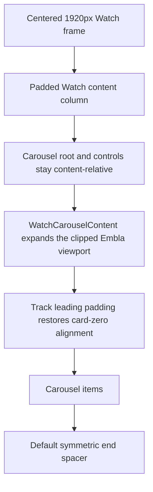

# Watch Full-Bleed Carousel Layout - Plan

## Goal Capsule

- **Objective:** Give every public Watch carousel one shared full-frame browsing viewport while preserving the current content-left position of its first unscrolled card.
- **Authority:** The user's all-carousel design-system rule and explicit first-card alignment constraint override localized carousel implementations.
- **Scope:** The eight public Watch carousel consumers in `apps/web`, their shared Watch layout tokens/wrapper, focused tests, roadmap state, and durable layout documentation.
- **Stop conditions:** Stop if the approach requires exposing Embla's transformed track to page overflow, bleeding past the centered 1920px Watch frame, moving card zero to the frame edge, or changing GraphQL/data/routing behavior.
- **Execution profile:** Implement the shared contract first, migrate consumers in bounded groups, then prove geometry and page containment in a real browser before shipping.
- **Tail ownership:** Ship through the normal branch, pull request, and CI path; do not deploy directly to production.

---

## Product Contract

### Summary

Watch carousels should feel unbounded relative to their content columns: after card zero starts on the same left line as the surrounding heading and copy, the scrollable viewport should use the remaining horizontal room out to the centered Watch frame. Today each consumer approximates that behavior differently, so desktop rails often stop at the inner content edge and some mobile exceptions risk page-level overflow.

### Problem Frame

The generic carousel primitive correctly owns Embla behavior and clips its transformed track, but it does not know Watch's `max-w-[1920px]` frame or `5 / 16 / 24` content gutter ladder. Those Watch rules are currently scattered across roots, tracks, and manually appended spacers. The implementation needs a Watch-specific composition layer that owns the geometry without weakening the generic primitive's containment.

### Requirements

**Shared layout behavior**

- R1. All eight public Watch carousel consumers use one Watch-specific content-layout abstraction instead of local bleed, leading-padding, or end-spacer recipes.
- R2. At initial scroll position, the first visible card's left edge matches the left edge of the surrounding content column at every supported breakpoint.
- R3. A rail's Embla viewport can reveal and scroll cards through the side gutters up to the centered 1920px Watch frame, but never beyond that frame on ultrawide screens.
- R4. Non-looping rails end with trailing reach symmetric to their leading content alignment, represented by a non-interactive, assistive-technology-hidden spacer.
- R5. The language inventory rail uses the same abstraction with an inventory layout that aligns to its centered `max-w-7xl` content column while browsing across the Watch frame.

**Containment and interaction**

- R6. The transformed Embla track remains contained by `overflow-x-clip overflow-y-visible`, so carousel content never increases the document's horizontal scroll width or enables outside-rail rubber-banding.
- R7. Existing dragging, horizontal-wheel navigation, keyboard controls, arrow placement, links, active/pending state, preview behavior, and loop behavior remain unchanged.
- R8. Looping rails can omit the end spacer without bypassing the shared Watch viewport and initial-alignment contract.

**Boundaries**

- R9. The change does not alter GraphQL operations, content enrichment, routes, card art/copy, media loading, or the generic carousel primitive's non-Watch contract.
- R10. The layout change adds no request, effect, listener, dynamic import, or render-blocking resource to page load.

### Acceptance Examples

- AE1. At a 390px viewport, a Watch rail inside the base `px-5` content gutter starts card zero at the content-left coordinate, scrolls through the side gutter, and leaves the document width at 390px.
- AE2. At desktop `md` and `xl` breakpoints, card zero stays aligned with the `md:px-16` or `xl:px-24` heading edge while later cards can occupy the cancelled gutter up to the Watch frame.
- AE3. At 2048px viewport width, the carousel stops at the centered 1920px frame rather than extending through the extra 64px browser margin on either side.
- AE4. The inventory metric rail starts at the same left coordinate as its `max-w-7xl px-5 sm:px-8` content, reaches the Watch frame, and ends with a matching trailing allowance.
- AE5. The looping Watch home preview rail uses the shared viewport but renders no terminal spacer, so the final preview continues directly into the first.
- AE6. A horizontal gesture outside a rail leaves `scrollX` and the document edge unchanged; the same gesture inside the rail changes the Embla track position without changing page `scrollX`.

### Scope Boundaries

- In scope: Bible Quotes on episode pages, sibling episodes/chapters, authored Experience Bible quotes, authored Experience navigation, authored Experience video, media collection rails, Watch home TV previews, and language inventory metrics.
- Outside scope: non-carousel grids, standalone players/posters, Admin/Manager/Mobile/TV implementations, generic non-Watch carousel consumers, card sizing redesign, and production deployment.

### Sources

- `docs/roadmap/platform/feat-286-watch-full-bleed-carousel-layout.md`
- `docs/solutions/design-patterns/embla-carousel-bleed-alignment-port-pattern-20260508.md`
- `docs/solutions/ui-bugs/watch-mobile-sibling-carousel-horizontal-rubber-band.md`
- `docs/solutions/conventions/grep-inline-tier-copies-before-bumping-shared-layout-tokens-2026-05-05.md`
- `docs/solutions/conventions/frontend-change-page-load-performance-verification.md`

---

## Planning Contract

### Key Technical Decisions

- KTD1. Cover all public Watch carousel surfaces. (session-settled: user-directed — chosen over screenshot-only or content-rail-only fixes: the requested behavior is a Watch design-system rule.)
- KTD2. Treat the centered `max-w-[1920px]` Watch frame as the outer bleed boundary. (session-settled: user-directed — chosen over the physical browser edge: the Watch composition must remain centered and bounded on ultrawide screens.)
- KTD3. Preserve content-left card-zero alignment at rest. (session-settled: user-directed — chosen over aligning card zero to the frame edge: the wider area is browsing room and must not move the current starting line.)
- KTD4. Preserve a clipped Embla viewport. (session-settled: user-approved — chosen over literal `overflow-x-visible`: visible track overflow previously caused mobile page rubber-banding.)
- KTD5. Introduce Watch-specific `WatchCarousel` and `WatchCarouselContent` compositions over the generic primitives. The root wrapper owns offset-aware Embla alignment; the content wrapper owns clipped frame geometry and spacing. (session-settled: user-approved — chosen over eight local class recipes: the user requested a shared Watch design-system rule and approved the wrapper/tokens plan.)
- KTD6. Apply rail expansion to the Embla viewport, not the `Carousel` root. This keeps existing root-relative arrow controls and surrounding content geometry stable while the viewport alone cancels the parent gutter.
- KTD7. Default the wrapper to `layout="rail"` with an accessible end spacer; provide `layout="inventory"` for the centered `max-w-7xl` coordinate system and `endSpacer={false}` for looping rails.
- KTD8. Derive Watch rail bleed, track-leading padding, and end-spacer tokens together from the existing `5 / 16 / 24` Watch gutter ladder. Keep inventory leading/trailing spacing paired through the equivalent `px-5 sm:px-8 max-w-7xl` alignment formula.

### High-Level Technical Design

`WatchCarousel` should own the selected layout's responsive Embla alignment so looped and non-zero-start snaps retain the content inset. `WatchCarouselContent` should accept normal track DOM props, own the Watch viewport class, prepend the selected layout's leading-padding token to the track, render its children, and append an `aria-hidden`, `tabIndex={-1}`, `basis-auto`, zero-item-padding spacer unless disabled. The content wrapper must not provide a public escape hatch that allows Watch callers to replace the containment class with visible overflow.

The rail viewport cancels the same Watch gutter applied by its padded parent at base, `md`, and `xl`; the matched track padding adds that distance back before card zero. The inventory carousel moves its root into `CONTENT_WIDTH_ALIGN_CLASSES`, then uses leading/trailing space equivalent to `px-5 sm:px-8` inside a centered `max-w-7xl` container. At frame widths above 1280px, that inventory offset is `max(2rem, calc(50% - 38rem))` relative to the Watch frame.

### Sequencing

1. Add paired tokens and the wrapper contract with focused tests.
2. Migrate the two core episode-page rails and authored Experience rails.
3. Migrate media/home/inventory variants, using explicit inventory and loop options.
4. Run the responsive geometry, containment, interaction, and page-load verification matrix.
5. Record durable shared-rule documentation and complete the roadmap ticket only after all proof passes.

### Risks and Mitigations

- A viewport class can cancel the wrong ancestor padding when a consumer already occupies the full frame. Mitigate by testing both padded-parent rails and existing full-frame `MediaCollection`, removing obsolete local wrappers during migration.
- Embla `containScroll: "trimSnaps"` can trim CSS right padding. Keep the real trailing `CarouselItem` spacer rather than relying on track `padding-right`.
- Loop mode and a terminal spacer conflict semantically. Make spacer omission explicit and cover the Watch home loop in tests.
- Arbitrary-value inventory classes can escape Tailwind discovery or encode invalid CSS math. Keep the class literal in a shared token and assert the exported string in `content-width.test.ts`; verify computed geometry in the browser.
- Removing visible overflow can change a currently accidental glimpse of off-track cards. Acceptance is measured by frame reach during scroll, not by exposing the entire transformed track at once.

---

## Implementation Units

### U1. Establish the Watch carousel layout contract

- **Goal:** Centralize Watch viewport bleed, card-zero alignment, trailing reach, and overflow containment.
- **Requirements:** R2-R6, R8, R10.
- **Files:** `apps/web/src/lib/content-width.ts`, `apps/web/src/lib/__tests__/content-width.test.ts`, new `apps/web/src/components/watch/WatchCarouselContent.tsx`, and new `apps/web/src/components/watch/__tests__/WatchCarouselContent.test.tsx`.
- **Approach:** Add paired rail and inventory tokens, then wrap `CarouselContent` with `layout`, `endSpacer`, and optional spacer test-id behavior. Reuse `CarouselItem` for the terminal spacer and keep the generic carousel primitive unchanged.
- **Test scenarios:**
  1. The rail token tuple uses matching `5 / 16 / 24` values for negative viewport bleed, leading track padding, and trailing spacer width.
  2. Default rendering selects the rail layout, applies frame expansion only to the viewport, and adds one hidden, unfocusable end spacer.
  3. `layout="inventory"` applies the inventory-alignment pair without the rail negative-margin ladder.
  4. `endSpacer={false}` omits the terminal slide while preserving viewport containment and leading alignment.
  5. Callers can add track classes and DOM attributes without replacing `overflow-x-clip overflow-y-visible`.
- **Verification:** Focused token/wrapper suites pass and a static search shows no new `overflow-x-visible` in Watch carousel code.

### U2. Migrate episode and authored Experience rails

- **Goal:** Put the reported Bible Quotes rail, episode/chapter siblings, and three authored carousel renderers on the shared rail contract.
- **Requirements:** R1-R4, R6-R7, R9-R10; AE1-AE3 and AE6.
- **Files:** `apps/web/src/components/watch/BibleQuotesSection.tsx`, `apps/web/src/components/watch/SiblingCarousel.tsx`, `apps/web/src/components/sections/BibleQuotesCarousel.tsx`, `apps/web/src/components/sections/NavigationCarousel.tsx`, `apps/web/src/components/sections/CarouselVideo.tsx`, `apps/web/src/components/sections/Container.tsx`, `apps/web/src/components/sections/Container.test.tsx`, `apps/web/src/components/watch/__tests__/BibleQuotesSection.test.tsx`, `apps/web/src/components/watch/__tests__/SiblingCarousel.test.tsx`, and `apps/web/src/components/sections/__tests__/CarouselVideo.test.tsx`.
- **Approach:** Replace local root bleed, generic carousel tuple imports, manual track leading padding, and hand-built end spacers with `WatchCarousel` plus `WatchCarouselContent`. Promote authored Container slots that contain carousel variants to all 12 columns while preserving non-carousel media spans. Preserve each component's item gap/basis, non-alignment Embla options, controls, labels, and card behavior.
- **Test scenarios:**
  1. Bible Quotes and sibling rails no longer revert to bounded desktop classes and use the shared default spacer.
  2. Authored Bible Quotes, navigation, and video rails no longer import the generic `CAROUSEL_*` tuple or render local spacer slides.
  3. Existing item basis/gap classes and control accessible names remain unchanged.
  4. Sibling active/pending navigation and Bible Quotes promo-card ordering remain unchanged.
  5. Authored carousel slots resolve to 12 columns at every breakpoint while non-carousel media variants retain configured responsive spans.
- **Verification:** All affected focused suites pass; grep finds no local Watch rail bleed or duplicated terminal-spacer markup in these consumers.

### U3. Migrate media, Watch home, and language inventory variants

- **Goal:** Complete coverage for the full-frame media rail, looping home preview rail, and centered inventory metric rail.
- **Requirements:** R1-R10; AE3-AE5.
- **Files:** `apps/web/src/components/sections/MediaCollection.tsx`, `apps/web/src/components/home/WatchHomeTvCarousel.tsx`, `apps/web/src/components/watch-language-inventory/LanguageInventoryPage.tsx`, `apps/web/src/components/sections/MediaCollection.test.tsx`, `apps/web/src/components/home/__tests__/WatchHomePage.test.tsx`, and `apps/web/src/components/watch-language-inventory/LanguageInventoryPage.test.tsx`.
- **Approach:** Remove `MediaCollection`'s open-coded `pl-5 md:pl-16 xl:pl-24`/spacer pair in favor of the rail wrapper while respecting its already full-frame root. Remove the home rail's visible-overflow/mobile-only recipe and opt its loop out of the spacer. Move the inventory carousel root out of the bounded inner container and select `layout="inventory"` so its first card retains the previous content coordinate.
- **Test scenarios:**
  1. `MediaCollection` still renders its full-frame rail and shared symmetric spacer without changing grid variants.
  2. Watch home uses the clipped shared viewport and omits the spacer when `loop: true`.
  3. Inventory uses the full Watch frame for its viewport while its first metric remains aligned to the centered inner content column.
  4. Existing card counts, anchors, CTA links, media preview policy, and controls are unchanged.
- **Verification:** Focused consumer suites pass and the eight-consumer inventory shows every public `CarouselContent` use replaced by the Watch composition.

### U4. Prove the system rule and preserve it

- **Goal:** Validate responsive behavior, page containment, interaction, performance neutrality, and future reuse.
- **Requirements:** R1-R10; AE1-AE6.
- **Files:** `docs/solutions/design-patterns/watch-full-bleed-carousel-layout-pattern-20260722.md`, `docs/roadmap/platform/feat-286-watch-full-bleed-carousel-layout.md`, and any focused test updates discovered during browser proof.
- **Approach:** Use the mandated Forge remote Web QA launcher against the reported episode route, `/watch`, and the language inventory route. Capture coordinate and document-width measurements at phone, desktop, and 2048px widths; exercise drag and one keyboard/arrow/card interaction; compare page-load resources; inspect stderr for cross-origin warnings. Document the wrapper as the default for future public Watch carousels and the generic primitive as intentionally context-neutral.
- **Test scenarios:**
  1. Card zero and the nearest content heading have equal left coordinates before scroll at every measured viewport.
  2. The rail reaches the 1920px frame, stops there on 2048px, and restores symmetric trailing reach.
  3. Root `scrollWidth` equals `clientWidth`; outside drag does not move the page; inside drag moves Embla only.
  4. Controls and a real navigation target remain operable by pointer or keyboard.
  5. Before/after resource count and transferred bytes show no request or render-blocking-resource increase attributable to the layout change.
- **Verification:** Browser evidence satisfies the matrix, launcher stderr has no `Blocked cross-origin request`, the solution document records the invariant, and the roadmap ticket is set to `complete` with the final verification summary.

---

## Verification Contract

| Gate                     | Command or evidence                                                                                                                                                                                                                                                                                                                                                                         | Done signal                                                                                 |
| ------------------------ | ------------------------------------------------------------------------------------------------------------------------------------------------------------------------------------------------------------------------------------------------------------------------------------------------------------------------------------------------------------------------------------------- | ------------------------------------------------------------------------------------------- |
| Shared contracts         | `pnpm --filter @forge/web test -- src/lib/__tests__/content-width.test.ts src/components/watch/__tests__/WatchCarouselContent.test.tsx`                                                                                                                                                                                                                                                     | Token lockstep, layout variants, containment, and spacer semantics pass.                    |
| Consumer regressions     | `pnpm --filter @forge/web test -- src/components/watch/__tests__/BibleQuotesSection.test.tsx src/components/watch/__tests__/SiblingCarousel.test.tsx src/components/sections/__tests__/CarouselVideo.test.tsx src/components/sections/MediaCollection.test.tsx src/components/home/__tests__/WatchHomePage.test.tsx src/components/watch-language-inventory/LanguageInventoryPage.test.tsx` | Migrated surfaces retain behavior and assert the shared layout contract.                    |
| Full Web tests           | `pnpm --filter @forge/web test`                                                                                                                                                                                                                                                                                                                                                             | No broader Web regression.                                                                  |
| Type safety              | `pnpm --filter @forge/web typecheck`                                                                                                                                                                                                                                                                                                                                                        | Strict TypeScript passes.                                                                   |
| Static quality           | `pnpm --filter @forge/web lint`, touched-file Prettier check, and `git diff --check`                                                                                                                                                                                                                                                                                                        | No lint, format, or whitespace failure.                                                     |
| Production build         | `pnpm --filter @forge/web build`                                                                                                                                                                                                                                                                                                                                                            | Next.js production build completes without route or rendering regression.                   |
| Responsive geometry      | Remote browser coordinate capture at 390px, desktop, and 2048px on the reported episode, home, and inventory routes                                                                                                                                                                                                                                                                         | Card zero equals its content-left reference and the viewport is bounded by the Watch frame. |
| Containment/interactions | Browser drag, wheel/arrow/keyboard, navigation, root-width, and stderr evidence                                                                                                                                                                                                                                                                                                             | Rail moves, page does not; controls work; no cross-origin block appears.                    |
| Page-load performance    | Before/after resource timing and request/byte comparison on an affected route                                                                                                                                                                                                                                                                                                               | No added request, render-blocking resource, effect, or initialization cost.                 |
| Review                   | Simplification and code-review passes over the final diff                                                                                                                                                                                                                                                                                                                                   | No unresolved P0/P1 or correctness finding.                                                 |

---

## Definition of Done

- R1-R10 and AE1-AE6 are satisfied.
- U1-U4 are complete in dependency order, with every listed test scenario covered.
- All eight public Watch carousel consumers use the shared Watch composition and no migrated consumer retains local bleed/leading/spacer duplication.
- Card zero remains content-left aligned at rest, browsing reaches but does not exceed the centered 1920px frame, and non-looping rails retain symmetric trailing reach.
- The generic carousel primitive remains clipped and context-neutral; the document cannot rubber-band horizontally because of an exposed Embla track.
- Focused/full tests, typecheck, lint, formatting, build, browser QA, interaction checks, page-load proof, and code review pass.
- Durable documentation and the roadmap ticket reflect the shipped rule and final evidence.
- Abandoned experiments, dead classes/imports, and obsolete consumer-specific workarounds are removed from the final diff.
