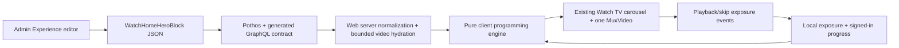
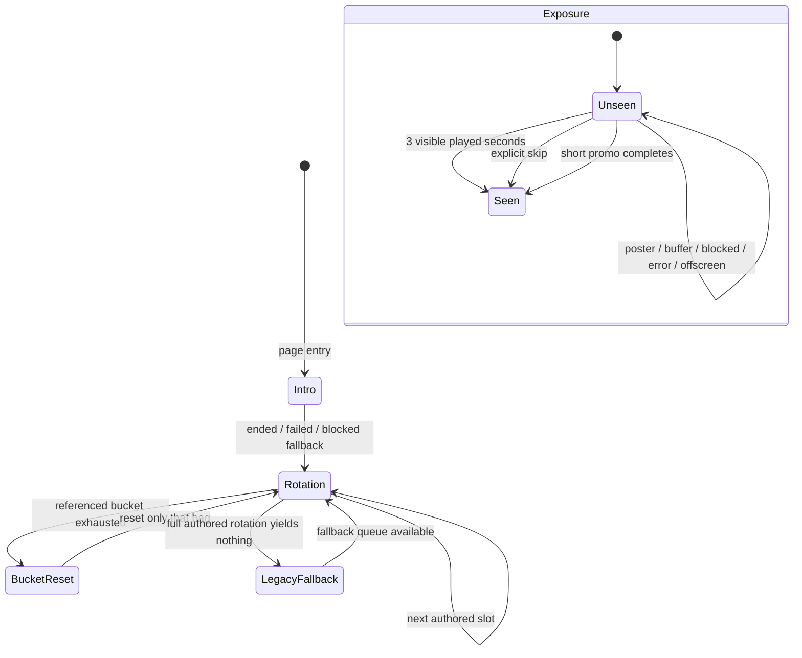
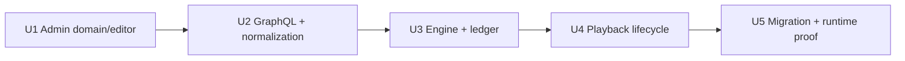

# Watch Home Editorial Programming

## Goal Capsule

Move Watch Home's intro, category cadence, and promo programming from static Web
configuration into the Admin-authored Homepage Experience while keeping
playback behavior platform-owned. Every page entry starts with the authored
intro when one is present and playable, then receives a newly seeded,
unseen-first sequence that obeys the exact authored bucket rotation and
preserves the current one-player TV-like surface. An entry without a usable
intro proceeds directly to its authored rotation or legacy fallback.

Success means an editor can change the lineup without a deploy; returning
visitors see fresh eligible videos; promo inserts remain deliberate; and local
preview exposure never masquerades as account watch progress.

---

## Product Contract

### Problem and actors

The current Forge-native hero has the visual shell of the original experience,
but the lineup is a Web-owned static config with daily deterministic ordering.
It marks videos played on activation, including failed or abandoned previews.
This blocks frequent editorial changes and weakens the promise that each visit
surfaces something the viewer has not actually seen.

- **Viewer:** receives a coherent, newly assembled Watch channel on each entry.
- **Editor:** authors the intro, typed content buckets, promo buckets, and their
  repeating cadence on the locale-specific Homepage Experience.
- **Web runtime:** hydrates catalog identities into playable slides, assembles
  the sequence, owns lifecycle/timing, and degrades safely.

### Requirements

- **R1 — Fresh entry:** Initial mount, route remount, refresh, and restored
  `pageshow` after browser back/forward cache create a new entry seed and a new
  post-intro assembly. Ordinary React re-renders, visibility changes, and
  player state transitions do not rebuild it.
- **R2 — Intro once:** A playable authored intro is first once per entry and is
  never part of the repeating rotation. A failed, blocked, or unplayable intro
  must yield to the rotation rather than trap the visitor.
- **R3 — Exact cadence:** The repeating sequence is an ordered list of stable
  bucket IDs. IDs may recur in the rotation. Each reachable slot draws one item
  from its referenced bucket, then advances to the next slot.
- **R4 — Typed buckets:** Video buckets contain durable Admin video IDs. Promo
  buckets contain stable authored promo IDs, Mux playback identity, poster and
  localized overlay/action data. Invalid cross-kind data is rejected.
- **R5 — Independent bags:** Each bucket draws without repeating an item until
  that bucket's eligible set is exhausted. Exhaustion resets only that bucket;
  with multiple items, the reset avoids an immediate boundary repeat when
  possible.
- **R6 — Empty safety:** Missing references, duplicate items, empty buckets,
  unresolved videos, containers, and unplayable streams are skipped. One full
  rotation with no playable result terminates planning and activates fallback;
  it never loops forever or starves a later bucket.
- **R7 — Unseen-first videos:** Canonical Admin video ID is the identity across
  languages and buckets. Browser preview exposure and available signed-in watch
  history are preferred exclusions. An account-history entry counts as seen
  exactly when the existing `getWatchProgressRatio(entry)` is greater than zero
  (currently at least 1% valid progress), so the hero uses the same visibility
  predicate as Watch progress UI. When a bucket has no unseen candidates, it
  resets and may reuse its eligible catalog so small/fully watched programs
  remain playable.
- **R8 — Separate history domains:** Browser exposure is versioned local state.
  It is never uploaded or passed to account progress APIs. Account history only
  filters canonical videos; promo exposure remains browser-local; the fixed
  intro intentionally runs every entry.
- **R9 — Accurate exposure:** A video or rotating promo becomes locally seen
  after three cumulative seconds of successful playback while both document
  and hero are visible. A promo that completes sooner counts on completion.
  Explicit next/skip counts immediately. Poster dwell, rail selection,
  buffering, autoplay refusal, media error, hidden/offscreen time, and leaving
  before the threshold do not count.
- **R9a — Runtime failure quarantine:** A rotating item that reaches a media
  error is quarantined for the current page entry without recording exposure.
  The planner continues to later slots and activates legacy fallback if one
  full authored rotation contains only quarantined or otherwise unplayable
  items. A new entry may retry the item.
- **R10 — Freshness under asynchronous history:** Construct the non-intro
  horizon immediately from local exposure plus the current account-history
  snapshot; never hold the viewer on an empty hero while a network refresh is
  pending. A later history result or account change rebuilds future items
  without interrupting the active slide, and history failure simply leaves the
  local-only assembly in place without leaking one user's progress into another.
- **R11 — Editorial resilience:** A versioned storage payload includes program
  fingerprint and stable IDs. Program edits prune stale bag entries while
  preserving valid exposure identities. Malformed JSON, old versions, denied
  storage, quota failures, and competing-tab writes cannot break playback.
- **R11a — Promo semantic identity:** A promo ID identifies one semantic
  campaign. Changing its playback asset or action destination requires a new
  ID so prior exposure cannot hide a materially new campaign; copy-only or
  poster-only edits retain the ID and its exposure continuity. The editor warns
  when a material field changes without an ID change.
- **R12 — Playback parity:** Preserve one `MuxVideo` media surface, eager hero
  poster, preview cap, muted captions, scroll pause, reduced-motion behavior,
  inline takeover controls, and exactly-once carousel advance on completion.
- **R13 — Migration fallback:** A missing/placement-only program,
  response-level GraphQL failure, structurally incomplete/unpublished config,
  or an authored program with no playable slot uses the existing Web-owned
  playlist/promo source. Individual item hydration misses follow R6: omit only
  those items and keep the surviving authored rotation. The rest of Watch
  remains usable if even fallback content is unavailable.
- **R14 — Bounded delivery:** Catalog hydration remains bounded and server-only;
  Admin credentials never enter the client bundle. Random post-intro assembly
  begins after hydration so force-static `/watch` HTML remains deterministic.
- **R15 — Bounded trusted editorial input:** A program is limited to 128 KiB,
  24 buckets, 48 rotation slots, 40 items per bucket, 100 unique video IDs, and
  100 promo items total; labels are 80 characters, titles/action labels 120,
  and descriptions 500. Promo posters use approved Admin media assets. Actions
  accept only same-origin relative routes or HTTPS destinations under
  `jesusfilm.org` (including subdomains) and the migration host
  `your.nextstep.is`; all other schemes and hosts are rejected at both Admin
  validation and Web normalization.

### Key Decisions

1. **Fresh per-entry programming, not session/daily stability.**
   `session-settled: user-directed; rejected: stable per-session or per-day channel; reason: every arrival should surface a different eligible lineup.`
2. **Intro plus ordered typed rotation, not a flat pool.**
   `session-settled: user-directed; rejected: untyped flat random pool; reason: editorial cadence must deliberately mix classic, animation, short-film, and promo content.`
3. **Promo buckets rotate independently.**
   `session-settled: user-directed; rejected: one fixed insert at a hardcoded position; reason: promotions need their own editorial rotation and exhaustion cycle.`
4. **Admin owns editorial data; Web owns playback behavior.**
   `session-settled: user-approved; rejected: Web code configuration or a separate programming entity; reason: editors need no-deploy changes while playback remains platform-owned.`
5. **Independent no-repeat shuffle bags.**
   `session-settled: user-approved; rejected: unconstrained random draws; reason: novelty must not create accidental repeats before a bucket is exhausted.`
6. **Hybrid exclusion without progress pollution.**
   `session-settled: user-approved; rejected: synchronizing autoplay impressions or using browser-only history; reason: account history improves relevance but preview exposure is not viewing progress.`
7. **Meaningful playback or explicit skip defines seen.**
   `session-settled: user-approved; rejected: mark seen on slide activation; reason: posters, blocked autoplay, failures, and aborted previews should remain eligible.`
8. **Intro is outside the loop.**
   `session-settled: user-approved; rejected: replaying intro on every rotation wrap; reason: a repeated opening becomes intrusive.`

If repository or runtime evidence shows a settled decision cannot work, report
the conflict; do not silently reinterpret the decision.

### Acceptance examples

- **AE1:** Given two video buckets and one promo bucket, entry plays intro once,
  then follows the authored bucket IDs exactly and loops without the intro.
- **AE2:** Refresh/re-entry changes the seed while retaining each bucket's
  persisted cycle/exposure state; a new assembly does not promise every visible
  position differs when only one eligible item exists.
- **AE3:** Exhausting bucket A resets only A; bucket B and the promo bucket keep
  their remaining no-repeat state.
- **AE4:** An invalid middle bucket is skipped and later rotation slots remain
  reachable.
- **AE5:** A video exposed in one bucket is unseen-ineligible in another until
  that second bucket must reset; localized variants share the canonical ID.
- **AE6:** Existing signed-in progress filters a video before post-intro queue
  display; preview exposure never creates or updates account progress.
- **AE7:** Three visible playback seconds records exposure once. Poster-only,
  buffering, blocked autoplay, failure, background playback, and scroll-away do
  not. Explicit skip records immediately.
- **AE8:** A sub-three-second promo counts when it ends; a failed intro or promo
  advances once without poisoning exposure history.
- **AE9:** Corrupt or unavailable localStorage still produces a playable queue.
- **AE10:** No playable authored slots activates legacy fallback without an
  infinite loop or blanking below-the-fold Watch content.
- **AE11:** One media element serves intro, previews, promos, and takeover; only
  the active stream is requested and page-load performance stays within the
  agreed verification budget.

### In scope / out of scope

In scope: Admin editor and Experience block, public GraphQL read contract,
Web-only planner and storage adapters, legacy seed/fallback, player lifecycle,
tests, documentation, and measured browser/performance verification.

Out of scope: Mobile/TV adoption, recommendations, audience targeting,
weighted campaigns, frequency caps beyond bag exhaustion, new analytics,
cross-device preview-exposure sync, and production data mutation outside the
normal Admin publishing workflow.

---

## Planning Contract

### Existing architecture

`page.tsx` statically resolves the Homepage Experience and normalized Watch
content. `WatchHomeExperiencePage` locates `WatchHomeHeroBlock` and renders
`WatchHomeTvCarousel`. The carousel hook currently builds a deterministic
date-seeded video queue, merges Web-owned Mux inserts, and records a video as
played when activation occurs. `WatchHomeTvCarousel` already provides the
correct single-media-element poster, rail, transition, caption, and takeover
surface.

The Admin stores Experience blocks as Zod-validated JSON, so the existing hero
block can gain a nested program without a database migration. Pothos exposes
the block; `packages/admin-graphql` owns the shared Watch Experience fragment;
Web normalizes the response into serializable client props.



### Proposed authored model

```ts
type WatchHomeProgram = {
  intro?: WatchHomePromoItem
  buckets: Array<WatchHomeVideoBucket | WatchHomePromoBucket>
  rotation: string[] // stable bucket IDs; references may repeat
}

type WatchHomeVideoBucket = {
  kind: "video"
  id: string
  label: string
  items: Array<{ id: string; videoId: string }>
}

type WatchHomePromoBucket = {
  kind: "promo"
  id: string
  label: string
  items: WatchHomePromoItem[]
}
```

Promo items carry stable `id`, Mux `playbackId`, duration, poster asset,
localized title/description/labels, logo flag, and explicit primary/secondary
actions. Persist identities, not derived stream or thumbnail delivery URLs.
GraphQL resolves assets and Web derives the Mux HLS URL at normalization.

### Programming state and lifecycle



The pure engine receives a normalized program, eligible items, local ledger,
account history, and injected entry RNG. It returns the intro plus a bounded
horizon and a continuation state. It has no DOM, React, storage, timers, or
network access. The hook asks it for one item ahead as slides are consumed.

### Key Technical Decisions

- **KTD1 — Extend the existing JSON block.** No Prisma model: the program is
  locale-specific editorial configuration and belongs with the existing
  Homepage Experience lifecycle.
- **KTD2 — Split persisted and derived data.** Admin persists video/media IDs
  and promo copy; GraphQL/Web derive public asset and stream URLs. This prevents
  URL rotation from invalidating editorial identity.
- **KTD3 — Separate pure engine from adapters.** Queue selection, bag reset,
  duplicate handling, and bounded skipping are deterministic under injected
  RNG; React, localStorage, account progress, and media events stay at edges.
- **KTD4 — Global identity, bucket-local cycles.** Canonical video exposure is
  global for unseen preference; each bucket has its own consumed cycle. A
  bucket may reuse globally seen items only when no unseen eligible candidate
  remains, preserving both freshness and liveness.
- **KTD5 — Client-only randomness after stable intro.** Force-static HTML and
  hydration render a deterministic intro/fallback poster. The randomized
  post-intro horizon initializes once on the client, avoiding cache-frozen
  randomness and hydration mismatch.
- **KTD6 — Receiver-first GraphQL rollout.** Add Pothos fields, regenerate SDL
  and gql.tada introspection, then consume them from Web. The placement-only
  block remains valid throughout migration.
- **KTD7 — Legacy config is a migration adapter.** Static playlist and promo
  data remain only as fallback until production Experiences are authored and
  verified. The safe seed script updates non-production canonical data; normal
  Admin publishing handles production.
- **KTD8 — Web-only behavior change.** Mobile and TV keep their existing hero
  contracts; documentation must name the intentional divergence and a follow-up
  may adopt the common Admin program later.

### Risks and controls

| Risk | Control |
| --- | --- |
| Later buckets starve in a bounded queue | Advance by authored slot cursor; skip empties within one bounded full rotation. |
| Static SSR and random client sequence disagree | Render stable intro/fallback through hydration; seed rotation in an effect/reducer. |
| Autoplay failure consumes content | Exposure is media-time/event based; failure advances without recording. |
| Auth history is late/unavailable | Gate non-intro build on settled history; fail open locally with no account write. |
| Program edit corrupts old bag state | Version + fingerprint + stable IDs; sanitize and merge storage defensively. |
| Intro increases page-load cost | Preserve eager poster and one `MuxVideo`; compare resource/LCP evidence before/after. |
| GraphQL widening breaks consumers | Additive optional fields, receiver-first regeneration, fragment/type tests. |
| Historical docs contradict new ownership | Update `CONCEPTS.md`, follow-up inventory, and block descriptions in the same change. |

### Assumptions

- Three cumulative visible seconds is the launch threshold for meaningful
  preview playback; product can tune the exported constant later.
- Browser exposure retains the current calendar-month privacy/lifecycle window.
- The Homepage Experience is already locale-specific, so promo copy is stored
  directly on the locale's program rather than as another nested locale table.
- Signed-in history is a preference, not a permanent hard ban after a bucket's
  eligible catalog is exhausted.

---

## Implementation Units

### U1 — Admin programming domain and editor

**Goal:** Make the existing Homepage Experience hero an editor-owned, strictly
validated programming document while retaining placement-only compatibility.

**Traces to:** R2-R6, R11-R11a, R13, R15; AE1, AE4, AE8, AE10.

**Files:**

- Modify `apps/admin/src/domain/blocks.ts`
- Modify `apps/admin/src/domain/blocks.test.ts`
- Modify `apps/admin/src/app/dashboard/experiences/experience-editor.tsx`
- Modify `apps/admin/src/app/dashboard/experiences/experience-editor/block-helpers.ts`
- Create `apps/admin/src/app/dashboard/experiences/experience-editor/watch-home-programming-editor.tsx`
- Modify corresponding editor/helper tests
- Modify `apps/admin/src/scripts/seed-watch-homepage-experience.ts`

**Approach:**

1. Add strict Zod schemas for stable promo item/action, video and promo buckets,
   and the program. Validate unique bucket/item IDs and rotation references at
   the program boundary while allowing the legacy missing-program form. Enforce
   R15's size/string/destination limits in the schema and editor before save,
   including the exact 100/101 unique-video boundary.
2. Extract a focused editor card with bucket CRUD/reordering, rotation slot
   CRUD/reordering, reusable individual-video picker, intro/promo fields, and
   inline validation. Keep hero availability homepage-only; collection
   expansion is outside this contract so authored bucket membership stays
   explicit and bounded.
3. Show placement-only blocks as an explicit empty state with **Create
   programming**; merely opening the editor does not mutate the payload, and
   remove/cancel restores the placement-only form. Deleting a referenced bucket
   requires confirmation that names the affected slot count, then atomically
   removes the bucket and all of its rotation references.
4. Make every reorder/remove control keyboard operable and labelled, preserve
   useful focus after mutations, announce ordering changes, and associate
   inline errors with their fields.
5. Normalize empty optionals and editor-only data at `normalizeEditorBlocks`.
6. Seed a schema-valid program equivalent to current static content in safe
   non-production databases; never bypass the script's production guard.

**Test scenarios:** Valid/invalid discriminated payloads; unknown-key rejection;
legacy payload; unique IDs/references; template validity; empty-state create and
cancel; editor add/reorder/remove; referenced-bucket confirmation/cascade;
keyboard/focus/announcement/error association; individual video selection;
promo actions; same-origin/approved HTTPS destination and rejected scheme/host;
approved poster assets; promo material-change ID warning; every R15 boundary;
saved payload passes `BlocksSchema`.

**Verification:** Focused Admin tests, typecheck, lint.

### U2 — Public GraphQL contract and Web normalization

**Goal:** Expose the authored program through the shared Experience query and
hydrate durable catalog IDs into bounded, language-correct playable inputs.

**Traces to:** R4, R6-R8, R10, R13-R15; AE4-AE6, AE10.

**Files:**

- Modify `apps/admin/src/graphql/types/blocks.ts`
- Regenerate `apps/admin/schema.graphql`
- Modify `packages/admin-graphql/src/fragments/blocks/watch-home-hero.ts`
- Regenerate `packages/admin-graphql/src/admin-graphql-env.d.ts`
- Modify `apps/web/src/lib/watch-home.ts`
- Create `apps/web/src/lib/watch-home-types.ts`
- Modify `apps/web/src/app/[locale]/[htmlLang]/page.tsx`
- Modify `apps/web/src/app/[locale]/[htmlLang]/[...rest]/page.tsx`
- Modify Web normalization tests

**Approach:** Add nested Pothos refs and optional program fields. Extend the
shared fragment. Both Watch Home route callers pass their already-resolved hero
block into program hydration instead of adding a third Experience read; collect
unique video IDs, hydrate them through the bounded Admin query with active
language, reject containers/unplayable records, resolve poster assets, recheck
R15's size and destination policy, and emit only serializable program data. Add
Admin `videoId` alongside Core ID to video slides. Preserve independently
available legacy fallback data for absent/response-invalid programming.

**Test scenarios:** Anonymous GraphQL shape; generated contract presence;
placement-only response; duplicate IDs fetched once; locale playback selection;
unresolved/unplayable items omitted without abandoning surviving authored
slots; bounded count; response/program-level failure fallback.

**Verification:** Schema drift test, schema print, admin-graphql generation,
package typecheck, focused Web normalization tests.

### U3 — Pure programming engine and browser ledger

**Goal:** Replace daily/static selection policy with deterministic-under-test,
fresh-per-entry bucket planning and resilient versioned exposure state.

**Traces to:** R1, R3, R5-R8, R11-R11a, R13; AE1-AE5, AE9-AE10.

**Files:**

- Refactor `apps/web/src/lib/watch-home-carousel-sequence.ts`
- Refactor `apps/web/src/lib/watch-home-carousel-sequence.test.ts`
- Modify `apps/web/src/lib/watch-home-config.ts` as fallback adapter only
- Add focused storage/engine helpers if separation improves readability

**Approach:** Implement pure program normalization and draw functions accepting
an injected RNG. Track a rotation cursor, per-bucket in-memory bag/reservations,
bucket-local cycle state, canonical global exposure, and account exclusions.
Guard one-full-rotation empty scans. Add a versioned monthly localStorage
adapter with program fingerprint, schema validation, valid-ID pruning,
merge-before-write behavior, and memory-only fallback.

**Test scenarios:** Intro once; exact looping order; recurring rotation refs;
independent exhaustion; no immediate reset repeat; one-item buckets; duplicate
IDs; cross-bucket canonical exposure; empty/deleted/unplayable buckets; all
empty termination; new seed; corrupt/denied/version-mismatched storage; program
revision; storage event/competing write merge.

**Verification:** Focused engine suite including property-style boundedness and
deterministic injected-RNG cases.

### U4 — Playback lifecycle integration

**Goal:** Drive the existing carousel from the program engine and record
exposure from real playback/skip events without changing account progress.

**Traces to:** R1-R2, R7-R9a, R10, R12-R15; AE1-AE2, AE6-AE8, AE11.

**Files:**

- Refactor `apps/web/src/components/home/useWatchHomeTvCarousel.ts`
- Modify `apps/web/src/components/home/WatchHomeTvCarousel.tsx`
- Modify `apps/web/src/components/home/WatchHomeExperiencePage.tsx`
- Modify related hook/page/carousel tests

**Approach:** Initialize one entry after hydration from local exposure and the
current account-history snapshot, without a network-history loading gate;
extend one programmed item ahead; classify advances (`ended`, `preview-cap`,
explicit skip, rail navigation, failure). Accumulate media time only while
document and hero are visible, record once at threshold/completion/explicit
skip, and never call watch-progress mutation APIs. Observe hero visibility,
preserve poster and single player, make failed/blocked intro yield once, handle
`pageshow`, and rebuild future slides when refreshed history or account identity
changes without disrupting active meaningful playback.

**Test scenarios:** No activation exposure; existing >0 progress-ratio account
predicate; 3-second threshold; explicit skip; rail navigation; short promo end;
failure/autoplay block; current-entry quarantine and all-failed fallback;
hidden/offscreen; rapid skips; StrictMode; account switch; bfcache; takeover
race; exactly-once advance; no account save; one player.

**Verification:** Focused component/hook tests, Web typecheck/lint, production
build.

### U5 — Migration, documentation, and runtime proof

**Goal:** Land the new ownership boundary safely and prove behavior and loading
performance on real Watch entry paths.

**Traces to:** R1-R15; AE1-AE11.

**Files:**

- Modify `CONCEPTS.md`
- Modify `docs/follow-ups/watch-home-modernization-missing-data.md`
- Modify `docs/roadmap/platform/feat-160-watch-home-carousel-data-parity.md`
- Complete `docs/roadmap/platform/feat-286-watch-home-editorial-programming.md`
- Add a durable solution note under `docs/solutions/` after verification

**Approach:** Replace outdated “code-defined hero/daily queue/mark-on-departure”
definitions with the Web editorial-program contract while explicitly noting
Mobile/TV divergence. Document Admin receiver-first rollout and fallback removal
criteria. Verify a placement-only block and authored block in browser. Capture
before/after page-load evidence, resource requests, hydration/browser errors,
and local storage edge behavior.

**Test scenarios:** Desktop/mobile refresh and leave/return; intro once;
authored cadence; empty slot; offscreen pause; corrupt storage; fallback;
takeover; reduced motion; no duplicate media/request; no hydration warning.

**Verification:** Browser pipeline, production Lighthouse/resource comparison,
console/stderr audit, full touched-scope CI-sensitive commands.

### Dependency order



---

## Verification Contract

### Automated gates

1. `pnpm --filter @forge/admin test -- src/domain/blocks.test.ts src/graphql/types/blocks.drift.test.ts src/app/dashboard/experiences/experience-editor`
2. `pnpm --filter @forge/admin schema:print`
3. `pnpm --filter @forge/admin-graphql generate`
4. `pnpm --filter @forge/admin typecheck`
5. `pnpm --filter @forge/admin lint`
6. `pnpm --filter @forge/admin-graphql typecheck`
7. `pnpm --filter @forge/web test -- src/lib/watch-home-carousel-sequence.test.ts src/lib/__tests__/watch-home.test.ts src/components/home/__tests__/useWatchHomeTvCarousel.test.ts src/components/home/__tests__/WatchHomePage.test.tsx`
8. `pnpm --filter @forge/web typecheck`
9. `pnpm --filter @forge/web lint`
10. `pnpm --filter @forge/web build`
11. Repository formatting and CI-sensitive diff checks required by the active
    package scripts.

Generated SDL/introspection output is reviewed but never hand-edited.

### Browser and performance gates

- Run the touched `/watch` browser pipeline at desktop and mobile widths.
- Exercise refresh, client leave/return, bfcache where supported, explicit
  skip, rail navigation, scroll off/on, intro completion, promo takeover, and
  fallback.
- Inspect browser console and Web stderr for hydration, media, storage, and
  cross-origin errors.
- Compare production-build mobile Lighthouse/navigation/resource evidence to
  a recorded pre-change median from three runs on the same machine/profile.
  Confirm one hero media element and only the active Mux stream request. The
  post-change three-run median must not regress mobile LCP by more than the
  greater of 10% or 250 ms, total blocking time by more than the greater of 10%
  or 50 ms, or transferred startup resources before first interaction by more
  than the greater of 10% or 100 KiB. A threshold breach is release-blocking
  until resolved or explicitly re-approved with the measured trade-off.

### Rollout gates

- Receiver-first: deploy/verify the additive Admin GraphQL field before a Web
  deployment depends on it.
- Keep placement-only parsing and static fallback until the canonical
  production Experience is authored and anonymously queryable.
- Do not mutate production content or deploy directly; use the normal PR-to-main
  and Admin publishing workflows.

---

## Definition of Done

- [ ] Admin can author a valid intro, typed buckets, and repeating rotation on
      `WatchHomeHeroBlock`, with legacy blocks still valid.
- [ ] Generated Admin SDL and admin-graphql types include the new read contract.
- [ ] Web hydrates durable IDs, builds fresh per-entry sequences, and obeys the
      exact authored cadence with independent bounded no-repeat behavior.
- [ ] Exposure is recorded only by the agreed media/skip rules, remains local,
      and signed-in history filters without any preview progress writes.
- [ ] Intro/failure/fallback/takeover/offscreen/account-change behavior is
      covered by focused automated tests.
- [ ] Browser QA proves refresh and return behavior on desktop/mobile with no
      hydration or console regressions.
- [ ] Production-build performance evidence shows no second media player,
      duplicate startup stream, or material Watch loading regression.
- [ ] `CONCEPTS.md`, migration/follow-up docs, solution knowledge, and roadmap
      status describe the shipped ownership boundary and residual native gap.
- [ ] Simplification, code review, eligible fixes, commit/push/PR, CI, and review
      feedback stages complete through the LFG pipeline.
