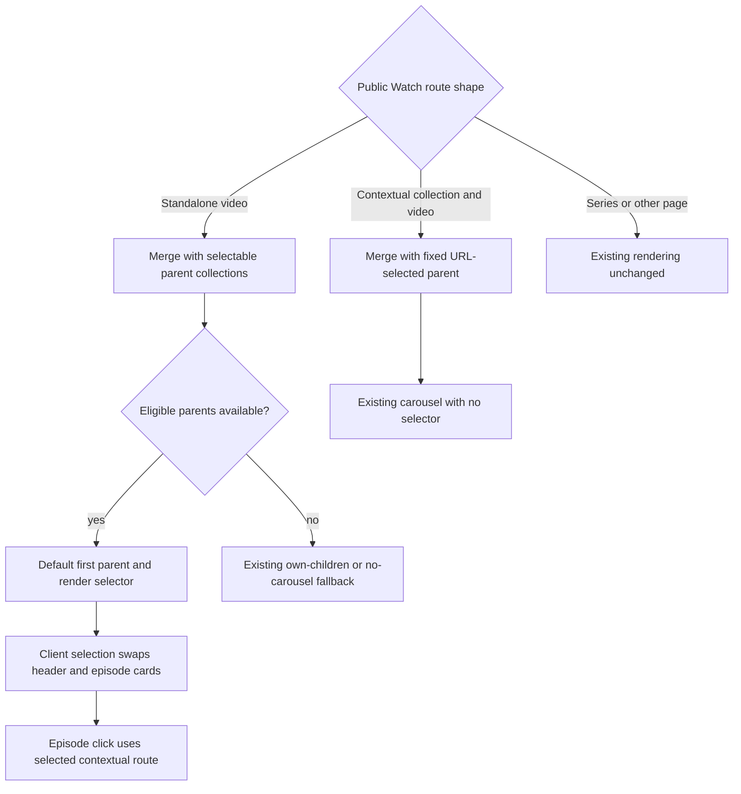

# feat: Add collection episodes to standalone Watch videos

## Summary

Let a standalone playable-video route expose its eligible parent collections in
the existing episodes rail, default to the first eligible collection, and swap the rail
when the viewer selects another collection. Keep contextual collection/video
routes and their current fixed related-episodes carousel unchanged.

---

## Problem Frame

A video can belong to one or more collections, but a viewer who lands on its
canonical standalone URL currently loses that relationship because the
two-segment route deliberately merges the Watch experience with no canonical
parent. The server already resolves every ordered parent and its children, then
prunes that graph before the client boundary. The missing behavior is a compact,
route-specific presentation of those existing relationships.

The public route shape is the behavior switch. A standalone route such as
`/watch/baptism.html/english.html` should offer collections; a contextual route
such as `/watch/jesus.html/baptism/english.html` should continue showing only the
URL-selected JESUS collection with no selector or behavior change.

---

## Requirements

### Route behavior

- R1. Activate the collection selector only in the standalone playable-video branch whose public URL contains no collection slug.
- R2. Do not use the video's own child count as an activation condition for standalone collection selection.
- R3. Preserve the existing fixed parent, carousel, optimistic navigation, metadata, language switching, and related-episode behavior on contextual routes that contain a collection slug.
- R4. Preserve current series, collection, Experience, and language-home route behavior.

### Collection and episode behavior

- R5. A selectable parent must have a valid public slug and at least two current-language children admitted by the Watch route manifest; the current video must be one of those admitted children.
- R6. Preserve Admin parent and child relation order and use the first eligible parent as the initial selection.
- R7. Render the collection control in the episodes rail header and replace the displayed children in place when selection changes without changing the standalone page URL, playback, or metadata.
- R8. Episode cards from the selected collection must link through the existing contextual route builder using that collection slug, child slug, and current audio-language slug.
- R9. When no parent is eligible, preserve the existing own-children carousel or no-carousel fallback.

### Delivery quality

- R10. Keep the resolved parent graph server-owned and pass only the compact selector/carousel model already needed by the client.
- R11. Reuse the existing cached server route manifest for exact contextual-route eligibility without adding an Admin GraphQL operation, browser data request, dependency, or new message-catalog key.
- R12. Prove the standalone selector and unchanged contextual control route with focused tests, browser evidence, and page-loading evidence.
- R13. Let standalone related-item JSON-LD describe the default first eligible collection while preserving existing contextual structured-data output.

---

## Assumptions

- "Single video" means the `routeModel.kind === "video"` standalone branch, not a series/collection record rendered at a two-segment URL.
- The URL shape is authoritative: only `renderVideo` supplies selectable parents, while `renderEpisode` continues supplying one fixed URL-selected parent.
- The existing Watch route manifest is the authority for parent/child/current-language admission. If it is unavailable, the selector fails closed and the page preserves its current own-children or no-carousel fallback.
- A native styled select is sufficient for the collection control and can reuse the existing localized `VideoLabels.collection` string for its accessible label.
- The selector remains visible when exactly one eligible collection exists so the standalone page still exposes collection membership as requested.
- Selection is transient client state. Reloading the standalone URL resets it to the first eligible collection.

---

## Key Technical Decisions

- **Make the server route branch the activation boundary:** only the standalone `renderVideo` call supplies selectable parents, so child counts and nullable parent inference cannot accidentally enable the selector on contextual routes.
- **Filter choices through the cached route manifest:** reuse `getWatchRouteManifest` and `isWatchRouteAdmittedByManifest` to keep only exact parent/child/current-language routes the proxy will admit; fail closed to the existing fallback when no manifest is available.
- **Separate carousel choices from canonical parent context:** selectable parents affect only the sibling-carousel block. They do not become the parent passed to `buildHeroBlock`, preserving standalone autoplay progression, metadata, share identity, and language routing.
- **Extend the existing sibling block additively:** retain `canonicalParent` as the initially displayed/default parent and add compact selectable parents only for standalone blocks. Existing contextual blocks keep their current shape and rendering path.
- **Keep collection switching local to the rail:** the selected parent changes carousel header, count, active index, and contextual card links without a navigation or browser request.
- **Validate optimistic intents against every supplied parent:** `WatchPageClient` must recognize a clicked child from a non-default collection as routable before warming and pushing its contextual URL.
- **Keep structured data deterministic:** standalone JSON-LD describes the default first collection only; client-only selector changes do not mutate server-rendered metadata.

---

## High-Level Technical Design

---

## Scope Boundaries

### In Scope

- Standalone route composition of eligible parent collections.
- Sibling-carousel collection selection and selected-parent episode links.
- Pending-navigation validation for non-default selected collections.
- Focused route, merge, component, navigation, structured-data, browser, and loading verification.

### Out of Scope

- Public route-shape, proxy, route-manifest contract, canonical, share, Open Graph, or language-picker changes.
- Admin schema, GraphQL operation, or relation-order changes.
- Persisting the selected collection in the URL, storage, account, or analytics.
- Redesigning the contextual carousel or adding collection-driven hero autoplay on standalone pages.
- Production deployment outside the normal PR-to-main flow.

---

## Implementation Units

### U1. Build the route-specific standalone collection model

**Goal:** Produce one compact selectable sibling-carousel block only for standalone playable-video routes while preserving all existing fallbacks.

**Requirements:** R1-R6, R9-R11, R13.

**Dependencies:** None.

**Files:**

- `docs/roadmap/platform/feat-287-watch-standalone-collection-episodes.md`
- `apps/web/src/lib/content.ts`
- `apps/web/src/lib/__tests__/content-watch-merge.test.ts`
- `apps/web/src/app/[locale]/[htmlLang]/[...rest]/page.tsx`
- `apps/web/src/app/[locale]/[htmlLang]/[...rest]/__tests__/page-routing.test.tsx`
- `apps/web/src/lib/watch-structured-data.ts`
- `apps/web/src/lib/watch-structured-data.test.ts`

**Approach:** Create the roadmap ticket before implementation. Extend the sibling-carousel model with optional selectable parents while keeping `canonicalParent` as the initial parent. Start the existing cached Watch route-manifest retrieval in parallel with standalone route resolution, then use its public admission helper to filter `video.parents` without reordering: require a valid parent slug, keep only children whose contextual URL is admitted for the current audio-language slug, require the current video among those retained children, and require at least two retained children. Fail closed to the existing own-children or no-carousel fallback when the manifest is unavailable or times out. Give eligible selectable parents precedence over a standalone video's own-child carousel. Keep the contextual call site on its existing fixed-parent path. Keep the hero builder's canonical parent null for standalone pages. Continue deriving related-item JSON-LD from the block's default `canonicalParent`.

**Patterns to follow:** `buildSiblingCarouselBlock`, `mergeWatchExperience`, `renderVideo`, `renderEpisode`, and `watchRelatedItemListStructuredDataJson` in the listed files; contextual URL and canonical identity rules in `docs/plans/2026-06-11-003-fix-watch-contextual-video-canonical-plan.md`.

**Test scenarios:**

1. A standalone video with multiple eligible parents receives them in Admin order and defaults to the first parent.
2. Parents missing a valid slug, missing an admitted current-video child, or exposing fewer than two current-language manifest-admitted children are excluded without reordering the remaining choices.
3. A standalone video with eligible parents uses them even if its own `children` array would otherwise produce a carousel.
4. A standalone video with no eligible parents keeps the existing own-children carousel or no-carousel result.
5. The standalone hero receives no canonical parent and gains no collection-driven next item.
6. A contextual route receives only its resolved URL parent and no selectable-parent payload.
7. An unavailable manifest fails closed to the existing own-children or no-carousel fallback.
8. A cold manifest success, timeout, stale-cache response, and missing-credentials result each stay within the existing 1.5-second manifest bound and produce either admitted choices or the safe fallback.
9. Series, collection, Experience, and language-home route branches remain unchanged.
10. Standalone related-item JSON-LD uses the default first eligible collection and contextual JSON-LD remains unchanged.

**Verification:** The block payload contains only the parent and admitted-child fields required by the carousel, the standalone and contextual route fixtures diverge only in selector capability, and no new GraphQL or browser request is introduced.

### U2. Add collection selection to the episodes rail

**Goal:** Let viewers switch eligible collections in place and navigate episodes through the selected collection context.

**Requirements:** R3, R6-R8, R10-R11.

**Dependencies:** U1.

**Files:**

- `apps/web/src/components/watch/SiblingCarousel.tsx`
- `apps/web/src/components/watch/__tests__/SiblingCarousel.test.tsx`
- `apps/web/src/components/watch/WatchPageClient.tsx`
- `apps/web/src/components/watch/__tests__/WatchPageClient.navigation.test.tsx`

**Approach:** Render a styled native select in the existing carousel header only when the block contains standalone selectable parents; fixed contextual blocks keep the existing linked title header. Reuse the localized collection label for accessibility and parent titles for options. Use a stacked, full-width compact header with a minimum 44-pixel control height, visible focus ring, bounded width, and truncation for long titles; keep the select and count inline on wider screens. On change, replace the displayed parent and children, reset carousel position to the current video's index, and prevent preserved scroll state from the old parent leaking into the new rail. Announce the selected collection title and episode count through a polite atomic live region composed from existing localized strings. Build every child href from the selected parent. Expand pending-intent validation to search all selectable parents and disable the selector with an accessible busy state while an episode navigation is pending, retaining existing modified-click, optimistic visual, route warm, autoplay signal, and router behavior.

**Patterns to follow:** Current header, Embla initialization, session-preserved index, contextual `watchEpisodePath`, and navigation-intent handling in `SiblingCarousel.tsx`; `isPendingChapterStillRoutable` and `handleChapterNavigateIntent` in `WatchPageClient.tsx`.

**Test scenarios:**

1. A selectable block renders all eligible parent titles and initially shows the first parent's ordered children.
2. A one-parent selectable block still renders the collection control.
3. Changing selection swaps the collection title/count/cards and highlights the current video at its index in the new parent.
4. Changing selection resets Embla and ignores preserved scroll state from the prior parent.
5. A child click after selecting a non-default parent emits that parent's contextual href and is accepted by `WatchPageClient` for route warming and navigation.
6. Modified clicks retain native browser behavior and an active card does not trigger duplicate navigation.
7. A fixed contextual block renders no selector and preserves its current linked-title, count, active-card, and href behavior.
8. The selector is disabled and exposes a busy state while an episode navigation is pending, preventing a collection switch from racing the eventual route push.
9. A collection change updates the rail's accessible name and politely announces the selected title and episode count without adding a message key.
10. A deliberately long collection title stays truncated inside a full-width compact control with a visible focus ring and no horizontal overflow.
11. Invalid parent, child, or language slugs remain non-routable without crashing.

**Verification:** Keyboard and pointer selection both update the rail, the standalone page URL and playback remain unchanged until an episode card is chosen, and contextual fixture snapshots/DOM contracts remain stable.

### U3. Prove route parity, visual behavior, and loading posture

**Goal:** Demonstrate the exact standalone feature and neighboring contextual non-regression across test and browser surfaces.

**Requirements:** R3-R4, R8, R12-R13.

**Dependencies:** U1, U2.

**Files:**

- `apps/web/src/app/[locale]/[htmlLang]/[...rest]/__tests__/page-routing.test.tsx`
- `apps/web/src/components/watch/__tests__/SiblingCarousel.test.tsx`
- `apps/web/src/components/watch/__tests__/WatchPageClient.navigation.test.tsx`
- `docs/roadmap/platform/feat-287-watch-standalone-collection-episodes.md`

**Approach:** Complete focused route/component/navigation coverage, then smoke a standalone multi-parent production-shaped route and its contextual neighbor locally. Capture desktop and compact screenshots after switching collections. Compare the standalone route's initial HTML/RSC transfer size and request waterfall before versus after the change; use the contextual neighbor separately as a behavioral non-regression control. Confirm no browser-side data request was added, manifest retrieval overlaps route resolution, the warmed median server response across three runs does not regress by more than 10%, and cold-manifest success/failure remains bounded by the existing 1.5-second timeout rather than adding serial latency. Ensure the hero poster remains the critical media request. Record the proof and performance evidence in the roadmap completion notes.

**Test scenarios:**

1. The standalone StoryClubs video route renders the collection control and default collection episodes.
2. Selecting another collection updates the episode rail without changing the current URL or restarting playback.
3. Choosing an episode navigates to the selected collection's contextual URL.
4. The matching three-segment contextual route renders its existing carousel with no collection selector.
5. The contextual control preserves exact initial route shape, episode click, language change, optimistic navigation, hero next-item progression, standalone canonical/share URL, breadcrumb JSON-LD, and related-item JSON-LD outputs.
6. Wide and compact layouts retain usable selector geometry, in-rail horizontal movement, terminal gutter, active-card visibility, and no document-level horizontal overflow.
7. Series, collection, Experience, and language-home route controls preserve their existing rendering behavior.
8. The initial browser waterfall contains no new selector data request; HTML/RSC growth is attributable to the serialized compact eligible-parent model; the three-run warmed median server response stays within the 10% budget; and cold manifest retrieval/fallback remains within the existing timeout without serializing behind route resolution.

**Verification:** Focused Web tests, typecheck, lint, formatting, exact-route browser screenshots, DOM assertions, request-waterfall inspection, and before/after transfer-size evidence pass before the roadmap ticket is marked complete.

---

## Risks and Mitigations

- **Selector state can drift from parent-owned optimistic state:** validate pending intents across all supplied parents, key/reset carousel-local state on parent changes, and disable switching while route warming is pending.
- **A standalone parent choice could leak into autoplay or canonical identity:** keep selectable carousel parents separate from the canonical parent passed to hero, metadata, share, and language-routing code.
- **More parent graphs can enlarge the RSC payload:** filter on the server, reuse the compact `CarouselParent` shape, avoid duplicating `video.parents`, and measure transfer size.
- **Cold or unavailable manifest data can delay or suppress the selector:** start the bounded cached fetch beside route resolution, fail closed to today's carousel behavior, and verify success, stale, timeout, and missing-credential paths.
- **Relation records can contain malformed or sparse entries:** require exact manifest admission and admitted current-video membership before exposing a choice; preserve the existing safe fallback when none qualify or the manifest is unavailable.
- **Concurrent relation-query performance work may overlap:** keep this change read-only against the existing route snapshot contract and rebase carefully around `feat-213` without declaring an unnecessary dependency.

---

## Sources and Research

- `apps/web/src/app/[locale]/[htmlLang]/[...rest]/page.tsx` — authoritative standalone and contextual route branches plus client pruning.
- `apps/web/src/lib/content.ts` — resolved parent graph, sibling-carousel block, hero progression, and merge ordering.
- `apps/web/src/components/watch/SiblingCarousel.tsx` — rail header, Embla state, contextual links, and optimistic card behavior.
- `apps/web/src/components/watch/WatchPageClient.tsx` — pending-intent validation, route warming, and router handoff.
- `docs/solutions/design-patterns/watch-chapter-optimistic-navigation-feedback.md` — established chapter-navigation feedback contract.
- `docs/plans/2026-06-11-003-fix-watch-contextual-video-canonical-plan.md` — contextual URL preservation and standalone canonical identity.
- `docs/roadmap/platform/feat-213-watch-video-relation-query-passthrough.md` — concurrent performance work on the same route snapshot surface.
