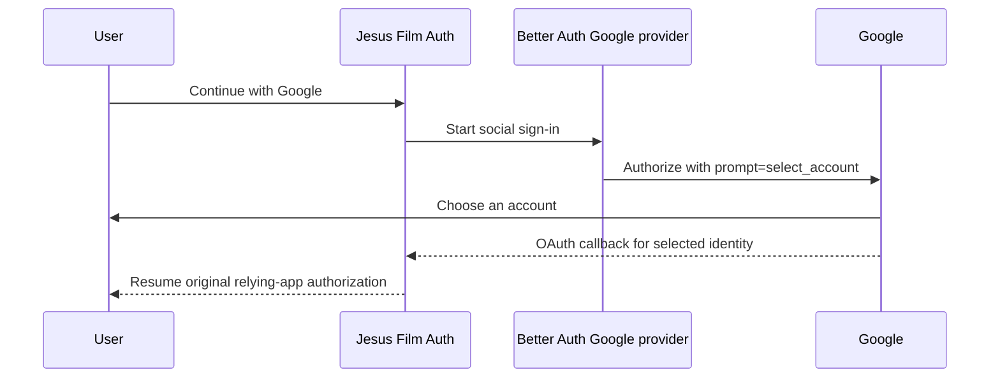

# fix: Always show the Google account chooser

## Goal Capsule

- **Objective:** Let every user explicitly choose the Google identity used for
  shared Jesus Film Auth before consent or sign-in completes.
- **Authority:** The user's approved global chooser behavior overrides the
  current implicit-account convenience; repository auth and security rules
  constrain implementation.
- **Execution profile:** One bounded Auth configuration change, focused
  regression proof, full Auth validation, pre-merge redirect inspection, and a
  post-deploy browser-level OAuth smoke.
- **Stop conditions:** Stop if Better Auth 1.6.2 cannot emit Google's standard
  `prompt=select_account`, or if the change would require domain restriction,
  callback changes, or account migration.

## Product Contract

### Summary

The shared Auth page must show Google's account chooser every time a user clicks
**Continue with Google**, including when the browser has only one active Google
session. This prevents a personal session from being carried directly into a
company-account consent or access-request flow.

### Problem Frame

`apps/auth/src/auth/config.ts` configures Google with only a client ID and
secret, while `apps/auth/src/app/login/login-page-client.tsx` starts social
sign-in without an upstream provider prompt. Google may therefore reuse the
browser's only active session and show consent for that identity. Existing
first-party `prompt=login` / `prompt=select_account` handling controls whether
Jesus Film Auth renders its own login page; it does not add an account chooser
to the upstream Google authorization request.

### Requirements

- R1. Every enabled Google social sign-in sends Google's standard
  `prompt=select_account` authorization parameter.
- R2. A browser with one or multiple active Google sessions receives an
  account-choice step before consent or callback completion.
- R3. The choice applies globally to the shared Auth surface used by all
  relying apps, not only Admin.
- R4. Facebook, Apple, Okta, email/password, callback, first-party OAuth
  continuation, and account-linking semantics remain unchanged. Google
  account-linking authorization may inherit the provider-level chooser UI.
- R5. The change introduces no Workspace-domain restriction, schema change,
  migration, or new environment variable.

### Scope Boundaries

- **In scope:** Google provider configuration, focused regression coverage,
  Auth validation, pre-merge authorization-redirect inspection, and tracked
  post-deploy Auth-to-Admin browser proof.
- **Out of scope:** a separate “Use another account” action, an Admin-only
  prompt path, Workspace-domain enforcement, `login_hint`, or provider UI
  customization.

### Acceptance Examples

- AE1. Given a browser signed into one personal Google account, when the user
  clicks **Continue with Google**, then Google presents account selection and
  the user can continue with a company account.
- AE2. Given multiple active Google sessions, when Google sign-in starts, then
  the chooser appears and either account can be selected.
- AE3. Given a cancelled Google attempt, when the user retries from Auth, then
  the chooser appears again and the original relying-app continuation remains
  intact.

## Planning Contract

### Key Technical Decisions

- KTD1. Always configure Google's chooser globally. (session-settled:
  user-approved — chosen over a separate switch action because the user selected
  the reliable standard flow and accepted one extra chooser step on every Google
  login.)
- KTD2. Use Better Auth's provider-level `prompt: "select_account"` option.
  Google and Better Auth 1.6 document this exact contract, so no URL rewriting,
  custom provider, or callback logic is warranted.
- KTD3. Keep first-party interactive-prompt consumption unchanged. That logic
  prevents repeated Auth login prompts after social sign-in and is a separate
  protocol layer from Google's account chooser.

### High-Level Technical Design

### Assumptions

- The intended policy is account choice, not company-domain enforcement.
- Better Auth remains pinned to 1.6.2 for this change; dependency upgrades are
  separate work.
- A live post-deploy Google browser smoke is the final proof of provider-hosted
  UI; pre-merge tests and redirect inspection protect the repository-owned
  configuration contract.
- Begin that browser smoke without an active Jesus Film Auth session; an
  existing first-party session can bypass Google and conceal the behavior under
  test.

## Implementation Units

### U1. Configure and protect the Google chooser

- **Goal:** Make `prompt=select_account` an invariant of the shared Google
  provider without affecting other authentication methods.
- **Requirements:** R1, R3, R4, R5; KTD1, KTD2, KTD3.
- **Dependencies:** None.
- **Files:** `apps/auth/src/auth/config.ts`,
  `apps/auth/src/auth/config.test.ts`.
- **Approach:** Add the provider-level Google prompt and a focused config test
  that captures the options supplied to Better Auth with Google enabled. Assert
  the Google provider includes `select_account` while unrelated providers do
  not gain the prompt. Do not thread first-party OAuth query parameters into
  the upstream provider request.
- **Patterns to follow:** Environment-gated provider construction in
  `apps/auth/src/auth/config.ts`; module-reset and environment stubbing in
  `apps/auth/src/config/env.test.ts`.
- **Execution note:** Establish the failing configuration assertion before
  adding the prompt.
- **Test scenarios:**
  1. With Google credentials configured, Auth supplies Google client
     credentials plus `prompt: "select_account"` to Better Auth.
  2. Facebook and Apple configuration remains prompt-free.
  3. With Google credentials absent, the Google provider remains disabled.
- **Verification:** The focused test fails without the prompt, passes with it,
  and the Auth test, typecheck, and lint suites remain green.

### U2. Validate the provider-hosted account-choice flow

- **Goal:** Prove before merge that Auth emits the configured prompt, then
  verify after deployment that Google renders it and preserves the relying-app
  round trip.
- **Requirements:** R1, R2, R3, R4; AE1, AE2, AE3.
- **Dependencies:** U1.
- **Files:** `docs/roadmap/platform/feat-286-auth-google-account-chooser.md`,
  `docs/roadmap/platform/feat-287-auth-google-account-chooser-production-verification.md`,
  `docs/roadmap/README.md`.
- **Approach:** Inspect the generated Google authorization redirect for the
  exact prompt before merge. After the normal PR-to-main deployment, browser-
  smoke the shared Auth-to-Admin flow with no active Jesus Film Auth session
  and an already-active Google session. Cancel/retry once to prove the prompt
  is not consumed by an abandoned attempt. Capture only the chooser outcome
  and prompt presence, never full URLs, cookies, tokens, or account details.
  Record the post-deploy verification in the roadmap follow-up.
- **Patterns to follow:** Auth smoke guidance in
  `docs/solutions/auth/admin-sso-uses-oauth-local-session-not-shared-cookies.md`.
- **Test scenarios:**
  1. One active Google account still produces the chooser and permits another
     account.
  2. Multiple active accounts produce the chooser and the selected identity
     completes the callback.
  3. Cancelling and retrying produces the chooser again with the Admin
     continuation preserved.
  4. Non-Google provider buttons and email login remain unchanged.
- **Verification:** Pre-merge evidence proves the outbound URL contains
  `prompt=select_account`. Post-deploy evidence proves the chooser is visible,
  the selected identity returns to Admin, browser console has no new errors,
  and the login page introduces no rendering or loading changes.

## Verification Contract

- U1: focused config regression test, full `@forge/auth` tests, typecheck, and
  lint.
- U2: pre-merge Google authorization URL inspection, plus tracked post-deploy
  browser smoke for chooser, selection, cancel/retry, and Admin continuation.
- Repository: roadmap index regeneration and a final diff review limited to
  Auth configuration, tests, plan, and ticket artifacts.

## Definition of Done

- R1–R5 and AE1–AE3 are satisfied with no launch-blocking open question.
- Google authorization includes `prompt=select_account` on every shared Auth
  sign-in, with regression evidence committed.
- Other providers and first-party OAuth continuation semantics are unchanged.
- Auth validation and pre-merge authorization-redirect inspection pass.
- `feat-286` and the roadmap index are complete; post-deploy browser proof is
  recorded in dependent `feat-287` because it cannot exercise branch code
  before the normal PR-to-main deployment.
