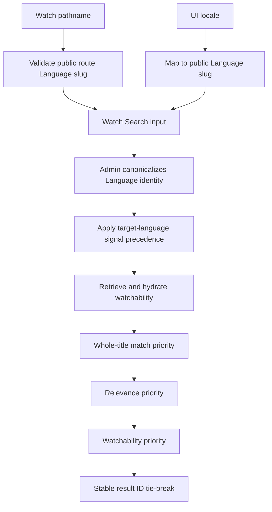

# Watch Search Language and Whole-Title Ranking - Plan

## Goal Capsule

- **Objective:** Make semantically equivalent unlocalized and localized Watch searches resolve the same canonical target Language, and rank a canonical whole-title match ahead of broader title matches.
- **Product authority:** The user-selected normalization and explicit-priority approach, followed by the Language and Search Language definitions in `CONCEPTS.md` and the exact-match requirements in `docs/brainstorms/2026-07-14-universal-multilingual-watch-search-requirements.md`.
- **Execution profile:** Standard cross-layer fix spanning the Watch web request boundary and Admin language resolution and ranking, with regression-first coverage.
- **Stop conditions:** Stop if implementation requires choosing arbitrarily between multiple Languages sharing one BCP-47 tag, changing the public GraphQL schema, or weakening the selected whole-title-first policy.
- **Tail ownership:** Complete focused Web and Admin tests and typechecks, then review the final diff for request-contract and ranking regressions.

---

## Product Contract

### Summary

Normalize language identity before Watch search uses it and rank results through explicit relevance priorities so route context, score saturation, and internal database IDs cannot bury a canonical title match.

### Problem Frame

Watch currently represents English as both the UI locale `en` and the canonical Language slug `english`. A missing route language is replaced with the UI locale before the request reaches Admin, while localized routes carry the canonical slug. Admin then treats whichever string arrived as the target Language identity, even though watchability resolves Languages by exact slug.

The ranker separately collapses a whole-title match and broader target-audio title matches to the same capped score. Once scores tie, it orders results by internal ID. The `JESUS` film is therefore always retrieved but can move from first place to position 21 depending on which English identifier the current route supplied.

### Requirements

**Language identity**

- R1. Web must keep the actual UI locale separate from the selected search Language and send canonical public Language slugs for display and target-language identity signals instead of substituting BCP-47 UI locale codes.
- R2. Web must preserve an absent route language as absent and must reject parsed route segments that are not valid public Watch Language slugs.
- R3. Admin must canonicalize unambiguous BCP-47 language inputs to Language slugs before applying target-language signal precedence, using case-insensitive exact-tag matching followed by progressively less-specific BCP-47 fallback only when each match is unique.
- R4. Admin must preserve the source and precedence of each valid language signal after canonicalization.
- R5. Unknown or ambiguous locale-like values must not be promoted to an arbitrary Language identity.

**Ranking**

- R6. A result whose complete normalized title matches the complete normalized query must rank before results that only contain the query.
- R7. After whole-title priority, results must sort by relevance, then watchability, then stable internal result ID.
- R8. The ranking behavior must apply generically to all queries and content; it must not pin the `JESUS` film or special-case the word `Jesus`.

**Compatibility and proof**

- R9. Existing Watch Search GraphQL input and response fields, capped public score values, result evidence, and pagination shape must remain compatible.
- R10. Focused regression tests must prove equivalent `en` and `english` requests through target resolution, watchability hydration, and ordered result IDs; absent and localized route behavior; ambiguous language handling; saturated whole-title ties; representative non-whole-title ordering; and deterministic final tie-breaking.

### Acceptance Examples

- AE1. Given Watch search opens from an unlocalized route with UI locale `en`, when the query is submitted, then Web sends canonical display language `english`, leaves route language absent, and Admin resolves English watchability.
- AE2. Given Watch search opens from an English-localized route, when the same query is submitted, then Admin resolves the same canonical target Language and returns the same ranking as the unlocalized route.
- AE3. Given `JESUS` and broader exact-title candidates all have capped score `1.0`, when ranking runs, then `JESUS` ranks first because it is the whole-title match even if its internal ID sorts later.
- AE4. Given no result is a whole-title match, when candidates differ in relevance and watchability, then relevance wins first, watchability breaks the next tie, and internal ID resolves only a complete semantic tie.
- AE5. Given a locale-like input maps to multiple or no canonical Languages, when Admin resolves language signals, then it does not select one arbitrary Language and instead falls through to the next valid signal or the existing English fallback.
- AE6. Given the UI locale is English and the user explicitly searches in Spanish, when the query is submitted, then display language remains canonical English, target language remains canonical Spanish, and a missing route language remains absent.

### Scope Boundaries

**In scope**

- Watch web route validation and canonical request-language construction.
- Admin request-side language canonicalization before signal precedence.
- Admin whole-title, relevance, watchability, and ID ranking order.
- Focused Web and Admin regression tests.

**Out of scope**

- Query-specific merchandising or content-ID pinning.
- Learned-to-rank, popularity, or click-derived ranking signals.
- New GraphQL fields, database migrations, or generated GraphQL output changes.
- Search result card redesign, analytics schema changes, or broad retriever-weight tuning.
- Uncapping the public result score or recalibrating every retrieval lane.

---

## Planning Contract

### Key Technical Decisions

- KTD1. **Canonical Language slug at both boundaries.** Web emits public Language slugs and Admin independently canonicalizes locale-like inputs before precedence selection. (session-settled: user-directed — chosen over allowing UI locale codes to stand in for language identity: route-dependent requests made identical searches behave differently)
- KTD2. **Explicit ranking tuple.** Candidate ordering compares whole-title match, relevance, watchability, and result ID in that order rather than relying on the capped combined score. (session-settled: user-directed — chosen over uncapping the combined score alone: explicit title intent must survive future weight changes)
- KTD3. **Generic relevance policy.** The whole-title rule uses normalized query and candidate titles and contains no query or content-ID exceptions. (session-settled: user-directed — chosen over pinning the `JESUS` film: the correction must apply to every canonical catalog title)
- KTD4. **Admin owns defensive normalization.** Admin resolves database Language identity from its own Language data rather than importing Web locale helpers across application boundaries.
- KTD5. **Compatibility over score redesign.** Keep the existing score breakdown and capped response score for consumers and traces; change the ordering comparator only.

### Assumptions

- Exact canonical slug matches take precedence over BCP-47 matches during Admin normalization.
- BCP-47 matching is case-insensitive and tries the complete tag first, then progressively truncates subtags toward the primary language; every fallback level is accepted only when it identifies exactly one canonical Language slug.
- A BCP-47 value is canonicalized only when it identifies one canonical Language slug; collision cases at any fallback level fall through instead of selecting by database order.
- Existing public-language mappings in Web remain the authority for converting a UI locale to the default public Watch Language slug.
- No external client depends on a missing route language being synthesized from the UI locale; Admin's display and fallback signals already cover that default.

### High-Level Technical Design

Web prevents known bad identifiers from leaving the caller, while Admin remains the authoritative safety boundary for Web and any other GraphQL client. Ranking consumes the existing relevance and watchability components but compares them as separate ordered dimensions so score saturation cannot erase title intent.

### Sequencing

Implement language normalization before ranking so the ranking tests exercise real canonical watchability classes. The implementation units have no hard code dependency and may be developed independently, but the final cross-layer verification must exercise canonical language resolution and ranking together.

---

## Implementation Units

### U1. Canonicalize the Watch web request boundary

- **Goal:** Ensure every Watch route sends valid canonical Language identity without turning a missing route into a locale code.
- **Requirements:** R1, R2, R4, R9, R10; KTD1, KTD4.
- **Dependencies:** None.
- **Files:** `apps/web/src/lib/search.ts`, `apps/web/src/lib/search.test.ts`, `apps/web/src/lib/search-actions.ts`, `apps/web/src/lib/search-actions.test.ts`, `apps/web/src/components/FloatingSearchController.tsx`, `apps/web/src/components/__tests__/FloatingSearchProvider.test.tsx`.
- **Approach:** Read the actual Next Intl UI locale at the Watch caller boundary and carry it separately from the selected search Language. Convert only that UI locale to its canonical public Language slug for display language, preserve an explicitly absent route language, and validate parsed route segments against the public Watch Language inventory before treating them as language identity. Keep explicit user-selected Language slugs unchanged.
- **Execution note:** Start with request-contract regressions for the unlocalized and localized route cases before changing the request construction.
- **Patterns to follow:** `publicWatchAudioLanguageSlugForLocale`, `isPublicWatchLanguageSlug`, and `resolveSearchLanguage` already separate locale negotiation from public Language identity.
- **Test scenarios:**
  1. Default locale `en` produces `displayLanguageSlug: "english"` and no synthesized route Language.
  2. Locale `es` produces the established canonical Spanish public slug while route language remains absent.
  3. Canonical route `english` is preserved as both route context and the resolved display default.
  4. An invalid one-segment route candidate is not forwarded as a route Language slug.
  5. An explicitly selected search Language remains the target and is not replaced by route or locale defaults.
  6. A caller that passes `routeLanguageSlug: null` retains null semantics rather than falling back through nullish coalescing.
  7. English UI plus an explicitly selected Spanish search Language sends canonical English display identity and canonical Spanish target identity.
  8. Invalid route candidates across localized home, video, episode, languages, history, and language-video route shapes are never forwarded as Language identity.
- **Verification:** Focused Web request and provider tests show equivalent canonical inputs from unlocalized and localized English routes without changing result mapping or pagination.

### U2. Canonicalize Admin search language signals

- **Goal:** Make Admin resolve valid Language identity before target-language precedence and watchability hydration.
- **Requirements:** R3, R4, R5, R9, R10; KTD1, KTD4.
- **Dependencies:** None.
- **Files:** `apps/admin/src/services/search-language-resolution.ts`, `apps/admin/src/services/search-language-resolution.test.ts`.
- **Approach:** Add an Admin-owned, database-backed normalization step for supplied language-identity signals. Preserve case-insensitive exact canonical slug matches; try a case-insensitive complete BCP-47 tag, then progressively less-specific subtags; accept each level only when it uniquely identifies one slug; ignore unknown or ambiguous locale-like identities; and then apply the existing explicit/query/current/route/display/accept/fallback precedence with original source attribution.
- **Execution note:** Add characterization cases for current precedence first, then add locale normalization and collision tests so defensive behavior is explicit.
- **Patterns to follow:** The existing `Accept-Language` lookup and query-named Language resolution already query Admin Language data without crossing application boundaries.
- **Test scenarios:**
  1. Target, route, or display inputs such as `en` and `en-US` resolve to canonical `english` while retaining the winning signal's source.
  2. Canonical input `english` remains unchanged.
  3. Explicit canonical target still wins over query-named, current-watch, route, display, and header signals.
  4. A uniquely matching regional BCP-47 tag resolves to its canonical slug.
  5. Multiple Languages sharing one BCP-47 value do not resolve by row order and fall through to the next valid signal.
  6. An unknown locale-like value falls through to the next valid signal or existing English fallback.
  7. Query-language and query-named-language fields retain canonical values used by semantic retrieval and interpretation output.
  8. Mixed-case tags and `en-US` resolve through the defined exact-then-less-specific fallback without bypassing collision safety.
- **Verification:** Focused resolver tests prove canonicalization, collision safety, and unchanged signal precedence without an SDL or codegen diff.

### U3. Rank by explicit relevance priorities

- **Goal:** Make whole-title intent and meaningful ranking dimensions decide order before the internal ID fallback.
- **Requirements:** R6, R7, R8, R9, R10; KTD2, KTD3, KTD5.
- **Dependencies:** None.
- **Files:** `apps/admin/src/services/watch-search.service.ts`, `apps/admin/src/services/watch-search.service.test.ts`.
- **Approach:** Replace the final capped-total-only comparison with an explicit comparator over normalized whole-title match, relevance score, watchability rank, and result ID. Continue returning the existing capped total and score breakdown so clients and traces remain compatible.
- **Execution note:** Begin with a failing saturated-score regression whose IDs are intentionally ordered against the desired result.
- **Patterns to follow:** Reuse `isWholeTitleMatch`, `scoreBreakdown.relevance`, and `watchabilityRank`; keep `resultId.localeCompare` only as the final deterministic tie-break.
- **Test scenarios:**
  1. A whole-title exact candidate ranks above a broader exact-title target-audio candidate when both totals are `1.0` and ID order favors the broader result.
  2. Whole-title matching remains case- and whitespace-normalized through the existing normalizer.
  3. Among candidates with the same whole-title class, higher relevance ranks before better watchability.
  4. Equal relevance candidates order target audio, target subtitle, related language, and unavailable by existing watchability rank.
  5. Candidates tied across whole-title, relevance, and watchability use result ID for stable pagination.
  6. Paginating a saturated whole-title result set keeps the canonical whole-title result on page one and produces no duplicates across adjacent pages.
  7. Existing evidence, score breakdown, action, and pagination assertions remain unchanged.
  8. Paired service requests using `en` and `english` resolve the same canonical target, hydrate the same watchability classes, and return the same ordered result IDs.
  9. A representative fixture matrix covering whole-title, broader metadata, and semantic candidates demonstrates the intended relevance-first ordering for non-whole-title results.
- **Verification:** Focused Watch search service tests prove each comparator dimension independently and reproduce the former `JESUS` saturation case without query-specific fixtures.

---

## Verification Contract

| Gate              | Applies to | Command                                                                                                                                                   | Done signal                                                                        |
| ----------------- | ---------- | --------------------------------------------------------------------------------------------------------------------------------------------------------- | ---------------------------------------------------------------------------------- |
| Web regressions   | U1         | `pnpm --filter @forge/web exec vitest run src/lib/search.test.ts src/lib/search-actions.test.ts src/components/__tests__/FloatingSearchProvider.test.tsx` | Canonical locale, null-route, route-validation, and explicit-selection cases pass. |
| Admin regressions | U2, U3     | `pnpm --filter @forge/admin exec vitest run src/services/search-language-resolution.test.ts src/services/watch-search.service.test.ts`                    | Language collision and ranking-priority cases pass with the existing suite.        |
| Admin types       | U2, U3     | `pnpm --filter @forge/admin typecheck`                                                                                                                    | No service, Prisma, or GraphQL type regressions.                                   |
| Web types         | U1         | `pnpm --filter @forge/web typecheck`                                                                                                                      | Search request and route-narrowing changes compile.                                |
| Diff audit        | All        | `git diff --check`                                                                                                                                        | No whitespace errors or generated GraphQL/schema changes.                          |

No GraphQL generation gate applies unless implementation changes the schema, which is outside this plan and triggers the Goal Capsule stop condition.

---

## Definition of Done

- Unlocalized and localized Watch routes send semantically equivalent canonical English search context.
- Admin converts unambiguous locale-like language signals to canonical Language slugs before precedence and never chooses arbitrarily across a BCP-47 collision.
- Whole-title matches rank before broader title matches even when capped totals are equal and internal IDs favor the broader result.
- Relevance, watchability, and internal ID are each tested in their selected priority order.
- Existing GraphQL shape, capped response score, evidence, actions, and pagination shape remain compatible; non-whole-title candidates follow the specified relevance, watchability, and result-ID ordering.
- Focused Web and Admin tests, both application typechecks, and diff checks pass.
- The final diff contains no query-specific pin, abandoned experimental code, unrelated refactor, schema output, or generated-file churn.

---

## Appendix

### Sources and Research

- `CONCEPTS.md` defines Language slug as identity and BCP-47 as non-unique locale matching data.
- `docs/brainstorms/2026-07-14-universal-multilingual-watch-search-requirements.md` requires strong canonical catalog matches to outrank semantic similarity and separates route/display language from target watch language.
- `docs/brainstorms/2026-06-21-watch-search-readiness-eval-suite-requirements.md` names `Jesus` with the `JESUS` film near the top as a keyword-first acceptance example.
- `apps/web/src/lib/search.ts` and `apps/web/src/lib/search-actions.ts` own the current Watch GraphQL request construction.
- `apps/admin/src/services/search-language-resolution.ts` and `apps/admin/src/services/search-watchability.ts` own target-language interpretation and exact-slug watchability.
- `apps/admin/src/services/watch-search.service.ts` owns the capped score and final candidate comparator.
- `docs/solutions/logic-errors/language-identity-on-slug-not-bcp47-20260605.md` records the durable identity-versus-locale rule.
