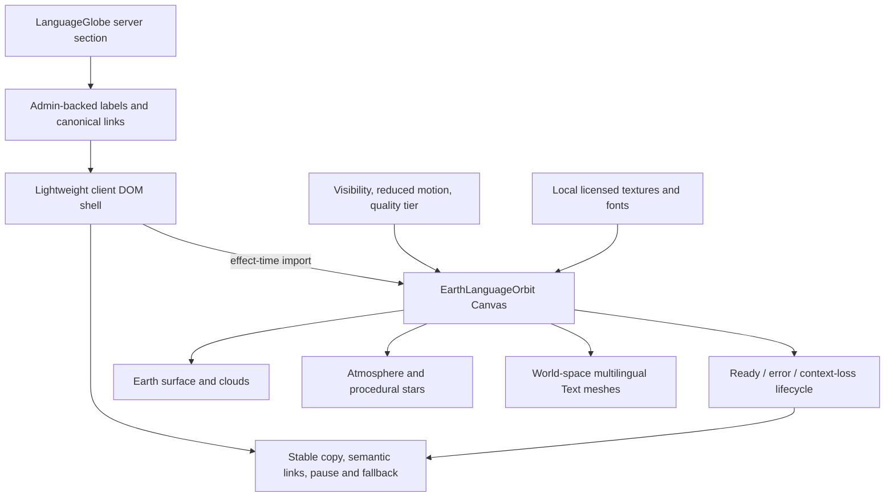

# 3D Earth Language Orbit

## Goal Capsule

- **Objective:** Replace the current flat language-globe presentation with a responsive, cinematic Three.js scene: a textured Earth, independent cloud shell, atmospheric rim, procedural stars, and a continuous multilingual 3D text orbit that passes in front of and behind the planet through real depth testing.
- **Authority:** The user-provided PRD and visual reference define the replacement design. The existing `languageGlobe` Admin block, Admin-backed language catalog, canonical Watch routes, and Forge loading/accessibility conventions remain authoritative integration constraints.
- **Execution profile:** Deep client-rendering replacement with new runtime dependencies, licensed local assets, WebGL lifecycle handling, multilingual shaping, performance budgets, and desktop/mobile browser proof.
- **Stop conditions:** Stop if the selected font does not render connected Arabic correctly, if the renderer cannot remain behind the existing effect-time loading boundary, if the no-WebGL fallback loses semantic language navigation, or if the production build cannot produce measurable bundle/resource evidence.
- **Tail ownership:** `ce-work` owns implementation, dependency and asset provenance, verification, roadmap status, browser evidence, and removal of the superseded raw-WebGL presentation. Production deployment remains outside scope.

---

## Product Contract

### Problem Frame

The existing block is a simulated sphere rendered by a raw WebGL fragment shader with DOM cards and geographic circles. It cannot reproduce the requested composition: there is no true scene geometry, separate cloud layer, atmospheric shell, star field, or depth-buffer occlusion for orbiting text. The replacement must look cinematic while remaining a reusable, SSR-safe Watch component rather than a pre-rendered video or image.

### Requirements

#### Visual composition

- **R1 (VIS-01, AC-01):** Render one real textured Earth sphere in deep space, initially framed on Europe, Africa, and the Middle East.
- **R2 (VIS-02, LGT-01-LGT-03):** Use color-managed local textures and physically plausible day-side shading, restrained ocean response, a stable directional key light, and low cool fill.
- **R3 (VIS-03, AC-02):** Render a distinct, transparent cloud shell above the surface and rotate it at a different delta-time-based speed.
- **R4 (VIS-04, AC-03):** Render a restrained blue limb atmosphere using a Fresnel-style shell or equivalent shader.
- **R5 (VIS-05, AC-04):** Render a deterministic procedural star field behind the globe with varied brightness and reduced-motion-aware twinkle.
- **R6 (VIS-06, TXT-03-TXT-05, AC-05-AC-06):** Render only glyphs and separators along an elliptical 3D orbit—no backing ribbon, rail, line, or panel—whose minimum radius clears the atmosphere and cloud shells, and use the same depth buffer as Earth so rear text is naturally occluded.

#### Language and typography

- **R7 (TXT-01):** Accept a typed language array and derive the experience-block sequence from the existing Admin-backed language selection; do not create a second product language catalog.
- **R8 (TXT-02, TXT-06, AC-07):** Self-host explicitly licensed fonts and validate accented Latin, `TÜRKÇE`, and correctly connected/right-to-left `العربية` before the scene is accepted.
- **R9 (TXT-04, LGT-03):** Apply a blue-to-teal-to-gold progression with controlled emissive intensity and no solid text backing.
- **R10:** Keep the 3D orbit presentation-only. Preserve one stable semantic DOM link per selected language using the native label, English label, and existing canonical Watch public slug.

#### Motion and lifecycle

- **R11 (MOT-01, AC-08):** Drive Earth, clouds, text orbit, and star twinkle from clamped frame delta, using independent named periods.
- **R12 (MOT-02-MOT-04):** Keep front-facing words upright and unmirrored while preserving real 3D placement and occlusion; optional pointer parallax must be subtle, eased, and disabled for coarse pointers.
- **R13 (MOT-05, PERF-02):** Pause the frame loop offscreen and when the document is hidden, resume without a time jump, mutate Three objects rather than React state per frame, and avoid recurring per-frame allocation.
- **R14 (MOT-06, AC-10):** Honor reduced motion by producing a calm static composition, stopping star twinkle, and keeping semantic links and pause state accurate.
- **R15:** Preserve a keyboard-accessible pause/resume control with visible focus and accurate accessible state.

#### React, fallback, and responsive behavior

- **R16 (ENG-01-ENG-04, AC-09):** Expose a typed `EarthLanguageOrbit` API, keep all browser/Three APIs below a client boundary, reserve stable layout dimensions, use renderer-driven sizing, and clean up observers/listeners/resources on unmount.
- **R17 (ENG-05):** Store texture/font sources, licenses, dimensions, transformations, and compressed weights beside the local assets.
- **R18 (ENG-06, AC-11):** Keep an accessible static DOM fallback outside Canvas for JavaScript, font, texture, context-creation, and context-loss failures without breaking the surrounding experience page.
- **R19 (PERF-01-PERF-03):** Lazy-load the 3D engine behind the existing effect-time boundary, cap desktop DPR at 1.75 and mobile at 1.5, reduce segments/star count before visual identity, and record bundle, asset, resource-timing, and observed frame-rate impact.
- **R20 (AC-12):** Keep the current experience-backed local demo working and capture desktop/mobile screenshots plus timed motion evidence showing independent Earth, cloud, and text movement.

### Non-Goals

- Globe navigation, geographic marker interaction, arbitrary 3D scene authoring, or scientifically exact simulation.
- A pre-rendered video/GIF as the primary experience.
- Heavy post-processing, lens effects, or mandatory 4K/8K textures.
- Changes to the persisted Admin block shape, GraphQL schema, experience editor, or language routing unless implementation discovers a contract blocker.
- Production deployment outside the normal PR-to-main flow.

### Acceptance Trace

| PRD acceptance      | Plan requirements | Primary unit   |
| ------------------- | ----------------- | -------------- |
| AC-01 through AC-06 | R1-R6             | U3             |
| AC-07               | R7-R10            | U2, U3, U4     |
| AC-08               | R11-R13           | U3             |
| AC-09               | R16-R18           | U3, U4         |
| AC-10               | R14-R15           | U2, U4         |
| AC-11               | R18-R19           | U2, U3, U4, U5 |
| AC-12               | R20               | U5             |

---

## Key Technical Decisions

### KTD1. Supersede the raw-WebGL size decision with measured R3F adoption

The visual contract requires real scene geometry and 3D text. Adopt current React-19-compatible `three`, `@react-three/fiber`, `@react-three/drei`, and direct `troika-three-text` only where font preloading/configuration needs it. This explicitly supersedes the earlier ≤15 KB-gzip raw-WebGL engine decision in `docs/plans/2026-07-21-001-feat-language-globe-experience-block-plan.md`; the replacement is accepted only with production-build chunk and route-entry measurements.

### KTD2. Preserve the proven effect-time engine boundary

`LanguageGlobe.tsx` remains the server/data boundary and `LanguageGlobeClient.tsx` remains a lightweight DOM shell. The shell imports the Canvas component only after mount and only when usable language data exists. Neither the section registry nor the shell may statically import Three/R3F/Troika. Production manifest/resource evidence must prove routes without the block do not load engine or texture assets.

### KTD3. Use ordinary depth testing for text occlusion

Each word is a world-space Troika/Drei text mesh positioned and tangent-oriented along one elliptical orbit. Earth stays opaque with depth writing enabled; text uses normal depth testing. Do not use DOM `<Html>`, flat marquees, manual rear-label opacity, disabled depth tests, or always-on-top render-order tricks.

### KTD4. Use local NASA imagery and local Noto fonts with provenance

Use NASA Scientific Visualization Studio Blue Marble/cloud source imagery transformed into bounded 2K runtime assets, and SIL Open Font License Noto condensed/Arabic fonts in Troika-supported `.ttf`, `.otf`, or `.woff` form. Procedural stars and shader atmosphere require no external images. Record source URLs, credit text, license terms, original/runtime dimensions, transformations, and byte sizes.

### KTD5. Keep accessibility and navigation in the DOM

Canvas is decorative. Heading, description, pause control, status/fallback text, and canonical language links remain outside it. The semantic links are stable and never rotate, remount per frame, or depend on GPU readiness; visual orbit words are hidden from assistive technology.

### KTD6. Use deterministic quality tiers plus observed fallback

Choose initial geometry, star count, DPR, cloud/shader features from container width, coarse-pointer/media signals, and an explicit `quality` override—not user agent. Allow a measured low-quality fallback when frame performance degrades. Reduced motion selects a static/demand-rendered composition rather than a slower perpetual loop.

---

## High-Level Technical Design



The scene owns continuous GPU mutation. React owns only coarse lifecycle state: engine loading, ready/error, pause, reduced motion, visibility, and quality tier changes. No frame callback updates React state.

---

## Output Structure

```text
apps/web/src/components/sections/
├── EarthLanguageOrbit.tsx
├── EarthLanguageOrbit.test.tsx
├── EarthLanguageOrbitCanvas.tsx
├── EarthLanguageOrbitScene.tsx
├── LanguageGlobeClient.tsx
├── language-orbit-layout.ts
├── language-orbit-layout.test.ts
├── language-orbit-quality.ts
└── language-orbit-quality.test.ts

apps/web/public/
├── fonts/
│   ├── NotoSansCondensed-Bold.ttf
│   └── NotoSansArabic-Bold.ttf
└── images/experiences/language-orbit/
    ├── ATTRIBUTION.md
    ├── earth-day.webp
    ├── earth-bump.webp
    ├── earth-clouds.webp
    └── earth-fallback.webp
```

The exact split may contract if implementation proves a smaller coherent module boundary, but the effect-time Canvas boundary and asset provenance file are invariant.

---

## Implementation Units

### U1. Establish the replacement contract, dependencies, and licensed assets

- **Goal:** Create a durable implementation home for the new design, introduce only the required rendering dependencies, and make every local asset auditable.
- **Requirements:** R2, R8, R16-R19.
- **Dependencies:** None.
- **Files:** Create the next sequential ticket under `docs/roadmap/topic-experiences/`; modify `apps/web/package.json` and `pnpm-lock.yaml`; create files under `apps/web/public/images/experiences/language-orbit/` and add the required local font files under `apps/web/public/fonts/`.
- **Approach:** Mark the new roadmap ticket in progress. Pin compatible current releases discovered during planning (`three` 0.185.x, Fiber 9.6.x, Drei 10.7.x, Troika 0.52.x). Download authoritative source assets, generate compressed 2K derivatives, and record source/license/transformation/weight metadata. Validate font glyph coverage and connected Arabic before scene work proceeds.
- **Execution note:** Treat Arabic shaping and asset provenance as hard gates. Do not continue to the polished scene with placeholder fonts or untraceable textures.
- **Patterns to follow:** `apps/web/public/images/flags/LICENSE.md`, repository pnpm conventions, and `docs/solutions/architecture-patterns/defer-browser-engines-beyond-experience-renderer-boundaries.md`.
- **Test scenarios:**
  1. Dependency resolution uses React-19-compatible Fiber/Drei peers without duplicate Three versions.
  2. Asset audit reports every texture/font source, license, original dimensions, runtime dimensions, and compressed bytes.
  3. The selected font files contain the exact Latin, accented, Turkish, separator, and Arabic characters required by the deterministic demo sequence.
  4. The production asset paths include `/watch` base-path handling and return successful responses locally.
- **Verification:** `pnpm install --lockfile-only`/workspace install is clean; dependency tree contains one Three version; asset audit and local HTTP checks pass.

### U2. Define the typed public API, orbit layout, and quality policy

- **Goal:** Make scene inputs, orbit placement, motion constants, text direction, and responsive quality deterministic and unit-testable without WebGL.
- **Requirements:** R6-R9, R11-R14, R16, R19.
- **Dependencies:** U1.
- **Files:** Create `apps/web/src/components/sections/EarthLanguageOrbit.tsx`, `apps/web/src/components/sections/EarthLanguageOrbit.test.tsx`, `apps/web/src/components/sections/language-orbit-layout.ts`, `apps/web/src/components/sections/language-orbit-layout.test.ts`, `apps/web/src/components/sections/language-orbit-quality.ts`, and `apps/web/src/components/sections/language-orbit-quality.test.ts`; modify `apps/web/src/components/sections/language-globe-model.ts` and its test only if direction/locale metadata must be retained.
- **Approach:** Implement the PRD public props with stable defaults. Convert language items into word/separator placements on a single ellipse, carrying direction and color without per-frame allocation. Define low/high/auto tier constants for DPR, sphere segments, cloud/star features, and label caps. Expose pure helpers used by both tests and the Canvas scene.
- **Execution note:** Write public-default, layout, direction, and quality-tier tests before connecting R3F.
- **Patterns to follow:** Existing serializable section-prop boundaries and pure projection/model tests beside `language-globe-model.ts`.
- **Test scenarios:**
  1. Default props reproduce the PRD rotation periods, initial longitude, enabled layers, and automatic quality behavior.
  2. Empty and one-language arrays produce bounded valid layouts without division-by-zero or duplicate separators.
  3. The default sequence yields one continuous evenly spaced orbit whose minimum radius clears the cloud and atmosphere shells, with deterministic colors, upright tangent metadata, and no mirrored front-facing word transform.
  4. Arabic receives RTL/auto direction and the Arabic font; accented Latin and Turkish use the condensed Latin font.
  5. Auto quality selects low geometry/DPR/star counts for mobile/coarse containers and high within desktop caps; explicit `low`/`high` overrides are deterministic.
  6. Reduced motion freezes all continuous periods and disables twinkle without removing the scene.
- **Verification:** Focused pure/component tests pass in Node/jsdom without importing the browser engine.

### U3. Build the R3F Earth, atmosphere, stars, and 3D text orbit

- **Goal:** Implement the cinematic scene and true depth-occluded multilingual orbit.
- **Requirements:** R1-R9, R11-R14, R18-R19.
- **Dependencies:** U1, U2.
- **Files:** Create `apps/web/src/components/sections/EarthLanguageOrbitCanvas.tsx` and `apps/web/src/components/sections/EarthLanguageOrbitScene.tsx`; add focused tests or test-only exports only where pure scene configuration can be asserted without mocking WebGL.
- **Approach:** Use one R3F Canvas with an opaque sphere, separately rotating transparent cloud sphere, back-side Fresnel atmosphere shell, deterministic point/sprite stars, stable directional/ambient lighting, and word-level Drei `<Text>` meshes. Use local fonts, preloaded characters, `depthTest`, delta-clamped `useFrame`, ref mutation, and a shared orbit group. Use `frameloop="always"` only while visible/motion-enabled and `never` or `demand` for hidden/reduced-motion states.
- **Execution note:** Land the minimal Earth + one front/rear text proof first and verify depth occlusion in a real browser before adding clouds, atmosphere, and stars.
- **Patterns to follow:** R3F v9 Canvas/useFrame guidance, Drei Text/Troika lifecycle guidance, Three color-management/disposal guidance, and current globe visibility/context-loss cleanup semantics.
- **Test scenarios:**
  1. Scene configuration keeps Earth opaque/depth-writing and text depth-tested with no ribbon geometry.
  2. Earth, clouds, and orbit periods are distinct and consume clamped delta.
  3. Reduced motion produces a static frame and disables star twinkle.
  4. Low quality reduces segments/star count/DPR and omits optional expensive effects while retaining Earth, atmosphere, clouds, and text identity.
  5. Unmount/context remount disposes manual resources and does not accumulate observers, listeners, canvases, materials, or Troika text objects.
  6. Font/texture rejection reaches the outer fallback rather than leaving an untextured sphere or blank canvas.
- **Verification:** Focused configuration tests pass; real-browser proof shows opaque Earth occluding rear words and separate Earth/cloud/text movement.

### U4. Integrate the scene with the Watch block, semantic navigation, and fallback

- **Goal:** Replace the current cards/circles UI without regressing the existing section contract, accessibility, or failure containment.
- **Requirements:** R7, R10, R13-R18.
- **Dependencies:** U2, U3.
- **Files:** Modify `apps/web/src/components/sections/LanguageGlobeClient.tsx`, `apps/web/src/components/sections/LanguageGlobeClient.test.tsx`, `apps/web/src/components/sections/LanguageGlobe.tsx`, and `apps/web/src/components/sections/LanguageGlobe.test.tsx`.
- **Approach:** Keep server-rendered authored copy and Admin-backed canonical links. Replace marker/card rendering with a stable scene-sized fallback and effect-time Canvas import. Treat Canvas as decorative, surface loading/ready/failure states in DOM, retain pause/resume, and use stable semantic links outside the orbit without recreating the removed large card grid. The fallback remains usable when metadata, JavaScript, WebGL, texture, font, or context loading fails.
- **Execution note:** Preserve current metadata-failure and canonical-link tests, then replace obsolete fixed-slot assertions with engine-boundary, stable-link, loading, ready, reduced-motion, and fallback assertions.
- **Patterns to follow:** Current `LanguageGlobe` server error boundary, public language route construction, shared `Switch`/button focus styles, and the proven deferred-browser-engine solution.
- **Test scenarios:**
  1. Native-first and English labels retain their canonical public-slug links independent of Canvas readiness.
  2. The DOM shell does not statically import or render the R3F engine during SSR/initial fallback.
  3. The scene-ready signal, emitted only after essential textures and fonts load, fades Canvas in over the reserved fallback without layout shift.
  4. Engine import, texture, font, context, and metadata failures each leave authored copy, concise status text, and semantic links usable.
  5. Pause/resume state is keyboard-accessible and the scene lifecycle receives the matching animation state.
  6. Reduced-motion startup renders the static composition and accurate control label.
  7. Rapid mount/unmount and repeated context recovery do not update disposed React state or leave duplicate canvases.
- **Verification:** Focused Web component/server tests pass, SSR output contains authored content/fallback, and no engine code executes in jsdom tests.

### U5. Prove responsive visuals, motion, loading posture, and performance

- **Goal:** Produce the browser and production-build evidence required for acceptance.
- **Requirements:** R1-R20.
- **Dependencies:** U1-U4.
- **Files:** Modify the existing local demo fixture only if needed; create evidence under the repository’s existing visual-output location only when the workflow expects tracked artifacts; update the new roadmap ticket with verification results.
- **Approach:** Use the experience-backed demo at `/watch/language-globe-demo.html/english.html`. Capture desktop and 390 px mobile screenshots after all assets/fonts are ready; capture timed frames or a short recording proving independent rotation; test pause, reduced motion, fallback/context loss, Arabic shaping, horizontal overflow, and page errors. Compare a production build/manifest and browser resource timing with and without the block.
- **Execution note:** Browser proof is required because mocked tests cannot establish shaping, lighting, occlusion, GPU context behavior, or visual performance.
- **Test scenarios:**
  1. Desktop initially frames Europe/Africa/Middle East, shows atmospheric rim/cloud separation/stars, and keeps the orbit below the 20% globe-coverage target.
  2. Mobile at 390 px preserves the composition without clipping, horizontal overflow, unreadable words, or excessive DPR.
  3. Timed frames prove Earth, clouds, and text change independently while the star field stays spatially fixed.
  4. Arabic is connected and ordered correctly; accents and Turkish glyphs are present.
  5. Pause freezes all continuous motion; reduced motion disables rotation/twinkle; offscreen and hidden states suspend rendering and resume without a jump.
  6. Forced WebGL/context/asset failure displays the accessible fallback and leaves the page otherwise healthy.
  7. A route without the block does not request Three/R3F/Troika chunks or orbit textures; the block route reports chunk, texture, font, FPS/frame-time, and resource-timing measurements.
- **Verification:** Desktop/mobile visual proof, motion evidence, browser logs, resource timing, asset weights, bundle analysis, typecheck, lint, focused tests, and Web production build are recorded; the roadmap ticket moves to complete.

### U6. Remove superseded rendering code and reconcile documentation

- **Goal:** Leave one coherent implementation with no dead marker/card/projection engine or misleading old acceptance language.
- **Requirements:** R1-R20.
- **Dependencies:** U4, U5.
- **Files:** Delete `apps/web/src/components/sections/language-globe-webgl.ts`, `apps/web/src/components/sections/language-globe-webgl.test.ts`, and `apps/web/src/components/sections/language-globe-projection.ts` when no longer referenced; modify or remove obsolete projection tests; update `docs/roadmap/topic-experiences/feat-275-language-globe-experience-block.md` only to link to the superseding ticket/decision without reopening completed historical work.
- **Approach:** Remove the raw shader, geographic circles, fixed side slots, horizon preview control, and obsolete projection helpers. Preserve the server catalog selection and canonical routing pieces still used by the new orbit. Ensure historical docs state that the new PRD supersedes only the visual-engine decision.
- **Test scenarios:**
  1. Structural search finds no references to removed marker/slot/horizon contracts.
  2. Routes with and without the block build after deletion.
  3. Focused tests, full Web lint/typecheck, and production build remain clean.
- **Verification:** No dead engine code/assets remain, generated outputs are unchanged unless intentionally regenerated, and `git diff --check` passes.

---

## System-Wide Impact

### Dependency and bundle impact

This is the first Three/R3F/Troika surface in Forge Web and materially increases the optional globe chunk. The dependency is acceptable only if it remains isolated to the block route and the measured bundle/resource report is attached to the PR. No shared app layout or route-entry import may reference the engine.

### Runtime and operations

The change adds GPU memory, worker/font loading, and continuous animation while visible. Post-deploy monitoring should watch client exceptions mentioning WebGL/context/Troika/font/texture loading, Watch page LCP/INP changes on experience routes, resource-transfer size, and RUM long tasks. Roll back by reverting the visual replacement while retaining the existing Admin block/data contract.

### Security and privacy

All runtime assets are local. Do not use Troika’s default external font/CDN fallback. No user-entered text, credentials, precise location, or analytics identifiers enter the scene.

### Stakeholders

- Viewers receive the new visual experience and fallback behavior.
- Content operators retain the existing block fields and language limit.
- Web maintainers own a new optional 3D dependency and asset-provenance record.
- Operations gain a new GPU/client-error surface but no server or data migration.

---

## Risks and Mitigations

| Risk                                                          | Mitigation                                                                                                                    |
| ------------------------------------------------------------- | ----------------------------------------------------------------------------------------------------------------------------- |
| R3F/Three/Troika leaks into ordinary Watch route entry chunks | Preserve effect-time import; verify production manifests and resource timing on a no-block route                              |
| Arabic appears isolated, reversed, or falls back remotely     | Bundle Noto Arabic, preload exact characters, set direction deliberately, and require real-browser visual proof               |
| Transparent clouds/atmosphere interfere with text depth       | Keep Earth as the authoritative opaque depth writer; use conservative cloud/atmosphere depth-write and render ordering        |
| Mobile GPU/thermal cost is too high                           | Deterministic low tier, DPR ≤1.5, lower segments/star count, no post-processing, visibility pause, measured frame fallback    |
| Font/texture/context failure leaves blank content             | Stable DOM fallback outside Canvas, error boundary, context-loss remount, and independent semantic links                      |
| Scene updates React every frame                               | Mutate refs only; pure layout precomputation; tests/review inspect frame callbacks for state writes and allocations           |
| Asset source or license is unclear                            | Source only from NASA SVS and OFL font repositories; check in `ATTRIBUTION.md` with transformations and weights               |
| New design silently breaks completed feature guarantees       | Explicitly trace preserved server data, canonical links, keyboard pause, reduced motion, lazy loading, and fallback contracts |

---

## Verification Contract

| Gate                      | Done signal                                                                                                    |
| ------------------------- | -------------------------------------------------------------------------------------------------------------- |
| Dependency and asset gate | Compatible peer tree, one Three version, local-only runtime assets, complete attribution and byte report       |
| Focused tests             | Public props, pure orbit layout, direction, quality policy, shell lifecycle, fallback, and server mapping pass |
| Web static checks         | Prettier, `@forge/web` lint, and typecheck pass                                                                |
| Production build          | `@forge/web` production build passes and generated manifests identify the optional scene chunk                 |
| Loading proof             | No-block route omits engine/assets; block route loads them only after the shell mounts                         |
| Desktop visual proof      | Cinematic Earth, clouds, atmosphere, stars, true rear-text occlusion, correct multilingual glyphs              |
| Mobile visual proof       | 390 px composition fits, uses reduced quality/DPR, and has no horizontal overflow                              |
| Motion proof              | Timed capture shows independent Earth/cloud/text speeds; pause/reduced/offscreen/hidden behavior is correct    |
| Failure proof             | WebGL/context/texture/font failures preserve accessible copy, links, and surrounding page                      |
| Performance proof         | Report compressed asset bytes, optional JS chunk bytes, observed FPS/frame time, and resource timing           |

---

## Sources and Research

- Existing architecture: `docs/solutions/architecture-patterns/defer-browser-engines-beyond-experience-renderer-boundaries.md`
- Existing loading requirement: `docs/solutions/conventions/frontend-change-page-load-performance-verification.md`
- Existing language identity rule: `docs/solutions/best-practices/language-identity-on-slug-not-bcp47-20260605.md`
- React Three Fiber React 19 and performance guidance: https://r3f.docs.pmnd.rs/tutorials/v9-migration-guide and https://r3f.docs.pmnd.rs/advanced/scaling-performance
- R3F Canvas, hooks, and frame-loop guidance: https://r3f.docs.pmnd.rs/api/canvas and https://r3f.docs.pmnd.rs/api/hooks
- Drei Text: https://drei.docs.pmnd.rs/abstractions/text
- Troika text shaping, bidi, joined Arabic, fonts, workers, and disposal: https://protectwise.github.io/troika/troika-three-text/
- Three color management, textures, and disposal: https://threejs.org/manual/en/color-management.html, https://threejs.org/manual/en/textures.html, and https://threejs.org/manual/en/how-to-dispose-of-objects.html
- NASA Blue Marble and cloud source imagery: https://svs.gsfc.nasa.gov/3615/ and https://svs.gsfc.nasa.gov/2915/

The external framework research was load-bearing: it selected compatible React 19 library versions, confirmed Troika joined-script/bidi support, and shaped the depth, frame-loop, loading, and font-locality decisions. The best-practices and flow-analysis agents did not return before the bounded planning window; the plan records repo research, official framework guidance, and explicit risk gates instead of presenting those missing passes as complete.

---

## Definition of Done

- The current Watch demo renders a real 3D Earth with separate clouds, atmosphere, procedural stars, and a glyph-only multilingual orbit with true rear-Earth occlusion.
- Arabic, Turkish, accents, and separators render from local licensed fonts with correct shaping and no external font/CDN request.
- Earth, cloud, orbit, and star twinkle are independent, delta-time based, pausable, visibility-aware, and reduced-motion safe.
- The scene is responsive from 320 px upward, uses deterministic quality/DPR caps, and retains a stable accessible fallback.
- Admin-backed language identity and canonical Watch routes remain authoritative; semantic DOM links do not depend on the GPU.
- Three/R3F/Troika and scene assets remain absent from routes without the block, with production build and resource evidence.
- Asset provenance, bundle/texture/font sizes, screenshots, motion proof, browser logs, and observed performance are recorded.
- Focused tests, Web lint/typecheck/build, code review, browser pipeline, PR checks, and roadmap completion all pass.
