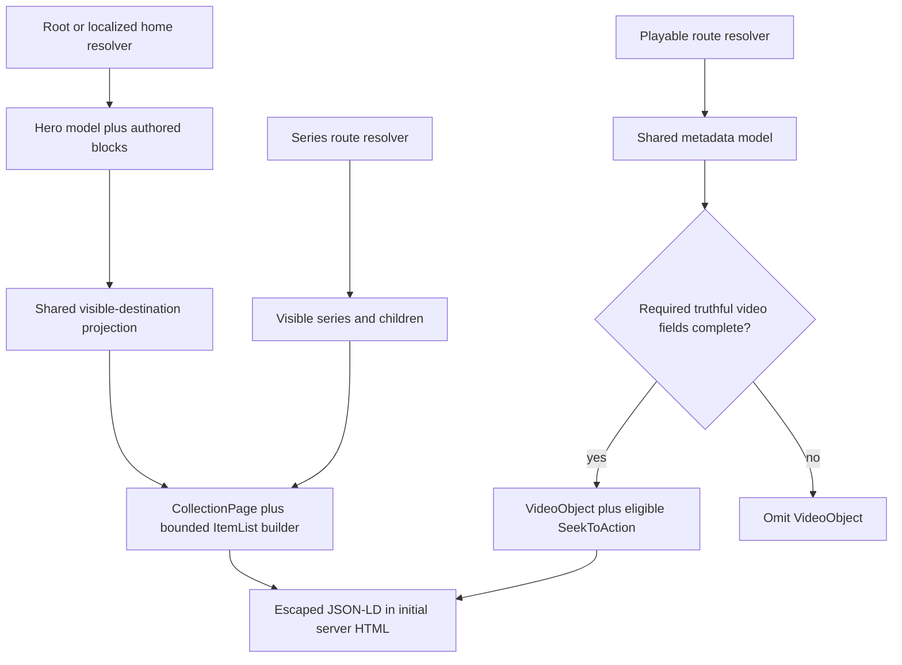

# feat: Add truthful Watch structured data

## Summary

Extend the existing server-rendered Watch JSON-LD pipeline so root and localized homepages and series landings describe real collections, while playable video pages emit complete, canonical, and truthful `VideoObject` data with supported timestamp deep links.

## Problem Frame

FGE-8 records that the production Watch homepage has no JSON-LD even though it presents a featured hero and editorial media rails. Playable pages already emit `VideoObject`, `BreadcrumbList`, and related `ItemList` scripts, but the current contract can publish a generic image as a video thumbnail, uses the landing page as `embedUrl`, substitutes public language slugs for BCP-47 values, rounds durations, and emits breadcrumbs that have no visible counterpart. Series landing pages also have no collection schema.

Google requires `VideoObject.name`, `thumbnailUrl`, and `uploadDate` for video-result eligibility and defines `contentUrl` as the media bytes and `embedUrl` as a specific player. The existing public `?t=<seconds>` behavior is a truthful basis for `SeekToAction`, but the repo has no authoritative named-chapter source for `Clip`. Schema must continue to describe the same server-resolved entities users see and must not add a parallel query or client-only metadata path.

## Requirements

### Collection surfaces

- R1. The root `/watch` page emits a server-rendered `CollectionPage` whose URL is `https://www.jesusfilm.org/watch`.
- R2. Localized Watch homepages emit the same collection contract with their existing canonical `www` URL and BCP-47 `inLanguage`.
- R3. Homepage collection data contains a bounded, ordered, deduplicated `ItemList` projected from the exact server-rendered hero sequence and authored Experience blocks.
- R4. Series landing pages emit `CollectionPage` data with a bounded `ItemList` of publicly routable children in visible order.
- R5. Collection list positions are contiguous after invalid entries and duplicate canonical URLs are removed.

### Playable video surfaces

- R6. Standalone feature-film, episode, and segment pages emit exactly one primary `VideoObject` only when a truthful page-specific name and description, video-specific thumbnail, valid upload date, canonical URL, and verified public playable content URL are available.
- R7. `VideoObject` includes precise positive ISO-8601 duration, BCP-47 language, shared publisher identity, and public captions represented as `caption: MediaObject` entries with `contentUrl`, `encodingFormat: "text/vtt"`, and BCP-47 `inLanguage`. Captions are descriptive Schema.org metadata, not a Google Video rich-result eligibility field.
- R8. Video JSON-LD omits the false landing-page `embedUrl` and suppresses schema for `noIndex` pages or incomplete required data.
- R9. Eligible videos of at least 30 seconds emit `SeekToAction` targeting the standalone canonical URL with a literal `?t={seek_to_second_number}` template.
- R10. Contextual episode navigation remains unchanged while JSON-LD entity URLs and timestamp targets use the standalone canonical video URL.
- R11. Related-video `ItemList` output is bounded, canonical, deduplicated, and limited to the server-selected visible collection. Its entries are plain `ListItem` values and never introduce additional primary `VideoObject` entities.

### Truthfulness and operations

- R12. No `Clip`, `FAQPage`, or `BreadcrumbList` is emitted until authoritative named timestamps, visibly rendered FAQ answers, or visible breadcrumbs exist.
- R13. All JSON-LD is serialized with `<` escaped and appears in initial server HTML without a new client bundle, request, or route dynamism.
- R14. Focused contract and route tests cover canonical URL, locale, required-field omission, duration, thumbnail, captions, list bounds, and timestamp serialization.
- R15. A repository QA record captures the production baseline, representative validator results, and the post-release Search Console comparison procedure without promising ranking impact.

## Assumptions

- The homepage list will use the first destination from the exact initial server hero sequence plus routable destinations projected from the authored Experience blocks passed to `ExperienceSectionRenderer`, capped at 12 total. Legacy `WatchHomeModel.sections` and unselected rotating alternatives are not schema inputs.
- Series and related lists will use a shared cap of 12 and preserve their server-visible order.
- A selected HLS URL is a truthful `contentUrl` only after the public media contract and representative unauthenticated fetches prove a stable success response, video content type, non-expiring URL, and no authentication or WAF challenge. Otherwise the `VideoObject` is omitted.
- `Video.publishedAt`, synced from Core `publishedAt`, is the sole upload-date source and must represent first public publication. `updatedAt`, locale timestamps, Dub timestamps, and sync timestamps are prohibited fallbacks; an unproven or absent date suppresses the `VideoObject`.
- `SeekToAction` is emitted only when duration is at least 30 seconds, the public media contract is proven, and the complete `?t=` player matrix passes. Authored `Clip` data remains future work.
- `noIndex` suppresses page-level structured data because discovery markup would conflict with the page's indexing policy.
- Caption tracks are represented only when their VTT URL independently passes the same unauthenticated, non-expiring public-access check and their language has a valid BCP-47 value.
- Publicly routable homepage candidates must have a nonblank rendered label and an actual rendered `href` that normalizes through the existing public route helpers. Series candidates must pass the same route construction used by the visible child list, have a nonblank label and valid slug, and remain playable in the selected public audio language. No schema-only resolver is introduced.

## Key Technical Decisions

- **Extend the existing serializer path:** `apps/web/src/lib/watch-structured-data.ts` remains the single JSON-LD builder surface. Route components pass already-resolved models so schema and visible content cannot drift through a second fetch.
- **Use page entities with nested lists:** Home and series output one `CollectionPage` with a nested `mainEntity: ItemList`. This keeps the page/list relationship coherent and avoids disconnected scripts or unsupported Google carousel claims.
- **Share the final visible-destination projection:** A server helper projects `{ heroModel, blocks, languageSlug }` into the exact initial hero and authored-block destinations used by both rendering and schema. It excludes legacy `heroModel.sections` and unsupported block types instead of guessing visibility.
- **Fail closed on video eligibility:** Incomplete or misleading `VideoObject` data is omitted instead of filled with generic artwork, a slug-like language, or a landing-page player URL.
- **Keep canonical identity separate from navigation context:** Central route helpers continue to build public audio-language URLs, while contextual episode UI remains free to preserve the selected collection.
- **Use automatic key moments, not invented chapters:** `SeekToAction` matches the existing arbitrary `?t=` player behavior. `Clip` requires editorial names and offsets that the current Admin model does not expose.
- **Remove unsupported breadcrumbs:** Existing `BreadcrumbList` scripts are removed because no visible breadcrumb hierarchy exists. A future visible breadcrumb feature can restore the schema and UI together.
- **Bound collection payloads:** A named shared limit prevents unbounded initial HTML growth and keeps structured data focused on editorially primary content.

## High-Level Technical Design

## Implementation Units

### U5. Establish roadmap and production-shaped eligibility baseline

- **Goal:** Satisfy the repository prerequisite before implementation and prevent fail-closed rules from silently erasing valid production coverage.
- **Files:**
  - Create `docs/roadmap/platform/feat-302-watch-structured-data.md`.
  - Create `docs/qa/watch-structured-data-2026-07-23.md`.
- **Approach:**
  - Create the next sequential roadmap ticket and mark it `in-progress` before code changes.
  - Record representative root, localized-home, series, standalone feature, episode, segment, and contextual URLs.
  - Inventory production-shaped fixtures by route class: total visible candidates, expected eligible schema entities, expected intentional suppressions, and the precise missing field or policy for each suppression.
  - Verify and document that Core `publishedAt` means first public publication for this surface; do not substitute another timestamp if the contract cannot be established.
  - Verify the HLS and VTT access contracts with representative unauthenticated requests, including final status/redirect, content type, authentication/WAF behavior, and whether URLs expire. Treat unexplained eligibility loss or an unproven media contract as an implementation/release blocker for `VideoObject` and `SeekToAction`.
- **Test scenarios:**
  - Every representative route class has an expected eligible or intentionally suppressed result before builder changes.
  - Publication-date and media-access conclusions cite the owning model/sync path and observed response evidence.
- **Verification:** The roadmap file is `in-progress`, and the QA record contains a reviewable baseline rather than an assumed production contract.
- **Covers:** R6-R9, R15.

### U1. Harden and extend structured-data contracts

- **Goal:** Make the shared builders express truthful collection and video entities and fail closed on incomplete data.
- **Files:**
  - Modify `apps/web/src/lib/watch-structured-data.ts`.
  - Modify `apps/web/src/lib/watch-structured-data.test.ts`.
  - Modify `apps/web/src/lib/experience-metadata.ts`.
  - Modify `apps/web/src/lib/experience-metadata.test.ts`.
- **Approach:**
  - Centralize escaped serialization, publisher identity, list bounds, canonical URL normalization, filtering, deduplication, and position renumbering.
  - Add home and series `CollectionPage` builders over existing server-resolved models.
  - Give the video metadata model a video-specific structured-data thumbnail and reliable caption metadata separately from social-image fallback behavior.
  - Require a nonblank, page-specific localized name and description plus complete video eligibility fields; preserve finite positive duration precision; emit BCP-47 only; omit false `embedUrl`; add an eligible literal-placeholder `SeekToAction`.
  - Serialize eligible captions as `MediaObject` values with public `contentUrl`, `encodingFormat: "text/vtt"`, and BCP-47 `inLanguage`.
  - Bound and deduplicate the existing related-video list as plain `ListItem` values so the page contains exactly one primary `VideoObject`.
- **Test scenarios:**
  - A complete playable model serializes a sanitized `VideoObject` with canonical URL, unique thumbnail, upload date, precise duration, BCP-47 language, captions, publisher, content URL, and timestamp action.
  - Missing or blank page-specific title or description, video-specific thumbnail, authoritative upload date, verified public content URL, or `noIndex: true` returns no `VideoObject`.
  - Missing BCP-47 omits `inLanguage` rather than using `english`; invalid caption tracks are skipped.
  - Zero, negative, non-finite, and missing durations omit duration and `SeekToAction`; a fractional duration remains truthful and a 30-second video is eligible.
  - Collection inputs filter invalid URLs, deduplicate canonical URLs, preserve selected order, cap at 12, and renumber positions from 1.
  - Caption output uses the exact `MediaObject` contract; inaccessible, expiring, or invalid-language tracks are skipped.
  - Escaping prevents a title or description containing `</script>` from creating literal markup.
- **Verification:** Parsed helper output matches Schema.org shapes, contains exactly one primary `VideoObject`, and contains no literal `<`.
- **Covers:** R3-R9, R11, R13-R14.

### U2. Render collection schema on root and localized homepages

- **Goal:** Put the same bounded homepage entity into the initial HTML for both homepage route owners.
- **Files:**
  - Modify `apps/web/src/app/[locale]/[htmlLang]/page.tsx`.
  - Modify `apps/web/src/app/[locale]/[htmlLang]/page.test.tsx`.
  - Modify `apps/web/src/app/[locale]/[htmlLang]/[...rest]/page.tsx`.
  - Modify `apps/web/src/app/[locale]/[htmlLang]/[...rest]/__tests__/page-routing.test.tsx`.
  - Modify the shared Watch-home projection helper and its focused tests in the closest existing `apps/web/src/lib/` or `apps/web/src/components/watch/` ownership boundary discovered during implementation.
- **Approach:**
  - Build the collection schema from `{ heroModel, blocks, languageSlug }`; do not fetch again or inspect client state.
  - Introduce one final server-side visible-destination projection consumed by both `WatchHomeExperiencePage` rendering and schema. Derive the initial hero through the same carousel-sequence selection and derive rail candidates only from authored blocks actually passed to `ExperienceSectionRenderer`; legacy `heroModel.sections` is not eligible.
  - Use the root canonical URL for `/watch` and the existing localized canonical policy for language homes.
  - Select one initial hero destination before authored-block candidates so rotating hero alternatives do not become co-primary entities.
  - Render the escaped script adjacent to the server-rendered homepage content and omit it on error or truly empty results.
- **Test scenarios:**
  - Root home emits `CollectionPage` with `https://www.jesusfilm.org/watch`, a nested bounded list, and no `FAQPage`.
  - A localized home emits a localized canonical URL, BCP-47 `inLanguage`, and child URLs with the public audio-language slug rather than the message locale.
  - Duplicate, unroutable, and titleless candidates are omitted with contiguous positions.
  - A fixture where legacy `heroModel.sections` differs from authored blocks emits only links from the initial hero and actually rendered authored blocks.
  - When every candidate is filtered, the entire `CollectionPage` is omitted.
  - Empty or failed home resolution emits no collection schema.
  - A dedicated pre-hydration server-rendering test serializes the resolved page tree to HTML, parses every `application/ld+json` script, and proves no client-only request or script insertion is required.
- **Verification:** Root and localized route tests prove both route owners share the same collection contract and compare ordered schema URLs with marked rendered anchors without changing metadata or visible rendering.
- **Covers:** R1-R5, R12-R14.

### U3. Complete series and playable-page schema wiring

- **Goal:** Add series collection data and make every playable route use the hardened video contract.
- **Files:**
  - Modify `apps/web/src/app/[locale]/[htmlLang]/[...rest]/page.tsx`.
  - Modify `apps/web/src/app/[locale]/[htmlLang]/[...rest]/__tests__/page-routing.test.tsx`.
  - Modify `apps/web/src/lib/watch-url-probe.ts`.
  - Modify `apps/web/scripts/probe-watch-urls.ts`.
  - Modify `apps/web/src/components/watch/__tests__/HeroPlayer.test.tsx`.
- **Approach:**
  - Emit `CollectionPage` for the series branch from the resolved series model and public audio-language slug only when `series.noIndex !== true` and at least one eligible child remains.
  - Keep series UI links contextual while list entity URLs use standalone canonical child routes.
  - Route standalone and contextual playable pages through nullable video JSON-LD output, remove non-visible breadcrumbs, and preserve only a bounded server-selected related list.
  - Confirm the existing player accepts the exact timestamp URL template behavior with loaded-metadata coverage for zero, valid middle, fractional, negative, nonnumeric, and above-duration inputs without changing user-visible navigation.
  - Extend the existing URL probe to parse actual JSON-LD script elements from complete public-route HTML responses. Do not count serialized text in the RSC payload as additional scripts.
- **Test scenarios:**
  - Feature-film, segment, and contextual episode routes emit one complete `VideoObject`.
  - A series route emits `CollectionPage`, caps children, filters invalid entries, and uses standalone child entity URLs.
  - A series with every child filtered omits the entire `CollectionPage`; a `noIndex` series still renders normally with no page-level JSON-LD.
  - Contextual episode `url` and `SeekToAction.target` remain standalone while the UI receives its contextual collection slug.
  - Incomplete or `noIndex` videos emit no `VideoObject`; route content still renders.
  - `?t=0`, a valid middle timestamp, a fractional timestamp, a negative value, a nonnumeric value, and an out-of-range value match documented player parsing and clamping.
  - No playable or collection route emits `Clip`, `FAQPage`, or `BreadcrumbList`.
  - A dedicated pre-hydration server render and a fresh production-mode local server both return the same parsed schema for root, localized-home, series, standalone, and contextual routes; a cached repeat remains deterministic.
- **Verification:** Catch-all tests prove route composition and unchanged UI props. The running-server URL probe separately proves complete initial-response HTML, canonical identity, and negative schema assertions.
- **Covers:** R4-R14.

### U4. Track completion and operational validation

- **Goal:** Make FGE-8's release evidence and monitoring expectations durable without conflating code completion with post-indexing outcomes.
- **Files:**
  - Modify `docs/roadmap/platform/feat-302-watch-structured-data.md`.
  - Modify `docs/qa/watch-structured-data-2026-07-23.md`.
- **Approach:**
  - Complete the roadmap ticket with a resolution summary only after implementation validation.
  - Extend the baseline with raw-HTML checks, validator results, and page-size/request observations.
  - Separate merge-gating repo evidence from supporting public-preview validation and recrawl-dependent production evidence. Private or `noindex` previews cannot establish Google acceptance.
  - Use Schema.org Validator for `CollectionPage` and generic `ItemList`; use both Schema.org Validator and Google Rich Results Test for `VideoObject` and `SeekToAction`.
  - Document pre-release Search Console fields and an equivalent-window post-release comparison for video indexing, enhancement errors, impressions, clicks, canonical samples, and locale samples. Compare only after sampled URLs show a crawl later than deployment.
  - Keep unavailable external checks durable by recording URL, route class, commit, timestamp, environment, extracted JSON-LD, deterministic test evidence, tool error, owner, and follow-up date.
- **Test scenarios:**
  - The QA record distinguishes observed evidence, validator output, and future Search Console follow-up.
  - The roadmap ticket names the implementation entry points, constraints, verification, and final resolution.
- **Verification:** Documentation contains no unsupported claim that schema guarantees ranking or rich-result display.
- **Covers:** R15.

## Acceptance Examples

- AE1. Given a root home with one hero and more than 12 unique rail cards, when the server renders `/watch`, then one `CollectionPage` script contains the hero plus the next eligible visible entries up to the cap, with positions `1..12`.
- AE2. Given a localized home whose internal UI locale is `es` and public audio slug is `spanish-castilian`, when JSON-LD is rendered, then `inLanguage` is a BCP-47 value and child URLs end in `/spanish-castilian.html`.
- AE3. Given a contextual episode route, when JSON-LD is rendered, then the UI keeps its collection context while `VideoObject.url` and `SeekToAction.target` use the standalone video canonical.
- AE4. Given a playable record with only generic fallback art or no valid publication date, when the page renders, then the page remains usable but emits no `VideoObject`.
- AE5. Given a series with duplicate, invalid, and more than 12 children, when its collection JSON-LD is rendered, then only the first 12 unique valid standalone entities remain with contiguous positions.
- AE6. Given a video with a verified public non-expiring HLS URL, a valid 30-second duration, and `?t=12`, when the page and player load, then the JSON-LD timestamp template is eligible and the visible player seeks to 12 seconds.
- AE7. Given a home or series whose candidates are all ineligible, when the server renders it, then no empty `CollectionPage` or `ItemList` is emitted.

## Scope Boundaries

- Do not add visible FAQ answers or `FAQPage` markup in this work.
- Do not add a breadcrumb UI solely to preserve the existing JSON-LD.
- Do not add Admin fields or invent `Clip` data without an authoritative editorial chapter source.
- Do not change Watch public URL shapes, contextual navigation, canonical policy, sitemap-owned hreflang, or WAT-225/FGE-15 host consolidation.
- Do not claim Google rich-result eligibility for generic homepage `ItemList` schema.
- Do not automate or fabricate Search Console metrics unavailable to the local environment.

## System-Wide Impact

- **Routing and identity:** Root, localized-home, series, standalone, and contextual route owners must agree on public host and language-slug rules.
- **Rendering and caching:** JSON-LD remains in force-static Server Components and uses already-fetched models, preserving ISR and avoiding request waterfalls.
- **Performance:** Bounded lists constrain HTML growth; validation must compare raw HTML size and confirm no extra network request or client bundle.
- **SEO ownership:** Canonical/social/robots stay in metadata, hreflang stays in sitemap XML, and JSON-LD remains page-rendered.
- **Failure behavior:** Missing optional collection items are filtered; missing required video fields suppress only the schema, not the visible page.

## Risks and Dependencies

- **Google eligibility differs from Schema.org validity:** Validate both tools and describe generic collection schema as descriptive, not a guaranteed enhancement.
- **Timestamp action can overstate support:** Gate it on public media, duration, and the already-tested `?t=` player contract.
- **Fallback metadata can look complete while being false:** Keep structured-data thumbnail eligibility separate from social-image fallback.
- **Two homepage route owners can drift:** Use the same builder and parallel route tests for root and localized pages.
- **Large collections can regress page weight:** Enforce one shared cap and include raw-HTML size/request proof.
- **Search Console results are delayed:** Record a baseline procedure and post-release window rather than blocking code completion on recrawl.
- **External validators can be unavailable or inapplicable:** Preserve deterministic evidence and a dated owner follow-up; do not replace tool output with screenshots or claim acceptance.
- **Bad schema can ship independently of the visible page:** Suppress or revert the affected schema branch if production shows mismatched entities, malformed JSON-LD, lost valid video items, or canonical/robots/player regressions.

## Documentation and Operational Notes

- Validate one root home, one localized home, one series, one standalone feature film, one segment, and one contextual episode.
- Schema.org Validator checks vocabulary correctness; Google Rich Results Test checks supported Google enhancements and critical errors.
- Implementation is complete when deterministic pre-merge gates pass and available preview evidence is recorded. Production technical verification remains pending until representative URLs are crawled after deployment without new critical errors.
- After release, annotate the deployment, sample an early recrawl, and review 14- and 28-day equivalent windows in Search Console's Video indexing, video enhancement, and Performance reports. Treat movement as observational because ranking and rich-result display are not guaranteed.

## Sources and Research

- FGE-8: `https://linear.app/jesus-film-project/issue/FGE-8/p1-add-structured-data-for-watch-home-and-video-landing-pages`
- Google Video structured data: `https://developers.google.com/search/docs/appearance/structured-data/video`
- Google video SEO guidance: `https://developers.google.com/search/docs/appearance/video`
- Google structured-data policies: `https://developers.google.com/search/docs/appearance/structured-data/sd-policies`
- Next.js JSON-LD guide: `https://nextjs.org/docs/app/guides/json-ld`
- Schema.org `CollectionPage`: `https://schema.org/CollectionPage`
- Schema.org `ItemList`: `https://schema.org/ItemList`
- Existing route/entity pattern: `apps/web/src/lib/watch-structured-data.ts`, `apps/web/src/lib/experience-metadata.ts`, and `apps/web/src/lib/routes.ts`.
- Existing server renderers: `apps/web/src/app/[locale]/[htmlLang]/page.tsx` and `apps/web/src/app/[locale]/[htmlLang]/[...rest]/page.tsx`.
- Institutional learnings: `docs/solutions/best-practices/watch-single-video-template-pages-strapi-nextjs-2026-04-11.md`, `docs/solutions/performance-issues/watch-hreflang-sitemap-manifest-20260612.md`, and `docs/solutions/conventions/public-watch-url-two-segment-contract-20260608.md`.
