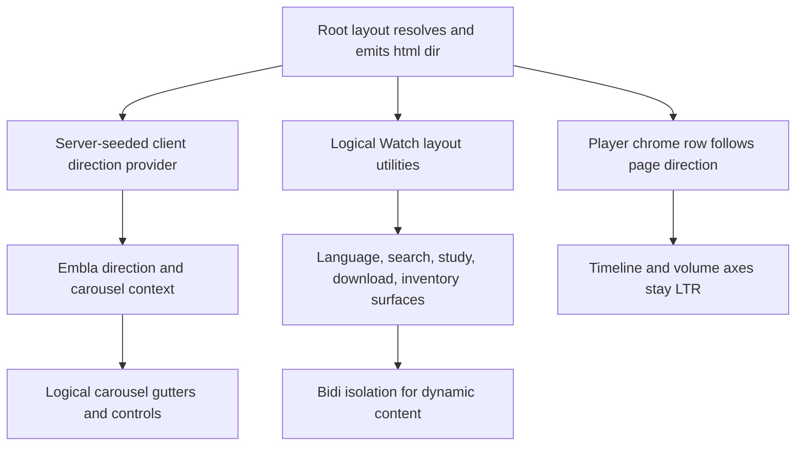

# fix: Harden RTL support across core Watch journeys

## Summary

Make Watch direction-aware at its shared layout and interaction boundaries, then repair the core language, search, download, study, inventory, and player journeys that still encode physical left-to-right assumptions.

---

## Problem Frame

Watch already resolves the page language and emits the correct root `lang` and `dir`, including script-sensitive exceptions. Descendant components still force physical left/right alignment, Embla is initialized without direction, mixed-script content is not consistently isolated, and custom media controls inherit RTL while their pointer geometry remains left-origin. Arabic pages therefore localize their text without delivering a consistently correct RTL interaction model.

---

## Requirements

### Direction ownership and shared primitives

- R1. The Watch root layout must keep `htmlLang` as the sole page-direction source and prove emitted LTR and RTL attributes at the layout boundary.
- R2. Shared horizontal carousels must configure Embla with the inherited document direction without changing item identity, document order, route targets, or optimistic selection state.
- R3. Carousel keyboard, wheel, touch, button placement, icons, disabled state, leading gutters, and trailing gutters must agree with the active visual direction.
- R4. Shared Watch rail and carousel spacing must use logical inline geometry while preserving existing breakpoint widths, safe-area handling, and horizontal clipping.

### RTL content surfaces

- R5. Study questions, language discovery and selection, search, download flows, and language inventory must align text and controls to the logical inline edges without changing their content or behavior.
- R6. Mixed-script dynamic values must be isolated from surrounding localized templates, while standalone dynamic labels use content-sensitive direction.
- R7. Text inputs must support Arabic queries on LTR pages and Latin queries on RTL pages without moving their logical search and clear affordances to the wrong edge.

### Media controls and verification

- R8. Timeline and volume value axes must remain explicitly LTR so pointer math, fills, previews, keyboard increments, and chronological meaning stay synchronized in both page directions.
- R9. The surrounding player control row must continue to follow page direction and preserve focus order, visibility, fullscreen, language, and subtitle behavior.
- R10. Focused tests and representative Arabic browser smokes must prove direction, layout, mixed-script ordering, carousel navigation, modal geometry, and player value-axis behavior without horizontal page overflow or loading-performance regressions.

---

## Assumptions

- The existing root `html[dir]` contract remains authoritative; individual Watch pages do not introduce a second locale or direction store.
- Carousel previous and next retain semantic document-order meaning. Their physical placement and glyphs mirror, but slide data and links do not reverse.
- Search and combobox inputs use content-sensitive direction, while surrounding labels and affordances inherit the page direction.
- Media imagery, time progression, and volume magnitude remain physical/value-axis concerns and are not mechanically converted to logical inline geometry.
- Modal close buttons remain at their current viewport convention unless a touched modal already defines them as logical end controls.

---

## Key Technical Decisions

- KTD1. **Direction is server-seeded once:** the root layout passes its resolved direction to a small client provider so server rendering and hydration use the same value. The provider has no locale-catalog or language-map imports, and consumers do not thread locale props.
- KTD2. **Embla and controls share one direction contract:** pass direction into Embla, expose it through carousel context, and derive horizontal keys, wheel behavior, button positions, and glyphs from that same value.
- KTD3. **Use logical CSS for reading-order layout:** migrate inline margins, padding, offsets, text alignment, and carousel gutters to Tailwind logical utilities; retain physical coordinates for centered overlays, media badges whose corner is intentional, and left-origin value axes.
- KTD4. **Use two bidi mechanisms:** extract the proven first-strong isolate helper for interpolated ICU/ARIA strings, and render standalone dynamic names and titles with `<bdi>` or `dir="auto"`.
- KTD5. **Constrain LTR to named value-axis islands:** mark the timeline slider root and its preview/fill/thumb descendants, the time-value wrapper, and the volume slider root/track LTR. Localized labels and the surrounding player chrome row remain outside those islands.
- KTD6. **Characterize shared behavior before widening the migration:** extend existing focused tests first, then update consumers so failures identify direction semantics rather than unrelated visual churn.

---

## High-Level Technical Design

---

## Implementation Units

### U1. Establish tracking and direction contracts

- **Goal:** Create the required roadmap ticket and lock the existing root-direction behavior with reusable bidi and client-direction utilities.
- **Requirements:** R1, R6
- **Dependencies:** None
- **Files:**
  - `docs/roadmap/platform/feat-302-watch-rtl-support.md`
  - `apps/web/src/app/[locale]/[htmlLang]/layout.test.tsx`
  - `apps/web/src/components/DirectionProvider.tsx`
  - `apps/web/src/components/DirectionProvider.test.tsx`
  - `apps/web/src/lib/bidi.ts`
  - `apps/web/src/lib/bidi.test.ts`
- **Approach:** Mark the roadmap ticket in progress. Add layout assertions for representative LTR, Arabic RTL, and script-sensitive LTR identities. Seed a dependency-free client direction provider from the root layout so SSR and hydration snapshots agree. Extract a display-only bidi helper that cannot become an identity, route, search, analytics, persistence, or filename input.
- **Patterns to follow:** `textDirectionForLocale()` in `apps/web/src/lib/locale.ts` and the first-strong isolation pattern in `apps/web/src/components/watch/LanguagePickerModal.tsx`.
- **Test scenarios:**
  1. English layout emits the resolved language and `dir="ltr"`.
  2. Arabic layout emits the resolved language and `dir="rtl"`.
  3. A Latin-script language identity does not become RTL because its base language has an Arabic-script variant.
  4. Isolating a Latin name inside Arabic text and an Arabic name inside Latin text produces balanced isolate markers.
  5. The server-rendered RTL provider hydrates without warnings and exposes RTL before a carousel initializes.
- **Verification:** Direction ownership is enforced at the rendered layout boundary and the new helpers remain client-safe and deterministic.

### U2. Make the shared carousel direction-aware

- **Goal:** Give every Watch carousel one coherent RTL interaction and spacing contract.
- **Requirements:** R2, R3, R4
- **Dependencies:** U1
- **Files:**
  - `apps/web/src/components/ui/carousel.tsx`
  - `apps/web/src/components/ui/__tests__/carousel.test.tsx`
  - `apps/web/src/lib/content-width.ts`
  - `apps/web/src/lib/__tests__/content-width.test.ts`
  - `apps/web/src/components/watch/SiblingCarousel.tsx`
  - `apps/web/src/components/watch/__tests__/SiblingCarousel.test.tsx`
  - `apps/web/src/components/watch/BibleQuotesSection.tsx`
  - `apps/web/src/components/home/WatchHomeTvCarousel.tsx`
  - `apps/web/src/components/sections/BibleQuotesCarousel.tsx`
  - `apps/web/src/components/sections/NavigationCarousel.tsx`
  - `apps/web/src/components/sections/CarouselVideo.tsx`
  - `apps/web/src/components/sections/MediaCollection.tsx`
  - `apps/web/src/components/watch-language-inventory/LanguageInventoryPage.tsx`
- **Execution note:** Start with failing shared-carousel tests that independently prove LTR and RTL branches.
- **Approach:** Consume the server-seeded direction, pass it to Embla, and expose it through carousel context. Watch locale changes are full document navigations, so direction is immutable for a mounted carousel. Convert default and consumer gutters to logical start padding/margins, keep the real trailing spacer, mirror horizontal controls and glyphs, and map keys/wheel gestures through direction without reversing slide arrays or link targets.
- **Patterns to follow:** The bleed/padding/spacer lockstep in `apps/web/src/lib/content-width.ts`, real Embla coverage in `apps/web/src/components/watch/__tests__/SiblingCarousel.test.tsx`, and the clipping rules in `docs/solutions/ui-bugs/watch-mobile-sibling-carousel-horizontal-rubber-band.md`.
- **Test scenarios:**
  1. LTR and RTL carousels pass the correct direction to Embla.
  2. ArrowLeft and ArrowRight move toward the visually corresponding slide in each direction; vertical keys retain existing behavior.
  3. Horizontal wheel deltas navigate visually in both directions and remain unconsumed at the relevant boundary.
  4. Previous and next buttons occupy inline-start and inline-end with mirrored icons and accurate disabled state.
  5. Leading card alignment and trailing spacer widths remain locked to section padding at every breakpoint.
  6. Sibling optimistic selection and href identity remain unchanged under RTL.
  7. LTR and RTL drag gestures in both physical directions select the expected semantic previous or next item without changing href identity.
  8. Logical rail classes preserve leading and trailing safe-area insets with a nonzero simulated inset in both directions.
- **Verification:** Every carousel behavior class uses the shared direction contract, and page-level horizontal clipping remains intact.

### U3. Repair RTL layout and bidi boundaries on Watch content surfaces

- **Goal:** Remove forced LTR presentation from viewer-facing Watch language, search, study, download, and inventory flows.
- **Requirements:** R5, R6, R7
- **Dependencies:** U1
- **Files:**
  - `apps/web/src/components/FloatingSearchField.tsx`
  - `apps/web/src/components/__tests__/FloatingSearchProvider.test.tsx`
  - `apps/web/src/components/SearchOverlay.tsx`
  - `apps/web/src/components/search/VideoCard.tsx`
  - `apps/web/src/components/search/VideoCard.test.tsx`
  - `apps/web/src/components/watch/WatchStudyQuestions.tsx`
  - `apps/web/src/components/watch/WatchQuestionPanel.tsx`
  - `apps/web/src/components/watch/__tests__/WatchBody.test.tsx`
  - `apps/web/src/components/watch/WatchLanguageIndexBrowser.tsx`
  - `apps/web/src/components/watch/WatchLanguageIndexBrowser.test.tsx`
  - `apps/web/src/components/watch/LanguageCombobox.tsx`
  - `apps/web/src/components/watch/__tests__/LanguageCombobox.test.tsx`
  - `apps/web/src/components/watch/LanguagePickerModal.tsx`
  - `apps/web/src/components/watch/__tests__/LanguagePickerModal.test.tsx`
  - `apps/web/src/components/watch/DownloadModal.tsx`
  - `apps/web/src/components/watch/__tests__/DownloadModal.test.tsx`
  - `apps/web/src/components/watch/CollectionDownloadModal.tsx`
  - `apps/web/src/components/watch/__tests__/CollectionDownloadModal.test.tsx`
  - `apps/web/src/components/watch-language-inventory/LanguageInventoryPage.tsx`
  - `apps/web/src/components/watch-language-inventory/LanguageInventoryPage.test.tsx`
- **Approach:** Replace inline physical alignment with logical utilities, mirror directional glyphs, give text inputs content-sensitive direction, and isolate names, queries, titles, and localized interpolations at their final rendering boundaries. Raw values remain unchanged through search submission, identity comparison, href generation, analytics, persistence, and filename construction. Preserve media crop positions and intentional physical overlay corners unless they encode reading order.
- **Patterns to follow:** The tested language-name isolation in `LanguagePickerModal`, current Base UI focus behavior, and existing modal scrollbar/overflow constraints.
- **Test scenarios:**
  1. Study question triggers, bodies, and CTAs align to logical start in both directions.
  2. Arabic language rows isolate English labels and English rows isolate Arabic native labels without punctuation reordering.
  3. Search and combobox inputs accept Latin queries on RTL pages and Arabic queries on LTR pages while icons and clear controls stay on logical edges.
  4. Language and inventory arrows mirror without changing destination hrefs.
  5. Download option rows, terms lists, collection labels, episode counts, and chevrons mirror without changing selection or filename behavior.
  6. Long RTL labels at phone width and the modal’s desktop width truncate or wrap without overlap or horizontal overflow.
  7. Search initial, loading, no-results, error, retry, load-more, result, cleared-input, and result-activation states keep logical alignment and focus behavior.
  8. Language loading, error, retry, no-match, pending-apply, applied, and nested-combobox Escape states preserve accessible names, focus trapping, and trigger-focus restoration.
  9. Download authentication, empty, loading, error, retry, progress, partial-completion, success, explicit-close, and Escape states keep status values isolated and live announcements coherent.
  10. Raw source values remain byte-for-byte unchanged through search, links, selection keys, and filename construction; only final display and accessible strings contain isolation markers.
- **Verification:** The targeted surfaces contain no forced physical text alignment for reading-order content, and their tests prove both script directions.

### U4. Separate RTL chrome layout from LTR media value axes

- **Goal:** Keep player chrome usable on RTL pages without desynchronizing pointer and keyboard behavior.
- **Requirements:** R8, R9
- **Dependencies:** U1
- **Files:**
  - `apps/web/src/components/watch/HeroPlayerControls.tsx`
  - `apps/web/src/components/watch/__tests__/HeroPlayerControls.test.tsx`
  - `apps/web/src/components/watch/HeroPlayer.tsx`
  - `apps/web/src/components/watch/__tests__/HeroPlayer.test.tsx`
- **Approach:** Let the control row inherit page direction. Set `dir="ltr"` on the timeline slider root and its preview/fill/thumb descendants, a separate time-value wrapper, and the volume slider root/track. Keep localized labels outside those islands. ArrowRight remains increment/forward and ArrowLeft decrement/back in both page directions.
- **Patterns to follow:** Existing pointer-capture and nonzero bounding-rectangle tests in `HeroPlayerControls`, and the ownership boundary documented in `docs/solutions/design-patterns/mux-player-custom-react-chrome-pattern-20260430.md`.
- **Test scenarios:**
  1. RTL host layout leaves the control row RTL while timeline and volume sliders expose LTR direction.
  2. Nonzero-left timeline and volume rectangles map pointer positions to the same values under LTR and RTL hosts.
  3. ArrowRight increases and ArrowLeft decreases seek and volume values in both page directions.
  4. Timeline fill, thumb, storyboard preview, and current/duration text remain synchronized.
  5. Zero and full values place fill, thumb, and preview at the physical endpoints, including nonzero-left rectangles and preview clamping near both edges.
  6. Slider roles, accessible names, value text, DOM tab order, and keyboard semantics remain correct under RTL hosts.
  7. Fullscreen, language, subtitle, focus, and visibility behavior does not regress.
- **Verification:** RTL pages mirror chrome layout while all temporal and magnitude controls retain coherent LTR geometry and semantics.

### U5. Prove representative RTL journeys and close tracking

- **Goal:** Validate the integrated behavior at component and browser levels, record performance evidence, and complete the roadmap ticket.
- **Requirements:** R10
- **Dependencies:** U2, U3, U4
- **Files:**
  - `docs/roadmap/platform/feat-302-watch-rtl-support.md`
  - `docs/solutions/ui-bugs/watch-rtl-layout-carousel-and-bidi-support.md`
- **Approach:** Run focused tests before full Web checks. Browser-smoke the verified Arabic inventory route and the first playable Arabic episode discovered from that inventory which exposes a carousel, language selection, downloads, and custom player chrome. Use Chromium at 1440x900, Chromium mobile emulation at 390x844, and WebKit at 390x844. Capture screenshots plus DOM direction, focus, href, selected-item, slider, and bounding-rectangle evidence. Record the reusable ownership rules in a solution note, then mark the roadmap ticket complete.
- **Test scenarios:**
  1. `/watch/arabic-modern-standard.html/videos` emits Arabic `lang`, `dir="rtl"`, localized visible and accessible copy, and no missing-message text.
  2. Inventory and episode pages have no document overflow at desktop and narrow mobile widths.
  3. Search accepts a Latin query on the Arabic page and renders isolated mixed-script results.
  4. Language and download modals open, scroll, close, and avoid label/control collisions.
  5. Carousel drag stays inside its rail, does not move the page horizontally, and preserves active/link identity.
  6. Player seek and volume controls remain left-origin and respond correctly inside the RTL page.
  7. Language selection applies a destination, verifies the resulting route and root direction, then restores focus on cancel and explicit close paths.
  8. Search enters and clears a mixed-script query, activates a result, verifies the destination, and restores focus on exit.
  9. A download selection verifies rendition and filename behavior through success or the representative error path, then exits without focus loss.
  10. Carousel accessible names, disabled exposure, DOM/tab order, keys, pointer drag, and touch behavior agree with semantic previous/next meaning.
  11. Five cold loads of the same pre-change and post-change Arabic routes produce no hydration warnings, no direction-induced layout shifts, one Embla initialization per mount, and no greater than 10% median LCP regression in the same local environment.
- **Verification:** Focused tests, typecheck, lint, Web build, the defined browser matrix, and the bounded performance comparison pass; the roadmap ticket is complete and durable learnings are recorded.

---

## Scope Boundaries

### Included

- Public Watch web routes and the shared Web carousel primitives they consume.
- Logical inline layout, bidi isolation, and custom Watch player chrome behavior.
- Representative LTR/RTL component coverage and Arabic browser validation.

### Deferred to Follow-Up Work

- A repository-wide conversion of all non-Watch web components to logical CSS.
- An exhaustive audit of every public Watch component outside the named core journeys; track remaining surfaces as follow-up work under the umbrella RTL issue.
- Mirroring intentional media crop focal points or editorial badge corners without product/design review.
- Reversing chronological timelines or magnitude axes.
- Mobile and TV application RTL audits.

---

## System-Wide Impact

- **Users:** RTL viewers receive coherent reading order, navigation, and mixed-script rendering across the main Watch journeys.
- **Developers:** Shared carousel and bidi helpers become the default contracts for future Watch surfaces.
- **Performance:** Direction lookup must remain synchronous, local, and free of request-time filesystem or catalog loading; browser validation must include hydration and loading checks.
- **Accessibility:** Accessible names, focus order, slider semantics, and directional glyphs must agree with visual behavior.

---

## Risks and Dependencies

- Tailwind logical utilities can be accidentally overridden by consumer physical classes; focused class-contract and browser geometry tests mitigate this.
- Embla direction changes can preserve visuals while reversing semantic selection or links; tests must assert item identity and hrefs, not screenshots alone.
- Portal-mounted player chrome can inherit direction from a different ancestor than expected; tests must mount it under explicit LTR and RTL document roots.
- `<bdi>` and isolate markers solve different rendering contexts; applying both indiscriminately can leak invisible characters into user-visible values or filenames.
- Local browser proof depends on a current Watch development server and representative data; if unavailable, the PR must state the exact unverified journeys.

---

## Sources and Research

- `apps/web/src/app/[locale]/[htmlLang]/layout.tsx`
- `apps/web/src/lib/locale.ts`
- `apps/web/src/components/ui/carousel.tsx`
- `apps/web/src/lib/content-width.ts`
- `apps/web/src/components/watch/HeroPlayerControls.tsx`
- `docs/solutions/design-patterns/embla-carousel-bleed-alignment-port-pattern-20260508.md`
- `docs/solutions/ui-bugs/watch-mobile-sibling-carousel-horizontal-rubber-band.md`
- `docs/solutions/design-patterns/mux-player-custom-react-chrome-pattern-20260430.md`
- `docs/solutions/ui-bugs/watch-collection-download-raw-next-intl-keys-missing-client-namespace.md`
