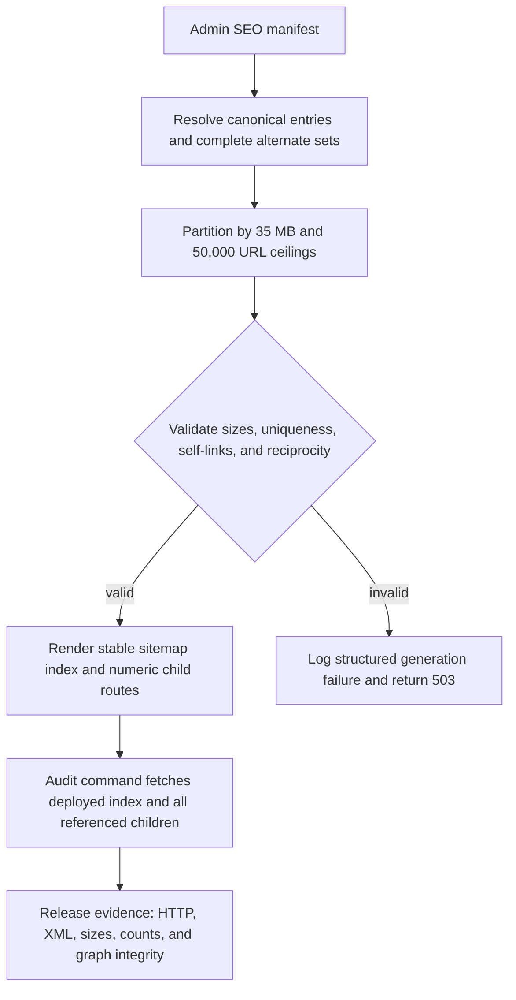

# fix: Keep Watch sitemap shards below size limits

## Summary

Lower the Watch child-sitemap byte ceiling from 45 MB to 35 MB, enforce
generation invariants before returning XML, surface structured failures, and
add a repeatable production audit that records shard size and graph integrity.

## Problem Frame

FGE-17 identifies a crawler-discovery risk in the Watch sitemap. The existing
generator is byte-aware, but it fills child sitemaps to a 45,000,000-byte
default, leaving little headroom beneath Google's 50 MB uncompressed limit.

A production audit on 2026-07-23 found 22 valid child sitemaps. Twenty-one are
between 44,983,220 and 44,999,426 bytes; the final shard is 6,332,549 bytes.
The index contains 82,863 unique canonical URLs and 7,012,245 `hreflang`
annotations with no missing self-links or reciprocal-set mismatches. Repacking
the same serialized entries at 35,000,000 bytes produces 28 shards with a
34,999,876-byte maximum.

---

## Requirements

**Shard safety**

- R1. Every generated child sitemap must remain at or below 35,000,000
  uncompressed UTF-8 bytes and below 50,000 `<loc>` entries.
- R2. Byte accounting must include the XML declaration, namespace wrapper,
  escaped canonical URL, and complete serialized alternate set.
- R3. A canonical URL entry must remain atomic so every emitted entry keeps its
  complete reciprocal alternate set, including itself.
- R4. Every intended canonical URL must appear exactly once across the generated
  child set, and every generated child must appear exactly once in the index.

**Failure behavior**

- R5. Invalid limits, duplicate canonical URLs, or a single entry that cannot
  fit within a child sitemap must fail generation rather than emit invalid XML.
- R6. Index and child route handlers must return a controlled 503 and emit a
  privacy-safe structured error event when generation validation fails.
- R7. Normal child-count changes must not alter the public index path or the
  numeric child URL contract.

**Audit and release evidence**

- R8. A repo-owned audit command must fetch an index and every referenced child,
  require direct HTTP 200 and valid UTF-8 XML, and report uncompressed bytes,
  `<loc>` count, `hreflang` count, uniqueness, self-inclusion, reciprocity, and
  index coverage.
- R9. Automated tests must fail when the 35 MB or 50,000-URL safety thresholds
  can be exceeded or when canonical/alternate graph invariants regress.
- R10. The implementation must record the 2026-07-23 production baseline,
  modeled 35 MB repartition, and the post-deploy audit procedure.

---

## Key Technical Decisions

- KTD1. **Use a 35,000,000-byte decimal ceiling and a 49,999-entry ceiling.**
  The current generator already measures serialized UTF-8 bytes in decimal
  units, and these inclusive ceilings keep output within FGE-17's strict
  “under 50,000 URLs” criterion while leaving 15 MB beneath Google's hard byte
  limit.
- KTD2. **Validate the generated chunk model before rendering.** The chunk model
  is the shared source for both the index and child routes, so one validation
  boundary protects both outputs without reparsing generated XML on every
  response.
- KTD3. **Fail closed on unsplittable or duplicate entries.** Silently emitting
  an oversized shard or deduplicating conflicting manifest input would hide an
  upstream data defect and weaken crawler coverage guarantees.
- KTD4. **Keep alternate sets attached to individual canonical entries.** A
  shard boundary may fall between canonical entries from the same route group,
  but each entry retains the full self-inclusive reciprocal set.
- KTD5. **Reuse the existing Watch server-event logger.** Generation failures
  need a stable event name and bounded fields such as error code, manifest
  version, and chunk id; sitemap URLs and alternate payloads do not belong in
  logs.
- KTD6. **Make the live audit an explicit operator command.** Runtime routes
  validate generated output, while a separate CLI verifies deployed HTTP,
  encoding, XML, index coverage, and cross-shard graph integrity without adding
  network work to request handling.

---

## High-Level Technical Design

---

## Implementation Units

### U1. Enforce safe chunk limits and graph invariants

- **Goal:** Make the chunk model unable to represent an oversized, duplicated,
  or incomplete sitemap output.
- **Requirements:** R1, R2, R3, R4, R5, R7, R9
- **Dependencies:** None
- **Files:**
  - `apps/web/src/lib/watch-sitemap.ts`
  - `apps/web/src/lib/watch-sitemap.test.ts`
- **Approach:** Change the default ceilings to 35,000,000 bytes and 49,999
  entries; validate positive integer limits; track canonical URL uniqueness
  while building chunks; reject a single serialized entry that exceeds the
  ceiling; and expose a validated summary that index and child rendering share.
  Keep numeric child paths and the existing weak-map cache contract.
- **Patterns to follow:** Existing serialized-byte accounting and shared
  alternate XML in `apps/web/src/lib/watch-sitemap.ts`.
- **Test scenarios:**
  1. A fixture near the byte boundary splits before a child would exceed
     35,000,000 bytes, and every resulting child also remains below 50,000
     entries.
  2. Escaped multibyte canonical and alternate values are counted using UTF-8
     bytes rather than JavaScript character length.
  3. A single entry larger than the configured limit fails with the expected
     generation error instead of creating an oversized child.
  4. Duplicate canonical URLs from separate manifest groups fail generation.
  5. Every emitted entry contains itself and the same alternate set as its
     peers, even when a shard boundary splits a route group.
  6. The index references each generated numeric child URL exactly once after
     the shard count changes.
- **Verification:** The pure generator returns only validated chunks and retains
  stable `/sitemap.xml` plus `/sitemap/{id}.xml` paths.

### U2. Fail closed and log route-generation errors

- **Goal:** Turn sitemap invariant failures into observable, controlled HTTP
  responses.
- **Requirements:** R5, R6, R7, R9
- **Dependencies:** U1
- **Files:**
  - `apps/web/src/app/sitemap.xml/route.ts`
  - `apps/web/src/app/sitemap/[id]/route.ts`
  - `apps/web/src/app/sitemap.test.ts`
- **Approach:** Catch the typed generation error around index and child
  rendering, record one structured Watch server event with bounded diagnostic
  fields, and return the existing controlled unavailable response with a short
  cache lifetime. Preserve 404 behavior for malformed or nonexistent child ids.
- **Patterns to follow:** `logWatchServerEvent` usage in
  `apps/web/src/lib/watch-seo-manifest.ts` and existing sitemap 503 responses.
- **Test scenarios:**
  1. A valid manifest still returns XML with the existing content type and cache
     headers.
  2. A duplicate or unsplittable manifest returns 503 from the index and logs
     the stable failure event without canonical URLs or alternate values.
  3. The same generation failure returns 503 from a child route and includes
     the requested numeric id only as bounded diagnostic metadata.
  4. Malformed and out-of-range child ids remain 404 and are not reported as
     generation failures.
- **Verification:** Route tests prove the HTTP and logging contract without
  weakening manifest-unavailable behavior.

### U3. Add a repeatable deployed-sitemap audit

- **Goal:** Verify the canonical production or preview sitemap as a complete
  deployed graph rather than sampling one child.
- **Requirements:** R1, R3, R4, R8, R9, R10
- **Dependencies:** U1
- **Files:**
  - `apps/web/src/lib/watch-sitemap-audit.ts`
  - `apps/web/src/lib/watch-sitemap-audit.test.ts`
  - `apps/web/scripts/audit-watch-sitemap.ts`
  - `apps/web/package.json`
  - `pnpm-lock.yaml`
- **Approach:** Put report aggregation and graph checks in a pure tested module;
  use `fast-xml-parser` as an explicit Web development dependency for XML
  validation; and add a `audit:watch-sitemap` command accepting an origin plus
  optional JSON output. Fetch the index first, follow only its referenced child
  URLs, disable redirect following for the direct-200 gate, and measure decoded
  response bytes.
- **Patterns to follow:** Argument parsing and optional JSON artifacts in
  `apps/web/scripts/probe-watch-urls.ts`.
- **Test scenarios:**
  1. A valid index and child set reports unique child references, exact byte and
     element counts, unique canonicals, self-inclusion, and reciprocal sets.
  2. A redirected, non-200, malformed, non-UTF-8, oversized, or over-count child
     fails the audit with the affected child identified.
  3. Duplicate index references, missing children, duplicate canonical URLs,
     missing self-links, and mismatched reciprocal sets each fail with distinct
     diagnostics.
  4. JSON output remains deterministic so before/after runs can be compared in
     release evidence.
- **Verification:** The command exits nonzero on any deployment invariant
  failure and prints a compact per-child table plus aggregate summary on
  success.

### U4. Record baseline, modeled result, and release procedure

- **Goal:** Leave reproducible evidence for FGE-17 and future sitemap growth
  checks.
- **Requirements:** R8, R10
- **Dependencies:** U3
- **Files:**
  - `docs/operations/watch-sitemap-shard-audit-2026-07-23.md`
  - `docs/roadmap/platform/feat-303-watch-sitemap-shard-size-limits.md`
  - `docs/roadmap/README.md`
- **Approach:** Record all 22 baseline child rows, aggregate integrity results,
  the exact 35 MB modeled repartition, and the audit commands for a deployed
  preview and canonical production. Mark Search Console and Bing processing as
  post-deploy operator evidence because this PR cannot submit or verify those
  external consoles.
- **Patterns to follow:** Operational proof in
  `docs/operations/web-production-readiness.md` and roadmap generation through
  the existing Roadmap app script.
- **Test scenarios:** Test expectation: none -- this unit records generated
  evidence and operator procedure; U3 tests the underlying audit behavior.
- **Verification:** A future operator can reproduce both candidate and
  production reports and attach search-console processing evidence without
  reverse-engineering the generator.

---

## Scope Boundaries

### In scope

- Watch child-sitemap byte and URL ceilings.
- Canonical uniqueness and alternate-graph validation.
- Route-level failure observability.
- Production and preview audit tooling plus baseline evidence.

### Deferred to post-deploy verification

- Confirming the new production child set after the PR reaches production.
- Recording successful processing in Google Search Console and Bing Webmaster
  Tools, which requires deployed output and operator access.

### Out of scope

- Changing the Admin SEO manifest schema or generation triggers.
- Reintroducing page-head `hreflang`.
- Changing canonical Watch hosts, root robots ownership, or sitemap submission
  policy tracked by FGE-18.

---

## System-Wide Impact

The change increases the number of child sitemap responses while reducing the
maximum payload per response. It does not affect page rendering, hydration, or
Watch route resolution. Revalidation continues to invalidate the stable index
and child route pattern, so a changing child count does not require enumerating
ids in webhook payloads.

---

## Risks and Dependencies

- **Large manifests still allocate substantial serialized data in Web memory.**
  The change retains shared alternate XML and the current weak-map cache; it
  must not duplicate alternate strings per validation pass.
- **An upstream duplicate can make all sitemap routes return 503.** This is
  intentional fail-closed behavior, and the structured event must identify the
  error code and manifest version so operators can repair the snapshot.
- **A single route group could grow unusually large.** Each canonical entry
  still carries a complete alternate set. If one entry ever exceeds 35 MB, the
  generator must fail rather than split its reciprocal set.
- **External console acceptance cannot be proven before deployment.** The
  audit command provides HTTP/XML evidence, while Search Console and Bing
  processing remain explicit release follow-up.

---

## Sources and Research

- Linear FGE-17: `[P1] Keep Watch sitemap shards safely below search-engine size
limits`.
- `apps/web/src/lib/watch-sitemap.ts` already partitions by serialized UTF-8
  bytes and URL count but defaults to 45,000,000 bytes.
- `docs/solutions/performance-issues/watch-hreflang-sitemap-manifest-20260612.md`
  establishes sitemap XML as the sole Watch `hreflang` owner.
- [Google Search sitemap guidance](https://developers.google.com/search/docs/crawling-indexing/sitemaps/build-sitemap)
  sets the hard limit at 50 MB uncompressed or 50,000 URLs and requires UTF-8
  plus absolute URLs.
