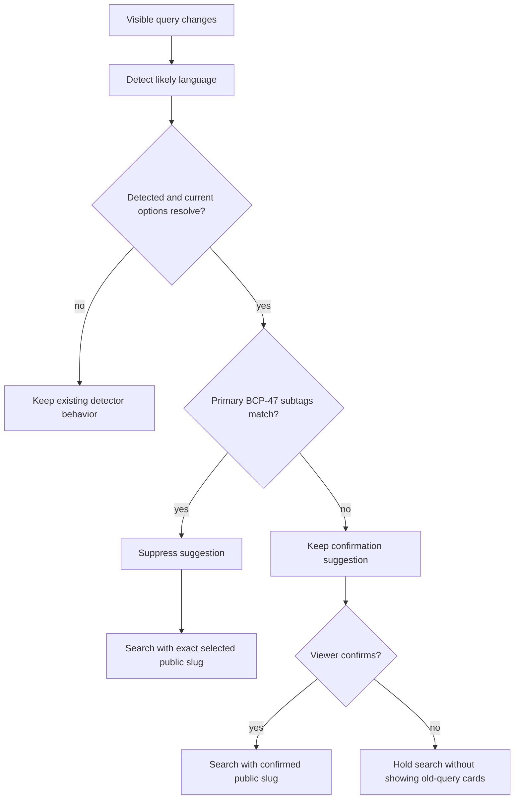
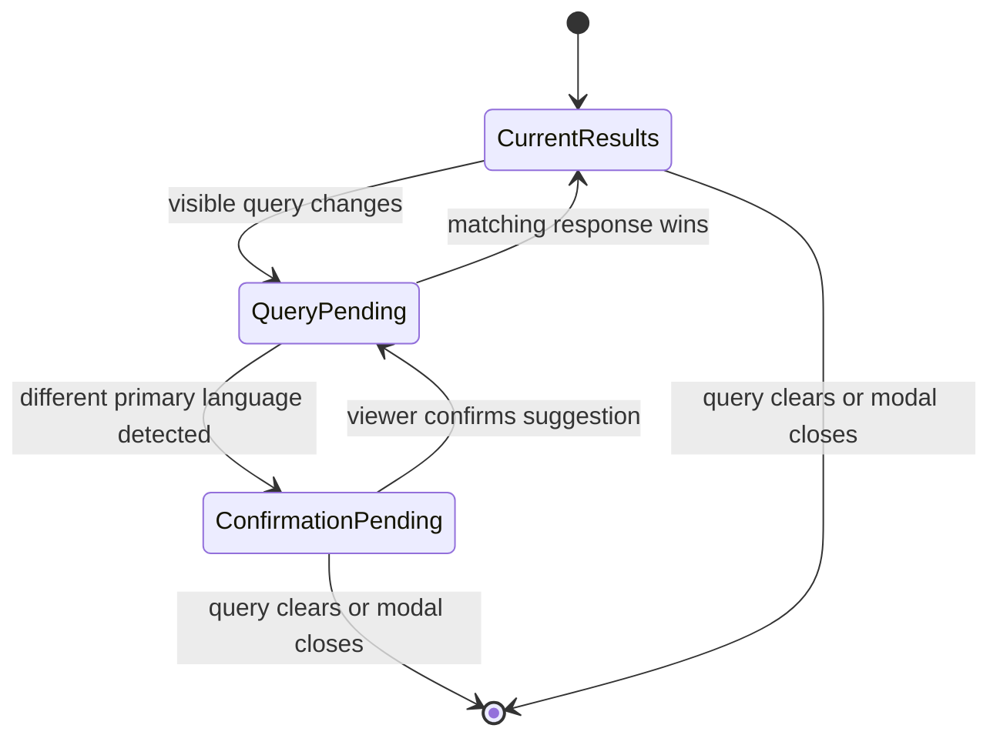

# fix: Preserve Spanish variant search identity

## Summary

Fix FGE-1 by treating supported Search Languages with the same BCP-47 primary
subtag as equivalent only when deciding whether to show a query-language
suggestion. Keep the viewer's exact public language slug for search execution
and ensure result cards are presented only while they match the visible query.

---

## Problem Frame

The multilingual Watch search feature maps detected Spanish (`es`) to the
preferred `spanish-castilian` option and suppresses a suggestion only when that
slug exactly matches the selected Search Language. A viewer who selected
`spanish-latin-american` therefore sees a blocking Spanish suggestion for a
Spanish query, and accepting it replaces the selected regional variant.

The overlay updates the input before it starts a new search. When detection
pauses the new search, the controller retains the previous result cards, so
results for `perdón` can appear beneath `Navidad`, `ansiedad`, or
`hijo pródigo`.

This plan narrows the origin requirements to the FGE-1 regression. It does not
change Admin retrieval, detector thresholds, regional-variant ranking, or the
confirmation behavior for a genuinely different primary language.

---

## Requirements

### Suggestion equivalence

- FR1. A confident Spanish detection must not show a blocking language
  suggestion when the selected Search Language has BCP-47 primary subtag
  `es`, including `spanish-castilian` and `spanish-latin-american`.
- FR2. Same-primary suppression must preserve the viewer's exact selected
  public language slug through search execution, analytics, pagination, and
  result links.
- FR3. A confident supported detection with a different BCP-47 primary subtag
  must keep the existing confirmation behavior.

### Result-query consistency

- FR4. Result cards must be hidden as soon as the visible query no longer
  matches the query that produced them.
- FR5. A request started for an older query must not repopulate cards after the
  viewer edits the input, even while the replacement query is debouncing or
  awaiting confirmation.

### Delivery

- FR6. The fix must add deterministic unit and rendered-overlay regressions for
  the FGE-1 Spanish queries and preserve the existing search-modal performance
  and close-reset contracts.
- FR7. The Forge roadmap and Linear FGE-1 status must reflect the work through
  implementation and review.

### Origin trace

- FR1 maps to origin R2 and R4.
- FR2 maps to origin R5 and R9.
- FR3 maps to origin R2 and R3.
- FR4 and FR5 narrow FGE-1's result/query consistency regression.
- FR6 maps to origin R11.
- FR7 records the repository and tracker delivery contract.

---

## Assumptions

- BCP-47 primary-subtag equality is a product equivalence rule for query
  detection only; it does not make two regional Language entities identical.
- The existing preferred detector-code mapping remains authoritative when the
  current Search Language belongs to another primary language.
- Hiding stale cards immediately is preferable to retaining their exit
  animation after the input has changed.
- FGE-1 is confined to `apps/web`; no Admin GraphQL or generated type change
  is required.

---

## Key Technical Decisions

- **Separate suggestion equivalence from language identity:** Resolve the
  detector code to the existing preferred option, then compare the detected
  and current options by normalized BCP-47 primary subtag before returning a
  suggestion. Exact public slugs remain the identity transported to search.
- **Fail closed when current metadata cannot be resolved:** If the current
  public slug does not identify a supported option, retain the existing
  detector behavior rather than guessing a regional relationship.
- **Invalidate presentation at the query boundary:** The controller-owned
  query setter is the earliest shared boundary for typed edits and explicit
  searches. A changed query invalidates request freshness and transient result
  presentation before debounce or detection can pause dispatch. That
  invalidation advances both search and load-more generations, cancels the
  skeleton timer, clears active signatures, analytics, results, errors,
  pagination and transient loading/exit state, and enters an explicit
  query-pending state for non-empty input.
- **Make the pending state legible without stealing focus:** A changed query
  suppresses stale result, error, and no-result semantics while it is pending.
  The input keeps focus, and a polite status communicates either search
  progress or the existing different-primary confirmation state until a
  matching response wins.
- **Test the production failure shape:** Regression fixtures include both
  Spanish regional options, list the non-selected preferred option, and assert
  the exact Latin American slug reaches the second request.

---

## High-Level Technical Design

---

## Implementation Units

### U1. Add same-primary suggestion suppression

- **Goal:** Prevent a detector result from suggesting a sibling regional
  variant of the currently selected Search Language.
- **Requirements:** FR1, FR2, FR3
- **Dependencies:** None
- **Files:**
  - `apps/web/src/lib/search-query-language.ts`
  - `apps/web/src/lib/search-query-language.test.ts`
  - `apps/web/src/lib/search-query-language.tinyld.test.ts`
- **Approach:** Resolve the current public slug back to its language option and
  compare normalized primary BCP-47 subtags after detector resolution. Suppress
  the suggestion when the primary subtags match, without changing the existing
  preferred detector-code mapping or the current exact public slug.
- **Patterns to follow:**
  - `apps/web/src/lib/locale.ts` for normalized BCP-47 primary handling.
  - `docs/solutions/best-practices/language-identity-on-slug-not-bcp47-20260605.md`
    for exact identity boundaries.
- **Test scenarios:**
  - Mocked `es` detection with selected
    `spanish-latin-american`/`es-419` returns no suggestion.
  - Mocked `es` detection with selected
    `spanish-castilian`/`es-ES` remains suppressed.
  - Mocked `es` detection with selected English still returns the preferred
    Spanish suggestion.
  - Reversing the two Spanish options does not change the result.
  - A current slug absent from the option list does not trigger a guessed
    same-primary suppression.
  - Real TinyLD checks for the FGE-1 Spanish queries exercise the same-primary
    outcome without making detector scores the sole regression proof.
- **Verification:** Focused helper tests prove equivalence affects only
  suggestion visibility and not selected identity.

### U2. Bind result presentation and request freshness to the visible query

- **Goal:** Prevent old-query results or responses from appearing under a
  newly edited input.
- **Requirements:** FR4, FR5, FR6
- **Dependencies:** U1
- **Files:**
  - `apps/web/src/components/FloatingSearchController.tsx`
  - `apps/web/src/components/__tests__/FloatingSearchProvider.test.tsx`
- **Approach:** When the shared query boundary receives a different value,
  immediately advance search and load-more generations, cancel the skeleton
  timer, clear the active signature, analytics, results, display results,
  errors, source, pagination, and transient loading/exit flags, then enter a
  query-pending state before propagating the query. A winning request clears
  the pending state. Empty input clears it immediately; a genuinely
  different-primary detection keeps it pending behind the existing explicit
  confirmation. Preserve cached language metadata, the selected Search
  Language, the instant shell, input focus, and the existing close-reset
  boundary.
- **Patterns to follow:**
  - Existing `requestIdRef` winning-request guards in
    `apps/web/src/components/FloatingSearchController.tsx`.
  - `docs/solutions/ui-bugs/watch-semantic-search-language-metadata-confirmation-race.md`
    for pending-query and exact-slug continuity.
  - `docs/solutions/ui-bugs/watch-search-modal-close-reset.md` for transient
    reset versus durable metadata.
- **Test scenarios:**
  - Results for `perdón` disappear immediately when the input changes to each
    FGE-1 query.
  - With Latin American Spanish selected, each replacement query schedules a
    search without rendering a Castilian confirmation action.
  - The replacement request carries `spanish-latin-american` as the explicit
    language slug.
  - A late `perdón` response cannot repopulate results after a replacement
    query is visible.
  - Editing while the earlier request is loading cannot leave the replacement
    query stuck in loading, exit, error, or no-result state.
  - A genuinely different detected primary language still pauses dispatch,
    but the previous query's cards and semantics are absent.
  - The query-pending and confirmation states are exposed through a polite
    accessible status while focus remains in the input.
  - Close/reopen still resets transient state without refetching cached
    language metadata.
- **Verification:** The rendered provider suite proves the input, suggestion,
  request, and result grid share one query identity.

### U3. Track and validate the FGE-1 delivery

- **Goal:** Keep repository and external tracker state aligned with the scoped
  regression fix.
- **Requirements:** FR6, FR7
- **Dependencies:** None for creating and marking the roadmap record in
  progress; completion depends on U1 and U2 validation.
- **Files:**
  - `docs/roadmap/content-discovery/feat-308-watch-spanish-variant-search.md`
  - `docs/roadmap/README.md`
- **Approach:** Add a focused content-discovery roadmap record, mark it
  in-progress before implementation and complete after validation, and
  regenerate the roadmap index through the repository workflow. Keep Linear
  FGE-1 in progress through implementation, move it to In Review when the
  ready-for-review PR exists, and move it to Done only after that PR is merged.
- **Patterns to follow:**
  - `docs/roadmap/content-discovery/feat-250-watch-search-close-reset.md`
  - Root `AGENTS.md` and `CLAUDE.md` roadmap conventions.
- **Test scenarios:** Test expectation: none -- this unit records delivery
  metadata and does not introduce runtime behavior.
- **Verification:** Roadmap validation/index generation succeeds, the ticket
  reaches `complete`, and Linear links to the ready PR.

---

## Scope Boundaries

- Do not change the preferred public slug mapped from detector code `es`; it
  remains useful when the current Search Language is not Spanish.
- Do not merge or deduplicate Spanish Language entities, change public Watch
  URLs, or replace exact slug identity with BCP-47 identity.
- Do not change TinyLD thresholds or attempt the wider calibration tracked by
  FGE-23.
- Do not change generic stale-result product behavior beyond the query/result
  consistency required by FGE-1 and its shared modal boundary.
- Do not change Admin search ranking, availability, result routing, or GraphQL
  contracts.

---

## Risks & Dependencies

- **Over-broad equivalence:** Comparing only the detector code without
  resolving the current option could suppress a suggestion for a malformed or
  unsupported selection. Resolve both sides through supported metadata first.
- **Request invalidation churn:** Query edits happen on every keystroke.
  Invalidation must remain synchronous and local, without fetching metadata or
  introducing extra search calls.
- **Animation regression:** Immediate stale-card removal changes the old result
  exit path during typing. Browser proof should confirm the grid disappears
  cleanly and the input remains responsive.
- **Metadata timing:** Delayed language options and the bounded fallback remain
  existing dependencies. The fix must preserve the pending-query behavior
  documented in the metadata race solution.

---

## Acceptance Examples

- AE1. Given Latin American Spanish is selected and `perdón` results are
  visible, when the viewer replaces the input with `Navidad`, `ansiedad`, or
  `hijo pródigo`, then the old cards disappear, no Spanish confirmation blocks
  the query, and search runs with `spanish-latin-american`.
- AE2. Given Castilian Spanish is selected, when the viewer types any FGE-1
  Spanish query, then no same-primary suggestion appears and the Castilian slug
  remains selected.
- AE3. Given English is selected, when a confidently Spanish query is typed,
  then the existing Spanish confirmation remains available and old-query cards
  are not shown beneath it.
- AE4. Given a request for `perdón` is unresolved, when the viewer changes the
  input and the earlier request resolves, then its cards are discarded.

---

## Verification Strategy

Run focused helper, real-detector, and rendered-provider tests, followed by Web
typecheck, lint, and formatting checks. Browser validation must exercise the
actual Watch search modal with both Spanish variants, capture the absence of
the same-primary CTA, verify the old result grid disappears on query edit, and
inspect request behavior or visible state closely enough to prove the selected
regional variant was retained.

Because this frontend change modifies client-side search initialization and
result rendering, capture a page-load or resource-timing comparison showing it
does not add eager network work or regress initial Watch load.

---

## Sources & Research

- Linear FGE-1: `[Watch search] Spanish variant detection leaves stale results`
- Origin requirements:
  `docs/brainstorms/2026-06-19-watch-multilingual-semantic-search-requirements.md`
- Original implementation plan:
  `docs/plans/2026-06-19-001-feat-watch-multilingual-semantic-search-plan.md`
- Existing roadmap feature:
  `docs/roadmap/content-discovery/feat-196-watch-multilingual-search-behavior.md`
- Current detector:
  `apps/web/src/lib/search-query-language.ts`
- Current modal state owner:
  `apps/web/src/components/FloatingSearchController.tsx`
- Query-language metadata race:
  `docs/solutions/ui-bugs/watch-semantic-search-language-metadata-confirmation-race.md`
- Exact language identity:
  `docs/solutions/best-practices/language-identity-on-slug-not-bcp47-20260605.md`
- Modal reset contract:
  `docs/solutions/ui-bugs/watch-search-modal-close-reset.md`
