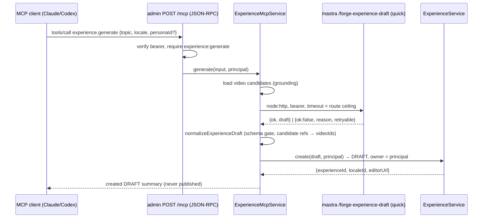

# feat: Experience create + generate tools for the JFP Admin MCP

## Summary

Extend the shipped JFP Admin MCP (PR #1645) with two experience-level primitives — `experience.create` (client-supplied draft → new DRAFT Experience via `ExperienceService.create`) and `experience.generate` (server-side: video candidates → mastra quick-draft → normalize → DRAFT) — plus two new OAuth scopes in apps/auth, gated behind a feat-286 roadmap ticket that Tataihono approves before implementation. Generation reuses the existing hardened admin→mastra pipeline; no new mastra routes, no publish-path changes, no bulk operations.

---

## Problem Frame

The Bulk Locale Factory MCP (feat-276, see origin) deliberately scoped to locales of _existing_ Experiences and left "full Experience Editor MCP parity" as a future path its tools should be shaped to grow into. Tataihono has asked for exactly that next slice: generating brand-new Experiences through the MCP avenue instead of building more generation UI inside the admin app, with "translate the homepage into ~50 languages" as the driving workload. Today no MCP tool can create an Experience, and the AI-generation pipeline (quick-draft, personas, exemplars, normalization) is reachable only from admin's editor UI and operator scripts.

---

## Requirements

- R1. An MCP client with the new `experience:create` scope can create a new Experience with an initial DRAFT `ExperienceLocale` from a client-supplied draft (locale, slug, title, blocks, optional meta), validated by the same schemas as the editor (a deliberate scope expansion beyond origin R21, which covered ExperienceLocale drafts of existing Experiences only — new experience-level capability requested by Tataihono).
- R2. An MCP client with the new `experience:generate` scope can request a server-side AI-generated Experience from `{topic, locale, personaId?, exemplarExperienceId?}`; the result is staged as a DRAFT Experience, never published.
- R3. Neither tool publishes or implies publish authority; publishing remains exclusively `experience.locale.publish` + `experience:publish` + explicit user instruction + ABAC (origin R5, R26, R34 preserved).
- R4. Both tools are primitives; there is no bulk-create or bulk-generate server operation — fan-out (e.g., many topics or languages) stays in the client agent loop (origin R23).
- R5. Every write passes OAuth per-tool scope checks AND admin ABAC; the created Experience is owned by the delegated principal, and revisions record MCP/AI provenance with the delegated user identity (origin R28, R32).
- R6. Payloads and request rates stay bounded, with byte ceilings sized for non-Latin scripts (origin R31).
- R7. The `experience.generate` call completes (success or clean typed failure) within the production transport ceiling — Cloudflare's ~100s proxy window in front of admin.
- R8. Roadmap ticket feat-286 is authored and Tataihono signs off before implementation units land (the proposal-first working agreement).

**Origin flows preserved:** the locale-factory loop (missing → read → translate → validate → media.check → create/update → publish-on-instruction) is untouched; the new tools compose with it (a generated Experience becomes a source the locale loop can translate).

---

## Scope Boundaries

- No publish-path changes and no auto-publish from either new tool.
- No bulk operations server-side; no hidden orchestration loops in admin.
- No new mastra routes and no persona roster changes — mastra's existing `/forge-experience-draft` and `/forge-experience-variant` are reused as-is.
- No admin editor UI changes.
- No changes to the 12 existing MCP tools' contracts.
- No GraphQL schema changes (service-layer only; the MCP bypasses Pothos).

### Deferred to Follow-Up Work

- Locale-key serving validation (a created/translated locale like `fr-FR` or `french` publishes but never renders because web's `watchSetting` requires an exact UI-locale key): separate ticket against `experience.locale.validate`.
- `isHomepage` inheritance when translating homepage Experiences: separate ticket for the locale-factory surface.
- Optimistic-concurrency guard on `ExperienceService.updateLocale` (MCP update path is last-write-wins today): separate ticket; port of the `applyChatMutation` guard.
- Per-tool rate/budget controls for paid-token generation abuse (beyond the existing per-principal 120/min bucket): revisit after real usage data; see `docs/solutions/architecture-patterns/rate-limit-bucket-key-availability-not-abuse-ceiling.md`.
- A persona-list MCP read tool (bearer-gated mastra route over `listPersonaSummaries`) if agent-side persona discovery proves needed.
- `/ce-compound` capture of the admin→mastra transport learnings (#1339 node:http bypass, #1342 `resolveTimeoutMs`) which currently have no dedicated docs/solutions entry.

---

## Context & Research

### Relevant Code and Patterns

- `apps/admin/src/mcp/admin-mcp-tools.ts` — tool catalogue (`ADMIN_MCP_TOOLS`); new tools register here with name, description, `requiredScopes`, JSON input schema.
- `apps/admin/src/app/mcp/route.ts` — JSON-RPC endpoint; `callAdminMcpTool()` dispatch if-chain; rate limit 120/min; 64KB body cap; typed JSON-RPC error mapping (Zod → -32602, Forbidden → -32003, NotFound → -32004).
- `apps/admin/src/services/experience-locale-mcp.service.ts` — service layer behind the 12 existing tools; per-tool Zod input schemas; writes delegate to `ExperienceService`.
- `apps/admin/src/services/experience.service.ts` — `create()` already exists (new Experience + initial locale, caller becomes owner, `write:experiences` check, `BlocksSchema` validation, ContentRevision snapshot).
- `apps/admin/src/app/dashboard/experiences/.../generate-variant-action.ts` and `apps/admin/src/scripts/generate-persona-variants.ts` — the exact generation composition to lift: `loadExperienceAiVideoCandidates` → `launchMastraExperienceVariant`/draft client → `normalizeExperienceDraft` → `ExperienceService.create` as DRAFT.
- `apps/admin/src/services/experience-ai/` — `experience-ai-normalize.ts` (`normalizeExperienceDraft`, the block gate), `experience-ai-exemplar-outline.ts` (`buildExemplarOutline`, sanitized source steering), candidates loader.
- Admin→mastra client pattern: node:http (not fetch — Next-patched fetch fails over Railway private networking, PR #1339), typed no-throw envelopes (`config_missing | auth_failed | network_error | parse_error | timeout | generation_failed | invalid_input`), `resolveTimeoutMs` guard (PR #1342), timeout envs `MASTRA_DRAFT_TIMEOUT_MS` / `MASTRA_VARIANTS_TIMEOUT_MS` in `apps/admin/src/config/env.ts`.
- `apps/auth/src/domain/scopes.ts` (AUTH_SCOPES registry — `assertKnownScopes` throws on unknown scopes) and `apps/auth/src/domain/apps.ts` (`ADMIN_MCP_APP_SEED`, `ADMIN_MCP_DEFAULT_SCOPES`).
- `plugins/jfp-admin/skills/forge-bulk-locale-factory/SKILL.md` — the client-side workflow contract the new tools should be documented alongside.
- Mastra routes (unchanged, reused): `/forge-experience-draft` (mode `quick|multi`), `/forge-experience-variant` (persona roster in `apps/mastra/src/config/personas/persona-roster.ts`); bearer via `MASTRA_SERVICE_API_KEYS` (timing-safe compare in `apps/mastra/src/server/service-bearer.ts`).

### Institutional Learnings

- `docs/solutions/architecture-patterns/oauth-protected-mcp-tool-parity-pattern-20260721.md` — tool definition, dispatch, service method, and scope must change together; every advertised write needs a per-tool scope + service-layer authz.
- `docs/solutions/best-practices/outbound-timeout-shorter-than-caller-budget-20260506.md` + `docs/solutions/runtime-errors/mastra-launch-timeout-env-string-network-error.md` — explicit admin-side timeout strictly below the transport ceiling, typed TimeoutError, numeric coercion + guard on timeout envs.
- `docs/solutions/architecture-patterns/smart-crop-three-app-decomposition-20260610.md` — mastra calls are bounded synchronous decision calls; config-shaped upstream failures degrade to clean errors, never hangs.
- `docs/solutions/best-practices/buffered-http-response-byte-cap-oom-guard-20260629.md` — byte-cap the buffered mastra response; size caps at 3 bytes per UTF-16 code unit; near-cap CJK fixture.
- `docs/solutions/graphql/pothos-relation-abac-filter-required-for-nested-types.md` — ABAC lives in the service layer; every access path (including MCP, which bypasses GraphQL) must re-apply it.
- `docs/solutions/runtime-errors/required-env-var-without-default-broke-railway-deploy-20260511.md` — any new env var must be `.optional()` with runtime fallback; generation config absence surfaces as a `config_missing` tool error, not a deploy brick.
- `docs/solutions/best-practices/mocked-shape-vs-real-contract-discipline-20260506.md` — typed-discriminator branches (failure envelopes) each need a test only that branch can satisfy; bearer-seam call sites need no-seam source pins.
- `docs/solutions/best-practices/nextjs-server-action-llm-structured-output-pattern-2026-04-21.md` — never trust the model's draft shape; re-validate server-side before persistence (`normalizeExperienceDraft` stays mandatory).
- `docs/solutions/workflow-issues/ce-code-review-tier-2-mandatory-before-push-20260511.md` — auth scopes + public API surface ⇒ Tier-2 review before push.

---

## Key Technical Decisions

- **Server-side generation reusing the existing pipeline** (user-confirmed): `experience.generate` composes candidates → mastra → normalize → create inside admin, rather than having the MCP client's model author blocks. Rationale: reuses hardened grounding (candidate allowlist prevents invented video IDs, satisfying origin R12), personas, exemplars, coercion, and the min-blocks floor — quality machinery a client-side loop would forfeit.
- **Quick mode pinned for v1**: the multi-step draft workflow (~180s mastra budget) cannot fit Cloudflare's ~100s proxy window in front of `admin.jesusfilm.org`; quick mode (~60s mastra budget, 75s admin default timeout) fits with margin. Mode is not client-selectable in v1.
- **Timeout chain ordered end-to-end**: mastra internal budget < admin→mastra client timeout < ~100s transport ceiling, so mastra's clean typed timeout envelope always wins the race and the MCP caller gets a structured failure, never a severed connection.
- **Two separate scopes** (`experience:create`, `experience:generate`): generation spends paid AI tokens and can be granted or revoked independently of plain creation. Both join `ADMIN_MCP_DEFAULT_SCOPES` for trusted operators, mirroring how the eight existing scopes ship.
- **Ownership and provenance**: the created Experience's owner is the delegated MCP principal (EDITORs can then edit/publish their own creations under existing ABAC); generate-path revisions record AI provenance with the delegated user identity, mirroring the locale-factory provenance decision (origin R32).
- **`personaId` passthrough**: optional, validated by mastra's roster (single source of truth); an unknown persona returns mastra's `invalid_input` envelope mapped to a clear tool error. No admin-side mirror is added.
- **New sibling service** (`experience-mcp.service.ts`) for experience-level tools rather than growing the locale-focused service: keeps each service's Zod-schema surface cohesive; mirrors the existing service's shape exactly. (Implementer may fold into the existing service if that proves simpler — the boundary, not the filename, is the decision.)
- **Byte ceilings sized for non-Latin scripts**: request draft ceiling stays within the existing 64KB route cap (precedent: `experience.locale.create` accepts full blocks today); the buffered mastra response gets an explicit byte cap sized at 3 bytes per UTF-16 code unit against a contract-derived worst case.

---

## Open Questions

### Resolved During Planning

- Where does generation run? — Server-side in admin, reusing the existing pipeline (user decision; see Key Technical Decisions).
- Does the MCP route need special duration config? — No Vercel-style `maxDuration` applies on Railway; the binding ceiling is Cloudflare's ~100s proxy window, handled by the timeout chain.
- Next roadmap ID? — feat-286 (285 is the current highest).
- Is a new mastra credential needed? — No; the existing `MASTRA_SERVICE_API_KEY` caller-side single key is reused (cross-app trigger pattern).

### Deferred to Implementation

- Exact input schema field names for `experience.generate` (topic vs prompt, exemplar parameter name): finalize against the mastra route's request schema at implementation time.
- Whether `experience.create` should also accept `metaDescription`/OG fields in v1 or route them through a follow-up `updateLocale` call: decide from `ExperienceService.create`'s actual input surface.
- The precise response byte-cap number for the mastra draft read: derive from `GENERATION_MIN_BLOCKS`/max-blocks contract at implementation time using the 3 B/unit rule.

---

## High-Level Technical Design

> _This illustrates the intended approach and is directional guidance for review, not implementation specification. The implementing agent should treat it as context, not code to reproduce._

`experience.create` is the same shape minus the candidates/mastra/normalize hops — client draft straight into the `BlocksSchema` gate inside `ExperienceService.create`.

---

## Implementation Units

### U1. Roadmap ticket feat-286 and proposal to Tataihono

**Goal:** Author the roadmap ticket proposing both tools and their scopes; obtain Tataihono's sign-off. This is the gate for all later units.

**Requirements:** R8, R3, R4

**Dependencies:** None

**Files:**

- Create: `docs/roadmap/topic-experiences/feat-286-experience-create-generate-mcp.md`

**Approach:**

- Follow the repo's feature-file format (frontmatter: id feat-286, owner ekkasit, lane = directory, no lane field; agent-optimized body with Entry Points, Grep These, What To Build, Constraints, Verification).
- Constraints section carries forward: primitives-only, DRAFT-only, publish never implied, quick-mode-only generation, scope pair rationale.
- Share with Tataihono for sign-off before U2+ begins; record his ruling in the ticket.

**Test scenarios:**

- Test expectation: none — documentation/roadmap unit; the viewer app's frontmatter normalization is the only machine consumer (valid YAML per roadmap rules).

**Verification:**

- Ticket renders in the roadmap viewer without frontmatter errors; Tataihono has approved (Slack or PR comment referenced in the ticket).

---

### U2. OAuth scopes in apps/auth

**Goal:** Register `experience:create` and `experience:generate` scopes and add them to the trusted Admin MCP grant.

**Requirements:** R1, R2, R5

**Dependencies:** U1 (sign-off)

**Files:**

- Modify: `apps/auth/src/domain/scopes.ts`
- Modify: `apps/auth/src/domain/apps.ts` (ADMIN_MCP_DEFAULT_SCOPES / seed)
- Test: `apps/auth/src/domain/scopes.test.ts`, `apps/auth/src/domain/apps.test.ts`

**Approach:**

- Mirror the eight existing MCP scopes: clear consent labels/descriptions; `assertKnownScopes` acceptance; grant composition keeps publish isolated (creating/generating never implies `experience:publish`).

**Patterns to follow:**

- The feat-276 Unit 1 scope work (same files, same test shapes).

**Test scenarios:**

- Happy path: both new scopes validate as known scopes with consent metadata present.
- Happy path: the Admin MCP default grant includes both new scopes.
- Edge case: a grant with `experience:create` but not `experience:publish` remains valid and publish stays excluded (scope-isolation invariant).
- Error path: an unknown scope string (e.g. `experience:creat`) still throws in `assertKnownScopes` (guards against typo'd registration).

**Verification:**

- Auth package tests pass; scopes appear in the protected-resource `scopes_supported` union once U3/U5 tool definitions land (derived automatically from the tool registry).

---

### U3. `experience.create` tool

**Goal:** MCP clients can create a new DRAFT Experience from a supplied draft.

**Requirements:** R1, R3, R4, R5, R6

**Dependencies:** U1, U2

**Files:**

- Create: `apps/admin/src/services/experience-mcp.service.ts`
- Create: `apps/admin/src/services/experience-mcp.service.test.ts`
- Modify: `apps/admin/src/mcp/admin-mcp-tools.ts` (tool definition + requiredScopes `["experience:create"]`)
- Modify: `apps/admin/src/app/mcp/route.ts` (dispatch branch)
- Test: `apps/admin/src/app/mcp/route.test.ts`

**Approach:**

- Zod input schema mirroring `ExperienceService.create`'s surface (locale, slug, title, blocks, optional meta); the service method re-checks `write:experiences` ABAC via `ExperienceService.create` and returns `{experienceId, localeId, status: "DRAFT", editorUrl}`.
- Slug conflicts and validation failures map to the route's existing typed JSON-RPC error taxonomy (Zod → -32602; conflicts reported with the existing locale id, mirroring the locale-factory idempotency convention).
- Provenance: revision recorded against the delegated principal (MCP-originated).

**Patterns to follow:**

- `experience.locale.create` end-to-end (tool def → dispatch → service → `ExperienceService`), per the parity pattern doc.
- `apps/admin/src/scripts/apply-experience-from-json.ts` for the create-call composition (synthetic principal swapped for the real one).

**Test scenarios:**

- Happy path: valid draft with blocks → DRAFT Experience created, owner = delegated principal, revision snapshot exists, response carries ids + editor URL.
- Happy path (integration): created Experience is immediately readable via `experience.locale.read` and validates via `experience.locale.validate` (tools compose).
- Edge case: near-64KB blocks payload in a 3-byte script (e.g. `"あ"`-heavy fixture) is accepted (cap sized for non-Latin content).
- Edge case: duplicate slug for the same locale → conflict error naming the existing resource, no partial write.
- Error path: token without `experience:create` → -32003 insufficient-scope naming the required scope; nothing persisted.
- Error path: principal mapped to a user with neither ADMIN nor EDITOR role → auth failure before dispatch.
- Error path: blocks failing `BlocksSchema` → -32602 with actionable validation output; nothing persisted.
- Integration: created DRAFT is invisible to web (`watchSetting`/manifest untouched — no publish side effects fired).

**Verification:**

- Route + service tests pass; a real MCP client (Claude Code against local admin) can create a draft visible in the dashboard editor, and nothing appears on the public site.

---

### U4. `experience.generate` tool

**Goal:** MCP clients can request a server-side AI-generated DRAFT Experience.

**Requirements:** R2, R3, R4, R5, R6, R7

**Dependencies:** U1, U2, U3 (shares the service + registration seam)

**Files:**

- Modify: `apps/admin/src/services/experience-mcp.service.ts`
- Modify: `apps/admin/src/mcp/admin-mcp-tools.ts` (tool definition + requiredScopes `["experience:generate"]`)
- Modify: `apps/admin/src/app/mcp/route.ts` (dispatch branch)
- Modify: `apps/admin/src/config/env.ts` (only if a generate-specific timeout env is needed; `.optional()` with runtime default)
- Test: `apps/admin/src/services/experience-mcp.service.test.ts`, `apps/admin/src/app/mcp/route.test.ts`

**Approach:**

- Compose the proven chain from `generate-variant-action.ts` / `generate-persona-variants.ts`: `loadExperienceAiVideoCandidates` → mastra client (quick mode; `/forge-experience-variant` when `personaId` present, `/forge-experience-draft` otherwise) → `normalizeExperienceDraft` → `ExperienceService.create` as DRAFT.
- Reuse the existing node:http client and typed envelopes; map each failure reason to a distinct, actionable tool error (`config_missing` → "generation not configured on this environment"; `timeout` → retryable-flagged failure; `invalid_input` → -32602). Unset `MASTRA_BASE_URL`/`MASTRA_SERVICE_API_KEY` must short-circuit cleanly — never a deploy-time requirement.
- Enforce the timeout chain: admin client timeout (numeric-coerced, guarded) strictly below the ~100s transport ceiling; mastra quick budget already below the client timeout.
- Byte-cap the buffered mastra response per the OOM-guard law; over-cap maps to the existing graceful `parse_error`-family failure, never a throw; the caught error is never logged raw.
- Optional `exemplarExperienceId`: resolves through `buildExemplarOutline` (sanitized steering) with ABAC read check on the source.

**Execution note:** Test-first on the failure-envelope mapping — each typed reason branch needs a test only that branch can satisfy (mocked-shape vs real-contract discipline).

**Patterns to follow:**

- `generate-variant-action.ts` (injectable core with `{loadCandidates, launchVariant, persist}` overrides — mirror this injectability so the service method is testable DB/network-free).
- The deterministic mastra-route testing pattern (tiny real timers for abort mechanics; fake timers can't intercept `AbortSignal.timeout`).

**Test scenarios:**

- Happy path: `{topic, locale}` → candidates loaded, mastra envelope `{ok, draft}` normalized and persisted as DRAFT owned by the principal; response carries ids + editor URL + AI provenance marker.
- Happy path: `personaId` from the roster routes through the variant path and steers the prompt (asserted via the injected launcher's captured request).
- Error path: missing `experience:generate` scope → -32003 naming the scope; no candidates loaded, no mastra call.
- Error path: `MASTRA_BASE_URL` unset → `config_missing` tool error, no network call attempted, admin boots fine without the env (`.optional()` proof).
- Error path: mastra `{ok:false, reason:"timeout", retryable:true}` → tool failure marked retryable; nothing persisted.
- Error path: unknown `personaId` → mastra `invalid_input` mapped to -32602 with the persona named.
- Error path: draft failing `normalizeExperienceDraft` (off-grounding video ref / below min-blocks) → typed normalization error surfaced, nothing persisted.
- Edge case: mastra response exceeding the byte cap → socket cancelled, graceful failure envelope, no OOM, caught error not logged raw.
- Edge case: timeout env supplied as a string (t3-env skipValidation path) → coerced/guarded, no instant `AbortSignal.timeout` throw misclassified as network_error.
- Integration: generated DRAFT is readable via `experience.locale.read` and passes `experience.locale.validate`; web surfaces unaffected (no publish side effects).

**Verification:**

- Full suite passes; from a real MCP client against local admin (with mastra running), `experience.generate` returns a draft grounded in real videos within the quick-mode budget; with mastra stopped, the tool fails with `config_missing`/network errors cleanly and admin stays healthy.

---

### U5. Onboarding, docs, and rollout notes

**Goal:** Make the new tools discoverable and operationally safe: skill/docs updates, deploy-order note, roadmap status.

**Requirements:** R8 (closure), R3 (documented gates)

**Dependencies:** U3, U4

**Files:**

- Modify: `plugins/jfp-admin/skills/forge-bulk-locale-factory/SKILL.md` (or a sibling skill reference) — document the create/generate primitives and the "generate → then translate via the locale loop" composition
- Modify: `apps/admin/src/app/dashboard/mcp/page.tsx` (starter prompts, only if the page enumerates tools)
- Modify: `apps/admin/CLAUDE.md` (MCP section: new tools + scopes)
- Modify: `docs/roadmap/topic-experiences/feat-286-experience-create-generate-mcp.md` (status flip on completion)

**Approach:**

- Document the deploy order: auth (scopes + grant) deploys FIRST, then admin (tools) — mirrors the receiver-first keyring pattern; existing OAuth grants lack the new scopes until users re-authenticate, so the docs must say "re-auth to pick up the new consent".
- Keep the skill's publish-gate language untouched; the new tools never publish.

**Test scenarios:**

- Test expectation: none — documentation and onboarding copy; U3/U4 route tests already pin `tools/list` advertising the new tools.

**Verification:**

- `/dashboard/mcp` copy matches shipped tool names; CLAUDE.md documents both scopes; roadmap ticket status reflects reality; re-auth note present.

---

## System-Wide Impact

- **Interaction graph:** New dispatch branches in the MCP route only; `ExperienceService.create` gains no new behavior (existing ABAC/revision/validation path). Mastra sees a new caller of two existing routes — no mastra changes.
- **Error propagation:** Mastra's typed envelopes → service → JSON-RPC typed errors; timeouts always resolve inside the transport window so MCP clients never see severed connections. Config absence is a runtime tool error, never a boot failure.
- **State lifecycle risks:** All writes are single-transaction DRAFT creates with revision snapshots; no publish side effects (no ISR webhook, no manifest refresh, no embedding dispatch) fire from either tool. Failed generation persists nothing.
- **API surface parity:** `tools/list`, dispatch, service methods, and auth scopes must land together per the parity pattern; `scopes_supported` metadata derives automatically. No GraphQL/codegen surfaces are touched, so no drift jobs fire.
- **Integration coverage:** Route-level tests must prove scope enforcement happens BEFORE dispatch for both tools, and that a created/generated draft is consumable by the existing locale tools (compose test in U3/U4).
- **Unchanged invariants:** The 12 existing tools' contracts; publish gating (scope + explicit instruction + ABAC); the 120/min per-principal rate bucket; the 64KB request cap; admin's editor and operator-script generation paths.

---

## Risks & Dependencies

| Risk                                                                           | Mitigation                                                                                                                                                                                                                                                                                         |
| ------------------------------------------------------------------------------ | -------------------------------------------------------------------------------------------------------------------------------------------------------------------------------------------------------------------------------------------------------------------------------------------------- |
| Quick-mode generation occasionally exceeds the ~100s transport window          | Timeout chain caps admin-side wait below the window; mastra's typed timeout wins; failure is marked retryable so the client agent retries — never a hung call. If real-world p95 creeps up, the deferred async-job shape (smart-crop decomposition law) is the escape hatch, not a longer timeout. |
| Paid-token abuse via `experience.generate`                                     | Separate scope (revocable independently), per-principal 120/min bucket applies today; per-tool budget control explicitly deferred with a named follow-up.                                                                                                                                          |
| Scope deploy-order gap (admin advertises tools whose scopes auth doesn't know) | U2 (auth) lands and deploys before U3/U4 (admin); documented in U5; existing tokens simply lack the scope → clean insufficient-scope errors until re-auth.                                                                                                                                         |
| Generated drafts leak past grounding (invented video IDs)                      | `normalizeExperienceDraft` remains the mandatory gate — candidate-ref resolution rejects off-grounding refs (origin R12 preserved server-side).                                                                                                                                                    |
| Tatai rejects or reshapes the proposal after planning                          | U1 is the gate; only ticket-authoring effort is spent before sign-off. The plan's units are independently droppable (e.g., ship create without generate).                                                                                                                                          |
| Non-Latin payloads tripping byte ceilings                                      | 3 B/code-unit sizing rule + near-cap CJK fixtures in both tools' tests.                                                                                                                                                                                                                            |

---

## Documentation / Operational Notes

- Deploy order: apps/auth first (scopes + grant seed), then apps/admin (tools). Users re-authenticate their MCP clients to pick up the new consent scopes.
- No new required env vars; generation config (`MASTRA_BASE_URL`, `MASTRA_SERVICE_API_KEY`) is already optional and its absence degrades to `config_missing` tool errors.
- Tier-2 `/ce-code-review` is mandatory before push (auth scopes + public API surface triggers).
- After landing: run `/ce-compound` for the admin→mastra transport learnings capture gap noted in Deferred follow-ups.

---

## Sources & References

- **Origin document:** [docs/brainstorms/2026-07-21-bulk-locale-factory-mcp-requirements.md](docs/brainstorms/2026-07-21-bulk-locale-factory-mcp-requirements.md)
- Parent plan: [docs/plans/2026-07-21-001-feat-bulk-locale-factory-mcp-plan.md](docs/plans/2026-07-21-001-feat-bulk-locale-factory-mcp-plan.md)
- Parent ticket: [docs/roadmap/topic-experiences/feat-276-bulk-locale-factory-mcp.md](docs/roadmap/topic-experiences/feat-276-bulk-locale-factory-mcp.md)
- Related PRs: #1645 (jfp admin MCP), #1426 (persona-aware variants), #1339/#1342 (admin→mastra transport fixes)
- Pattern doc: `docs/solutions/architecture-patterns/oauth-protected-mcp-tool-parity-pattern-20260721.md`
