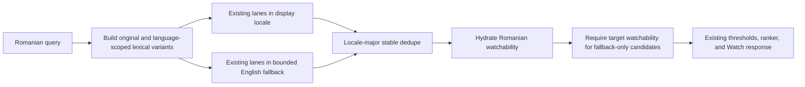

# Watch Romanian Playable Search Inventory - Plan

## Goal Capsule

- **Objective:** Make Romanian Watch title and topic searches discover relevant Romanian-playable inventory even when its searchable evidence exists only in bounded English fallback metadata or transcripts.
- **Product authority:** Linear FGE-3, the Language and Search Language definitions in `CONCEPTS.md`, and the exact/title/entity plus target-watchability requirements in `docs/brainstorms/2026-07-14-universal-multilingual-watch-search-requirements.md`.
- **Execution profile:** Focused Admin search fix with regression coverage for all seven production queries and a Romanian Watch browser smoke.
- **Current production evidence:** On 2026-07-24 the playable route `/watch/jesus.html/romanian.html` rendered Romanian UI and a Romanian play action, while `Isus`, `Iisus`, `JESUS`, `fiul risipitor`, `anxietate`, `iertare`, and `Crăciun` each returned a localized Romanian no-results state.
- **Stop conditions:** Stop if the fix requires a public GraphQL change, a production data mutation, a broad topic-ranking redesign, or a query-to-video-ID pin.
- **Tail ownership:** Complete focused Admin tests and typecheck, verify the Romanian Watch flow in a browser, then review and publish the branch through the normal PR path.

---

## Product Contract

### Problem Frame

The selected search language and playable inventory agree on Romanian, but candidate discovery does not. `WatchSearchService` asks each lexical retriever for only the display locale, and every lexical query requires a published `VideoLocale` in that locale. Watchability is hydrated only after candidates exist. The Romanian `JESUS` dub can therefore be playable while the film never reaches watchability because its searchable title metadata falls back from another locale.

The Romanian UI catalog has already corrected the issue's recovery-copy symptom. The remaining defect is the inventory split: candidate discovery treats target-locale metadata or transcripts as a prerequisite even though the Watch contract treats target-language playability as a separate concern.

### Requirements

- R1. With Romanian selected as the target search language, `JESUS`, `Isus`, and `Iisus` must retrieve a canonical title candidate from bounded fallback metadata and then prove Romanian target-audio watchability.
- R2. The correction must normalize language-scoped Romanian lexical forms to a canonical cross-locale query, not directly to a title record or video ID, so normal exact-title retrieval, visibility filters, ranking, and watchability remain authoritative.
- R3. English fallback may contribute candidates to the existing exact-title, keyword, trigram, and semantic lanes, but fallback-only candidates must qualify for Romanian target audio or subtitles before ranking. Unrelated or unavailable English candidates must not enter the response.
- R4. Candidates from primary and fallback retrieval must be deduplicated by video ID with deterministic locale-major primary-evidence preference.
- R5. Existing deleted, no-index, unpublished-locale, score, evidence, action, pagination, and language-interpretation behavior must remain compatible.
- R6. The localized Romanian no-results recovery state must remain intact only when retrieval finds no relevant Romanian-playable candidate; an empty topic response must never be caused merely by missing Romanian display metadata on an otherwise relevant, playable candidate.
- R7. Regression coverage must include all seven FGE-3 queries: the three title variants as guaranteed `JESUS` results and the four topical queries with both relevant Romanian-playable fallback fixtures and English-only exclusion fixtures.
- R8. No public GraphQL schema, generated types, database migration, or Web search request contract may change.

### Acceptance Examples

- AE1. Given Romanian is the target language and Romanian exact-title metadata returns no candidate, when the query is `JESUS`, then the exact lane checks bounded English fallback metadata, finds the canonical title, hydrates Romanian target audio, and returns `/watch/jesus.html/romanian.html`.
- AE2. Given the same Romanian target context, when the query is `Isus` or `Iisus`, then language-scoped lexical normalization contributes the cross-locale query `JESUS`; the result still comes from the normal exact-title retriever and Romanian watchability hydrator.
- AE3. Given both Romanian and fallback exact-title retrieval return the same video, then only one result is ranked and primary-locale metadata wins.
- AE4. Given `fiul risipitor`, `anxietate`, `iertare`, or `Crăciun` matches bounded English fallback evidence for a Romanian-playable video, then the relevant video is returned with Romanian action language.
- AE5. Given one of those topic queries has no relevant Romanian-playable candidate in the bounded native-plus-English retrieval set, then the response remains empty and the Watch overlay shows its existing Romanian recovery copy.
- AE6. Given English fallback retrieves an otherwise relevant-looking candidate with neither Romanian target audio nor Romanian target subtitles, then the candidate is excluded.
- AE7. Given a non-Romanian target language or an unrelated query, then no Romanian lexical normalization is applied.

### Scope Boundaries

**In scope**

- Admin-owned, language-scoped lexical query normalization.
- A bounded English fallback locale across the existing exact-title, keyword, trigram, and semantic lanes.
- Target-watchability qualification for fallback-only candidates.
- Cross-locale candidate merging, deduplication, lane observability, and watchability.
- Service and pure-helper regression tests covering all seven reported queries.
- A focused Romanian Watch browser smoke.
- A roadmap follow-up record for the production defect.

**Out of scope**

- Topic translation, query rewriting by an LLM, learned ranking, or unbounded cross-locale fan-out.
- New localized video metadata or production database edits.
- Search result card, modal, route, localization-catalog, or GraphQL changes.
- A generic editor/data model for catalog aliases.

---

## Planning Contract

### Key Technical Decisions

- KTD1. **Separate discovery evidence from target playability.** Existing retrieval lanes may inspect one bounded English fallback locale before target-language watchability qualification. This preserves the universal search contract that a playable dub must not require localized evidence in the same language.
- KTD2. **Normalize language vocabulary, never catalog records.** A small Admin-owned helper returns cross-locale query variants for language-scoped lexical forms. It knows neither title records nor database IDs and cannot bypass retriever visibility rules.
- KTD3. **Qualify fallback-only candidates by target watchability.** English fallback exact, metadata, and semantic candidates are eligible only when hydration proves Romanian target audio or target subtitles. Existing relevance and confidence thresholds remain unchanged, preventing arbitrary English results from leaking into Romanian search.
- KTD4. **Prefer primary evidence deterministically.** Execute and merge in locale-major order—every display-locale query variant before every English-fallback variant—and deduplicate by video ID so native evidence remains preferred.
- KTD5. **Retain the public contract.** Reuse the current exact candidate shape, target watchability hydration, ranking, actions, and response fields; no schema or generated output changes.

### Assumptions

- English is the existing server fallback and the catalog's bounded canonical metadata fallback for this slice.
- The target language slug, not the UI locale or BCP-47 code, scopes language-specific lexical normalization.
- `JESUS` is a canonical catalog title query; `Isus` and `Iisus` are Romanian title variants accepted by FGE-3.
- Each topical query may return a relevant video when bounded fallback evidence and Romanian watchability both exist; it may remain empty only when that intersection is empty.
- Existing Romanian `SearchOverlay.noResults` and `SearchOverlay.tryDifferentKeywordsOrLanguage` messages remain the source of recovery UI text.

### High-Level Technical Design

---

## Implementation Units

### U1. Add language-scoped query normalization

- **Goal:** Represent the Romanian lexical forms `Isus` and `Iisus` as the cross-locale name `JESUS` without pinning a catalog record.
- **Requirements:** R1, R2, R7; KTD2.
- **Dependencies:** None.
- **Files:** `apps/admin/src/services/watch-search-query-normalization.ts`, `apps/admin/src/services/watch-search-query-normalization.test.ts`.
- **Approach:** Add a pure helper that normalizes Unicode casing and trims outer whitespace for comparison while preserving the original user query sent to retrieval. It appends deduplicated language-scoped lexical variants. Scope the first vocabulary rule to the canonical Romanian language slug and the Romanian personal-name forms `Isus` and `Iisus`; keep the registry independent of catalog records and video IDs. Do not claim punctuation stripping: exact-word normalization accepts only the complete normalized lexical form.
- **Test scenarios:**
  1. Romanian `Isus` contributes `JESUS` without a title or video identifier.
  2. Romanian `Iisus` contributes `JESUS` without a title or video identifier.
  3. Romanian `JESUS` remains one query variant.
  4. Case and outer whitespace do not change normalization.
  5. Surrounding punctuation does not accidentally trigger the complete-word vocabulary rule.
  6. A non-Romanian target does not apply Romanian normalization.
  7. Each of the four topical queries remains unchanged.
- **Verification:** Focused helper tests prove deterministic, language-scoped lexical variants with no catalog identifiers.

### U2. Add bounded fallback evidence with target-watchability qualification

- **Goal:** Let relevant title and topic candidates reach Romanian watchability even when searchable Romanian metadata or transcript evidence is absent, without leaking unrelated English inventory.
- **Requirements:** R1, R3, R4, R5, R8; KTD1, KTD3, KTD4, KTD5.
- **Dependencies:** U1.
- **Files:** `apps/admin/src/services/watch-search.service.ts`, `apps/admin/src/services/watch-search.service.test.ts`.
- **Approach:** Build an ordered evidence-locale list of the resolved display locale followed by English when distinct. Run the existing exact-title, keyword, trigram, and semantic retrievers over that capped list while preserving every lane's current query form, score threshold, candidate limit, timeout, and degradation behavior. For exact-title query variants, execute locale-major: all display-locale variants before all English-fallback variants. Merge primary candidates before fallback candidates, deduplicate by result ID, and retain enough internal provenance to distinguish fallback-only candidates. Hydrate watchability once per unique video. Exclude fallback-only candidates unless hydration proves `target_audio` or `target_subtitle`; native-evidence candidates retain existing watchability behavior. Preserve public lane/status and response shapes.
- **Test scenarios:**
  1. `JESUS` misses Romanian metadata, matches English exact metadata, and returns target-audio Romanian watchability.
  2. `Isus` and `Iisus` use the cross-locale variant only in Romanian target context and return the same canonical result.
  3. Primary Romanian evidence wins when fallback returns the same video, with locale-major variant ordering explicitly asserted.
  4. Duplicate candidates across locales and lanes hydrate watchability once.
  5. English display locale does not issue duplicate English requests.
  6. Each of `fiul risipitor`, `anxietate`, `iertare`, and `Crăciun` retrieves a relevant fallback metadata or semantic fixture and returns it when Romanian target watchability is present.
  7. Each topical query excludes an equally relevant or stronger English fallback fixture when Romanian target watchability is absent.
  8. A topical query returns an empty response with localized recovery only when neither native evidence nor target-watchable fallback evidence yields a relevant candidate.
  9. Existing metadata and semantic confidence thresholds, candidate caps, evidence labels, result href/action, score, pagination, timeouts, degraded behavior, and lane statuses retain their current contract.
- **Verification:** Focused Watch search service tests reproduce the candidate-before-watchability failure and prove positive and negative outcomes for all seven FGE-3 queries.

### U3. Record and verify the production defect

- **Goal:** Keep Forge's roadmap and operational proof aligned with the Linear fix.
- **Requirements:** R6, R7, R8.
- **Dependencies:** U1, U2.
- **Files:** `docs/roadmap/content-discovery/feat-308-watch-romanian-playable-search-inventory.md`, `docs/roadmap/README.md`.
- **Approach:** Create the next roadmap ticket in progress before implementation, record the exact production symptom and entry points, regenerate the roadmap index, and mark the ticket complete only after validation. Verify the Romanian route and all seven queries against the implementation's runnable browser target; title variants must return the playable `JESUS` result, topic queries must return relevant Romanian-playable candidates when fixtures/evidence provide them, and legitimate empty results must retain Romanian recovery copy.
- **Verification:** Roadmap generation succeeds and browser evidence covers the playable route, the three direct-title guarantees, topical Romanian-playable results where available, and localized recovery where the native-plus-fallback intersection is genuinely empty.

---

## Verification Contract

| Gate                | Applies to | Command                                                                                            | Done signal                                                                                                                                               |
| ------------------- | ---------- | -------------------------------------------------------------------------------------------------- | --------------------------------------------------------------------------------------------------------------------------------------------------------- |
| Query normalization | U1         | `pnpm --filter @forge/admin exec vitest run src/services/watch-search-query-normalization.test.ts` | Romanian lexical variants and unchanged topic queries pass.                                                                                               |
| Search regressions  | U2         | `pnpm --filter @forge/admin exec vitest run src/services/watch-search.service.test.ts`             | All seven FGE-3 queries, bounded fallback, target-watchability filtering, and deduplication pass.                                                         |
| Admin types         | U1, U2     | `pnpm --filter @forge/admin typecheck`                                                             | Service and helper changes compile.                                                                                                                       |
| Roadmap             | U3         | `pnpm --filter roadmap generate:readme`                                                            | The regenerated index includes feat-308.                                                                                                                  |
| Diff audit          | All        | `git diff --check`                                                                                 | No whitespace, schema, generated GraphQL, or unrelated churn.                                                                                             |
| Browser smoke       | U3         | `ce-test-browser mode:pipeline` against the runnable Watch target                                  | Romanian title variants expose playable `JESUS`; topical queries expose Romanian-playable results when available and otherwise retain localized recovery. |

---

## Definition of Done

- `JESUS`, `Isus`, and `Iisus` return the canonical playable Romanian `JESUS` film through normal exact-title retrieval and target-audio hydration.
- The four reported topic queries return relevant Romanian-playable fallback candidates when available, exclude English-only candidates, and retain localized Romanian no-result recovery only when no relevant Romanian-playable candidate is retrieved.
- Fallback evidence fan-out is capped to English, preserves existing lane thresholds and timeouts, is stable, deduplicated, watchability-qualified, and observable.
- No query maps to a video ID and no production data, schema, generated type, or Web request contract changes.
- Focused Admin tests, Admin typecheck, roadmap generation, diff audit, and Romanian browser smoke pass.
- The roadmap ticket is complete, Linear FGE-3 references the PR and proof, and the Linear issue is moved to review.

---

## Appendix

### Sources and Research

- Linear FGE-3 and its attached production Watch URL.
- Production browser evidence captured 2026-07-24 for `/watch/jesus.html/romanian.html` and all seven reported queries.
- `CONCEPTS.md` for canonical Language slug, locale attribute, Search Language, and Watchability vocabulary.
- `docs/brainstorms/2026-07-14-universal-multilingual-watch-search-requirements.md` for exact/title/entity discovery and availability separation.
- `docs/solutions/logic-errors/canonical-language-boundaries-and-lexicographic-search-ranking.md` for current language identity and title-ranking invariants.
- `docs/solutions/best-practices/admin-watch-search-production-rollout-20260720.md` for rollout and production verification boundaries.
- `docs/solutions/ui-bugs/watch-semantic-search-language-metadata-confirmation-race.md` for search-language confirmation and UI race boundaries.
- `docs/roadmap/content-discovery/feat-196-watch-multilingual-search-behavior.md` and `docs/roadmap/platform/feat-254-watch-universal-multilingual-search.md` for completed parent scope.
- `apps/admin/src/services/watch-search.service.ts`, `apps/admin/src/services/hybrid-search-keyword-first-retrievers.ts`, and `apps/admin/src/services/search-watchability.ts` for the current discovery-to-watchability flow.
- `apps/web/src/components/SearchOverlay.tsx` and `apps/web/messages/ro.json` for the already-localized recovery state.
