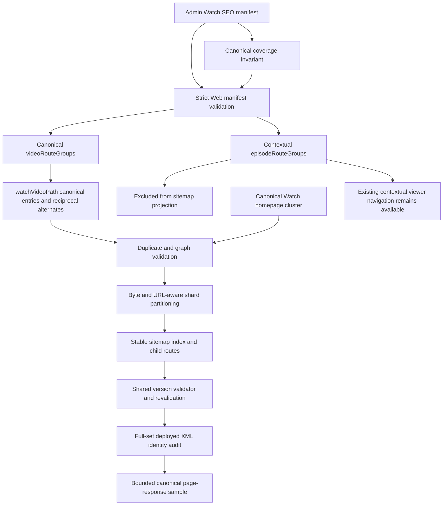

# fix: Remove contextual routes from Watch sitemaps

## Summary

Project Watch sitemap output from canonical standalone Video/language groups
only. Keep contextual parent/child routes available for viewer navigation, but
exclude them from every sitemap `<loc>` and `hreflang` target while preserving
the existing shard limits, graph invariants, and deployment contract.

---

## Problem Frame

FGE-44 found 51,772 contextual collection/segment URLs in the production Watch
sitemaps. Those pages return HTTP 200 but declare the flattened standalone
Video/language URL as canonical, and all 27,600 unique flattened candidates
already appear separately in the sitemap corpus. The sitemap therefore
advertises duplicate route identities and builds reciprocal alternate clusters
around URLs the pages themselves identify as non-canonical.

The source of the mismatch is the Web projection layer. Admin's SEO manifest
contains canonical `videoRouteGroups` for playable Videos and separate
`episodeRouteGroups` for containment context. Web currently renders both
groups, even though Watch metadata uses `watchVideoPath` for canonical identity
and reserves `watchEpisodePath` for contextual in-app navigation.

---

## Requirements

### Canonical sitemap identity

- R1. No contextual parent/child route may appear in a Watch sitemap `<loc>` or
  sitemap `hreflang` target.
- R2. Every eligible standalone Video/language URL must be built with
  `watchVideoPath` and appear exactly once as a `<loc>` across all Watch
  sitemap shards; it may also recur as an alternate target.
- R3. Every emitted localized group must remain self-inclusive and reciprocal,
  with only canonical standalone URLs in the alternate set.
- R4. Canonical collection, feature film, episode, segment, and nested-segment
  Videos must all use the same standalone Video/language sitemap identity.

### Compatibility and viewer behavior

- R5. Contextual Watch routes and all viewer navigation that uses them must
  remain functional and unchanged.
- R6. Web must continue accepting and validating the current Admin SEO manifest
  contract, including legacy `episodeRouteGroups`; the field is ignored only
  when projecting sitemap entries.
- R7. A manifest containing only contextual route groups must still produce the
  canonical Watch homepage cluster and no contextual media entries.

### Sitemap safety and operations

- R8. Existing 35,000,000-byte and 49,999-URL shard ceilings, duplicate
  detection for emitted canonical URLs, XML validity, and controlled 404/503
  behavior must remain intact.
- R9. Duplicate contextual groups must not fail sitemap generation after they
  are excluded, while duplicate emitted canonical groups must continue to fail
  closed.
- R10. Repo-owned audit coverage must detect any contextual route that leaks
  into a sitemap `<loc>` or alternate target across the complete child set.
- R11. Sitemap index and child endpoint shapes, cache behavior, revalidation,
  and bounded error logging must remain stable; shard count and membership may
  change as duplicate contextual entries disappear.
- R12. Admin must reject a manifest build when an emitted contextual
  child/language pair has no matching canonical `videoRouteGroups` entry.
- R13. Before completion, a deployed preview audit must inspect the complete
  sitemap graph and sample at least one canonical page response per shard.

---

## Assumptions

- Admin's `videoRouteGroups` is intended to be the complete canonical source
  for playable Videos, including children that also occur in one or more
  `episodeRouteGroups`. This must be enforced before a manifest is published,
  rather than trusted from query shape alone.
- Retaining `episodeRouteGroups` in the persisted manifest is preferable for
  this fix because removing it would create unnecessary Admin/Web rollout
  coupling. Producer cleanup and version-hash reduction can be evaluated
  separately.
- Google Search Console processing and crawler self-canonical sampling require
  deployed output and operator access. This change will leave a repeatable
  preview/production procedure but will not claim those post-deploy checks
  passed in the pull request.

---

## Key Technical Decisions

- KTD1. **Filter at the Web sitemap projection boundary.** Build sitemap groups
  from `videoRouteGroups` plus the homepage cluster only. This is the narrowest
  point where canonical discovery can be corrected without changing the
  producer contract or viewer routing.
- KTD2. **Do not flatten `episodeRouteGroups`.** Their standalone child URLs
  already exist in `videoRouteGroups`; flattening containment groups would
  recreate duplicates and correctly trigger the existing `duplicate_loc`
  failure.
- KTD3. **Retain strict manifest parsing.** `episodeRouteGroups` remains a
  required, validated field so current snapshots and Admin/Web deployment
  order remain compatible. Ignoring the field applies only after parsing.
- KTD4. **Separate structural and response-level proof.** Generator and route
  tests prove construction. The deployed sitemap auditor checks every `<loc>`
  and alternate target for contextual route shape, while a bounded crawler
  sample separately verifies status, robots, and page-declared canonical
  identity.
- KTD5. **Preserve shard validation after canonical projection.** Uniqueness,
  byte accounting, URL limits, and reciprocal alternate checks continue to
  operate on the emitted canonical set. A smaller or differently partitioned
  child set is an expected result, not an endpoint-contract change.
- KTD6. **Make index/child cache coherence explicit.** Derive the same validator
  from the manifest version for index and child responses, and require
  revalidation so a repartition cannot serve a fresh index with stale child
  XML (or the reverse) through the normal cache window.

---

## High-Level Technical Design

The sitemap and viewer-navigation flows share route data but not route
identity. Standalone Video URLs own canonical discovery; contextual URLs retain
collection state only inside Watch interactions.

---

## Implementation Units

### U1. Establish roadmap traceability and canonical characterization

- **Goal:** Create the required roadmap record and make the current sitemap
  identity defect fail in focused tests before changing projection behavior.
- **Requirements:** R1, R2, R4, R6, R7, R9
- **Dependencies:** None
- **Files:**
  - `docs/roadmap/platform/feat-310-watch-canonical-sitemap-routes.md`
  - `docs/roadmap/README.md`
  - `apps/web/src/lib/watch-sitemap.test.ts`
  - `apps/web/src/app/sitemap.test.ts`
  - `apps/admin/src/services/watch-seo-manifest.service.test.ts`
- **Approach:** Add the next platform roadmap item with FGE-44 as the problem
  source and mark it in progress. Replace the fixture that positively expects
  a contextual sitemap URL with a canonical child group plus matching
  contextual groups, including the same child under multiple parents.
- **Execution note:** Start with failing characterization assertions for both
  entry generation and rendered route XML.
- **Patterns to follow:** Roadmap structure in
  `docs/roadmap/platform/feat-304-watch-sitemap-shard-size-limits.md`; sitemap
  fixtures in `apps/web/src/lib/watch-sitemap.test.ts`.
- **Test scenarios:**
  1. A playable child present in both a canonical Video group and one
     contextual group emits only its standalone URL for each language.
  2. The same child under multiple parents still emits one standalone URL per
     language and does not raise `duplicate_loc`.
  3. A contextual-only manifest produces the two canonical homepage entries
     and no contextual media URL.
  4. Route-level child XML with non-empty `episodeRouteGroups` contains neither
     contextual `<loc>` values nor contextual alternate targets.
  5. Existing canonical duplicate input still produces the typed generation
     failure and controlled route response.
  6. A structurally malformed contextual group still fails strict manifest
     parsing; only structurally valid excluded duplicates bypass emitted URL
     validation.
- **Verification:** The tests distinguish standalone canonical identity from
  contextual navigation identity and fail against the current projection.

### U2. Enforce canonical coverage in Admin

- **Goal:** Prevent a future producer change from making contextual-only
  playable children disappear from canonical discovery.
- **Requirements:** R2, R4, R12
- **Dependencies:** U1
- **Files:**
  - `apps/admin/src/services/watch-seo-manifest.service.ts`
  - `apps/admin/src/services/watch-seo-manifest.service.spec.ts`
- **Approach:** Before persisting a generated manifest, compare every
  contextual child/language pair with the independently built canonical Video
  group set. Fail generation with a bounded diagnostic when coverage is
  incomplete.
- **Test scenarios:**
  1. Every contextual child/language pair has a canonical group and succeeds.
  2. A contextual child missing entirely from canonical groups fails.
  3. A child with one canonical language missing fails with the child and
     language identified.
- **Verification:** Admin cannot publish a manifest whose contextual entries
  are the only discovery path for a playable child.

### U3. Project canonical-only Watch sitemap groups

- **Goal:** Stop contextual route groups from contributing entries to either
  the entry helper or chunk renderer.
- **Requirements:** R1, R2, R3, R4, R6, R7, R8, R9, R11
- **Dependencies:** U1, U2
- **Files:**
  - `apps/web/src/lib/watch-sitemap.ts`
  - `apps/web/src/lib/watch-sitemap.test.ts`
- **Approach:** Remove sitemap-local construction through
  `watchEpisodePath`. Have both public entry generation and internal chunk
  group generation consume only canonical `videoRouteGroups`, then append the
  existing homepage group. Leave manifest parsing, caching, revalidation,
  route handlers, and the global route builder untouched.
- **Patterns to follow:** `videoHref` and `watchVideoPath` as the existing
  canonical route construction path; `groupEntries` and `groupForAlternates`
  for one shared reciprocal alternate projection.
- **Test scenarios:**
  1. Collection, feature-film, episode, segment, and nested-segment fixtures
     all produce the two-segment standalone Video/language shape.
  2. Multiple locale alternates contain themselves and the same canonical
     reciprocal set.
  3. Every generated chunk is inspected and contains no contextual URL in
     either `loc` or serialized alternate XML.
  4. Duplicate canonical Video groups still fail closed.
  5. Duplicate structurally valid contextual groups do not enter emitted
     duplicate validation after strict manifest parsing has succeeded.
  6. URL-count and UTF-8 byte boundaries still partition only between complete
     canonical entries.
- **Verification:** Entry and chunk tests prove the canonical-only projection
  while all FGE-17 size, uniqueness, and reciprocal-set tests remain green.

### U4. Audit structural exclusion and sampled response identity

- **Goal:** Make the deployed sitemap audit fail if any contextual route
  reappears in a child sitemap.
- **Requirements:** R1, R3, R10, R11, R13
- **Dependencies:** U3
- **Files:**
  - `apps/web/src/lib/watch-sitemap-audit.ts`
  - `apps/web/src/lib/watch-sitemap-audit.test.ts`
  - `apps/web/src/lib/watch-url-probe.ts`
  - `apps/web/src/lib/watch-url-probe.test.ts`
  - `apps/web/scripts/audit-watch-sitemap.ts`
- **Approach:** Classify Watch sitemap URLs against the public route contract
  and report a bounded diagnostic when a three-segment contextual media route
  appears as a `<loc>` or alternate target. Use an environment-free classifier
  that parses absolute URLs, verifies the configured origin and `/watch` base
  path, then classifies the remaining public route segments; do not import the
  env-coupled route module into the audit. Apply the check while the auditor
  processes every referenced child. Extend the existing URL probe to
  deterministically sample at least one canonical page per shard with a
  representative crawler request, without adding network work to sitemap
  request handling or logging full payloads.
- **Patterns to follow:** Existing typed issue codes and full-child aggregation
  in `WatchSitemapAuditSession`; public route shapes documented in
  `apps/web/src/lib/routes.ts`.
- **Test scenarios:**
  1. A canonical homepage, localized homepage, and standalone Video/language
     graph passes the identity check.
  2. A contextual route in `<loc>` fails with the new diagnostic.
  3. A canonical `<loc>` whose alternate set contains a contextual target also
     fails.
  4. A contextual leak in a later shard is detected even when the first shard
     is canonical.
  5. Malformed external URLs continue through existing XML/graph diagnostics
     without throwing from route classification.
  6. Page-response samples verify 200 status, indexability, and a self-canonical
     page identity independently of the XML route-shape rule.
- **Verification:** The pure audit suite proves complete-child coverage, and a
  deployed audit can establish zero contextual sitemap URLs alongside the
  existing size and graph report.

### U5. Preserve index/child cache coherence

- **Goal:** Prevent a fresh repartitioned index from being paired with stale
  child XML during rollout or revalidation.
- **Requirements:** R8, R11
- **Dependencies:** U3
- **Files:**
  - `apps/web/src/app/sitemap/route.ts`
  - `apps/web/src/app/sitemap.test.ts`
  - `apps/web/src/app/sitemap/[id]/route.ts`
  - `apps/web/src/app/sitemap/[id]/route.test.ts`
- **Approach:** Return a shared manifest-version-derived validator from index
  and child routes and require cache revalidation. Preserve endpoint paths,
  controlled failures, and bounded logs.
- **Test scenarios:**
  1. Index and child responses for the same manifest expose the same validator.
  2. Both endpoints require revalidation rather than serving a repartitioned
     response for the old five-minute freshness window.
  3. Conditional and controlled failure behavior remains intact.
- **Verification:** Route tests demonstrate one coherent manifest version at
  both layers throughout cache revalidation.

### U6. Preserve contextual UX and close pre-merge evidence

- **Goal:** Close the implementation without weakening viewer navigation or
  overstating deployment-only SEO evidence.
- **Requirements:** R5, R8, R11, R13
- **Dependencies:** U4, U5
- **Files:**
  - `apps/web/src/lib/experience-metadata.test.ts`
  - `apps/web/src/app/[locale]/[htmlLang]/[...rest]/__tests__/page-routing.test.tsx`
  - `apps/web/src/components/watch/__tests__/SiblingCarousel.test.tsx`
  - `apps/web/src/components/watch/__tests__/SeriesEpisodeCard.test.tsx`
  - `apps/web/src/components/watch/__tests__/SeriesEpisodesGrid.test.tsx`
  - `apps/web/src/components/watch/__tests__/LanguagePickerModal.test.tsx`
  - `docs/roadmap/platform/feat-310-watch-canonical-sitemap-routes.md`
  - `docs/roadmap/README.md`
- **Approach:** Run the existing canonical metadata and contextual navigation
  regression suites without changing their behavior. Record preview and
  production audit steps, representative Googlebot self-canonical sampling,
  and Search Console revalidation as post-deploy evidence in the roadmap item.
  Treat the complete preview audit and per-shard response sample as a
  pre-completion gate; if no production-equivalent preview is available, leave
  the roadmap item in progress and report the blocker rather than weakening
  acceptance.
- **Patterns to follow:** Completion and post-deploy evidence split in
  `docs/roadmap/platform/feat-304-watch-sitemap-shard-size-limits.md`.
- **Test scenarios:** Test expectation: none -- this unit runs existing
  behavioral regression suites and records operational follow-up; U1-U3 add
  the new feature-bearing coverage.
- **Verification:** Existing contextual links still use the three-segment route,
  contextual metadata still declares the standalone canonical, sitemap routes
  retain their HTTP behavior, and the roadmap distinguishes completed code
  from pending deployed-console evidence.

---

## Scope Boundaries

### In scope

- Canonical-only Watch sitemap entry and alternate projection.
- Full-output audit detection for contextual sitemap leaks.
- Focused route, generator, metadata, and navigation regression coverage.
- Roadmap traceability and post-deploy validation procedure.

### Deferred to Follow-Up Work

- Removing `episodeRouteGroups` from Admin generation, snapshot storage,
  version hashing, and the Web manifest contract.
- Google Search Console submission and processed-count reconciliation after
  normal deployment.

### Out of scope

- Removing, redirecting, or changing the public contextual Watch route shape.
- Changing page canonical, Open Graph, JSON-LD, share, or in-app link behavior.
- Reintroducing page-head Watch `hreflang`.
- Changing the canonical Watch host, sitemap endpoint paths, or FGE-17 safety
  ceilings.
- Publishing local worktree code directly to production.

---

## System-Wide Impact

- **Data flow:** Admin continues generating the same manifest snapshot. Web
  validates the same payload but projects fewer route groups into sitemap XML.
- **Crawler behavior:** The index references fewer or differently partitioned
  children; every remaining media entry represents its page's standalone
  canonical identity.
- **Viewer behavior:** No viewer route, page resolver, carousel, language
  picker, share action, or metadata builder changes.
- **Failure behavior:** Structurally malformed manifests still fail to load;
  duplicate emitted canonical URLs and invalid shard limits still return
  controlled unavailable responses. Structurally valid ignored contextual
  duplicates no longer poison generation.
- **Performance:** Sitemap generation, transfer, and crawler processing operate
  on a substantially smaller URL and alternate graph. Watch page rendering and
  hydration are unaffected.
- **Deployment:** No schema or database migration is required, and current
  Admin snapshots remain compatible across deploy order.

---

## Risks and Dependencies

- **Incomplete canonical source:** If a playable child were present only in
  `episodeRouteGroups`, filtering would remove it from discovery. Mitigation:
  enforce canonical coverage in Admin and audit preview output before handoff.
- **Weak exclusion test:** Checking only the entry helper, one shard, or
  `<loc>` could miss a contextual alternate elsewhere. Mitigation: inspect all
  generated chunks and both URL surfaces, then repeat the rule in the deployed
  auditor.
- **Stable-route ambiguity:** Removing entries changes shard count and makes
  some previous high numeric child ids return 404. Mitigation: preserve the
  endpoint pattern and contiguous index contract; do not promise stable shard
  membership.
- **Manifest churn remains:** Admin version hashes still include contextual
  groups, so containment-only changes can revalidate an identical canonical
  sitemap. Mitigation: accept this bounded inefficiency in the compatibility
  fix and evaluate producer cleanup separately.
- **Mixed cache versions:** The canonical-only graph is substantially smaller,
  so stale children and a fresh index can disagree. Mitigation: shared
  manifest-version validators and mandatory revalidation on both route layers.

---

## Documentation and Operational Notes

- Linear FGE-44 remains the issue source and should move to review with the pull
  request.
- A preview audit must confirm valid UTF-8 XML, unique canonical `<loc>` values,
  no contextual route diagnostics, complete reciprocal/self-inclusive
  alternates, all shards within the existing byte and URL ceilings, and one
  representative self-canonical page response per shard. This is a pre-merge
  completion gate; without a production-equivalent preview, keep the roadmap
  item in progress and record the unavailable evidence.
- Google Search Console acceptance and non-canonical sitemap warning clearance
  are post-deploy operator evidence and must not be claimed by local or CI
  validation.

---

## Sources and Research

- Linear FGE-44: production counts, representative contextual/canonical pairs,
  acceptance criteria, and validation plan.
- `apps/web/src/lib/watch-sitemap.ts`: current canonical and contextual sitemap
  projection plus FGE-17 partitioning.
- `apps/admin/src/services/watch-seo-manifest.service.ts`: independent playable
  Video groups and contextual containment groups.
- `apps/web/src/lib/routes.ts`: standalone canonical and contextual navigation
  route contracts.
- `docs/roadmap/platform/feat-179-watch-contextual-video-canonical.md`:
  canonical identity and contextual UX boundary.
- `docs/roadmap/platform/feat-184-watch-hreflang-sitemap-manifest.md`: sitemap
  ownership of Watch `hreflang`.
- `docs/roadmap/platform/feat-304-watch-sitemap-shard-size-limits.md`: shard
  size, uniqueness, failure, and audit safeguards.
- `docs/solutions/performance-issues/watch-hreflang-sitemap-manifest-20260612.md`:
  sitemap-only alternate ownership and revalidation behavior.
- `docs/solutions/best-practices/nextjs-route-shape-migration-cross-cutting-contract-drift-20260430.md`:
  cross-surface route contract verification.
