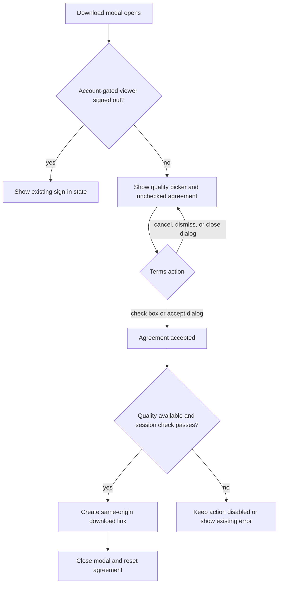

# fix: restore Watch download modal safeguards

## Summary

Restore the Watch download modal's authored thumbnail and required Terms of Use
confirmation, then simplify the quality picker so it shows only localized tier
labels. Preserve the existing download proxy, account gate, filename behavior,
and responsive modal controls.

---

## Problem Frame

The current modal can show a dark Mux frame instead of the video's authored
thumbnail because `resolveDownloadPosterUrl` prefers a frame at two seconds even
when editorial artwork exists. The required Terms of Use checkbox and its
nested review dialog were removed in PR #1445 despite remaining part of the
documented Watch download contract. The quality picker also exposes file sizes
that the current product design no longer wants.

The legacy `apps/watch` implementation is the user-named source for the
agreement layout and copy. Forge already retains the localized agreement
strings, canonical Terms text, and prior nested-dialog implementation history,
so this work restores the established behavior rather than introducing a new
legal flow.

---

## Requirements

- R1. The download modal must prefer the video's authored cinematic thumbnail,
  upgraded to a modal-appropriate resolution when supported, and use a
  high-resolution Mux frame only when authored artwork is unavailable.
- R2. A downloadable viewer must see an unchecked, localized agreement reading
  "I agree to the Terms of Use" in English, with "Terms of Use" opening the
  existing in-app Terms dialog. Match the legacy Watch confirmation-row layout:
  checkbox and linked agreement copy on the left, download action on the right
  at wider widths, and a readable stacked arrangement on narrow widths.
- R3. The Download action must remain disabled and must not create a download
  request until a quality is available and the viewer has accepted the terms.
- R4. Accepting the nested Terms dialog must check the agreement; cancelling,
  closing, or dismissing it must not accept. Closing and reopening the download
  modal must reset agreement state.
- R5. The selected quality label and every dropdown option must omit file-size
  text while preserving localized Highest, High, and Low labels and existing
  tier selection behavior.
- R6. Removing visible file sizes must also remove modal-open HEAD probes that
  existed only to populate those labels, without changing internal download
  ordering or the same-origin download proxy.
- R7. Signed-out account-gated viewers must retain the existing sign-in
  explanation instead of seeing a downloadable form, and existing close,
  duration, language, filename, and error behavior must remain intact.

---

## Key Technical Decisions

- **Prefer editorial artwork before Mux for the download surface.** This
  restores the legacy Watch visual contract while retaining the existing
  Cloudflare transformation upgrade and a deterministic high-resolution Mux
  fallback.
- **Restore the existing Forge Terms flow from history.** Reuse
  `TERMS_OF_USE_PARAGRAPHS`, `TERMS_OF_USE_CANONICAL_URL`, current
  `DownloadModal` translations, and the previously tested nested-dialog
  interaction instead of copying the legacy repository's legal text into a
  second source.
- **Gate in the client form before entering the download path.** Agreement
  joins quality availability and session checking in `canDownload`; the
  same-origin proxy remains unchanged and continues to own target resolution,
  SSRF protection, filenames, and transfer behavior.
- **Remove presentation-only size probing, not download metadata.** Keep
  `size` available to `bucketDownloads` for existing ordering semantics, but
  remove the modal's formatted size labels, probe state, and HEAD requests
  because they no longer affect visible UI.

---

## High-Level Technical Design

The form-state gate is local to `DownloadModal`; no download API or auth
contract changes.

---

## Scope Boundaries

- Do not change the `/watch/api/download` route, opaque target lookup,
  allowlist/SSRF protections, range behavior, or filename composition.
- Do not change the account-gate flag or signed-out authentication flow.
- Do not alter quality bucketing, sorting, or the `WatchDownloadOption` data
  contract.
- Do not modify Share modal, hero, card, or carousel poster behavior.
- Do not rewrite the canonical Terms content or translation catalogs; the
  required localized keys already exist.
- Do not redesign the collection-download modal, which is a separate flow.

---

## Implementation Units

### U1. Restore authored thumbnail priority

- **Goal:** Render the authored cinematic thumbnail in the download modal when
  one exists, with a sharp fallback when it does not.
- **Requirements:** R1, R7
- **Dependencies:** None
- **Files:** `apps/web/src/lib/url.ts`, `apps/web/src/lib/url.test.ts`,
  `apps/web/src/components/watch/__tests__/WatchPageClient.download.test.tsx`
- **Approach:** Change only the download-specific resolver priority: resolve and
  upgrade supported editorial artwork first, then request the existing
  high-resolution Mux frame as fallback. Keep the component prop path and other
  poster helpers unchanged.
- **Patterns to follow:** `resolvePosterUrl`, the Cloudflare dimension upgrader,
  `resolveMuxFrameThumbnailUrl`, and modal-prop assertions in
  `WatchPageClient.download.test.tsx`.
- **Test scenarios:**
  1. With both editorial artwork and a Mux playback ID, the download resolver
     returns the upgraded editorial URL.
  2. With a non-Cloudflare editorial URL and Mux playback, the resolver
     preserves the editorial URL.
  3. With no usable editorial artwork, the resolver returns the
     high-resolution Mux frame.
  4. With neither source, the resolver returns `null`.
  5. Watch client integration passes the download-specific poster to
     `DownloadModal` while Share and other surfaces retain their existing
     poster source.
- **Verification:** Resolver and Watch client tests prove source priority and
  surface isolation; the browser modal visibly shows authored artwork.

### U2. Restore the agreement gate and simplify quality labels

- **Goal:** Require explicit Terms acceptance before download and remove all
  visible file-size values from the single-video modal.
- **Requirements:** R2, R3, R4, R5, R6, R7
- **Dependencies:** None
- **Files:** `apps/web/src/components/watch/DownloadModal.tsx`,
  `apps/web/src/components/watch/__tests__/DownloadModal.test.tsx`
- **Execution note:** Restore behavior with failing regression tests first,
  using the pre-PR #1445 tests as characterization input and adjusting them to
  the current account-gate API.
- **Approach:** Reintroduce agreement and nested-dialog state using the retained
  Terms constants and translations. Fold agreement into `canDownload`, reset it
  through the modal close path, and keep the nested dialog inside the modal
  subtree so close/reset behavior remains reliable. Place the agreement and
  primary action in the legacy rounded confirmation row while preserving the
  current Close action and responsive behavior. Remove `SizeLabel` and the
  size-probe pipeline while leaving tier metadata and selection intact.
- **Patterns to follow:** The pre-PR #1445 `DownloadModal` implementation, the
  legacy `apps/watch/src/components/DialogDownload/DialogDownload.tsx` checkbox
  row, and
  `docs/solutions/best-practices/base-ui-dialog-state-attribute-detection-20260520.md`.
- **Test scenarios:**
  1. With downloads available, the localized checkbox is unchecked and Download
     is disabled on first open.
  2. The agreement and Download action share the bordered confirmation row on
     desktop and stack without overlap on a narrow viewport.
  3. Checking the box enables Download; unchecking it disables Download again.
  4. Clicking Terms of Use opens the nested dialog without accepting.
  5. Accept closes the nested dialog, checks the box, and enables Download.
  6. Cancel, X, Escape, and backdrop dismissal close only the nested dialog and
     leave the box unchecked.
  7. Closing and reopening the outer modal resets agreement and disables
     Download.
  8. A stale or unavailable account session still blocks link creation after
     agreement using the existing error/sign-in behavior.
  9. The quality trigger and all open options contain localized tier labels but
     no MB/GB text, including when source sizes are present.
  10. Opening the modal no longer issues HEAD requests for missing size
      metadata.
  11. With no downloads, the empty state remains and the agreement cannot
      enable a download.
- **Verification:** Component tests cover agreement state transitions, nested
  dialog isolation, account-gate interaction, absent size copy, and removal of
  presentation-only network probes.

### U3. Prove the complete modal flow

- **Goal:** Validate the restored behavior at the rendered Watch surface and
  close the roadmap record with reusable evidence.
- **Requirements:** R1-R7
- **Dependencies:** U1, U2
- **Files:** `docs/roadmap/platform/feat-310-watch-download-modal-safeguards.md`,
  `docs/roadmap/README.md`
- **Approach:** Run focused component and resolver coverage, web typecheck and
  lint, then smoke the exact single-video flow at desktop and narrow mobile
  widths. Exercise the agreement, nested Terms dialog, quality dropdown, and
  download-disabled state without allowing the final transfer to disrupt proof
  capture.
- **Patterns to follow:** Completion evidence in
  `docs/roadmap/platform/feat-264-watch-download-poster-resolution.md` and the
  base-ui dialog state guidance for `data-open` / `data-closed`.
- **Test scenarios:**
  1. Desktop modal shows authored thumbnail, localized unchecked agreement, and
     disabled Download with no file-size text.
  2. Nested Terms opens above the modal; Cancel leaves the outer modal open and
     Download disabled.
  3. Accept checks the agreement and enables Download when a tier exists.
  4. Mobile layout remains scrollable with thumbnail, agreement, and action
     controls unobscured by the close affordance.
  5. Browser console has no new errors and modal opening performs no
     size-probe HEAD requests.
- **Verification:** Focused and package-sensitive checks pass, screenshots
  capture desktop and mobile states, and the roadmap ticket records the exact
  evidence before moving to `complete`.

---

## System-Wide Impact

- **UI state:** Agreement is ephemeral per modal opening and never persisted.
- **Network behavior:** Modal open stops issuing size-discovery HEAD requests;
  the final download still uses the existing same-origin proxy.
- **Localization:** Existing `DownloadModal` keys cover the restored row and
  nested dialog across catalogs; no catalog schema change is planned.
- **Performance:** Editorial thumbnail selection remains lazy with the modal
  chunk and removes ancillary size requests, so page-loading behavior should
  not regress.
- **Auth:** The agreement is shown only in the downloadable form; signed-out
  account-gated viewers retain the dedicated sign-in state.

---

## Risks & Dependencies

- The prior terms implementation predates the latest account-gate refactor.
  Mitigation: restore the state machine selectively and keep current
  `accountGateEnabled` checks and session revalidation intact.
- Editorial providers without mutable Cloudflare dimensions may still return a
  smaller asset. Mitigation: preserve their authored URL rather than replacing
  the requested thumbnail with a video frame; browser proof covers the reported
  surface.
- Nested dialogs can appear present during close animations. Mitigation:
  browser verification must inspect base-ui open/closed state attributes or
  wait for unmount.
- Removing HEAD probes could affect only display enrichment, not download
  ordering, because CMS size metadata remains available to the tiering helper.
  Tests keep tier ordering unchanged.

---

## Sources & Research

- Legacy checkbox layout and agreement behavior:
  `https://github.com/JesusFilm/core/blob/main/apps/watch/src/components/DialogDownload/DialogDownload.tsx`
- Legacy interaction coverage:
  `https://github.com/JesusFilm/core/blob/main/apps/watch/src/components/DialogDownload/DialogDownload.spec.tsx`
- Current Forge regression origin: git commit `56e60dc2` / PR #1445.
- Prior modal poster decision:
  `docs/plans/2026-07-16-001-fix-watch-download-poster-resolution-plan.md`.
- Nested dialog browser-testing guidance:
  `docs/solutions/best-practices/base-ui-dialog-state-attribute-detection-20260520.md`.
