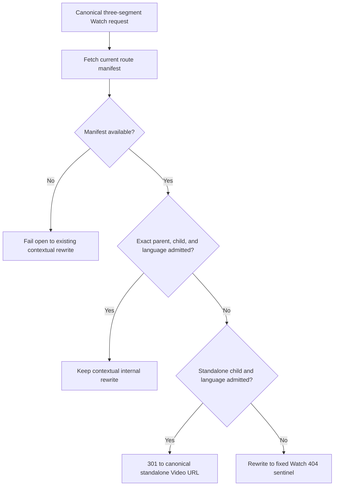

# fix: Redirect invalid legacy Watch contexts to standalone videos

## Summary

Recover canonical three-segment Watch URLs whose parent/child relationship is
no longer present by permanently redirecting them to the independently valid
standalone Video/language URL. Preserve every currently valid contextual route
and the existing manifest-unavailable fail-open behavior.

---

## Problem Frame

Legacy indexed URLs such as
`/watch/discipleship.html/parable-of-the-sower-and-the-seed/spanish-latin-american.html`
now reach the route-manifest admission gate as contextual routes. The child
Video and requested Dub can still have a valid standalone route, but the
historic parent/child relationship may have been deleted, moved, or
re-authored. The proxy currently sends every rejected contextual pair to the
fixed 404 sentinel, so durable inbound links cannot recover to the canonical
Video identity.

The contextual route remains important for live collection navigation and must
continue rendering whenever the manifest admits the exact parent, child, and
language combination. The fallback belongs only on the negative admission
branch and must reuse the same manifest snapshot to avoid replacing one
unverified route with another.

---

## Requirements

### Redirect behavior

- R1. A manifest-admitted parent/child/language route must continue rewriting
  to the contextual Watch page without a redirect.
- R2. A syntactically valid contextual route rejected by the manifest must
  return HTTP 301 to the standalone child/language route when that standalone
  route is admitted by the same manifest.
- R3. The redirect destination must use the canonical
  `/{video}.html/{language}.html` route builder and preserve the request query
  string.
- R4. A rejected contextual route whose standalone child/language route is
  also rejected must keep using the fixed Watch 404 sentinel.

### Compatibility and resilience

- R5. Manifest-unavailable requests must retain the current fail-open rewrite
  behavior; an unavailable manifest must not trigger either this redirect or a
  new 404.
- R6. One-segment, standalone Video, reserved, internal-prefix, canonicalizing,
  and malformed route behavior must remain unchanged.
- R7. Existing contextual episode aliases must resolve before admission and
  remain contextual when their resolved parent/child/language tuple is valid.
- R8. The redirect must retain the existing redirect cache-control policy and
  must not introduce Admin resolver work, a second manifest fetch, or a new
  route-manifest contract.

---

## Assumptions

- The route manifest does not identify whether a rejected contextual URL was
  once valid. The fallback therefore applies to any safe rejected contextual
  pair whose standalone child/language route is admitted, including deleted,
  moved, or re-parented relationships.
- HTTP 301 is the required public contract for this recovery path even though
  other Watch canonicalization rules use 307 or 308.
- The existing standalone manifest admission semantics remain authoritative:
  exact content/language indexes are used when present, with the manifest's
  current compatibility fallback when older snapshots lack those indexes.

---

## Key Technical Decisions

- KTD1. **Exact contextual admission wins.** Evaluate the original episode
  tuple first and return the existing internal rewrite immediately when it is
  valid. Only its negative branch is eligible for flattening.
- KTD2. **Reuse standalone manifest admission.** Convert the rejected episode
  candidate into the existing Video admission shape and evaluate it against
  the already fetched manifest. This keeps content and Dub validity aligned
  with all other standalone Watch routes.
- KTD3. **Keep response policy in the proxy.** The route-manifest module
  remains a pure admission index; the proxy owns the three outcomes of admit,
  permanent redirect, and not found.
- KTD4. **Build the destination through shared route helpers.** Safe parsed
  slugs are converted to the branded route inputs and passed through
  `watchVideoPath`, while the cloned request URL carries existing query
  parameters into the 301 response.
- KTD5. **Preserve fail-open availability.** A missing manifest cannot prove
  either contextual invalidity or standalone validity, so it retains the
  current rewrite rather than guessing.

---

## High-Level Technical Design

One manifest read produces the complete decision. The fallback cannot alter a
valid contextual route because the exact admission branch terminates first.

---

## Implementation Units

### U1. Track and characterize the legacy-context recovery contract

- **Goal:** Create roadmap traceability and encode the desired redirect matrix
  in proxy tests before changing admission behavior.
- **Requirements:** R1, R2, R3, R4, R5, R6, R7
- **Dependencies:** None
- **Files:**
  - `docs/roadmap/platform/feat-314-watch-legacy-context-redirects.md`
  - `docs/roadmap/README.md`
  - `apps/web/src/proxy.test.ts`
- **Approach:** Add the next globally unique platform roadmap item in progress.
  Extend the manifest fixture with a playable child that is valid standalone
  but absent from a requested parent, then characterize each outcome without
  weakening existing contextual and not-found assertions.
- **Execution note:** Start with failing proxy tests for the public
  request/response contract.
- **Patterns to follow:** Roadmap shape in
  `docs/roadmap/platform/feat-313-watch-carousel-hover-controls.md`; manifest
  fixture control and rewrite assertions in `apps/web/src/proxy.test.ts`.
- **Test scenarios:**
  1. A currently valid parent/child/language route keeps its contextual
     internal rewrite and returns no `Location` header.
  2. A rejected legacy parent/child pair with an admitted standalone
     child/language route returns 301 to the two-segment URL.
  3. The same recovery path preserves unrelated query parameters exactly once
     in the redirect destination.
  4. A rejected contextual pair with an unknown child retains the fixed 404
     sentinel.
  5. A known child with an unavailable requested Dub retains the fixed 404
     sentinel when exact content-language indexes are present.
  6. A missing manifest keeps the original contextual rewrite and does not
     emit a redirect.
  7. A valid legacy episode alias still rewrites under its contextual parent
     after alias resolution.
  8. Existing standalone and canonicalization tests remain unchanged.
- **Verification:** Focused proxy tests fail on the new recovery cases before
  implementation and preserve the existing admission boundaries.

### U2. Add the manifest-aware permanent redirect decision

- **Goal:** Implement the exact-first contextual decision and safe standalone
  fallback without changing the manifest contract.
- **Requirements:** R1, R2, R3, R4, R5, R7, R8
- **Dependencies:** U1
- **Files:**
  - `apps/web/src/proxy.ts`
  - `apps/web/src/proxy.test.ts`
- **Approach:** Replace the boolean rewrite-admission result with an internal
  proxy decision that can admit, redirect, or reject. Fetch the manifest once,
  preserve the one-segment fallback and multi-segment fail-open behavior, test
  exact episode admission first, and evaluate a rejected episode as an
  existing standalone Video admission candidate. Extend the shared redirect
  helper to accept the required 301 status and use the canonical route builder
  for the target.
- **Patterns to follow:** `isWatchRouteAdmittedByManifest` for both exact
  episode and standalone Video checks; `buildRedirect` for cache-control;
  `watchVideoPath` plus branded slug constructors in `apps/web/src/lib/routes.ts`.
- **Test scenarios:**
  1. All U1 redirect and non-redirect cases pass with one manifest source
     invocation per request.
  2. A malformed or non-public language segment never reaches the recovery
     branch.
  3. A contextual route admitted only after legacy episode-alias resolution
     remains a rewrite rather than flattening.
  4. Redirect responses contain HTTP 301, the canonical path, preserved query
     parameters, and `Cache-Control: private, max-age=0`.
- **Verification:** Focused proxy and route-manifest tests pass, followed by
  Web typecheck, lint, formatting checks, and the full Web test suite.

### U3. Prove runtime routing and record the durable pattern

- **Goal:** Verify the browser-facing contract and leave the routing decision
  discoverable for future Watch work.
- **Requirements:** R1, R2, R3, R4, R5, R6, R8
- **Dependencies:** U2
- **Files:**
  - `docs/roadmap/platform/feat-314-watch-legacy-context-redirects.md`
  - `docs/roadmap/README.md`
  - `docs/solutions/integration-issues/watch-legacy-context-standalone-redirect.md`
- **Approach:** Run direct HTTP and browser navigation checks against a local
  production-like server with a controlled manifest source or equivalent
  route fixture. Confirm the permanent redirect lands on the standalone page,
  valid context remains contextual, and invalid standalone targets render the
  shared 404. Record the exact-first, same-manifest fallback rule and mark the
  roadmap item complete only after validation.
- **Test scenarios:**
  1. A direct request to the representative legacy URL returns 301 and a
     canonical standalone `Location`.
  2. Following that redirect renders the standalone page at the flattened URL
     without a redirect loop.
  3. Direct and client-side navigation to a valid contextual URL retain the
     contextual URL and rendered collection state.
  4. A rejected contextual route without a valid standalone target renders the
     shared 404 at the original public URL.
  5. Browser console and network inspection show no new client error,
     duplicate manifest request, redirect loop, or added page-load resource.
- **Verification:** Runtime proof covers redirect, contextual rewrite, and 404
  branches; page-loading behavior is unchanged apart from the intended
  redirect hop.

---

## Scope Boundaries

### In scope

- Canonical three-segment contextual Watch routes evaluated by the route
  manifest.
- One-hop 301 recovery to an independently admitted standalone Video/Dub URL.
- Proxy, focused tests, roadmap tracking, browser proof, and the durable route
  decision note.

### Out of scope

- Redirecting bare slugs, malformed paths, unsupported public language aliases,
  or arbitrary one- and two-segment 404s.
- Changing contextual canonical metadata, sitemap generation, route-manifest
  production, Admin relationships, or the public contextual URL shape.
- Maintaining an allowlist of historic collection names or adding explicit
  legacy aliases for every affected URL.

---

## Risks & Dependencies

- **False recovery from a mistyped parent:** The manifest cannot distinguish a
  historic link from a typo. Requiring an admitted standalone child/language
  target bounds the result to a real canonical page, while exact valid context
  still wins.
- **Stale process-local manifest:** The redirect can reflect a snapshot for up
  to the existing manifest TTL. This is the same consistency window as current
  admission and does not warrant a second data source.
- **Older manifest without exact content-language indexes:** Standalone
  admission retains its compatibility behavior. Page resolution remains the
  final authority after the redirect until all snapshots carry exact indexes.
- **Permanent status:** A 301 can be cached by intermediaries and search
  engines. The target is intentionally the stable standalone canonical
  identity, and the existing private no-cache response header remains in place
  for the application response.

---

## Acceptance Examples

- AE1. Given the exact contextual tuple exists, when the URL is requested,
  then Watch renders that context with no redirect.
- AE2. Given the contextual tuple is absent and the standalone child/Dub tuple
  exists, when the URL is requested, then Watch returns 301 to the standalone
  child/Dub URL with its query string preserved.
- AE3. Given both contextual and standalone tuples are absent, when the URL is
  requested, then Watch renders the shared 404 and exposes no redirect target.
- AE4. Given the route manifest cannot be loaded, when a safe contextual URL
  is requested, then Watch preserves the current fail-open contextual rewrite.

---

## Sources & Research

- `apps/web/src/proxy.ts` owns canonicalization, manifest admission, permanent
  response construction, the fail-open path, and the fixed 404 sentinel.
- `apps/web/src/lib/watch-route-manifest.ts` provides the indexed exact
  episode and standalone Video admission checks from one compact snapshot.
- `docs/solutions/performance-issues/watch-static-locale-rewrite-route-manifest-admission-20260529.md`
  establishes the manifest as a fail-open prefilter rather than a resolver.
- `docs/solutions/integration-issues/nextjs-proxy-not-found-sentinel-preserves-app-router-navigation.md`
  establishes that negative proxy outcomes must continue through the fixed
  statusless 404 rewrite.
- `docs/roadmap/platform/feat-179-watch-contextual-video-canonical.md` preserves
  valid contextual navigation while assigning SEO identity to standalone Video
  URLs.
