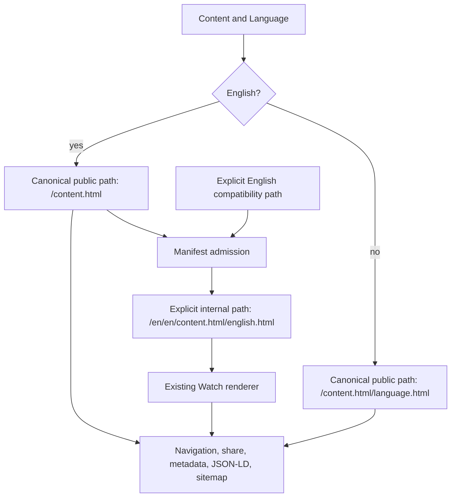

# fix: Make language-less Watch URLs canonical for English

## Summary

Make the language-less `.html` Watch content route the canonical public form
for eligible English content while retaining the explicit `/english.html`
route as a non-redirecting compatibility URL. Content whose slug conflicts
with a public language home keeps explicit English as canonical. Align Forge
link emitters, metadata, structured data,
sharing, sitemap hreflang, routing, and operational probes without changing
non-English or contextual episode URL shapes.

---

## Problem Frame

`feat-315` and `feat-316` restored manifest-validated English rendering for
language-less Watch URLs such as `/watch/jesus.html`. The rest of Forge still
treats `/watch/jesus.html/english.html` as canonical: route builders emit it,
metadata and structured data publish it, sitemap entries and English hreflang
target it, and several apps copy or share it.

The two healthy routes therefore advertise the compatibility alias instead of
the historically durable language-less identity. Changing metadata alone would
leave navigation, sharing, sitemap discovery, contextual fallback redirects,
and cross-app links in conflict with the new canonical.

---

## Requirements

### Canonical public behavior

- R1. An admitted language-less Watch content URL renders its English Dub with
  HTTP 200, no `Location` header, and its visible path and query unchanged.
- R2. For eligible content, the explicit `/english.html` form remains a direct
  HTTP 200 compatibility route but declares the language-less URL through
  canonical, Open Graph, and structured-data identity. For a conflicting
  content slug, explicit English remains self-canonical.
- R3. Forge-generated English content, copy, share, search, inventory, history,
  and visitor links use the language-less form when eligible and explicit
  English for a conflicting content slug.
- R4. Non-English content links remain language-explicit and self-canonical.
- R5. Contextual episode navigation retains the parent, child, and explicit
  language segments; its flattened English canonical and share identity use the
  language-less standalone child URL.

### Routing and admission

- R6. The proxy keeps an explicit English internal path for static locale-tree
  rendering even though public canonical emission omits English.
- R7. Rejected contextual English routes redirect only to an independently
  admitted language-less standalone target; equivalent non-English redirects
  retain their language segment and existing cache/query contract.
- R8. Public language homes, one-segment Experiences, exact Video/Experience
  collision precedence, unknown slugs, Videos without English, and
  manifest-unavailable non-collection behavior remain unchanged.
- R9. The proxy's admitted internal route shape seeds a route-local chrome
  provider (`language-home`, `experience`, or `english-video`) during server
  rendering so language-less English content is treated as an inner Watch page
  without guessing from the ambiguous public pathname.

### Discovery and compatibility

- R10. Eligible English sitemap `<loc>` and `hreflang="en"` targets use the
  language-less URL; conflicting content retains explicit English.
  Compatibility aliases are excluded, and reciprocal, self-inclusive, unique,
  non-contextual alternate groups remain valid.
- R11. Watch page-head hreflang remains absent; sitemap XML continues to own
  localized Watch hreflang.
- R12. Cache revalidation covers the canonical language-less path and the
  explicit English internal/compatibility path.
- R13. A content slug that conflicts with a public language-home retains the
  explicit-English canonical form; no Forge producer emits an unrenderable
  language-less canonical for that content.

### Delivery

- R14. Focused suites, full touched-package validation, Web build, browser
  behavior, and page-load timing pass before the branch is pushed.
- R15. Forward-looking repository guidance describes language-less English as
  canonical while completed plans and roadmap records remain recognizable as
  historical evidence.

---

## Assumptions

- The phrase “points to the URL without language as canonical” means the
  explicit English route remains a non-redirecting compatibility URL rather
  than becoming a new public redirect.
- Language omission applies to public content routes that already have a
  supported one-segment English form. Contextual episode routes keep their
  explicit language because no language-less contextual contract exists.
- Video sitemap groups keep their existing `en` alternate without adding a new
  `x-default` entry.
- This PR updates every Forge-owned public link producer in scope rather than
  introducing a new cross-app URL package.

---

## Scope Boundaries

- Do not redirect a language-less URL to `/english.html`.
- Do not remove or redirect the explicit English public compatibility route.
- Do not change non-English standalone or contextual episode URL shapes.
- Do not weaken route-manifest admission, collision handling, or fixed-404
  behavior.
- Do not reintroduce Watch page-head hreflang.
- Do not rewrite completed historical documents as though their original
  implementation never existed; add dated supersession context where needed.
- Do not merge or deploy this work in the LFG run; stop after the PR is green
  and merge-ready.

---

## High-Level Technical Design

The public canonical builder owns English omission. A separate explicit-language
builder owns proxy internals and compatibility assertions so the internal
rewrite cannot collapse back to the ambiguous one-segment public path.

---

## Key Technical Decisions

- KTD1. **Separate canonical and explicit-language builders:** keep one default
  public builder that omits the default English language only when the content
  slug is eligible, and one deliberately named explicit builder for proxy
  internals, collision fallbacks, and compatibility tests.
- KTD2. **Keep explicit English as a 200 alias:** consolidate search signals
  through metadata, generated links, and sitemap output without breaking
  durable explicit-language links.
- KTD3. **Preserve contextual navigation:** only standalone identity flattens;
  a valid episode route keeps its parent context and language in the browser.
- KTD4. **Keep manifest authority at the proxy:** `parseWatchPath` remains a
  syntax parser. The proxy rewrites admitted Experiences as one internal
  segment and language-less English Videos through the explicit two-segment
  internal shape. A catch-all layout derives the first-render chrome surface
  from that already-admitted shape, while page registration owns later client
  navigation. No `headers()` or `cookies()` read deopts the force-static route.
  The internal rewrite header is only a revalidated public-path claim, never a
  trusted admission boolean.
- KTD5. **Centralize the public URL contract:** extend the existing
  dependency-free `@forge/watch-url-policy` package with canonical and
  explicit standalone builders plus collision eligibility. Web keeps
  manifest admission local, while Web, Admin, Manager, Mobile, and TV consume
  one shared path contract and conformance matrix.
- KTD6. **Treat sitemap and metadata as one identity graph:** English canonical,
  Open Graph, JSON-LD, share, `<loc>`, and English hreflang must resolve to the
  same absolute URL—language-less for eligible content and explicit English
  for collision-owned content.
- KTD7. **Admit localized homes before static rendering:** include published
  homepage locales in the Admin-owned route manifest so the proxy can redirect
  missing localized homes before Next.js enters the static page route. During
  deployment overlap with an older manifest, query the existing GraphQL
  homepage contract only for the requested locale, coalesce concurrent lookups,
  cache known results, and retry failures.

---

## Implementation Units

### U1. Define the shared canonical and explicit English route contract

- **Goal:** Encode the English omission rule once without breaking the explicit
  path required by internal rendering.
- **Requirements:** R1, R2, R3, R4, R6, R13
- **Dependencies:** None
- **Files:**
  - `packages/watch-url-policy/src/index.ts`
  - `packages/watch-url-policy/src/index.test.ts`
  - `packages/watch-url-policy/src/public-watch-language-slugs.ts`
  - `apps/web/src/lib/language-bcp47-map.ts`
  - `apps/web/src/lib/locale.ts`
  - `apps/web/src/lib/locale.test.ts`
  - `apps/web/src/lib/routes.ts`
  - `apps/web/src/lib/routes.test.ts`
- **Approach:** Extend `@forge/watch-url-policy` with dependency-free
  standalone path builders and a single eligibility predicate. Move ownership
  of the generated public-language slug corpus into the package as an exported
  artifact, and make Web locale helpers consume that same artifact; the
  generation/drift check must cover the shared output. Eligible
  default-English content returns one segment; non-English and
  public-language-home collisions return the explicit two-segment form. Keep
  Web's branded `watchVideoPath` as the typed wrapper and add an
  explicit-language wrapper for proxy internals. Preserve timestamp, autoplay,
  locale-resolved query options, absolute URL construction, and branded slug
  validation.
- **Patterns to follow:** `watchEpisodePath`; `appendQueryString`;
  `publicWatchAudioLanguageSlugForLocale`.
- **Test scenarios:**
  1. English emits `/{content}.html`; Spanish, Romanian, and Russian retain
     `/{content}.html/{language}.html`.
  2. The explicit builder emits `/english.html` for proxy and compatibility
     use.
  3. A content slug that is also a public language-home identity
     retains `/english.html` in both shared and Web wrappers.
  4. All one-shot query combinations serialize identically on both route
     shapes.
  5. Absolute English URLs include `/watch/{content}.html`.
  6. Parser tests acknowledge that a language-less canonical is syntactically
     ambiguous until proxy admission.
- **Verification:** Public and explicit builders have distinct, behavior-based
  tests and no existing non-English or episode assertion changes.

### U2. Preserve inbound admission and classify language-less client routes

- **Goal:** Route language-less English safely through the existing renderer
  and prevent client chrome from mistaking Videos for localized homes.
- **Requirements:** R1, R2, R5, R6, R7, R8, R9, R13
- **Dependencies:** U1
- **Files:**
  - `apps/web/src/proxy.ts`
  - `apps/web/src/proxy.test.ts`
  - `apps/web/src/lib/watch-home-route-admission.ts`
  - `apps/web/src/lib/watch-home-route-admission.test.ts`
  - `apps/web/src/lib/watch-route-manifest.ts`
  - `apps/web/src/lib/watch-route-manifest.test.ts`
  - `apps/admin/src/services/watch-route-manifest.service.ts`
  - `apps/admin/src/services/watch-route-manifest.service.test.ts`
  - `apps/admin/src/services/watch-route-manifest-refresh.service.test.ts`
  - `apps/admin/src/scripts/generate-watch-route-manifest.test.ts`
  - `apps/web/src/lib/url-shape.ts`
  - `apps/web/src/lib/url-shape.test.ts`
  - `apps/web/src/app/[locale]/[htmlLang]/[...rest]/page.tsx`
  - `apps/web/src/app/[locale]/[htmlLang]/[...rest]/layout.tsx`
  - `apps/web/src/components/WatchChromeShell.tsx`
  - `apps/web/src/components/WatchRouteSurfaceRegistration.tsx`
  - `apps/web/src/components/WatchRouteSurfaceRegistration.test.tsx`
  - `apps/web/src/components/FloatingSearchContext.tsx`
  - `apps/web/src/components/FloatingSearchProvider.tsx`
  - `apps/web/src/components/__tests__/FloatingSearchProvider.test.tsx`
  - `apps/web/src/components/FloatingSearchController.tsx`
  - `apps/web/src/components/SearchOverlay.tsx`
- **Approach:** Use the explicit builder only for the marked internal English
  rewrite. Continue using the canonical builder for standalone redirects and
  visible internal-prefix normalization. Keep `parseWatchPath` syntax-only.
  The catch-all layout converts the admitted internal rest shape into an
  initial route surface (`language-home`, `experience`, or `english-video`) and
  passes it through a route-local `WatchChromeShell`, so direct server output
  is authoritative. The floating-search provider keeps the seed keyed to the
  initial public pathname; a layout-effect page registration only corrects
  later client navigation. Registrations matching the seed or pathname
  fallback are no-ops, while ownership tokens prevent stale cleanup from
  clearing a newer page. Invalid/stale registrations are ignored. Missing
  localized homes are decided from the manifest before the static page; an
  older manifest uses a cached, single-locale GraphQL lookup during rollout.
  The page remains `force-static`.
- **Execution note:** Add route and client-characterization assertions before
  changing the shared builder's callers.
- **Test scenarios:**
  1. Language-less English returns 200, preserves query parameters, and rewrites
     internally to the explicit English route.
  2. Explicit public English returns 200 without redirecting.
  3. A visible unmarked internal English prefix normalizes to the language-less
     public path while an internal rewrite renders only after its claimed
     public path is independently re-admitted and matches the internal target.
  4. Rejected contextual English redirects once to language-less standalone;
     Spanish and Russian destinations stay explicit.
  5. No-English, unknown, missing-manifest, language-home, Experience, and
     Video/Experience collision fixtures retain their current outcomes.
  6. `/jesus.html` receives a server-rendered `english-video` surface and gets
     inner-page header/search behavior; language homes receive
     `language-home`; a manifest-only Experience server-renders `experience`
     without waiting for hydration.
  7. An exact Video/Experience collision receives `english-video` when the
     exact Video language index wins, proving the client mirrors proxy
     precedence without pathname inference.
  8. A public-language-home/content-slug conflict remains explicit-English and
     is never normalized to the wrong one-segment identity.
- **Verification:** Proxy response headers, rewrite targets, redirect targets,
  client geometry classes, and search-language derivation agree on the new
  boundary.

#### Route-surface interaction matrix

| Admitted surface               | Representative public path | Header treatment                                       | Search language                  | Direct and client navigation                                                           |
| ------------------------------ | -------------------------- | ------------------------------------------------------ | -------------------------------- | -------------------------------------------------------------------------------------- |
| `language-home`                | `/russian.html`            | Existing full home logo/header and home controls       | Route language (`russian`)       | Remains home-like before and after registration                                        |
| `experience`                   | `/easter.html`             | Existing full Experience/home-like header and controls | Server-resolved/default language | Registration preserves Experience treatment even when the slug is not statically known |
| `english-video`                | `/jesus.html`              | Compact inner-page logo/header and Video controls      | `english`                        | Conservative fallback is already compact; registration confirms it                     |
| explicit-English compatibility | `/jesus.html/english.html` | Compact inner-page logo/header and Video controls      | `english`                        | Parser and registration agree; client navigation does not flash to home treatment      |

### U3. Align Web navigation, metadata, structured data, share, and sitemap

- **Goal:** Make every Web-owned discovery and sharing surface publish the same
  canonical English identity.
- **Requirements:** R2, R3, R4, R5, R10, R11, R12
- **Dependencies:** U1, U2
- **Files:**
  - `apps/web/src/lib/experience-metadata.ts`
  - `apps/web/src/lib/experience-metadata.test.ts`
  - `apps/web/src/lib/__tests__/experience-metadata-watch-page.test.ts`
  - `apps/web/src/lib/__tests__/experience-metadata-series.test.ts`
  - `apps/web/src/lib/watch-structured-data.ts`
  - `apps/web/src/lib/watch-structured-data.test.ts`
  - `apps/web/src/lib/share.ts`
  - `apps/web/src/lib/share.test.ts`
  - `apps/web/src/lib/watch-sitemap.ts`
  - `apps/web/src/lib/watch-sitemap.test.ts`
  - `apps/web/src/app/sitemap.test.ts`
  - `apps/web/src/lib/watch-sitemap-audit.test.ts`
  - `apps/web/src/app/api/revalidate/route.ts`
  - `apps/web/src/app/api/revalidate/route.test.ts`
  - `apps/web/src/app/[locale]/[htmlLang]/[...rest]/__tests__/page-metadata.test.tsx`
  - `apps/web/src/app/[locale]/[htmlLang]/[...rest]/__tests__/page-routing.test.tsx`
  - `apps/web/src/components/search/VideoCard.test.tsx`
  - `apps/web/src/components/watch/__tests__/ShareModal.test.tsx`
- **Approach:** Let the canonical builder flow through normal public callers,
  then audit every explicit builder use. Update canonical and Open Graph URLs,
  VideoObject and SeekToAction targets, related items, Copy Link/social
  intents, sitemap locs and alternates, and cache invalidation terminology.
  Retain explicit episode navigation and page-head hreflang absence.
- **Test scenarios:**
  1. Language-less and explicit-English pages both publish the language-less
     canonical, Open Graph URL, and VideoObject URL.
  2. Romanian, Spanish, and Russian pages remain self-canonical and
     language-explicit.
  3. Valid English contextual pages publish a language-less standalone
     canonical without changing their contextual browser route.
  4. English Copy Link and social intents normalize to language-less from both
     input shapes; non-English shares remain explicit.
  5. Sitemap eligible-English locs and `hreflang="en"` targets are
     language-less, collision-owned English targets remain explicit,
     compatibility aliases are absent, and alternate sets remain reciprocal
     and self-inclusive across shards.
  6. Revalidation retains both canonical and explicit internal paths.
  7. Web navigation and language-picker assertions change only standalone
     English destinations, not contextual episode destinations.
- **Verification:** Metadata, JSON-LD, share, navigation, sitemap XML, sitemap
  audit, and revalidation tests all assert the same English URL. The sitemap
  audit enumerates every shard and asserts unchanged reviewed `<loc>` and
  hreflang counts, zero explicit-English aliases for eligible content,
  language-less `en`, explicit non-English targets, preserved `en-GB`,
  uniqueness, reciprocity, self-inclusion, and no contextual targets.

> **Supersession (2026-08-07):** `feat-341` retires the separate
> English-British homepage and its homepage sitemap alternate. `en-GB` remains
> the HTML language identity for British English inventory and media documents;
> it no longer identifies a Watch homepage.

### U4. Update non-Web Forge public link producers

- **Goal:** Stop Forge-owned apps from distributing the explicit English
  compatibility alias.
- **Requirements:** R3, R4, R13
- **Dependencies:** U1
- **Files:**
  - `apps/mobile/package.json`
  - `apps/mobile/src/lib/watchShareUrl.ts`
  - `apps/mobile/src/lib/__tests__/watchShareUrl.test.ts`
  - `apps/admin/package.json`
  - `apps/admin/src/app/dashboard/experiences/experience-editor.tsx`
  - `apps/admin/src/app/dashboard/experiences/experience-editor.test.tsx`
  - `apps/admin/src/app/dashboard/video-library-utils.ts`
  - `apps/admin/src/app/dashboard/video-library-utils.test.ts`
  - `apps/manager/package.json`
  - `apps/manager/src/features/shorts/shorts-presenter.ts`
  - `apps/manager/src/features/shorts/shorts-presenter.test.ts`
  - `apps/tv/package.json`
  - `apps/tv/src/components/watch/detailsHelpers.ts`
  - `apps/tv/src/components/watch/detailsHelpers.test.ts`
  - `apps/roadmap/package.json`
  - `apps/roadmap/lib/experiments.ts`
  - `apps/roadmap/lib/experiments.test.ts`
- **Approach:** Add `@forge/watch-url-policy` as a workspace dependency and
  make each existing helper and Roadmap experiment Watch link delegate to the
  shared canonical builder. The
  exact eligible English slug omits its segment, collisions and any other
  language remain explicit, and absent language retains the helper's
  established fallback. Correct TV's older extensionless Watch share shape
  while touching its helper.
- **Patterns to follow:** Each app's existing validated public URL helper and
  colocated tests.
- **Test scenarios:**
  1. English Experience, Video, Shorts source, Mobile share, and TV share links
     resolve to the language-less `.html` form.
  2. Korean, Romanian, Portuguese, Spanish, and Russian examples remain
     language-explicit.
  3. A public-language-home collision remains explicit-English in every app.
  4. Invalid or absent identity follows each helper's existing null/fallback
     contract without inventing a Watch root link.
- **Verification:** Focused tests in all five apps plus the shared package
  conformance matrix prove canonical English, collision fallback, and
  unchanged international behavior.

### U5. Record the contract and prove the complete route matrix

- **Goal:** Make the new rule durable and leave a repeatable pre-merge
  verification surface.
- **Requirements:** R10, R13, R14, R15
- **Dependencies:** U1, U2, U3, U4
- **Files:**
  - `docs/roadmap/platform/feat-318-watch-language-less-english-canonical.md`
  - `docs/roadmap/platform/feat-316-watch-language-less-video-collision.md`
  - `docs/roadmap/README.md`
  - `apps/web/AGENTS.md`
  - `apps/web/CLAUDE.md`
  - `CONCEPTS.md`
  - `docs/solutions/conventions/public-watch-url-two-segment-contract-20260608.md`
  - `docs/solutions/performance-issues/watch-static-locale-rewrite-route-manifest-admission-20260529.md`
  - `apps/web/src/lib/watch-url-probe.ts`
  - `apps/web/src/lib/watch-url-probe.test.ts`
  - `docs/operations/watch-datadog-availability-incidents.md`
- **Approach:** Create `feat-318` with bidirectional dependencies and update the
  roadmap index narrowly. Replace forward-looking explicit-English guidance,
  add dated supersession context to prior compatibility records, and update the
  route probe so language-less English is canonical while explicit English
  remains an availability check. Scan the route/SEO manifest for
  language-home/content-slug collisions before accepting sitemap output.
- **Test scenarios:**
  1. The probe matrix treats language-less English as direct 200 and explicit
     English as compatible, while international and contextual fixtures keep
     their expected outcomes.
  2. Structured-data probe coverage runs against the language-less canonical.
  3. An exhaustive route-manifest scan counts every
     content/public-language-home collision. Every
     collision retains explicit English; zero exclusions are silently
     accepted, and any unexpected excluded canonical is a NO-GO pending
     review.
  4. Browser navigation keeps `/watch/jesus.html` visible, renders English,
     exposes compact inner-page chrome, copies the language-less share URL, and
     reports no console errors.
  5. Browser and HTTP checks cover Romanian, Spanish, Russian, explicit English,
     valid contextual English, invalid/no-English, and query-bearing routes.
  6. Same-environment `origin/main` and branch cold/warm measurements record at
     least five samples of median TTFB, HTML bytes, request/transfer counts,
     and cache/static classification; the branch stays within a documented
     20% median-TTFB tolerance and does not add requests or change static/cache
     classification.
- **Verification:** Before push, run format checking, `git diff --check`,
  focused suites, the complete Web test/typecheck/lint/production build, the
  shared package checks, and test/typecheck/lint/build targets for Admin,
  Manager, Mobile, and TV where available. Run locale-generating targets
  sequentially to avoid generated-file races. The route probe must report zero
  hard regressions, zero soft regressions, and zero transport errors outside an
  explicit reviewed allowlist, with exact pass counts and sampling limits.
  After push, all required GitHub checks must be green, affected-service
  coverage present, review state clean, and the PR mergeable. Stop there:
  never merge, trigger Railway, redeploy, or begin post-deploy validation.

---

## System-Wide Impact

- **Web viewers:** English navigation and sharing becomes shorter while
  explicit links continue to work.
- **Search engines:** canonical, Open Graph, JSON-LD, sitemap locs, and English
  hreflang converge on one URL.
- **Other Forge apps:** Admin previews, Mobile/TV sharing, and Manager source
  links stop generating the compatibility alias.
- **Operations:** cache invalidation and URL probes retain both public shapes,
  distinguishing canonical correctness from alias availability.
- **Developers:** route helpers and package guidance make public canonical
  emission distinct from internal explicit routing.

---

## Risks & Dependencies

- A shared route-builder change can silently alter series, Experience, search,
  history, and language-picker destinations. Full Web tests must distinguish
  standalone English from contextual English instead of replacing strings
  mechanically.
- One-segment public paths are syntactically ambiguous. Client classification
  may guide UI only; manifest admission remains the source of routing truth.
- A content slug matching a public language-home slug cannot own the same
  canonical path. The shared eligibility predicate must keep that content on
  explicit English across navigation, metadata, redirects, sitemap, sharing,
  and every app—not only exclude it from sitemap publication.
- Sitemap caches and page caches have different invalidation paths. Both
  language-less canonical and explicit internal English paths must remain in
  revalidation coverage.
- The work starts from `origin/main` after `feat-315` and `feat-316`; their
  collision logic is a required dependency and must not be reimplemented.

---

## Acceptance Examples

- **AE1. Language-less English canonical**
  - **Given:** `jesus` has an admitted English Dub.
  - **When:** a viewer opens `/watch/jesus.html?utm_source=printed`.
  - **Then:** the page returns 200, keeps that visible URL, renders English, and
    self-canonicalizes to `/watch/jesus.html`.
- **AE2. Explicit English compatibility**
  - **Given:** the same admitted Video.
  - **When:** a durable link opens `/watch/jesus.html/english.html`.
  - **Then:** the page returns 200 without redirecting and publishes
    `/watch/jesus.html` as canonical, Open Graph, structured-data, and share
    identity.
- **AE3. International stability**
  - **Given:** the Video has Romanian, Spanish, and Russian Dubs.
  - **When:** each explicit international URL is opened or generated.
  - **Then:** its language segment remains visible and self-canonical.
- **AE4. Context preservation**
  - **Given:** an admitted English parent-child relationship.
  - **When:** the viewer opens the contextual episode URL.
  - **Then:** the contextual URL remains visible while metadata and sharing use
    the language-less standalone child identity.
- **AE5. Fail-closed admission**
  - **Given:** an unknown slug, a Video without English, or an unavailable
    manifest for a non-collection route.
  - **When:** the language-less shape is requested.
  - **Then:** the current fixed-404 behavior remains.

---

## Completion Evidence

- Shared URL policy and all touched app producers use the canonical standalone
  builder; explicit English remains reserved for compatibility/internal
  rendering and public-language-home collisions.
- Full tests passed:
  - Web: 155 files, 2,488 passed, 2 todo.
  - Admin: 260 files passed plus 1 skipped file; 3,940 passed, 2 skipped,
    1 todo.
  - Manager: 135 files, 1,096 passed.
  - Mobile: 72 suites, 926 passed.
  - TV: 91 suites, 1,302 passed.
  - Auth: 22 files, 136 passed.
  - `@forge/watch-url-policy`: 17 passed.
- Typecheck and lint passed for every touched package. Production builds passed
  for Web, Admin, Manager, Auth, and Roadmap; Web retained static Watch routes
  and ISR.
- Browser proof covered language-less and explicit English, Romanian, Spanish,
  Russian, a manifest-only Experience, JavaScript-disabled rendering, and
  client navigation between Experience and English-Video chrome surfaces.
- The final post-`origin/main` URL probe covered all 122 defined Watch URL
  structures: 112 exact matches, 10 reviewed compatibility differences,
  0 soft regressions, 0 hard regressions, and 0 transport errors.
- A fresh production build returned one clean `307 Location` for a missing
  localized home, avoiding Next.js's duplicate first-ISR redirect header.
  `/watch/jesus.html` returned `MISS` then `HIT` with no redirect, and the
  explicit-English alias produced the same ETag.
- Five warm primary-document samples on the same machine and production config
  measured median TTFB at 6.015 ms on `origin/main` and 6.916 ms on the branch
  (+15.0%, within the 20% limit). HTML was 518,500 vs 519,617 bytes (+0.22%);
  both used one request, zero redirects, and the same static ISR
  classification.

---

## Sources & Research

- `docs/plans/2026-07-24-004-fix-watch-language-less-english-default-plan.md`
  records the compatibility fallback and its manifest boundary.
- `docs/roadmap/platform/feat-316-watch-language-less-video-collision.md`
  records exact Video/Experience collision precedence.
- `docs/solutions/conventions/public-watch-url-two-segment-contract-20260608.md`
  establishes the visible language-less English behavior to retain.
- `docs/solutions/performance-issues/watch-static-locale-rewrite-route-manifest-admission-20260529.md`
  explains why internal English rendering must remain explicit.
- `docs/solutions/performance-issues/watch-hreflang-sitemap-manifest-20260612.md`
  keeps Watch hreflang in sitemap XML and defines reciprocity safeguards.
- `docs/solutions/best-practices/nextjs-route-shape-migration-cross-cutting-contract-drift-20260430.md`
  frames URL identity changes as fan-out migrations across emitters.
- `docs/solutions/integration-issues/watch-legacy-context-standalone-redirect.md`
  defines manifest-validated contextual fallback redirects.
