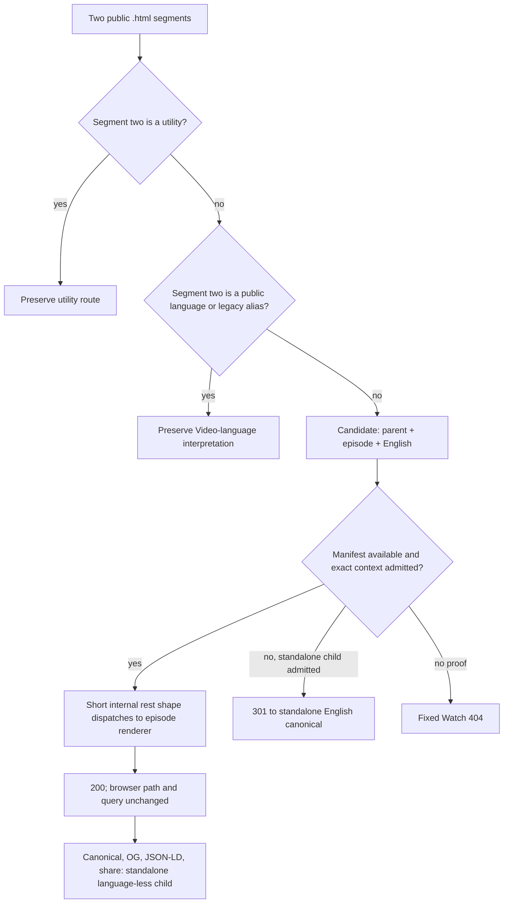

# fix: Add language-less English contextual Watch routes

## Summary

Make `/watch/{parent}.html/{episode}.html` the generated and directly rendered
public form for eligible English contextual episodes. Keep the browser URL and
query unchanged, render through the existing explicit-English contextual page,
and retain the language-less standalone child as canonical, Open Graph,
structured-data, and share identity.

The existing explicit
`/watch/{parent}.html/{episode}/english.html` route remains a direct compatibility
URL. Romanian, Spanish, Russian, and every other non-English contextual route
remain language-explicit. The change is bounded to Web routing and link
generation; the existing Admin-owned route manifest and contextual renderer
already contain the required parent-child-language data.

---

## Problem Frame

English standalone Videos now use language-less public URLs, but contextual
episode links still emit an explicit English segment. Consequently a valid
collection-context URL such as
`/watch/lumo-the-gospel-of-john.html/lumo-john-1-1-34.html` returns 404 even
though the equivalent explicit-English contextual route renders successfully.

Two-segment Watch paths already mean `/{video}.html/{language}.html`. Adding an
implicit-English contextual interpretation therefore requires semantic
precedence, not just accepting another syntactic shape. A language token in the
second segment must continue to mean a Video-language route, while a
non-language token may be treated as an English episode only after the route
manifest proves the exact parent-child-English relationship.

This is an easy, bounded change because no new page renderer, Admin query,
GraphQL schema, or manifest field is needed. The main issues are preserving
language-token precedence, handling language-alias collisions, failing closed
when admission cannot be proven, and updating every English contextual link
producer consistently.

---

## Requirements

### Public route and link behavior

- R1. An exact manifest-admitted English parent-child route at
  `/watch/{parent}.html/{episode}.html` returns HTTP 200 directly, emits no
  `Location` header, and keeps the visible path and query unchanged.
- R2. Forge-generated English contextual navigation links use the two-segment
  form when their episode slug is eligible for implicit-English
  interpretation. Prominent discovery surfaces such as `/watch/` homepage
  thumbnails continue to link to the standalone Video identity.
- R3. The existing explicit-English contextual form
  `/watch/{parent}.html/{episode}/english.html` remains a direct HTTP 200
  compatibility route.
- R4. Non-English contextual links retain the existing three-segment form,
  including Romanian, Spanish, and Russian examples.
- R5. Standalone English links remain language-less, and nested collection
  children that intentionally use standalone navigation remain unchanged.

### Parsing, admission, and compatibility

- R6. Localized utilities are classified first. For other two-segment paths, a
  recognized public language slug or legacy language alias in segment two
  retains existing `{video}/{language}` precedence.
- R7. A non-language segment-two token may be classified as an
  implicit-English contextual candidate, but it is admitted only when the
  manifest proves the exact parent, child, and English Dub.
- R8. An admitted candidate preserves the short internal rest shape and
  dispatches to the existing episode renderer. The internal path is not exposed
  as a redirect and does not introduce another manifest fetch. Expanding the
  internal rest shape to explicit English is prohibited because it causes a
  server/client hydration mismatch.
- R9. If the exact context is rejected but the standalone child is independently
  admitted in English, preserve the established one-hop redirect to the
  language-less standalone child. Otherwise return the fixed Watch 404.
- R10. The new ambiguous shorthand fails closed when the route manifest is
  unavailable. Existing explicit three-segment contextual outage behavior is
  unchanged.
- R11. An English episode whose slug equals a current public language token or
  recognized legacy language alias keeps the explicit-English contextual form;
  the public builder must not emit an ambiguous shorthand.
- R12. Visible internal locale-prefixed English contextual URLs normalize to
  the new short public form, while international equivalents normalize to the
  existing explicit form.

### SEO, client state, and discovery

- R13. The short contextual route preserves collection playback context but
  publishes the language-less standalone child as canonical, Open Graph,
  structured-data, and share identity.
- R14. Client route parsing identifies an admitted short contextual route as an
  English episode so search, floating chrome, language switching, history, and
  navigation never mistake the episode slug for a language.
- R15. Switching from a short English contextual route to another language
  emits the explicit contextual form; switching back to eligible English emits
  the short form.
- R16. Neither the short nor explicit contextual URL is added to the sitemap;
  sitemap discovery continues to expose standalone Video identities only.

### Delivery and documentation

- R17. Focused unit, proxy, page-routing, component, sitemap, and probe tests
  cover positive, compatibility, collision, invalid, outage, and international
  cases.
- R18. The complete Web validation, production build, browser smoke,
  page-loading comparison, and systematic preview URL matrix pass before PR
  handoff.
- R19. A new platform roadmap item records this contract and depends on the
  completed language-less standalone English work. Forward-looking guidance is
  updated with dated supersession context; completed historical plans remain
  unchanged.

---

## Scope Boundaries

- Do not redirect a valid short contextual URL to the explicit-English form.
- Do not redirect or remove the explicit-English contextual compatibility URL.
- Do not shorten non-English contextual URLs.
- Do not treat syntax safety or standalone child admission as proof of a valid
  parent-child relationship.
- Do not widen arbitrary static-route or ISR admission during a manifest
  outage.
- Do not change the Admin route-manifest schema, GraphQL contracts, or existing
  contextual page query.
- Do not make contextual URLs sitemap identities or change the standalone
  canonical/share contract.
- Do not rewrite completed roadmap records or historical plans to obscure the
  former explicit-language rule.

---

## High-Level Technical Design

Public navigation uses one contextual builder with two outcomes: eligible
English emits `/{parent}.html/{episode}.html`; non-English and ambiguous English
episode slugs emit the existing explicit route. A separately named explicit
builder remains available for internal rewrites and compatibility assertions.

The proxy owns semantic admission. It preserves utility and recognized-language
precedence, validates an implicit-English candidate against the existing
manifest, then rewrites an admitted candidate to the already supported internal
three-segment route. The catch-all page continues receiving the same explicit
internal shape, so rendering and Admin data resolution do not change.

---

## Key Technical Decisions

- KTD1. **Language interpretation wins over implicit context.** Public language
  slugs and legacy aliases in segment two retain their established meaning.
  This preserves existing two-segment Video URLs and makes the collision rule
  deterministic.
- KTD2. **Separate public and explicit contextual builders.** The normal
  episode builder owns English omission and link generation. A deliberately
  named explicit builder owns proxy internals and compatibility paths so an
  internal rewrite cannot accidentally collapse back to the visible route.
- KTD3. **Manifest admission remains authoritative.** The parser may classify a
  non-language two-segment path as an English episode candidate for client
  state, but only the proxy may admit it. Exact parent-child-English admission
  is evaluated before standalone fallback.
- KTD4. **Fail closed only for the new shorthand.** Without a manifest, the
  proxy cannot distinguish an episode slug from arbitrary input. Returning the
  fixed 404 avoids minting uncontrolled static routes. Existing explicit
  three-segment fail-open behavior remains available for durable links during
  an upstream manifest incident.
- KTD5. **Reuse the existing renderer.** The short public form preserves the
  short internal rest shape and dispatches to the existing episode renderer.
  Expanding it to explicit English causes a server/client hydration mismatch.
  The route adds no Admin calls, generated types, or static-rendering changes.
- KTD6. **Preserve standalone SEO identity.** Context affects playback and
  navigation, not indexing identity. Canonical, Open Graph, JSON-LD, share, and
  sitemap behavior continue to converge on the standalone child.
- KTD7. **Emit the new route where context is intentional.** Episode cards,
  sibling navigation, player next links, history, inventory, and language
  switching delegate to the central episode builder. Homepage and search
  thumbnails remain standalone discovery links so crawlers and viewers receive
  the canonical Video identity from prominent entry points.

---

## Implementation Units

### U0. Establish roadmap ownership before implementation

- **Goal:** Record the new public-route contract and its dependency before code
  changes begin.
- **Requirements:** R19
- **Dependencies:** None
- **Files:**
  - `docs/roadmap/platform/feat-319-watch-language-less-contextual-english.md`
  - `docs/roadmap/platform/feat-318-watch-language-less-english-canonical.md`
- **Approach:** Create `feat-319` with `status: "in-progress"`, depend on the
  completed standalone-English work in `feat-318`, and add the reverse
  `blocks` entry to `feat-318`.
- **Test expectation:** Documentation-only prerequisite; verify frontmatter,
  the next sequential feature ID, and bidirectional dependency integrity.
- **Verification:** The roadmap record exists and is in progress before U1
  changes production code.

### U1. Define the implicit-English contextual URL vocabulary

- **Goal:** Make the public builder and route parser express the new shape
  without losing existing language precedence.
- **Requirements:** R2-R6, R11, R14, R15
- **Dependencies:** U0
- **Files:**
  - `apps/web/src/lib/routes.ts`
  - `apps/web/src/lib/routes.test.ts`
  - `apps/web/src/lib/language-aliases.ts`
  - `apps/web/src/lib/url-shape.ts`
  - `apps/web/src/lib/url-canonicalize.ts`
  - `apps/web/src/lib/url-canonicalize.test.ts`
- **Approach:** Extend the episode route type to cover short English and
  explicit international shapes. Make `watchEpisodePath` omit eligible English,
  add `watchEpisodeExplicitLanguagePath`, and centralize the predicate that
  rejects current or legacy language-token episode slugs. Update
  `parseWatchPath` so utilities and language tokens win before a remaining
  two-segment path is classified as an English episode. Keep canonicalizer
  normalization and alias resolution deterministic for both route meanings.
- **Patterns to follow:** `watchVideoPath`,
  `watchVideoExplicitLanguagePath`, `tryResolveLanguageAlias`, and the current
  utility-first `parseWatchPath` branches.
- **Test scenarios:**
  1. LUMO plus an eligible English episode emits and parses as
     `/{parent}.html/{episode}.html`.
  2. The explicit builder emits
     `/{parent}.html/{episode}/english.html`.
  3. Romanian, Spanish, and Russian emit and parse through the existing
     explicit form.
  4. Current language-token and `chinese-mandarin` alias episode slugs keep
     explicit English and preserve Video-language/alias precedence.
  5. Timestamp, autoplay, and locale-resolved query options serialize
     identically on short and explicit paths.
  6. Absolute English episode URLs use the short public form.
- **Verification:** Route tests prove positive output shapes rather than only
  canonicalizer idempotence, and every builder has an inverse parser assertion
  for each unambiguous form.

### U2. Admit and internally rewrite short English contextual routes

- **Goal:** Serve valid shorthand directly through the existing contextual
  renderer without widening static-route admission.
- **Requirements:** R1, R3, R6-R12
- **Dependencies:** U1
- **Files:**
  - `apps/web/src/proxy.ts`
  - `apps/web/src/proxy.test.ts`
  - `apps/web/src/app/[locale]/[htmlLang]/[...rest]/page.tsx`
  - `apps/web/src/app/[locale]/[htmlLang]/[...rest]/__tests__/page-routing.test.tsx`
- **Approach:** In two-segment classification, retain localized utility and
  recognized-language handling first. Convert the remaining safe pair to an
  English episode manifest route, resolve legacy episode aliases, and set the
  internal pathname with the short episode builder. Reuse exact contextual
  admission and independently admitted standalone fallback. Mark the new
  shorthand so manifest unavailability returns the fixed 404 while the old
  explicit route keeps its current outage behavior. Extend internal-prefix
  normalization and internal-rewrite claim validation to understand the new
  public form.
- **Patterns to follow:** Current three-segment episode classification,
  `classifyManifestAdmission`, language-less standalone internal rewrite, and
  `isAdmittedInternalRewrite`.
- **Test scenarios:**
  1. The exact LUMO shorthand returns a rewrite response with no `Location`,
     the short internal episode shape, and the original query intact.
  2. The old explicit-English contextual route remains directly admitted.
  3. Romanian, Spanish, and Russian contextual routes retain locale identity
     and internal paths.
  4. A recognized language or alias in segment two follows Video-language
     normalization rather than contextual admission.
  5. A wrong parent with an independently admitted English child redirects once
     to the language-less standalone child.
  6. An unknown child or child without English returns the fixed Watch 404.
  7. Manifest unavailability fails closed for shorthand and preserves the
     explicit route's current behavior.
  8. Re-entered internal rewrites pass only when the claimed public shorthand
     reclassifies to the same exact internal destination.
- **Verification:** Proxy and page-routing integration tests prove the browser
  path and internal rest shape stay short while the catch-all dispatches to the
  established episode renderer, with no additional manifest or Admin fetch.

### U3. Align contextual link producers and client/SEO consumers

- **Goal:** Make English contextual navigation consistently short while
  preserving client language state and standalone discovery identity.
- **Requirements:** R2-R5, R13-R16
- **Dependencies:** U1, U2
- **Files:**
  - `apps/web/src/lib/watch-home.ts`
  - `apps/web/src/lib/__tests__/watch-home.test.ts`
  - `apps/web/src/lib/watch-language-inventory.ts`
  - `apps/web/src/lib/watch-history.ts`
  - `apps/web/src/components/watch/SeriesEpisodeCard.tsx`
  - `apps/web/src/components/watch/__tests__/SeriesEpisodeCard.test.tsx`
  - `apps/web/src/components/watch/SiblingCarousel.tsx`
  - `apps/web/src/components/watch/__tests__/SiblingCarousel.test.tsx`
  - `apps/web/src/components/watch/HeroPlayer.tsx`
  - `apps/web/src/components/watch/__tests__/HeroPlayer.test.tsx`
  - `apps/web/src/components/watch/WatchPageClient.tsx`
  - `apps/web/src/components/watch/__tests__/WatchPageClient.navigation.test.tsx`
  - `apps/web/src/components/watch/LanguagePickerModal.tsx`
  - `apps/web/src/components/watch/__tests__/LanguagePickerModal.test.tsx`
  - `apps/web/src/components/FloatingSearchProvider.tsx`
  - `apps/web/src/components/__tests__/FloatingSearchProvider.test.tsx`
  - `apps/web/src/components/FloatingSearchController.tsx`
  - `apps/web/src/components/SearchOverlay.tsx`
  - `apps/web/src/lib/share.ts`
  - `apps/web/src/lib/share.test.ts`
  - `apps/web/src/lib/watch-structured-data.ts`
  - `apps/web/src/lib/watch-structured-data.test.ts`
  - `apps/web/src/app/sitemap.test.ts`
  - `apps/web/src/lib/watch-sitemap.test.ts`
  - `apps/web/src/lib/watch-sitemap-audit.test.ts`
- **Approach:** Let contextual-navigation emitters inherit the new central
  builder behavior and replace only assertions that intentionally cover
  eligible English contextual links. Keep homepage, search, and nested-series
  discovery paths standalone.
  Make parser consumers recognize the shorthand as English context. Retain
  standalone canonical/share/JSON-LD resolution and sitemap exclusion for both
  contextual forms.
- **Patterns to follow:** Existing `watchEpisodePath` call sites,
  `resolveShareUrl`, `watchVideoStructuredDataJson`, and contextual sitemap
  exclusion assertions.
- **Test scenarios:**
  1. An English homepage thumbnail emits the standalone URL; a series episode
     card, sibling card, and player-next action emit the short contextual form.
  2. History, language inventory, and language-picker English destinations emit
     the short form; international destinations remain explicit.
  3. Switching away from and back to English alternates between explicit
     international and short English contextual forms.
  4. Floating Search and Search Overlay treat the short route as English inner
     content rather than treating the episode slug as a language.
  5. Share, canonical, Open Graph, and JSON-LD resolve both short and explicit
     contextual English routes to the same language-less standalone child.
  6. Nested-series standalone navigation remains standalone.
  7. Neither contextual form appears in sitemap locations or hreflang groups.
- **Verification:** Representative emitter tests and parser-consumer tests pass
  without mechanically replacing explicit English strings that are
  compatibility or internal-renderer fixtures.

### U4. Record and verify the complete public contract

- **Goal:** Make the route durable in repository guidance and prove it across
  local, preview, and browser surfaces.
- **Requirements:** R17-R19
- **Dependencies:** U1, U2, U3
- **Files:**
  - `docs/roadmap/platform/feat-319-watch-language-less-contextual-english.md`
  - `docs/roadmap/platform/feat-318-watch-language-less-english-canonical.md`
  - `CONCEPTS.md`
  - `docs/solutions/conventions/public-watch-url-two-segment-contract-20260608.md`
  - `docs/solutions/performance-issues/watch-static-locale-rewrite-route-manifest-admission-20260529.md`
  - `apps/web/src/lib/watch-url-probe.ts`
  - `apps/web/src/lib/watch-url-probe.test.ts`
- **Approach:** Move the roadmap record from in-progress to complete after
  U1-U3 pass. Update forward-looking route grammar with dated supersession
  notes. Add
  direct-success, compatibility, international, collision, invalid-context,
  and manifest-outage fixtures to the systematic probe without removing
  established coverage. Update probe classification so intentional new
  fixtures may expand from a production 4xx to their specified preview 2xx or
  3xx outcome, while fixtures declared `notfound` retain the hard expected-404
  gate.
- **Test scenarios:**
  1. The probe requires the LUMO shorthand to return 200 directly with zero
     redirect hops and standalone English canonical/JSON-LD identity.
  2. Explicit contextual English remains a direct compatibility success.
  3. Romanian, Spanish, and Russian contextual fixtures retain their current
     status, visible final path, and canonical identity.
  4. Invalid pair, unknown/no-English child, language-token collision, and
     legacy-alias fixtures produce their specified redirect or 404 outcome.
  5. Query-bearing shorthand keeps its query and requires no redirect.
  6. A newly introduced shorthand fixture may move from production 404 to its
     specified direct-preview success or redirect, while established
     expected-404 fixtures still hard-fail if they begin resolving.
  7. Browser smoke proves a `/watch/` English thumbnail opens the standalone
     URL, while a directly opened short contextual route plays the intended
     English episode in collection context, switches languages correctly,
     copies the standalone URL, and has no console or failed-request
     regressions.
  8. Same-environment main-versus-branch cold/warm measurements use at least
     five samples and record median TTFB, HTML bytes, request/transfer counts,
     and cache/static classification. The branch adds no request and stays
     within a documented 20% median-TTFB tolerance.
- **Verification:** Before PR handoff, run formatting and diff checks, focused
  suites, complete Web test/typecheck/lint/build validation, `ce-code-review`,
  browser smoke with captured proof, and the preview route matrix. Report exact
  probe pass counts and sampling limits; all required GitHub checks must be
  green before declaring the PR merge-ready.

---

## System-Wide Impact

- **Callers:** Homepage cards, episode cards, carousels, player navigation,
  history, inventory, and language switching inherit the new English output
  through `watchEpisodePath`; non-English callers keep their current output.
- **Routing boundary:** The canonicalizer and proxy share a two-segment shape
  with two semantic meanings. Language/alias precedence is resolved before
  manifest-backed implicit context.
- **Renderer and data flow:** The catch-all page receives the short
  `{parent}.html/{episode}.html` rest shape, classifies it as implicit English,
  and reuses the existing parent-child resolution, feature flags, media
  selection, and metadata code.
- **Failure propagation:** Exact admission renders; rejected context may use
  the independently admitted standalone redirect; unproved shorthand becomes
  the fixed 404. A manifest outage affects the new shorthand but not the
  durable explicit compatibility form.
- **Caching and performance:** No new public route is admitted without manifest
  proof, no new Admin request is introduced, and internal rendering remains on
  the existing force-static/ISR route. Preview measurements guard against a
  second manifest fetch or client request.
- **SEO and discovery:** Contextual playback gains a shorter English browser
  path, but search identity and sitemap discovery remain standalone.
- **Operations:** The URL probe gains the new direct-route contract while
  retaining explicit English and international fixtures as regression guards.

---

## Risks & Dependencies

- **Ambiguous segment two:** A real episode may have a slug equal to a public
  language or legacy alias. Mitigation: language interpretation wins and the
  builder emits explicit English for that episode.
- **Manifest availability:** Generated short links cannot be admitted during a
  manifest outage. Mitigation: fail closed for shorthand, preserve the explicit
  compatibility URL, and avoid changing the established explicit-route outage
  policy.
- **Cross-cutting test drift:** Updating the central builder changes many
  snapshots and assertions. Mitigation: classify each fixture as public
  English, explicit compatibility/internal, international, or standalone
  before changing it; do not bulk-replace route strings.
- **Legacy normalization:** Alias resolution currently treats the final segment
  of a two-segment path as a language. Mitigation: retain alias precedence and
  exclude those episode slugs from shorthand emission.
- **Static-route expansion:** Treating every safe two-segment path as renderable
  would create uncontrolled 404 work and cache entries. Mitigation: exact
  manifest admission remains mandatory and is covered by negative integration
  tests.
- **Roadmap dependency:** The work builds on completed `feat-318` and must add
  the reverse `blocks` entry when the new roadmap record is created.

---

## Acceptance Examples

- **AE1. Direct English context**
  - **Given:** LUMO John contains `lumo-john-1-1-34` with an English Dub.
  - **When:** a viewer opens
    `/watch/lumo-the-gospel-of-john.html/lumo-john-1-1-34.html?autoplay=1`.
  - **Then:** the route returns 200 without a redirect, keeps that URL and
    query visible, and renders the English episode in LUMO John context.
- **AE2. Generated English thumbnail**
  - **Given:** `/watch/` renders a playable episode thumbnail.
  - **When:** Forge builds the card destination.
  - **Then:** the href is the language-less standalone Video route, not either
    contextual form.
- **AE3. Explicit-English compatibility**
  - **Given:** an existing durable link points to
    `/watch/lumo-the-gospel-of-john.html/lumo-john-1-1-34/english.html`.
  - **When:** it is opened.
  - **Then:** it remains a direct 200 contextual route and publishes the same
    standalone canonical identity as the short form.
- **AE4. International stability**
  - **Given:** the child has Romanian, Spanish, and Russian Dubs.
  - **When:** those contextual destinations are opened or generated.
  - **Then:** each retains the explicit three-segment language form and its
    existing behavior.
- **AE5. Language-token precedence**
  - **Given:** segment two is `russian.html` or
    `chinese-mandarin.html`.
  - **When:** the two-segment URL is canonicalized and classified.
  - **Then:** it follows the existing Video-language or alias-normalization
    path and is never admitted as an implicit-English episode.
- **AE6. Invalid context**
  - **Given:** the requested parent-child relationship is not admitted.
  - **When:** the child is independently admitted in English.
  - **Then:** the route redirects once to the language-less standalone child;
    if the child is not admitted, the route returns the fixed Watch 404.
- **AE7. Manifest outage**
  - **Given:** the route manifest cannot be loaded.
  - **When:** the short contextual form is requested.
  - **Then:** it fails closed rather than reaching the page resolver, while the
    explicit contextual compatibility route keeps its established behavior.
- **AE8. SEO identity**
  - **Given:** either English contextual form renders.
  - **When:** metadata, structured data, and Share are inspected.
  - **Then:** all resolve to `/watch/{episode}.html`, and neither contextual
    form appears in sitemap output.

---

## Sources & Research

### Repository patterns

- `apps/web/src/lib/routes.ts` — central public route builders and parser.
- `apps/web/src/proxy.ts` — syntax classification, manifest admission,
  contextual fallback, internal rewrite, and fixed 404 behavior.
- `apps/web/src/app/[locale]/[htmlLang]/[...rest]/page.tsx` — existing explicit
  contextual renderer and standalone metadata identity.
- `apps/web/src/lib/watch-route-manifest.ts` — exact episode-language admission
  already required by the new form.
- `apps/web/src/lib/url-canonicalize.ts` — two-segment normalization and
  language-alias precedence.
- `apps/web/src/lib/watch-url-probe.ts` — systematic public route regression
  matrix.

### Prior plans and durable learnings

- `docs/plans/2026-07-25-001-fix-watch-language-less-english-canonical-plan.md`
  — language-less standalone English, explicit compatibility, and internal
  rewrite separation.
- `docs/plans/2026-07-24-003-fix-watch-legacy-context-redirects-plan.md` —
  contextual exact-admission-first and standalone-fallback ordering.
- `docs/solutions/conventions/public-watch-url-two-segment-contract-20260608.md`
  — current public grammar to supersede for eligible English contexts.
- `docs/solutions/performance-issues/watch-static-locale-rewrite-route-manifest-admission-20260529.md`
  — manifest authority and bounded static-route admission.
- `docs/solutions/integration-issues/watch-legacy-context-standalone-redirect.md`
  — rejected-context fallback contract.
- `docs/solutions/best-practices/nextjs-route-shape-migration-cross-cutting-contract-drift-20260430.md`
  — positive shape tests and proxy/page integration coverage.

### Git history

- PR #1049 / `0803a55a` — established the original two-segment
  Video-language and three-segment contextual grammar.
- PR #1750 / `64b29a83` — exact contextual admission before standalone
  redirect or fixed 404.
- PR #1754 / `794928ee` — visible language-less URL with explicit English
  internal rewrite.
- PR #1759 / `9b2b9da4` — standalone language-less English canonical with
  explicit compatibility retained.

No external research is required: this plan changes a Forge-owned URL contract
using established local routing, admission, and rendering patterns.
